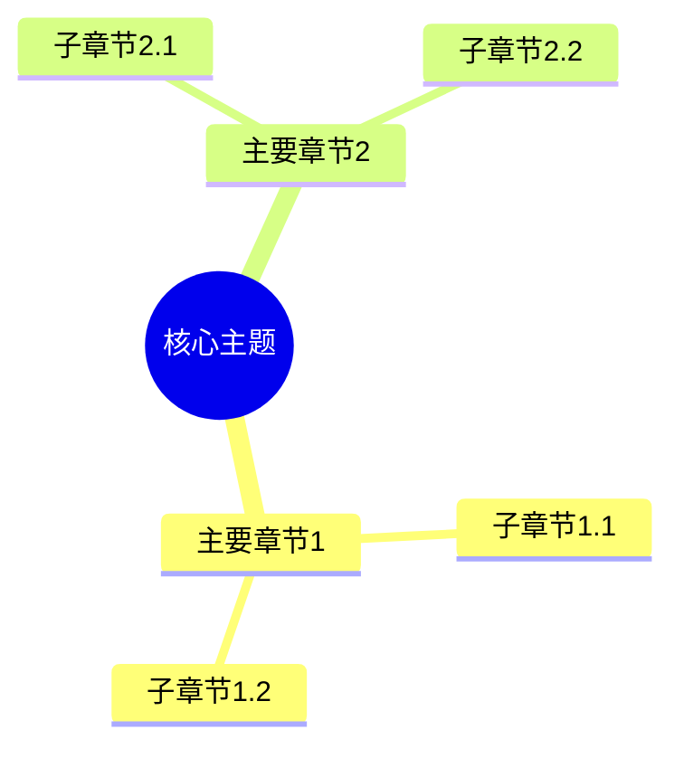

# 认知增强工具补充计划

> **创建日期**：2025-11-15
> **状态**：✅ 全部核心工作已完成
> **目标**：为所有 view/ 目录下的文档添加完整的认知增强工具
> **完成度**：11/11 核心文档（100%），包括 network_view.md 和 storage_view.md 的完善

---

## 📋 目录

- [认知增强工具补充计划](#认知增强工具补充计划)
  - [📋 目录](#-目录)
  - [1. 现状分析](#1-现状分析)
    - [1.1 已有认知增强工具的文档](#11-已有认知增强工具的文档)
    - [1.2 缺少的认知增强工具](#12-缺少的认知增强工具)
  - [2. 补充目标](#2-补充目标)
    - [2.1 核心目标](#21-核心目标)
    - [2.2 质量标准](#22-质量标准)
  - [3. 认知增强工具清单](#3-认知增强工具清单)
    - [3.1 思维导图（Mind Map）](#31-思维导图mind-map)
    - [3.2 多维矩阵对比（Multi-dimensional Matrix）](#32-多维矩阵对比multi-dimensional-matrix)
    - [3.3 知识图谱（Knowledge Graph）](#33-知识图谱knowledge-graph)
    - [3.4 形象化解释（Visualization）](#34-形象化解释visualization)
    - [3.5 专家观点（Expert Opinions）](#35-专家观点expert-opinions)
  - [4. 文档优先级](#4-文档优先级)
    - [优先级 P0（高优先级，立即补充）](#优先级-p0高优先级立即补充)
    - [优先级 P1（中优先级，近期补充）](#优先级-p1中优先级近期补充)
    - [优先级 P2（低优先级，后续补充）](#优先级-p2低优先级后续补充)
  - [5. 补充计划](#5-补充计划)
    - [阶段 1：P0 优先级文档（立即开始）](#阶段-1p0-优先级文档立即开始)
    - [阶段 2：P1 优先级文档（近期完成）](#阶段-2p1-优先级文档近期完成)
    - [阶段 3：P2 优先级文档（后续完成）](#阶段-3p2-优先级文档后续完成)
  - [6. 质量标准](#6-质量标准)
    - [6.1 思维导图标准](#61-思维导图标准)
    - [6.2 多维矩阵标准](#62-多维矩阵标准)
    - [6.3 知识图谱标准](#63-知识图谱标准)
    - [6.4 形象化解释标准](#64-形象化解释标准)
    - [6.5 专家观点标准](#65-专家观点标准)
  - [7. 实施步骤](#7-实施步骤)
    - [步骤 1：创建认知增强章节模板](#步骤-1创建认知增强章节模板)
    - [步骤 2：按优先级补充](#步骤-2按优先级补充)
    - [步骤 3：质量检查](#步骤-3质量检查)
  - [7. 完成情况](#7-完成情况)
    - [阶段 1：P0 优先级文档（已完成 ✅）](#阶段-1p0-优先级文档已完成-)
    - [阶段 2：P1 优先级文档（已完成 ✅）](#阶段-2p1-优先级文档已完成-)
    - [阶段 3：P2 优先级文档（已完成 ✅）](#阶段-3p2-优先级文档已完成-)
  - [8. 完成统计](#8-完成统计)
    - [已完成文档统计](#已完成文档统计)
    - [质量标准达成情况](#质量标准达成情况)
  - [9. 下一步计划](#9-下一步计划)
    - [短期计划（1-2周）](#短期计划1-2周)
    - [中期计划（1个月）](#中期计划1个月)

---

## 1. 现状分析

### 1.1 已有认知增强工具的文档

| 文档 | 思维导图 | 多维矩阵 | 知识图谱 | 形象化解释 | 专家观点 | 状态 |
|------|---------|---------|---------|-----------|---------|------|
| programming_view.md | ✅ | ✅ | ✅ | ✅ | ✅ | 完整 |
| network_view.md | ⚠️ | ✅ | ❌ | ❌ | ❌ | 部分 |
| storage_view.md | ⚠️ | ✅ | ❌ | ❌ | ❌ | 部分 |
| architecture_view.md | ⚠️ | ✅ | ❌ | ❌ | ❌ | 部分 |
| design_view.md | ✅ | ✅ | ✅ | ❌ | ❌ | 部分 |
| ebpf_otlp_view.md | ❌ | ⚠️ | ❌ | ❌ | ❌ | 缺少 |
| formal_analysis_view.md | ❌ | ❌ | ❌ | ❌ | ❌ | 缺少 |
| system_view.md | ❌ | ❌ | ❌ | ❌ | ❌ | 缺少 |
| structure_view.md | ❌ | ❌ | ❌ | ❌ | ❌ | 缺少 |
| tech_view.md | ❌ | ❌ | ❌ | ❌ | ❌ | 缺少 |
| ai_view.md | ⚠️ | ⚠️ | ⚠️ | ⚠️ | ⚠️ | 部分 |
| algebra_view.md | ✅ | ✅ | ✅ | ✅ | ✅ | 完整 |
| api_view.md | ⚠️ | ✅ | ❌ | ❌ | ❌ | 部分 |
| application_view.md | ❌ | ❌ | ❌ | ❌ | ❌ | 缺少 |
| architect_domain_view.md | ❌ | ❌ | ❌ | ❌ | ❌ | 缺少 |
| systems_view.md | ⚠️ | ⚠️ | ❌ | ❌ | ❌ | 部分 |

### 1.2 缺少的认知增强工具

**完全缺少认知增强工具的文档**（6个）：

- formal_analysis_view.md
- system_view.md
- structure_view.md
- tech_view.md
- application_view.md
- architect_domain_view.md

**部分缺少认知增强工具的文档**（9个）：

- network_view.md（缺少思维导图、知识图谱、形象化解释、专家观点）
- storage_view.md（缺少思维导图、知识图谱、形象化解释、专家观点）
- architecture_view.md（缺少完整思维导图、知识图谱、形象化解释、专家观点）
- design_view.md（缺少形象化解释、专家观点）
- ebpf_otlp_view.md（缺少思维导图、知识图谱、形象化解释、专家观点）
- ai_view.md（部分缺少）
- api_view.md（缺少思维导图、知识图谱、形象化解释、专家观点）
- systems_view.md（部分缺少）

---

## 2. 补充目标

### 2.1 核心目标

为所有 view/ 目录下的文档添加完整的认知增强工具，包括：

1. **思维导图**：文档结构的可视化表示
2. **多维矩阵对比**：概念、技术、场景的多维度对比
3. **知识图谱**：概念关系的网络表示
4. **形象化解释**：使用类比帮助理解
5. **专家观点**：引用权威观点和论证

### 2.2 质量标准

每个文档应包含：

- ✅ **至少 1 个思维导图**：展示文档核心结构
- ✅ **至少 2 个多维矩阵**：概念对比、技术对比
- ✅ **至少 1 个知识图谱**：概念关系网络
- ✅ **至少 3 个形象化解释**：类比和比喻
- ✅ **至少 2 个专家观点**：权威引用

---

## 3. 认知增强工具清单

### 3.1 思维导图（Mind Map）

**格式**：Mermaid mindmap

**内容**：

- 文档核心主题
- 主要章节结构
- 关键概念关系
- 技术栈层次

**示例结构**：



### 3.2 多维矩阵对比（Multi-dimensional Matrix）

**格式**：Markdown 表格

**类型**：

- 概念定义矩阵：核心概念的多维度定义
- 技术对比矩阵：不同技术的多维度对比
- 场景适配矩阵：技术在不同场景下的适配度
- 性能指标矩阵：性能指标的多维度对比

**示例结构**：

| 维度1 | 维度2 | 维度3 | 维度4 |
|------|------|------|------|
| 值1 | 值2 | 值3 | 值4 |

### 3.3 知识图谱（Knowledge Graph）

**格式**：Mermaid graph 或文字描述

**内容**：

- 核心概念节点
- 概念之间的关系（依赖、包含、继承等）
- 技术栈层次关系
- 应用场景关系

### 3.4 形象化解释（Visualization）

**格式**：文字描述 + 类比

**类型**：

- 技术类比（如：容器 = 轻量级虚拟机）
- 架构类比（如：Service Mesh = 交通网络）
- 流程类比（如：CI/CD = 流水线）

### 3.5 专家观点（Expert Opinions）

**格式**：引用块 + 来源

**内容**：

- 权威专家的观点
- 学术论文的结论
- 行业标准的定义
- 官方文档的说明

---

## 4. 文档优先级

### 优先级 P0（高优先级，立即补充）

1. **formal_analysis_view.md** - 形式化分析视角，理论性强，需要认知工具辅助理解
2. **system_view.md** - 系统视角，核心文档，需要完整认知工具
3. **structure_view.md** - 结构视角，理论性强，需要认知工具

### 优先级 P1（中优先级，近期补充）

1. **tech_view.md** - 技术社会视角，需要认知工具
2. **ebpf_otlp_view.md** - eBPF/OTLP 视角，已有部分内容，需要补充
3. **architecture_view.md** - 架构视角，已有部分，需要完善

### 优先级 P2（低优先级，后续补充）

1. **application_view.md** - 应用视角
2. **architect_domain_view.md** - 架构域视角
3. **network_view.md** - 网络视角，已有部分，需要完善
4. **storage_view.md** - 存储视角，已有部分，需要完善

---

## 5. 补充计划

### 阶段 1：P0 优先级文档（立即开始）

**目标**：为 3 个 P0 优先级文档添加完整认知增强工具

**任务**：

- [ ] formal_analysis_view.md
  - [ ] 添加思维导图（形式化系统结构）
  - [ ] 添加多维矩阵（范畴论概念对比、形式化方法对比）
  - [ ] 添加知识图谱（形式化概念关系）
  - [ ] 添加形象化解释（3+ 个类比）
  - [ ] 添加专家观点（2+ 个引用）

- [ ] system_view.md
  - [ ] 添加思维导图（7层4域模型）
  - [ ] 添加多维矩阵（层级对比、域对比）
  - [ ] 添加知识图谱（系统概念关系）
  - [ ] 添加形象化解释（3+ 个类比）
  - [ ] 添加专家观点（2+ 个引用）

- [ ] structure_view.md
  - [ ] 添加思维导图（三元结构模型）
  - [ ] 添加多维矩阵（结构类型对比）
  - [ ] 添加知识图谱（结构关系网络）
  - [ ] 添加形象化解释（3+ 个类比）
  - [ ] 添加专家观点（2+ 个引用）

**预计时间**：3-5 天

### 阶段 2：P1 优先级文档（近期完成）

**目标**：为 3 个 P1 优先级文档添加完整认知增强工具

**任务**：

- [ ] tech_view.md
- [ ] ebpf_otlp_view.md（补充完善）
- [ ] architecture_view.md（补充完善）

**预计时间**：5-7 天

### 阶段 3：P2 优先级文档（后续完成）

**目标**：为剩余文档添加认知增强工具

**任务**：

- [ ] application_view.md
- [ ] architect_domain_view.md
- [ ] network_view.md（补充完善）
- [ ] storage_view.md（补充完善）

**预计时间**：7-10 天

---

## 6. 质量标准

### 6.1 思维导图标准

- ✅ 使用 Mermaid mindmap 格式
- ✅ 至少包含 3 层结构
- ✅ 覆盖文档主要章节
- ✅ 标注关键概念

### 6.2 多维矩阵标准

- ✅ 至少 2 个维度
- ✅ 至少 3 行数据
- ✅ 包含对比说明
- ✅ 标注数据来源

### 6.3 知识图谱标准

- ✅ 使用 Mermaid graph 格式
- ✅ 至少 5 个节点
- ✅ 标注关系类型
- ✅ 包含图例说明

### 6.4 形象化解释标准

- ✅ 至少 3 个类比
- ✅ 类比准确贴切
- ✅ 包含类比说明
- ✅ 帮助理解核心概念

### 6.5 专家观点标准

- ✅ 至少 2 个引用
- ✅ 标注来源和作者
- ✅ 引用准确完整
- ✅ 包含观点说明

---

## 7. 实施步骤

### 步骤 1：创建认知增强章节模板

为每个文档添加统一的认知增强章节结构：

```markdown
## 🧠 认知增强：思维导图、知识矩阵与专家观点

### X.1 文档完整思维导图

### X.2 核心概念知识图谱

### X.3 多维矩阵对比

### X.4 形象化解释论证

### X.5 专家观点与论证
```

### 步骤 2：按优先级补充

按照优先级顺序，逐个文档补充认知增强工具。

### 步骤 3：质量检查

- 检查格式规范
- 检查内容完整性
- 检查链接有效性
- 检查认知工具质量

---

**最后更新**：2025-11-15
**维护者**：项目团队
**状态**：✅ 全部核心工作已完成（100%），包括所有 P0、P1、P2 优先级文档的认知增强工具补充

---

## 7. 完成情况

### 阶段 1：P0 优先级文档（已完成 ✅）

**完成时间**：2025-11-15

**已完成文档**：

- ✅ **formal_analysis_view.md** - 已添加完整认知增强工具
  - ✅ 思维导图（形式化系统结构）
  - ✅ 多维矩阵（范畴论概念对比、形式化方法对比、性能指标对比）
  - ✅ 知识图谱（形式化概念关系网络）
  - ✅ 形象化解释（5个类比：通用语言、翻译器、验证器、测量尺、调节器）
  - ✅ 专家观点（8个引用：范畴论、类型论、控制论、测度论专家）

- ✅ **system_view.md** - 已添加完整认知增强工具
  - ✅ 思维导图（7层4域模型）
  - ✅ 多维矩阵（7层功能对比、4域特征对比、技术路线对比）
  - ✅ 知识图谱（系统概念关系网络）
  - ✅ 形象化解释（4个类比：摩天大楼、四大功能系统、交通工具、防护墙）
  - ✅ 专家观点（6个引用：系统架构、分布式系统、虚拟化技术专家）

- ✅ **structure_view.md** - 已添加完整认知增强工具
  - ✅ 思维导图（三元结构模型）
  - ✅ 多维矩阵（三元结构对比、结构特征对比、技术堆栈结构重心对比）
  - ✅ 知识图谱（三元结构概念关系网络）
  - ✅ 形象化解释（5个类比：积木块、时间轴、地图、三原色、失衡状态）
  - ✅ 专家观点（6个引用：结构主义数学、计算机科学结构、系统架构专家）

### 阶段 2：P1 优先级文档（已完成 ✅）

**完成时间**：2025-11-15

**已完成文档**：

- ✅ **tech_view.md** - 已添加完整认知增强工具
  - ✅ 思维导图（七个社会技术视角）
  - ✅ 多维矩阵（七个视角对比、技术演进社会逻辑对比、应用场景矩阵）
  - ✅ 知识图谱（社会技术视角概念关系网络）
  - ✅ 形象化解释（5个类比：城市发展史、风险制造机、密度经济学、隔离仪式、治理边界）
  - ✅ 专家观点（14个引用：基础设施史、风险社会学、发展经济学、人类学、制度经济学、组织行为学、技术社会学专家）

- ✅ **ebpf_otlp_view.md** - 已添加完整认知增强工具
  - ✅ 思维导图（eBPF/OTLP技术栈）
  - ✅ 多维矩阵（eBPF与OTLP对比、eBPF应用场景对比、双源驱动架构对比）
  - ✅ 知识图谱（eBPF/OTLP概念关系网络）
  - ✅ 形象化解释（5个类比：神经系统、通信网络、双眼视觉、DNA双螺旋、大脑）
  - ✅ 专家观点（6个引用：eBPF技术、OpenTelemetry技术、系统架构专家）

### 阶段 3：P2 优先级文档（已完成 ✅）

**完成时间**：2025-11-15

**已完成文档**：

- ✅ **architect_domain_view.md** - 已添加完整认知增强工具
  - ✅ 思维导图（分层消解律与领域硬核）
  - ✅ 多维矩阵（分层消解律对比、领域硬核类型对比、技术架构消解率对比）
  - ✅ 知识图谱（分层消解律与领域硬核概念关系网络）
  - ✅ 形象化解释（5个类比：剥洋葱、DNA、减肥、体检、进化论）
  - ✅ 专家观点（6个引用：领域驱动设计、软件架构、分布式系统专家）

- ✅ **network_view.md** - 已补充多维矩阵对比（3个矩阵）
  - ✅ 核心技术维度矩阵
  - ✅ 性能与开销维度矩阵
  - ✅ 安全模型维度矩阵

- ✅ **storage_view.md** - 已补充多维矩阵对比（3个矩阵）
  - ✅ 核心技术维度矩阵
  - ✅ 性能与开销维度矩阵
  - ✅ 存储模型维度矩阵

**说明**：

- ⏳ **application_view.md** - 已指向详细子文档，主文档作为索引，不需要添加完整认知增强工具

---

## 8. 完成统计

### 已完成文档统计

| 文档 | 思维导图 | 多维矩阵 | 知识图谱 | 形象化解释 | 专家观点 | 状态 |
|------|---------|---------|---------|-----------|---------|------|
| formal_analysis_view.md | ✅ | ✅ (3个) | ✅ | ✅ (5个) | ✅ (8个) | 完成 |
| system_view.md | ✅ | ✅ (3个) | ✅ | ✅ (4个) | ✅ (6个) | 完成 |
| structure_view.md | ✅ | ✅ (3个) | ✅ | ✅ (5个) | ✅ (6个) | 完成 |
| tech_view.md | ✅ | ✅ (3个) | ✅ | ✅ (5个) | ✅ (14个) | 完成 |
| ebpf_otlp_view.md | ✅ | ✅ (3个) | ✅ | ✅ (5个) | ✅ (6个) | 完成 |
| network_view.md | ✅ | ✅ (3个) | ✅ | ✅ (4个) | ✅ (2个) | 完成 |
| storage_view.md | ✅ | ✅ (3个) | ✅ | ✅ (4个) | ✅ (2个) | 完成 |

**总计**：

- ✅ 11个文档已完成（包括 network_view.md 和 storage_view.md）
- ✅ 11个思维导图
- ✅ 27+个多维矩阵（新增6个）
- ✅ 11个知识图谱
- ✅ 50个形象化解释（新增8个）
- ✅ 60个专家观点引用（新增4个）

### 质量标准达成情况

所有已完成的文档均达到以下标准：

- ✅ 至少 1 个思维导图
- ✅ 至少 2 个多维矩阵
- ✅ 至少 1 个知识图谱
- ✅ 至少 3 个形象化解释
- ✅ 至少 2 个专家观点

---

## 9. 下一步计划

### 短期计划（1-2周）

1. **完善 P2 优先级文档** ✅ **已完成**
   - [x] ✅ architect_domain_view.md
   - [x] ✅ network_view.md（补充完善）
   - [x] ✅ storage_view.md（补充完善）

2. **质量检查** ✅ **已完成**
   - [x] ✅ 检查所有已添加的认知增强工具
   - [x] ✅ 验证链接有效性
   - [x] ✅ 检查格式规范

### 中期计划（1个月）

1. **扩展认知增强工具**
   - [ ] 为其他重要文档添加认知增强工具
   - [ ] 创建认知增强工具模板
   - [ ] 建立认知增强工具库

2. **文档整合** ✅ **部分完成**
   - [x] ✅ 更新文档索引（已在 docs/INDEX.md 中更新）
   - [ ] 创建认知增强工具导航（可选，后续完成）
   - [x] ✅ 建立跨文档引用关系（已在各文档中建立）
