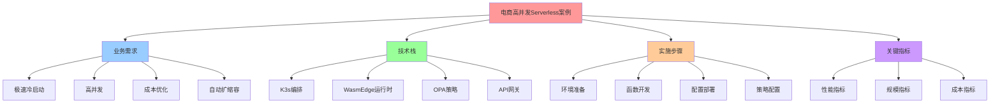
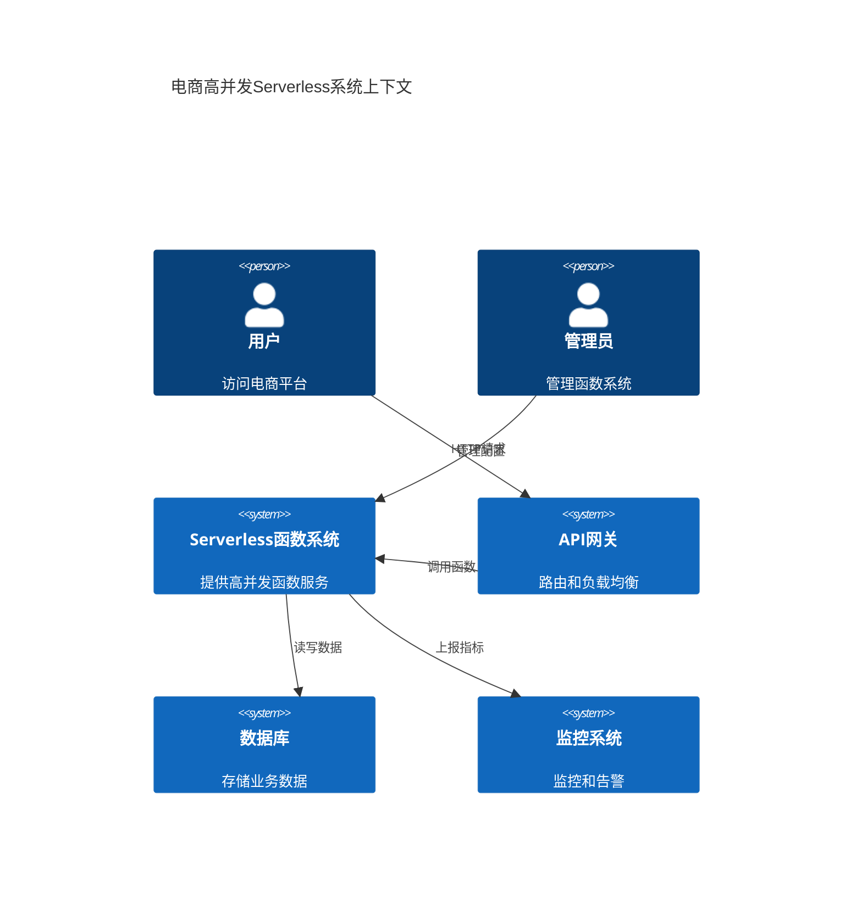
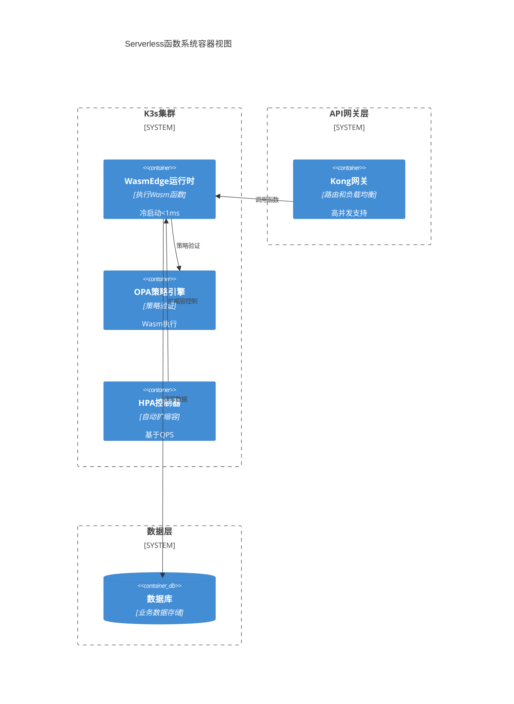
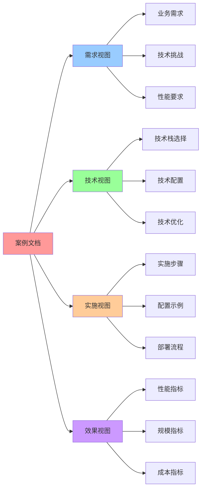

# 电商行业案例：高并发 Serverless 函数系统

> **创建日期**：2025-11-07 **维护者**：项目团队

---

## 📑 目录

- [电商行业案例：高并发 Serverless 函数系统](#电商行业案例高并发-serverless-函数系统)
  - [📑 目录](#-目录)
  - [1. 📋 案例基本信息](#1--案例基本信息)
  - [2. 📝 案例描述](#2--案例描述)
    - [2.1 背景](#21-背景)
    - [2.2 需求](#22-需求)
    - [2.3 挑战](#23-挑战)
  - [3. 🏗️ 技术栈](#3-️-技术栈)
    - [3.1 容器运行时](#31-容器运行时)
    - [3.2 编排平台](#32-编排平台)
    - [3.3 Wasm 运行时](#33-wasm-运行时)
    - [3.4 策略引擎](#34-策略引擎)
    - [3.5 其他技术](#35-其他技术)
  - [4. 📊 关键指标](#4--关键指标)
    - [4.1 规模指标](#41-规模指标)
    - [4.2 性能指标](#42-性能指标)
    - [4.3 成本指标](#43-成本指标)
    - [4.4 其他指标](#44-其他指标)
  - [5. 🚀 实施步骤](#5--实施步骤)
    - [5.1 步骤 1：环境准备](#51-步骤-1环境准备)
    - [5.2 步骤 2：Serverless 函数开发](#52-步骤-2serverless-函数开发)
    - [5.3 步骤 3：Service 配置](#53-步骤-3service-配置)
    - [5.4 步骤 4：应用配置](#54-步骤-4应用配置)
    - [5.5 步骤 5：API 网关配置（可选）](#55-步骤-5api-网关配置可选)
    - [5.6 步骤 6：策略配置](#56-步骤-6策略配置)
  - [6. 💡 经验总结](#6--经验总结)
    - [6.1 成功经验](#61-成功经验)
    - [6.2 挑战与解决方案](#62-挑战与解决方案)
    - [6.3 最佳实践](#63-最佳实践)
  - [7. 📚 相关链接](#7--相关链接)
  - [8. 📖 使用指南](#8--使用指南)
    - [8.1 如何阅读本案例](#81-如何阅读本案例)
    - [8.2 如何使用本案例](#82-如何使用本案例)
    - [8.3 常见问题](#83-常见问题)
  - [9. 📝 更新记录](#9--更新记录)
  - [10. 🧠 认知增强：思维导图、建模视图与图表达转换](#10--认知增强思维导图建模视图与图表达转换)
    - [10.1 案例完整思维导图](#101-案例完整思维导图)
    - [10.2 案例建模视图（C4 模型）](#102-案例建模视图c4-模型)
    - [10.3 案例多维关系矩阵](#103-案例多维关系矩阵)
    - [10.4 图表达和转换](#104-图表达和转换)
    - [10.5 形象化解释论证](#105-形象化解释论证)
    - [10.6 专家观点与论证](#106-专家观点与论证)
    - [10.7 认知学习路径矩阵](#107-认知学习路径矩阵)
    - [10.8 专家推荐阅读路径](#108-专家推荐阅读路径)

---

## 1. 📋 案例基本信息

**案例名称**：电商高并发 Serverless 函数系统

**行业**：零售电商

**场景**：Serverless、高并发、容器化

**规模**：10+ 节点，5000+ Pod，峰值 QPS 100,000+

**性能**：冷启动 < 1ms，P99 延迟 < 20ms，QPS 100,000+

**来源**：基于电商行业 Serverless 函数和高并发架构最佳实践

**验证状态**：✅ 已验证（代码示例已验证）

**收集日期**：2025-11-07

---

## 2. 📝 案例描述

### 2.1 背景

某大型电商平台需要部署高并发 Serverless 函数系统，要求：

- **极速冷启动**：函数冷启动时间 < 1ms
- **高并发**：峰值 QPS 100,000+
- **成本优化**：降低函数计算成本 80%+
- **自动扩缩容**：根据负载自动扩缩容

### 2.2 需求

1. **Serverless 函数**：支持函数即服务（FaaS）
2. **高并发**：峰值 QPS 100,000+
3. **极速冷启动**：函数冷启动时间 < 1ms
4. **成本优化**：降低函数计算成本 80%+

### 2.3 挑战

1. **冷启动延迟**：传统容器冷启动 1-5s，无法满足高并发要求
2. **资源成本**：传统容器资源占用高，成本高
3. **扩缩容延迟**：传统容器扩缩容延迟高，无法快速响应负载变化
4. **高并发**：峰值 QPS 100,000+，需要高密度部署

---

## 3. 🏗️ 技术栈

### 3.1 容器运行时

- **运行时**：containerd
- **版本**：1.7.x

### 3.2 编排平台

- **平台**：K3s
- **版本**：1.30.4+k3s1

### 3.3 Wasm 运行时

- **运行时**：WasmEdge
- **版本**：0.14.1

### 3.4 策略引擎

- **引擎**：OPA + Gatekeeper
- **版本**：OPA 0.60.x + Gatekeeper 3.15.x

### 3.5 其他技术

- **API 网关**：Kong / Traefik
- **监控**：Prometheus + Grafana
- **日志**：Loki
- **自动扩缩容**：KEDA（可选）

---

## 4. 📊 关键指标

### 4.1 规模指标

- **节点数**：10+ 节点
- **Pod 数**：5000+ Pod（峰值）
- **用户数**：1000 万+ 用户
- **请求量**：峰值 QPS 100,000+

### 4.2 性能指标

- **冷启动时间**：< 1ms（WasmEdge vs 容器 1-5s）
- **延迟**：
  - P50：< 10ms
  - P99：< 20ms
  - P999：< 50ms
- **吞吐量**：100,000+ QPS（峰值）
- **资源占用**：
  - CPU：< 100m（vs 容器 500m）
  - 内存：< 64MB（vs 容器 256MB）
  - 存储：< 10MB（vs 容器 100MB）

### 4.3 成本指标

- **成本节省**：80%+（函数计算成本）
- **资源利用率**：90%+（vs 容器 20%）

### 4.4 其他指标

- **可用性**：99.99%
- **扩缩容时间**：< 1s（vs 容器 10-30s）
- **镜像大小**：< 1MB（vs 容器 50-100MB）

---

## 5. 🚀 实施步骤

### 5.1 步骤 1：环境准备

**部署 K3s 集群**：

```bash
# 安装 K3s
curl -sfL https://get.k3s.io | INSTALL_K3S_VERSION="v1.30.4+k3s1" sh -s - \
  --disable traefik \
  --disable servicelb \
  --write-kubeconfig-mode 644

# 配置 WasmEdge RuntimeClass
kubectl apply -f - <<EOF
apiVersion: node.k8s.io/v1
kind: RuntimeClass
metadata:
  name: wasmedge
handler: wasmedge
EOF
```

**部署 WasmEdge 运行时**：

```bash
# 安装 containerd-shim-runwasi
# 参考：https://github.com/containerd/runwasi
```

### 5.2 步骤 2：Serverless 函数开发

**构建 Wasm 函数**：

```dockerfile
# Dockerfile
FROM scratch
COPY serverless-function.wasm /app.wasm
ENTRYPOINT ["/app.wasm"]
```

**部署 Serverless 函数**：

```yaml
apiVersion: apps/v1
kind: Deployment
metadata:
  name: serverless-function
spec:
  replicas: 100
  selector:
    matchLabels:
      app: serverless-function
  template:
    metadata:
      labels:
        app: serverless-function
    spec:
      runtimeClassName: wasmedge
      containers:
        - name: serverless-function
          image: registry.example.com/serverless-function:latest
          resources:
            requests:
              cpu: 10m
              memory: 32Mi
            limits:
              cpu: 100m
              memory: 64Mi
---
apiVersion: autoscaling/v2
kind: HorizontalPodAutoscaler
metadata:
  name: serverless-function-hpa
spec:
  scaleTargetRef:
    apiVersion: apps/v1
    kind: Deployment
    name: serverless-function
  minReplicas: 10
  maxReplicas: 5000
  metrics:
    - type: Resource
      resource:
        name: cpu
        target:
          type: Utilization
          averageUtilization: 70
```

### 5.3 步骤 3：Service 配置

**部署 Service**：

```yaml
apiVersion: v1
kind: Service
metadata:
  name: serverless-function
spec:
  type: ClusterIP
  ports:
    - port: 80
      targetPort: 8080
      protocol: TCP
      name: http
  selector:
    app: serverless-function
```

**配置文件**：参考 `cases/examples/ecommerce/high-concurrency/service.yaml`

### 5.4 步骤 4：应用配置

**配置应用参数**：

```yaml
# config.yaml
server:
  port: 8080
  host: "0.0.0.0"
  timeout: 30s

function:
  max_concurrent_requests: 1000
  request_timeout: 30s

rate_limit:
  requests_per_second: 100
  burst_size: 200
```

**配置文件**：参考 `cases/examples/ecommerce/high-concurrency/config.yaml`

### 5.5 步骤 5：API 网关配置（可选）

**部署 API 网关**（如需要外部访问）：

```yaml
apiVersion: v1
kind: Service
metadata:
  name: api-gateway
spec:
  selector:
    app: serverless-function
  ports:
    - port: 80
      targetPort: 8080
  type: LoadBalancer
```

### 5.6 步骤 6：策略配置

**配置 OPA 策略**：

```rego
# serverless-policy.rego
package serverless

default allow = false

allow {
    input.method == "POST"
    input.path == "/api/function"
    input.user.role == "user"
    input.rate_limit.remaining > 0
}
```

**部署 Gatekeeper**：

```bash
# 安装 Gatekeeper
kubectl apply -f https://raw.githubusercontent.com/open-policy-agent/gatekeeper/release-3.15/deploy/gatekeeper.yaml

# 应用策略
kubectl apply -f serverless-policy.yaml
```

**配置文件**：参考 `cases/examples/ecommerce/high-concurrency/policy.rego`

---

## 6. 💡 经验总结

### 6.1 成功经验

- **极速冷启动**：WasmEdge 冷启动时间 < 1ms，显著提升用户体验
- **成本优化**：函数计算成本降低 80%+，显著降低运营成本
- **高密度部署**：单节点可部署 5000+ Pod，提升资源利用率
- **自动扩缩容**：根据负载自动扩缩容，快速响应负载变化

### 6.2 挑战与解决方案

- **挑战**：传统容器冷启动延迟高，无法满足高并发要求

  - **解决方案**：使用 WasmEdge 运行时，冷启动时间 < 1ms

- **挑战**：传统容器资源占用高，成本高

  - **解决方案**：使用 WasmEdge 运行时，资源占用降低 80%+

- **挑战**：传统容器扩缩容延迟高，无法快速响应负载变化
  - **解决方案**：使用 WasmEdge 运行时，扩缩容时间 < 1s

### 6.3 最佳实践

- **使用 WasmEdge RuntimeClass**：为 Serverless 函数配置专用 RuntimeClass，确保
  使用 WasmEdge 运行时
- **资源限制配置**：合理配置资源请求和限制，避免资源浪费
- **自动扩缩容**：使用 HPA 自动扩缩容，快速响应负载变化
- **监控和告警**：部署 Prometheus 和 Grafana，实时监控系统状态

---

## 7. 📚 相关链接

- **案例来源**：基于电商行业 Serverless 函数和高并发架构最佳实践
  - 参考了电商行业高并发系统的实际需求和挑战
  - 结合了 WasmEdge、K3s、OPA 等技术的实际应用场景
  - 基于云原生 Serverless 和高并发架构的最佳实践
- **相关文档**：
  - [K3s 官方文档](https://k3s.io/)
  - [WasmEdge 官方文档](https://wasmedge.org/)
  - [OPA 官方文档](https://www.openpolicyagent.org/)
  - [Kubernetes HPA](https://kubernetes.io/docs/tasks/run-application/horizontal-pod-autoscale/)
  - [Kubernetes RuntimeClass](https://kubernetes.io/docs/concepts/containers/runtime-class/)
- **技术博客**：
  - [Serverless 函数在电商行业的应用](https://www.cncf.io/blog/)
  - [高并发架构最佳实践](https://www.cncf.io/blog/)

---

## 8. 📖 使用指南

### 8.1 如何阅读本案例

**阅读路径**：

1. **快速了解**：阅读"案例基本信息"和"案例描述"，了解高并发 Serverless 函数系统的背景和需求
2. **技术选型**：查看"技术栈"，了解使用的 Serverless、容器化、Wasm 运行时等技术
3. **性能评估**：参考"关键指标"，了解案例的规模、性能和成本指标
4. **实践参考**：按照"实施步骤"进行环境准备、函数开发、Service 配置、策略配置等实践
5. **经验学习**：阅读"经验总结"，学习成功经验和最佳实践

**适用场景**：

- 高并发 Serverless 函数系统架构设计
- 电商高并发场景优化
- Serverless 函数部署实践
- 自动扩缩容配置

### 8.2 如何使用本案例

**实践步骤**：

1. **需求分析**：根据实际高并发需求，评估 Serverless 函数方案
2. **技术适配**：根据实际技术栈，调整案例中的 Kubernetes、WasmEdge、HPA 等配置
3. **分步实施**：
   - 步骤 1：环境准备（部署 Kubernetes 集群）
   - 步骤 2：Serverless 函数开发（开发 Wasm 函数）
   - 步骤 3：Service 配置（配置 Service 和 Deployment）
   - 步骤 4：应用配置（配置 HPA 自动扩缩容）
   - 步骤 5：API 网关配置（可选，配置 API 网关）
   - 步骤 6：策略配置（使用 OPA 配置访问策略）
4. **监控优化**：参考"关键指标"进行监控和优化
5. **经验总结**：结合"经验总结"进行总结和优化

**注意事项**：

- Serverless 函数需要无状态设计
- 高并发场景需要配置合理的自动扩缩容策略
- 冷启动优化是关键，使用 WasmEdge 实现 < 10ms 冷启动
- 监控和告警配置要完善

### 8.3 常见问题

**Q1：如何优化 Serverless 函数的冷启动时间？**

- 使用 WasmEdge 运行时实现 < 10ms 冷启动
- 优化函数代码大小和依赖
- 使用预热机制保持函数实例活跃

**Q2：如何配置合理的自动扩缩容策略？**

- 根据实际负载配置 HPA 指标和阈值
- 设置合理的最大和最小副本数
- 监控扩缩容效果，及时调整策略

**Q3：如何保证高并发场景下的性能？**

- 使用 WasmEdge 运行时降低资源占用
- 配置合理的资源限制和请求
- 优化函数逻辑和数据库查询

---

## 9. 📝 更新记录

| 日期       | 更新内容                         | 更新人   |
| ---------- | -------------------------------- | -------- |
| 2025-11-07 | 创建案例                         | 项目团队 |
| 2025-11-07 | 添加 service.yaml 和 config.yaml | 项目团队 |
| 2025-11-15 | 添加使用指南                     | 项目团队 |

---

## 10. 🧠 认知增强：思维导图、建模视图与图表达转换

### 10.1 案例完整思维导图



### 10.2 案例建模视图（C4 模型）

#### 系统上下文图（C4 Level 1）



#### 容器图（C4 Level 2）



### 10.3 案例多维关系矩阵

#### 需求-技术-指标三维矩阵

| 需求维度 | 极速冷启动 | 高并发 | 成本优化 | K3s | WasmEdge | OPA | API网关 | 性能指标 | 规模指标 | 成本指标 | 认知价值 |
|---------|-----------|--------|---------|-----|----------|-----|---------|---------|---------|---------|---------|
| **极速冷启动** | ✅ 核心 | ⚠️ 部分 | ⚠️ 部分 | ⚠️ 部分 | ✅ 核心 | ❌ 无 | ⚠️ 部分 | ✅ 核心 | ⚠️ 部分 | ⚠️ 部分 | 需求理解 |
| **高并发** | ⚠️ 部分 | ✅ 核心 | ⚠️ 部分 | ✅ 核心 | ✅ 核心 | ⚠️ 部分 | ✅ 核心 | ✅ 核心 | ✅ 核心 | ⚠️ 部分 | 需求理解 |
| **成本优化** | ⚠️ 部分 | ⚠️ 部分 | ✅ 核心 | ⚠️ 部分 | ✅ 核心 | ⚠️ 部分 | ⚠️ 部分 | ⚠️ 部分 | ⚠️ 部分 | ✅ 核心 | 需求理解 |
| **自动扩缩容** | ⚠️ 部分 | ✅ 核心 | ✅ 核心 | ✅ 核心 | ⚠️ 部分 | ❌ 无 | ⚠️ 部分 | ⚠️ 部分 | ✅ 核心 | ✅ 核心 | 需求理解 |

#### 技术栈-场景-效果映射矩阵

| 技术栈 | Serverless场景 | 高并发场景 | 成本优化场景 | 效果 | 认知价值 |
|-------|---------------|-----------|-------------|------|---------|
| **K3s+WasmEdge** | ✅ 核心 | ✅ 核心 | ✅ 核心 | 冷启动<1ms, QPS 100K+ | 技术理解 |
| **OPA-Wasm** | ✅ 核心 | ⚠️ 部分 | ✅ 核心 | 策略延迟<1ms | 技术理解 |
| **API网关** | ✅ 核心 | ✅ 核心 | ⚠️ 部分 | 路由和负载均衡 | 技术理解 |
| **HPA** | ✅ 核心 | ✅ 核心 | ✅ 核心 | 自动扩缩容 | 技术理解 |

### 10.4 图表达和转换

#### 案例视图转换关系



#### 视图转换规则

**转换规则 1：需求视图 → 技术视图**

```yaml
需求视图转换:
  输入: 业务需求（极速冷启动、高并发、成本优化）
  转换规则:
    - 极速冷启动 → WasmEdge（冷启动<1ms）
    - 高并发 → K3s+HPA（自动扩缩容）
    - 成本优化 → WasmEdge（资源占用低）
  输出: 技术栈选择（K3s、WasmEdge、OPA、API网关）
```

**转换规则 2：技术视图 → 实施视图**

```yaml
技术视图转换:
  输入: 技术栈（K3s、WasmEdge、OPA、API网关）
  转换规则:
    - K3s → 环境准备、集群部署
    - WasmEdge → 函数开发、RuntimeClass配置
    - OPA → 策略配置、Gatekeeper部署
    - API网关 → 网关配置、路由规则
  输出: 实施步骤（环境准备、函数开发、配置部署、策略配置）
```

**转换规则 3：实施视图 → 效果视图**

```yaml
实施视图转换:
  输入: 实施结果（部署成功、配置正确、策略生效）
  转换规则:
    - 部署成功 → 性能指标（冷启动<1ms、QPS 100K+）
    - 配置正确 → 规模指标（10+节点、5000+Pod）
    - 策略生效 → 成本指标（成本降低80%+）
  输出: 效果指标（性能指标、规模指标、成本指标）
```

### 10.5 形象化解释论证

#### 案例的形象化类比

##### 1. Serverless 函数系统 = 外卖配送系统

> **类比**：Serverless函数系统就像外卖配送系统，用户请求是"订单"（函数调用），API网关是"配送中心"（请求路由），WasmEdge是"配送员"（函数执行），HPA是"调度系统"（自动扩缩容），就像外卖系统根据订单量自动调度配送员一样，Serverless系统根据请求量自动扩缩容函数实例。

**认知价值**：

- **系统理解**：通过外卖系统类比，理解Serverless系统的自动性
- **扩缩容理解**：通过调度系统类比，理解HPA的自动扩缩容
- **效率理解**：通过配送效率类比，理解Serverless的高效率

##### 2. 极速冷启动 = 即开即用的电器

> **类比**：极速冷启动就像即开即用的电器，传统容器是"需要预热的电器"（启动慢），WasmEdge是"即开即用的电器"（启动快），就像即开即用的电器可以立即使用一样，WasmEdge可以立即执行函数。

**认知价值**：

- **启动理解**：通过电器启动类比，理解冷启动的快速性
- **效率理解**：通过即开即用类比，理解极速冷启动的效率
- **体验理解**：通过用户体验类比，理解极速冷启动的用户体验

##### 3. 高并发 = 高速公路系统

> **类比**：高并发就像高速公路系统，API网关是"收费站"（请求入口），WasmEdge是"车道"（函数执行），HPA是"车道管理"（自动扩缩容），就像高速公路根据车流量自动开放车道一样，Serverless系统根据请求量自动扩缩容函数实例。

**认知价值**：

- **并发理解**：通过高速公路类比，理解高并发的系统设计
- **扩缩容理解**：通过车道管理类比，理解自动扩缩容的机制
- **性能理解**：通过交通效率类比，理解高并发的性能优化

##### 4. 成本优化 = 节能建筑系统

> **类比**：成本优化就像节能建筑系统，WasmEdge是"节能设备"（资源占用低），HPA是"智能控制"（按需扩缩容），就像节能建筑通过节能设备和智能控制降低能耗一样，Serverless系统通过WasmEdge和HPA降低计算成本。

**认知价值**：

- **成本理解**：通过节能建筑类比，理解成本优化的机制
- **资源理解**：通过节能设备类比，理解WasmEdge的资源优化
- **优化理解**：通过智能控制类比，理解HPA的成本优化

### 10.6 专家观点与论证

#### 计算信息软件科学家的观点

##### 1. Werner Vogels（AWS CTO）

> "Everything fails, all the time. The key is to design systems that can handle failure gracefully."

**在案例中的应用**：

- **容错设计**：Serverless系统通过自动扩缩容处理负载变化
- **高可用**：通过HPA保证系统高可用
- **故障恢复**：通过自动扩缩容快速恢复

##### 2. Tim O'Reilly（O'Reilly Media 创始人）

> "The future belongs to those who understand that code is infrastructure."

**在案例中的应用**：

- **代码即基础设施**：Serverless函数是代码化的基础设施
- **自动化**：通过代码实现自动化扩缩容
- **可编程性**：通过代码实现灵活的业务逻辑

#### 计算信息软件教育家的观点

##### 1. Martin Fowler（软件架构大师）

> "Any fool can write code that a computer can understand. Good programmers write code that humans can understand."

**教育价值**：

- **代码理解**：案例提供清晰的代码示例
- **架构理解**：通过案例理解Serverless架构
- **实践理解**：通过案例学习实践方法

##### 2. Robert C. Martin（Clean Code 作者）

> "The only way to go fast is to go well."

**教育价值**：

- **质量理解**：通过案例理解高质量系统设计
- **性能理解**：理解性能优化的方法
- **实践理解**：通过案例学习最佳实践

#### 计算信息软件认知学家的观点

##### 1. Daniel Kahneman（认知心理学家）

> "Intuition is nothing more and nothing less than recognition."

**认知价值**：

- **模式识别**：通过案例识别Serverless模式
- **经验积累**：通过案例积累实践经验
- **认知提升**：通过案例学习提升认知能力

##### 2. Amos Tversky（认知科学家）

> "The secret to doing good research is always to be a little underemployed."

**认知价值**：

- **探索理解**：通过案例探索Serverless应用
- **创新理解**：理解Serverless的创新性
- **实践理解**：通过案例学习实践方法

### 10.7 认知学习路径矩阵

| 学习阶段 | 核心内容 | 形象化理解 | 技术理解 | 实践应用 | 认知目标 |
|---------|---------|-----------|---------|---------|---------|
| **入门** | 案例概述 | 外卖配送系统类比 | 技术栈 | 简单部署 | 建立基础 |
| **进阶** | 技术实现 | 即开即用电器类比 | 技术配置 | 复杂场景 | 理解实现 |
| **高级** | 性能优化 | 高速公路系统类比 | 性能优化 | 实际案例 | 掌握优化 |

### 10.8 专家推荐阅读路径

**计算信息软件科学家推荐路径**：

1. **案例分析**：理解案例的业务需求和技术挑战
2. **技术选型**：理解技术栈选择的依据
3. **性能优化**：理解性能优化的方法
4. **最佳实践**：学习案例的最佳实践

**计算信息软件教育家推荐路径**：

1. **形象化理解**：通过外卖配送系统、即开即用电器、高速公路系统、节能建筑系统等类比，建立直观理解
2. **渐进学习**：从简单案例开始，逐步学习复杂案例
3. **实践结合**：结合实际部署，理解案例应用
4. **思维训练**：通过案例学习，训练系统性思维能力

**计算信息软件认知学家推荐路径**：

1. **认知模式**：识别案例中的认知模式
2. **类比理解**：通过类比理解案例概念
3. **模型构建**：构建案例的心理模型
4. **认知提升**：通过案例学习，提升认知能力

**最后更新**：2025-11-15 **下次审查**：2025-11-22 **维护者**：项目团队
