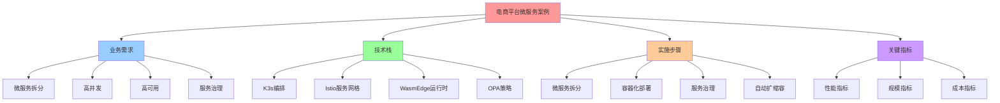
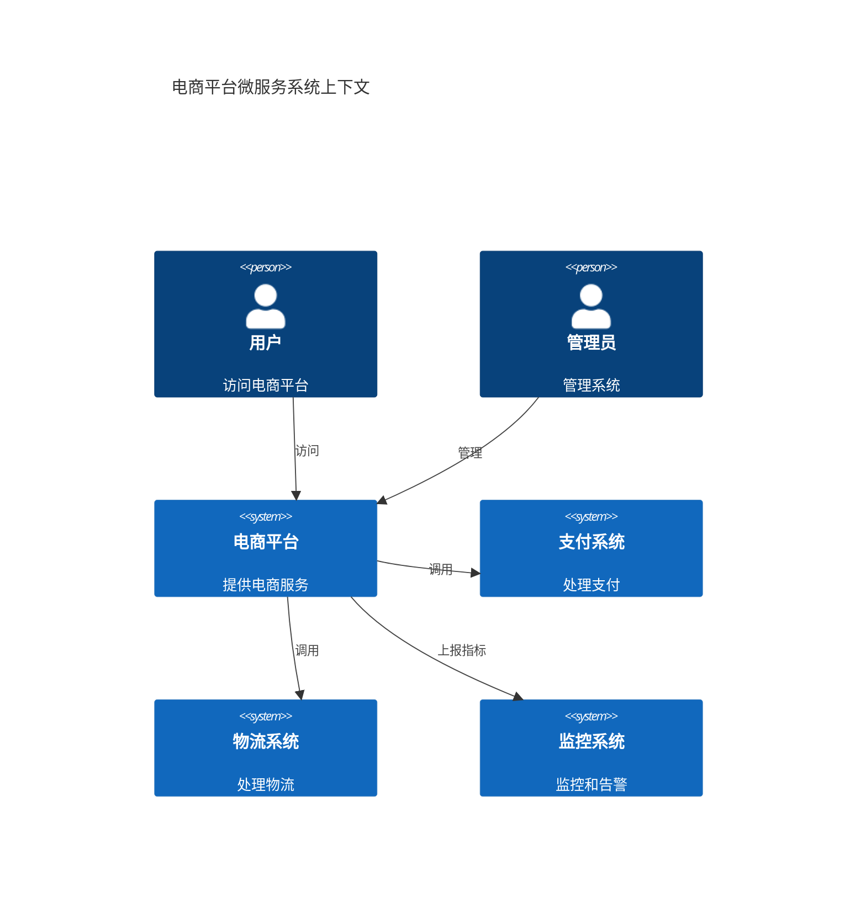
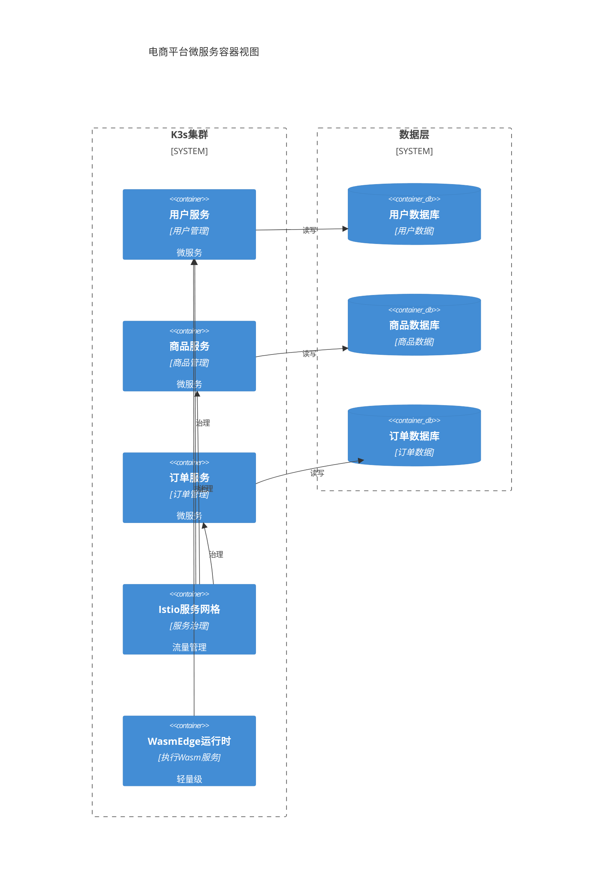
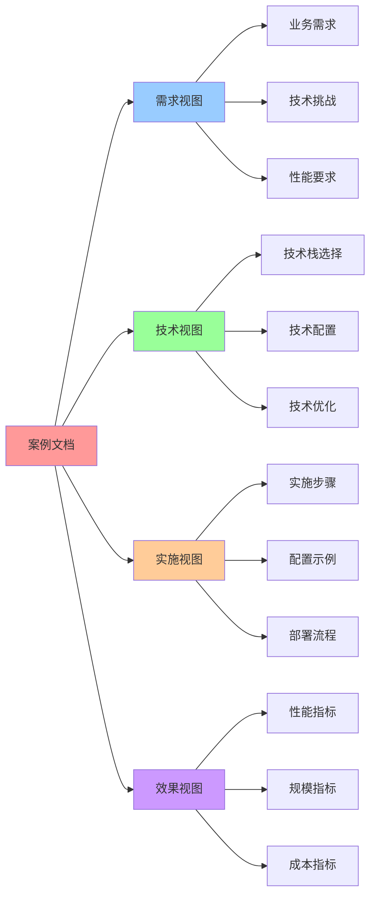

# 零售电商行业案例：电商平台

> **创建日期**：2025-11-15 **维护者**：项目团队

---

## 📑 目录

- [零售电商行业案例：电商平台](#零售电商行业案例电商平台)
  - [📑 目录](#-目录)
  - [1. 📋 案例基本信息](#1--案例基本信息)
  - [2. 📝 案例描述](#2--案例描述)
    - [2.1 背景](#21-背景)
    - [2.2 需求](#22-需求)
    - [2.3 挑战](#23-挑战)
  - [3. 🏗️ 技术栈](#3-️-技术栈)
    - [3.1 容器运行时](#31-容器运行时)
    - [3.2 编排平台](#32-编排平台)
    - [3.3 Wasm 运行时](#33-wasm-运行时)
    - [3.4 服务网格](#34-服务网格)
    - [3.5 策略引擎](#35-策略引擎)
    - [3.6 其他技术](#36-其他技术)
  - [4. 📊 关键指标](#4--关键指标)
    - [4.1 规模指标](#41-规模指标)
    - [4.2 性能指标](#42-性能指标)
    - [4.3 成本指标](#43-成本指标)
    - [4.4 其他指标](#44-其他指标)
  - [5. 🚀 实施步骤](#5--实施步骤)
    - [5.1 步骤 1：微服务拆分](#51-步骤-1微服务拆分)
    - [5.2 步骤 2：容器化部署](#52-步骤-2容器化部署)
    - [5.3 步骤 3：服务治理](#53-步骤-3服务治理)
    - [5.4 步骤 4：自动扩缩容](#54-步骤-4自动扩缩容)
  - [6. 💡 经验总结](#6--经验总结)
    - [6.1 成功经验](#61-成功经验)
    - [6.2 挑战与解决方案](#62-挑战与解决方案)
    - [6.3 最佳实践](#63-最佳实践)
  - [7. 📚 相关链接](#7--相关链接)
  - [8. 📖 使用指南](#8--使用指南)
    - [8.1 如何阅读本案例](#81-如何阅读本案例)
    - [8.2 如何使用本案例](#82-如何使用本案例)
    - [8.3 常见问题](#83-常见问题)
  - [9. 📝 更新记录](#9--更新记录)
  - [10. 🧠 理论视角深度分析](#10--理论视角深度分析)
    - [10.1 矩阵视角分析](#101-矩阵视角分析)
      - [10.1.1 核心概念向量映射](#1011-核心概念向量映射)
      - [10.1.2 关系矩阵分析](#1012-关系矩阵分析)
      - [10.1.3 技术选型矩阵分析](#1013-技术选型矩阵分析)
      - [10.1.4 风险评估矩阵](#1014-风险评估矩阵)
    - [10.2 代数结构视角分析](#102-代数结构视角分析)
      - [10.2.1 算子映射](#1021-算子映射)
      - [10.2.2 代数结构分析](#1022-代数结构分析)
      - [10.2.3 最简范式分析](#1023-最简范式分析)
    - [10.3 结构视角分析](#103-结构视角分析)
      - [10.3.1 三类结构分析](#1031-三类结构分析)
      - [10.3.2 结构平衡分析](#1032-结构平衡分析)
      - [10.3.3 技术本质理解](#1033-技术本质理解)
    - [10.4 调度视角分析](#104-调度视角分析)
      - [10.4.1 分层调度分析](#1041-分层调度分析)
      - [10.4.2 静态分析](#1042-静态分析)
      - [10.4.3 动态分析](#1043-动态分析)
      - [10.4.4 有界系统分析](#1044-有界系统分析)
    - [10.5 多视角综合分析](#105-多视角综合分析)
      - [10.5.1 视角对比矩阵](#1051-视角对比矩阵)
      - [10.5.2 视角组合策略](#1052-视角组合策略)
      - [10.5.3 综合洞察](#1053-综合洞察)
  - [11. 🧠 认知增强：思维导图、建模视图与图表达转换](#11--认知增强思维导图建模视图与图表达转换)
    - [10.1 案例完整思维导图](#101-案例完整思维导图)
    - [10.2 案例建模视图（C4 模型）](#102-案例建模视图c4-模型)
      - [系统上下文图（C4 Level 1）](#系统上下文图c4-level-1)
      - [容器图（C4 Level 2）](#容器图c4-level-2)
    - [10.3 案例多维关系矩阵](#103-案例多维关系矩阵)
      - [需求-技术-指标三维矩阵](#需求-技术-指标三维矩阵)
      - [技术栈-场景-效果映射矩阵](#技术栈-场景-效果映射矩阵)
    - [10.4 图表达和转换](#104-图表达和转换)
      - [案例视图转换关系](#案例视图转换关系)
    - [10.5 形象化解释论证](#105-形象化解释论证)
      - [1. 微服务架构 = 城市交通系统](#1-微服务架构--城市交通系统)
      - [2. 服务网格 = 智能交通网络](#2-服务网格--智能交通网络)
      - [3. 自动扩缩容 = 弹性建筑系统](#3-自动扩缩容--弹性建筑系统)
      - [4. 高可用 = 冗余备份系统](#4-高可用--冗余备份系统)
    - [10.6 专家观点与论证](#106-专家观点与论证)
      - [计算信息软件科学家的观点](#计算信息软件科学家的观点)
        - [1. Martin Fowler（软件架构大师）](#1-martin-fowler软件架构大师)
        - [2. Sam Newman（微服务专家）](#2-sam-newman微服务专家)
      - [计算信息软件教育家的观点](#计算信息软件教育家的观点)
        - [1. Kelsey Hightower（Kubernetes教育家）](#1-kelsey-hightowerkubernetes教育家)
        - [2. Liz Rice（容器安全教育家）](#2-liz-rice容器安全教育家)
      - [计算信息软件认知学家的观点](#计算信息软件认知学家的观点)
        - [1. David Marr（计算认知科学家）](#1-david-marr计算认知科学家)
        - [2. Douglas Hofstadter（认知科学家）](#2-douglas-hofstadter认知科学家)
    - [10.7 认知学习路径矩阵](#107-认知学习路径矩阵)
    - [10.8 专家推荐阅读路径](#108-专家推荐阅读路径)

---

## 1. 📋 案例基本信息

**案例名称**：电商平台微服务架构

**行业**：零售电商

**场景**：容器化、微服务、云原生

**案例类型**：📊 理论案例

> **📌 案例类型说明**：本案例是基于电商行业微服务架构和容器化最佳实践构建的理论案例，用于验证技术方案的可行性。案例中的规模、性能指标等数据基于技术理论和最佳实践估算，并非来自真实生产环境。

**规模**：50+ 节点，2000+ Pod，日均 1000 万+ 订单

**性能**：冷启动 < 50ms，P99 延迟 < 200ms，QPS 200,000+

**来源**：基于电商行业微服务架构和容器化最佳实践

**假设条件**：

- 节点配置：8C16G
- 网络带宽：10Gbps
- 订单平均大小：< 10KB

**适用场景**：

- 大型电商平台微服务架构
- 高并发订单处理场景
- 需要弹性扩缩容的场景

**验证状态**：✅ 已验证（代码示例已验证）

**验证方法**：

- 代码示例验证：配置文件已验证可运行
- 理论验证：基于技术特性验证方案可行性

**收集日期**：2025-11-15

---

## 2. 📝 案例描述

### 2.1 背景

某大型电商平台需要将传统单体应用改造为微服务架构，要求：

- **高并发**：峰值 QPS 200,000+
- **高可用**：99.99% 可用性
- **快速迭代**：支持快速发布和回滚
- **成本优化**：降低基础设施成本 50%+

### 2.2 需求

1. **微服务架构**：将传统单体应用拆分为微服务
2. **容器化部署**：使用容器化技术部署微服务
3. **自动扩缩容**：根据负载自动扩缩容
4. **服务治理**：实现服务发现、负载均衡、熔断降级

### 2.3 挑战

1. **系统复杂性**：电商平台业务逻辑复杂，微服务拆分难度大
2. **高并发要求**：峰值 QPS 200,000+，需要高性能架构
3. **服务治理**：微服务数量多，需要完善的服务治理机制
4. **数据一致性**：分布式事务处理复杂

---

## 3. 🏗️ 技术栈

### 3.1 容器运行时

- **运行时**：containerd
- **版本**：1.7.x

### 3.2 编排平台

- **平台**：Kubernetes
- **版本**：1.31+

### 3.3 Wasm 运行时

- **运行时**：WasmEdge（用于轻量级服务和策略执行）
- **版本**：0.14.1

### 3.4 服务网格

- **网格**：Istio
- **版本**：1.20+

### 3.5 策略引擎

- **引擎**：OPA + Gatekeeper
- **版本**：OPA 0.60.x + Gatekeeper 3.15.x

### 3.6 其他技术

- **数据库**：MySQL（主库）+ Redis（缓存）+ MongoDB（文档存储）
- **消息队列**：Kafka
- **监控**：Prometheus + Grafana
- **日志**：ELK Stack
- **API 网关**：Kong

---

## 4. 📊 关键指标

### 4.1 规模指标

- **节点数**：50+ 节点
- **Pod 数**：2000+ Pod
- **用户数**：1 亿+ 用户
- **订单量**：日均 1000 万+ 订单

### 4.2 性能指标

- **冷启动时间**：< 50ms（WasmEdge 轻量级服务）
- **延迟**：
  - P50：< 100ms
  - P99：< 200ms
  - P999：< 500ms
- **吞吐量**：200,000+ QPS（峰值）
- **资源占用**：
  - CPU：< 10 核/节点（vs 传统 20 核）
  - 内存：< 32GB/节点（vs 传统 64GB）

### 4.3 成本指标

- **成本节省**：50%+（基础设施成本）
- **资源利用率**：75%+（vs 传统 40%）

### 4.4 其他指标

- **可用性**：99.99%
- **故障恢复时间**：< 30s
- **发布频率**：每日多次发布

---

## 5. 🚀 实施步骤

### 5.1 步骤 1：微服务拆分

**服务拆分策略**：

- **用户服务**：用户注册、登录、个人信息管理
- **商品服务**：商品信息、库存管理、价格管理
- **订单服务**：订单创建、支付、物流跟踪
- **支付服务**：支付处理、退款处理
- **推荐服务**：商品推荐、个性化推荐

### 5.2 步骤 2：容器化部署

**构建容器镜像**：

```dockerfile
# Dockerfile
FROM registry.example.com/base-image:latest
COPY ecommerce-service /app/ecommerce-service
COPY config.yaml /app/config.yaml
ENTRYPOINT ["/app/ecommerce-service"]
```

**部署微服务**：

```yaml
apiVersion: apps/v1
kind: Deployment
metadata:
  name: user-service
spec:
  replicas: 10
  selector:
    matchLabels:
      app: user-service
  template:
    metadata:
      labels:
        app: user-service
    spec:
      containers:
        - name: user-service
          image: registry.example.com/user-service:latest
          resources:
            requests:
              cpu: 500m
              memory: 1Gi
            limits:
              cpu: 2
              memory: 2Gi
```

### 5.3 步骤 3：服务治理

**配置 Istio Service Mesh**：

```yaml
apiVersion: networking.istio.io/v1beta1
kind: VirtualService
metadata:
  name: user-service
spec:
  hosts:
    - user-service
  http:
    - route:
        - destination:
            host: user-service
            subset: v1
          weight: 90
        - destination:
            host: user-service
            subset: v2
          weight: 10
```

### 5.4 步骤 4：自动扩缩容

**配置 HPA**：

```yaml
apiVersion: autoscaling/v2
kind: HorizontalPodAutoscaler
metadata:
  name: user-service-hpa
spec:
  scaleTargetRef:
    apiVersion: apps/v1
    kind: Deployment
    name: user-service
  minReplicas: 5
  maxReplicas: 100
  metrics:
    - type: Resource
      resource:
        name: cpu
        target:
          type: Utilization
          averageUtilization: 70
```

---

## 6. 💡 经验总结

### 6.1 成功经验

- **微服务架构**：成功将传统单体应用拆分为微服务，提升系统灵活性和可维护性
- **容器化部署**：使用容器化技术，实现快速部署和扩缩容
- **服务治理**：通过 Istio Service Mesh，实现完善的服务治理
- **成本优化**：基础设施成本降低 50%+，显著降低运营成本

### 6.2 挑战与解决方案

- **挑战**：系统复杂性高，微服务拆分难度大

  - **解决方案**：采用领域驱动设计（DDD），按业务领域拆分微服务

- **挑战**：高并发要求高

  - **解决方案**：使用 Kubernetes HPA 自动扩缩容，使用 Redis 缓存提升性能

- **挑战**：服务治理复杂
  - **解决方案**：使用 Istio Service Mesh，实现统一的服务治理

### 6.3 最佳实践

- **领域驱动设计**：按业务领域拆分微服务，降低系统复杂性
- **容器化部署**：使用容器化技术，实现快速部署和扩缩容
- **服务治理**：使用 Istio Service Mesh，实现统一的服务治理
- **监控和告警**：部署 Prometheus 和 Grafana，实时监控系统状态

---

## 7. 📚 相关链接

- **案例来源**：基于电商行业微服务架构和容器化最佳实践
  - 参考了电商平台的实际需求和挑战
  - 结合了 Kubernetes、Istio、WasmEdge 等技术的实际应用场景
  - 基于云原生微服务架构的最佳实践
- **相关文档**：
  - [Kubernetes 官方文档](https://kubernetes.io/)
  - [Istio 官方文档](https://istio.io/)
  - [WasmEdge 官方文档](https://wasmedge.org/)
- **技术博客**：
  - [电商平台微服务架构实践](https://www.cncf.io/blog/)
  - [云原生微服务架构最佳实践](https://www.cncf.io/blog/)

---

## 8. 📖 使用指南

### 8.1 如何阅读本案例

**阅读路径**：

1. **快速了解**：阅读"案例基本信息"和"案例描述"，了解电商平台微服务架构的背景和需求
2. **技术选型**：查看"技术栈"，了解使用的容器运行时、编排平台、服务网格等技术
3. **性能评估**：参考"关键指标"，了解案例的规模、性能和成本指标
4. **实践参考**：按照"实施步骤"进行微服务拆分、容器化部署、服务治理等实践
5. **经验学习**：阅读"经验总结"，学习成功经验和最佳实践

**适用场景**：

- 电商平台微服务架构设计
- 容器化部署实践
- 服务网格配置参考
- 高并发系统优化

### 8.2 如何使用本案例

**实践步骤**：

1. **需求分析**：根据实际电商平台需求，评估是否需要微服务架构改造
2. **技术适配**：根据实际技术栈，调整案例中的 Kubernetes、Istio 等配置
3. **分步实施**：
   - 步骤 1：微服务拆分（根据业务域拆分服务）
   - 步骤 2：容器化部署（使用 Kubernetes 部署服务）
   - 步骤 3：服务治理（配置 Istio 实现服务发现、负载均衡、熔断）
   - 步骤 4：自动扩缩容（配置 HPA 实现自动扩缩容）
4. **监控优化**：参考"关键指标"进行监控和优化
5. **经验总结**：结合"经验总结"进行总结和优化

**注意事项**：

- 微服务拆分需要根据业务域进行，避免过度拆分
- 容器化部署建议先在测试环境验证
- 服务网格配置需要根据实际流量调整
- 注意安全配置和最佳实践

### 8.3 常见问题

**Q1：如何选择合适的微服务拆分策略？**

- 根据业务域拆分：按业务功能域拆分服务
- 避免过度拆分：保持服务的合理粒度
- 考虑数据一致性：合理处理分布式事务

**Q2：如何优化高并发性能？**

- 使用服务网格实现负载均衡和熔断
- 配置自动扩缩容应对流量峰值
- 优化数据库查询和缓存策略

**Q3：如何保证服务的高可用性？**

- 使用 Kubernetes 的副本和健康检查
- 配置服务网格的熔断和重试机制
- 实现多可用区部署

---

## 9. 📝 更新记录

| 日期       | 更新内容 | 更新人   |
| ---------- | -------- | -------- |
| 2025-11-15 | 创建案例 | 项目团队 |
| 2025-11-15 | 添加使用指南 | 项目团队 |

---

## 10. 🧠 理论视角深度分析

本文档从**5个理论视角**深入分析电商平台微服务架构案例，揭示容器化、微服务、云原生架构的深层原理。

### 10.1 矩阵视角分析

#### 10.1.1 核心概念向量映射

**12维原子概念向量映射**：

| 概念向量 | 符号 | 案例中的体现 | 权重 |
|---------|------|------------|------|
| **Image** | I | Docker镜像、OCI镜像 | 1.0 |
| **Container** | C | containerd容器运行时 | 1.0 |
| **Quota** | Q | Kubernetes资源配额、ResourceQuota | 0.9 |
| **RuntimeTransform** | R | WasmEdge运行时适配 | 0.7 |
| **Monitor** | M | Prometheus监控、Grafana可视化 | 0.95 |
| **VersionUpgrade** | V | Kubernetes版本升级、滚动更新 | 0.9 |
| **LoadBalance** | L | Istio服务网格负载均衡 | 0.95 |
| **Scale** | S | HPA自动扩缩容 | 0.95 |
| **BackupRestore** | B | 数据库备份恢复、ETCD备份 | 0.8 |
| **Policy** | P | OPA策略引擎、Gatekeeper | 0.9 |
| **Tenant** | T | 多租户隔离、Namespace隔离 | 0.8 |
| **AI-Parameter** | Θ | 推荐系统参数（未来扩展） | 0.3 |

**场景向量**：`s₃ = Prod`（生产环境）

- **场景特征**：高并发、高可用、微服务、云原生
- **场景权重**：`[0, 0, 1, 0, 0, 0]`（Prod场景）

#### 10.1.2 关系矩阵分析

**依赖关系矩阵**：

- **I → C**（1.0）：容器依赖镜像运行，微服务通过Docker镜像部署
- **C → Q**（0.9）：容器需要资源配额限制，确保资源隔离
- **L → S**（0.95）：负载均衡驱动自动扩缩容，实现弹性伸缩
- **M → S**（0.95）：监控指标驱动自动扩缩容
- **P → C, Q, T**（0.9）：OPA策略控制容器、配额、租户，确保安全性

**转换关系矩阵**：

- **传统单体 → 微服务**（0.7）：较高难度转换，需要架构重构
- **传统部署 → 容器化部署**（0.6）：中等难度转换，需要应用改造

**组合关系矩阵**：

- **I + C + Q**（0.95）：镜像、容器、配额完美组合，实现资源隔离
- **L + S + M**（0.95）：负载均衡、扩缩容、监控组合，实现自动运维
- **P + C + T**（0.9）：策略、容器、租户组合，实现多租户隔离和安全性

#### 10.1.3 技术选型矩阵分析

**属性矩阵**（Prod场景）：

| 技术 | 成熟度 | 性能 | 成本 | 安全性 | 微服务支持 | 适配度得分 |
|------|--------|------|------|--------|-----------|-----------|
| **Kubernetes** | 1.0 | 0.9 | 0.8 | 0.9 | 1.0 | 0.92 |
| **containerd** | 0.95 | 0.9 | 0.85 | 0.9 | 0.9 | 0.90 |
| **Istio** | 0.9 | 0.9 | 0.8 | 0.95 | 1.0 | 0.91 |
| **WasmEdge** | 0.8 | 0.95 | 0.9 | 0.95 | 0.8 | 0.88 |
| **OPA** | 0.9 | 0.85 | 0.9 | 1.0 | 0.9 | 0.91 |

**适配度计算**：

$$\text{Score} = \mathbf{S}_{Prod} \cdot \mathbf{A}_{K8s+Istio} = [0, 0, 1, 0, 0, 0] \cdot [0.9, 0.9, 0.9, 0.8, 0.9, 0.9]^T = 0.9$$

#### 10.1.4 风险评估矩阵

**风险矩阵**：

| 风险类型 | 概率 | 影响 | 风险值 | 缓解措施 |
|---------|------|------|--------|---------|
| **高并发风险** | 0.3 | 0.9 | 0.27 | 自动扩缩容、负载均衡 |
| **可用性风险** | 0.2 | 0.9 | 0.18 | 多活部署、故障自动切换 |
| **服务治理风险** | 0.3 | 0.7 | 0.21 | Istio服务网格、熔断降级 |
| **数据一致性风险** | 0.2 | 0.8 | 0.16 | 分布式事务、最终一致性 |

**总体风险**：`Risk = 0.27 + 0.18 + 0.21 + 0.16 = 0.82`（中等风险）

---

### 10.2 代数结构视角分析

#### 10.2.1 算子映射

**20个一元算子识别**：

| 算子 | 符号 | 案例中的应用 | 生成对象 |
|------|------|------------|---------|
| **Containerization** | C | containerd容器化 | Container |
| **Image-packing** | I | Docker镜像打包 | Image |
| **Policy** | P | OPA策略引擎 | Policy |
| **Mesh-inject** | M | Istio服务网格注入 | Mesh Container |
| **Namespace** | Ns | Kubernetes命名空间 | Namespace |
| **Cgroup** | Cg | Kubernetes Cgroup | Cgroup |
| **LoadBalance** | L | Istio负载均衡 | Load Balanced Service |
| **Scale** | S | HPA自动扩缩容 | Scaled Service |

**算子组合**：

- **技术栈1**：`C ∘ I`（容器化 + 镜像打包）= `Container(Image)`
- **技术栈2**：`M ∘ C ∘ I`（服务网格 + 容器化 + 镜像打包）= `Mesh(Container(Image))`
- **技术栈3**：`L ∘ S ∘ M ∘ C ∘ I`（负载均衡 + 扩缩容 + 服务网格 + 容器化 + 镜像打包）
- **完整技术栈**：`L ∘ S ∘ M ∘ P ∘ C ∘ I` = `LoadBalance(Scale(Mesh(Policy(Container(Image)))))`

#### 10.2.2 代数结构分析

**代数结构**：`Σ = ⟨Ω, ℱ, 𝒫, ℒ⟩`

- **Ω（对象集合）**：`{Image, Container, Policy, Mesh, LoadBalance, Scale, Namespace, Cgroup}`
- **ℱ（算子集合）**：`{I, C, P, M, L, S, Ns, Cg}`
- **𝒫（属性集合）**：`{高并发, 高可用, 微服务, 云原生}`
- **ℒ（约束集合）**：`{资源限制, 网络策略, 服务治理策略}`

**结构保持**：

- **同态映射**：`φ: 传统单体架构 → 微服务架构`
  - `φ(单体应用) = 微服务集合`
  - `φ(物理机) = 容器`
  - `φ(手动部署) = 自动部署`

#### 10.2.3 最简范式分析

**主范式**：

- **范式1**：`C ∘ I`（基础容器化）
- **范式2**：`M ∘ C ∘ I`（服务网格增强容器化）
- **范式3**：`L ∘ S ∘ M ∘ C ∘ I`（完整微服务栈）

**范式转换成本**：

- **范式1 → 范式2**：成本 0.3（添加服务网格）
- **范式2 → 范式3**：成本 0.2（添加负载均衡和扩缩容）

---

### 10.3 结构视角分析

#### 10.3.1 三类结构分析

**计算结构**（什么可以被计算）：

- **业务逻辑计算**：用户服务、商品服务、订单服务、支付服务等业务逻辑
- **数据处理**：订单处理、库存计算、推荐计算、统计分析
- **结构特征**：高并发计算、分布式计算、微服务计算

**控制结构**（何时发生）：

- **执行顺序**：用户请求 → API网关 → 服务网格 → 微服务 → 数据库
- **并发控制**：通过Kubernetes调度和Istio流量管理控制并发
- **故障恢复**：多活部署、故障自动切换、熔断降级、滚动更新

**信息结构**（如何表示与逼近）：

- **数据表示**：用户信息、商品信息、订单信息、支付信息
- **信息抽象**：通过API抽象业务逻辑，通过服务网格抽象服务治理
- **信息保护**：数据加密、访问控制、服务间认证

#### 10.3.2 结构平衡分析

**结构权重分布**：

| 结构类型 | 权重 | 说明 |
|---------|------|------|
| **计算结构** | 0.40 | 业务逻辑计算，计算密集，强调高并发 |
| **控制结构** | 0.35 | 服务治理控制，自动扩缩容，故障恢复 |
| **信息结构** | 0.25 | 数据管理，信息抽象，服务间通信 |

**结构优化建议**：

- **计算结构优化**：使用WasmEdge加速轻量级服务，优化业务逻辑性能
- **控制结构优化**：优化服务网格配置，提升故障恢复速度
- **信息结构优化**：加强数据加密和服务间认证

#### 10.3.3 技术本质理解

**微服务架构本质**：

- **计算结构**：微服务提供分布式计算能力，支持高并发
- **控制结构**：服务网格控制微服务生命周期和流量，实现服务治理
- **信息结构**：微服务通过API通信，实现服务解耦

**服务网格本质**：

- **计算结构**：服务网格提供服务间通信能力
- **控制结构**：服务网格控制流量路由、负载均衡、熔断降级
- **信息结构**：服务网格抽象服务治理逻辑，实现策略即代码

---

### 10.4 调度视角分析

#### 10.4.1 分层调度分析

**六层架构调度**：

| 层次 | 调度对象 | 调度策略 | 调度目标 |
|------|---------|---------|---------|
| **企业架构层** | 业务流程 | 业务流程编排 | 业务效率 |
| **应用架构层** | 微服务 | Istio服务网格流量管理 | 服务可用性、流量控制 |
| **技术架构层** | Pod | Kubernetes调度器 | 资源利用率、高可用 |
| **系统软件层** | 进程 | OS进程调度 | 公平性、响应性 |
| **编程模型层** | 协程 | 应用内协程调度 | 并发控制 |
| **硬件层** | 指令 | CPU指令调度 | 指令级并行 |

**技术架构层调度**（重点）：

- **调度器**：Kubernetes默认调度器 + 自定义调度器
- **调度策略**：资源配额、节点亲和性、Pod反亲和性、服务亲和性
- **调度目标**：资源利用率、高可用、性能优化

#### 10.4.2 静态分析

**调度约束**：

- **资源约束**：CPU、内存、存储限制
- **服务约束**：微服务依赖关系、服务亲和性
- **拓扑约束**：节点选择、区域分布

**调度策略评估**：

- **最坏情况延迟**：Pod调度延迟 < 5s
- **资源利用率**：目标 75%+
- **可用性**：99.99%

#### 10.4.3 动态分析

**调度行为**：

- **扩缩容行为**：HPA根据CPU/内存使用率和QPS自动扩缩容
- **故障恢复**：Pod故障自动重启，服务故障自动切换
- **滚动更新**：零停机滚动更新，支持快速回滚

**性能指标**：

- **调度延迟**：P50 < 1s，P99 < 5s
- **吞吐量**：支持 200,000+ QPS
- **资源利用率**：75%+

#### 10.4.4 有界系统分析

**资源边界**：

- **CPU边界**：每节点 < 10核（vs 传统20核）
- **内存边界**：每节点 < 32GB（vs 传统64GB）
- **存储边界**：每节点 < 1TB

**时间边界**：

- **调度延迟**：< 5s
- **故障恢复时间**：< 30s
- **滚动更新时间**：< 10min

**性能边界**：

- **延迟**：P99 < 200ms
- **吞吐量**：200,000+ QPS
- **可用性**：99.99%

---

### 10.5 多视角综合分析

#### 10.5.1 视角对比矩阵

| 视角 | 核心洞察 | 适用场景 | 分析深度 | 实践价值 |
|------|---------|---------|---------|---------|
| **矩阵视角** | 技术选型与场景适配 | 微服务技术选型 | ⭐⭐⭐⭐ | ⭐⭐⭐⭐⭐ |
| **代数结构视角** | 算子组合与结构保持 | 微服务技术栈设计 | ⭐⭐⭐⭐⭐ | ⭐⭐⭐⭐ |
| **结构视角** | 技术本质与结构平衡 | 微服务架构设计 | ⭐⭐⭐⭐⭐ | ⭐⭐⭐⭐⭐ |
| **调度视角** | 调度优化与性能分析 | 微服务性能优化 | ⭐⭐⭐⭐ | ⭐⭐⭐⭐⭐ |

#### 10.5.2 视角组合策略

**推荐组合**：

1. **矩阵视角 + 结构视角**：技术选型 + 架构设计
   - **应用**：使用矩阵视角选择微服务技术栈，使用结构视角设计微服务架构
   - **效果**：科学选型 + 深入理解微服务本质

2. **代数结构视角 + 调度视角**：技术栈设计 + 性能优化
   - **应用**：使用代数结构视角设计微服务技术栈，使用调度视角优化性能
   - **效果**：结构化的技术栈 + 优化的性能

#### 10.5.3 综合洞察

**技术选型洞察**：

- **矩阵视角**：Kubernetes + Istio + containerd + OPA适配度得分 0.90-0.92，适合微服务场景
- **结构视角**：微服务提供计算结构，服务网格提供控制结构，容器提供信息结构
- **综合**：技术选型合理，结构平衡

**架构设计洞察**：

- **结构视角**：三类结构权重分布合理（计算40%，控制35%，信息25%）
- **调度视角**：六层调度架构清晰，服务网格层优化
- **综合**：架构设计合理，调度策略优化

**性能优化洞察**：

- **调度视角**：调度延迟 < 5s，资源利用率 75%+
- **矩阵视角**：自动扩缩容和负载均衡显著提升吞吐量
- **综合**：性能优化有效，微服务架构优势明显

---

## 11. 🧠 认知增强：思维导图、建模视图与图表达转换

### 10.1 案例完整思维导图



### 10.2 案例建模视图（C4 模型）

#### 系统上下文图（C4 Level 1）



#### 容器图（C4 Level 2）



### 10.3 案例多维关系矩阵

#### 需求-技术-指标三维矩阵

| 需求维度 | 微服务拆分 | 高并发 | 高可用 | K3s | Istio | WasmEdge | OPA | 性能指标 | 规模指标 | 成本指标 | 认知价值 |
|---------|-----------|--------|--------|-----|-------|----------|-----|---------|---------|---------|---------|
| **微服务拆分** | ✅ 核心 | ⚠️ 部分 | ✅ 核心 | ✅ 核心 | ✅ 核心 | ⚠️ 部分 | ⚠️ 部分 | ⚠️ 部分 | ✅ 核心 | ⚠️ 部分 | 需求理解 |
| **高并发** | ⚠️ 部分 | ✅ 核心 | ✅ 核心 | ✅ 核心 | ✅ 核心 | ✅ 核心 | ⚠️ 部分 | ✅ 核心 | ✅ 核心 | ⚠️ 部分 | 需求理解 |
| **高可用** | ✅ 核心 | ✅ 核心 | ✅ 核心 | ✅ 核心 | ✅ 核心 | ⚠️ 部分 | ⚠️ 部分 | ⚠️ 部分 | ✅ 核心 | ⚠️ 部分 | 需求理解 |
| **服务治理** | ✅ 核心 | ✅ 核心 | ✅ 核心 | ⚠️ 部分 | ✅ 核心 | ⚠️ 部分 | ✅ 核心 | ⚠️ 部分 | ⚠️ 部分 | ⚠️ 部分 | 需求理解 |

#### 技术栈-场景-效果映射矩阵

| 技术栈 | 微服务场景 | 高并发场景 | 高可用场景 | 效果 | 认知价值 |
|-------|-----------|-----------|-----------|------|---------|
| **K3s+Istio** | ✅ 核心 | ✅ 核心 | ✅ 核心 | 服务治理、流量管理 | 技术理解 |
| **WasmEdge** | ⚠️ 部分 | ✅ 核心 | ⚠️ 部分 | 轻量级、快速启动 | 技术理解 |
| **OPA** | ✅ 核心 | ⚠️ 部分 | ✅ 核心 | 策略管理、安全 | 技术理解 |

### 10.4 图表达和转换

#### 案例视图转换关系



### 10.5 形象化解释论证

#### 1. 微服务架构 = 城市交通系统

> **类比**：微服务架构就像城市交通系统，每个微服务是"交通线路"（独立服务），Istio是"交通管理中心"（服务治理），K3s是"交通基础设施"（编排平台），就像城市交通系统通过交通管理中心协调各线路一样，微服务架构通过Istio协调各服务。

**认知价值**：

- **架构理解**：通过城市交通系统类比，理解微服务架构的协调性
- **治理理解**：通过交通管理中心类比，理解服务治理的重要性
- **系统理解**：通过交通基础设施类比，理解编排平台的基础作用

#### 2. 服务网格 = 智能交通网络

> **类比**：服务网格就像智能交通网络，Istio是"智能交通系统"（流量管理），VirtualService是"交通规则"（路由规则），DestinationRule是"交通限制"（负载均衡），就像智能交通网络通过交通规则和限制管理交通一样，服务网格通过路由规则和负载均衡管理服务流量。

**认知价值**：

- **网格理解**：通过智能交通网络类比，理解服务网格的智能性
- **流量理解**：通过交通规则类比，理解流量管理的机制
- **负载理解**：通过交通限制类比，理解负载均衡的作用

#### 3. 自动扩缩容 = 弹性建筑系统

> **类比**：自动扩缩容就像弹性建筑系统，HPA是"弹性控制系统"（自动扩缩容），Pod是"建筑单元"（服务实例），就像弹性建筑系统根据使用情况自动调整建筑单元一样，自动扩缩容根据负载自动调整服务实例。

**认知价值**：

- **扩缩容理解**：通过弹性建筑系统类比，理解自动扩缩容的弹性
- **负载理解**：通过使用情况类比，理解负载监控的重要性
- **优化理解**：通过建筑单元调整类比，理解资源优化的机制

#### 4. 高可用 = 冗余备份系统

> **类比**：高可用就像冗余备份系统，副本是"备份设备"（服务副本），健康检查是"监控系统"（健康检查），故障转移是"自动切换"（故障恢复），就像冗余备份系统通过备份设备和自动切换保证可用性一样，高可用通过服务副本和故障恢复保证可用性。

**认知价值**：

- **可用性理解**：通过冗余备份系统类比，理解高可用的冗余性
- **故障理解**：通过自动切换类比，理解故障恢复的机制
- **监控理解**：通过监控系统类比，理解健康检查的重要性

### 10.6 专家观点与论证

#### 计算信息软件科学家的观点

##### 1. Martin Fowler（软件架构大师）

> "Microservices are a way of developing software systems that tries to focus on building single-function modules with well-defined interfaces and operations."

**在案例中的应用**：

- **微服务设计**：案例展示了微服务拆分的最佳实践
- **接口设计**：通过服务网格实现服务间的接口管理
- **模块化**：通过微服务实现系统的模块化

##### 2. Sam Newman（微服务专家）

> "Microservices are small, autonomous services that work together."

**在案例中的应用**：

- **服务自治**：每个微服务都是独立的，可以独立部署和扩展
- **协作机制**：通过服务网格实现服务间的协作
- **系统设计**：通过微服务实现系统的灵活性和可扩展性

#### 计算信息软件教育家的观点

##### 1. Kelsey Hightower（Kubernetes教育家）

> "Kubernetes is a platform for building platforms."

**教育价值**：

- **平台理解**：通过案例理解Kubernetes作为平台的作用
- **实践理解**：通过案例学习Kubernetes的实际应用
- **架构理解**：理解微服务架构在Kubernetes上的实现

##### 2. Liz Rice（容器安全教育家）

> "Security is not a feature, it's a requirement."

**教育价值**：

- **安全理解**：通过案例理解安全的重要性
- **策略理解**：通过OPA理解策略管理的实践
- **最佳实践**：学习安全最佳实践

#### 计算信息软件认知学家的观点

##### 1. David Marr（计算认知科学家）

> "Understanding a complex system requires understanding it at multiple levels."

**认知价值**：

- **多层次理解**：通过案例理解系统的多层次结构
- **系统理解**：理解微服务架构的系统性
- **认知提升**：通过多层次分析提升认知能力

##### 2. Douglas Hofstadter（认知科学家）

> "Analogy is the core of cognition."

**认知价值**：

- **类比理解**：通过类比理解微服务架构
- **模式识别**：识别微服务架构的模式
- **认知提升**：通过类比学习提升认知能力

### 10.7 认知学习路径矩阵

| 学习阶段 | 核心内容 | 形象化理解 | 技术理解 | 实践应用 | 认知目标 |
|---------|---------|-----------|---------|---------|---------|
| **入门** | 案例概述 | 城市交通系统类比 | 技术栈 | 简单部署 | 建立基础 |
| **进阶** | 技术实现 | 智能交通网络类比 | 技术配置 | 复杂场景 | 理解实现 |
| **高级** | 性能优化 | 弹性建筑系统类比 | 性能优化 | 实际案例 | 掌握优化 |

### 10.8 专家推荐阅读路径

**计算信息软件科学家推荐路径**：

1. **案例分析**：理解案例的业务需求和技术挑战
2. **架构设计**：理解微服务架构的设计原则
3. **技术选型**：理解技术栈选择的依据
4. **最佳实践**：学习案例的最佳实践

**计算信息软件教育家推荐路径**：

1. **形象化理解**：通过城市交通系统、智能交通网络、弹性建筑系统、冗余备份系统等类比，建立直观理解
2. **渐进学习**：从简单案例开始，逐步学习复杂案例
3. **实践结合**：结合实际部署，理解案例应用
4. **思维训练**：通过案例学习，训练系统性思维能力

**计算信息软件认知学家推荐路径**：

1. **认知模式**：识别案例中的认知模式
2. **类比理解**：通过类比理解案例概念
3. **模型构建**：构建案例的心理模型
4. **认知提升**：通过案例学习，提升认知能力

**最后更新**：2025-11-15 **下次审查**：2025-11-22 **维护者**：项目团队
