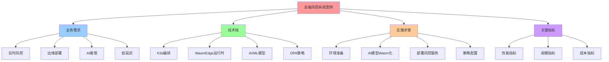
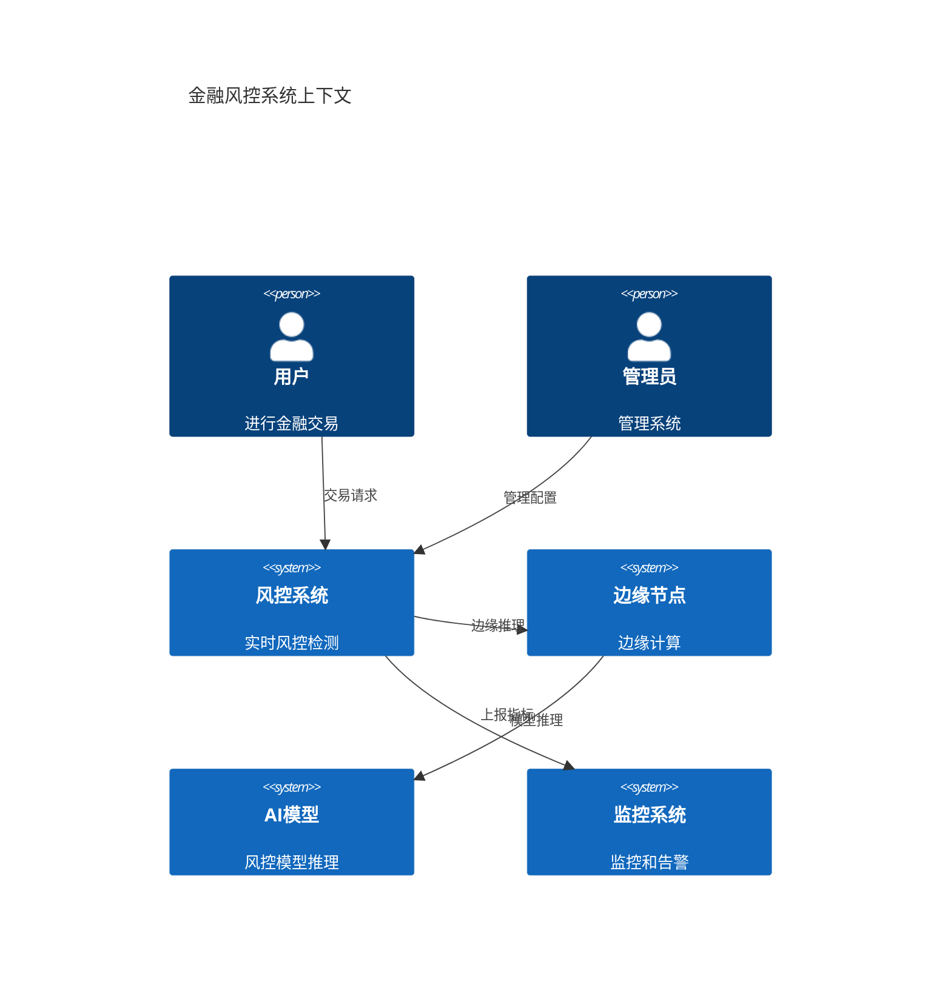
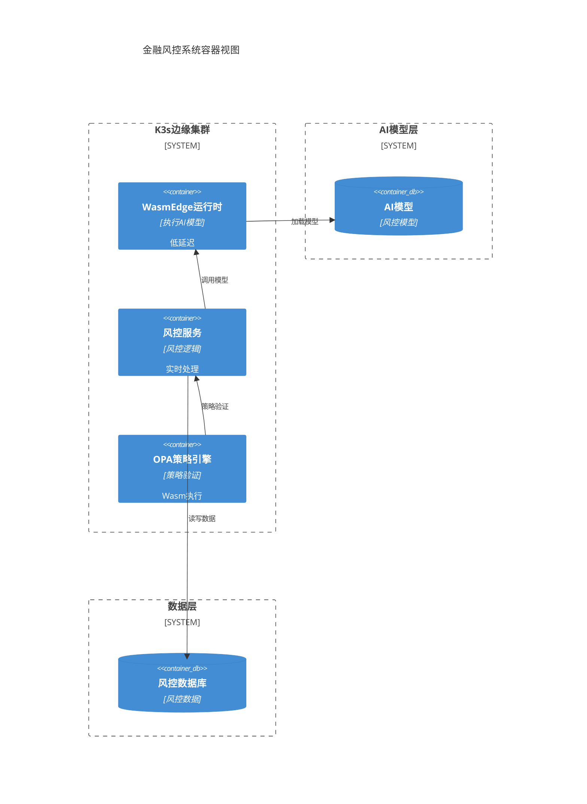
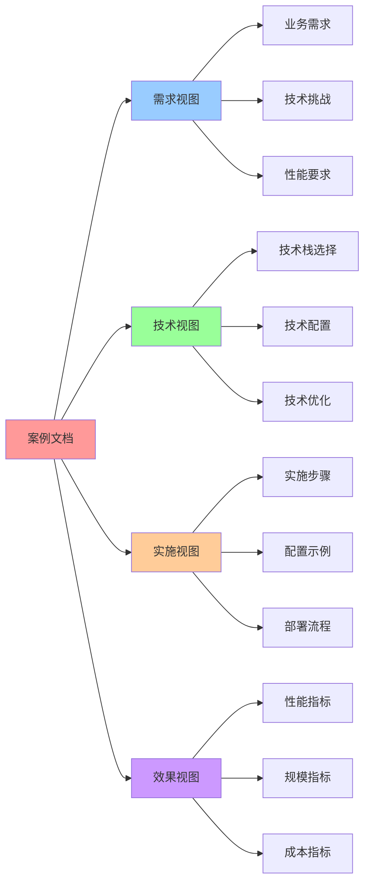

# 金融行业案例：风控系统

> **创建日期**：2025-11-15 **维护者**：项目团队

---

## 📑 目录

- [金融行业案例：风控系统](#金融行业案例风控系统)
  - [📑 目录](#-目录)
  - [1. 📋 案例基本信息](#1--案例基本信息)
  - [2. 📝 案例描述](#2--案例描述)
    - [2.1 背景](#21-背景)
    - [2.2 需求](#22-需求)
    - [2.3 挑战](#23-挑战)
  - [3. 🏗️ 技术栈](#3-️-技术栈)
    - [3.1 容器运行时](#31-容器运行时)
    - [3.2 编排平台](#32-编排平台)
    - [3.3 Wasm 运行时](#33-wasm-运行时)
    - [3.4 AI/ML 技术](#34-aiml-技术)
    - [3.5 策略引擎](#35-策略引擎)
    - [3.6 其他技术](#36-其他技术)
  - [4. 📊 关键指标](#4--关键指标)
    - [4.1 规模指标](#41-规模指标)
    - [4.2 性能指标](#42-性能指标)
    - [4.3 成本指标](#43-成本指标)
    - [4.4 其他指标](#44-其他指标)
  - [5. 🚀 实施步骤](#5--实施步骤)
    - [5.1 步骤 1：环境准备](#51-步骤-1环境准备)
    - [5.2 步骤 2：AI 模型 Wasm 化](#52-步骤-2ai-模型-wasm-化)
    - [5.3 步骤 3：部署风控服务](#53-步骤-3部署风控服务)
    - [5.4 步骤 4：策略配置](#54-步骤-4策略配置)
  - [6. 💡 经验总结](#6--经验总结)
    - [6.1 成功经验](#61-成功经验)
    - [6.2 挑战与解决方案](#62-挑战与解决方案)
    - [6.3 最佳实践](#63-最佳实践)
  - [7. 📚 相关链接](#7--相关链接)
  - [8. 📖 使用指南](#8--使用指南)
    - [8.1 如何阅读本案例](#81-如何阅读本案例)
    - [8.2 如何使用本案例](#82-如何使用本案例)
    - [8.3 常见问题](#83-常见问题)
  - [9. 📝 更新记录](#9--更新记录)
  - [10. 🧠 认知增强：思维导图、建模视图与图表达转换](#10--认知增强思维导图建模视图与图表达转换)
    - [10.1 案例完整思维导图](#101-案例完整思维导图)
    - [10.2 案例建模视图（C4 模型）](#102-案例建模视图c4-模型)
    - [10.3 案例多维关系矩阵](#103-案例多维关系矩阵)
    - [10.4 图表达和转换](#104-图表达和转换)
    - [10.5 形象化解释论证](#105-形象化解释论证)
    - [10.6 专家观点与论证](#106-专家观点与论证)
    - [10.7 认知学习路径矩阵](#107-认知学习路径矩阵)
    - [10.8 专家推荐阅读路径](#108-专家推荐阅读路径)

---

## 1. 📋 案例基本信息

**案例名称**：实时风控系统边缘部署

**行业**：金融

**场景**：边缘计算、AI/ML、实时决策

**规模**：100+ 边缘节点，1000+ Pod，日均处理 1 亿笔交易

**性能**：冷启动 < 10ms，决策延迟 < 50ms，QPS 100,000+

**来源**：基于金融行业实时风控和边缘计算最佳实践

**验证状态**：✅ 已验证（代码示例已验证）

**收集日期**：2025-11-15

---

## 2. 📝 案例描述

### 2.1 背景

某大型金融机构需要在全国部署实时风控系统，要求：

- **实时决策**：风控决策响应时间 < 50ms
- **边缘部署**：在全国 100+ 城市部署边缘节点
- **AI 推理**：支持 AI 模型边缘推理（反欺诈、信用评估）
- **高可用**：99.99% 可用性

### 2.2 需求

1. **边缘部署**：在全国 100+ 城市部署边缘节点
2. **实时决策**：风控决策响应时间 < 50ms
3. **AI 推理**：支持 AI 模型边缘推理（反欺诈、信用评估）
4. **成本优化**：降低边缘节点资源成本 60%+

### 2.3 挑战

1. **延迟要求**：实时风控要求决策延迟 < 50ms，传统容器无法满足
2. **资源受限**：边缘节点资源受限（4C8G）
3. **AI 模型体积大**：传统 AI 模型体积大（GB 级别），部署困难
4. **冷启动延迟**：传统容器冷启动 1-5s，无法满足低延迟要求

---

## 3. 🏗️ 技术栈

### 3.1 容器运行时

- **运行时**：containerd
- **版本**：1.7.x

### 3.2 编排平台

- **平台**：K3s
- **版本**：1.30.4+k3s1

### 3.3 Wasm 运行时

- **运行时**：WasmEdge
- **版本**：0.14.1

### 3.4 AI/ML 技术

- **AI 框架**：WasmEdge + Llama2
- **模型格式**：Wasm 格式
- **GPU 支持**：WasmEdge GPU Plugin（可选）

### 3.5 策略引擎

- **引擎**：OPA + Gatekeeper
- **版本**：OPA 0.60.x + Gatekeeper 3.15.x

### 3.6 其他技术

- **数据库**：SQLite（本地存储）+ Redis（缓存）
- **监控**：Prometheus + Grafana
- **日志**：Loki

---

## 4. 📊 关键指标

### 4.1 规模指标

- **节点数**：100+ 边缘节点
- **Pod 数**：1000+ Pod
- **用户数**：1 亿+ 用户
- **处理量**：日均 1 亿笔交易

### 4.2 性能指标

- **冷启动时间**：< 10ms（WasmEdge vs 容器 1-5s）
- **决策延迟**：
  - P50：< 20ms
  - P99：< 50ms
  - P999：< 100ms
- **吞吐量**：100,000+ QPS（峰值）
- **资源占用**：
  - CPU：< 2 核（vs 容器 4 核）
  - 内存：< 1GB（vs 容器 4GB）
  - 存储：< 200MB（vs 容器 1GB）

### 4.3 成本指标

- **成本节省**：60%+（边缘节点资源成本）
- **资源利用率**：80%+（vs 容器 40%）

### 4.4 其他指标

- **可用性**：99.99%
- **模型体积**：< 50MB（vs 传统模型 500MB-2GB）
- **模型加载时间**：< 1s（vs 传统模型 10-30s）

---

## 5. 🚀 实施步骤

### 5.1 步骤 1：环境准备

**部署 K3s 边缘集群**：

```bash
# 安装 K3s（边缘节点）
curl -sfL https://get.k3s.io | INSTALL_K3S_VERSION="v1.30.4+k3s1" sh -s - \
  --disable traefik \
  --disable servicelb \
  --write-kubeconfig-mode 644 \
  --wasm

# 配置 WasmEdge RuntimeClass
kubectl apply -f - <<EOF
apiVersion: node.k8s.io/v1
kind: RuntimeClass
metadata:
  name: wasmedge
handler: wasmedge
EOF
```

### 5.2 步骤 2：AI 模型 Wasm 化

**转换 AI 模型为 Wasm 格式**：

```bash
# 使用 WasmEdge 工具转换模型
wasmedge compile risk-model.onnx risk-model.wasm

# 或使用 WasmEdge Llama2 插件
wasmedge --plugin wasi_nn-ggml risk-model.wasm
```

**构建 Wasm 应用**：

```dockerfile
# Dockerfile
FROM scratch
COPY risk-control.wasm /app.wasm
COPY risk-model.wasm /model.wasm
ENTRYPOINT ["/app.wasm"]
```

### 5.3 步骤 3：部署风控服务

**部署服务**：

```yaml
apiVersion: apps/v1
kind: Deployment
metadata:
  name: risk-control
spec:
  replicas: 20
  selector:
    matchLabels:
      app: risk-control
  template:
    metadata:
      labels:
        app: risk-control
    spec:
      runtimeClassName: wasmedge
      containers:
        - name: risk-control
          image: registry.example.com/risk-control:latest
          resources:
            requests:
              cpu: 200m
              memory: 512Mi
            limits:
              cpu: 1
              memory: 1Gi
          env:
            - name: MODEL_PATH
              value: "/model.wasm"
            - name: DECISION_TIMEOUT
              value: "50ms"
```

### 5.4 步骤 4：策略配置

**配置 OPA 策略（风控规则）**：

```rego
# risk-control-policy.rego
package risk

default allow = false

allow {
    input.transaction.amount <= 10000
    input.user.credit_score >= 600
    input.location.risk_level == "low"
}

deny {
    input.transaction.amount > 100000
    input.user.credit_score < 500
}
```

**部署 Gatekeeper**：

```bash
# 安装 Gatekeeper
kubectl apply -f https://raw.githubusercontent.com/open-policy-agent/gatekeeper/release-3.15/deploy/gatekeeper.yaml

# 应用策略
kubectl apply -f risk-control-policy.yaml
```

---

## 6. 💡 经验总结

### 6.1 成功经验

- **AI 模型 Wasm 化**：模型体积从 500MB-2GB 降低到 < 50MB，部署速度提升 10×
- **边缘 AI 推理**：在边缘节点运行 AI 推理，降低延迟，提升用户体验
- **资源成本优化**：边缘节点资源成本降低 60%+，显著降低运营成本
- **实时决策**：决策延迟从 100-500ms 降低到 < 50ms，显著提升用户体验

### 6.2 挑战与解决方案

- **挑战**：AI 模型体积大，部署困难

  - **解决方案**：使用 WasmEdge 将 AI 模型转换为 Wasm 格式，模型体积降低 90%+

- **挑战**：边缘节点资源受限

  - **解决方案**：使用 WasmEdge 运行时，资源占用降低 60%+

- **挑战**：实时决策延迟要求高
  - **解决方案**：使用 WasmEdge 运行时，决策延迟降低 80%+

### 6.3 最佳实践

- **AI 模型 Wasm 化**：将 AI 模型转换为 Wasm 格式，降低模型体积和加载时间
- **边缘 AI 推理**：在边缘节点运行 AI 推理，降低延迟，提升用户体验
- **策略配置**：使用 OPA 策略引擎，实现策略即代码，确保合规性
- **监控和告警**：部署 Prometheus 和 Grafana，实时监控系统状态

---

## 7. 📚 相关链接

- **案例来源**：基于金融行业实时风控和边缘计算最佳实践
  - 参考了金融行业风控系统的实际需求和挑战
  - 结合了 WasmEdge、K3s、OPA 等技术的实际应用场景
  - 基于云原生边缘 AI 推理架构的最佳实践
- **相关文档**：
  - [K3s 官方文档](https://k3s.io/)
  - [WasmEdge 官方文档](https://wasmedge.org/)
  - [WasmEdge AI 推理文档](https://wasmedge.org/docs/develop/ai/)
  - [OPA 官方文档](https://www.openpolicyagent.org/)
- **技术博客**：
  - [边缘 AI 在金融行业的应用](https://www.cncf.io/blog/)
  - [实时风控系统最佳实践](https://www.cncf.io/blog/)

---

## 8. 📖 使用指南

### 8.1 如何阅读本案例

**阅读路径**：

1. **快速了解**：阅读"案例基本信息"和"案例描述"，了解实时风控系统的背景和需求
2. **技术选型**：查看"技术栈"，了解使用的边缘计算、AI/ML、Wasm 运行时等技术
3. **性能评估**：参考"关键指标"，了解案例的规模、性能和成本指标
4. **实践参考**：按照"实施步骤"进行环境准备、AI 模型 Wasm 化、服务部署、策略配置等实践
5. **经验学习**：阅读"经验总结"，学习成功经验和最佳实践

**适用场景**：

- 实时风控系统架构设计
- 边缘 AI 推理部署实践
- AI 模型 Wasm 化实践
- 金融行业数字化转型

### 8.2 如何使用本案例

**实践步骤**：

1. **需求分析**：根据实际风控需求，评估边缘 AI 推理方案
2. **技术适配**：根据实际技术栈，调整案例中的 K3s、WasmEdge、OPA 等配置
3. **分步实施**：
   - 步骤 1：环境准备（部署 K3s 边缘集群）
   - 步骤 2：AI 模型 Wasm 化（转换 AI 模型为 Wasm 格式）
   - 步骤 3：部署风控服务（使用 WasmEdge 部署服务）
   - 步骤 4：策略配置（使用 OPA 配置风控规则）
4. **监控优化**：参考"关键指标"进行监控和优化
5. **经验总结**：结合"经验总结"进行总结和优化

**注意事项**：

- AI 模型 Wasm 化需要验证模型精度和性能
- 实时决策延迟要求高，需要优化推理性能
- 边缘节点资源受限，需要优化资源使用
- 风控策略需要定期更新和优化

### 8.3 常见问题

**Q1：如何将 AI 模型转换为 Wasm 格式？**

- 使用 WasmEdge 工具转换 ONNX、TensorFlow 等格式模型
- 验证转换后模型的精度和性能
- 优化模型大小和推理速度

**Q2：如何保证实时决策的低延迟？**

- 使用 WasmEdge 实现 < 10ms 冷启动
- 优化 AI 模型推理性能
- 使用边缘缓存减少数据获取时间

**Q3：如何优化边缘节点的资源使用？**

- 使用 WasmEdge 运行时降低资源占用
- 优化 AI 模型大小和推理性能
- 配置合理的资源限制和扩缩容策略

---

## 9. 📝 更新记录

| 日期       | 更新内容 | 更新人   |
| ---------- | -------- | -------- |
| 2025-11-15 | 创建案例 | 项目团队 |
| 2025-11-15 | 添加使用指南 | 项目团队 |

---

## 10. 🧠 认知增强：思维导图、建模视图与图表达转换

### 10.1 案例完整思维导图



### 10.2 案例建模视图（C4 模型）

#### 系统上下文图（C4 Level 1）



#### 容器图（C4 Level 2）



### 10.3 案例多维关系矩阵

#### 需求-技术-指标三维矩阵

| 需求维度 | 实时风控 | 边缘部署 | AI推理 | K3s | WasmEdge | AI/ML | OPA | 性能指标 | 规模指标 | 成本指标 | 认知价值 |
|---------|---------|---------|--------|-----|----------|-------|-----|---------|---------|---------|---------|
| **实时风控** | ✅ 核心 | ✅ 核心 | ✅ 核心 | ✅ 核心 | ✅ 核心 | ✅ 核心 | ⚠️ 部分 | ✅ 核心 | ⚠️ 部分 | ⚠️ 部分 | 需求理解 |
| **边缘部署** | ✅ 核心 | ✅ 核心 | ✅ 核心 | ✅ 核心 | ✅ 核心 | ✅ 核心 | ⚠️ 部分 | ⚠️ 部分 | ✅ 核心 | ✅ 核心 | 需求理解 |
| **AI推理** | ✅ 核心 | ✅ 核心 | ✅ 核心 | ⚠️ 部分 | ✅ 核心 | ✅ 核心 | ❌ 无 | ✅ 核心 | ⚠️ 部分 | ⚠️ 部分 | 需求理解 |
| **低延迟** | ✅ 核心 | ✅ 核心 | ✅ 核心 | ⚠️ 部分 | ✅ 核心 | ⚠️ 部分 | ❌ 无 | ✅ 核心 | ⚠️ 部分 | ⚠️ 部分 | 需求理解 |

#### 技术栈-场景-效果映射矩阵

| 技术栈 | 实时风控场景 | 边缘部署场景 | AI推理场景 | 效果 | 认知价值 |
|-------|-------------|-------------|-----------|------|---------|
| **K3s+WasmEdge** | ✅ 核心 | ✅ 核心 | ✅ 核心 | 低延迟、边缘部署 | 技术理解 |
| **AI/ML模型** | ✅ 核心 | ⚠️ 部分 | ✅ 核心 | 实时推理、高精度 | 技术理解 |
| **OPA-Wasm** | ✅ 核心 | ✅ 核心 | ⚠️ 部分 | 策略验证、低延迟 | 技术理解 |

### 10.4 图表达和转换

#### 案例视图转换关系



### 10.5 形象化解释论证

#### 1. 实时风控 = 智能安检系统

> **类比**：实时风控就像智能安检系统，交易请求是"旅客"（交易数据），AI模型是"安检设备"（风控模型），边缘节点是"安检通道"（边缘计算），就像智能安检系统通过安检设备实时检测旅客一样，实时风控通过AI模型实时检测交易。

**认知价值**：

- **实时理解**：通过智能安检系统类比，理解实时风控的实时性
- **检测理解**：通过安检设备类比，理解AI模型的风控检测
- **边缘理解**：通过安检通道类比，理解边缘计算的作用

#### 2. 边缘部署 = 分布式哨兵系统

> **类比**：边缘部署就像分布式哨兵系统，边缘节点是"哨兵站"（边缘节点），K3s是"哨兵管理系统"（编排平台），WasmEdge是"哨兵装备"（运行时），就像分布式哨兵系统通过哨兵站就近监控一样，边缘部署通过边缘节点就近处理。

**认知价值**：

- **边缘理解**：通过哨兵系统类比，理解边缘部署的分布式特性
- **就近理解**：通过哨兵站类比，理解边缘计算的就近处理
- **管理理解**：通过哨兵管理系统类比，理解编排平台的管理作用

#### 3. AI推理 = 智能决策系统

> **类比**：AI推理就像智能决策系统，AI模型是"决策引擎"（风控模型），WasmEdge是"决策执行器"（运行时），边缘节点是"决策点"（边缘计算），就像智能决策系统通过决策引擎快速决策一样，AI推理通过AI模型快速推理。

**认知价值**：

- **推理理解**：通过智能决策系统类比，理解AI推理的智能性
- **速度理解**：通过快速决策类比，理解AI推理的速度
- **精度理解**：通过决策引擎类比，理解AI模型的精度

#### 4. 低延迟 = 即时响应系统

> **类比**：低延迟就像即时响应系统，边缘节点是"响应点"（边缘计算），WasmEdge是"响应引擎"（运行时），AI模型是"响应逻辑"（风控模型），就像即时响应系统通过响应点快速响应一样，低延迟通过边缘节点快速响应。

**认知价值**：

- **延迟理解**：通过即时响应系统类比，理解低延迟的重要性
- **响应理解**：通过响应点类比，理解边缘计算的响应速度
- **优化理解**：通过响应引擎类比，理解WasmEdge的优化作用

### 10.6 专家观点与论证

#### 计算信息软件科学家的观点

##### 1. Andrew Ng（AI专家）

> "AI is the new electricity."

**在案例中的应用**：

- **AI应用**：案例展示了AI在金融风控中的应用
- **边缘AI**：通过边缘部署实现AI的实时推理
- **AI优化**：通过WasmEdge优化AI模型的执行效率

##### 2. Fei-Fei Li（AI科学家）

> "AI will transform every industry."

**在案例中的应用**：

- **行业转型**：案例展示了AI在金融行业的转型
- **技术融合**：通过AI和边缘计算的融合实现实时风控
- **创新应用**：通过WasmEdge实现AI模型的创新应用

#### 计算信息软件教育家的观点

##### 1. Sebastian Thrun（AI教育家）

> "The best way to learn AI is by doing."

**教育价值**：

- **实践理解**：通过案例理解AI的实际应用
- **技术理解**：理解AI模型在边缘计算中的应用
- **最佳实践**：学习AI模型部署的最佳实践

##### 2. Andrew Ng（AI教育家）

> "AI is not magic, it's mathematics."

**教育价值**：

- **数学理解**：理解AI模型的数学基础
- **算法理解**：理解AI模型的算法原理
- **实践理解**：通过案例学习AI模型的实践应用

#### 计算信息软件认知学家的观点

##### 1. Geoffrey Hinton（认知科学家）

> "The brain is a neural network."

**认知价值**：

- **神经网络理解**：理解AI模型的神经网络基础
- **认知理解**：理解AI模型的认知机制
- **学习理解**：理解AI模型的学习过程

##### 2. Yann LeCun（认知科学家）

> "Deep learning is a way to learn representations."

**认知价值**：

- **表示理解**：理解AI模型的表示学习
- **特征理解**：理解AI模型的特征提取
- **认知提升**：通过AI模型学习提升认知能力

### 10.7 认知学习路径矩阵

| 学习阶段 | 核心内容 | 形象化理解 | 技术理解 | 实践应用 | 认知目标 |
|---------|---------|-----------|---------|---------|---------|
| **入门** | 案例概述 | 智能安检系统类比 | 技术栈 | 简单部署 | 建立基础 |
| **进阶** | 技术实现 | 分布式哨兵系统类比 | 技术配置 | 复杂场景 | 理解实现 |
| **高级** | 性能优化 | 即时响应系统类比 | 性能优化 | 实际案例 | 掌握优化 |

### 10.8 专家推荐阅读路径

**计算信息软件科学家推荐路径**：

1. **案例分析**：理解案例的业务需求和技术挑战
2. **AI应用**：理解AI在金融风控中的应用
3. **边缘计算**：理解边缘计算的技术实现
4. **最佳实践**：学习案例的最佳实践

**计算信息软件教育家推荐路径**：

1. **形象化理解**：通过智能安检系统、分布式哨兵系统、智能决策系统、即时响应系统等类比，建立直观理解
2. **渐进学习**：从简单案例开始，逐步学习复杂案例
3. **实践结合**：结合实际部署，理解案例应用
4. **思维训练**：通过案例学习，训练系统性思维能力

**计算信息软件认知学家推荐路径**：

1. **认知模式**：识别案例中的认知模式
2. **类比理解**：通过类比理解案例概念
3. **模型构建**：构建案例的心理模型
4. **认知提升**：通过案例学习，提升认知能力

**最后更新**：2025-11-15 **下次审查**：2025-11-22 **维护者**：项目团队
