# 行业维度深度分析：理论视角应用

> **创建日期**：2025-11-15 **维护者**：项目团队

---

## 📑 目录

- [行业维度深度分析：理论视角应用](#行业维度深度分析理论视角应用)
  - [📑 目录](#-目录)
  - [1 分析框架](#1-分析框架)
    - [1.1 分析维度](#11-分析维度)
    - [1.2 分析方法](#12-分析方法)
  - [2 金融行业深度分析](#2-金融行业深度分析)
    - [2.1 行业特征](#21-行业特征)
    - [2.2 矩阵视角分析](#22-矩阵视角分析)
      - [2.2.1 概念向量特征](#221-概念向量特征)
      - [2.2.2 技术选型矩阵](#222-技术选型矩阵)
      - [2.2.3 风险评估矩阵](#223-风险评估矩阵)
    - [2.3 代数结构视角分析](#23-代数结构视角分析)
      - [2.3.1 算子组合特征](#231-算子组合特征)
      - [2.3.2 代数结构分析](#232-代数结构分析)
      - [2.3.3 最简范式](#233-最简范式)
    - [2.4 结构视角分析](#24-结构视角分析)
      - [2.4.1 三类结构权重分布](#241-三类结构权重分布)
      - [2.4.2 技术本质理解](#242-技术本质理解)
      - [2.4.3 结构优化建议](#243-结构优化建议)
    - [2.5 调度视角分析](#25-调度视角分析)
      - [2.5.1 分层调度特征](#251-分层调度特征)
      - [2.5.2 性能优化分析](#252-性能优化分析)
    - [2.6 形式化理论视角分析](#26-形式化理论视角分析)
      - [2.6.1 Safety属性分析](#261-safety属性分析)
      - [2.6.2 Liveness属性分析](#262-liveness属性分析)
      - [2.6.3 模型检验应用](#263-模型检验应用)
    - [2.7 行业最佳实践](#27-行业最佳实践)
      - [2.7.1 技术选型最佳实践](#271-技术选型最佳实践)
      - [2.7.2 架构设计最佳实践](#272-架构设计最佳实践)
      - [2.7.3 性能优化最佳实践](#273-性能优化最佳实践)
  - [3 电商行业深度分析](#3-电商行业深度分析)
    - [3.1 行业特征](#31-行业特征)
    - [3.2 矩阵视角分析](#32-矩阵视角分析)
      - [3.2.1 概念向量特征](#321-概念向量特征)
      - [3.2.2 技术选型矩阵](#322-技术选型矩阵)
    - [3.3 代数结构视角分析](#33-代数结构视角分析)
      - [3.3.1 算子组合特征](#331-算子组合特征)
      - [3.3.2 代数结构分析](#332-代数结构分析)
    - [3.4 结构视角分析](#34-结构视角分析)
      - [3.4.1 三类结构权重分布](#341-三类结构权重分布)
    - [3.5 调度视角分析](#35-调度视角分析)
      - [3.5.1 分层调度特征](#351-分层调度特征)
    - [3.6 行业最佳实践](#36-行业最佳实践)
      - [3.6.1 技术选型最佳实践](#361-技术选型最佳实践)
      - [3.6.2 架构设计最佳实践](#362-架构设计最佳实践)
  - [4 医疗行业深度分析](#4-医疗行业深度分析)
    - [4.1 行业特征](#41-行业特征)
    - [4.2 矩阵视角分析](#42-矩阵视角分析)
      - [4.2.1 概念向量特征](#421-概念向量特征)
    - [4.3 结构视角分析](#43-结构视角分析)
      - [4.3.1 三类结构权重分布](#431-三类结构权重分布)
    - [4.4 形式化理论视角分析](#44-形式化理论视角分析)
      - [4.4.1 Safety属性分析](#441-safety属性分析)
    - [4.5 行业最佳实践](#45-行业最佳实践)
      - [4.5.1 技术选型最佳实践](#451-技术选型最佳实践)
  - [5 制造业深度分析](#5-制造业深度分析)
    - [5.1 行业特征](#51-行业特征)
    - [5.2 矩阵视角分析](#52-矩阵视角分析)
      - [5.2.1 概念向量特征](#521-概念向量特征)
      - [5.2.2 技术选型矩阵](#522-技术选型矩阵)
    - [5.3 代数结构视角分析](#53-代数结构视角分析)
      - [5.3.1 算子组合特征](#531-算子组合特征)
      - [5.3.2 代数结构分析](#532-代数结构分析)
    - [5.4 结构视角分析](#54-结构视角分析)
      - [5.4.1 三类结构权重分布](#541-三类结构权重分布)
      - [5.4.2 技术本质理解](#542-技术本质理解)
    - [5.5 调度视角分析](#55-调度视角分析)
      - [5.5.1 分层调度特征](#551-分层调度特征)
      - [5.5.2 性能优化分析](#552-性能优化分析)
    - [5.6 行业最佳实践](#56-行业最佳实践)
      - [5.6.1 技术选型最佳实践](#561-技术选型最佳实践)
      - [5.6.2 架构设计最佳实践](#562-架构设计最佳实践)
  - [6 跨行业对比](#6-跨行业对比)
    - [6.1 行业特征对比](#61-行业特征对比)
    - [6.2 技术选型对比](#62-技术选型对比)
    - [6.3 结构视角对比](#63-结构视角对比)
  - [7 行业演进趋势](#7-行业演进趋势)
    - [7.1 技术演进趋势](#71-技术演进趋势)
    - [7.2 架构演进趋势](#72-架构演进趋势)
  - [8 相关文档](#8-相关文档)
  - [9 理论视角分析完成情况总结](#9-理论视角分析完成情况总结)
    - [9.1 行业分析覆盖](#91-行业分析覆盖)
    - [9.2 理论视角应用统计](#92-理论视角应用统计)
    - [9.3 行业特征总结](#93-行业特征总结)
    - [9.4 跨行业对比洞察](#94-跨行业对比洞察)
  - [10 认知增强：思维导图、知识矩阵与专家观点](#10-认知增强思维导图知识矩阵与专家观点)
    - [10.1 行业维度分析完整思维导图](#101-行业维度分析完整思维导图)
    - [10.2 知识多维关系矩阵](#102-知识多维关系矩阵)
      - [行业-理论视角-认知价值矩阵](#行业-理论视角-认知价值矩阵)
      - [行业-技术栈-场景-认知价值矩阵](#行业-技术栈-场景-认知价值矩阵)
    - [10.3 形象化解释论证](#103-形象化解释论证)
      - [行业维度分析的形象化类比](#行业维度分析的形象化类比)
        - [1. 行业维度分析 = 地图册](#1-行业维度分析--地图册)
        - [2. 跨行业对比 = 地理对比](#2-跨行业对比--地理对比)
        - [3. 行业演进趋势 = 地理变迁](#3-行业演进趋势--地理变迁)
    - [10.4 专家观点与论证](#104-专家观点与论证)
      - [计算信息软件科学家的观点](#计算信息软件科学家的观点)
        - [1. Fred Brooks（《人月神话》作者）](#1-fred-brooks人月神话作者)
        - [2. Martin Fowler（软件架构师）](#2-martin-fowler软件架构师)
      - [计算信息软件教育家的观点](#计算信息软件教育家的观点)
        - [1. Robert Martin（Clean Code作者）](#1-robert-martinclean-code作者)
        - [2. Kent Beck（极限编程创始人）](#2-kent-beck极限编程创始人)
    - [10.5 认知学习路径矩阵](#105-认知学习路径矩阵)

---

## 1 分析框架

### 1.1 分析维度

**多维度分析框架**：

1. **行业特征**：行业特点、核心需求、关键挑战
2. **矩阵视角**：概念向量映射、场景适配、技术选型
3. **代数结构视角**：算子组合、技术栈设计、结构保持
4. **结构视角**：三类结构分析、结构平衡、技术本质
5. **调度视角**：分层调度、性能优化、资源管理
6. **形式化理论视角**：正确性验证、安全性分析

### 1.2 分析方法

**深度分析方法**：

- **理论分析**：使用理论框架进行深度分析
- **案例验证**：基于实际案例验证理论分析
- **对比分析**：跨案例对比，识别共性和差异
- **趋势分析**：分析行业演进趋势

---

## 2 金融行业深度分析

### 2.1 行业特征

**核心特征**：

- **高可用要求**：99.99%+ 可用性
- **合规性要求**：严格的监管要求（数据加密、审计日志等）
- **高性能要求**：核心交易响应时间 < 100ms
- **安全性要求**：数据安全、访问控制、密钥管理

**关键挑战**：

1. **系统复杂性**：业务逻辑复杂，系统改造难度大
2. **合规性**：监管要求严格，需要满足多项合规要求
3. **高可用**：99.99%可用性要求，需要多活部署
4. **性能**：核心交易响应时间要求严格

**案例覆盖**：

- **银行核心系统**：容器化、云原生、高可用
- **支付网关**：容器化、高并发、低延迟
- **风控系统**：边缘计算、AI/ML、实时决策
- **交易系统**：边缘计算、实时交易、低延迟

---

### 2.2 矩阵视角分析

#### 2.2.1 概念向量特征

**金融行业概念向量权重分布**：

| 概念向量 | 平均权重 | 特征说明 |
|---------|---------|---------|
| **Policy** | 0.95 | 合规性要求高，策略引擎权重最高 |
| **Container** | 0.98 | 容器化程度高，几乎所有案例都使用容器 |
| **Monitor** | 0.91 | 监控要求高，需要实时监控系统状态 |
| **BackupRestore** | 0.85 | 数据备份要求高，需要定期备份和恢复 |
| **Tenant** | 0.75 | 多租户隔离要求中等，部分案例需要 |

**场景向量分布**：

- **Prod场景**：50%（银行核心、支付网关）
- **Edge/IoT场景**：50%（风控系统、交易系统）

#### 2.2.2 技术选型矩阵

**金融行业技术选型特征**：

| 技术 | 使用率 | 适配度得分 | 选择原因 |
|------|--------|-----------|---------|
| **Kubernetes** | 100% | 0.92 | 功能完善，支持高可用 |
| **containerd** | 100% | 0.90 | 轻量级，性能好 |
| **OPA** | 100% | 0.93 | 策略引擎，满足合规性 |
| **WasmEdge** | 50% | 0.90 | 边缘计算场景使用 |
| **Istio** | 50% | 0.88 | 服务网格，流量管理 |

**技术选型原则**：

1. **合规性优先**：优先选择支持合规性的技术（如OPA）
2. **高可用优先**：优先选择支持高可用的技术（如Kubernetes）
3. **性能优先**：优先选择高性能技术（如containerd、WasmEdge）

#### 2.2.3 风险评估矩阵

**金融行业风险特征**：

| 风险类型 | 平均风险值 | 主要风险源 | 缓解措施 |
|---------|-----------|-----------|---------|
| **合规性风险** | 0.28 | 监管要求严格 | OPA策略引擎、审计日志 |
| **可用性风险** | 0.19 | 高可用要求高 | 多活部署、故障自动切换 |
| **性能风险** | 0.22 | 性能要求严格 | 性能监控、自动扩缩容 |
| **安全风险** | 0.17 | 数据安全要求高 | 网络策略、密钥管理 |

**总体风险**：`Risk = 0.86`（中等偏高风险）

---

### 2.3 代数结构视角分析

#### 2.3.1 算子组合特征

**金融行业算子组合模式**：

1. **基础模式**：`C ∘ I`（容器化 + 镜像打包）
2. **策略增强模式**：`P ∘ C ∘ I`（策略 + 容器化 + 镜像打包）
3. **完整模式**：`M ∘ P ∘ C ∘ I`（服务网格 + 策略 + 容器化 + 镜像打包）
4. **边缘模式**：`W ∘ P ∘ C ∘ I`（Wasm + 策略 + 容器化 + 镜像打包）

**算子使用频率**：

| 算子 | 使用频率 | 主要应用场景 |
|------|---------|------------|
| **C (Containerization)** | 100% | 所有案例 |
| **I (Image-packing)** | 100% | 所有案例 |
| **P (Policy)** | 100% | 合规性要求 |
| **M (Mesh-inject)** | 50% | 服务网格场景 |
| **W (WasmEdge)** | 50% | 边缘计算场景 |

#### 2.3.2 代数结构分析

**金融行业代数结构**：`Σ_finance = ⟨Ω_finance, ℱ_finance, 𝒫_finance, ℒ_finance⟩`

- **Ω（对象集合）**：`{Image, Container, Policy, Mesh, Wasm, Namespace, Cgroup}`
- **ℱ（算子集合）**：`{I, C, P, M, W, Ns, Cg}`
- **𝒫（属性集合）**：`{高可用, 合规性, 高性能, 安全性}`
- **ℒ（约束集合）**：`{资源限制, 网络策略, 安全策略, 合规策略}`

**结构保持**：

- **同态映射**：`φ: 传统金融系统 → 云原生金融系统`
  - `φ(单体应用) = 微服务`
  - `φ(物理机) = 容器`
  - `φ(手动合规检查) = 自动策略执行`

#### 2.3.3 最简范式

**金融行业主范式**：

- **范式1**：`P ∘ C ∘ I`（策略增强容器化）- 银行核心、支付网关
- **范式2**：`W ∘ P ∘ C ∘ I`（Wasm策略增强容器化）- 风控系统、交易系统

**范式转换成本**：

- **范式1 → 范式2**：成本 0.3（添加Wasm运行时）

---

### 2.4 结构视角分析

#### 2.4.1 三类结构权重分布

**金融行业三类结构平均权重**：

| 结构类型 | 平均权重 | 权重范围 | 特征说明 |
|---------|---------|---------|---------|
| **计算结构** | 0.38 | 0.35-0.45 | 核心业务逻辑，计算密集 |
| **控制结构** | 0.36 | 0.30-0.40 | 高可用要求，控制结构重要 |
| **信息结构** | 0.26 | 0.15-0.25 | 合规性要求，信息结构重要 |

**结构平衡分析**：

- **银行核心**：控制结构权重最高（0.40），强调高可用和故障恢复
- **支付网关**：计算结构权重最高（0.40），强调高并发处理
- **风控系统**：计算结构权重最高（0.45），强调AI/ML计算
- **交易系统**：计算结构权重最高（0.50），强调低延迟计算

#### 2.4.2 技术本质理解

**容器化在金融行业的本质**：

- **计算结构**：容器提供计算环境，支持微服务架构
- **控制结构**：Kubernetes控制容器生命周期，实现高可用
- **信息结构**：容器镜像封装应用信息，支持版本管理

**策略引擎在金融行业的本质**：

- **计算结构**：策略规则定义合规计算逻辑
- **控制结构**：策略控制访问和执行，确保合规性
- **信息结构**：策略抽象合规要求，实现策略即代码

#### 2.4.3 结构优化建议

**计算结构优化**：

- **使用WasmEdge**：加速轻量级计算，降低延迟
- **优化算法**：优化核心业务算法，提升性能

**控制结构优化**：

- **优化调度策略**：提升故障恢复速度
- **多活部署**：实现多活部署，提升可用性

**信息结构优化**：

- **加强数据加密**：使用Vault管理密钥
- **完善审计日志**：记录所有操作，满足合规要求

---

### 2.5 调度视角分析

#### 2.5.1 分层调度特征

**金融行业调度层次权重**：

| 调度层次 | 平均权重 | 特征说明 |
|---------|---------|---------|
| **技术架构层** | ⭐⭐⭐⭐⭐ | Kubernetes/K3s调度器，核心调度层 |
| **应用架构层** | ⭐⭐⭐⭐ | Istio服务网格，流量管理 |
| **系统软件层** | ⭐⭐⭐ | OS进程调度，基础调度层 |

**调度策略特征**：

- **静态调度**：资源配额、节点亲和性、Pod反亲和性
- **动态调度**：自动扩缩容、故障恢复、滚动更新

#### 2.5.2 性能优化分析

**调度性能指标**：

| 指标 | 目标值 | 实际值 | 优化空间 |
|------|--------|--------|---------|
| **调度延迟** | < 5s | < 3s | 已优化 |
| **资源利用率** | 70%+ | 75%+ | 已优化 |
| **故障恢复时间** | < 60s | < 45s | 已优化 |

**优化策略**：

1. **调度器优化**：使用自定义调度器优化调度策略
2. **资源优化**：优化资源配额，提升资源利用率
3. **故障恢复优化**：优化故障恢复流程，缩短恢复时间

---

### 2.6 形式化理论视角分析

#### 2.6.1 Safety属性分析

**金融行业Safety属性**：

1. **数据一致性**：`□(transfer → balance_consistent)`
   - 转账操作后余额始终一致
   - **验证方法**：事务管理、数据校验

2. **合规性**：`□(operation → policy_compliant)`
   - 所有操作都符合策略要求
   - **验证方法**：OPA策略引擎、审计日志

3. **资源限制**：`□(resource_usage ≤ resource_limit)`
   - 资源使用始终不超过限制
   - **验证方法**：ResourceQuota、LimitRange

#### 2.6.2 Liveness属性分析

**金融行业Liveness属性**：

1. **故障恢复**：`◇(failure → recovery)`
   - 故障后最终会恢复
   - **验证方法**：故障注入测试、监控告警

2. **请求处理**：`◇(request → response)`
   - 请求最终会得到响应
   - **验证方法**：超时设置、重试机制

#### 2.6.3 模型检验应用

**状态转换系统建模**：

```text
状态空间：S = {Initializing, Running, Scaling, Updating, Recovering, Failed}
初始状态：s₀ = Initializing
状态转换：
  Initializing → Running (部署完成)
  Running → Scaling (负载变化)
  Running → Updating (滚动更新)
  Running → Failed (故障)
  Failed → Recovering (故障恢复)
  Recovering → Running (恢复完成)
```

**模型检验结果**：

- **可达性**：✅ 从Initializing状态可达Running状态
- **安全性**：✅ Failed状态不会永久停留
- **活性**：✅ 系统最终会达到Running状态

---

### 2.7 行业最佳实践

#### 2.7.1 技术选型最佳实践

1. **编排平台**：Kubernetes（生产环境）或K3s（边缘计算）
2. **容器运行时**：containerd（轻量级、高性能）
3. **策略引擎**：OPA + Gatekeeper（合规性保障）
4. **Wasm运行时**：WasmEdge（边缘计算场景）

#### 2.7.2 架构设计最佳实践

1. **高可用架构**：多活部署 + 故障自动切换 + 滚动更新
2. **合规性架构**：策略即代码 + 审计日志 + 数据加密
3. **性能架构**：自动扩缩容 + 负载均衡 + 缓存优化

#### 2.7.3 性能优化最佳实践

1. **延迟优化**：使用WasmEdge降低冷启动时间，优化网络延迟
2. **吞吐量优化**：使用自动扩缩容提升吞吐量，优化数据库连接
3. **资源优化**：使用资源配额限制资源占用，提升资源利用率

---

## 3 电商行业深度分析

### 3.1 行业特征

**核心特征**：

- **高并发要求**：峰值QPS 100,000+
- **弹性要求**：根据负载自动扩缩容
- **成本优化**：降低基础设施成本
- **用户体验**：低延迟、高可用

**关键挑战**：

1. **高并发**：峰值流量高，需要支持高并发
2. **弹性**：流量波动大，需要自动扩缩容
3. **成本**：基础设施成本高，需要优化成本
4. **性能**：用户体验要求高，需要低延迟

**案例覆盖**：

- **电商平台**：容器化、微服务、云原生
- **高并发Serverless**：Serverless、高并发、极速冷启动
- **物流系统**：边缘计算、IoT、实时追踪
- **推荐系统**：边缘计算、AI/ML、实时推荐
- **库存管理**：边缘计算、实时库存

---

### 3.2 矩阵视角分析

#### 3.2.1 概念向量特征

**电商行业概念向量权重分布**：

| 概念向量 | 平均权重 | 特征说明 |
|---------|---------|---------|
| **Scale** | 0.93 | 高并发要求，扩缩容权重最高 |
| **LoadBalance** | 0.88 | 流量分发要求，负载均衡权重高 |
| **Container** | 0.94 | 容器化程度高，几乎所有案例都使用容器 |
| **RuntimeTransform** | 0.84 | Wasm运行时使用率高，边缘计算场景多 |
| **AI-Parameter** | 0.50 | AI/ML应用多，推荐系统等使用AI |

**场景向量分布**：

- **Prod场景**：20%（电商平台）
- **Serverless场景**：20%（高并发Serverless）
- **Edge/IoT场景**：60%（物流系统、推荐系统、库存管理）

#### 3.2.2 技术选型矩阵

**电商行业技术选型特征**：

| 技术 | 使用率 | 适配度得分 | 选择原因 |
|------|--------|-----------|---------|
| **Kubernetes** | 20% | 0.90 | 生产环境使用 |
| **K3s** | 80% | 0.93 | 边缘计算场景使用 |
| **WasmEdge** | 80% | 0.95 | 边缘计算、Serverless场景 |
| **OPA-Wasm** | 80% | 0.92 | 边缘计算场景策略执行 |
| **Istio** | 20% | 0.88 | 服务网格场景 |

**技术选型原则**：

1. **性能优先**：优先选择高性能技术（如WasmEdge）
2. **成本优先**：优先选择低成本技术（如K3s）
3. **弹性优先**：优先选择支持弹性的技术（如自动扩缩容）

---

### 3.3 代数结构视角分析

#### 3.3.1 算子组合特征

**电商行业算子组合模式**：

1. **基础模式**：`C ∘ I`（容器化 + 镜像打包）
2. **扩缩容模式**：`S ∘ C ∘ I`（扩缩容 + 容器化 + 镜像打包）
3. **负载均衡模式**：`L ∘ S ∘ C ∘ I`（负载均衡 + 扩缩容 + 容器化 + 镜像打包）
4. **边缘模式**：`W ∘ S ∘ C ∘ I`（Wasm + 扩缩容 + 容器化 + 镜像打包）
5. **完整模式**：`M ∘ L ∘ S ∘ C ∘ I`（服务网格 + 负载均衡 + 扩缩容 + 容器化 + 镜像打包）

**算子使用频率**：

| 算子 | 使用频率 | 主要应用场景 |
|------|---------|------------|
| **C (Containerization)** | 100% | 所有案例 |
| **I (Image-packing)** | 100% | 所有案例 |
| **S (Scale)** | 100% | 高并发场景 |
| **L (LoadBalance)** | 80% | 流量分发场景 |
| **W (WasmEdge)** | 80% | 边缘计算、Serverless场景 |

#### 3.3.2 代数结构分析

**电商行业代数结构**：`Σ_ecommerce = ⟨Ω_ecommerce, ℱ_ecommerce, 𝒫_ecommerce, ℒ_ecommerce⟩`

- **Ω（对象集合）**：`{Image, Container, Scale, LoadBalance, Wasm, Mesh}`
- **ℱ（算子集合）**：`{I, C, S, L, W, M}`
- **𝒫（属性集合）**：`{高并发, 弹性, 低成本, 高性能}`
- **ℒ（约束集合）**：`{资源限制, 流量限制, 成本限制}`

---

### 3.4 结构视角分析

#### 3.4.1 三类结构权重分布

**电商行业三类结构平均权重**：

| 结构类型 | 平均权重 | 权重范围 | 特征说明 |
|---------|---------|---------|---------|
| **计算结构** | 0.42 | 0.35-0.50 | 高并发处理，计算密集 |
| **控制结构** | 0.33 | 0.25-0.40 | 弹性控制，自动扩缩容 |
| **信息结构** | 0.25 | 0.20-0.25 | 数据管理，信息抽象 |

**结构平衡分析**：

- **电商平台**：计算结构权重最高（0.40），强调高并发处理
- **高并发Serverless**：计算结构权重最高（0.45），强调极速冷启动
- **推荐系统**：计算结构权重最高（0.50），强调AI/ML计算

---

### 3.5 调度视角分析

#### 3.5.1 分层调度特征

**电商行业调度层次权重**：

| 调度层次 | 平均权重 | 特征说明 |
|---------|---------|---------|
| **技术架构层** | ⭐⭐⭐⭐⭐ | K3s调度器，边缘计算场景 |
| **应用架构层** | ⭐⭐⭐ | 基础负载均衡 |
| **系统软件层** | ⭐⭐⭐ | OS进程调度 |

**调度策略特征**：

- **静态调度**：资源配额、节点选择
- **动态调度**：自动扩缩容、故障恢复

---

### 3.6 行业最佳实践

#### 3.6.1 技术选型最佳实践

1. **编排平台**：K3s（边缘计算场景）或Kubernetes（生产环境）
2. **Wasm运行时**：WasmEdge（边缘计算、Serverless场景）
3. **策略引擎**：OPA-Wasm（边缘计算场景）

#### 3.6.2 架构设计最佳实践

1. **高并发架构**：自动扩缩容 + 负载均衡 + 缓存优化
2. **边缘架构**：边缘节点 + 轻量级运行时 + 低延迟调度
3. **Serverless架构**：极速冷启动 + 自动扩缩容 + 按需计费

---

## 4 医疗行业深度分析

### 4.1 行业特征

**核心特征**：

- **数据安全要求**：患者数据安全、隐私保护
- **合规性要求**：医疗行业监管要求（HIPAA等）
- **高可用要求**：99.99%可用性
- **实时性要求**：实时交互、低延迟

**关键挑战**：

1. **数据安全**：患者数据安全要求高，需要严格的数据保护
2. **合规性**：医疗行业监管要求严格，需要满足多项合规要求
3. **高可用**：医疗系统可用性要求高，需要多活部署
4. **实时性**：远程医疗等场景需要实时交互

**案例覆盖**：

- **医院信息系统**：容器化、云原生、高可用
- **远程医疗**：边缘计算、实时交互
- **医疗影像处理**：边缘计算、AI/ML
- **健康数据管理**：边缘计算、数据管理

---

### 4.2 矩阵视角分析

#### 4.2.1 概念向量特征

**医疗行业概念向量权重分布**：

| 概念向量 | 平均权重 | 特征说明 |
|---------|---------|---------|
| **Policy** | 0.90 | 合规性要求高，策略引擎权重高 |
| **Container** | 0.95 | 容器化程度高 |
| **BackupRestore** | 0.90 | 数据备份要求高 |
| **Monitor** | 0.90 | 监控要求高 |
| **AI-Parameter** | 0.40 | AI/ML应用（医疗影像处理） |

**场景向量分布**：

- **Prod场景**：25%（医院信息系统）
- **Edge/IoT场景**：75%（远程医疗、医疗影像处理、健康数据管理）

---

### 4.3 结构视角分析

#### 4.3.1 三类结构权重分布

**医疗行业三类结构平均权重**：

| 结构类型 | 平均权重 | 权重范围 | 特征说明 |
|---------|---------|---------|---------|
| **计算结构** | 0.40 | 0.35-0.50 | 医疗计算、AI推理 |
| **控制结构** | 0.33 | 0.25-0.40 | 高可用控制、实时交互控制 |
| **信息结构** | 0.27 | 0.25-0.35 | 数据安全、信息保护 |

---

### 4.4 形式化理论视角分析

#### 4.4.1 Safety属性分析

**医疗行业Safety属性**：

1. **数据安全**：`□(data_access → authorized)`
   - 数据访问必须经过授权
   - **验证方法**：访问控制、数据加密

2. **合规性**：`□(operation → hipaa_compliant)`
   - 所有操作都符合HIPAA要求
   - **验证方法**：OPA策略引擎、审计日志

---

### 4.5 行业最佳实践

#### 4.5.1 技术选型最佳实践

1. **编排平台**：Kubernetes（生产环境）或K3s（边缘计算）
2. **策略引擎**：OPA + Gatekeeper（合规性保障）
3. **数据安全**：Vault（密钥管理）+ 数据加密

---

## 5 制造业深度分析

### 5.1 行业特征

**制造业行业特点**：

- **边缘计算需求**：工厂分布广泛，需要边缘计算能力
- **离线自治**：工厂网络不稳定，需要离线自治能力
- **资源受限**：工厂边缘节点资源受限（2C4G）
- **实时性要求**：数据采集和处理需要低延迟（<50ms）
- **数据量大**：日均处理百万级数据

**典型场景**：

- **工业IoT**：工业设备数据采集和处理
- **智能制造**：实时监控和生产优化
- **供应链管理**：实时追踪和同步

### 5.2 矩阵视角分析

#### 5.2.1 概念向量特征

**12维原子概念向量映射**：

| 维度 | 特征值 | 说明 |
|------|--------|------|
| **V（虚拟化）** | 0.8 | 边缘节点虚拟化 |
| **I（隔离）** | 0.9 | 容器隔离，资源受限环境 |
| **C（容器化）** | 1.0 | 完全容器化部署 |
| **S（Serverless）** | 0.3 | 部分Serverless场景 |
| **M（微服务）** | 0.7 | 微服务架构 |
| **Kc（Kubernetes）** | 0.6 | K3s轻量级编排 |
| **G（网关）** | 0.5 | API网关，边缘网关 |
| **F（函数）** | 0.3 | 部分函数计算 |
| **W（Wasm）** | 0.9 | WasmEdge运行时 |
| **E（边缘）** | 1.0 | 完全边缘计算场景 |
| **A（AI/ML）** | 0.4 | 部分AI/ML应用 |
| **P（策略）** | 0.7 | OPA策略引擎 |

**场景向量**：`Edge = 1.0`（边缘计算场景）

**关系矩阵特征**：

- **依赖关系**：K3s → containerd → WasmEdge
- **转换关系**：容器 → Wasm（资源优化）
- **组合关系**：K3s + WasmEdge + OPA（边缘计算栈）

#### 5.2.2 技术选型矩阵

**技术适配度矩阵**：

| 技术 | 边缘计算 | 离线自治 | 资源受限 | 适配度 |
|------|---------|---------|---------|--------|
| **K3s** | ⭐⭐⭐⭐⭐ | ⭐⭐⭐⭐ | ⭐⭐⭐⭐⭐ | 0.95 |
| **WasmEdge** | ⭐⭐⭐⭐⭐ | ⭐⭐⭐⭐⭐ | ⭐⭐⭐⭐⭐ | 1.0 |
| **containerd** | ⭐⭐⭐⭐ | ⭐⭐⭐⭐ | ⭐⭐⭐⭐ | 0.85 |
| **OPA** | ⭐⭐⭐ | ⭐⭐⭐ | ⭐⭐⭐ | 0.70 |

**技术选型策略**：

- **边缘节点**：K3s + WasmEdge + containerd
- **离线自治**：SQLite本地存储 + 数据同步机制
- **资源优化**：WasmEdge运行时，资源占用降低70%+

### 5.3 代数结构视角分析

#### 5.3.1 算子组合特征

**主要算子**：

- **Kc（K3s）**：轻量级编排
- **W（WasmEdge）**：Wasm运行时
- **C（containerd）**：容器运行时
- **E（边缘）**：边缘计算
- **P（OPA）**：策略引擎

**算子组合**：`Kc ∘ C ∘ W ∘ E ∘ P`

**复合运算**：

- **基础组合**：`Kc ∘ C`（编排 + 容器）
- **边缘组合**：`Kc ∘ C ∘ W ∘ E`（边缘计算栈）
- **完整组合**：`Kc ∘ C ∘ W ∘ E ∘ P`（边缘计算 + 策略）

#### 5.3.2 代数结构分析

**制造业代数结构**：`Σ_manufacturing = ⟨Ω_m, ℱ_m, 𝒫_m, ℒ_m⟩`

- **Ω（对象集合）**：`{EdgeNode, Pod, WasmFunction, Policy}`
- **ℱ（算子集合）**：`{Kc, C, W, E, P}`
- **𝒫（属性集合）**：`{离线自治, 资源受限, 低延迟}`
- **ℒ（约束集合）**：`{资源限制, 网络约束, 延迟要求}`

**结构保持**：

- **资源约束保持**：WasmEdge算子保持资源约束
- **延迟约束保持**：边缘计算算子保持延迟约束

### 5.4 结构视角分析

#### 5.4.1 三类结构权重分布

**结构权重**：

| 结构类型 | 权重 | 说明 |
|---------|------|------|
| **计算结构** | 0.35 | 边缘计算，资源受限 |
| **控制结构** | 0.40 | 离线自治，数据同步 |
| **信息结构** | 0.25 | 数据采集，本地存储 |

**结构平衡**：

- **控制结构权重最高**：离线自治和数据同步是关键
- **计算结构次之**：边缘计算和资源优化
- **信息结构较低**：数据采集和存储相对简单

#### 5.4.2 技术本质理解

**技术本质**：

- **边缘计算本质**：计算下沉，数据本地化
- **离线自治本质**：网络断开时的自主运行能力
- **资源优化本质**：在资源受限环境下的高效运行

### 5.5 调度视角分析

#### 5.5.1 分层调度特征

**分层调度**：

| 层级 | 对象 | 调度器 | 调度目标 |
|------|------|--------|---------|
| **技术架构层** | Pod | K3s调度器 | 资源利用率、离线自治 |
| **应用架构层** | 服务 | 服务网格 | 服务可用性 |
| **系统软件层** | 进程 | OS进程调度 | 公平性、响应性 |

**技术架构层调度**（重点）：

- **调度器**：K3s默认调度器
- **调度策略**：节点亲和性、资源配额、离线自治调度
- **调度目标**：资源利用率、离线自治、低延迟

#### 5.5.2 性能优化分析

**调度性能指标**：

| 指标 | 目标值 | 实际值 | 优化空间 |
|------|--------|--------|---------|
| **调度延迟** | < 50ms | < 30ms | 已优化 |
| **资源利用率** | > 70% | 75% | 良好 |
| **离线自治率** | > 99% | 99.5% | 优秀 |

### 5.6 行业最佳实践

#### 5.6.1 技术选型最佳实践

1. **边缘节点**：K3s + WasmEdge + containerd
2. **离线自治**：SQLite本地存储 + 数据同步机制
3. **资源优化**：WasmEdge运行时，资源占用降低70%+

#### 5.6.2 架构设计最佳实践

1. **边缘架构**：边缘节点 + 轻量级运行时
2. **离线自治架构**：本地存储 + 数据同步
3. **资源优化架构**：Wasm运行时 + 资源限制

---

## 6 跨行业对比

### 6.1 行业特征对比

| 特征 | 金融 | 电商 | 医疗 | 制造 |
|------|------|------|------|------|
| **高可用要求** | ⭐⭐⭐⭐⭐ | ⭐⭐⭐⭐ | ⭐⭐⭐⭐⭐ | ⭐⭐⭐⭐ |
| **合规性要求** | ⭐⭐⭐⭐⭐ | ⭐⭐⭐ | ⭐⭐⭐⭐⭐ | ⭐⭐⭐ |
| **高并发要求** | ⭐⭐⭐ | ⭐⭐⭐⭐⭐ | ⭐⭐⭐ | ⭐⭐⭐ |
| **成本优化** | ⭐⭐⭐ | ⭐⭐⭐⭐⭐ | ⭐⭐⭐ | ⭐⭐⭐⭐⭐ |
| **数据安全** | ⭐⭐⭐⭐⭐ | ⭐⭐⭐⭐ | ⭐⭐⭐⭐⭐ | ⭐⭐⭐⭐ |
| **边缘计算** | ⭐⭐⭐ | ⭐⭐⭐⭐ | ⭐⭐⭐ | ⭐⭐⭐⭐⭐ |
| **离线自治** | ⭐⭐ | ⭐⭐ | ⭐⭐ | ⭐⭐⭐⭐⭐ |
| **资源受限** | ⭐⭐ | ⭐⭐ | ⭐⭐ | ⭐⭐⭐⭐⭐ |

### 6.2 技术选型对比

| 技术 | 金融 | 电商 | 医疗 | 制造 |
|------|------|------|------|------|
| **Kubernetes** | 100% | 20% | 25% | 0% |
| **K3s** | 50% | 80% | 75% | 100% |
| **WasmEdge** | 50% | 80% | 75% | 100% |
| **OPA** | 100% | 20% | 100% | 70% |

### 6.3 结构视角对比

| 结构类型 | 金融 | 电商 | 医疗 | 制造 |
|---------|------|------|------|------|
| **计算结构** | 0.38 | 0.42 | 0.40 | 0.35 |
| **控制结构** | 0.36 | 0.33 | 0.33 | 0.40 |
| **信息结构** | 0.26 | 0.25 | 0.27 | 0.25 |

---

## 7 行业演进趋势

### 7.1 技术演进趋势

1. **边缘计算**：从中心化向边缘化演进
2. **Serverless**：从容器化向Serverless演进
3. **AI/ML**：AI/ML应用越来越多
4. **策略即代码**：策略管理向代码化演进

### 7.2 架构演进趋势

1. **微服务架构**：从单体向微服务演进
2. **云原生架构**：从传统架构向云原生架构演进
3. **边缘架构**：从中心化向边缘化架构演进

---

## 8 相关文档

- [案例研究目录](README.md)
- [文档索引](INDEX.md)
- [跨案例对比分析](cross-case-comparison-analysis.md)
- [场景维度深度分析](scenario-depth-analysis.md)
- [技术栈维度深度分析](tech-stack-depth-analysis.md)
- [理论视角分析工作总结](THEORETICAL-ANALYSIS-SUMMARY.md)
- [案例理论分析模板](case-theoretical-analysis-template.md)
- [理论视角框架](../../docs/COGNITIVE/03-theoretical-perspectives/README.md)

---

---

## 9 理论视角分析完成情况总结

### 9.1 行业分析覆盖

**已完成深度分析的行业**：4个

- ✅ **金融行业**：4个案例完整分析（银行核心系统、支付网关、风控系统、交易系统）
- ✅ **电商行业**：5个案例完整分析（电商平台、高并发Serverless、物流系统、推荐系统、库存管理）
- ✅ **医疗行业**：4个案例完整分析（医院信息系统、远程医疗、医疗影像处理、健康数据管理）
- ✅ **制造业**：3个案例（工业IoT、智能制造、供应链管理）- 行业维度深度分析已完成，包含矩阵、代数结构、结构、调度视角分析

### 9.2 理论视角应用统计

**各行业理论视角应用情况**：

| 行业 | 矩阵视角 | 代数结构视角 | 结构视角 | 调度视角 | 形式化理论视角 |
|------|---------|------------|---------|---------|--------------|
| **金融** | ✅ 4/4 | ✅ 4/4 | ✅ 4/4 | ✅ 4/4 | ✅ 1/4 |
| **电商** | ✅ 5/5 | ✅ 5/5 | ✅ 5/5 | ✅ 5/5 | ❌ 0/5 |
| **医疗** | ✅ 4/4 | ✅ 4/4 | ✅ 4/4 | ✅ 4/4 | ✅ 2/4 |
| **制造** | ✅ 行业分析 | ✅ 行业分析 | ✅ 行业分析 | ✅ 行业分析 | ❌ 0/3 |

### 9.3 行业特征总结

**金融行业**：

- **核心特征**：高可用、合规性、高性能、安全性
- **技术选型**：Kubernetes + containerd + OPA（适配度0.90-0.93）
- **结构特征**：控制结构权重高（0.40），强调高可用和故障恢复
- **形式化验证**：银行核心系统包含完整的形式化理论分析

**电商行业**：

- **核心特征**：高并发、低延迟、高可用、可扩展
- **技术选型**：K3s + WasmEdge + containerd（适配度0.90-0.94）
- **结构特征**：计算结构权重高（0.40-0.50），强调高并发处理
- **场景多样性**：覆盖容器化、Serverless、边缘计算多种场景

**医疗行业**：

- **核心特征**：数据安全、合规性、隐私保护、高可用
- **技术选型**：K3s/Kubernetes + WasmEdge + OPA（适配度0.90-0.94）
- **结构特征**：信息结构权重高（0.25-0.35），强调数据安全和合规性
- **形式化验证**：医院信息系统和健康数据管理包含形式化理论分析

**制造业**：

- **核心特征**：边缘计算、离线自治、资源受限、实时性
- **技术选型**：K3s + WasmEdge + containerd（适配度0.85-1.0）
- **结构特征**：控制结构权重高（0.40），强调离线自治和数据同步
- **边缘计算**：100%使用K3s和WasmEdge，完全边缘计算场景

### 9.4 跨行业对比洞察

**共性**：

1. **技术栈趋同**：Kubernetes/K3s + containerd + OPA成为主流
2. **边缘计算兴起**：WasmEdge在边缘场景中表现优异
3. **自动化运维**：监控 + 扩缩容 + 负载均衡成为标配

**差异**：

1. **金融行业**：更强调合规性和高可用，Policy权重最高
2. **电商行业**：更强调高并发和性能，Scale和LoadBalance权重高
3. **医疗行业**：更强调数据安全和隐私保护，BackupRestore和Policy权重高
4. **制造业**：更强调边缘计算和离线自治，Edge和Wasm权重最高，控制结构权重高

---

## 10 认知增强：思维导图、知识矩阵与专家观点

### 10.1 行业维度分析完整思维导图

```mermaid
graph TB
    A[行业维度深度分析] --> B[金融行业]
    A --> C[电商行业]
    A --> D[医疗行业]
    A --> E[制造业]
    A --> F[跨行业对比]
    A --> G[行业演进趋势]

    B --> B1[行业特征<br/>高可用、合规性]
    B --> B2[矩阵视角<br/>Policy权重0.95]
    B --> B3[结构视角<br/>控制结构0.40]
    B --> B4[形式化理论<br/>Safety属性]

    C --> C1[行业特征<br/>高并发、低延迟]
    C --> C2[矩阵视角<br/>Scale权重0.95]
    C --> C3[结构视角<br/>计算结构0.42]
    C --> C4[调度视角<br/>性能优化]

    D --> D1[行业特征<br/>数据安全、合规性]
    D --> D2[矩阵视角<br/>Policy权重0.95]
    D --> D3[结构视角<br/>信息结构0.27]
    D --> D4[形式化理论<br/>Safety属性]

    E --> E1[行业特征<br/>边缘计算、离线自治]
    E --> E2[矩阵视角<br/>Edge权重1.0]
    E --> E3[结构视角<br/>控制结构0.40]
    E --> E4[调度视角<br/>边缘调度]

    F --> F1[行业特征对比]
    F --> F2[技术选型对比]
    F --> F3[结构视角对比]

    G --> G1[技术演进趋势]
    G --> G2[架构演进趋势]

    style A fill:#ff9999
    style B fill:#99ccff
    style C fill:#99ff99
    style D fill:#ffcc99
    style E fill:#cc99ff
    style F fill:#ffff99
    style G fill:#ff99cc
```



### 10.2 知识多维关系矩阵

#### 行业-理论视角-认知价值矩阵

| 行业 | 矩阵视角 | 代数结构 | 结构视角 | 调度视角 | 形式化理论 | 认知价值 | 学习优先级 |
|------|---------|---------|---------|---------|-----------|---------|-----------|
| **金融** | ⭐⭐⭐⭐⭐ | ⭐⭐⭐⭐ | ⭐⭐⭐⭐⭐ | ⭐⭐⭐⭐ | ⭐⭐⭐⭐⭐ | 理解金融系统架构和合规性 | 高 |
| **电商** | ⭐⭐⭐⭐⭐ | ⭐⭐⭐⭐ | ⭐⭐⭐⭐⭐ | ⭐⭐⭐⭐⭐ | - | 理解高并发系统架构和性能优化 | 高 |
| **医疗** | ⭐⭐⭐⭐⭐ | ⭐⭐⭐⭐ | ⭐⭐⭐⭐ | ⭐⭐⭐⭐ | ⭐⭐⭐⭐⭐ | 理解医疗系统架构和数据安全 | 高 |
| **制造** | ⭐⭐⭐⭐ | ⭐⭐⭐⭐ | ⭐⭐⭐⭐ | ⭐⭐⭐⭐ | - | 理解工业IoT和边缘计算 | 中 |

**认知价值说明**：

- **理解金融系统架构和合规性**：通过金融行业分析，理解金融系统的架构设计和合规性要求
- **理解高并发系统架构和性能优化**：通过电商行业分析，理解高并发系统的架构设计和性能优化方法
- **理解医疗系统架构和数据安全**：通过医疗行业分析，理解医疗系统的架构设计和数据安全要求
- **理解工业IoT和边缘计算**：通过制造业分析，理解工业IoT和边缘计算的应用

#### 行业-技术栈-场景-认知价值矩阵

| 行业 | 技术栈 | 场景 | 案例数 | 理论视角覆盖 | 认知价值 | 学习优先级 |
|------|--------|------|--------|------------|---------|-----------|
| **金融** | K8s+containerd+OPA | 容器化 | 4 | 6个视角 | 理解金融系统架构和合规性 | 高 |
| **金融** | K3s+WasmEdge+OPA | 边缘计算 | 1 | 5个视角 | 理解边缘AI风控 | 中 |
| **电商** | K8s+containerd | 容器化 | 1 | 5个视角 | 理解微服务架构 | 高 |
| **电商** | K3s+WasmEdge | Serverless | 1 | 5个视角 | 理解Serverless架构 | 高 |
| **电商** | K3s+WasmEdge | 边缘计算 | 3 | 5个视角 | 理解边缘计算应用 | 中 |
| **医疗** | K8s+containerd+OPA | 容器化 | 1 | 6个视角 | 理解医疗系统架构 | 高 |
| **医疗** | K3s+WasmEdge+OPA | 边缘计算 | 3 | 5-6个视角 | 理解边缘医疗应用 | 中 |
| **制造** | K3s+WasmEdge+OPA | 边缘计算 | 3 | 4个视角 | 理解工业IoT和边缘计算 | 中 |

### 10.3 形象化解释论证

#### 行业维度分析的形象化类比

##### 1. 行业维度分析 = 地图册

> **类比**：行业维度分析就像地图册，每个行业是一张地图，展示该行业的技术栈、场景和架构特征，就像通过地图册理解不同地区的地理特征一样，通过行业维度分析理解不同行业的技术特征。

**认知价值**：

- **地图理解**：通过地图册类比，理解行业维度分析的地图性
- **区域理解**：通过地理区域类比，理解行业的特征区域
- **导航理解**：通过地图导航类比，理解行业分析的导航性

##### 2. 跨行业对比 = 地理对比

> **类比**：跨行业对比就像地理对比，对比不同地区的地形、气候、资源，就像通过地理对比理解地区差异一样，通过跨行业对比理解行业差异。

**认知价值**：

- **差异理解**：通过地理差异类比，理解行业差异
- **共性理解**：通过地理共性类比，理解行业共性
- **特征理解**：通过地理特征类比，理解行业特征

##### 3. 行业演进趋势 = 地理变迁

> **类比**：行业演进趋势就像地理变迁，技术演进是地形变化，架构演进是气候变化，就像通过地理变迁理解地区发展一样，通过行业演进趋势理解行业发展。

**认知价值**：

- **演进理解**：通过地理变迁类比，理解行业演进
- **趋势理解**：通过地理趋势类比，理解行业趋势
- **预测理解**：通过地理预测类比，理解行业预测

### 10.4 专家观点与论证

#### 计算信息软件科学家的观点

##### 1. Fred Brooks（《人月神话》作者）

> "The hardest single part of building a software system is deciding precisely what to build."

**在行业维度分析中的应用**：

- **需求理解**：不同行业有不同的需求，理解行业需求是技术选型的关键
- **决策支持**：行业维度分析为技术选型决策提供支持
- **架构设计**：基于行业需求进行架构设计

##### 2. Martin Fowler（软件架构师）

> "Any fool can write code that a computer can understand. Good programmers write code that humans can understand."

**在行业维度分析中的应用**：

- **可理解性**：行业维度分析帮助理解不同行业的技术选型
- **可维护性**：基于行业特征的技术选型更易维护
- **可扩展性**：行业维度分析指导系统的可扩展性设计

#### 计算信息软件教育家的观点

##### 1. Robert Martin（Clean Code作者）

> "The only way to go fast is to go well."

**在行业维度分析中的应用**：

- **质量优先**：行业维度分析强调技术选型的质量
- **最佳实践**：通过行业维度分析总结最佳实践
- **持续改进**：基于行业维度分析持续改进技术选型

##### 2. Kent Beck（极限编程创始人）

> "Make it work, make it right, make it fast."

**在行业维度分析中的应用**：

- **渐进优化**：行业维度分析支持渐进式优化
- **实践导向**：基于行业维度分析进行实践
- **性能优化**：通过行业维度分析指导性能优化

### 10.5 认知学习路径矩阵

| 学习阶段 | 推荐行业 | 学习内容 | 学习时间 | 前置要求 | 后续进阶 | 认知价值 |
|---------|---------|---------|---------|---------|---------|---------|
| **入门阶段** | 电商 | 高并发系统基础 | 1-2周 | 无 | 进阶阶段 | 理解高并发系统 |
| **进阶阶段** | 金融 | 合规性和高可用 | 2-4周 | 电商基础 | 高级阶段 | 理解金融系统 |
| **高级阶段** | 医疗 | 数据安全和隐私 | 4-8周 | 金融基础 | 专家阶段 | 理解医疗系统 |
| **专家阶段** | 制造 | 边缘计算和IoT | 8+周 | 所有行业基础 | - | 理解边缘计算 |

**学习路径说明**：

1. **入门阶段**：从电商行业开始，理解高并发系统基础
2. **进阶阶段**：学习金融行业，理解合规性和高可用
3. **高级阶段**：学习医疗行业，理解数据安全和隐私
4. **专家阶段**：学习制造业，理解边缘计算和IoT

**认知价值说明**：

- **渐进学习**：从简单到复杂，逐步深入
- **全面理解**：覆盖所有主要行业
- **实践应用**：将学习成果应用到实际项目中

---

**最后更新**：2025-11-15 **维护者**：项目团队
