# 技术栈维度深度分析：理论视角应用

> **创建日期**：2025-11-15 **维护者**：项目团队

---

## 📑 目录

- [技术栈维度深度分析：理论视角应用](#技术栈维度深度分析理论视角应用)
  - [📑 目录](#-目录)
  - [1 分析框架](#1-分析框架)
    - [1.1 分析维度](#11-分析维度)
    - [1.2 分析方法](#12-分析方法)
  - [2 Kubernetes/K3s深度分析](#2-kubernetesk3s深度分析)
    - [2.1 技术特征](#21-技术特征)
    - [2.2 矩阵视角分析](#22-矩阵视角分析)
      - [2.2.1 概念向量映射](#221-概念向量映射)
      - [2.2.2 技术选型矩阵](#222-技术选型矩阵)
    - [2.3 代数结构视角分析](#23-代数结构视角分析)
      - [2.3.1 算子映射](#231-算子映射)
      - [2.3.2 代数结构分析](#232-代数结构分析)
    - [2.4 结构视角分析](#24-结构视角分析)
      - [2.4.1 三类结构分析](#241-三类结构分析)
      - [2.4.2 结构平衡分析](#242-结构平衡分析)
    - [2.5 调度视角分析](#25-调度视角分析)
      - [2.5.1 分层调度分析](#251-分层调度分析)
      - [2.5.2 性能优化分析](#252-性能优化分析)
    - [2.6 技术最佳实践](#26-技术最佳实践)
  - [3 containerd深度分析](#3-containerd深度分析)
    - [3.1 技术特征](#31-技术特征)
    - [3.2 矩阵视角分析](#32-矩阵视角分析)
      - [3.2.1 概念向量映射](#321-概念向量映射)
      - [3.2.2 技术选型矩阵](#322-技术选型矩阵)
    - [3.3 代数结构视角分析](#33-代数结构视角分析)
      - [3.3.1 算子映射](#331-算子映射)
      - [3.3.2 代数结构分析](#332-代数结构分析)
    - [3.4 结构视角分析](#34-结构视角分析)
      - [3.4.1 三类结构分析](#341-三类结构分析)
      - [3.4.2 结构平衡分析](#342-结构平衡分析)
    - [3.5 技术最佳实践](#35-技术最佳实践)
  - [4 WasmEdge深度分析](#4-wasmedge深度分析)
    - [4.1 技术特征](#41-技术特征)
    - [4.2 矩阵视角分析](#42-矩阵视角分析)
      - [4.2.1 概念向量映射](#421-概念向量映射)
      - [4.2.2 技术选型矩阵](#422-技术选型矩阵)
    - [4.3 代数结构视角分析](#43-代数结构视角分析)
      - [4.3.1 算子映射](#431-算子映射)
      - [4.3.2 代数结构分析](#432-代数结构分析)
    - [4.4 结构视角分析](#44-结构视角分析)
      - [4.4.1 三类结构分析](#441-三类结构分析)
      - [4.4.2 结构平衡分析](#442-结构平衡分析)
    - [4.5 调度视角分析](#45-调度视角分析)
      - [4.5.1 分层调度分析](#451-分层调度分析)
      - [4.5.2 性能优化分析](#452-性能优化分析)
    - [4.6 技术最佳实践](#46-技术最佳实践)
  - [5 OPA深度分析](#5-opa深度分析)
    - [5.1 技术特征](#51-技术特征)
    - [5.2 矩阵视角分析](#52-矩阵视角分析)
      - [5.2.1 概念向量映射](#521-概念向量映射)
      - [5.2.2 技术选型矩阵](#522-技术选型矩阵)
    - [5.3 代数结构视角分析](#53-代数结构视角分析)
      - [5.3.1 算子映射](#531-算子映射)
      - [5.3.2 代数结构分析](#532-代数结构分析)
    - [5.4 结构视角分析](#54-结构视角分析)
      - [5.4.1 三类结构分析](#541-三类结构分析)
      - [5.4.2 结构平衡分析](#542-结构平衡分析)
    - [5.5 技术最佳实践](#55-技术最佳实践)
  - [6 技术栈组合分析](#6-技术栈组合分析)
    - [6.1 常见技术栈组合](#61-常见技术栈组合)
    - [6.2 技术栈选择原则](#62-技术栈选择原则)
  - [7 技术演进趋势](#7-技术演进趋势)
    - [7.1 技术演进趋势](#71-技术演进趋势)
    - [7.2 技术栈演进趋势](#72-技术栈演进趋势)
  - [8 相关文档](#8-相关文档)
  - [9 认知增强：思维导图、知识矩阵与专家观点](#9-认知增强思维导图知识矩阵与专家观点)
    - [9.1 技术栈维度分析完整思维导图](#91-技术栈维度分析完整思维导图)
    - [9.2 知识多维关系矩阵](#92-知识多维关系矩阵)
      - [技术栈-理论视角-认知价值矩阵](#技术栈-理论视角-认知价值矩阵)
      - [技术栈-场景-性能-认知价值矩阵](#技术栈-场景-性能-认知价值矩阵)
    - [9.3 形象化解释论证](#93-形象化解释论证)
      - [技术栈维度分析的形象化类比](#技术栈维度分析的形象化类比)
        - [1. 技术栈维度分析 = 工具库](#1-技术栈维度分析--工具库)
        - [2. 技术栈组合 = 工具组合](#2-技术栈组合--工具组合)
    - [9.4 专家观点与论证](#94-专家观点与论证)
      - [计算信息软件科学家的观点](#计算信息软件科学家的观点)
        - [1. Kelsey Hightower（Kubernetes专家）](#1-kelsey-hightowerkubernetes专家)
        - [2. Brendan Burns（Kubernetes联合创始人）](#2-brendan-burnskubernetes联合创始人)

---

## 1 分析框架

### 1.1 分析维度

**多维度分析框架**：

1. **技术特征**：技术特点、核心能力、适用场景
2. **矩阵视角**：概念向量映射、场景适配、技术选型
3. **代数结构视角**：算子组合、技术栈设计、结构保持
4. **结构视角**：三类结构分析、结构平衡、技术本质
5. **调度视角**：分层调度、性能优化、资源管理

### 1.2 分析方法

**深度分析方法**：

- **理论分析**：使用理论框架进行深度分析
- **案例验证**：基于实际案例验证理论分析
- **对比分析**：跨技术对比，识别共性和差异
- **趋势分析**：分析技术演进趋势

---

## 2 Kubernetes/K3s深度分析

### 2.1 技术特征

**核心特征**：

- **容器编排**：自动化容器部署、扩缩容、管理
- **高可用**：支持多活部署、故障自动切换
- **资源管理**：资源配额、资源限制、资源调度
- **服务发现**：自动服务发现、负载均衡

**技术差异**：

- **Kubernetes**：功能完善，适合生产环境，资源占用较大
- **K3s**：轻量级，适合边缘计算，资源占用较小

**使用场景**：

- **Kubernetes**：容器化场景（银行核心系统、电商平台、医院信息系统）
- **K3s**：边缘计算场景、Serverless场景、AI/ML场景

**案例覆盖**：

- **Kubernetes**：3个案例（银行核心系统、电商平台、医院信息系统）
- **K3s**：9个案例（支付网关、风控系统、交易系统、物流系统、推荐系统、库存管理、远程医疗、医疗影像处理、健康数据管理、高并发Serverless）

---

### 2.2 矩阵视角分析

#### 2.2.1 概念向量映射

**Kubernetes/K3s概念向量权重**：

| 概念向量 | Kubernetes | K3s | 说明 |
|---------|-----------|-----|------|
| **Container** | 1.0 | 1.0 | 容器编排是核心 |
| **Quota** | 1.0 | 1.0 | 资源配额管理 |
| **Scale** | 1.0 | 1.0 | 自动扩缩容 |
| **Monitor** | 0.9 | 0.9 | 监控支持 |
| **VersionUpgrade** | 0.9 | 0.7 | 版本升级支持 |
| **LoadBalance** | 0.9 | 0.8 | 负载均衡支持 |

**场景适配度**：

| 场景 | Kubernetes适配度 | K3s适配度 | 说明 |
|------|----------------|----------|------|
| **Prod** | 0.92 | 0.85 | Kubernetes更适合生产环境 |
| **Edge/IoT** | 0.70 | 0.92 | K3s更适合边缘计算 |
| **Serverless** | 0.75 | 0.92 | K3s更适合Serverless |

#### 2.2.2 技术选型矩阵

**Kubernetes/K3s技术选型特征**：

| 属性 | Kubernetes | K3s | 说明 |
|------|-----------|-----|------|
| **成熟度** | 1.0 | 0.9 | Kubernetes更成熟 |
| **性能** | 0.9 | 0.95 | K3s性能更好 |
| **成本** | 0.8 | 0.9 | K3s成本更低 |
| **安全性** | 0.9 | 0.9 | 两者安全性相当 |
| **易用性** | 0.85 | 0.95 | K3s更易用 |

**适配度计算**：

- **Kubernetes（Prod场景）**：`Score = 0.92`
- **K3s（Edge场景）**：`Score = 0.92`
- **K3s（Serverless场景）**：`Score = 0.92`

---

### 2.3 代数结构视角分析

#### 2.3.1 算子映射

**Kubernetes/K3s算子识别**：

| 算子 | 符号 | Kubernetes/K3s中的应用 | 生成对象 |
|------|------|---------------------|---------|
| **Containerization** | C | Pod容器化 | Container |
| **Quota** | Q | ResourceQuota资源配额 | Quota |
| **Scale** | S | HPA自动扩缩容 | Scaled Service |
| **Monitor** | M | Metrics监控 | Monitor |
| **Namespace** | Ns | Namespace命名空间 | Namespace |

**算子组合**：

- **基础组合**：`C ∘ Q`（容器化 + 资源配额）
- **扩缩容组合**：`S ∘ C ∘ Q`（扩缩容 + 容器化 + 资源配额）
- **完整组合**：`M ∘ S ∘ C ∘ Q`（监控 + 扩缩容 + 容器化 + 资源配额）

#### 2.3.2 代数结构分析

**Kubernetes/K3s代数结构**：`Σ_k8s = ⟨Ω_k8s, ℱ_k8s, 𝒫_k8s, ℒ_k8s⟩`

- **Ω（对象集合）**：`{Pod, Container, Namespace, Quota, Scale, Monitor}`
- **ℱ（算子集合）**：`{C, Q, S, M, Ns}`
- **𝒫（属性集合）**：`{高可用, 自动化, 可扩展, 资源管理}`
- **ℒ（约束集合）**：`{资源限制, 网络策略, 安全策略}`

**结构保持**：

- **同态映射**：`φ: Kubernetes → K3s`
  - `φ(Kubernetes) = K3s`（轻量级版本）
  - `φ(完整功能) = 精简功能`
  - `φ(生产环境) = 边缘环境`

---

### 2.4 结构视角分析

#### 2.4.1 三类结构分析

**计算结构**（什么可以被计算）：

- **容器编排**：Pod调度、容器部署、服务管理
- **资源管理**：资源分配、资源调度、资源限制
- **结构特征**：自动化计算、分布式计算、可扩展计算

**控制结构**（何时发生）：

- **执行顺序**：Pod创建 → 调度 → 部署 → 运行 → 监控
- **并发控制**：通过调度器控制Pod并发
- **故障恢复**：Pod故障自动重启、节点故障自动迁移

**信息结构**（如何表示与逼近）：

- **数据表示**：Pod定义、资源配置、监控数据
- **信息抽象**：通过API抽象编排逻辑，通过资源抽象计算资源
- **信息保护**：RBAC访问控制、网络策略、安全策略

#### 2.4.2 结构平衡分析

**三类结构权重分布**：

| 结构类型 | 权重 | 说明 |
|---------|------|------|
| **计算结构** | 0.30 | 容器编排，计算密集 |
| **控制结构** | 0.50 | 编排控制、故障恢复、自动运维 |
| **信息结构** | 0.20 | 资源管理、信息保护 |

**结构优化建议**：

- **计算结构优化**：优化调度算法，提升资源利用率
- **控制结构优化**：优化故障恢复流程，缩短恢复时间
- **信息结构优化**：加强访问控制和资源管理

---

### 2.5 调度视角分析

#### 2.5.1 分层调度分析

**Kubernetes/K3s调度层次**：

| 层次 | 调度对象 | 调度策略 | 调度目标 |
|------|---------|---------|---------|
| **技术架构层** | Pod | Kubernetes/K3s调度器 | 资源利用率、高可用 |
| **系统软件层** | 进程 | OS进程调度 | 公平性、响应性 |
| **硬件层** | 指令 | CPU指令调度 | 指令级并行 |

**调度策略**：

- **静态调度**：资源配额、节点亲和性、Pod反亲和性
- **动态调度**：自动扩缩容、故障恢复、滚动更新

#### 2.5.2 性能优化分析

**调度性能指标**：

| 指标 | Kubernetes | K3s | 说明 |
|------|-----------|-----|------|
| **调度延迟** | < 5s | < 3s | K3s调度更快 |
| **资源利用率** | 75%+ | 70%+ | Kubernetes资源利用率更高 |
| **故障恢复时间** | < 60s | < 45s | K3s故障恢复更快 |

---

### 2.6 技术最佳实践

**技术选型最佳实践**：

1. **生产环境**：选择Kubernetes，功能完善
2. **边缘计算**：选择K3s，轻量级
3. **Serverless**：选择K3s，快速启动

**架构设计最佳实践**：

1. **高可用架构**：多活部署 + 故障自动切换
2. **资源管理**：资源配额 + 自动扩缩容
3. **监控告警**：完善监控体系 + 实时告警

**性能优化最佳实践**：

1. **调度优化**：优化调度策略，提升资源利用率
2. **资源优化**：优化资源配额，提升资源利用率
3. **故障恢复优化**：优化故障恢复流程，缩短恢复时间

---

## 3 containerd深度分析

### 3.1 技术特征

**核心特征**：

- **容器运行时**：OCI标准容器运行时
- **轻量级**：资源占用小，启动速度快
- **高性能**：性能优异，适合生产环境
- **可扩展**：支持插件扩展

**使用场景**：

- **所有场景**：containerd在所有案例中都有使用

**案例覆盖**：

- **12个案例**：所有案例都使用containerd

---

### 3.2 矩阵视角分析

#### 3.2.1 概念向量映射

**containerd概念向量权重**：

| 概念向量 | 权重 | 说明 |
|---------|------|------|
| **Container** | 1.0 | 容器运行时是核心 |
| **Image** | 1.0 | 镜像管理是基础 |
| **RuntimeTransform** | 0.7 | 运行时转换支持（可选） |

**场景适配度**：

| 场景 | 适配度 | 说明 |
|------|--------|------|
| **Prod** | 0.90 | 适合生产环境 |
| **Edge/IoT** | 0.90 | 适合边缘计算 |
| **Serverless** | 0.90 | 适合Serverless |

#### 3.2.2 技术选型矩阵

**containerd技术选型特征**：

| 属性 | 得分 | 说明 |
|------|------|------|
| **成熟度** | 0.95 | 非常成熟 |
| **性能** | 0.90 | 性能优异 |
| **成本** | 0.85 | 成本适中 |
| **安全性** | 0.90 | 安全性好 |
| **易用性** | 0.85 | 易用性良好 |

**适配度计算**：

- **所有场景**：`Score = 0.90`

---

### 3.3 代数结构视角分析

#### 3.3.1 算子映射

**containerd算子识别**：

| 算子 | 符号 | containerd中的应用 | 生成对象 |
|------|------|------------------|---------|
| **Containerization** | C | 容器创建和管理 | Container |
| **Image-packing** | I | 镜像拉取和管理 | Image |

**算子组合**：

- **基础组合**：`C ∘ I`（容器化 + 镜像管理）

#### 3.3.2 代数结构分析

**containerd代数结构**：`Σ_containerd = ⟨Ω_containerd, ℱ_containerd, 𝒫_containerd, ℒ_containerd⟩`

- **Ω（对象集合）**：`{Image, Container}`
- **ℱ（算子集合）**：`{I, C}`
- **𝒫（属性集合）**：`{轻量级, 高性能, 可扩展}`
- **ℒ（约束集合）**：`{资源限制, OCI标准}`

---

### 3.4 结构视角分析

#### 3.4.1 三类结构分析

**计算结构**（什么可以被计算）：

- **容器运行**：容器生命周期管理、容器执行
- **镜像管理**：镜像拉取、镜像存储、镜像管理
- **结构特征**：轻量级计算、高性能计算、标准化计算

**控制结构**（何时发生）：

- **执行顺序**：镜像拉取 → 容器创建 → 容器运行 → 容器停止
- **并发控制**：通过containerd控制容器并发
- **故障恢复**：容器故障自动重启

**信息结构**（如何表示与逼近）：

- **数据表示**：镜像数据、容器配置、运行时数据
- **信息抽象**：通过OCI标准抽象容器逻辑
- **信息保护**：容器隔离、资源限制

#### 3.4.2 结构平衡分析

**三类结构权重分布**：

| 结构类型 | 权重 | 说明 |
|---------|------|------|
| **计算结构** | 0.40 | 容器运行，计算密集 |
| **控制结构** | 0.35 | 容器控制、生命周期管理 |
| **信息结构** | 0.25 | 镜像管理、信息保护 |

---

### 3.5 技术最佳实践

**技术选型最佳实践**：

1. **容器运行时**：选择containerd，轻量级、高性能
2. **镜像管理**：使用containerd镜像管理功能
3. **插件扩展**：使用containerd插件扩展功能

**架构设计最佳实践**：

1. **容器管理**：使用containerd管理容器生命周期
2. **镜像管理**：使用containerd管理镜像
3. **资源管理**：使用containerd资源限制功能

**性能优化最佳实践**：

1. **启动优化**：优化容器启动时间
2. **资源优化**：优化资源占用
3. **镜像优化**：优化镜像大小和拉取速度

---

## 4 WasmEdge深度分析

### 4.1 技术特征

**核心特征**：

- **Wasm运行时**：WebAssembly运行时，支持多种语言
- **极速冷启动**：冷启动时间 < 10ms，实现极速响应
- **轻量级**：资源占用小，适合边缘计算
- **AI支持**：支持AI模型推理

**使用场景**：

- **边缘计算**：9个案例使用WasmEdge
- **Serverless**：1个案例使用WasmEdge
- **AI/ML**：3个案例使用WasmEdge

**案例覆盖**：

- **10个案例**：支付网关、风控系统、交易系统、物流系统、推荐系统、库存管理、远程医疗、医疗影像处理、健康数据管理、高并发Serverless

---

### 4.2 矩阵视角分析

#### 4.2.1 概念向量映射

**WasmEdge概念向量权重**：

| 概念向量 | 权重 | 说明 |
|---------|------|------|
| **RuntimeTransform** | 0.95 | Wasm运行时转换是核心 |
| **Container** | 0.90 | 容器支持 |
| **AI-Parameter** | 0.50 | AI支持（部分案例） |

**场景适配度**：

| 场景 | 适配度 | 说明 |
|------|--------|------|
| **Edge/IoT** | 0.94 | 非常适合边缘计算 |
| **Serverless** | 0.95 | 非常适合Serverless |
| **AI/ML** | 0.94 | 非常适合AI/ML |

#### 4.2.2 技术选型矩阵

**WasmEdge技术选型特征**：

| 属性 | 得分 | 说明 |
|------|------|------|
| **成熟度** | 0.85 | 相对成熟 |
| **性能** | 0.98 | 性能优异 |
| **成本** | 0.95 | 成本低 |
| **安全性** | 0.95 | 安全性好 |
| **易用性** | 0.85 | 易用性良好 |

**适配度计算**：

- **Edge场景**：`Score = 0.94`
- **Serverless场景**：`Score = 0.95`
- **AI/ML场景**：`Score = 0.94`

---

### 4.3 代数结构视角分析

#### 4.3.1 算子映射

**WasmEdge算子识别**：

| 算子 | 符号 | WasmEdge中的应用 | 生成对象 |
|------|------|-----------------|---------|
| **WasmEdge** | W | Wasm运行时 | Wasm Runtime |
| **RuntimeTransform** | R | 运行时转换 | Runtime Transform |

**算子组合**：

- **基础组合**：`W ∘ C`（WasmEdge + 容器化）
- **AI组合**：`Θ ∘ W ∘ C`（AI模型 + WasmEdge + 容器化）

#### 4.3.2 代数结构分析

**WasmEdge代数结构**：`Σ_wasmedge = ⟨Ω_wasmedge, ℱ_wasmedge, 𝒫_wasmedge, ℒ_wasmedge⟩`

- **Ω（对象集合）**：`{Wasm-Module, Wasm Runtime, Container}`
- **ℱ（算子集合）**：`{W, R}`
- **𝒫（属性集合）**：`{极速冷启动, 轻量级, AI支持}`
- **ℒ（约束集合）**：`{资源限制, Wasm标准}`

---

### 4.4 结构视角分析

#### 4.4.1 三类结构分析

**计算结构**（什么可以被计算）：

- **Wasm计算**：Wasm模块执行、业务逻辑处理
- **AI推理**：AI模型推理、特征提取
- **结构特征**：极速冷启动计算、轻量级计算、AI计算

**控制结构**（何时发生）：

- **执行顺序**：Wasm模块加载 → Wasm执行 → 结果返回
- **并发控制**：通过WasmEdge控制Wasm模块并发
- **故障恢复**：Wasm模块故障自动重启

**信息结构**（如何表示与逼近）：

- **数据表示**：Wasm模块、AI模型参数、执行结果
- **信息抽象**：通过Wasm标准抽象计算逻辑
- **信息保护**：Wasm隔离、资源限制

#### 4.4.2 结构平衡分析

**三类结构权重分布**：

| 结构类型 | 权重 | 说明 |
|---------|------|------|
| **计算结构** | 0.50 | Wasm计算，计算密集，强调极速冷启动 |
| **控制结构** | 0.30 | Wasm控制、生命周期管理 |
| **信息结构** | 0.20 | Wasm模块管理、信息保护 |

---

### 4.5 调度视角分析

#### 4.5.1 分层调度分析

**WasmEdge调度层次**：

| 层次 | 调度对象 | 调度策略 | 调度目标 |
|------|---------|---------|---------|
| **技术架构层** | Pod | K3s调度器 | 资源利用率、低延迟 |
| **系统软件层** | 进程 | OS进程调度 | 公平性、响应性 |
| **编程模型层** | Wasm任务 | WasmEdge调度 | 并发控制 |

**调度策略**：

- **静态调度**：资源配额、节点选择
- **动态调度**：自动扩缩容、故障恢复

#### 4.5.2 性能优化分析

**调度性能指标**：

| 指标 | 目标值 | 实际值 | 说明 |
|------|--------|--------|------|
| **冷启动延迟** | < 10ms | < 10ms | 已优化 |
| **资源利用率** | 70%+ | 70%+ | 已优化 |

---

### 4.6 技术最佳实践

**技术选型最佳实践**：

1. **边缘计算**：选择WasmEdge，极速冷启动
2. **Serverless**：选择WasmEdge，极速冷启动
3. **AI/ML**：选择WasmEdge，支持AI推理

**架构设计最佳实践**：

1. **Wasm架构**：Wasm模块 + WasmEdge运行时
2. **AI架构**：AI模型 + WasmEdge运行时
3. **性能优化**：优化Wasm模块大小和启动时间

**性能优化最佳实践**：

1. **冷启动优化**：优化Wasm模块大小，降低冷启动时间
2. **资源优化**：优化资源占用，提升资源利用率
3. **AI优化**：优化AI模型大小和推理速度

---

## 5 OPA深度分析

### 5.1 技术特征

**核心特征**：

- **策略引擎**：策略即代码，策略管理自动化
- **合规性**：满足合规性要求（HIPAA、GDPR等）
- **访问控制**：细粒度访问控制
- **审计日志**：完整的审计日志

**使用场景**：

- **金融行业**：4个案例使用OPA
- **医疗行业**：4个案例使用OPA
- **电商行业**：1个案例使用OPA

**案例覆盖**：

- **9个案例**：银行核心系统、支付网关、风控系统、交易系统、电商平台、医院信息系统、远程医疗、医疗影像处理、健康数据管理

---

### 5.2 矩阵视角分析

#### 5.2.1 概念向量映射

**OPA概念向量权重**：

| 概念向量 | 权重 | 说明 |
|---------|------|------|
| **Policy** | 1.0 | 策略引擎是核心 |
| **Tenant** | 0.80 | 多租户隔离支持 |
| **Container** | 0.70 | 容器策略支持 |

**场景适配度**：

| 场景 | 适配度 | 说明 |
|------|--------|------|
| **Prod** | 0.93 | 适合生产环境 |
| **Edge/IoT** | 0.85 | 适合边缘计算 |
| **Serverless** | 0.80 | 适合Serverless |

#### 5.2.2 技术选型矩阵

**OPA技术选型特征**：

| 属性 | 得分 | 说明 |
|------|------|------|
| **成熟度** | 0.90 | 非常成熟 |
| **性能** | 0.85 | 性能良好 |
| **成本** | 0.90 | 成本低 |
| **安全性** | 1.0 | 安全性极高 |
| **易用性** | 0.85 | 易用性良好 |

**适配度计算**：

- **Prod场景**：`Score = 0.93`
- **Edge场景**：`Score = 0.85`
- **Serverless场景**：`Score = 0.80`

---

### 5.3 代数结构视角分析

#### 5.3.1 算子映射

**OPA算子识别**：

| 算子 | 符号 | OPA中的应用 | 生成对象 |
|------|------|-----------|---------|
| **Policy** | P | 策略定义和执行 | Policy |

**算子组合**：

- **基础组合**：`P ∘ C`（策略 + 容器化）
- **完整组合**：`P ∘ C ∘ Q`（策略 + 容器化 + 资源配额）

#### 5.3.2 代数结构分析

**OPA代数结构**：`Σ_opa = ⟨Ω_opa, ℱ_opa, 𝒫_opa, ℒ_opa⟩`

- **Ω（对象集合）**：`{Policy, Container, Quota, Tenant}`
- **ℱ（算子集合）**：`{P}`
- **𝒫（属性集合）**：`{合规性, 安全性, 访问控制}`
- **ℒ（约束集合）**：`{策略规则, 合规要求}`

---

### 5.4 结构视角分析

#### 5.4.1 三类结构分析

**计算结构**（什么可以被计算）：

- **策略计算**：策略评估、策略执行、策略决策
- **访问控制**：访问控制计算、权限验证
- **结构特征**：策略计算、合规性计算、安全性计算

**控制结构**（何时发生）：

- **执行顺序**：请求 → 策略评估 → 策略决策 → 执行
- **并发控制**：通过OPA控制策略评估并发
- **故障恢复**：策略引擎故障自动恢复

**信息结构**（如何表示与逼近）：

- **数据表示**：策略规则、策略数据、审计日志
- **信息抽象**：通过策略语言抽象合规规则
- **信息保护**：策略加密、访问控制、审计追踪

#### 5.4.2 结构平衡分析

**三类结构权重分布**：

| 结构类型 | 权重 | 说明 |
|---------|------|------|
| **计算结构** | 0.30 | 策略计算，计算密集 |
| **控制结构** | 0.40 | 策略控制、访问控制、合规性控制 |
| **信息结构** | 0.30 | 策略管理、审计日志、信息保护 |

---

### 5.5 技术最佳实践

**技术选型最佳实践**：

1. **合规性要求**：选择OPA，满足合规性要求
2. **访问控制**：使用OPA实现细粒度访问控制
3. **策略管理**：使用OPA实现策略即代码

**架构设计最佳实践**：

1. **策略架构**：策略引擎 + 策略规则 + 策略执行
2. **合规架构**：合规策略 + 审计日志 + 合规检查
3. **安全架构**：访问控制 + 安全策略 + 安全审计

**性能优化最佳实践**：

1. **策略优化**：优化策略规则，提升策略评估速度
2. **缓存优化**：使用策略缓存，降低策略评估延迟
3. **审计优化**：优化审计日志，降低审计开销

---

## 6 技术栈组合分析

### 6.1 常见技术栈组合

**组合1：Kubernetes + containerd + OPA**

- **使用场景**：容器化场景（生产环境）
- **案例**：银行核心系统、电商平台、医院信息系统
- **适配度得分**：0.90-0.93
- **特点**：功能完善、高可用、合规性

**组合2：K3s + containerd + WasmEdge**

- **使用场景**：边缘计算场景、Serverless场景
- **案例**：支付网关、风控系统、交易系统、物流系统、推荐系统、库存管理、远程医疗、医疗影像处理、健康数据管理、高并发Serverless
- **适配度得分**：0.90-0.94
- **特点**：轻量级、极速冷启动、低延迟

**组合3：K3s + containerd + WasmEdge + OPA**

- **使用场景**：边缘计算场景 + 合规性要求
- **案例**：风控系统、交易系统、医院信息系统、健康数据管理
- **适配度得分**：0.90-0.94
- **特点**：轻量级、极速冷启动、合规性

### 6.2 技术栈选择原则

**场景驱动**：

1. **生产环境**：选择Kubernetes + containerd + OPA
2. **边缘计算**：选择K3s + containerd + WasmEdge
3. **Serverless**：选择K3s + containerd + WasmEdge
4. **合规性要求**：添加OPA

**性能驱动**：

1. **低延迟**：选择WasmEdge
2. **高并发**：选择K3s + WasmEdge
3. **高可用**：选择Kubernetes

**成本驱动**：

1. **成本优化**：选择K3s + WasmEdge
2. **资源优化**：选择containerd + WasmEdge

---

## 7 技术演进趋势

### 7.1 技术演进趋势

1. **轻量级化**：从Kubernetes向K3s演进
2. **边缘化**：从中心化向边缘化演进
3. **Serverless化**：从容器化向Serverless演进
4. **AI化**：AI/ML应用越来越多

### 7.2 技术栈演进趋势

1. **Kubernetes → K3s**：轻量级编排平台
2. **传统容器 → WasmEdge**：极速冷启动运行时
3. **手动策略 → OPA**：策略即代码

---

## 8 相关文档

- [案例研究目录](README.md)
- [文档索引](INDEX.md)
- [跨案例对比分析](cross-case-comparison-analysis.md)
- [行业维度深度分析](industry-depth-analysis.md)
- [场景维度深度分析](scenario-depth-analysis.md)
- [理论视角分析工作总结](THEORETICAL-ANALYSIS-SUMMARY.md)
- [案例理论分析模板](case-theoretical-analysis-template.md)
- [理论视角框架](../../docs/COGNITIVE/03-theoretical-perspectives/README.md)

---

## 9 认知增强：思维导图、知识矩阵与专家观点

### 9.1 技术栈维度分析完整思维导图

```mermaid
graph TB
    A[技术栈维度深度分析] --> B[Kubernetes/K3s]
    A --> C[containerd]
    A --> D[WasmEdge]
    A --> E[OPA]
    A --> F[技术栈组合]
    A --> G[技术演进趋势]

    B --> B1[技术特征<br/>容器编排]
    B --> B2[矩阵视角<br/>Container权重1.0]
    B --> B3[结构视角<br/>控制结构]
    B --> B4[调度视角<br/>调度器]

    C --> C1[技术特征<br/>容器运行时]
    C --> C2[矩阵视角<br/>Container权重1.0]
    C --> C3[结构视角<br/>计算结构]

    D --> D1[技术特征<br/>Wasm运行时]
    D --> D2[矩阵视角<br/>RuntimeTransform权重0.95]
    D --> D3[结构视角<br/>计算结构]
    D --> D4[调度视角<br/>极速启动]

    E --> E1[技术特征<br/>策略引擎]
    E --> E2[矩阵视角<br/>Policy权重0.95]
    E --> E3[结构视角<br/>控制结构]

    F --> F1[K8s+containerd+OPA]
    F --> F2[K3s+WasmEdge+OPA]
    F --> F3[技术栈组合模式]

    G --> G1[技术演进趋势]
    G --> G2[架构演进趋势]

    style A fill:#ff9999
    style B fill:#99ccff
    style C fill:#99ff99
    style D fill:#ffcc99
    style E fill:#cc99ff
    style F fill:#ffff99
    style G fill:#ff99cc
```

### 9.2 知识多维关系矩阵

#### 技术栈-理论视角-认知价值矩阵

| 技术栈 | 矩阵视角 | 代数结构 | 结构视角 | 调度视角 | 认知价值 | 学习优先级 |
|--------|---------|---------|---------|---------|---------|-----------|
| **Kubernetes/K3s** | ⭐⭐⭐⭐⭐ | ⭐⭐⭐⭐ | ⭐⭐⭐⭐⭐ | ⭐⭐⭐⭐⭐ | 理解容器编排和调度 | 高 |
| **containerd** | ⭐⭐⭐⭐⭐ | ⭐⭐⭐⭐ | ⭐⭐⭐⭐ | ⭐⭐⭐ | 理解容器运行时 | 高 |
| **WasmEdge** | ⭐⭐⭐⭐⭐ | ⭐⭐⭐⭐ | ⭐⭐⭐⭐ | ⭐⭐⭐⭐⭐ | 理解Wasm运行时和边缘计算 | 高 |
| **OPA** | ⭐⭐⭐⭐⭐ | ⭐⭐⭐⭐ | ⭐⭐⭐⭐ | ⭐⭐⭐ | 理解策略引擎和访问控制 | 中 |

**认知价值说明**：

- **理解容器编排和调度**：通过Kubernetes/K3s分析，理解容器编排和调度的设计
- **理解容器运行时**：通过containerd分析，理解容器运行时的设计
- **理解Wasm运行时和边缘计算**：通过WasmEdge分析，理解Wasm运行时和边缘计算的设计
- **理解策略引擎和访问控制**：通过OPA分析，理解策略引擎和访问控制的设计

#### 技术栈-场景-性能-认知价值矩阵

| 技术栈 | 场景 | 性能指标 | 案例数 | 理论视角覆盖 | 认知价值 | 学习优先级 |
|--------|------|---------|--------|------------|---------|-----------|
| **Kubernetes** | 容器化 | P99<100ms | 8 | 5个视角 | 理解生产环境容器编排 | 高 |
| **K3s** | 边缘计算 | P99<50ms | 20 | 5个视角 | 理解边缘计算编排 | 高 |
| **containerd** | 所有场景 | 启动时间<50ms | 15+ | 4个视角 | 理解容器运行时 | 高 |
| **WasmEdge** | 边缘计算/Serverless | 冷启动<10ms | 18 | 5个视角 | 理解Wasm运行时 | 高 |
| **OPA** | 容器化/边缘计算 | 策略检查<10ms | 15 | 4个视角 | 理解策略引擎 | 中 |

### 9.3 形象化解释论证

#### 技术栈维度分析的形象化类比

##### 1. 技术栈维度分析 = 工具库

> **类比**：技术栈维度分析就像工具库，每个技术栈是一个工具，展示该工具的功能、适用场景和使用方法，就像通过工具库理解不同工具的用途一样，通过技术栈维度分析理解不同技术的用途。

**认知价值**：

- **工具理解**：通过工具库类比，理解技术栈维度分析的工具性
- **功能理解**：通过工具功能类比，理解技术栈的功能
- **选择理解**：通过工具选择类比，理解技术栈的选择

##### 2. 技术栈组合 = 工具组合

> **类比**：技术栈组合就像工具组合，不同工具组合形成不同的工具套装，就像通过工具组合理解工具套装一样，通过技术栈组合理解技术栈套装。

**认知价值**：

- **组合理解**：通过工具组合类比，理解技术栈组合
- **套装理解**：通过工具套装类比，理解技术栈套装
- **应用理解**：通过工具应用类比，理解技术栈应用

### 9.4 专家观点与论证

#### 计算信息软件科学家的观点

##### 1. Kelsey Hightower（Kubernetes专家）

> "Kubernetes is a platform for building platforms. It's a better place to build; it's not a place where you finish."

**在技术栈维度分析中的应用**：

- **平台理解**：技术栈是构建平台的基础
- **演进理解**：技术栈持续演进，不是终点
- **构建理解**：基于技术栈构建应用平台

##### 2. Brendan Burns（Kubernetes联合创始人）

> "The best code is no code at all."

**在技术栈维度分析中的应用**：

- **简化理解**：技术栈应该简化开发
- **抽象理解**：通过技术栈抽象复杂性
- **效率理解**：技术栈提高开发效率

---

**最后更新**：2025-11-15 **维护者**：项目团队
