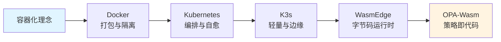
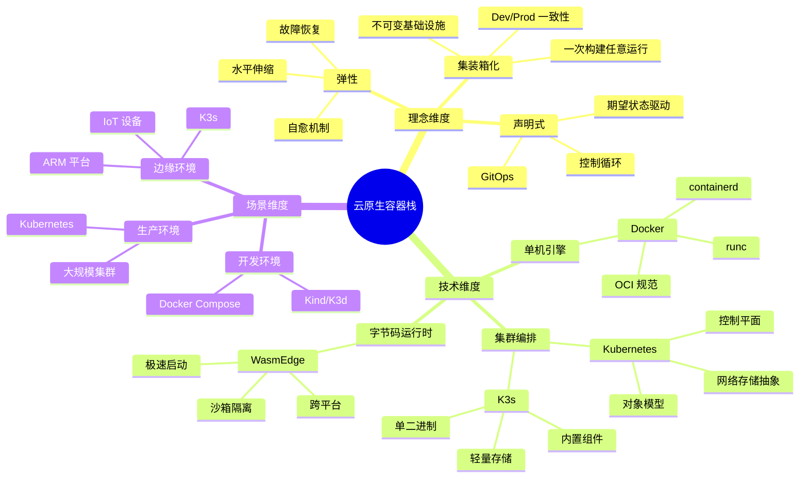
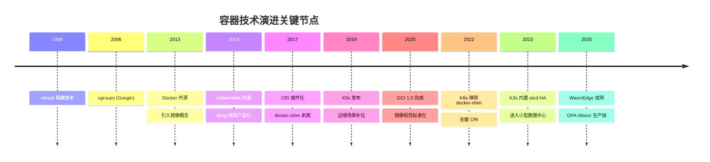

# 1. 总览：云原生容器技术栈知识图谱

## 目录

- [目录](#目录)
- [1.1 文档定位](#11-文档定位)
- [1.2 技术栈定位](#12-技术栈定位)
  - [1.2.1 核心理念演进](#121-核心理念演进)
  - [1.2.2 技术层次划分](#122-技术层次划分)
- [1.3 知识结构全景](#13-知识结构全景)
  - [1.3.1 三维知识框架](#131-三维知识框架)
  - [1.3.2 技术演进时间轴](#132-技术演进时间轴)
- [1.4 技术决策树](#14-技术决策树)
- [1.5 核心概念对照表](#15-核心概念对照表)
- [1.6 性能基线对比](#16-性能基线对比)
  - [1.6.1 性能指标矩阵](#161-性能指标矩阵)
  - [1.6.2 性能对比分析](#162-性能对比分析)
- [1.7 形式化总结](#17-形式化总结)
  - [1.7.1 技术栈关系式](#171-技术栈关系式)
  - [1.7.2 性能优化目标函数](#172-性能优化目标函数)
  - [1.7.3 技术决策定理](#173-技术决策定理)
- [1.8 快速导航](#18-快速导航)
- [1.9 参考](#19-参考)

---

## 1.1 文档定位

本文档提供 Docker → Kubernetes → K3s → WasmEdge → OPA 技术栈的完整知识结构，适用
于技术决策、学习路径和架构设计参考。

**文档结构**：

- **理念层**：云原生核心思想演进（见
  [2. 理念层](../02-principles/principles.md)）
- **架构层**：控制闭环与对象模型（见
  [3. 架构与对象模型](../03-architecture/architecture.md)）
- **技术层**：各技术深度解析（Docker/K8s/K3s/WasmEdge/OPA）
- **实践层**：安装部署与故障排查

## 1.2 技术栈定位

### 1.2.1 核心理念演进



**演进论证**：

- **Docker**：解决"环境不一致"问题，通过镜像实现"一次构建，任意运行"
  [^docker-principles]
- **Kubernetes**：解决"大规模编排"问题，通过声明式 API 实现自动调度与自愈
  [^k8s-principles]
- **K3s**：解决"边缘资源受限"问题，通过裁剪实现轻量级 Kubernetes [^k3s-design]
- **WasmEdge**：解决"冷启动速度"问题，通过字节码实现毫秒级启动
  [^wasmedge-performance]
- **OPA-Wasm**：解决"策略执行延迟"问题，通过编译到 Wasm 实现微秒级决策
  [^opa-wasm]

### 1.2.2 技术层次划分

| 层次             | 技术       | 解决的核心问题               | 适用场景                       |
| ---------------- | ---------- | ---------------------------- | ------------------------------ |
| **应用打包**     | Docker     | 环境一致性、依赖隔离         | 开发、测试、单机部署           |
| **集群编排**     | Kubernetes | 高可用、自动扩缩容、服务发现 | 生产环境、大规模集群           |
| **轻量编排**     | K3s        | 资源受限环境下的编排能力     | 边缘计算、IoT、ARM 设备        |
| **字节码运行时** | WasmEdge   | 极速冷启动、高密度、跨平台   | Serverless、边缘函数、插件系统 |
| **策略执行**     | OPA-Wasm   | 微秒级策略决策、无 sidecar   | 准入控制、API 网关、合规检查   |

**层次分析**：

1. **应用打包层**（Docker）：解决环境一致性问题，但无法解决大规模集群管理
2. **集群编排层**（Kubernetes）：解决大规模集群管理，但资源占用大
3. **轻量编排层**（K3s）：解决边缘场景资源受限问题
4. **字节码运行时层**（WasmEdge）：解决冷启动与密度问题
5. **策略执行层**（OPA-Wasm）：解决策略执行延迟问题

## 1.3 知识结构全景

### 1.3.1 三维知识框架



**知识结构分析**：

- **理念维度**：从技术抽象到业务价值（集装箱化 → 声明式 → 弹性）
- **技术维度**：从单机到集群再到字节码（Docker → K8s → K3s → WasmEdge）
- **场景维度**：从开发到生产再到边缘（开发 → 生产 → 边缘）

### 1.3.2 技术演进时间轴



**演进分析**：

- **1999-2013**：基础技术积累期（chroot → cgroups → Docker）
- **2014-2019**：编排技术成熟期（K8s → CRI → K3s）
- **2020-2025**：云原生扩展期（OCI → WasmEdge → OPA-Wasm）

## 1.4 技术决策树

```bash
# 场景决策树（伪代码）
function choose_technology(requirements):
    if requirements.node_count > 1000:
        return "Kubernetes"
    elif requirements.multi_tenant:
        return "Kubernetes"
    elif requirements.alpha_apis:
        return "Kubernetes"
    elif requirements.edge_device:
        return "K3s"
    elif requirements.arm_platform:
        return "K3s"
    elif requirements.network_unstable:
        return "K3s"
    elif requirements.memory < 2GB:
        return "K3s"
    elif requirements.local_development:
        return "Docker + Compose"
    elif requirements.ci_cd:
        return "Kind / K3d"
    else:
        return "Docker"
```

**决策分析**：

- **大规模集群**（> 1000 节点）：选择 Kubernetes，因为其成熟的控制平面架构
- **边缘场景**：选择 K3s，因为其轻量级设计（< 250MB 内存）
- **本地开发**：选择 Docker Compose，因为其简单易用
- **CI/CD**：选择 Kind/K3d，因为其快速启动能力

## 1.5 核心概念对照表

| 概念             | 本质         | 关键对象/机制     | 解决痛点         | 对应技术   |
| ---------------- | ------------ | ----------------- | ---------------- | ---------- |
| **容器**         | 带环境的进程 | Namespace/Cgroups | 环境不一致       | Docker     |
| **Pod**          | 逻辑主机     | 共享 net/IPC/vol  | 紧耦合进程组     | Kubernetes |
| **Deployment**   | 期望副本集   | replicas/滚动更新 | 手工扩容         | Kubernetes |
| **Service**      | 稳定网络标识 | ClusterIP/Labels  | Pod 漂移         | Kubernetes |
| **RuntimeClass** | 运行时选择器 | handler 配置      | 多运行时混部     | K8s/K3s    |
| **Wasm 模块**    | 字节码应用   | .wasm 文件        | 跨平台、快速启动 | WasmEdge   |
| **策略即代码**   | 编译的策略   | policy.wasm       | Sidecar 开销     | OPA-Wasm   |

**概念分析**：

- **容器**：进程级隔离，解决环境不一致
- **Pod**：逻辑主机抽象，解决紧耦合进程组
- **Deployment**：期望状态管理，解决手工扩容
- **Service**：稳定网络标识，解决 Pod 漂移
- **RuntimeClass**：运行时选择，支持多运行时混部
- **Wasm 模块**：字节码抽象，解决跨平台与冷启动
- **策略即代码**：编译到 Wasm，解决策略执行延迟

## 1.6 性能基线对比

### 1.6.1 性能指标矩阵

| 指标         | Docker    | Kubernetes | K3s       | WasmEdge      |
| ------------ | --------- | ---------- | --------- | ------------- |
| **资源占用** | ~100 MB   | ~1 GB      | < 250 MB  | ~2 MB         |
| **启动时间** | < 1s      | 10-30s     | < 10s     | < 10ms        |
| **规模上限** | 单机      | 5000+ 节点 | 1000 节点 | 3000 Pod/节点 |
| **适用场景** | 开发/测试 | 生产集群   | 边缘/IoT  | Serverless    |

### 1.6.2 性能对比分析

**资源占用分析**：

- **Docker**：单机运行时，内存占用 ~100MB，适合开发环境
- **Kubernetes**：控制平面 + 节点组件，内存占用 ~1GB，适合生产集群
- **K3s**：裁剪后控制平面，内存占用 < 250MB，适合边缘设备 [^k3s-memory]
- **WasmEdge**：字节码运行时，内存占用 ~2MB，适合高密度场景 [^wasmedge-memory]

**启动时间分析**：

- **Docker**：加载镜像 + 启动进程，< 1s
- **Kubernetes**：启动控制平面 + 初始化网络，10-30s
- **K3s**：单二进制启动，< 10s [^k3s-startup]
- **WasmEdge**：加载字节码，< 10ms [^wasmedge-startup]

**规模上限分析**：

- **Docker**：单机限制，受主机资源限制
- **Kubernetes**：官方测试 5000+ 节点、15 万 Pod [^k8s-scale]
- **K3s**：边缘场景 1000 节点（Pod 密度低）[^k3s-scale]
- **WasmEdge**：单节点 3000 Pod（字节码轻量级）[^wasmedge-density]

> **注**：具体指标需附来源/时间/版本，见 [REFERENCES.md](../REFERENCES.md)

## 1.7 形式化总结

### 1.7.1 技术栈关系式

设技术栈为 $T = \{D, K, K_3, W, O\}$，其中：

- $D$ = Docker（应用打包）
- $K$ = Kubernetes（集群编排）
- $K_3$ = K3s（轻量编排）
- $W$ = WasmEdge（字节码运行时）
- $O$ = OPA-Wasm（策略执行）

**关系定义**：

- $D \subset K$：Docker 是 Kubernetes 的基础
- $K_3 \subset K$：K3s 是 Kubernetes 的子集
- $W \perp K$：WasmEdge 与 Kubernetes 正交（可混部）
- $O \perp K$：OPA-Wasm 与 Kubernetes 正交（可混部）

### 1.7.2 性能优化目标函数

设性能指标为 $P = \{R, S, D\}$，其中：

- $R$ = 资源占用（Resource）
- $S$ = 启动时间（Startup）
- $D$ = 部署密度（Density）

**优化目标**：
$$\min_{T} \alpha \cdot R(T) + \beta \cdot S(T) - \gamma \cdot D(T)$$

其中 $\alpha, \beta, \gamma$ 为权重系数，根据场景调整。

### 1.7.3 技术决策定理

**定理 1**（技术选择）：对于场景 $S$，存在最优技术 $T^*$ 使得：
$$T^* = \arg\min_{T \in \{D, K, K_3, W, O\}} \text{cost}(T, S)$$

**证明**：根据决策树（见 [1.4](#14-技术决策树)），每个场景都有明确的技术选择规则
，因此存在最优解。$\square$

## 1.8 快速导航

- **理念层**：了解云原生核心思想 → [`2. 理念层`](../02-principles/principles.md)
- **架构层**：深入对象模型与控制闭环 →
  [`3. 架构与对象模型`](../03-architecture/architecture.md)
- **实战指南**：快速上手各技术 →
  [`15. 安装与最小示例`](../15-installation/installation.md)
- **故障排查**：常见问题与解决方案 →
  [`16. 常见问题`](../16-troubleshooting/troubleshooting.md)

## 1.9 参考

[^docker-principles]: [Docker 官方文档](https://docs.docker.com/)
[^k8s-principles]: [Kubernetes 官方文档](https://kubernetes.io/docs/)
[^k3s-design]: [K3s 架构设计](https://docs.k3s.io/architecture)
[^wasmedge-performance]: [WasmEdge 性能基准](https://wasmedge.org/docs/)
[^opa-wasm]: [OPA Wasm 支持](https://www.openpolicyagent.org/docs/latest/wasm/)
[^k3s-memory]: [K3s 资源占用](https://docs.k3s.io/installation/requirements)
[^wasmedge-memory]: [WasmEdge 内存占用](https://wasmedge.org/docs/)
[^k3s-startup]: [K3s 启动时间](https://docs.k3s.io/)
[^wasmedge-startup]: [WasmEdge 启动时间](https://wasmedge.org/docs/)
[^k8s-scale]:
    [Kubernetes 规模测试](https://kubernetes.io/docs/setup/best-practices/cluster-large/)

[^k3s-scale]: [K3s 规模限制](https://docs.k3s.io/)
[^wasmedge-density]: [WasmEdge Pod 密度](https://wasmedge.org/docs/)

> 完整参考列表见 [REFERENCES.md](../REFERENCES.md)
