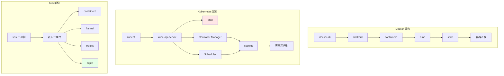
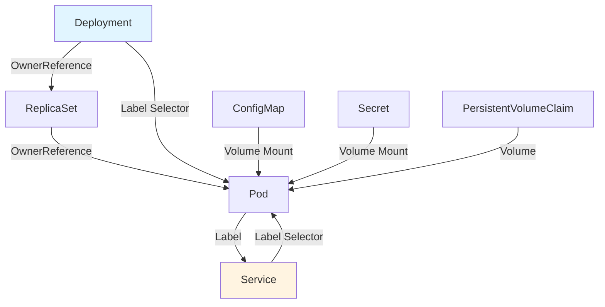
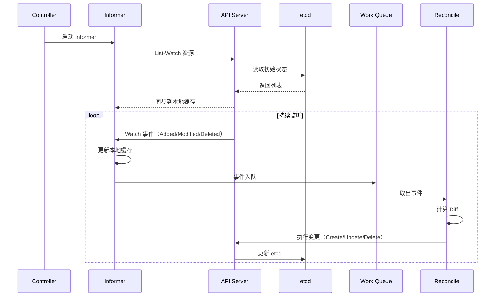
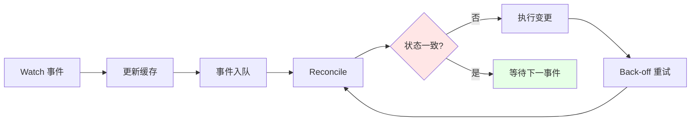
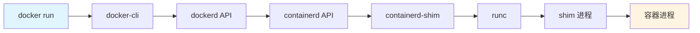
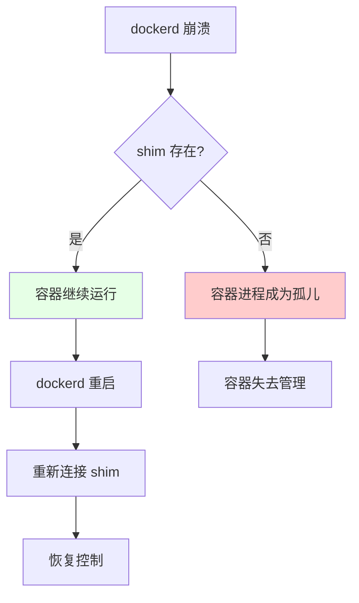
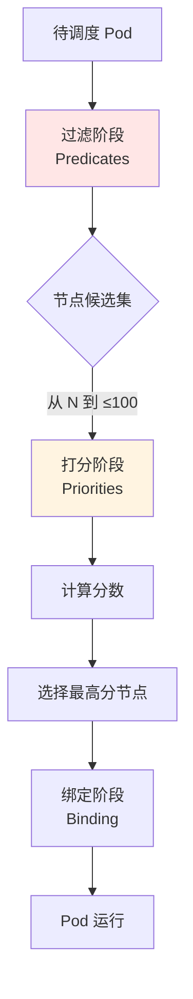
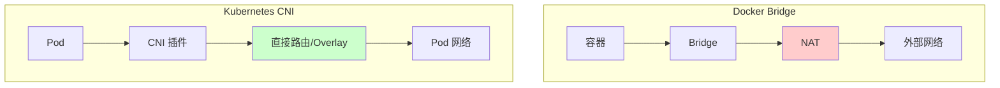
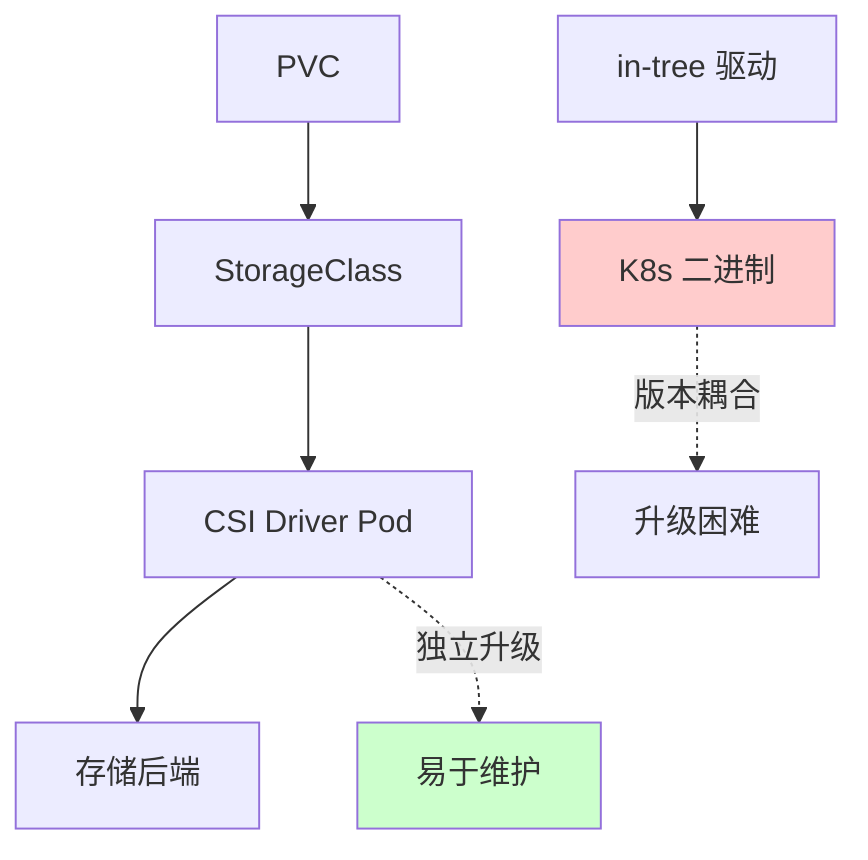
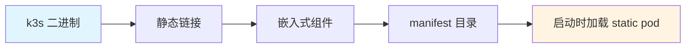

# 3. 架构与对象模型：控制闭环与数据结构

## 目录

- [目录](#目录)
- [3.1 文档定位](#31-文档定位)
- [3.2 架构层次对比](#32-架构层次对比)
  - [3.2.1 系统架构全景](#321-系统架构全景)
  - [3.2.2 架构设计论证](#322-架构设计论证)
- [3.3 Kubernetes 对象模型](#33-kubernetes-对象模型)
  - [3.3.1 GVR 模型](#331-gvr-模型)
  - [3.3.2 对象结构](#332-对象结构)
  - [3.3.3 对象关系模型](#333-对象关系模型)
  - [3.3.4 标签与选择器](#334-标签与选择器)
  - [3.3.5 对象模型论证](#335-对象模型论证)
- [3.4 控制闭环机制](#34-控制闭环机制)
  - [3.4.1 Informer 工作流程](#341-informer-工作流程)
  - [3.4.2 Controller 模式](#342-controller-模式)
  - [3.4.3 控制循环时序图](#343-控制循环时序图)
  - [3.4.4 控制闭环论证](#344-控制闭环论证)
- [3.5 Docker 控制路径](#35-docker-控制路径)
  - [3.5.1 调用链路](#351-调用链路)
  - [3.5.2 shim 的必要性](#352-shim-的必要性)
  - [3.5.3 技术场景与决策](#353-技术场景与决策)
- [3.6 Kubernetes 调度算法](#36-kubernetes-调度算法)
  - [3.6.1 调度流程](#361-调度流程)
  - [3.6.2 调度策略](#362-调度策略)
  - [3.6.3 调度场景与决策](#363-调度场景与决策)
- [3.7 网络模型强制要求](#37-网络模型强制要求)
  - [3.7.1 Kubernetes 网络原则](#371-kubernetes-网络原则)
  - [3.7.2 实现方式](#372-实现方式)
  - [3.7.3 网络模型对比](#373-网络模型对比)
  - [3.7.4 网络场景与决策](#374-网络场景与决策)
- [3.8 存储抽象：CSI](#38-存储抽象csi)
  - [3.8.1 CSI 的必要性](#381-csi-的必要性)
  - [3.8.2 存储模型](#382-存储模型)
  - [3.8.3 存储场景与决策](#383-存储场景与决策)
- [3.9 K3s 架构精简](#39-k3s-架构精简)
  - [3.9.1 裁剪清单](#391-裁剪清单)
  - [3.9.2 单二进制打包策略](#392-单二进制打包策略)
  - [3.9.3 高可用路径](#393-高可用路径)
  - [3.9.4 边缘场景存储决策](#394-边缘场景存储决策)
- [3.10 数据结构对比](#310-数据结构对比)
  - [3.10.1 数据结构分析](#3101-数据结构分析)
- [3.11 性能考量](#311-性能考量)
  - [3.11.1 事件吞吐](#3111-事件吞吐)
  - [3.11.2 K3s 性能论证](#3112-k3s-性能论证)
- [3.12 技术场景分析](#312-技术场景分析)
  - [3.12.1 大规模集群场景](#3121-大规模集群场景)
  - [3.12.2 边缘场景](#3122-边缘场景)
  - [3.12.3 混合架构场景](#3123-混合架构场景)
- [3.13 决策依据与思路](#313-决策依据与思路)
  - [3.13.1 架构选择决策树](#3131-架构选择决策树)
  - [3.13.2 存储选择决策树](#3132-存储选择决策树)
  - [3.13.3 网络选择决策树](#3133-网络选择决策树)
- [3.14 形式化总结](#314-形式化总结)
  - [3.14.1 架构模型形式化](#3141-架构模型形式化)
  - [3.14.2 性能模型形式化](#3142-性能模型形式化)
  - [3.14.3 对象模型形式化](#3143-对象模型形式化)
- [3.15 参考](#315-参考)

---

## 3.1 文档定位

本文档深入解析 Docker、Kubernetes、K3s 的架构设计、对象模型和控制闭环机制，以及
不同技术场景下的架构选择决策。

**文档结构**：

- **架构设计**：Docker/Kubernetes/K3s 的系统架构对比
- **对象模型**：Kubernetes GVR、对象结构、标签选择器
- **控制闭环**：Informer、Controller、控制循环机制
- **技术场景**：大规模集群、边缘场景、混合架构
- **决策分析**：架构选择、网络存储选择、调度策略选择

## 3.2 架构层次对比

### 3.2.1 系统架构全景



**架构层次分析**：

1. **Docker**：单机架构，控制路径简单（cli → dockerd → containerd → runc）
2. **Kubernetes**：集群架构，中心化控制平面（API Server + etcd + Controller +
   Scheduler）
3. **K3s**：轻量集群架构，单二进制 + 嵌入式组件
   （containerd/flannel/traefik/sqlite）

### 3.2.2 架构设计论证

**为什么 Docker 采用分层架构？**:

**决策依据**：

- ✅ 职责分离：每个组件职责单一，易于维护
- ✅ 解耦设计：组件间通过接口交互，降低耦合
- ✅ 可扩展性：插件化设计支持扩展

**决策思路**：

```yaml
Docker 架构选择:
  模式: 分层架构
  组件:
    - docker-cli: 用户接口
    - dockerd: 守护进程
    - containerd: 运行时接口
    - runc: OCI 运行时
  优势: 职责分离、解耦设计
  权衡: 调用链路较长
```

**为什么 Kubernetes 采用中心化架构？**:

**决策依据**：

- ✅ 状态一致性：中心化存储保证集群状态一致 [^k8s-architecture]
- ✅ 控制简化：统一入口简化控制逻辑
- ✅ 可扩展性：插件化设计支持扩展

**决策思路**：

```yaml
Kubernetes 架构选择:
  模式: 中心化架构
  中心: kube-api-server + etcd
  组件:
    - API Server: 统一入口
    - etcd: 状态存储
    - Controller: 状态管理
    - Scheduler: 调度决策
  优势: 状态一致、控制简化
  权衡: API Server 成为单点（通过 HA 解决）
```

**为什么 K3s 采用单二进制架构？**:

**决策依据**：

- ✅ 边缘场景：资源受限，需要轻量级部署 [^k3s-architecture]
- ✅ 安装简化：单二进制易于安装和升级
- ✅ 资源优化：嵌入式组件减少资源占用

**决策思路**：

```yaml
K3s 架构选择:
  模式: 单二进制架构
  策略:
    - 静态链接组件
    - 嵌入式 manifest
    - 启动时加载 static pod
  优势: 安装简单、资源占用小
  权衡: 升级需要替换二进制
```

## 3.3 Kubernetes 对象模型

### 3.3.1 GVR 模型

**定义**：每个 Kubernetes 资源遵循统一的 GVR（Group/Version/Resource）模式。

```text
资源类型 = Group/Version/Resource

示例：
- core/v1/Pod          # core 组，v1 版本，Pod 资源
- apps/v1/Deployment    # apps 组，v1 版本，Deployment 资源
- networking.k8s.io/v1/Ingress  # networking 组，v1 版本，Ingress 资源
```

**GVR 模型论证**：

- **Group**：资源分组，便于管理和扩展
- **Version**：版本管理，支持 API 演进
- **Resource**：资源类型，明确资源语义

### 3.3.2 对象结构

```yaml
apiVersion: apps/v1
kind: Deployment
metadata:
  name: nginx
  namespace: default
  labels:
    app: nginx
  uid: "abc-123"
  ownerReferences: [] # 依赖关系
spec:
  replicas: 3 # 期望状态
  selector:
    matchLabels:
      app: nginx
  template:
    metadata:
      labels:
        app: nginx
    spec:
      containers:
        - name: nginx
          image: nginx:latest
status:
  replicas: 3 # 实际状态
  readyReplicas: 3
  conditions: []
```

**对象结构分析**：

- **metadata**：元数据，包含名称、标签、UID、所有者引用
- **spec**：期望状态，定义资源的期望配置
- **status**：实际状态，记录资源的当前状态

### 3.3.3 对象关系模型



**对象关系论证**：

- **OwnerReference**：定义对象依赖关系，实现级联删除
- **Label Selector**：实现松耦合的服务发现和选择
- **Volume Mount**：实现配置和存储的挂载

### 3.3.4 标签与选择器

**核心机制**：所有对象通过 Label 做松散耦合，类比"数据库索引"。

```yaml
# Label 示例
metadata:
  labels:
    app: nginx
    version: v1
    tier: frontend

# Selector 示例
spec:
  selector:
    matchLabels:
      app: nginx
    matchExpressions:
      - key: version
        operator: In
        values: [v1, v2]
```

### 3.3.5 对象模型论证

**为什么采用 GVR 模型？**:

**决策依据**：

- ✅ API 版本管理：支持 API 演进和向后兼容
- ✅ 资源分组：逻辑上组织相关资源
- ✅ 扩展性：新资源可以独立版本管理

**为什么采用 Spec/Status 分离？**:

**决策依据**：

- ✅ 期望状态管理：Spec 定义期望，Status 记录实际
- ✅ 幂等性保证：可以重复应用 Spec
- ✅ 状态可见性：Status 提供实际状态信息

**为什么采用 Label Selector？**:

**决策依据**：

- ✅ 松耦合：服务间通过标签关联，降低耦合
- ✅ 高效查询：标签选择器支持高效的对象查询
- ✅ 灵活性：支持精确匹配和表达式匹配

## 3.4 控制闭环机制

### 3.4.1 Informer 工作流程



**Informer 模式论证**：

- **本地缓存**：减少 API Server 压力，提高响应速度
- **Watch 机制**：实时监听变化，避免轮询开销
- **工作队列**：异步处理事件，避免阻塞

### 3.4.2 Controller 模式

1. **Informer List-Watch**：从 etcd 同步资源到本地缓存
2. **本地缓存**：减少 API Server 压力
3. **事件入队**：事件进入 Work Queue
4. **Reconcile**：计算期望状态与实际状态差异
5. **执行变更**：下发命令到 API Server
6. **持续巡检**：循环执行上述步骤

### 3.4.3 控制循环时序图



### 3.4.4 控制闭环论证

**为什么采用 Informer 模式？**:

**决策依据**：

- ✅ 性能优化：本地缓存减少 API Server 负载
- ✅ 实时响应：Watch 机制实时监听变化
- ✅ 可靠性：工作队列保证事件不丢失

**为什么采用 Reconcile 模式？**:

**决策依据**：

- ✅ 幂等性：重复执行结果一致
- ✅ 容错性：故障恢复后自动修复
- ✅ 简洁性：统一的控制逻辑

**控制循环收敛定理**：参考
[2.5.2 控制循环收敛定理](../02-principles/principles.md#252-控制循环收敛定理)

## 3.5 Docker 控制路径

### 3.5.1 调用链路



**调用链路分析**：

1. **docker-cli**：用户命令行接口
2. **dockerd**：Docker 守护进程，管理镜像和容器
3. **containerd**：容器运行时接口，管理容器生命周期
4. **containerd-shim**：运行时 shim，隔离 containerd 与容器
5. **runc**：OCI 运行时，创建容器进程

### 3.5.2 shim 的必要性

**问题**：runc 退出后，容器进程（init 进程）会失去父进程，变成孤儿进程。

**解决方案**：shim 作为"轻量级 init"持有 STDIO 和 fifo，使 dockerd 可以重启而不
丢失容器。



**shim 必要性论证**：

- **孤儿进程问题**：runc 创建容器后立即退出，容器进程失去父进程
- **shim 作用**：shim 持有容器进程，避免成为孤儿
- **可恢复性**：dockerd 重启后可以重新连接 shim，恢复容器控制

### 3.5.3 技术场景与决策

**场景 1：单机容器管理**:

**决策依据**：

- ✅ 简单场景，不需要复杂架构
- ✅ 资源受限，需要轻量级设计

**决策思路**：

```yaml
Docker 架构适用场景:
  场景: 单机容器管理
  组件: docker-cli + dockerd + containerd + runc
  优势: 简单、轻量
  限制: 单机限制，无法集群管理
```

**场景 2：需要容器编排**:

**决策依据**：

- ✅ 多节点容器管理
- ✅ 需要服务发现和负载均衡

**决策思路**：

```yaml
Kubernetes 架构适用场景:
  场景: 多节点容器编排
  组件: API Server + etcd + Controller + Scheduler
  优势: 集群管理、服务发现
  限制: 资源占用大，部署复杂
```

**场景 3：边缘场景容器编排**:

**决策依据**：

- ✅ 边缘节点资源受限
- ✅ 需要轻量级 Kubernetes

**决策思路**：

```yaml
K3s 架构适用场景:
  场景: 边缘容器编排
  组件: k3s 单二进制 + 嵌入式组件
  优势: 轻量、易部署
  限制: 规模受限（1000 节点）
```

## 3.6 Kubernetes 调度算法

### 3.6.1 调度流程



**调度流程论证**：

1. **过滤阶段**：从 N 个节点筛选到 ≤100 个候选节点（性能优化）
2. **打分阶段**：计算每个候选节点的分数（资源优化）
3. **绑定阶段**：选择最高分节点并绑定（决策确定）

### 3.6.2 调度策略

| 阶段     | 算法                           | 目标                              |
| -------- | ------------------------------ | --------------------------------- |
| **过滤** | 节点资源检查、亲和性检查       | 从 N 个节点筛选到 ≤100 个候选节点 |
| **打分** | 资源碎片化最小化、镜像本地存在 | 选出最优节点                      |
| **绑定** | 异步绑定到节点                 | 更新 Pod 状态                     |

### 3.6.3 调度场景与决策

**场景 1：资源优化调度**:

**决策依据**：

- ✅ 最大化资源利用率
- ✅ 减少资源碎片

**决策思路**：

```yaml
调度策略:
  优先级: 资源碎片化最小
  算法: LeastRequestedPriority
  场景: 资源紧张环境
  效果: 提高资源利用率
```

**场景 2：性能优化调度**:

**决策依据**：

- ✅ 镜像本地已存在
- ✅ 节点亲和性

**决策思路**：

```yaml
调度策略:
  优先级: 镜像本地存在
  算法: ImageLocalityPriority
  场景: 大规模部署
  效果: 减少镜像拉取时间
```

**场景 3：高可用调度**:

**决策依据**：

- ✅ Pod 反亲和性
- ✅ 区域分散

**决策思路**：

```yaml
调度策略:
  优先级: Pod 分散
  算法: InterPodAffinityPriority
  场景: 高可用服务
  效果: Pod 分散到不同节点/区域
```

## 3.7 网络模型强制要求

### 3.7.1 Kubernetes 网络原则

1. **任意 Pod 与 Pod 直连**，无需 NAT
2. **节点与 Pod 直连**，无需 NAT
3. **Pod 看到自己的 IP**，与外部看到的一致

**网络原则论证**：

- **直连要求**：保证 Pod 间通信延迟低、性能高
- **无 NAT 要求**：简化网络模型，避免端口映射问题
- **IP 一致性**：Pod 内外看到相同 IP，简化服务发现

### 3.7.2 实现方式

| 方式        | 技术                       | 特点                  |
| ----------- | -------------------------- | --------------------- |
| **Overlay** | Flannel/VXLAN、Calico IPIP | 封装在现有网络之上    |
| **路由**    | Calico BGP、Cilium         | 直接路由，性能更好    |
| **Bridge**  | Docker 默认                | ❌ 被抛弃（需要 NAT） |

**实现方式论证**：

- **Overlay**：在现有网络之上封装，易于部署，性能相对较低
- **路由**：直接路由，性能更高，需要网络支持
- **Bridge**：需要 NAT，违反 K8s 网络原则，被抛弃

### 3.7.3 网络模型对比



### 3.7.4 网络场景与决策

**场景 1：小规模集群（< 100 节点）**:

**决策依据**：

- ✅ 简单易用优先
- ✅ 性能要求不高

**决策思路**：

```yaml
网络方案选择:
  CNI: Flannel
  模式: VXLAN
  原因: 简单易用，配置简单
  权衡: 性能相对较低
```

**场景 2：大规模集群（> 500 节点）**:

**决策依据**：

- ✅ 性能要求高
- ✅ 网络策略需求

**决策思路**：

```yaml
网络方案选择:
  CNI: Calico 或 Cilium
  模式: BGP 或 eBPF
  原因: 高性能、网络策略支持
  权衡: 配置相对复杂
```

**场景 3：安全要求高**:

**决策依据**：

- ✅ 需要细粒度网络策略
- ✅ 需要 L7 策略

**决策思路**：

```yaml
网络方案选择:
  CNI: Cilium
  模式: eBPF
  原因: eBPF 实现 L7 策略
  权衡: 需要内核支持
```

## 3.8 存储抽象：CSI

### 3.8.1 CSI 的必要性

**问题**：in-tree 存储驱动随 K8s 核心一起发布，导致：

- 版本耦合
- 升级困难
- 二进制体积大

**解决方案**：CSI 将驱动拆到外部 Pod，可独立升级。



**CSI 必要性论证**：

- **版本耦合问题**：in-tree 驱动与 K8s 核心版本绑定，升级困难
- **二进制体积问题**：所有存储驱动都打包在 K8s 二进制中，体积大
- **CSI 解决方案**：驱动独立运行在 Pod 中，可独立升级，降低核心体积

### 3.8.2 存储模型

```yaml
# StorageClass：定义存储类型
apiVersion: storage.k8s.io/v1
kind: StorageClass
metadata:
  name: fast-ssd
provisioner: pd.csi.storage.gke.io
parameters:
  type: pd-ssd

# PVC：声明存储需求
apiVersion: v1
kind: PersistentVolumeClaim
metadata:
  name: my-pvc
spec:
  storageClassName: fast-ssd
  accessModes:
    - ReadWriteOnce
  resources:
    requests:
      storage: 100Gi

# Pod：使用存储
spec:
  volumes:
    - name: data
      persistentVolumeClaim:
        claimName: my-pvc
  containers:
    - volumeMounts:
        - mountPath: /data
          name: data
```

### 3.8.3 存储场景与决策

**场景 1：本地存储**:

**决策依据**：

- ✅ 单节点存储需求
- ✅ 性能要求高

**决策思路**：

```yaml
存储方案:
  type: Local PV
  特点: 本地磁盘，高性能
  限制: 节点绑定，无法迁移
  适用: 有状态服务（StatefulSet）
```

**场景 2：网络存储**:

**决策依据**：

- ✅ 跨节点存储需求
- ✅ 需要共享存储

**决策思路**：

```yaml
存储方案:
  type: Network PV (NFS/Ceph)
  特点: 网络存储，可共享
  权衡: 性能相对较低
  适用: 需要共享存储的场景
```

**场景 3：云存储**:

**决策依据**：

- ✅ 云平台部署
- ✅ 需要动态供给

**决策思路**：

```yaml
存储方案:
  type: Cloud PV (EBS/Azure Disk)
  特点: 动态供给，高可用
  优势: 自动管理，按需扩容
  适用: 云平台部署场景
```

## 3.9 K3s 架构精简

### 3.9.1 裁剪清单

| 组件                         | K8s     | K3s                    |
| ---------------------------- | ------- | ---------------------- |
| **cloud-controller-manager** | ✅      | ❌ 裁剪                |
| **alpha API**                | ✅      | ❌ 裁剪                |
| **in-tree 存储驱动**         | ✅      | ❌ 裁剪                |
| **etcd**                     | ✅ 外部 | ✅ 可选（默认 sqlite） |
| **containerd**               | 外部    | ✅ 内置                |
| **flannel**                  | 外部    | ✅ 内置                |
| **traefik**                  | 外部    | ✅ 内置                |

**裁剪论证**：

- **cloud-controller-manager**：边缘场景无云环境，无需云控制器
- **alpha API**：边缘场景不需要实验性功能，减少 API 复杂度
- **in-tree 存储驱动**：统一使用 CSI，简化维护
- **etcd → sqlite**：边缘场景单节点，sqlite 足以，减少资源占用

### 3.9.2 单二进制打包策略



**打包策略论证**：

- **静态链接**：所有组件编译到单一二进制，减少依赖
- **嵌入式 manifest**：组件配置内嵌在二进制中
- **启动时加载**：根据 manifest 目录顺序启动 static pod

### 3.9.3 高可用路径

1. **嵌入式 etcd**：适合单节点或小规模
2. **外部 etcd**：适合中等规模（3-5 节点）
3. **外部 MySQL/PostgreSQL**：适合大规模或已有数据库

### 3.9.4 边缘场景存储决策

**问题域分析**：

- 边缘节点常掉电
- 网络不稳定
- 资源受限

**为什么边缘场景选 sqlite？**

**决策依据**：

- ✅ **边缘节点常掉电**：sqlite 单文件复制/备份成本最低
- ✅ **网络分区容忍**：本地继续运行，恢复后同步，接受"最终一致"
- ✅ **资源受限**：sqlite 内存占用极低，适合 ARM 设备

**决策思路**：

```yaml
边缘场景存储选择:
  场景: 边缘节点（ARM 设备）
  存储: sqlite（默认）
  原因:
    - 单文件备份简单
    - 本地运行，无需网络
    - 资源占用极低
  权衡:
    - 不支持多节点写入
    - 最终一致性，非强一致
  替代方案:
    - 外部 etcd（如果有稳定网络）
    - 外部数据库（如果有现成数据库）
```

**技术场景对比**：

| 场景               | 存储选择     | 决策依据       | 权衡         |
| ------------------ | ------------ | -------------- | ------------ |
| **单节点边缘**     | sqlite       | 简单、轻量     | 无高可用     |
| **小规模边缘集群** | 嵌入式 etcd  | 高可用、简单   | 资源占用增加 |
| **大规模边缘集群** | 外部 etcd/DB | 高可用、可扩展 | 依赖外部组件 |

## 3.10 数据结构对比

| 维度     | Docker Image | Kubernetes Object                        | K3s Object  |
| -------- | ------------ | ---------------------------------------- | ----------- |
| **寻址** | content-hash | namespace+name+uid                       | 同 K8s      |
| **依赖** | layer parent | OwnerReference                           | 同 K8s      |
| **存储** | tar + json   | etcd key = `/registry/{gvr}/{ns}/{name}` | sqlite 单表 |
| **事务** | 无           | etcd Raft                                | sqlite WAL  |

### 3.10.1 数据结构分析

**Docker Image**：

- **寻址**：content-hash，基于镜像内容计算
- **依赖**：layer parent，镜像层依赖关系
- **存储**：tar + json，文件系统 + 元数据

**Kubernetes Object**：

- **寻址**：namespace+name+uid，三元组唯一标识
- **依赖**：OwnerReference，对象依赖关系
- **存储**：etcd，分布式键值存储

**K3s Object**：

- **寻址**：同 K8s，兼容 K8s API
- **依赖**：同 K8s，兼容 K8s API
- **存储**：sqlite，单文件数据库

## 3.11 性能考量

### 3.11.1 事件吞吐

- **K8s 官方压测**：1 万节点、15 万 Pod，控制器 QPS 瓶颈在 kube-api-server 的
  etcd 前端，优化后 100k QPS [^k8s-performance]
- **K3s 裁剪后**：去掉大量 controller 与 alpha API，list-watch 压力下降
  40%；sqlite 本地调用延迟 0.1ms，比 etcd 网络往返 2ms 低一个量级
  [^k3s-performance]

### 3.11.2 K3s 性能论证

**为什么 K3s 能支持 1000 节点？**

**技术论证**：

1. **边缘节点 Pod 密度低**（平均 10 Pod/节点），总对象数 ≈1 万，sqlite 单线程足
   以
2. **网络拓扑星型**，跨节点 watch 少
3. **控制器精简后**，内存常驻 < 250MB，树莓派 4B（4GB）可承受

**性能模型**：
$$\text{Performance} = f(\text{Pod\_density}, \text{Network\_topology}, \text{Controller\_count})$$

其中：

- Pod 密度低 → 对象数少 → sqlite 性能足够
- 星型拓扑 → watch 少 → 网络压力小
- 控制器精简 → 内存占用小 → 资源充足

## 3.12 技术场景分析

### 3.12.1 大规模集群场景

**场景描述**：> 1000 节点，> 10 万 Pod

**架构挑战**：

1. **API Server 压力**：大量 Watch 请求
2. **etcd 性能**：大量写入操作
3. **调度性能**：调度延迟增加

**架构决策**：

```yaml
大规模集群架构:
  选择: Kubernetes（非 K3s）
  原因:
    - K3s 不支持 > 1000 节点
    - etcd 支持分布式部署
    - API Server 支持 HA
  优化:
    - API Server 副本
    - etcd 分片
    - 多个调度器
```

**决策依据**：

- ✅ 规模需求：> 1000 节点必须使用 K8s
- ✅ 性能需求：etcd 分布式部署支持更高吞吐
- ✅ 可用性需求：API Server HA 保证高可用

### 3.12.2 边缘场景

**场景描述**：边缘节点（ARM 设备），资源受限（< 4GB 内存）

**架构挑战**：

1. **资源受限**：内存和 CPU 有限
2. **网络不稳定**：经常掉线
3. **存储受限**：存储空间有限

**架构决策**：

```yaml
边缘场景架构:
  选择: K3s（非 Kubernetes）
  原因:
    - 资源占用小（< 250MB）
    - 单二进制部署简单
    - sqlite 本地存储
  优化:
    - 使用 sqlite（默认）
    - 嵌入式组件
    - 最小化控制器
```

**决策依据**：

- ✅ 资源受限：K3s 内存占用 < 250MB，K8s 需要 ~1GB
- ✅ 网络不稳定：sqlite 本地存储，不依赖网络
- ✅ 部署简单：单二进制，易于安装和升级

### 3.12.3 混合架构场景

**场景描述**：中心集群使用 K8s，边缘节点使用 K3s

**架构挑战**：

1. **统一管理**：如何统一管理两个集群
2. **网络连通**：边缘节点如何与中心集群通信
3. **配置同步**：如何同步配置和策略

**架构决策**：

```yaml
混合架构方案:
  中心集群: Kubernetes
  边缘集群: K3s
  管理方案:
    - Kubernetes Federation（统一 API）
    - GitOps（配置同步）
    - Service Mesh（服务发现）
  网络方案:
    - VPN 或专线（边缘到中心）
    - Flannel VXLAN（边缘内部）
```

**决策依据**：

- ✅ 场景匹配：中心需要完整 K8s，边缘需要轻量 K3s
- ✅ 统一管理：通过 Federation 或 GitOps 实现
- ✅ 网络连通：VPN/专线保证边缘到中心通信

## 3.13 决策依据与思路

### 3.13.1 架构选择决策树

```yaml
架构选择决策:
  if 节点数 > 1000: 选择 Kubernetes
  elif 边缘场景 or 资源受限 or 网络不稳定: 选择 K3s
  elif 单机容器管理: 选择 Docker
  else: 选择 Kubernetes（默认）
```

### 3.13.2 存储选择决策树

```yaml
存储选择决策:
  if 边缘场景 and 单节点: 选择 sqlite
  elif 边缘场景 and 小规模集群: 选择 嵌入式 etcd
  elif 大规模集群: 选择 外部 etcd
  elif 已有数据库: 选择 外部 MySQL/PostgreSQL
```

### 3.13.3 网络选择决策树

```yaml
网络选择决策:
  if 小规模集群 (< 100): 选择 Flannel
  elif 大规模集群 (> 500): 选择 Calico 或 Cilium
  elif 安全要求高: 选择 Cilium（eBPF）
  else: 选择 Flannel（默认）
```

## 3.14 形式化总结

### 3.14.1 架构模型形式化

设架构为 $A = \{C, S, D\}$，其中：

- $C$ = 控制平面（Control Plane）
- $S$ = 存储（Storage）
- $D$ = 数据平面（Data Plane）

**Docker 架构**： $$A_D = \{dockerd, local, runc\}$$

**Kubernetes 架构**：
$$A_K = \{\text{API Server} + \text{etcd}, \text{etcd}, \text{kubelet} + \text{CRI}\}$$

**K3s 架构**：
$$A_{K3} = \{\text{k3s 二进制}, \text{sqlite}, \text{kubelet} + \text{内置组件}\}$$

### 3.14.2 性能模型形式化

**K8s 性能模型**：
$$P_K(N, P) = \text{API\_QPS}(N) \times \text{etcd\_latency}(N, P)$$

其中：

- $N$ = 节点数
- $P$ = Pod 数
- $\text{API\_QPS}$ = API Server QPS（与节点数相关）
- $\text{etcd\_latency}$ = etcd 延迟（与节点数和 Pod 数相关）

**K3s 性能模型**：
$$P_{K3}(N, P) = \text{controller\_count} \times \text{sqlite\_latency}(P)$$

其中：

- 控制器数量减少 40%
- sqlite 延迟 = 0.1ms（本地调用）

### 3.14.3 对象模型形式化

**对象状态转换**： $$O_{t+1} = \text{Reconcile}(\text{Spec}, O_t)$$

其中 $O_t$ 是时间 $t$ 的对象状态，通过 Reconcile 函数计算下一状态。

**收敛性定理**：参考
[2.5.2 控制循环收敛定理](../02-principles/principles.md#252-控制循环收敛定理)

## 3.15 参考

[^k8s-architecture]:
    [Kubernetes Architecture](https://kubernetes.io/docs/concepts/architecture/)

[^k3s-architecture]: [K3s Architecture](https://docs.k3s.io/architecture)
[^k8s-performance]:
    [Kubernetes Performance](https://kubernetes.io/docs/setup/best-practices/cluster-large/)

[^k3s-performance]: [K3s Performance](https://docs.k3s.io/)

> 完整参考列表见 [REFERENCES.md](../REFERENCES.md)
