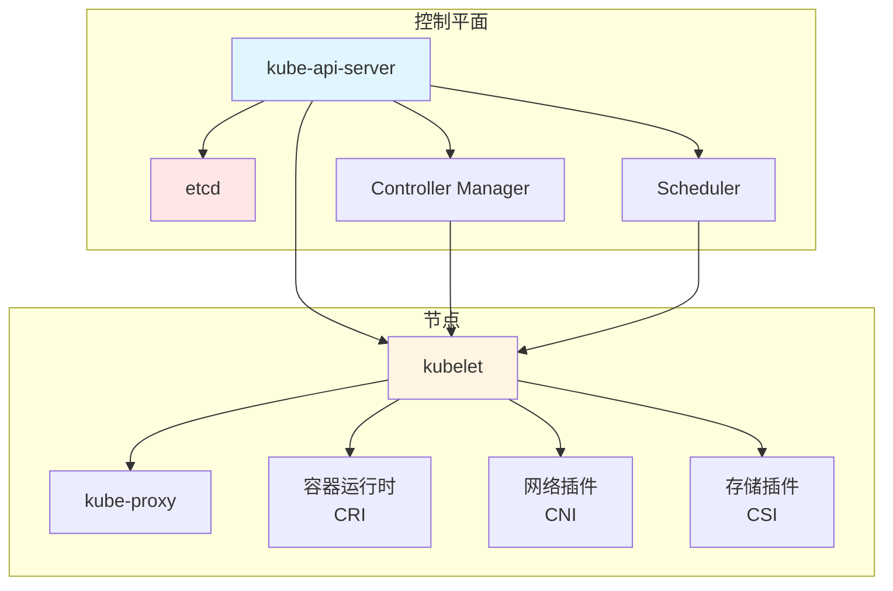
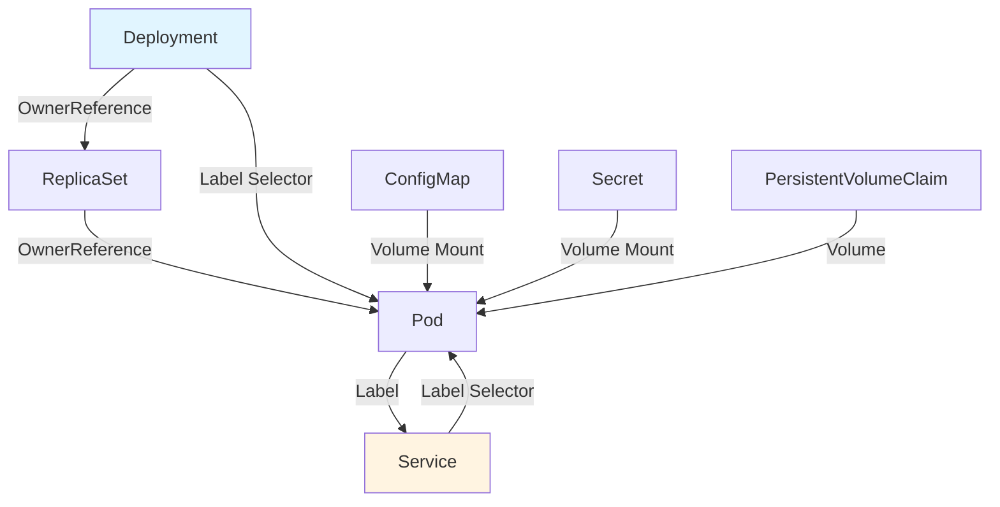
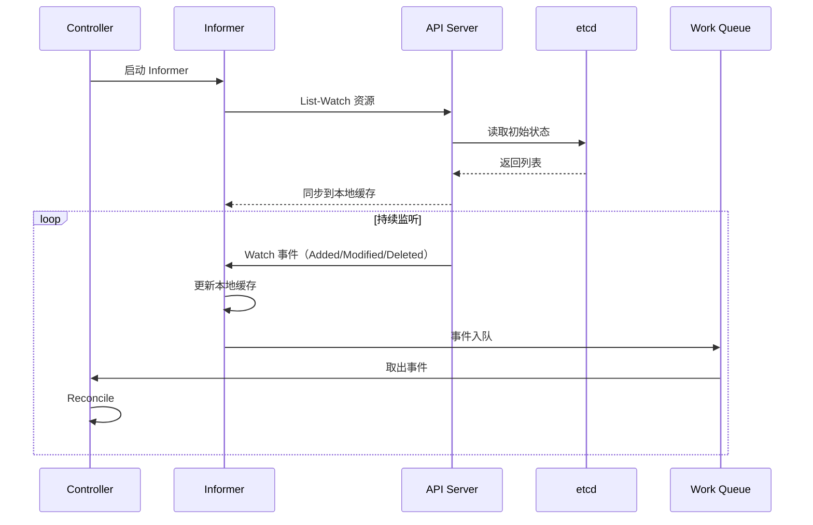
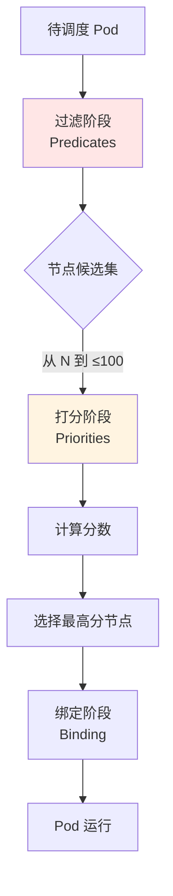

# 5. Kubernetes：集群编排架构与实践

## 目录

- [目录](#目录)
- [5.1 文档定位](#51-文档定位)
- [5.2 Kubernetes 架构](#52-kubernetes-架构)
  - [5.2.1 系统架构全景](#521-系统架构全景)
  - [5.2.2 控制平面组件](#522-控制平面组件)
  - [5.2.3 节点组件](#523-节点组件)
  - [5.2.4 架构设计论证](#524-架构设计论证)
- [5.3 对象模型](#53-对象模型)
  - [5.3.1 GVR 模型](#531-gvr-模型)
  - [5.3.2 对象结构](#532-对象结构)
  - [5.3.3 对象关系模型](#533-对象关系模型)
  - [5.3.4 标签与选择器](#534-标签与选择器)
- [5.4 控制闭环机制](#54-控制闭环机制)
  - [5.4.1 Informer 模式](#541-informer-模式)
  - [5.4.2 Controller 工作流程](#542-controller-工作流程)
  - [5.4.3 控制循环收敛](#543-控制循环收敛)
- [5.5 核心对象详解](#55-核心对象详解)
  - [5.5.1 Pod](#551-pod)
  - [5.5.2 Deployment](#552-deployment)
  - [5.5.3 Service](#553-service)
  - [5.5.4 Ingress](#554-ingress)
  - [5.5.5 ConfigMap 与 Secret](#555-configmap-与-secret)
- [5.6 网络模型](#56-网络模型)
  - [5.6.1 网络原则](#561-网络原则)
  - [5.6.2 CNI 插件](#562-cni-插件)
  - [5.6.3 网络场景与决策](#563-网络场景与决策)
- [5.7 存储模型](#57-存储模型)
  - [5.7.1 存储抽象](#571-存储抽象)
  - [5.7.2 CSI 插件](#572-csi-插件)
  - [5.7.3 存储场景与决策](#573-存储场景与决策)
- [5.8 调度机制](#58-调度机制)
  - [5.8.1 调度流程](#581-调度流程)
  - [5.8.2 调度策略](#582-调度策略)
  - [5.8.3 调度场景与决策](#583-调度场景与决策)
- [5.9 技术场景分析](#59-技术场景分析)
  - [5.9.1 大规模集群场景](#591-大规模集群场景)
  - [5.9.2 多租户场景](#592-多租户场景)
  - [5.9.3 混合云场景](#593-混合云场景)
- [5.10 决策依据与思路](#510-决策依据与思路)
  - [5.10.1 何时选择 Kubernetes？](#5101-何时选择-kubernetes)
  - [5.10.2 网络插件选择](#5102-网络插件选择)
  - [5.10.3 存储方案选择](#5103-存储方案选择)
- [5.11 形式化总结](#511-形式化总结)
  - [5.11.1 对象模型形式化](#5111-对象模型形式化)
  - [5.11.2 调度决策函数](#5112-调度决策函数)
  - [5.11.3 控制循环收敛定理](#5113-控制循环收敛定理)
- [5.12 参考](#512-参考)

---

## 5.1 文档定位

本文档深入解析 Kubernetes 的架构设计、对象模型、控制闭环机制，以及不同技术场景下
的决策依据和决策思路。

**文档结构**：

- **架构设计**：控制平面、节点组件、网络存储抽象
- **对象模型**：GVR、标签选择器、对象关系
- **控制闭环**：Informer、Controller、控制循环
- **技术场景**：大规模集群、多租户、混合云
- **决策分析**：架构选择、网络存储选择、调度策略选择

## 5.2 Kubernetes 架构

### 5.2.1 系统架构全景



**架构层次分析**：

1. **控制平面层**：API Server 为中心，etcd 存储状态，Controller 和 Scheduler 处
   理逻辑
2. **节点层**：kubelet 为核心，协调容器运行时、网络、存储
3. **通信层**：控制平面通过 API Server 与节点通信

### 5.2.2 控制平面组件

| 组件                        | 职责                     | 技术特点                |
| --------------------------- | ------------------------ | ----------------------- |
| **kube-api-server**         | API 网关，验证和存储对象 | RESTful API，支持 Watch |
| **etcd**                    | 分布式键值存储           | Raft 共识，强一致性     |
| **kube-controller-manager** | 运行控制器逻辑           | 控制循环，自动修复      |
| **kube-scheduler**          | Pod 调度决策             | 过滤+打分+绑定          |

**控制平面设计论证**：

- **API Server 中心化**：所有组件通过 API Server 交互，避免直接访问 etcd
- **etcd 状态存储**：使用 etcd 存储集群状态，保证一致性
- **控制器分离**：Controller 和 Scheduler 分离，职责清晰
- **Watch 机制**：通过 Watch 实现事件驱动，实时响应变化

### 5.2.3 节点组件

| 组件           | 职责               | 技术特点                |
| -------------- | ------------------ | ----------------------- |
| **kubelet**    | 节点代理，管理 Pod | CRI 接口，健康检查      |
| **kube-proxy** | 网络代理，服务发现 | iptables/ipvs，负载均衡 |
| **CRI 插件**   | 容器运行时接口     | containerd/CRI-O        |
| **CNI 插件**   | 网络接口           | Calico/Flannel/Cilium   |
| **CSI 插件**   | 存储接口           | 动态卷管理              |

**节点组件设计论证**：

- **kubelet 核心**：kubelet 作为节点核心，统一管理容器、网络、存储
- **插件化设计**：CRI/CNI/CSI 接口实现插件化，解耦核心和实现
- **网络代理分离**：kube-proxy 独立运行，实现服务发现和负载均衡

### 5.2.4 架构设计论证

**为什么采用中心化架构？**

**决策依据**：

- ✅ 状态一致性：中心化存储保证集群状态一致
- ✅ 控制简化：统一入口简化控制逻辑
- ✅ 可扩展性：插件化设计支持扩展

**决策思路**：

```yaml
架构选择:
  模式: 中心化架构
  原因:
    - 状态一致性需求
    - 控制简化需求
    - 可扩展性需求
  权衡:
    - API Server 成为单点（通过 HA 解决）
    - etcd 性能瓶颈（通过优化解决）
```

**为什么分离 Controller 和 Scheduler？**

**决策依据**：

- ✅ 职责分离：Controller 负责状态管理，Scheduler 负责调度决策
- ✅ 可扩展性：各自可以独立扩展和优化
- ✅ 解耦设计：降低组件间耦合

## 5.3 对象模型

### 5.3.1 GVR 模型

**定义**：每个 Kubernetes 资源遵循统一的 GVR（Group/Version/Resource）模式。

```
资源类型 = Group/Version/Resource

示例：
- core/v1/Pod          # core 组，v1 版本，Pod 资源
- apps/v1/Deployment    # apps 组，v1 版本，Deployment 资源
- networking.k8s.io/v1/Ingress  # networking 组，v1 版本，Ingress 资源
```

**GVR 模型论证**：

- **Group**：资源分组，便于管理和扩展
- **Version**：版本管理，支持 API 演进
- **Resource**：资源类型，明确资源语义

### 5.3.2 对象结构

```yaml
apiVersion: apps/v1
kind: Deployment
metadata:
  name: nginx
  namespace: default
  labels:
    app: nginx
  uid: "abc-123"
  ownerReferences: [] # 依赖关系
spec:
  replicas: 3 # 期望状态
  selector:
    matchLabels:
      app: nginx
  template:
    metadata:
      labels:
        app: nginx
    spec:
      containers:
        - name: nginx
          image: nginx:latest
status:
  replicas: 3 # 实际状态
  readyReplicas: 3
  conditions: []
```

**对象结构分析**：

- **metadata**：元数据，包含名称、标签、UID、所有者引用
- **spec**：期望状态，定义资源的期望配置
- **status**：实际状态，记录资源的当前状态

### 5.3.3 对象关系模型



**对象关系论证**：

- **OwnerReference**：定义对象依赖关系，实现级联删除
- **Label Selector**：实现松耦合的服务发现和选择
- **Volume Mount**：实现配置和存储的挂载

### 5.3.4 标签与选择器

**核心机制**：所有对象通过 Label 做松散耦合，类比"数据库索引"。

```yaml
# Label 示例
metadata:
  labels:
    app: nginx
    version: v1
    tier: frontend
    env: production

# Selector 示例
spec:
  selector:
    matchLabels:
      app: nginx
    matchExpressions:
      - key: version
        operator: In
        values: [v1, v2]
```

**标签选择器论证**：

- **松耦合**：通过标签实现服务间松耦合
- **高效查询**：标签选择器支持高效的对象查询
- **灵活匹配**：支持精确匹配和表达式匹配

## 5.4 控制闭环机制

### 5.4.1 Informer 模式



**Informer 模式论证**：

- **本地缓存**：减少 API Server 压力，提高响应速度
- **Watch 机制**：实时监听变化，避免轮询开销
- **工作队列**：异步处理事件，避免阻塞

### 5.4.2 Controller 工作流程

1. **Informer List-Watch**：从 etcd 同步资源到本地缓存
2. **本地缓存**：减少 API Server 压力
3. **事件入队**：事件进入 Work Queue
4. **Reconcile**：计算期望状态与实际状态差异
5. **执行变更**：下发命令到 API Server
6. **持续巡检**：循环执行上述步骤

### 5.4.3 控制循环收敛

**收敛性定理**：在有限时间内，实际状态会收敛到期望状态。

$$\lim_{t \to \infty} |S_a(t) - S_e(t)| = 0$$

**证明思路**：

1. Controller 每次操作都会减小 $|S_a(t) - S_e(t)|$
2. 在资源可用的情况下，差异会单调递减
3. 当 $|S_a(t) - S_e(t)| < \epsilon$ 时，系统达到收敛状态

## 5.5 核心对象详解

### 5.5.1 Pod

**本质**：逻辑主机，共享网络、IPC、存储。

**场景 1：单容器 Pod**

**决策依据**：

- ✅ 应用独立运行
- ✅ 无需进程间通信

**决策思路**：

```yaml
单容器 Pod:
  场景: Web 应用、API 服务
  配置: 1 个容器
  优势: 简单、易管理
```

**场景 2：多容器 Pod**

**决策依据**：

- ✅ 紧耦合进程组
- ✅ 需要共享存储或网络

**决策思路**：

```yaml
多容器 Pod:
  场景: Sidecar 模式、日志收集
  配置: 多个容器共享网络
  优势: 资源共享、协同工作
```

### 5.5.2 Deployment

**本质**：期望副本集，管理 Pod 的生命周期。

**场景 1：无状态服务**

**决策依据**：

- ✅ 应用无状态
- ✅ 需要滚动更新
- ✅ 需要自动扩容

**决策思路**：

```yaml
无状态服务:
  kind: Deployment
  策略:
    type: RollingUpdate
    maxSurge: 1
    maxUnavailable: 0
  HPA: 启用
```

**场景 2：有状态服务**

**决策依据**：

- ✅ 应用有状态
- ✅ 需要有序部署
- ✅ 需要持久化存储

**决策思路**：

```yaml
有状态服务:
  kind: StatefulSet # 不使用 Deployment
  特点:
    - 有序部署
    - 稳定网络标识
    - 持久化存储
```

### 5.5.3 Service

**本质**：稳定网络标识，实现服务发现和负载均衡。

**场景 1：ClusterIP（默认）**

**决策依据**：

- ✅ 集群内部访问
- ✅ 不需要外部访问

**决策思路**：

```yaml
ClusterIP Service:
  场景: 内部服务通信
  type: ClusterIP
  访问方式: 集群内通过 Service IP
```

**场景 2：NodePort**

**决策依据**：

- ✅ 需要节点端口访问
- ✅ 简单的外部访问方式

**决策思路**：

```yaml
NodePort Service:
  场景: 开发测试、简单部署
  type: NodePort
  访问方式: NodeIP:NodePort
```

**场景 3：LoadBalancer**

**决策依据**：

- ✅ 生产环境外部访问
- ✅ 云平台支持

**决策思路**：

```yaml
LoadBalancer Service:
  场景: 生产环境
  type: LoadBalancer
  访问方式: 云平台负载均衡器 IP
```

### 5.5.4 Ingress

**本质**：HTTP/HTTPS 路由和负载均衡。

**场景 1：单域名多路径**

**决策依据**：

- ✅ 多个服务共享域名
- ✅ 路径区分服务

**决策思路**：

```yaml
Ingress 配置:
  host: api.example.com
  paths:
    - path: /api
      service: api-service
    - path: /admin
      service: admin-service
```

**场景 2：多域名**

**决策依据**：

- ✅ 不同服务使用不同域名
- ✅ 需要 SSL 终止

**决策思路**：

```yaml
Ingress 配置:
  rules:
    - host: api.example.com
      tls:
        secretName: api-tls
    - host: www.example.com
      tls:
        secretName: www-tls
```

### 5.5.5 ConfigMap 与 Secret

**场景 1：配置文件管理**

**决策依据**：

- ✅ 配置需要从镜像分离
- ✅ 配置需要热更新

**决策思路**：

```yaml
ConfigMap 使用:
  kind: ConfigMap
  数据: 配置文件内容
  挂载方式: Volume Mount
  更新方式: 重启 Pod
```

**场景 2：敏感信息管理**

**决策依据**：

- ✅ 密码、密钥等敏感信息
- ✅ 需要加密存储

**决策思路**：

```yaml
Secret 使用:
  kind: Secret
  类型: Opaque/TLS/Docker-registry
  存储: base64 编码（非加密）
  建议: 使用外部 Secret 管理（Vault）
```

## 5.6 网络模型

### 5.6.1 网络原则

1. **任意 Pod 与 Pod 直连**，无需 NAT
2. **节点与 Pod 直连**，无需 NAT
3. **Pod 看到自己的 IP**，与外部看到的一致

### 5.6.2 CNI 插件

| 插件        | 实现方式      | 特点             | 适用场景   |
| ----------- | ------------- | ---------------- | ---------- |
| **Flannel** | VXLAN/host-gw | 简单易用         | 小规模集群 |
| **Calico**  | BGP/IPIP      | 高性能、网络策略 | 大规模集群 |
| **Cilium**  | eBPF          | 高性能、安全     | 现代集群   |

### 5.6.3 网络场景与决策

**场景 1：小规模集群（< 100 节点）**

**决策依据**：

- ✅ 简单易用优先
- ✅ 性能要求不高

**决策思路**：

```yaml
网络方案选择:
  CNI: Flannel
  原因: 简单易用，配置简单
  权衡: 性能相对较低
```

**场景 2：大规模集群（> 500 节点）**

**决策依据**：

- ✅ 性能要求高
- ✅ 网络策略需求

**决策思路**：

```yaml
网络方案选择:
  CNI: Calico 或 Cilium
  原因: 高性能、网络策略支持
  权衡: 配置相对复杂
```

**场景 3：安全要求高**

**决策依据**：

- ✅ 需要细粒度网络策略
- ✅ 需要 L7 策略

**决策思路**：

```yaml
网络方案选择:
  CNI: Cilium
  原因: eBPF 实现 L7 策略
  权衡: 需要内核支持
```

## 5.7 存储模型

### 5.7.1 存储抽象

**抽象层次**：

- **PV（PersistentVolume）**：集群级别的存储资源
- **PVC（PersistentVolumeClaim）**：用户级别的存储请求
- **StorageClass**：动态供给策略

### 5.7.2 CSI 插件

**为什么需要 CSI？**

**决策依据**：

- ✅ in-tree 驱动版本耦合
- ✅ 升级困难
- ✅ 二进制体积大

**解决方案**：

- CSI 将驱动拆到外部 Pod
- 可独立升级
- 降低核心二进制体积

### 5.7.3 存储场景与决策

**场景 1：本地存储（Local）**

**决策依据**：

- ✅ 单节点存储需求
- ✅ 性能要求高

**决策思路**：

```yaml
存储方案:
  type: Local PV
  特点: 本地磁盘，高性能
  限制: 节点绑定，无法迁移
```

**场景 2：网络存储（NFS/Ceph）**

**决策依据**：

- ✅ 跨节点存储需求
- ✅ 需要共享存储

**决策思路**：

```yaml
存储方案:
  type: Network PV
  特点: 网络存储，可共享
  权衡: 性能相对较低
```

**场景 3：云存储（EBS/Azure Disk）**

**决策依据**：

- ✅ 云平台部署
- ✅ 需要动态供给

**决策思路**：

```yaml
存储方案:
  type: Cloud PV
  特点: 动态供给，高可用
  优势: 自动管理，按需扩容
```

## 5.8 调度机制

### 5.8.1 调度流程



**调度流程论证**：

1. **过滤阶段**：从 N 个节点筛选到 ≤100 个候选节点
2. **打分阶段**：计算每个候选节点的分数
3. **绑定阶段**：选择最高分节点并绑定

### 5.8.2 调度策略

| 阶段     | 算法                           | 目标                              |
| -------- | ------------------------------ | --------------------------------- |
| **过滤** | 节点资源检查、亲和性检查       | 从 N 个节点筛选到 ≤100 个候选节点 |
| **打分** | 资源碎片化最小化、镜像本地存在 | 选出最优节点                      |
| **绑定** | 异步绑定到节点                 | 更新 Pod 状态                     |

### 5.8.3 调度场景与决策

**场景 1：资源优化**

**决策依据**：

- ✅ 最大化资源利用率
- ✅ 减少资源碎片

**决策思路**：

```yaml
调度策略:
  priority: 资源碎片化最小
  场景: 资源紧张环境
  效果: 提高资源利用率
```

**场景 2：性能优化**

**决策依据**：

- ✅ 镜像本地已存在
- ✅ 节点亲和性

**决策思路**：

```yaml
调度策略:
  priority: 镜像本地存在
  场景: 大规模部署
  效果: 减少镜像拉取时间
```

**场景 3：高可用**

**决策依据**：

- ✅ Pod 反亲和性
- ✅ 区域分散

**决策思路**：

```yaml
调度策略:
  affinity: PodAntiAffinity
  场景: 高可用服务
  效果: Pod 分散到不同节点
```

## 5.9 技术场景分析

### 5.9.1 大规模集群场景

**场景描述**：> 1000 节点，> 10 万 Pod

**挑战分析**：

1. **API Server 压力**：大量 Watch 请求
2. **etcd 性能**：大量写入操作
3. **调度性能**：调度延迟增加

**解决方案**：

```yaml
大规模集群优化:
  API Server:
    - 启用 API Server 副本
    - 使用本地 Informer 缓存
  etcd:
    - 优化 etcd 配置
    - 使用 etcd 分片
  调度器:
    - 启用多个调度器
    - 使用节点亲和性预选
```

**决策依据**：

- ✅ 性能要求高
- ✅ 可用性要求高

### 5.9.2 多租户场景

**场景描述**：多个团队共享集群，需要隔离

**挑战分析**：

1. **资源隔离**：需要 ResourceQuota
2. **网络隔离**：需要 NetworkPolicy
3. **权限隔离**：需要 RBAC

**解决方案**：

```yaml
多租户配置:
  资源隔离:
    - ResourceQuota（资源配额）
    - LimitRange（资源限制）
  网络隔离:
    - NetworkPolicy（网络策略）
  权限隔离:
    - RBAC（角色访问控制）
    - Namespace（命名空间）
```

**决策依据**：

- ✅ 安全隔离需求
- ✅ 资源公平分配需求

### 5.9.3 混合云场景

**场景描述**：应用部署在多个云平台或本地

**挑战分析**：

1. **网络连通**：跨云网络通信
2. **存储管理**：不同云存储策略
3. **统一管理**：统一 API 入口

**解决方案**：

```yaml
混合云方案:
  网络:
    - 使用 VPN 或专线
    - 使用 Service Mesh
  存储:
    - 使用抽象存储层
    - 使用对象存储
  管理:
    - 使用 Kubernetes Federation
    - 使用统一 API Gateway
```

**决策依据**：

- ✅ 多云部署需求
- ✅ 统一管理需求

## 5.10 决策依据与思路

### 5.10.1 何时选择 Kubernetes？

**决策依据**：

- ✅ 节点数 > 1000
- ✅ 需要多租户
- ✅ 需要 Alpha API
- ✅ 需要完整 Kubernetes 生态

**决策思路**：

```yaml
选择 Kubernetes 的条件:
  if 节点数 > 1000: 选择 Kubernetes
  elif 需要多租户: 选择 Kubernetes
  elif 需要 Alpha API: 选择 Kubernetes
  else: 考虑 K3s 或其他轻量方案
```

### 5.10.2 网络插件选择

**决策依据**：

- ✅ 集群规模
- ✅ 性能要求
- ✅ 网络策略需求

**决策思路**：

```yaml
网络插件选择:
  if 集群规模 < 100: 选择 Flannel
  elif 需要网络策略: 选择 Calico 或 Cilium
  elif 性能要求高: 选择 Cilium
  else: 选择 Flannel
```

### 5.10.3 存储方案选择

**决策依据**：

- ✅ 部署环境（云/本地）
- ✅ 性能要求
- ✅ 高可用要求

**决策思路**：

```yaml
存储方案选择:
  if 云平台部署: 使用云存储（EBS/Azure Disk）
  elif 高性能需求: 使用本地存储 + 副本
  elif 共享存储需求: 使用 NFS/Ceph
  else: 使用本地存储
```

## 5.11 形式化总结

### 5.11.1 对象模型形式化

设对象为 $O = \{M, S, T\}$，其中：

- $M$ = Metadata（元数据）
- $S$ = Spec（期望状态）
- $T$ = Status（实际状态）

**对象状态转换**： $$O_{t+1} = \text{Reconcile}(S, T_t)$$

其中 Reconcile 函数根据期望状态 $S$ 和当前实际状态 $T_t$ 计算下一状态
$T_{t+1}$。

### 5.11.2 调度决策函数

**调度函数**： $$S(P, N) = \arg\max_{n \in N'} \text{Score}(P, n)$$

其中：

- $P$ = Pod
- $N$ = 节点集合
- $N' = \text{Predicate}(P, N)$ = 过滤后的候选节点
- $\text{Score}(P, n)$ = 节点 $n$ 对 Pod $P$ 的分数

### 5.11.3 控制循环收敛定理

**定理 5.1**（控制循环收敛）：在有限时间内，实际状态会收敛到期望状态。

$$\lim_{t \to \infty} |T_t - S| = 0$$

**证明**：参考
[2.5.2 控制循环收敛定理](../02-principles/principles.md#252-控制循环收敛定理)

## 5.12 参考

[^k8s-architecture]:
    [Kubernetes 架构](https://kubernetes.io/docs/concepts/architecture/)

[^k8s-objects]:
    [Kubernetes 对象](https://kubernetes.io/docs/concepts/overview/working-with-objects/)

[^k8s-network]:
    [Kubernetes 网络](https://kubernetes.io/docs/concepts/cluster-administration/networking/)

[^k8s-storage]: [Kubernetes 存储](https://kubernetes.io/docs/concepts/storage/)
[^k8s-scheduling]:
    [Kubernetes 调度](https://kubernetes.io/docs/concepts/scheduling-eviction/)

> 完整参考列表见 [REFERENCES.md](../REFERENCES.md)
