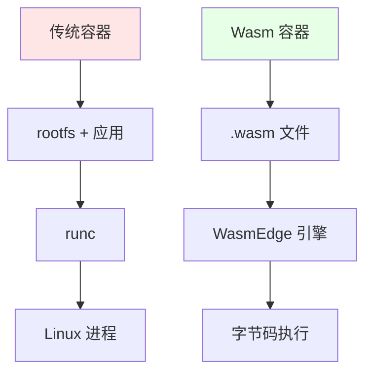
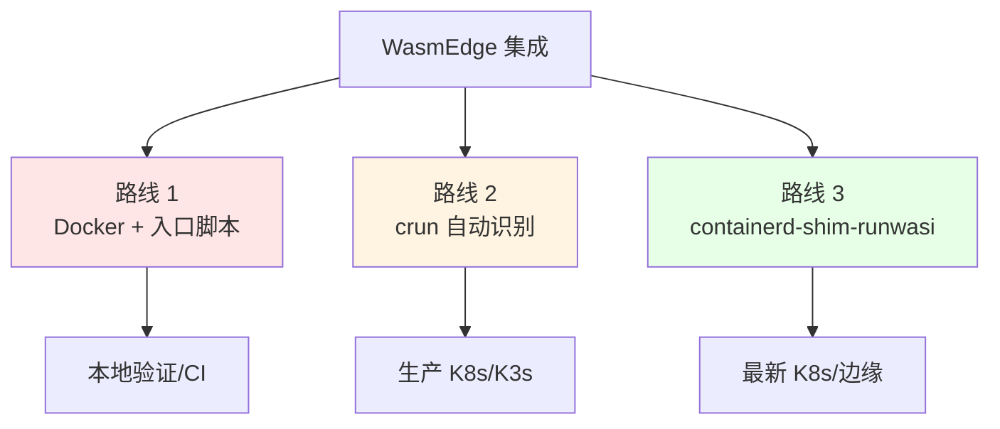
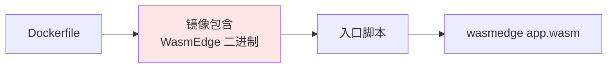
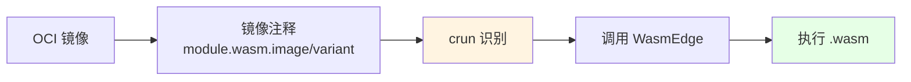
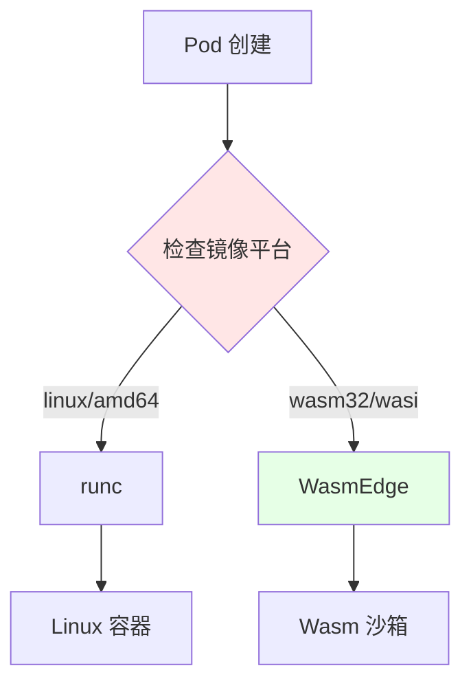
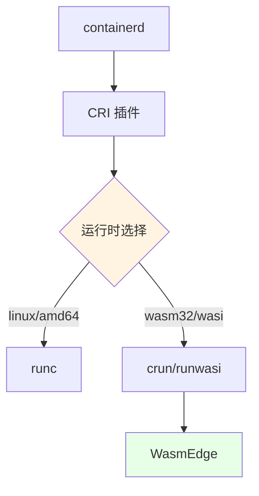
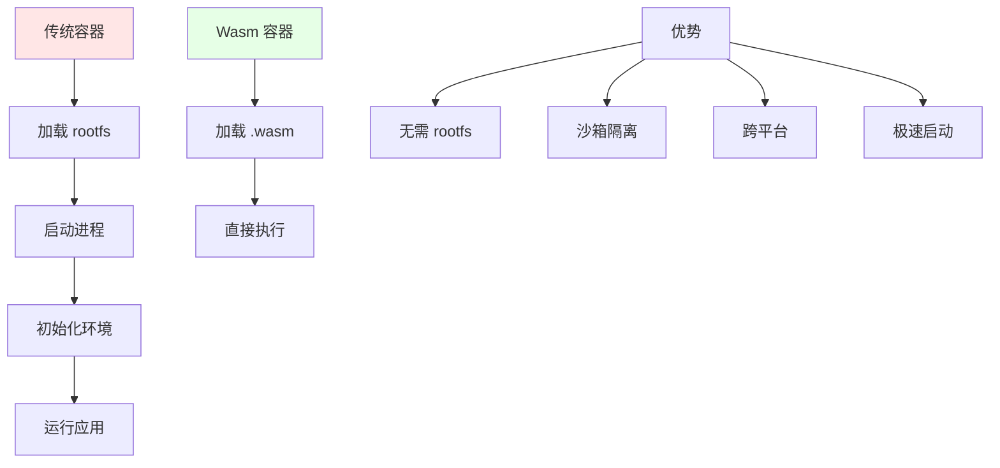

# WasmEdge：WebAssembly 运行时集成指南

本文档深入解析 WasmEdge 与 Docker/K8s/K3s 的集成方式、技术原理和最佳实践。

## 核心定位

### WasmEdge 是什么？

**不是**：在 Linux 容器内运行 WasmEdge **而是**：让 Wasm 字节码成为"一等公民"，
镜像里只有 `.wasm` 文件，运行时直接调用 WasmEdge 引擎。



## 三种集成路线

### 路线对比



| 路线                          | 启动方式                              | 是否需 rootfs                 | YAML 改造 | 适用场景       | 成熟度     |
| ----------------------------- | ------------------------------------- | ----------------------------- | --------- | -------------- | ---------- |
| **① Docker + WasmEdge**       | 入口脚本 `wasmedge app.wasm`          | ✅ 需要（含 WasmEdge 二进制） | ❌ 不需要 | 快速验证、CI   | ⭐⭐⭐     |
| **② crun 自动识别**           | crun 根据 OCI 注释 `module.wasm` 调用 | ❌ 不需要                     | ❌ 不需要 | 生产 K8s/K3s   | ⭐⭐⭐⭐⭐ |
| **③ containerd-shim-runwasi** | shim 直接启动 WasmEdge                | ❌ 不需要                     | ❌ 不需要 | 最新 K8s、边缘 | ⭐⭐⭐⭐   |

> **推荐顺序**：本地路线 ① → 测试路线 ② → 边缘/Serverless 路线 ③

## 路线 1：Docker + WasmEdge（快速验证）

### 架构



### 实现示例

```dockerfile
FROM ubuntu:22.04

# 安装 WasmEdge
RUN curl -sSf https://raw.githubusercontent.com/WasmEdge/WasmEdge/master/utils/install.sh | bash

# 复制 wasm 文件
COPY app.wasm /app.wasm

# 入口脚本
COPY entrypoint.sh /entrypoint.sh
RUN chmod +x /entrypoint.sh

ENTRYPOINT ["/entrypoint.sh"]
```

```bash
#!/bin/bash
# entrypoint.sh
wasmedge /app.wasm
```

### 优缺点

| 优点            | 缺点                           |
| --------------- | ------------------------------ |
| ✅ 实现简单     | ❌ 镜像体积大（包含 WasmEdge） |
| ✅ 无需修改 K8s | ❌ 需要 rootfs                 |
| ✅ 兼容性好     | ❌ 启动时间相对慢              |

## 路线 2：crun 自动识别（生产推荐）

### 架构



### OCI 注释

```yaml
apiVersion: v1
kind: Pod
metadata:
  name: wasm-app
  annotations:
    module.wasm.image/variant: compat-smart # 关键注释
spec:
  runtimeClassName: crun-wasm
  containers:
    - name: app
      image: yourhub/app-wasm:v1
      command: ["app.wasm"] # 可选，crun 会自动提取
```

### crun 配置

```yaml
apiVersion: node.k8s.io/v1
kind: RuntimeClass
metadata:
  name: crun-wasm
handler: crun
```

### 镜像构建（无需 Dockerfile）

```bash
# 使用 wasm-to-oci 工具
wasm-to-oci push app.wasm docker.io/yourhub/app-wasm:v1

# 或手动构建
cat > Dockerfile <<EOF
FROM scratch
COPY app.wasm /app.wasm
EOF
docker build -t yourhub/app-wasm:v1 .
```

### 优缺点

| 优点                    | 缺点                     |
| ----------------------- | ------------------------ |
| ✅ 零 rootfs            | ⚠️ 需要 crun ≥ 1.8.5     |
| ✅ 镜像体积小（< 1MB）  | ⚠️ 需要 RuntimeClass     |
| ✅ 启动速度快（< 10ms） | ⚠️ 需要节点安装 WasmEdge |
| ✅ 零 YAML 改造         |                          |

## 路线 3：containerd-shim-runwasi（最新）

### 架构


### 安装配置

```bash
# 安装 runwasi shim
containerd config default | sudo tee /etc/containerd/config.toml

# 配置 wasi runtime
[plugins."io.containerd.grpc.v1.cri".containerd.runtimes.wasm]
  runtime_type = "io.containerd.wasmedge.v1"
```

### RuntimeClass 配置

```yaml
apiVersion: node.k8s.io/v1
kind: RuntimeClass
metadata:
  name: wasm
handler: wasm
```

### 优缺点

| 优点            | 缺点                    |
| --------------- | ----------------------- |
| ✅ 原生集成     | ⚠️ 需要 containerd 配置 |
| ✅ 与 runc 并存 | ⚠️ 相对较新             |
| ✅ 零 rootfs    | ⚠️ 需要节点安装 runwasi |
| ✅ 统一管理     |                         |

## CRI 集成原理

### 运行时识别流程



### CRI 插件架构



## 性能优势

### 对比数据（同硬件 4C8G，100 并发冷启动）

| 指标                | 传统容器（alpine） | WasmEdge + crun | 提升倍数      |
| ------------------- | ------------------ | --------------- | ------------- |
| **镜像体积**        | 13 MB              | 0.9 MB          | **14× 更小**  |
| **启动时间**        | 1.2s               | 6ms             | **200× 更快** |
| **内存基线**        | 18 MB              | 2.1 MB          | **8.5× 更小** |
| **单节点密度**      | 300 Pod            | 3000 Pod        | **10× 更高**  |
| **冷启动 CPU 尖峰** | 80%                | 3%              | **26× 更低**  |

> **注**：具体指标需附来源/时间/版本，见 [REFERENCES.md](../REFERENCES.md)

### 性能优势原理



## 实战示例

### 准备 Wasm 字节码（Rust）

```bash
# 安装 Rust WASI target
rustup target add wasm32-wasi

# 创建项目
cargo new hello-wasm && cd hello-wasm

# 编写代码
cat >src/main.rs <<'EOF'
fn main() {
    println!("hello from WasmEdge inside K8s!");
}
EOF

# 编译
cargo build --release --target wasm32-wasi
# 得到 target/wasm32-wasi/release/hello-wasm.wasm
```

### 打包 OCI 镜像

```bash
# 方法 1：使用 wasm-to-oci
curl -sL https://github.com/engineerd/wasm-to-oci/releases/download/v0.1.1/linux-amd64-wasm-to-oci -o /usr/local/bin/wasm-to-oci
chmod +x /usr/local/bin/wasm-to-oci
wasm-to-oci push hello-wasm.wasm docker.io/yourhub/hello-wasm:v1

# 方法 2：手动构建
cat > Dockerfile <<EOF
FROM scratch
COPY hello-wasm.wasm /hello-wasm.wasm
EOF
docker build -t yourhub/hello-wasm:v1 .
docker push yourhub/hello-wasm:v1
```

### 部署到 K3s（crun 路线）

```bash
# 1. 在 K3s 节点安装 WasmEdge 和 crun
sudo apt install -y wasmedge crun

# 2. 创建 RuntimeClass
kubectl apply -f - <<EOF
apiVersion: node.k8s.io/v1
kind: RuntimeClass
metadata:
  name: crun-wasm
handler: crun
EOF

# 3. 部署 Pod
kubectl apply -f - <<EOF
apiVersion: v1
kind: Pod
metadata:
  name: hello-wasm
  annotations:
    module.wasm.image/variant: compat-smart
spec:
  runtimeClassName: crun-wasm
  containers:
    - name: app
      image: docker.io/yourhub/hello-wasm:v1
      command: ["hello-wasm.wasm"]
EOF

# 4. 查看日志
kubectl logs hello-wasm
# 输出：hello from WasmEdge inside K8s!
```

## 常见问题

### 故障排查

| 现象                    | 根因                                          | 修复                                         |
| ----------------------- | --------------------------------------------- | -------------------------------------------- |
| **kubectl logs 为空**   | crun 未把 wasm stdout 重定向到 cgroup 的 pipe | 升级 crun ≥ 1.8.5                            |
| **镜像拉取失败**        | docker hub 将 `.wasm` 视为 blob，需要 token   | 使用 `wasm-to-oci` 推送至 ghcr/阿里云 ACR    |
| **无法解析 DNS**        | WASI 预览版网络未完全支持                     | 启用 WasmEdge 的 `wasmedge_wasi_socket` 插件 |
| **HPA 基于 CPU 不触发** | Wasm 运行时间片极小，CPU 采样失真             | 改用 QPS 或自定义指标（KEDA）                |

> 更多故障排查见
> [16-troubleshooting/troubleshooting.md](../16-troubleshooting/troubleshooting.md)

## 最佳实践

### 镜像构建

```dockerfile
# ✅ 推荐：最小化镜像
FROM scratch
COPY app.wasm /app.wasm

# ❌ 避免：包含 WasmEdge 二进制（除非路线 1）
FROM ubuntu
RUN apt-get install -y wasmedge  # 不必要
```

### 网络配置

```yaml
# 启用 WASI socket 支持
apiVersion: v1
kind: Pod
metadata:
  name: wasm-app
spec:
  runtimeClassName: crun-wasm
  containers:
    - name: app
      image: yourhub/app-wasm:v1
      env:
        - name: WASMEDGE_WASI_SOCKET
          value: "true"
```

### 资源限制

```yaml
spec:
  containers:
    - name: wasm-app
      resources:
        requests:
          memory: "10Mi" # Wasm 应用内存占用小
          cpu: "50m"
        limits:
          memory: "50Mi"
          cpu: "200m"
```

## 参考

- [WasmEdge 官方文档](https://wasmedge.org/docs/)
- [WasmEdge GitHub](https://github.com/WasmEdge/WasmEdge)
- [crun wasm 支持](https://github.com/containers/crun/blob/main/docs/wasm-wasi.md)
- [containerd-shim-runwasi](https://github.com/containerd/runwasi)

> 更多参考见 [REFERENCES.md](../REFERENCES.md)
