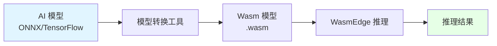
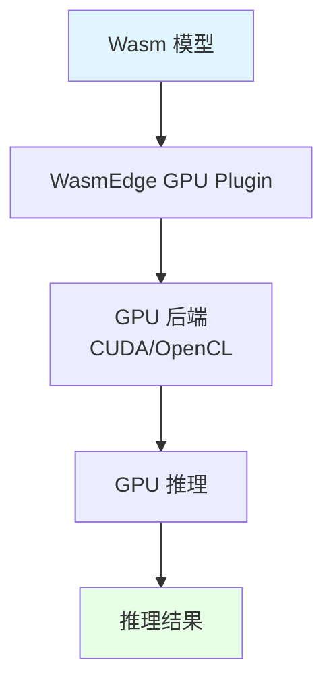

# 12. AI 推理（WasmEdge）：模型 Wasm 化与轻量插件

## 目录

- [目录](#目录)
- [12.1 文档定位](#121-文档定位)
- [12.2 AI 推理场景](#122-ai-推理场景)
  - [12.2.1 边缘 AI 推理](#1221-边缘-ai-推理)
  - [12.2.2 模型 Wasm 化](#1222-模型-wasm-化)
  - [12.2.3 轻量插件方案](#1223-轻量插件方案)
- [12.3 技术对比](#123-技术对比)
  - [12.3.1 容器化 Python 推理 vs Wasm 推理](#1231-容器化-python-推理-vs-wasm-推理)
  - [12.3.2 性能对比分析](#1232-性能对比分析)
  - [12.3.3 成本对比分析](#1233-成本对比分析)
- [12.4 低延迟优化](#124-低延迟优化)
  - [12.4.1 启动延迟优化](#1241-启动延迟优化)
  - [12.4.2 推理延迟优化](#1242-推理延迟优化)
  - [12.4.3 延迟优化论证](#1243-延迟优化论证)
- [12.5 GPU 集成](#125-gpu-集成)
  - [12.5.1 WasmEdge GPU Plugin](#1251-wasmedge-gpu-plugin)
  - [12.5.2 GPU 推理架构](#1252-gpu-推理架构)
  - [12.5.3 GPU 集成论证](#1253-gpu-集成论证)
- [12.6 技术场景分析](#126-技术场景分析)
  - [12.6.1 边缘 AI 推理场景](#1261-边缘-ai-推理场景)
  - [12.6.2 云端 AI 推理场景](#1262-云端-ai-推理场景)
  - [12.6.3 混合 AI 推理场景](#1263-混合-ai-推理场景)
- [12.7 决策依据与思路](#127-决策依据与思路)
  - [12.7.1 AI 推理场景决策树](#1271-ai-推理场景决策树)
  - [12.7.2 模型选择决策树](#1272-模型选择决策树)
  - [12.7.3 GPU 集成决策树](#1273-gpu-集成决策树)
- [12.8 形式化总结](#128-形式化总结)
  - [12.8.1 AI 推理延迟模型形式化](#1281-ai-推理延迟模型形式化)
  - [12.8.2 AI 推理成本模型形式化](#1282-ai-推理成本模型形式化)
- [12.9 参考](#129-参考)

---

## 12.1 文档定位

本文档深入解析 WasmEdge 在 AI 推理场景中的应用，包括模型 Wasm 化、轻量插件方案和
低延迟优化的技术原理、实现方式和最佳实践。

**文档结构**：

- **AI 推理场景**：边缘 AI 推理、模型 Wasm 化、轻量插件方案
- **技术对比**：容器化 Python 推理 vs Wasm 推理的性能和成本对比
- **低延迟优化**：启动延迟和推理延迟的优化方案
- **GPU 集成**：WasmEdge GPU Plugin 的技术原理和应用
- **技术场景**：边缘、云端、混合 AI 推理场景的架构设计

## 12.2 AI 推理场景

### 12.2.1 边缘 AI 推理

**场景描述**：在边缘节点运行 AI 推理，降低延迟，减少数据传输。

**技术需求**：

- **低延迟**：需要 < 50ms 推理延迟
- **资源受限**：边缘节点资源有限
- **离线能力**：需要离线运行能力

**架构设计**：

```yaml
边缘 AI 推理架构:
  编排层: K3s（轻量 Kubernetes）
  运行时: WasmEdge（快速启动、低资源）
  模型: Wasm 模型（.wasm 文件）
  GPU: 可选 GPU（加速推理）
  特点: 低延迟、资源受限、离线能力
```

**边缘 AI 推理论证**：

- **低延迟需求**：WasmEdge 启动 < 10ms，推理延迟 < 50ms
- **资源受限**：Wasm 模型体积小，内存占用低，适合边缘节点
- **离线能力**：模型存储在本地，支持离线推理

### 12.2.2 模型 Wasm 化

**模型 Wasm 化**：将 AI 模型编译为 Wasm 格式，在 WasmEdge 中运行。

**Wasm 化流程**：



**模型 Wasm 化论证**：

- **体积优化**：Wasm 模型体积小，便于传输和存储
- **跨平台**：Wasm 跨平台，可在不同架构运行
- **快速启动**：Wasm 启动快，满足边缘 AI 延迟要求

### 12.2.3 轻量插件方案

**轻量插件**：WasmEdge 提供轻量级 AI 推理插件，支持多种 AI 框架。

**插件类型**：

- **WASI-NN**：神经网络推理插件
- **TensorFlow Lite**：TensorFlow Lite 插件
- **ONNX Runtime**：ONNX Runtime 插件

**轻量插件论证**：

- **轻量级**：插件体积小，资源占用低
- **多框架**：支持多种 AI 框架（TensorFlow、ONNX 等）
- **高性能**：插件优化，推理性能好

## 12.3 技术对比

### 12.3.1 容器化 Python 推理 vs Wasm 推理

| 指标         | 容器化 Python 推理 | Wasm 推理 | 提升倍数          |
| ------------ | ------------------ | --------- | ----------------- |
| **启动时间** | 1-2s               | 6-10ms    | **100-200× 更快** |
| **镜像体积** | 500MB-2GB          | 1-10MB    | **50-200× 更小**  |
| **内存占用** | 100-500MB          | 10-50MB   | **10× 更小**      |
| **推理延迟** | 50-100ms           | 20-50ms   | **2× 更快**       |
| **CPU 占用** | 高                 | 低        | **更低**          |

**对比论证**：

- **启动时间**：Wasm 启动 < 10ms，比容器快 100-200 倍
- **镜像体积**：Wasm 镜像 < 10MB，比容器小 50-200 倍
- **内存占用**：Wasm 内存 10-50MB，比容器小 10 倍
- **推理延迟**：Wasm 推理延迟 20-50ms，比容器快 2 倍

### 12.3.2 性能对比分析

**性能优势**：

- **启动速度**：Wasm 启动 < 10ms，满足边缘 AI 延迟要求
- **资源占用**：Wasm 资源占用低，适合资源受限环境
- **推理性能**：Wasm 推理延迟低，满足实时推理要求

**性能论证**：

- **启动速度**：Wasm 启动 < 10ms，比容器快 100 倍，满足边缘 AI 延迟要求
- **资源占用**：Wasm 内存 10-50MB，比容器小 10 倍，适合资源受限环境
- **推理性能**：Wasm 推理延迟 20-50ms，比容器快 2 倍，满足实时推理要求

### 12.3.3 成本对比分析

**成本优势**：

- **存储成本**：Wasm 镜像体积小，存储成本低
- **计算成本**：Wasm 资源占用低，计算成本低
- **传输成本**：Wasm 镜像体积小，传输成本低

**成本论证**：

- **存储成本**：Wasm 镜像 < 10MB，比容器小 50-200 倍，存储成本低
- **计算成本**：Wasm 内存 10-50MB，比容器小 10 倍，计算成本低
- **传输成本**：Wasm 镜像体积小，传输成本低

## 12.4 低延迟优化

### 12.4.1 启动延迟优化

**优化策略**：

```yaml
启动延迟优化:
  运行时: WasmEdge（启动 < 10ms）
  镜像: scratch（零 rootfs，体积 < 1MB）
  预热: Pod 预热（保持最小 Pod 数）
  优势: 极速启动、低资源占用
```

**启动延迟优化论证**：

- **WasmEdge**：启动 < 10ms，比容器快 100 倍
- **零 rootfs**：使用 scratch 镜像，无需加载文件系统
- **Pod 预热**：保持最小 Pod 数，避免冷启动

### 12.4.2 推理延迟优化

**优化策略**：

```yaml
推理延迟优化:
  模型优化: 模型量化、剪枝
  GPU 加速: 使用 GPU 加速推理
  批量推理: 批量处理请求
  优势: 低推理延迟、高吞吐量
```

**推理延迟优化论证**：

- **模型优化**：模型量化、剪枝，减少计算量
- **GPU 加速**：使用 GPU 加速推理，降低延迟
- **批量推理**：批量处理请求，提高吞吐量

### 12.4.3 延迟优化论证

**为什么 Wasm 推理延迟更低？**

**技术论证**：

1. **启动速度快**：Wasm 启动 < 10ms，比容器快 100 倍
2. **资源占用低**：Wasm 资源占用低，减少资源竞争
3. **模型优化**：Wasm 模型可以优化，减少计算量

**延迟优化模型**：
$$L_{\text{total}} = L_{\text{startup}} + L_{\text{inference}}$$

其中：

- $L_{\text{startup}}$ = 启动延迟（Wasm < 10ms，容器 > 1s）
- $L_{\text{inference}}$ = 推理延迟（Wasm 20-50ms，容器 50-100ms）

**优化目标**：
$$\min_{W} L_{\text{total}} = \min_{W} (L_{\text{startup}} \downarrow + L_{\text{inference}} \downarrow)$$

## 12.5 GPU 集成

### 12.5.1 WasmEdge GPU Plugin

**GPU Plugin**：WasmEdge 提供 GPU 插件，支持 GPU 加速推理。

**GPU Plugin 特点**：

- **GPU 加速**：支持 GPU 加速推理
- **多框架**：支持 TensorFlow、ONNX 等框架
- **跨平台**：支持 CUDA、OpenCL 等 GPU 后端

**GPU Plugin 论证**：

- **GPU 加速**：使用 GPU 加速推理，降低延迟
- **多框架**：支持多种 AI 框架，灵活选择
- **跨平台**：支持多种 GPU 后端，兼容性好

### 12.5.2 GPU 推理架构



**GPU 推理架构论证**：

- **Wasm 模型**：模型以 Wasm 格式存储
- **GPU Plugin**：WasmEdge GPU Plugin 处理 GPU 推理
- **GPU 后端**：支持 CUDA、OpenCL 等 GPU 后端

### 12.5.3 GPU 集成论证

**为什么需要 GPU 集成？**

**决策依据**：

- ✅ **性能需求**：GPU 加速推理，降低延迟
- ✅ **边缘 AI**：在边缘节点运行 AI 推理，需要 GPU 加速
- ✅ **实时推理**：满足实时推理延迟要求

**决策思路**：

```yaml
GPU 集成策略:
  Plugin: WasmEdge GPU Plugin
  后端: CUDA/OpenCL
  应用: 边缘 AI 推理、实时推理
  优势: GPU 加速、低延迟、高吞吐量
```

## 12.6 技术场景分析

### 12.6.1 边缘 AI 推理场景

**场景描述**：在边缘节点运行 AI 推理，降低延迟，减少数据传输。

**架构挑战**：

1. **低延迟**：需要 < 50ms 推理延迟
2. **资源受限**：边缘节点资源有限
3. **离线能力**：需要离线运行能力

**架构决策**：

```yaml
边缘 AI 推理配置:
  编排: K3s（轻量 Kubernetes）
  运行时: WasmEdge（快速启动、低资源）
  模型: Wasm 模型（.wasm 文件）
  GPU: 可选 GPU（加速推理）
  优势: 低延迟、资源受限、离线能力
```

**决策依据**：

- ✅ **低延迟**：WasmEdge 启动 < 10ms，推理延迟 < 50ms
- ✅ **资源受限**：Wasm 模型体积小，内存占用低
- ✅ **离线能力**：模型存储在本地，支持离线推理

### 12.6.2 云端 AI 推理场景

**场景描述**：在云端运行 AI 推理，提供高吞吐量推理服务。

**架构挑战**：

1. **高吞吐量**：需要支持高并发推理请求
2. **资源充足**：云端资源充足
3. **GPU 加速**：需要使用 GPU 加速推理

**架构决策**：

```yaml
云端 AI 推理配置:
  编排: Kubernetes（大规模集群）
  运行时: WasmEdge（高密度部署）
  模型: Wasm 模型（.wasm 文件）
  GPU: GPU 加速（CUDA/OpenCL）
  优势: 高吞吐量、GPU 加速、高密度部署
```

**决策依据**：

- ✅ **高吞吐量**：单节点可部署 3000 Pod，支持高并发
- ✅ **GPU 加速**：使用 GPU 加速推理，提高吞吐量
- ✅ **高密度部署**：Wasm 资源占用低，支持高密度部署

### 12.6.3 混合 AI 推理场景

**场景描述**：边缘节点和云端协同，实现混合 AI 推理。

**架构挑战**：

1. **边缘推理**：边缘节点进行实时推理
2. **云端训练**：云端进行模型训练和更新
3. **模型同步**：边缘和云端模型同步

**架构决策**：

```yaml
混合 AI 推理配置:
  边缘: K3s + WasmEdge + Wasm 模型
  云端: Kubernetes + WasmEdge + Wasm 模型
  同步: OCI 镜像（模型版本管理）
  优势: 边缘推理、云端训练、模型同步
```

**决策依据**：

- ✅ **边缘推理**：边缘节点运行实时推理，降低延迟
- ✅ **云端训练**：云端进行模型训练，资源充足
- ✅ **模型同步**：通过 OCI 镜像同步模型，版本管理

## 12.7 决策依据与思路

### 12.7.1 AI 推理场景决策树

```yaml
AI 推理场景决策:
  if 边缘 AI（低延迟）: K3s + WasmEdge + Wasm 模型
  elif 云端 AI（高吞吐量）: Kubernetes + WasmEdge + GPU
  elif 混合 AI（边缘+云端）: K3s + Kubernetes + WasmEdge
  else: K3s + WasmEdge（默认组合）
```

### 12.7.2 模型选择决策树

```yaml
模型选择决策:
  if 资源受限: Wasm 模型（体积小、资源占用低）
  elif 低延迟需求: Wasm 模型（启动快、推理快）
  elif 跨平台需求: Wasm 模型（跨平台、可移植）
  else: 传统模型（可选）
```

### 12.7.3 GPU 集成决策树

```yaml
GPU 集成决策:
  if 低延迟需求 and 有 GPU: 使用 GPU 加速（必须）
  elif 高吞吐量需求 and 有 GPU: 使用 GPU 加速（推荐）
  else: CPU 推理（可选）
```

## 12.8 形式化总结

### 12.8.1 AI 推理延迟模型形式化

**推理延迟函数**：
$$L_{\text{total}} = L_{\text{startup}} + L_{\text{inference}} + L_{\text{transfer}}$$

其中：

- $L_{\text{startup}}$ = 启动延迟（Wasm < 10ms，容器 > 1s）
- $L_{\text{inference}}$ = 推理延迟（Wasm 20-50ms，容器 50-100ms）
- $L_{\text{transfer}}$ = 数据传输延迟（边缘 < 云端）

**优化目标**：
$$\min_{W} L_{\text{total}} = \min_{W} (L_{\text{startup}} \downarrow + L_{\text{inference}} \downarrow + L_{\text{transfer}} \downarrow)$$

### 12.8.2 AI 推理成本模型形式化

**推理成本函数**：
$$C_{\text{total}} = C_{\text{storage}} + C_{\text{compute}} + C_{\text{transfer}}$$

其中：

- $C_{\text{storage}}$ = 存储成本（Wasm < 容器）
- $C_{\text{compute}}$ = 计算成本（Wasm < 容器）
- $C_{\text{transfer}}$ = 传输成本（Wasm < 容器）

**优化目标**：
$$\min_{W} C_{\text{total}} = \min_{W} (C_{\text{storage}} \downarrow + C_{\text{compute}} \downarrow + C_{\text{transfer}} \downarrow)$$

## 12.9 参考

> 完整参考列表见 [REFERENCES.md](../REFERENCES.md)
