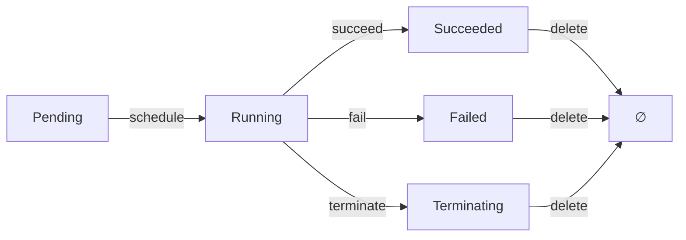

# 20. 范畴论视角：对象、态射与函子

## 目录

- [目录](#目录)
- [20.1 文档定位](#201-文档定位)
- [20.2 范畴基础](#202-范畴基础)
  - [20.2.1 容器技术范畴](#2021-容器技术范畴)
  - [20.2.2 对象与态射](#2022-对象与态射)
  - [20.2.3 态射的复合](#2023-态射的复合)
  - [20.2.4 恒等态射](#2024-恒等态射)
- [20.3 核心范畴](#203-核心范畴)
  - [20.3.1 Pod 范畴](#2031-pod-范畴)
  - [20.3.2 Deployment 范畴](#2032-deployment-范畴)
  - [20.3.3 Service 范畴](#2033-service-范畴)
  - [20.3.4 Node 范畴](#2034-node-范畴)
- [20.4 函子](#204-函子)
  - [20.4.1 镜像构建函子](#2041-镜像构建函子)
  - [20.4.2 状态同步函子](#2042-状态同步函子)
  - [20.4.3 调度函子](#2043-调度函子)
  - [20.4.4 转换函子](#2044-转换函子)
- [20.5 自然变换](#205-自然变换)
  - [20.5.1 运行时转换](#2051-运行时转换)
  - [20.5.2 API 版本转换](#2052-api-版本转换)
  - [20.5.3 格式转换](#2053-格式转换)
- [20.6 单子](#206-单子)
  - [20.6.1 Option 单子](#2061-option-单子)
  - [20.6.2 State 单子](#2062-state-单子)
  - [20.6.3 Error 单子](#2063-error-单子)
  - [20.6.4 Future 单子](#2064-future-单子)
- [20.7 极限与余极限](#207-极限与余极限)
  - [20.7.1 积与余积](#2071-积与余积)
  - [20.7.2 等化子与余等化子](#2072-等化子与余等化子)
  - [20.7.3 拉回与推出](#2073-拉回与推出)
- [20.8 范畴复合](#208-范畴复合)
  - [20.8.1 范畴的乘积](#2081-范畴的乘积)
  - [20.8.2 范畴的余乘积](#2082-范畴的余乘积)
  - [20.8.3 函子范畴](#2083-函子范畴)
- [20.9 范畴等价](#209-范畴等价)
  - [20.9.1 范畴同构](#2091-范畴同构)
  - [20.9.2 范畴等价](#2092-范畴等价)
  - [20.9.3 范畴对偶](#2093-范畴对偶)
- [20.10 参考](#2010-参考)

---

## 20.1 文档定位

本文档从范畴论（Category Theory）视角梳理云原生容器技术栈，将系统抽象为范畴
（Categories）、对象（Objects）、态射（Morphisms）、函子（Functors）等数学结构，
揭示技术本质的数学规律。

**文档结构**：

- **范畴基础**：容器技术范畴的定义、对象与态射、态射复合、恒等态射
- **核心范畴**：Pod、Deployment、Service、Node 等核心对象的范畴
- **函子**：镜像构建、状态同步、调度、转换等函子
- **自然变换**：运行时转换、API 版本转换、格式转换
- **单子**：Option、State、Error、Future 等单子模式
- **极限与余极限**：积、余积、等化子、余等化子、拉回、推出
- **范畴复合**：范畴乘积、余乘积、函子范畴
- **范畴等价**：范畴同构、等价、对偶

## 20.2 范畴基础

### 20.2.1 容器技术范畴

**范畴定义**：容器技术范畴 $\mathcal{C}$ 由以下组成：

- **对象集合**
  $\text{Ob}(\mathcal{C})$：$\{\text{Image}, \text{Container}, \text{Pod}, \text{Deployment}, \text{Service}, \text{Node}\}$
- **态射集合** $\text{Hom}(\mathcal{C})$：对象之间的转换关系
- **态射复合** $\circ$：态射的组合
- **恒等态射** $\text{id}_A$：每个对象的自映射

**形式化定义**：

$$\mathcal{C} = (\text{Ob}(\mathcal{C}), \text{Hom}(\mathcal{C}), \circ, \text{id})$$

其中：

- $\text{Ob}(\mathcal{C}) = \{A, B, C, \ldots\}$：对象集合
- $\text{Hom}(A, B)$：从对象 $A$ 到对象 $B$ 的态射集合
- $\circ$：态射复合，满足结合律
- $\text{id}_A \in \text{Hom}(A, A)$：恒等态射

**容器技术范畴对象**：

| 对象           | 定义         | 属性                |
| -------------- | ------------ | ------------------- |
| **Image**      | 应用镜像     | OCI 规范、分层存储  |
| **Container**  | 运行实例     | Namespace、Cgroups  |
| **Pod**        | 逻辑主机     | 共享网络/IPC/存储   |
| **Deployment** | 期望副本集   | Replicas、滚动更新  |
| **Service**    | 稳定网络标识 | ClusterIP、Labels   |
| **Node**       | 工作节点     | Kubelet、容器运行时 |

### 20.2.2 对象与态射

**态射定义**：态射 $f: A \rightarrow B$ 表示从对象 $A$ 到对象 $B$ 的转换。

**容器技术态射**：

| 态射          | 定义                                | 类型     |
| ------------- | ----------------------------------- | -------- |
| **build**     | Image $\rightarrow$ Image           | 镜像构建 |
| **pull**      | Registry $\rightarrow$ Image        | 镜像拉取 |
| **create**    | Image $\rightarrow$ Container       | 容器创建 |
| **start**     | Container $\rightarrow$ Container   | 容器启动 |
| **stop**      | Container $\rightarrow$ Container   | 容器停止 |
| **schedule**  | Pod $\rightarrow$ Node              | Pod 调度 |
| **reconcile** | Deployment $\rightarrow$ Deployment | 状态同步 |

**形式化定义**：

设态射 $f: A \rightarrow B$，则：

- $A$ = 源对象（Source Object）
- $B$ = 目标对象（Target Object）
- $f$ = 转换函数（Transformation Function）

**态射示例**：

```yaml
态射:
  build: Image -> Image - Dockerfile -> Image - 构建上下文 -> 镜像层

  pull: Registry -> Image - 镜像仓库 -> 本地镜像 - OCI 镜像格式

  create: Image -> Container - 镜像 -> 容器实例 - Namespace 隔离

  start: Container -> Container - 停止状态 -> 运行状态 - 进程启动

  schedule: Pod -> Node - Pod 对象 -> 节点绑定 - 调度算法
```

### 20.2.3 态射的复合

**复合定义**：给定态射 $f: A \rightarrow B$ 和 $g: B \rightarrow C$，其复合为：

$$g \circ f: A \rightarrow C$$

**复合法则**：态射复合满足结合律

$$(h \circ g) \circ f = h \circ (g \circ f)$$

**容器技术态射复合**：

| 复合                           | 定义                              | 说明             |
| ------------------------------ | --------------------------------- | ---------------- |
| **start $\circ$ create**       | Image $\rightarrow$ Container     | 创建并启动容器   |
| **schedule $\circ$ reconcile** | Deployment $\rightarrow$ Node     | 同步并调度 Pod   |
| **pull $\circ$ build**         | Source $\rightarrow$ Image        | 构建并推送镜像   |
| **stop $\circ$ start**         | Container $\rightarrow$ Container | 启动后停止（id） |

**形式化定义**：

设态射 $f: A \rightarrow B$ 和 $g: B \rightarrow C$，则复合
$g \circ f: A \rightarrow C$ 定义为：

$$(g \circ f)(a) = g(f(a))$$

**复合示例**：

```yaml
态射复合: deploy = start ∘ create ∘ pull ∘ build - 构建 -> 拉取 -> 创建 -> 启动

  reconcile = schedule ∘ create ∘ reconcile - 同步 -> 创建 -> 调度

  rollback = stop ∘ start - 停止当前 -> 启动旧版本
```

### 20.2.4 恒等态射

**恒等定义**：对于每个对象 $A$，存在恒等态射 $\text{id}_A: A \rightarrow A$。

**恒等性质**：对于任意态射 $f: A \rightarrow B$，有：

$$f \circ \text{id}_A = f = \text{id}_B \circ f$$

**容器技术恒等态射**：

| 恒等              | 定义                                | 说明                |
| ----------------- | ----------------------------------- | ------------------- |
| **id_Image**      | Image $\rightarrow$ Image           | 镜像不变            |
| **id_Container**  | Container $\rightarrow$ Container   | 容器状态不变        |
| **id_Pod**        | Pod $\rightarrow$ Pod               | Pod 状态不变        |
| **id_Deployment** | Deployment $\rightarrow$ Deployment | Deployment 状态不变 |

**形式化定义**：

对于对象 $A$，恒等态射 $\text{id}_A: A \rightarrow A$ 满足：

$$\text{id}_A(a) = a$$

**恒等示例**：

```yaml
恒等态射:
  id_Image: Image -> Image - 镜像不改变（重新标记版本）

  id_Container: Container -> Container - 容器状态不变（健康检查）

  id_Pod: Pod -> Pod - Pod 状态不变（保持运行）
```

## 20.3 核心范畴

### 20.3.1 Pod 范畴

**Pod 范畴定义**：$\mathcal{P}$ 是由 Pod 对象及其态射组成的范畴。

**Pod 对象状态**：

| 状态            | 定义     | 属性         |
| --------------- | -------- | ------------ |
| **Pending**     | 等待调度 | 未调度到节点 |
| **Running**     | 运行中   | Pod 正常运行 |
| **Succeeded**   | 成功完成 | 容器成功退出 |
| **Failed**      | 失败     | 容器失败退出 |
| **Terminating** | 终止中   | Pod 正在终止 |

**Pod 态射**：

| 态射          | 定义                                  | 类型     |
| ------------- | ------------------------------------- | -------- |
| **schedule**  | Pending $\rightarrow$ Running         | Pod 调度 |
| **start**     | Pending $\rightarrow$ Running         | Pod 启动 |
| **succeed**   | Running $\rightarrow$ Succeeded       | Pod 成功 |
| **fail**      | Running $\rightarrow$ Failed          | Pod 失败 |
| **terminate** | Running $\rightarrow$ Terminating     | Pod 终止 |
| **delete**    | Terminating $\rightarrow$ $\emptyset$ | Pod 删除 |

**形式化定义**：

设 Pod 范畴为
$\mathcal{P} = (\text{Ob}(\mathcal{P}), \text{Hom}(\mathcal{P}))$，其中：

- $\text{Ob}(\mathcal{P}) = \{\text{Pending}, \text{Running}, \text{Succeeded}, \text{Failed}, \text{Terminating}\}$
- $\text{Hom}(\mathcal{P})$ 包含所有状态转换态射

**Pod 状态转换图**：



### 20.3.2 Deployment 范畴

**Deployment 范畴定义**：$\mathcal{D}$ 是由 Deployment 对象及其态射组成的范畴。

**Deployment 对象状态**：

| 状态           | 定义     | 属性                    |
| -------------- | -------- | ----------------------- |
| **Desired**    | 期望状态 | Spec 定义的副本数       |
| **Actual**     | 实际状态 | Status 记录的实际副本数 |
| **Reconciled** | 已同步   | 期望状态与实际状态一致  |

**Deployment 态射**：

| 态射          | 定义                          | 类型     |
| ------------- | ----------------------------- | -------- |
| **reconcile** | Desired $\rightarrow$ Actual  | 状态同步 |
| **scale**     | Desired $\rightarrow$ Desired | 扩缩容   |
| **rollout**   | Desired $\rightarrow$ Desired | 滚动更新 |
| **rollback**  | Desired $\rightarrow$ Desired | 回滚     |

**形式化定义**：

设 Deployment 范畴为
$\mathcal{D} = (\text{Ob}(\mathcal{D}), \text{Hom}(\mathcal{D}))$，其中：

- $\text{Ob}(\mathcal{D}) = \{\text{Desired}, \text{Actual}, \text{Reconciled}\}$
- $\text{Hom}(\mathcal{D})$ 包含所有状态转换态射

**Deployment 状态转换**：

```yaml
Deployment 态射:
  reconcile: Desired -> Actual
    - 根据 Spec 创建 Pod
    - 更新 Status

  scale: Desired -> Desired
    - replicas: 3 -> 5
    - 增加副本数

  rollout: Desired -> Desired
    - image: v1 -> v2
    - 更新镜像版本

  rollback: Desired -> Desired
    - image: v2 -> v1
    - 回滚到旧版本
```

### 20.3.3 Service 范畴

**Service 范畴定义**：$\mathcal{S}$ 是由 Service 对象及其态射组成的范畴。

**Service 对象状态**：

| 状态          | 定义     | 属性              |
| ------------- | -------- | ----------------- |
| **Selecting** | 选择 Pod | Selector 匹配 Pod |
| **Endpoints** | 端点集合 | 后端 Pod 列表     |
| **Exposed**   | 已暴露   | Service 可访问    |

**Service 态射**：

| 态射            | 定义                            | 类型         |
| --------------- | ------------------------------- | ------------ |
| **select**      | Pod $\rightarrow$ Endpoints     | Pod 选择     |
| **expose**      | Endpoints $\rightarrow$ Exposed | Service 暴露 |
| **loadbalance** | Exposed $\rightarrow$ Exposed   | 负载均衡     |

**形式化定义**：

设 Service 范畴为
$\mathcal{S} = (\text{Ob}(\mathcal{S}), \text{Hom}(\mathcal{S}))$，其中：

- $\text{Ob}(\mathcal{S}) = \{\text{Selecting}, \text{Endpoints}, \text{Exposed}\}$
- $\text{Hom}(\mathcal{S})$ 包含所有状态转换态射

**Service 状态转换**：

```yaml
Service 态射:
  select: Pod -> Endpoints - 根据 Selector 选择 Pod - 更新 Endpoints

  expose: Endpoints -> Exposed - 创建 ClusterIP - 注册 DNS

  loadbalance: Exposed -> Exposed - 分配流量 - 负载均衡
```

### 20.3.4 Node 范畴

**Node 范畴定义**：$\mathcal{N}$ 是由 Node 对象及其态射组成的范畴。

**Node 对象状态**：

| 状态              | 定义     | 属性             |
| ----------------- | -------- | ---------------- |
| **Ready**         | 就绪     | 节点可用         |
| **NotReady**      | 未就绪   | 节点不可用       |
| **Schedulable**   | 可调度   | 节点可调度 Pod   |
| **Unschedulable** | 不可调度 | 节点不可调度 Pod |

**Node 态射**：

| 态射         | 定义                                    | 类型     |
| ------------ | --------------------------------------- | -------- |
| **register** | $\emptyset$ $\rightarrow$ Ready         | 节点注册 |
| **drain**    | Schedulable $\rightarrow$ Unschedulable | 节点排空 |
| **cordon**   | Schedulable $\rightarrow$ Unschedulable | 节点封锁 |
| **uncordon** | Unschedulable $\rightarrow$ Schedulable | 节点解封 |

**形式化定义**：

设 Node 范畴为
$\mathcal{N} = (\text{Ob}(\mathcal{N}), \text{Hom}(\mathcal{N}))$，其中：

- $\text{Ob}(\mathcal{N}) = \{\text{Ready}, \text{NotReady}, \text{Schedulable}, \text{Unschedulable}\}$
- $\text{Hom}(\mathcal{N})$ 包含所有状态转换态射

## 20.4 函子

### 20.4.1 镜像构建函子

**函子定义**：函子 $F: \mathcal{C} \rightarrow \mathcal{D}$ 将范畴 $\mathcal{C}$
映射到范畴 $\mathcal{D}$。

**镜像构建函子**：$F_{\text{build}}: \mathcal{S} \rightarrow \mathcal{I}$

其中：

- $\mathcal{S}$ = 源代码范畴（Source Code Category）
- $\mathcal{I}$ = 镜像范畴（Image Category）

**函子映射**：

| 对象映射                               | 态射映射                          |
| -------------------------------------- | --------------------------------- |
| **Dockerfile** $\rightarrow$ **Image** | **build** $\rightarrow$ **build** |

**形式化定义**：

设镜像构建函子为 $F_{\text{build}}: \mathcal{S} \rightarrow \mathcal{I}$，则：

- $F_{\text{build}}(\text{Dockerfile}) = \text{Image}$
- $F_{\text{build}}(\text{build}: \text{Dockerfile} \rightarrow \text{Dockerfile}) = \text{build}: \text{Image} \rightarrow \text{Image}$

**函子性质**：

1. **保持恒
   等**：$F_{\text{build}}(\text{id}_A) = \text{id}_{F_{\text{build}}(A)}$
2. **保持复
   合**：$F_{\text{build}}(g \circ f) = F_{\text{build}}(g) \circ F_{\text{build}}(f)$

### 20.4.2 状态同步函子

**状态同步函子**：$F_{\text{sync}}: \mathcal{D} \rightarrow \mathcal{P}$

其中：

- $\mathcal{D}$ = Deployment 范畴
- $\mathcal{P}$ = Pod 范畴

**函子映射**：

| 对象映射                                 | 态射映射                               |
| ---------------------------------------- | -------------------------------------- |
| **Deployment** $\rightarrow$ **Pod Set** | **reconcile** $\rightarrow$ **create** |

**形式化定义**：

设状态同步函子为 $F_{\text{sync}}: \mathcal{D} \rightarrow \mathcal{P}$，则：

- $F_{\text{sync}}(\text{Deployment}) = \{\text{Pod}_1, \text{Pod}_2, \ldots, \text{Pod}_n\}$
- $F_{\text{sync}}(\text{reconcile}: \text{Deployment} \rightarrow \text{Deployment}) = \text{create}: \text{Pod} \rightarrow \text{Pod}$

**状态同步**：

```yaml
状态同步函子:
  F_sync: Deployment -> Pod Set
    - Deployment.replicas = 3
    - F_sync(Deployment) = {Pod_1, Pod_2, Pod_3}

  F_sync: reconcile -> create
    - Deployment.reconcile
    - Pod.create (多个)
```

### 20.4.3 调度函子

**调度函子**：$F_{\text{schedule}}: \mathcal{P} \rightarrow \mathcal{N}$

其中：

- $\mathcal{P}$ = Pod 范畴
- $\mathcal{N}$ = Node 范畴

**函子映射**：

| 对象映射                       | 态射映射                              |
| ------------------------------ | ------------------------------------- |
| **Pod** $\rightarrow$ **Node** | **schedule** $\rightarrow$ **assign** |

**形式化定义**：

设调度函子为 $F_{\text{schedule}}: \mathcal{P} \rightarrow \mathcal{N}$，则：

- $F_{\text{schedule}}(\text{Pod}) = \text{Node}$
- $F_{\text{schedule}}(\text{schedule}: \text{Pod} \rightarrow \text{Pod}) = \text{assign}: \text{Node} \rightarrow \text{Node}$

**调度算法**：

```yaml
调度函子:
  F_schedule: Pod -> Node
    - Pod.spec.nodeName = nil
    - F_schedule(Pod) = Node (通过调度算法)

  F_schedule: schedule -> assign
    - Pod.schedule
    - Node.assign (Pod 绑定到节点)
```

### 20.4.4 转换函子

**转换函子**：$F_{\text{convert}}: \mathcal{C} \rightarrow \mathcal{C}'$

其中：

- $\mathcal{C}$ = 源范畴
- $\mathcal{C}'$ = 目标范畴

**转换函子示例**：

| 函子                     | 源范畴 | 目标范畴 | 说明         |
| ------------------------ | ------ | -------- | ------------ |
| **$F_{\text{runtime}}$** | Docker | WasmEdge | 运行时转换   |
| **$F_{\text{version}}$** | v1 API | v2 API   | API 版本转换 |
| **$F_{\text{format}}$**  | OCI    | Docker   | 格式转换     |

**形式化定义**：

设转换函子为 $F_{\text{convert}}: \mathcal{C} \rightarrow \mathcal{C}'$，则：

- $F_{\text{convert}}(A) = A'$（对象转换）
- $F_{\text{convert}}(f: A \rightarrow B) = f': A' \rightarrow B'$（态射转换）

## 20.5 自然变换

### 20.5.1 运行时转换

**自然变换定义**：自然变换 $\alpha: F \Rightarrow G$ 是两个函子之间的映射。

**运行时自然变
换**：$\alpha_{\text{runtime}}: F_{\text{Docker}} \Rightarrow F_{\text{WasmEdge}}$

其中：

- $F_{\text{Docker}}$ = Docker 运行时函子
- $F_{\text{WasmEdge}}$ = WasmEdge 运行时函子

**自然变换分量**：

$$\alpha_A: F_{\text{Docker}}(A) \rightarrow F_{\text{WasmEdge}}(A)$$

对于所有对象 $A$。

**形式化定义**：

设自然变换 $\alpha: F \Rightarrow G$，则对于任意态射 $f: A \rightarrow B$，有：

$$G(f) \circ \alpha_A = \alpha_B \circ F(f)$$

**运行时转换**：

```yaml
运行时自然变换:
  α_runtime:
    F_Docker => F_WasmEdge - F_Docker(Container) -> F_WasmEdge(Wasm Module) -
    rootfs -> .wasm - runc -> WasmEdge Runtime
```

### 20.5.2 API 版本转换

**API 版本自然变换**：$\alpha_{\text{version}}: F_{v1} \Rightarrow F_{v2}$

其中：

- $F_{v1}$ = v1 API 函子
- $F_{v2}$ = v2 API 函子

**版本转换**：

```yaml
API 版本自然变换:
  α_version: F_v1 => F_v2
    - F_v1(Pod) -> F_v2(Pod)
    - apiVersion: v1 -> apiVersion: v2
    - 字段映射
```

### 20.5.3 格式转换

**格式自然变
换**：$\alpha_{\text{format}}: F_{\text{OCI}} \Rightarrow F_{\text{Docker}}$

其中：

- $F_{\text{OCI}}$ = OCI 格式函子
- $F_{\text{Docker}}$ = Docker 格式函子

**格式转换**：

```yaml
格式自然变换:
  α_format:
    F_OCI => F_Docker - F_OCI(Image) -> F_Docker(Image) - OCI Manifest -> Docker
    Manifest - 格式兼容
```

## 20.6 单子

### 20.6.1 Option 单子

**单子定义**：单子 $M$ 是自函子 $(T, \eta, \mu)$，其中：

- $T: \mathcal{C} \rightarrow \mathcal{C}$ 是自函子
- $\eta: \text{id} \Rightarrow T$ 是单位态射
- $\mu: T^2 \Rightarrow T$ 是乘法态射

**Option 单子**：$M_{\text{Option}} = (T_{\text{Option}}, \eta, \mu)$

其中：

- $T_{\text{Option}}(A) = A \cup \{\text{None}\}$
- $\eta_A: A \rightarrow T_{\text{Option}}(A)$ 将元素包装为 Some
- $\mu_A: T_{\text{Option}}^2(A) \rightarrow T_{\text{Option}}(A)$ 展平嵌套

**形式化定义**：

设 Option 单子为 $M_{\text{Option}} = (T_{\text{Option}}, \eta, \mu)$，则：

- $\eta_A(a) = \text{Some}(a)$
- $\mu_A(\text{Some}(\text{Some}(a))) = \text{Some}(a)$
- $\mu_A(\text{Some}(\text{None})) = \text{None}$

**Option 单子应用**：

```yaml
Option 单子:
  Pod.spec.nodeName: Option[String]
    - Some("node1"): Pod 已调度
    - None: Pod 未调度

  Image.pull(): Option[Image]
    - Some(image): 拉取成功
    - None: 拉取失败
```

### 20.6.2 State 单子

**State 单子**：$M_{\text{State}} = (T_{\text{State}}, \eta, \mu)$

其中：

- $T_{\text{State}}(A) = S \rightarrow (A, S)$（状态转换函数）

**形式化定义**：

设 State 单子为 $M_{\text{State}} = (T_{\text{State}}, \eta, \mu)$，则：

- $\eta_A(a) = \lambda s. (a, s)$
- $\mu_A(f) = \lambda s. \text{let } (g, s') = f(s) \text{ in } g(s')$

**State 单子应用**：

```yaml
State 单子:
  Deployment.reconcile(): State[Deployment, Pod[]]
    - 输入: Deployment 状态
    - 输出: (Pod[], 更新的 Deployment)

  Controller.reconcile(): State[Object, Status]
    - 输入: 对象状态
    - 输出: (操作结果, 更新的对象)
```

### 20.6.3 Error 单子

**Error 单子**：$M_{\text{Error}} = (T_{\text{Error}}, \eta, \mu)$

其中：

- $T_{\text{Error}}(A) = A \cup \{\text{Error}\}$

**形式化定义**：

设 Error 单子为 $M_{\text{Error}} = (T_{\text{Error}}, \eta, \mu)$，则：

- $\eta_A(a) = \text{Ok}(a)$
- $\mu_A(\text{Ok}(\text{Ok}(a))) = \text{Ok}(a)$
- $\mu_A(\text{Ok}(\text{Error}(e))) = \text{Error}(e)$

**Error 单子应用**：

```yaml
Error 单子:
  Pod.start(): Error[Pod]
    - Ok(pod): 启动成功
    - Error("资源不足"): 启动失败

  Image.pull(): Error[Image]
    - Ok(image): 拉取成功
    - Error("网络错误"): 拉取失败
```

### 20.6.4 Future 单子

**Future 单子**：$M_{\text{Future}} = (T_{\text{Future}}, \eta, \mu)$

其中：

- $T_{\text{Future}}(A) = \text{Future}[A]$（异步计算）

**形式化定义**：

设 Future 单子为 $M_{\text{Future}} = (T_{\text{Future}}, \eta, \mu)$，则：

- $\eta_A(a) = \text{Future.successful}(a)$
- $\mu_A(f) = f.flatMap(g => g)$

**Future 单子应用**：

```yaml
Future 单子:
  Pod.create(): Future[Pod] - 异步创建 Pod - 返回 Future[Pod]

  Image.pull(): Future[Image] - 异步拉取镜像 - 返回 Future[Image]
```

## 20.7 极限与余极限

### 20.7.1 积与余积

**积定义**：对象 $A$ 和 $B$ 的积 $A \times B$ 是满足以下性质的泛对象：

对于任意对象 $X$ 和态射 $f: X \rightarrow A$ 和 $g: X \rightarrow B$，存在唯一的
态射 $h: X \rightarrow A \times B$ 使得：

$$p_1 \circ h = f \quad \text{和} \quad p_2 \circ h = g$$

其中 $p_1$ 和 $p_2$ 是投影态射。

**容器技术积**：

| 积                             | 定义                      | 说明                  |
| ------------------------------ | ------------------------- | --------------------- |
| **Pod $\times$ Node**          | Pod 和 Node 的积          | Pod 与节点的绑定      |
| **Deployment $\times$ Pod**    | Deployment 和 Pod 的积    | Deployment 管理的 Pod |
| **Service $\times$ Endpoints** | Service 和 Endpoints 的积 | Service 的后端端点    |

**余积定义**：对象 $A$ 和 $B$ 的余积 $A + B$ 是满足以下性质的泛对象：

对于任意对象 $X$ 和态射 $f: A \rightarrow X$ 和 $g: B \rightarrow X$，存在唯一的
态射 $h: A + B \rightarrow X$ 使得：

$$h \circ i_1 = f \quad \text{和} \quad h \circ i_2 = g$$

其中 $i_1$ 和 $i_2$ 是注入态射。

**容器技术余积**：

| 余积                           | 定义                             | 说明             |
| ------------------------------ | -------------------------------- | ---------------- |
| **Pod $+$ Pod**                | Pod 的余积                       | 多个 Pod 的集合  |
| **Deployment $+$ StatefulSet** | Deployment 和 StatefulSet 的余积 | 不同类型的副本集 |
| **Node $+$ Node**              | Node 的余积                      | 多个节点的集合   |

### 20.7.2 等化子与余等化子

**等化子定义**：态射 $f, g: A \rightarrow B$ 的等化子 $\text{Eq}(f, g)$ 是满足以
下性质的对象：

存在态射 $e: \text{Eq}(f, g) \rightarrow A$ 使得 $f \circ e = g \circ e$，并且对
于任意对象 $X$ 和态射 $h: X \rightarrow A$ 满足 $f \circ h = g \circ h$，存在唯
一的态射 $k: X \rightarrow \text{Eq}(f, g)$ 使得 $h = e \circ k$。

**容器技术等化子**：

| 等化子                                       | 定义                     | 说明       |
| -------------------------------------------- | ------------------------ | ---------- |
| **$\text{Eq}(\text{reconcile}, \text{id})$** | reconcile 与恒等的等化子 | 已同步状态 |
| **$\text{Eq}(\text{schedule}, \text{id})$**  | schedule 与恒等的等化子  | 已调度状态 |

**余等化子定义**：态射 $f, g: A \rightarrow B$ 的余等化子 $\text{Coeq}(f, g)$ 是
满足以下性质的对象：

存在态射 $q: B \rightarrow \text{Coeq}(f, g)$ 使得 $q \circ f = q \circ g$，并且
对于任意对象 $X$ 和态射 $h: B \rightarrow X$ 满足 $h \circ f = h \circ g$，存在
唯一的态射 $k: \text{Coeq}(f, g) \rightarrow X$ 使得 $h = k \circ q$。

**容器技术余等化子**：

| 余等化子                                     | 定义                     | 说明         |
| -------------------------------------------- | ------------------------ | ------------ |
| **$\text{Coeq}(\text{scale}, \text{id})$**   | scale 与恒等的余等化子   | 副本数变更   |
| **$\text{Coeq}(\text{rollout}, \text{id})$** | rollout 与恒等的余等化子 | 镜像版本变更 |

### 20.7.3 拉回与推出

**拉回定义**：给定态射 $f: A \rightarrow C$ 和 $g: B \rightarrow C$，其拉回
$A \times_C B$ 是满足以下性质的泛对象：

存在态射 $p_1: A \times_C B \rightarrow A$ 和 $p_2: A \times_C B \rightarrow B$
使得 $f \circ p_1 = g \circ p_2$，并且对于任意对象 $X$ 和态射
$h_1: X \rightarrow A$ 和 $h_2: X \rightarrow B$ 满足
$f \circ h_1 = g \circ h_2$，存在唯一的态射 $k: X \rightarrow A \times_C B$ 使得
$h_1 = p_1 \circ k$ 和 $h_2 = p_2 \circ k$。

**容器技术拉回**：

| 拉回                                  | 定义                  | 说明             |
| ------------------------------------- | --------------------- | ---------------- |
| **Pod $\times_{\text{Node}}$ Node**   | Pod 和 Node 的拉回    | Pod 绑定到节点   |
| **Service $\times_{\text{Pod}}$ Pod** | Service 和 Pod 的拉回 | Service 选择 Pod |

**推出定义**：给定态射 $f: C \rightarrow A$ 和 $g: C \rightarrow B$，其推出
$A +_C B$ 是满足以下性质的泛对象：

存在态射 $i_1: A \rightarrow A +_C B$ 和 $i_2: B \rightarrow A +_C B$ 使得
$i_1 \circ f = i_2 \circ g$，并且对于任意对象 $X$ 和态射 $h_1: A \rightarrow X$
和 $h_2: B \rightarrow X$ 满足 $h_1 \circ f = h_2 \circ g$，存在唯一的态射
$k: A +_C B \rightarrow X$ 使得 $h_1 = k \circ i_1$ 和 $h_2 = k \circ i_2$。

**容器技术推出**：

| 推出                                              | 定义                             | 说明                   |
| ------------------------------------------------- | -------------------------------- | ---------------------- |
| **Pod $+_{\text{Image}}$ Pod**                    | Pod 的推出                       | 共享镜像的 Pod 集合    |
| **Deployment $+_{\text{Namespace}}$ StatefulSet** | Deployment 和 StatefulSet 的推出 | 同一命名空间的不同类型 |

## 20.8 范畴复合

### 20.8.1 范畴的乘积

**范畴乘积定义**：两个范畴 $\mathcal{C}$ 和 $\mathcal{D}$ 的乘积
$\mathcal{C} \times \mathcal{D}$ 由以下组成：

- **对象**：$(A, B)$，其中
  $A \in \text{Ob}(\mathcal{C})$，$B \in \text{Ob}(\mathcal{D})$
- **态射**：$(f, g): (A, B) \rightarrow (A', B')$，其中
  $f: A \rightarrow A'$，$g: B \rightarrow B'$

**容器技术范畴乘积**：

| 乘积                                 | 定义                                 | 说明                    |
| ------------------------------------ | ------------------------------------ | ----------------------- |
| **$\mathcal{P} \times \mathcal{N}$** | Pod 范畴与 Node 范畴的乘积           | Pod-Node 绑定关系       |
| **$\mathcal{D} \times \mathcal{S}$** | Deployment 范畴与 Service 范畴的乘积 | Deployment-Service 关系 |

### 20.8.2 范畴的余乘积

**范畴余乘积定义**：两个范畴 $\mathcal{C}$ 和 $\mathcal{D}$ 的余乘积
$\mathcal{C} + \mathcal{D}$ 由以下组成：

- **对象**：$A$（来自 $\mathcal{C}$）或 $B$（来自 $\mathcal{D}$）
- **态射**：从 $\mathcal{C}$ 或 $\mathcal{D}$ 继承

**容器技术范畴余乘积**：

| 余乘积                           | 定义                               | 说明             |
| -------------------------------- | ---------------------------------- | ---------------- |
| **$\mathcal{D} + \mathcal{SS}$** | Deployment 与 StatefulSet 的余乘积 | 不同类型的副本集 |
| **$\mathcal{P} + \mathcal{P}$**  | Pod 与 Pod 的余乘积                | 多个 Pod 的集合  |

### 20.8.3 函子范畴

**函子范畴定义**：两个范畴 $\mathcal{C}$ 和 $\mathcal{D}$ 之间的函子范畴
$\mathcal{D}^{\mathcal{C}}$ 由以下组成：

- **对象**：函子 $F: \mathcal{C} \rightarrow \mathcal{D}$
- **态射**：自然变换 $\alpha: F \Rightarrow G$

**容器技术函子范畴**：

| 函子范畴                        | 定义                         | 说明         |
| ------------------------------- | ---------------------------- | ------------ |
| **$\mathcal{I}^{\mathcal{S}}$** | 源代码到镜像的函子范畴       | 镜像构建函子 |
| **$\mathcal{P}^{\mathcal{D}}$** | Deployment 到 Pod 的函子范畴 | 状态同步函子 |

## 20.9 范畴等价

### 20.9.1 范畴同构

**范畴同构定义**：两个范畴 $\mathcal{C}$ 和 $\mathcal{D}$ 同构，当且仅当存在函子
$F: \mathcal{C} \rightarrow \mathcal{D}$ 和
$G: \mathcal{D} \rightarrow \mathcal{C}$ 使得：

$$G \circ F = \text{id}_{\mathcal{C}} \quad \text{和} \quad F \circ G = \text{id}_{\mathcal{D}}$$

**容器技术范畴同构**：

| 同构                                                                    | 定义                          | 说明         |
| ----------------------------------------------------------------------- | ----------------------------- | ------------ |
| **$\mathcal{C}_{\text{Docker}} \cong \mathcal{C}_{\text{containerd}}$** | Docker 与 containerd 范畴同构 | 运行时等价   |
| **$\mathcal{C}_{\text{K8s}} \cong \mathcal{C}_{\text{K3s}}$**           | Kubernetes 与 K3s 范畴同构    | 编排系统等价 |

### 20.9.2 范畴等价

**范畴等价定义**：两个范畴 $\mathcal{C}$ 和 $\mathcal{D}$ 等价，当且仅当存在函子
$F: \mathcal{C} \rightarrow \mathcal{D}$ 和
$G: \mathcal{D} \rightarrow \mathcal{C}$ 以及自然同构：

$$\eta: \text{id}_{\mathcal{C}} \Rightarrow G \circ F \quad \text{和} \quad \epsilon: F \circ G \Rightarrow \text{id}_{\mathcal{D}}$$

**容器技术范畴等价**：

| 等价                                                                  | 定义                       | 说明           |
| --------------------------------------------------------------------- | -------------------------- | -------------- |
| **$\mathcal{C}_{\text{OCI}} \simeq \mathcal{C}_{\text{Docker}}$**     | OCI 与 Docker 范畴等价     | 镜像格式等价   |
| **$\mathcal{C}_{\text{CRI}} \simeq \mathcal{C}_{\text{Docker API}}$** | CRI 与 Docker API 范畴等价 | 运行时接口等价 |

### 20.9.3 范畴对偶

**范畴对偶定义**：范畴 $\mathcal{C}$ 的对偶范畴 $\mathcal{C}^{\text{op}}$ 由以下
组成：

- **对象**：与 $\mathcal{C}$ 相同
- **态
  射**：$\text{Hom}_{\mathcal{C}^{\text{op}}}(A, B) = \text{Hom}_{\mathcal{C}}(B, A)$

**容器技术范畴对偶**：

| 对偶                          | 定义                  | 说明         |
| ----------------------------- | --------------------- | ------------ |
| **$\mathcal{P}^{\text{op}}$** | Pod 范畴的对偶        | 反向状态转换 |
| **$\mathcal{D}^{\text{op}}$** | Deployment 范畴的对偶 | 反向状态同步 |

## 20.10 参考

> 范畴论基础见 [范畴论](https://en.wikipedia.org/wiki/Category_theory) 函子与自
> 然变换见 [函子](https://en.wikipedia.org/wiki/Functor) 单子见
> [单子](<https://en.wikipedia.org/wiki/Monad_(category_theory)>) 极限与余极限见
> [极限](<https://en.wikipedia.org/wiki/Limit_(category_theory)>)

> 完整参考列表见 [REFERENCES.md](../REFERENCES.md)
