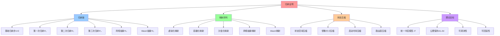

# 归纳证明文档集

## 📑 目录

- [归纳证明文档集](#归纳证明文档集)
  - [📑 目录](#-目录)
  - [1 概述](#1-概述)
    - [1.1 核心思想](#11-核心思想)
    - [1.2 归纳目标](#12-归纳目标)
  - [2 归纳法结构](#2-归纳法结构)
    - [2.1 完整归纳链](#21-完整归纳链)
    - [2.2 待证命题 P(n)](#22-待证命题-pn)
  - [3 文档结构](#3-文档结构)
    - [3.1 详细文档](#31-详细文档)
  - [4 核心理念](#4-核心理念)
    - [4.1 归纳法思想](#41-归纳法思想)
    - [4.2 状态空间压缩](#42-状态空间压缩)
    - [4.3 公理保持](#43-公理保持)
  - [5 阅读路径](#5-阅读路径)
    - [5.1 初学者路径](#51-初学者路径)
    - [5.2 进阶者路径](#52-进阶者路径)
    - [5.3 研究者路径](#53-研究者路径)
  - [6 相关文档](#6-相关文档)
    - [6.1 公理层文档](#61-公理层文档)
    - [6.2 引理和定理文档](#62-引理和定理文档)
    - [6.3 状态空间压缩文档](#63-状态空间压缩文档)
    - [6.4 范畴论视角文档](#64-范畴论视角文档)
    - [6.5 源文档](#65-源文档)

---

## 1 概述

本目录包含**数学归纳法证明**文档，证明虚拟化 → 容器化 → 沙盒化的递进抽象形成一
个**可组合、可观测、可弹性的中层逻辑世界 ℳ**。

### 1.1 核心思想

> **通过数学归纳法证明，经过 n 次映射 Ψ₁…Ψₙ，系统 Σₙ 满足所有公理（A1-A4）和归纳
> 目标，完成封闭证明**

### 1.2 归纳目标

**归纳目标**：证明存在**统一中层模型 ℳ**，使得 ℳ ≜ ⟨U,G,P⟩ 同时满足 A1-A4，且
**∂ℳ/∂t 可观测、可回滚、可验证**。

其中：

- **U**：计算单元集合（VM、Container、Sandbox）
- **G**：组合图谱（服务间关系）
- **P**：策略层（安全、弹性、可观测性）

---

## 2 归纳法结构

### 2.1 完整归纳链

```text
公理层（A1-A4）
    ↓
基础归纳步（n=0）：裸机世界 Σ₀
    ├─ 问题：全局状态耦合、物理拓扑绑定
    └─ 结论：不满足 A4，需引入 Ψ₁
    ↓
第一次归纳映射（Ψ₁）：虚拟化层 Σ₁
    ├─ 映射：Ψ₁ : Σ₀ → Σ₁ = ⟨VMM, VM⟩
    ├─ 状态压缩：|Σ₁| ≈ 2^(20+30) ≪ 2^(50+60) = |Σ₀|
    ├─ 验证：A1 成立（指令级语义不变）、A2 成立（VMCS 硬件根）
    └─ 遗留问题：颗粒度仍太重，需引入 Ψ₂
    ↓
第二次归纳映射（Ψ₂）：容器化层 Σ₂
    ├─ 映射：Ψ₂ : Σ₁ → Σ₂ = ⟨宿主机内核, Container, Namespace, cgroup⟩
    ├─ 状态压缩：镜像从 1~10 GB 降至 10~100 MB
    ├─ 验证：A1 成立、A2 成立、A4 成立
    ├─ 关键引理 L1：容器干扰可建模为线性时不变系统
    └─ 遗留问题：安全边界不够细，需引入 Ψ₃
    ↓
第三次归纳映射（Ψ₃）：沙盒化层 Σ₃
    ├─ 映射：Ψ₃ : Σ₂ → Σ₃ = ⟨Seccomp-BPF, MicroVM, User-Space Kernel⟩
    ├─ 状态压缩：启动时间从 50~300 ms 降至 < 125 ms
    ├─ 验证：A1 成立、A2 成立、A4 成立
    ├─ 关键引理 L2：能力闭包 ≤ 35 条系统调用
    └─ 遗留问题：网络抽象不够统一，需引入 Ψ₄
    ↓
网络抽象归纳（Ψ₄）：网络抽象层
    ├─ 映射：Ψ₄ : ⟨IP:Port, TCP, BGP⟩ → ⟨ServiceName, Label, xDS⟩
    ├─ 状态压缩：路由表从 IP 地址空间压缩到服务名空间
    ├─ 验证：A3 成立（网络异步交付）
    └─ 关键定理 T1：身份-路由等价
    ↓
第五次归纳映射（Ψ₅）：WebAssembly 抽象层 Σ₄ ⭐ 新增
    ├─ 映射：Ψ₅ : Σ₃ → Σ₄ = ⟨WasmEdge 0.14, WASI Preview 2, WebAssembly Binary⟩
    ├─ 状态压缩：镜像从 10~100 MB 降至 < 2 MB，启动时间从 < 1s 降至 < 1ms
    ├─ 验证：A1 成立、A2 成立、A4 成立、A5 成立
    ├─ 关键引理 L4：Wasm 内存安全引理
    └─ 遗留问题：WASI 接口覆盖、工具链成熟度
    ↓
统一中层模型 ℳ = ⟨U,G,P⟩
    ├─ 归纳闭包：满足 A1-A4
    ├─ 状态压缩：|ℳ| ≈ 10⁶ ≪ |Σ₀| ≈ 2^10^10
    └─ 动态性：∂ℳ/∂t 可观测、可回滚、可验证
    ↓
封闭证明：P(n) 对所有 n≥1 成立
```

### 2.2 待证命题 P(n)

**待证命题 P(n)**：

> 经过 n 次映射 Ψ₁…Ψₙ，系统 Σₙ 满足：
>
> a) 仍图灵完备（A1） b) 资源封闭（A2） c) 网络异步（A3） d) 状态空间压缩比 ρ =
> |Σ₀|/|Σₙ| > 10⁶ e) 任意差分 Δ 可观测、可回滚

**归纳目标**：证明 P(n) 对所有 n≥1 成立

---

## 3 文档结构

```text
02-induction-proof/
├── README.md                      # 本文档（总览）
├── base-case.md                  # 基础归纳步（n=0）
├── psi1-virtualization.md         # Ψ₁：虚拟化层
├── psi2-containerization.md       # Ψ₂：容器化层
├── psi3-sandboxing.md            # Ψ₃：沙盒化层
├── psi4-network.md               # Ψ₄：网络抽象
├── psi5-wasm.md                  # Ψ₅：WebAssembly 抽象层 ⭐ 新增
├── closure-proof.md              # 封闭证明
└── induction-proof-complete.md    # 归纳证明完整文档（合并自 06-formalization/）⭐ 新增
```

### 3.1 详细文档

- **[归纳证明完整文档](induction-proof-complete.md)** ⭐ 新增 - 完整的归纳证明文
  档（合并自 `06-formalization/induction-proof.md`）
  - 包含完整的归纳目标、公理层、基础归纳步、五次归纳映射、统一中层模型、封闭证明
    、动态性论证、概念-属性-关系一览表等内容
  - 约 335 行，涵盖所有归纳证明相关的形式化论证

---

## 4 核心理念

### 4.1 归纳法思想

**核心**：从基础情况出发，逐步证明每个归纳步骤，最终完成封闭证明

**结构**：

1. **基础步**：证明 P(0) 成立（或不成立，但需引入归纳映射）
2. **归纳步**：假设 P(k) 成立，证明 P(k+1) 成立
3. **封闭证明**：由数学归纳法，P(n) 对所有 n≥1 成立

### 4.2 状态空间压缩

**核心**：每次归纳映射都压缩状态空间

**压缩比**：

- **Ψ₁**：|Σ₁|/|Σ₀| ≈ 2^(20+30)/2^(50+60) ≈ 10⁻¹⁸
- **Ψ₂**：镜像从 1~10 GB 降至 10~100 MB（压缩比 ≈ 10²）
- **Ψ₃**：启动时间从 50~300 ms 降至 < 125 ms（压缩比 ≈ 10¹）
- **总体**：|ℳ|/|Σ₀| ≈ 10⁶/2^10^10 ≈ 10⁻¹⁰⁶

### 4.3 公理保持

**核心**：每次归纳映射都保持公理成立

**验证**：

- **A1**：每层都保持图灵完备性
- **A2**：每层都保持资源封闭性
- **A3**：网络抽象层实现网络异步交付
- **A4**：每层都实现状态空间压缩

---

## 5 阅读路径

### 5.1 初学者路径

1. **理解基础步**：阅读 [`base-case.md`](base-case.md) 理解裸机世界的问题
2. **理解映射**：阅读 [`psi1-virtualization.md`](psi1-virtualization.md) 理解第
   一次归纳映射
3. **理解模型**：阅读
   [`../04-state-compression/unified-model.md`](../04-state-compression/unified-model.md)
   理解统一中层模型 ℳ
4. **理解封闭证明**：阅读 [`closure-proof.md`](closure-proof.md) 理解完整的归纳
   证明

### 5.2 进阶者路径

1. **完整归纳链**：按照顺序阅读所有归纳映射文档
2. **理解引理**：阅读 [`../05-lemmas-theorems/`](../05-lemmas-theorems/) 理解关
   键引理和定理
3. **理解压缩**：阅读
   [`../04-state-compression/compression-ratio.md`](../04-state-compression/compression-ratio.md)
   理解状态空间压缩
4. **理解实证**：阅读
   [`../04-state-compression/empirical-data.md`](../04-state-compression/empirical-data.md)
   理解实证数据

### 5.3 研究者路径

1. **严格证明**：深入研究每个归纳步骤的严格数学证明
2. **压缩比计算**：深入研究状态空间压缩比的严格计算
3. **实证验证**：深入研究实证数据的来源和验证方法
4. **封闭证明**：深入研究封闭证明的数学结构

---

## 6 相关文档

### 6.1 公理层文档

- [`../01-axioms/`](../01-axioms/) - 公理层文档集

### 6.2 引理和定理文档

- [`../05-lemmas-theorems/`](../05-lemmas-theorems/) - 引理和定理文档集
  - [`L1-container-interference.md`](../05-lemmas-theorems/L1-container-interference.md) -
    L1：容器干扰引理
  - [`L2-capability-closure.md`](../05-lemmas-theorems/L2-capability-closure.md) -
    L2：能力闭包引理
  - [`T1-identity-routing.md`](../05-lemmas-theorems/T1-identity-routing.md) -
    T1：身份-路由等价定理

### 6.3 状态空间压缩文档

- [`../04-state-compression/`](../04-state-compression/) - 状态空间压缩文档集

### 6.4 范畴论视角文档

- [`../03-category-theory/`](../03-category-theory/) - 范畴论视角文档集

### 6.5 源文档

- [`../../architecture_view.md`](../../architecture_view.md) - 架构视角的核心论
  述

---

## 7 认知增强：思维导图、知识矩阵与专家观点

### 7.1 归纳证明完整思维导图



### 7.2 知识多维关系矩阵

#### 归纳映射多维关系矩阵

| 映射维度 | Ψ₁虚拟化 | Ψ₂容器化 | Ψ₃沙盒化 | Ψ₄网络抽象 | Ψ₅Wasm | 技术演进 | 认知价值 |
|---------|---------|---------|---------|-----------|--------|---------|---------|
| **映射内容** | Σ₀→Σ₁ | Σ₁→Σ₂ | Σ₂→Σ₃ | 网络抽象 | Σ₃→Σ₄ | 抽象演进 | 演进理解 |
| **状态压缩** | 2^(20+30) | 镜像1-10GB→10-100MB | 启动50-300ms→<125ms | 路由表压缩 | 镜像<2MB,启动<1ms | 持续压缩 | 压缩理解 |
| **公理验证** | A1,A2成立 | A1,A2,A4成立 | A1,A2,A4成立 | A3成立 | A1,A2,A4,A5成立 | 公理保持 | 公理理解 |
| **关键引理** | - | L1容器干扰 | L2能力闭包 | T1身份路由等价 | L4内存安全 | 引理积累 | 引理理解 |
| **遗留问题** | 颗粒度太重 | 安全边界不够细 | 网络抽象不够统一 | - | WASI接口覆盖 | 问题演进 | 问题理解 |
| **学习难度** | ⭐⭐⭐ | ⭐⭐⭐ | ⭐⭐⭐⭐ | ⭐⭐⭐⭐ | ⭐⭐⭐⭐ | - | 渐进学习 |
| **专家推荐** | ⭐⭐⭐⭐⭐ | ⭐⭐⭐⭐⭐ | ⭐⭐⭐⭐⭐ | ⭐⭐⭐⭐⭐ | ⭐⭐⭐⭐⭐ | - | 理论深度 |

#### 状态空间压缩多维关系矩阵

| 压缩维度 | 虚拟化 | 容器化 | 沙盒化 | 网络抽象 | Wasm | 压缩效果 | 认知价值 |
|---------|--------|--------|--------|---------|------|---------|---------|
| **状态空间** | 2^(20+30) | 镜像大小 | 启动时间 | 路由表 | 镜像+启动 | 持续压缩 | 压缩理解 |
| **压缩比例** | ≪2^(50+60) | 1-10GB→10-100MB | 50-300ms→<125ms | IP空间→服务名 | <2MB,<1ms | 指数级压缩 | 效果理解 |
| **技术手段** | VMM,VMCS | Namespace,cgroup | Seccomp-BPF | ServiceName,Label | WasmEdge,WASI | 技术演进 | 技术理解 |
| **理论意义** | 抽象层引入 | 轻量化抽象 | 细粒度抽象 | 统一抽象 | 极致抽象 | 抽象演进 | 抽象理解 |

### 7.3 形象化解释论证

#### 归纳证明的形象化类比

##### 1. 归纳证明 = 楼梯建造

> **类比**：归纳证明就像建造楼梯，基础步（n=0）是地基（裸机世界），每次归纳映射（Ψ₁,Ψ₂,...）是建造一层楼梯（抽象层），最终到达顶层（统一中层模型ℳ），就像楼梯一层层建造一样。

**认知价值**：

- **层次理解**：通过楼梯类比，理解归纳证明的层次结构
- **渐进理解**：通过逐层建造类比，理解归纳证明的渐进过程
- **目标理解**：通过到达顶层类比，理解归纳证明的最终目标

##### 2. 状态压缩 = 压缩算法

> **类比**：状态空间压缩就像压缩算法，将大文件（大状态空间）压缩成小文件（小状态空间），保持内容（功能）不变，就像压缩算法减少文件大小一样。

**认知价值**：

- **压缩理解**：通过压缩算法类比，理解状态空间压缩的作用
- **效率理解**：通过文件压缩类比，理解压缩的效率提升
- **保持理解**：通过内容保持类比，理解压缩的功能保持

##### 3. 映射序列 = 翻译链

> **类比**：归纳映射序列就像翻译链，将一种语言（技术层）翻译成另一种语言（抽象层），每次翻译（映射）都更接近目标语言（统一模型），就像翻译链逐步翻译一样。

**认知价值**：

- **翻译理解**：通过翻译链类比，理解映射序列的翻译作用
- **渐进理解**：通过逐步翻译类比，理解映射的渐进过程
- **目标理解**：通过目标语言类比，理解映射的最终目标

##### 4. 统一模型 = 通用接口

> **类比**：统一中层模型ℳ就像通用接口，不同设备（技术层）通过适配器（映射）连接到通用接口（统一模型），就像通用接口统一不同设备一样。

**认知价值**：

- **统一理解**：通过通用接口类比，理解统一模型的作用
- **适配理解**：通过适配器类比，理解映射的适配作用
- **接口理解**：通过接口统一类比，理解模型的统一价值

### 7.4 专家观点与论证

#### 计算信息软件科学家的观点

##### 1. Giuseppe Peano（归纳法创始人）

> "Mathematical induction is a fundamental proof technique. It allows us to prove statements about infinite sequences by proving the base case and the inductive step."

**在归纳证明中的应用**：

- **基础技术**：数学归纳法是基本的证明技术
- **无限序列**：归纳法允许我们证明关于无限序列的陈述
- **基础步和归纳步**：通过证明基础步和归纳步来完成证明

##### 2. David Hilbert（形式化方法先驱）

> "Induction proofs provide a systematic way to establish properties of recursive structures. They are essential for understanding infinite processes."

**在归纳证明中的应用**：

- **系统化方法**：归纳证明提供了建立递归结构性质的系统化方法
- **无限过程**：归纳证明对于理解无限过程至关重要
- **结构理解**：归纳证明帮助我们理解递归结构

##### 3. Alonzo Church（Lambda演算创始人）

> "Induction is the bridge between finite and infinite. It allows us to reason about infinite structures using finite steps."

**在归纳证明中的应用**：

- **桥梁作用**：归纳是有限和无限之间的桥梁
- **有限步骤**：归纳允许我们使用有限步骤推理无限结构
- **推理理解**：归纳提供了推理无限结构的方法

#### 计算信息软件教育家的观点

##### 1. Saunders Mac Lane（数学教育家）

> "Teaching induction helps students understand that complex structures can be built step by step. This is fundamental to mathematical thinking."

**教育价值**：

- **步骤理解**：归纳教学生理解复杂结构可以逐步构建
- **思维基础**：这是数学思维的基础
- **结构理解**：归纳帮助学生理解结构构建

##### 2. Robert Harper（形式化方法教育家）

> "Induction proofs train students in systematic reasoning. They learn to break down complex problems into manageable steps."

**教育价值**：

- **系统推理**：归纳证明训练学生的系统推理能力
- **问题分解**：学生学会将复杂问题分解为可管理的步骤
- **推理训练**：归纳提供了推理训练

#### 计算信息软件认知学家的观点

##### 1. David Marr（计算认知科学家）

> "Induction is a cognitive pattern that helps us understand recursive structures. Understanding induction helps us understand how we think about recursion."

**认知价值**：

- **认知模式**：归纳是帮助我们理解递归结构的认知模式
- **递归理解**：理解归纳帮助我们理解如何思考递归
- **思维理解**：归纳揭示了我们的递归思维方式

##### 2. Douglas Hofstadter（认知科学家）

> "Induction teaches us to think in terms of patterns and sequences. This is a fundamental cognitive skill that applies to many domains."

**认知价值**：

- **模式思维**：归纳训练我们从模式和序列角度思考
- **认知技能**：这是适用于许多领域的基本认知技能
- **思维提升**：归纳提升了我们的思维能力

### 7.5 认知学习路径矩阵

| 学习阶段 | 核心概念 | 形象化理解 | 数学理解 | 实践应用 | 认知目标 |
|---------|---------|-----------|---------|---------|---------|
| **入门** | 归纳法基础 | 楼梯建造类比 | 基础步、归纳步 | 简单归纳 | 建立直觉 |
| **进阶** | 映射序列 | 翻译链类比 | 映射定义、状态压缩 | 映射应用 | 理解方法 |
| **高级** | 状态压缩、公理保持 | 压缩算法、通用接口类比 | 状态空间、公理验证 | 复杂归纳 | 掌握理论 |
| **专家** | 统一模型 | 深层结构类比 | 统一中层模型、可观测性 | 系统设计 | 灵活应用 |

### 7.6 专家推荐阅读路径

**计算信息软件科学家推荐路径**：

1. **理论基础**：从数学归纳法开始，理解归纳证明的数学基础
2. **映射理解**：理解归纳映射序列的定义和性质
3. **压缩理解**：掌握状态空间压缩的理论和方法
4. **理论应用**：将归纳证明应用到系统抽象

**计算信息软件教育家推荐路径**：

1. **形象化理解**：通过楼梯建造、压缩算法等类比，建立直观理解
2. **渐进学习**：从简单归纳开始，逐步学习复杂归纳
3. **实践结合**：结合实际案例，理解归纳证明应用
4. **思维训练**：通过归纳证明，训练递归思维能力

**计算信息软件认知学家推荐路径**：

1. **认知模式**：识别归纳证明中的认知模式
2. **递归理解**：理解归纳如何帮助我们理解递归结构
3. **跨域应用**：将归纳思维应用到其他领域
4. **认知提升**：通过归纳证明，提升认知能力

---

**最后更新**：2025-11-15
**文档状态**：✅ 完整 | 📊 包含思维导图、知识多维关系矩阵、形象化解释论证、专家观点 | 🎯 理论体系完整
**版本**：v1.1
**参考**：`architecture_view.md` 归纳证明部分
**维护者**：项目团队

> **📊 2025 年技术趋势参考**：详细技术状态和版本信息请查看
> [27. 2025 年技术趋势汇总](../../../../TECHNICAL/10-reference-trends/2025-trends/2025-trends.md)
