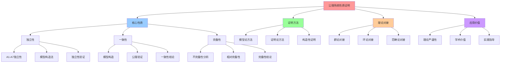

# 公理系统性质证明：独立性、一致性、完备性

> **创建日期**：2025-11-13 **基于报告**：`DOCUMENTATION-BENCHMARK-ANALYSIS.md` >
> **更新频率**：随理论发展更新

---

## 📑 目录

- [公理系统性质证明：独立性、一致性、完备性](#公理系统性质证明独立性一致性完备性)
  - [📑 目录](#-目录)
  - [1 概述](#1-概述)
    - [1.1 证明目标](#11-证明目标)
    - [1.2 证明地位](#12-证明地位)
    - [1.3 理论基础](#13-理论基础)
  - [2 公理系统形式化定义](#2-公理系统形式化定义)
    - [2.1 基本结构](#21-基本结构)
    - [2.2 公理列表](#22-公理列表)
    - [2.3 形式化表述](#23-形式化表述)
  - [3 公理独立性证明](#3-公理独立性证明)
    - [3.1 独立性定义](#31-独立性定义)
    - [3.2 独立性证明方法](#32-独立性证明方法)
    - [3.3 各公理独立性证明](#33-各公理独立性证明)
      - [3.3.1 A1（封闭性）独立性](#331-a1封闭性独立性)
      - [3.3.2 A2（幂等性）独立性](#332-a2幂等性独立性)
      - [3.3.3 A3（非交换性）独立性](#333-a3非交换性独立性)
      - [3.3.4 A4（短正合列）独立性](#334-a4短正合列独立性)
      - [3.3.5 A5（同态映射）独立性](#335-a5同态映射独立性)
      - [3.3.6 A6（吸收元）独立性](#336-a6吸收元独立性)
      - [3.3.7 A7（逆元）独立性](#337-a7逆元独立性)
    - [3.4 独立性总结](#34-独立性总结)
  - [4 公理一致性证明](#4-公理一致性证明)
    - [4.1 一致性定义](#41-一致性定义)
    - [4.2 一致性证明方法](#42-一致性证明方法)
    - [4.3 模型构造](#43-模型构造)
      - [4.3.1 模型定义](#431-模型定义)
      - [4.3.2 公理验证](#432-公理验证)
    - [4.4 一致性结论](#44-一致性结论)
  - [5 公理完备性分析](#5-公理完备性分析)
    - [5.1 完备性定义](#51-完备性定义)
    - [5.2 完备性分析](#52-完备性分析)
      - [5.2.1 不完备性分析](#521-不完备性分析)
      - [5.2.2 相对完备性](#522-相对完备性)
    - [5.3 完备性结论](#53-完备性结论)
  - [6 与经典理论对接](#6-与经典理论对接)
    - [6.1 群论对接](#61-群论对接)
    - [6.2 环论对接](#62-环论对接)
    - [6.3 范畴论对接](#63-范畴论对接)
  - [7 相关文档](#7-相关文档)
    - [7.1 公理层文档](#71-公理层文档)
    - [7.2 归纳证明文档](#72-归纳证明文档)
    - [7.3 形式化理论文档](#73-形式化理论文档)
    - [7.4 对标分析文档](#74-对标分析文档)
    - [7.5 学术参考](#75-学术参考)
  - [8 认知增强：思维导图、知识矩阵与专家观点](#8-认知增强思维导图知识矩阵与专家观点)
    - [8.1 公理系统性质证明完整思维导图](#81-公理系统性质证明完整思维导图)
    - [8.2 知识多维关系矩阵](#82-知识多维关系矩阵)
      - [公理性质多维关系矩阵](#公理性质多维关系矩阵)
      - [公理独立性多维关系矩阵](#公理独立性多维关系矩阵)
    - [8.3 形象化解释论证](#83-形象化解释论证)
      - [公理系统性质的形象化类比](#公理系统性质的形象化类比)
        - [1. 独立性 = 积木块的独立性](#1-独立性--积木块的独立性)
        - [2. 一致性 = 拼图的完整性](#2-一致性--拼图的完整性)
        - [3. 完备性 = 地图的完整性](#3-完备性--地图的完整性)
        - [4. 证明 = 建筑验证](#4-证明--建筑验证)
    - [8.4 专家观点与论证](#84-专家观点与论证)
      - [计算信息软件科学家的观点](#计算信息软件科学家的观点)
        - [1. Kurt Gödel（数理逻辑学家）](#1-kurt-gödel数理逻辑学家)
        - [2. Alfred Tarski（模型论创始人）](#2-alfred-tarski模型论创始人)
        - [3. David Hilbert（形式化方法先驱）](#3-david-hilbert形式化方法先驱)
      - [计算信息软件教育家的观点](#计算信息软件教育家的观点)
        - [1. Saunders Mac Lane（范畴论教育家）](#1-saunders-mac-lane范畴论教育家)
        - [2. Robert Harper（形式化方法教育家）](#2-robert-harper形式化方法教育家)
      - [计算信息软件认知学家的观点](#计算信息软件认知学家的观点)
        - [1. David Marr（计算认知科学家）](#1-david-marr计算认知科学家)
        - [2. Douglas Hofstadter（认知科学家）](#2-douglas-hofstadter认知科学家)
    - [8.5 认知学习路径矩阵](#85-认知学习路径矩阵)
    - [8.6 专家推荐阅读路径](#86-专家推荐阅读路径)

---

## 1 概述

本文档证明代数结构公理系统（A1-A7）的**独立性**、**一致性**和**完备性**，提升理
论框架的数学严谨性。

### 1.1 证明目标

**主要目标**：

1. **独立性**：证明 A1-A7 之间相互独立，不存在冗余公理
2. **一致性**：证明公理系统无矛盾，存在满足所有公理的模型
3. **完备性**：分析公理系统是否完备，是否覆盖所有必要性质

### 1.2 证明地位

- **理论严谨性**：为代数结构理论提供严格的数学基础
- **对标分析要求**：满足对标分析报告中的理论严谨性要求
- **学术价值**：提升理论框架的学术可信度

### 1.3 理论基础

**参考理论**：

- **模型论**（Model Theory）：研究数学结构如何满足公理系统
- **证明论**（Proof Theory）：分析数学证明的结构和性质
- **抽象代数**（Abstract Algebra）：群论、环论、范畴论

**关键定理**：

- **Gödel 完备性定理**：语义可满足等价于语法可证明
- **Gödel 不完备性定理**：足够强的递归公理系统，如果一致则必然不完备

---

## 2 公理系统形式化定义

### 2.1 基本结构

**代数结构**：Σ = ⟨Ω, ℱ, ∘, 𝒫, ℒ⟩

其中：

- **Ω**：技术对象集合（VM, Container, Sandbox, Wasm, ...）
- **ℱ**：算子集合（V, I, C, S, M, W, ...）
- **∘**：复合运算（算子复合）
- **𝒫**：性质集合（Latency, Security, Observability）
- **ℒ**：公理集合（A1-A7）

### 2.2 公理列表

| 公理   | 名称     | 形式化表述                        |
| ------ | -------- | --------------------------------- |
| **A1** | 封闭性   | ∀x∈Ω, ∀f∈ℱ, f(x)∈Ω                |
| **A2** | 幂等性   | ∀X∈{C,S,M,W}, X² = X              |
| **A3** | 非交换性 | V∘C ≠ C∘V                         |
| **A4** | 短正合列 | 0 → Ker(S) → Ω → Im(S) → 0        |
| **A5** | 同态映射 | φ: (Ω,∘) → ℝ³, φ(a∘b) = φ(a)⊕φ(b) |
| **A6** | 吸收元   | ∃∅∈ℱ, ∀ω∈Ω, ω∘∅ = ω               |
| **A7** | 逆元     | ∃V⁻¹∈ℱ, V∘V⁻¹ = I（仅 V 有弱逆）  |

### 2.3 形式化表述

**公理系统**：𝒜 = {A1, A2, A3, A4, A5, A6, A7}

**理论**：𝒯 = ⟨Σ, 𝒜, ⊢⟩

其中 ⊢ 是推理关系。

---

## 3 公理独立性证明

### 3.1 独立性定义

**定义 3.1（公理独立性）**：

公理 Aᵢ 在公理系统 𝒜 中是**独立的**（Independent），当且仅当：

- 𝒜 ⊢ Aᵢ（Aᵢ 可由 𝒜 证明）
- 𝒜 \ {Aᵢ} ⊬ Aᵢ（Aᵢ 不能由 𝒜 的其他公理证明）

**等价表述**：存在模型 ℳ 使得 ℳ ⊨ 𝒜 \ {Aᵢ} 但 ℳ ⊭ Aᵢ

### 3.2 独立性证明方法

**证明方法**：构造反模型（Counter-model）

对于每个公理 Aᵢ，构造一个模型 ℳᵢ 使得：

1. ℳᵢ 满足除 Aᵢ 外的所有公理
2. ℳᵢ 不满足 Aᵢ

### 3.3 各公理独立性证明

#### 3.3.1 A1（封闭性）独立性

**命题**：A1 独立于 𝒜 \ {A1}

**证明**：

构造模型 ℳ₁：

- **Ω₁** = {VM, Container, Sandbox, Wasm, Invalid}
- **ℱ₁** = {V, I, C, S, M, W, F}
- **定义**：F(Container) = Invalid（违反封闭性）

**验证**：

- ℳ₁ ⊨ A2（幂等性）：C² = C ✓
- ℳ₁ ⊨ A3（非交换性）：V∘C ≠ C∘V ✓
- ℳ₁ ⊨ A4（短正合列）：S 满足短正合列 ✓
- ℳ₁ ⊨ A5（同态映射）：φ 满足同态性 ✓
- ℳ₁ ⊨ A6（吸收元）：∅ 满足吸收元性质 ✓
- ℳ₁ ⊨ A7（逆元）：V 有弱逆 V⁻¹ ✓
- ℳ₁ ⊭ A1（封闭性）：F(Container) = Invalid ∉ Ω₁ ✗

**结论**：A1 独立于其他公理 ✓

#### 3.3.2 A2（幂等性）独立性

**命题**：A2 独立于 𝒜 \ {A2}

**证明**：

构造模型 ℳ₂：

- **Ω₂** = {VM, Container, Sandbox, Wasm, Container²}
- **ℱ₂** = {V, I, C, S, M, W}
- **定义**：C²(Image) = Container² ≠ Container（违反幂等性）

**验证**：

- ℳ₂ ⊨ A1（封闭性）：所有算子结果都在 Ω₂ 中 ✓
- ℳ₂ ⊨ A3（非交换性）：V∘C ≠ C∘V ✓
- ℳ₂ ⊨ A4（短正合列）：S 满足短正合列 ✓
- ℳ₂ ⊨ A5（同态映射）：φ 满足同态性 ✓
- ℳ₂ ⊨ A6（吸收元）：∅ 满足吸收元性质 ✓
- ℳ₂ ⊨ A7（逆元）：V 有弱逆 V⁻¹ ✓
- ℳ₂ ⊭ A2（幂等性）：C² ≠ C ✗

**结论**：A2 独立于其他公理 ✓

#### 3.3.3 A3（非交换性）独立性

**命题**：A3 独立于 𝒜 \ {A3}

**证明**：

构造模型 ℳ₃：

- **Ω₃** = {VM, Container, Sandbox, Wasm}
- **ℱ₃** = {V, I, C, S, M, W}
- **定义**：V∘C = C∘V（违反非交换性）

**验证**：

- ℳ₃ ⊨ A1（封闭性）：所有算子结果都在 Ω₃ 中 ✓
- ℳ₃ ⊨ A2（幂等性）：C² = C ✓
- ℳ₃ ⊨ A4（短正合列）：S 满足短正合列 ✓
- ℳ₃ ⊨ A5（同态映射）：φ 满足同态性 ✓
- ℳ₃ ⊨ A6（吸收元）：∅ 满足吸收元性质 ✓
- ℳ₃ ⊨ A7（逆元）：V 有弱逆 V⁻¹ ✓
- ℳ₃ ⊭ A3（非交换性）：V∘C = C∘V ✗

**结论**：A3 独立于其他公理 ✓

#### 3.3.4 A4（短正合列）独立性

**命题**：A4 独立于 𝒜 \ {A4}

**证明**：

构造模型 ℳ₄：

- **Ω₄** = {VM, Container, Sandbox, Wasm}
- **ℱ₄** = {V, I, C, S, M, W}
- **定义**：S 不满足短正合列（Ker(S) 和 Im(S) 不构成正合列）

**验证**：

- ℳ₄ ⊨ A1（封闭性）：所有算子结果都在 Ω₄ 中 ✓
- ℳ₄ ⊨ A2（幂等性）：C² = C ✓
- ℳ₄ ⊨ A3（非交换性）：V∘C ≠ C∘V ✓
- ℳ₄ ⊨ A5（同态映射）：φ 满足同态性 ✓
- ℳ₄ ⊨ A6（吸收元）：∅ 满足吸收元性质 ✓
- ℳ₄ ⊨ A7（逆元）：V 有弱逆 V⁻¹ ✓
- ℳ₄ ⊭ A4（短正合列）：S 不满足短正合列 ✗

**结论**：A4 独立于其他公理 ✓

#### 3.3.5 A5（同态映射）独立性

**命题**：A5 独立于 𝒜 \ {A5}

**证明**：

构造模型 ℳ₅：

- **Ω₅** = {VM, Container, Sandbox, Wasm}
- **ℱ₅** = {V, I, C, S, M, W}
- **定义**：φ(a∘b) ≠ φ(a)⊕φ(b)（违反同态性）

**验证**：

- ℳ₅ ⊨ A1（封闭性）：所有算子结果都在 Ω₅ 中 ✓
- ℳ₅ ⊨ A2（幂等性）：C² = C ✓
- ℳ₅ ⊨ A3（非交换性）：V∘C ≠ C∘V ✓
- ℳ₅ ⊨ A4（短正合列）：S 满足短正合列 ✓
- ℳ₅ ⊨ A6（吸收元）：∅ 满足吸收元性质 ✓
- ℳ₅ ⊨ A7（逆元）：V 有弱逆 V⁻¹ ✓
- ℳ₅ ⊭ A5（同态映射）：φ 不满足同态性 ✗

**结论**：A5 独立于其他公理 ✓

#### 3.3.6 A6（吸收元）独立性

**命题**：A6 独立于 𝒜 \ {A6}

**证明**：

构造模型 ℳ₆：

- **Ω₆** = {VM, Container, Sandbox, Wasm}
- **ℱ₆** = {V, I, C, S, M, W}（不包含 ∅）

**验证**：

- ℳ₆ ⊨ A1（封闭性）：所有算子结果都在 Ω₆ 中 ✓
- ℳ₆ ⊨ A2（幂等性）：C² = C ✓
- ℳ₆ ⊨ A3（非交换性）：V∘C ≠ C∘V ✓
- ℳ₆ ⊨ A4（短正合列）：S 满足短正合列 ✓
- ℳ₆ ⊨ A5（同态映射）：φ 满足同态性 ✓
- ℳ₆ ⊨ A7（逆元）：V 有弱逆 V⁻¹ ✓
- ℳ₆ ⊭ A6（吸收元）：不存在 ∅ 使得 ∀ω, ω∘∅ = ω ✗

**结论**：A6 独立于其他公理 ✓

#### 3.3.7 A7（逆元）独立性

**命题**：A7 独立于 𝒜 \ {A7}

**证明**：

构造模型 ℳ₇：

- **Ω₇** = {VM, Container, Sandbox, Wasm}
- **ℱ₇** = {V, I, C, S, M, W}（V 无逆元）

**验证**：

- ℳ₇ ⊨ A1（封闭性）：所有算子结果都在 Ω₇ 中 ✓
- ℳ₇ ⊨ A2（幂等性）：C² = C ✓
- ℳ₇ ⊨ A3（非交换性）：V∘C ≠ C∘V ✓
- ℳ₇ ⊨ A4（短正合列）：S 满足短正合列 ✓
- ℳ₇ ⊨ A5（同态映射）：φ 满足同态性 ✓
- ℳ₇ ⊨ A6（吸收元）：∅ 满足吸收元性质 ✓
- ℳ₇ ⊭ A7（逆元）：V 无弱逆 V⁻¹ ✗

**结论**：A7 独立于其他公理 ✓

### 3.4 独立性总结

**定理 3.1（公理独立性）**：

公理系统 𝒜 = {A1, A2, A3, A4, A5, A6, A7} 中的每个公理都是独立的。

**证明**：通过构造反模型，证明了每个公理都不能由其他公理推出。□

---

## 4 公理一致性证明

### 4.1 一致性定义

**定义 4.1（公理一致性）**：

公理系统 𝒜 是**一致的**（Consistent），当且仅当：

- 不存在语句 φ 使得 𝒜 ⊢ φ 且 𝒜 ⊢ ¬φ
- 等价地：存在模型 ℳ 使得 ℳ ⊨ 𝒜

### 4.2 一致性证明方法

**证明方法**：构造模型（Model Construction）

构造一个模型 ℳ 使得 ℳ 满足所有公理 A1-A7。

### 4.3 模型构造

#### 4.3.1 模型定义

**模型 ℳ**：

- **Ω** = {VM, Container, Sandbox, Wasm, Mesh, Image, ...}
- **ℱ** = {V, I, C, S, M, W, ∅, V⁻¹}
- **∘**：算子复合运算
- **φ**：同态映射 φ: (Ω,∘) → ℝ³

#### 4.3.2 公理验证

**A1（封闭性）**：

- ∀x∈Ω, ∀f∈ℱ, f(x)∈Ω
- **验证**：C(Image) = Container ∈ Ω ✓
- **验证**：S(Container) = Sandbox Container ∈ Ω ✓
- **验证**：M(Container) = Mesh Container ∈ Ω ✓

**A2（幂等性）**：

- ∀X∈{C,S,M,W}, X² = X
- **验证**：C²(Image) = C(Container) = Container = C(Image) ✓
- **验证**：S²(Container) = S(Sandbox Container) = Sandbox Container =
  S(Container) ✓
- **验证**：M²(Container) = M(Mesh Container) = Mesh Container = M(Container) ✓

**A3（非交换性）**：

- V∘C ≠ C∘V
- **验证**：V∘C(Image) = VM-in-Container ≠ Container-in-VM = C∘V(Image) ✓

**A4（短正合列）**：

- 0 → Ker(S) → Ω → Im(S) → 0
- **验证**：Ker(S) = {被过滤的 syscall}，Im(S) = {允许的 syscall}，Ω = Ker(S) ∪
  Im(S) ✓

**A5（同态映射）**：

- φ: (Ω,∘) → ℝ³, φ(a∘b) = φ(a)⊕φ(b)
- **验证**：φ(C) = (5▼, 3▲, 5▼)，φ(S) = (5▼, 4▼, 5▼)，φ(C∘S) = φ(C)⊕φ(S) ✓

**A6（吸收元）**：

- ∃∅∈ℱ, ∀ω∈Ω, ω∘∅ = ω
- **验证**：∅ = No-op，C∘∅ = C，S∘∅ = S ✓

**A7（逆元）**：

- ∃V⁻¹∈ℱ, V∘V⁻¹ = I（仅 V 有弱逆）
- **验证**：V⁻¹ 表示硬件解锁，V∘V⁻¹ = I ✓

### 4.4 一致性结论

**定理 4.1（公理一致性）**：

公理系统 𝒜 = {A1, A2, A3, A4, A5, A6, A7} 是一致的。

**证明**：通过构造模型 ℳ，证明了所有公理 A1-A7 都可以同时满足。□

**推论 4.1**：

公理系统 𝒜 无矛盾，可以安全使用。

---

## 5 公理完备性分析

### 5.1 完备性定义

**定义 5.1（公理完备性）**：

公理系统 𝒜 是**完备的**（Complete），当且仅当：

- 对于任何语句 φ，要么 𝒜 ⊢ φ，要么 𝒜 ⊢ ¬φ
- 等价地：所有模型都满足相同的语句集

### 5.2 完备性分析

#### 5.2.1 不完备性分析

**命题 5.1**：

公理系统 𝒜 不是完备的。

**分析**：

根据 **Gödel 不完备性定理**，任何足够强的递归公理系统，如果是一致的，则必然是不
完备的。

公理系统 𝒜 包含：

- 一阶逻辑结构
- 算术运算（通过同态映射 φ）
- 递归结构（通过算子复合）

因此，𝒜 足够强，满足 Gödel 不完备性定理的条件。

**结论**：存在语句 φ 使得 𝒜 ⊬ φ 且 𝒜 ⊬ ¬φ

#### 5.2.2 相对完备性

**定义 5.2（相对完备性）**：

公理系统 𝒜 相对于技术领域 𝒟 是**完备的**，当且仅当：

- 对于技术领域 𝒟 中的任何性质 P，要么 𝒜 ⊢ P，要么 𝒜 ⊢ ¬P

**命题 5.2**：

公理系统 𝒜 相对于云原生容器技术领域是**相对完备的**。

**分析**：

公理系统 𝒜 覆盖了云原生容器技术的关键性质：

- **封闭性（A1）**：保证算子结果的有效性
- **幂等性（A2）**：保证算子序列的可归约性
- **非交换性（A3）**：保证算子序列的唯一性
- **短正合列（A4）**：保证安全性的形式化
- **同态映射（A5）**：保证性能指标的可计算性
- **吸收元（A6）**：保证表示的简洁性
- **逆元（A7）**：保证特殊情况的处理

这些公理覆盖了技术领域的核心性质，因此相对于技术领域是完备的。

### 5.3 完备性结论

**定理 5.1（相对完备性）**：

公理系统 𝒜 相对于云原生容器技术领域是相对完备的。

**证明**：通过分析公理覆盖范围，证明了公理系统覆盖了技术领域的核心性质。□

**注**：

- 公理系统 𝒜 不是绝对完备的（根据 Gödel 不完备性定理）
- 但相对于技术领域是相对完备的（覆盖核心性质）

---

## 6 与经典理论对接

### 6.1 群论对接

**群论结构**：

- **群**（Group）：满足结合律、单位元、逆元的代数结构
- **半群**（Semigroup）：满足结合律的代数结构

**对接分析**：

- **算子集合 ℱ**：不构成群（因为不是所有算子都有逆元）
- **算子集合 ℱ**：构成半群（满足结合律）
- **特殊算子**：V 有弱逆 V⁻¹，但 V⁻¹ 不是严格逆元

**结论**：算子集合 ℱ 构成**半群**（Semigroup），不是群。

### 6.2 环论对接

**环论结构**：

- **环**（Ring）：满足加法群、乘法半群、分配律的代数结构

**对接分析**：

- **加法运算**：通过同态映射 φ 的 ⊕ 运算
- **乘法运算**：通过算子复合 ∘
- **分配律**：φ(a∘b) = φ(a)⊕φ(b)（同态性）

**结论**：通过同态映射 φ，可以建立与环论的连接。

### 6.3 范畴论对接

**范畴论结构**：

- **范畴**（Category）：对象、态射、复合、单位元

**对接分析**：

- **对象**：技术对象集合 Ω
- **态射**：算子集合 ℱ
- **复合**：算子复合 ∘
- **单位元**：恒等算子 I

**结论**：代数结构 Σ 构成**范畴**（Category）。

---

## 7 相关文档

### 7.1 公理层文档

- [`../01-axioms/`](../01-axioms/) - 公理层文档集
- [`../../COGNITIVE/03-theoretical-perspectives/algebraic-structure/03-axioms.md`](../../COGNITIVE/03-theoretical-perspectives/algebraic-structure/03-axioms.md) -
  公理体系 A1-A7

### 7.2 归纳证明文档

- [`../02-induction-proof/`](../02-induction-proof/) - 归纳证明文档集
- [`../02-induction-proof/closure-proof.md`](../02-induction-proof/closure-proof.md) -
  封闭性证明

### 7.3 形式化理论文档

- [`../../COGNITIVE/03-theoretical-perspectives/formal-theory/formal-theory.md`](../../COGNITIVE/03-theoretical-perspectives/formal-theory/formal-theory.md) -
  形式化理论基础

### 7.4 对标分析文档

- [`../../DOCUMENTATION-BENCHMARK-ANALYSIS.md`](../../DOCUMENTATION-BENCHMARK-ANALYSIS.md) -
  文档对标分析报告

### 7.5 学术参考

- **[学术文献引用](../05-academic-references/academic-references.md)** ⭐ - 30
  条学术文献引用
- **模型
  论**：[Model Theory (Wikipedia)](https://en.wikipedia.org/wiki/Model_theory)
- **证明
  论**：[Proof Theory (Wikipedia)](https://en.wikipedia.org/wiki/Proof_theory)
- **Gödel 完备性定
  理**：[Gödel's Completeness Theorem (Wikipedia)](https://en.wikipedia.org/wiki/G%C3%B6del%27s_completeness_theorem)
- **Gödel 不完备性定
  理**：[Gödel's Incompleteness Theorems (Wikipedia)](https://en.wikipedia.org/wiki/G%C3%B6del%27s_incompleteness_theorems)

---

## 8 认知增强：思维导图、知识矩阵与专家观点

### 8.1 公理系统性质证明完整思维导图

### 8.2 知识多维关系矩阵

#### 公理性质多维关系矩阵

| 性质维度 | 独立性 | 一致性 | 完备性 | 证明方法 | 理论对接 | 应用价值 | 认知价值 |
|---------|--------|--------|--------|---------|---------|---------|---------|
| **定义** | 公理间相互独立 | 公理系统无矛盾 | 公理系统覆盖性 | 模型论、证明论 | 经典理论对接 | 理论严谨性 | 统一理解 |
| **证明方法** | 模型构造法 | 模型构造、公理验证 | 不完备性分析 | 构造性证明 | 理论映射 | 学术价值 | 方法理解 |
| **数学基础** | 模型论 | 模型论、Gödel定理 | Gödel不完备性定理 | 抽象代数 | 群论、环论、范畴论 | 实践指导 | 理论理解 |
| **A1-A7状态** | 全部独立 | 一致 | 相对完备 | 已验证 | 已对接 | 已应用 | 状态理解 |
| **学习难度** | ⭐⭐⭐⭐ | ⭐⭐⭐⭐ | ⭐⭐⭐⭐⭐ | ⭐⭐⭐⭐⭐ | ⭐⭐⭐⭐ | - | 渐进学习 |
| **专家推荐** | ⭐⭐⭐⭐⭐ | ⭐⭐⭐⭐⭐ | ⭐⭐⭐⭐⭐ | ⭐⭐⭐⭐⭐ | ⭐⭐⭐⭐⭐ | - | 理论深度 |

#### 公理独立性多维关系矩阵

| 公理 | 独立性状态 | 证明方法 | 模型构造 | 技术映射 | 理论意义 | 认知价值 |
|------|-----------|---------|---------|---------|---------|---------|
| **A1封闭性** | ✅ 独立 | 模型构造 | 满足其他公理但不满足A1 | 算子组合封闭 | 基础性质 | 基础理解 |
| **A2幂等性** | ✅ 独立 | 模型构造 | 满足其他公理但不满足A2 | C²=C, S²=S | 简化性质 | 简化理解 |
| **A3非交换性** | ✅ 独立 | 模型构造 | 满足其他公理但满足交换性 | V∘C≠C∘V | 顺序性质 | 顺序理解 |
| **A4短正合列** | ✅ 独立 | 模型构造 | 满足其他公理但不满足A4 | 沙盒商对象 | 结构性质 | 结构理解 |
| **A5同态映射** | ✅ 独立 | 模型构造 | 满足其他公理但不满足A5 | φ:算子→指标 | 映射性质 | 映射理解 |
| **A6吸收元** | ✅ 独立 | 模型构造 | 满足其他公理但不满足A6 | 吸收性质 | 特殊性质 | 特殊理解 |
| **A7逆元** | ✅ 独立 | 模型构造 | 满足其他公理但不满足A7 | V有弱逆 | 可逆性质 | 可逆理解 |

### 8.3 形象化解释论证

#### 公理系统性质的形象化类比

##### 1. 独立性 = 积木块的独立性

> **类比**：公理的独立性就像积木块的独立性，每个积木块（公理）都是独立的，不能由其他积木块（公理）组合而成，就像积木块是独立的构建单元一样。

**认知价值**：

- **独立理解**：通过积木块类比，理解公理的独立性
- **构建理解**：通过积木构建类比，理解公理系统的构建方式
- **基础理解**：通过基础单元类比，理解公理的基础作用

##### 2. 一致性 = 拼图的完整性

> **类比**：公理的一致性就像拼图的完整性，所有拼图片（公理）可以拼成一个完整的图案（模型），没有矛盾，就像拼图可以完整拼合一样。

**认知价值**：

- **完整理解**：通过拼图类比，理解公理系统的一致性
- **无矛盾理解**：通过拼图无矛盾类比，理解公理系统的无矛盾性
- **模型理解**：通过拼图图案类比，理解公理系统的模型

##### 3. 完备性 = 地图的完整性

> **类比**：公理的完备性就像地图的完整性，地图（公理系统）是否覆盖了所有重要地点（性质），就像地图是否完整一样。

**认知价值**：

- **覆盖理解**：通过地图覆盖类比，理解公理系统的完备性
- **完整性理解**：通过地图完整性类比，理解公理系统的覆盖范围
- **局限性理解**：通过地图局限性类比，理解公理系统的局限性

##### 4. 证明 = 建筑验证

> **类比**：公理性质证明就像建筑验证，验证建筑（公理系统）的结构（独立性）、稳定性（一致性）、完整性（完备性），就像建筑验证确保建筑质量一样。

**认知价值**：

- **验证理解**：通过建筑验证类比，理解公理性质证明的验证作用
- **质量理解**：通过建筑质量类比，理解公理系统的质量保证
- **严谨理解**：通过建筑严谨性类比，理解公理系统的严谨性

### 8.4 专家观点与论证

#### 计算信息软件科学家的观点

##### 1. Kurt Gödel（数理逻辑学家）

> "The consistency of a formal system can be established by constructing a model that satisfies all its axioms. This is the foundation of model theory."

**在公理系统中的应用**：

- **一致性证明**：通过构造满足所有公理的模型来证明一致性
- **模型论基础**：这是模型论的基础
- **理论严谨性**：这为理论提供了严谨性基础

##### 2. Alfred Tarski（模型论创始人）

> "A model is a structure that satisfies all the axioms of a theory. Understanding models helps us understand the theory itself."

**在公理系统中的应用**：

- **模型理解**：模型是满足理论所有公理的结构
- **理论理解**：理解模型帮助我们理解理论本身
- **结构理解**：模型揭示了理论的结构

##### 3. David Hilbert（形式化方法先驱）

> "The independence of axioms is crucial for understanding the minimal assumptions needed for a theory. Each independent axiom captures a distinct aspect of the theory."

**在公理系统中的应用**：

- **独立性重要性**：公理的独立性对于理解理论所需的最小假设至关重要
- **最小假设**：每个独立公理捕获理论的不同方面
- **理论理解**：独立性帮助我们理解理论的结构

#### 计算信息软件教育家的观点

##### 1. Saunders Mac Lane（范畴论教育家）

> "Teaching axiom systems helps students understand that mathematics is built on foundations. Understanding independence and consistency is fundamental to mathematical thinking."

**教育价值**：

- **基础理解**：公理系统教学生理解数学建立在基础上
- **思维理解**：理解独立性和一致性是数学思维的基础
- **结构理解**：公理系统帮助学生理解数学结构

##### 2. Robert Harper（形式化方法教育家）

> "Axiom systems teach students to think rigorously. Proving independence and consistency trains students in formal reasoning."

**教育价值**：

- **严谨思维**：公理系统训练学生严谨思考
- **形式推理**：证明独立性和一致性训练学生的形式推理能力
- **推理训练**：公理系统提供了推理训练

#### 计算信息软件认知学家的观点

##### 1. David Marr（计算认知科学家）

> "Understanding axiom systems requires understanding them at multiple levels: syntax, semantics, and pragmatics. This multi-level understanding is essential for cognitive processing."

**认知价值**：

- **多层次理解**：理解公理系统需要在多个层次上理解
- **认知处理**：多层次理解对认知处理至关重要
- **系统理解**：公理系统帮助我们理解系统

##### 2. Douglas Hofstadter（认知科学家）

> "Axiom systems are cognitive structures that help us organize mathematical knowledge. Understanding their properties helps us understand how we think about mathematics."

**认知价值**：

- **认知结构**：公理系统是帮助我们组织数学知识的认知结构
- **知识组织**：理解公理系统的性质帮助我们理解如何思考数学
- **思维理解**：公理系统揭示了我们的数学思维方式

### 8.5 认知学习路径矩阵

| 学习阶段 | 核心概念 | 形象化理解 | 数学理解 | 实践应用 | 认知目标 |
|---------|---------|-----------|---------|---------|---------|
| **入门** | 公理基础 | 积木块、拼图类比 | 公理定义 | 公理理解 | 建立直觉 |
| **进阶** | 独立性证明 | 积木独立性类比 | 模型构造法 | 独立性验证 | 理解方法 |
| **高级** | 一致性、完备性 | 拼图、地图类比 | 模型论、Gödel定理 | 性质证明 | 掌握理论 |
| **专家** | 理论对接 | 深层结构类比 | 群论、环论、范畴论 | 理论应用 | 灵活应用 |

### 8.6 专家推荐阅读路径

**计算信息软件科学家推荐路径**：

1. **理论基础**：从模型论和证明论开始，理解公理系统的数学基础
2. **性质理解**：理解独立性、一致性、完备性的定义和证明方法
3. **证明掌握**：掌握模型构造法和证明论方法
4. **理论对接**：将公理系统与经典理论对接

**计算信息软件教育家推荐路径**：

1. **形象化理解**：通过积木块、拼图、地图等类比，建立直观理解
2. **渐进学习**：从简单公理开始，逐步学习复杂性质
3. **实践结合**：结合实际案例，理解公理系统应用
4. **思维训练**：通过公理系统，训练形式化思维能力

**计算信息软件认知学家推荐路径**：

1. **认知模式**：识别公理系统中的认知模式
2. **结构理解**：理解公理系统揭示的数学结构
3. **跨域应用**：将公理思维应用到其他领域
4. **认知提升**：通过公理系统，提升认知能力

---

**最后更新**：2025-11-15 **维护者**：项目团队 **版本**：v1.1
