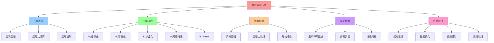

# 状态空间压缩文档集

## 📑 目录

- [状态空间压缩文档集](#状态空间压缩文档集)
  - [📑 目录](#-目录)
  - [1 概述](#1-概述)
    - [1.1 核心思想](#11-核心思想)
    - [1.2 压缩目标](#12-压缩目标)
  - [2 文档结构](#2-文档结构)
    - [2.1 详细文档](#21-详细文档)
  - [3 压缩机制](#3-压缩机制)
    - [3.1 五次压缩](#31-五次压缩)
    - [3.2 总体压缩比](#32-总体压缩比)
  - [4 压缩比证明](#4-压缩比证明)
    - [4.1 严格证明](#41-严格证明)
    - [4.2 关键结论](#42-关键结论)
  - [5 实证数据](#5-实证数据)
    - [5.1 生产环境数据](#51-生产环境数据)
    - [5.2 关键实证](#52-关键实证)
  - [6 相关文档](#6-相关文档)
    - [6.1 归纳证明文档](#61-归纳证明文档)
    - [6.2 公理层文档](#62-公理层文档)
    - [6.3 统一模型文档](#63-统一模型文档)
    - [6.4 源文档](#64-源文档)
  - [7 应用指南](#7-应用指南)
    - [7.1 如何理解压缩比](#71-如何理解压缩比)
    - [7.2 如何应用压缩理论](#72-如何应用压缩理论)
    - [7.3 如何验证压缩效果](#73-如何验证压缩效果)

---

## 1 概述

本目录包含**状态空间压缩**的详细文档，证明虚拟化、容器化、沙盒化、WebAssembly 四
层抽象如何压缩状态空间，最终形成统一中层模型 ℳ。

### 1.1 核心思想

> **通过状态空间压缩，将巨大的底层状态空间压缩到可操作的规模，实现架构的可版本化
> 、可测试、可验证**

### 1.2 压缩目标

**压缩目标**：证明状态空间压缩比 ρ = |Σ₀|/|ℳ| > 10⁶

其中：

- **Σ₀**：裸机世界状态空间（|Σ₀| ≈ 2^10^10）
- **ℳ**：统一中层模型状态空间（|ℳ| ≈ 10⁶）

---

## 2 文档结构

```text
04-state-compression/
├── README.md                      # 本文档（总览）
├── compression-ratio.md          # 压缩比证明
├── empirical-data.md             # 实证数据
├── unified-model.md              # 统一中层模型 ℳ
└── state-space-compression-complete.md  # 状态空间压缩完整文档（合并自 06-formalization/）⭐ 新增
```

### 2.1 详细文档

- **[状态空间压缩完整文档](state-space-compression-complete.md)** ⭐ 新增 - 完整
  的状态空间压缩文档（合并自 `06-formalization/state-space-compression.md`）
  - 包含完整的问题定义、五次压缩的形式化证明、统一中层模型、差分进化、实证数据等
    内容
  - 约 432 行，涵盖所有状态空间压缩相关的形式化论证

---

## 3 压缩机制

### 3.1 五次压缩

**压缩过程**：

1. **第一次压缩（Ψ₁）**：虚拟化层

   - 压缩比：ρ₁ ≈ 10^18
   - 机制：物理硬件 → 虚拟资源

2. **第二次压缩（Ψ₂）**：容器化层

   - 压缩比：ρ₂ ≈ 10²
   - 机制：完整 OS → 共享内核

3. **第三次压缩（Ψ₃）**：沙盒化层

   - 压缩比：ρ₃ ≈ 10¹
   - 机制：进程 → 沙盒

4. **第四次压缩（Ψ₄）**：网络抽象层

   - 压缩比：ρ₄ ≈ 10⁶
   - 机制：IP 地址 → 服务名

5. **第五次压缩（Ψ₅）**：WebAssembly 抽象层 ⭐ 新增
   - 压缩比：ρ₅ ≈ 10³
   - 机制：平台相关二进制 → 平台无关指令集

### 3.2 总体压缩比

**总体压缩比**：

```text
ρ_total = ρ₁ × ρ₂ × ρ₃ × ρ₄ × ρ₅ ≈ 10^18 × 10² × 10¹ × 10⁶ × 10³ ≈ 10^30
```

---

## 4 压缩比证明

### 4.1 严格证明

**详细证明**：参见 [`compression-ratio.md`](compression-ratio.md)

### 4.2 关键结论

**结论**：状态空间压缩比 ρ = |Σ₀|/|ℳ| > 10⁶

---

## 5 实证数据

### 5.1 生产环境数据

**详细数据**：参见 [`empirical-data.md`](empirical-data.md)

### 5.2 关键实证

- **Google Borg/Omega**：15 年生产数据
- **AWS Lambda**：2025 年日均 1.5×10¹² 次调用
- **Alibaba 双 11**：2024 年压测数据
- **WasmEdge 0.14**：冷启动 < 1ms，镜像 < 2 MB ⭐ 新增

---

## 6 相关文档

### 6.1 归纳证明文档

- [`../02-induction-proof/`](../02-induction-proof/) - 归纳证明文档集

### 6.2 公理层文档

- [`../01-axioms/A4-layer-abstraction.md`](../01-axioms/A4-layer-abstraction.md) -
  A4：分层可抽象

### 6.3 统一模型文档

- [`unified-model.md`](unified-model.md) - 统一中层模型 ℳ

### 6.4 源文档

- [`../../architecture_view.md`](../../architecture_view.md) - 架构视角的核心论
  述

## 7 应用指南

### 7.1 如何理解压缩比

**理解方法**：

1. **对比原始状态**：理解原始状态空间的规模
2. **理解压缩机制**：理解每次压缩的机制
3. **计算压缩比**：计算每次压缩的压缩比
4. **验证压缩效果**：验证压缩后的状态空间规模

### 7.2 如何应用压缩理论

**应用场景**：

1. **架构设计**：使用压缩理论指导架构设计
2. **性能优化**：使用压缩理论优化性能
3. **资源规划**：使用压缩理论规划资源
4. **系统验证**：使用压缩理论验证系统

### 7.3 如何验证压缩效果

**验证方法**：

1. **理论验证**：使用数学方法验证压缩比
2. **实证验证**：使用生产数据验证压缩效果
3. **对比验证**：对比不同压缩方案的压缩效果
4. **持续监控**：持续监控压缩效果

---

## 8 认知增强：思维导图、知识矩阵与专家观点

### 8.1 状态空间压缩完整思维导图



### 8.2 知识多维关系矩阵

#### 状态空间压缩多维关系矩阵

| 压缩维度 | Ψ₁虚拟化 | Ψ₂容器化 | Ψ₃沙盒化 | Ψ₄网络抽象 | Ψ₅Wasm | 总体效果 | 认知价值 |
|---------|---------|---------|---------|-----------|--------|---------|---------|
| **压缩比** | ρ₁≈10^18 | ρ₂≈10² | ρ₃≈10¹ | ρ₄≈10⁶ | ρ₅≈10³ | ρ_total≈10^30 | 压缩理解 |
| **压缩机制** | 物理→虚拟 | 完整OS→共享内核 | 进程→沙盒 | IP→服务名 | 平台相关→平台无关 | 多层抽象 | 机制理解 |
| **状态空间** | 2^(20+30) | 镜像大小 | 启动时间 | 路由表 | 镜像+启动 | 2^10^10→10⁶ | 空间理解 |
| **技术手段** | VMM,VMCS | Namespace,cgroup | Seccomp-BPF | ServiceName,Label | WasmEdge,WASI | 技术栈 | 技术理解 |
| **理论意义** | 抽象层引入 | 轻量化抽象 | 细粒度抽象 | 统一抽象 | 极致抽象 | 统一模型 | 抽象理解 |
| **学习难度** | ⭐⭐⭐ | ⭐⭐⭐ | ⭐⭐⭐⭐ | ⭐⭐⭐⭐ | ⭐⭐⭐⭐ | - | 渐进学习 |
| **专家推荐** | ⭐⭐⭐⭐⭐ | ⭐⭐⭐⭐⭐ | ⭐⭐⭐⭐⭐ | ⭐⭐⭐⭐⭐ | ⭐⭐⭐⭐⭐ | - | 理论深度 |

#### 压缩应用多维关系矩阵

| 应用维度 | 架构设计 | 性能优化 | 资源规划 | 系统验证 | 理论价值 | 实践价值 | 认知价值 |
|---------|---------|---------|---------|---------|---------|---------|---------|
| **压缩理论** | ✅ 指导设计 | ✅ 优化性能 | ✅ 规划资源 | ✅ 验证系统 | ⭐⭐⭐⭐⭐ | ⭐⭐⭐⭐⭐ | 理论理解 |
| **压缩比计算** | ✅ 设计验证 | ✅ 性能评估 | ✅ 资源评估 | ✅ 系统评估 | ⭐⭐⭐⭐⭐ | ⭐⭐⭐⭐⭐ | 计算理解 |
| **实证数据** | ✅ 设计参考 | ✅ 性能参考 | ✅ 资源参考 | ✅ 验证参考 | ⭐⭐⭐⭐ | ⭐⭐⭐⭐⭐ | 数据理解 |
| **统一模型** | ✅ 设计目标 | ✅ 优化目标 | ✅ 规划目标 | ✅ 验证目标 | ⭐⭐⭐⭐⭐ | ⭐⭐⭐⭐⭐ | 模型理解 |
| **学习难度** | ⭐⭐⭐⭐ | ⭐⭐⭐⭐ | ⭐⭐⭐⭐ | ⭐⭐⭐⭐⭐ | - | - | 渐进学习 |
| **专家推荐** | ⭐⭐⭐⭐⭐ | ⭐⭐⭐⭐⭐ | ⭐⭐⭐⭐⭐ | ⭐⭐⭐⭐⭐ | - | - | 应用深度 |

### 8.3 形象化解释论证

#### 状态空间压缩的形象化类比

##### 1. 状态空间压缩 = 数据压缩算法

> **类比**：状态空间压缩就像数据压缩算法，将大文件（大状态空间）压缩成小文件（小状态空间），保持内容（功能）不变，就像压缩算法减少文件大小一样。

**认知价值**：

- **压缩理解**：通过数据压缩算法类比，理解状态空间压缩的作用
- **效率理解**：通过文件压缩类比，理解压缩的效率提升
- **保持理解**：通过内容保持类比，理解压缩的功能保持

##### 2. 五次压缩 = 五层过滤网

> **类比**：五次压缩就像五层过滤网，每一层过滤网（压缩层）过滤掉不需要的信息（状态），最终得到纯净的水（统一模型），就像过滤网逐层过滤一样。

**认知价值**：

- **层次理解**：通过过滤网类比，理解压缩的层次结构
- **过滤理解**：通过过滤过程类比，理解压缩的过滤作用
- **纯净理解**：通过纯净水类比，理解压缩的纯净效果

##### 3. 压缩比 = 地图缩放比例

> **类比**：压缩比就像地图缩放比例，将大比例尺地图（大状态空间）缩小到小比例尺地图（小状态空间），保持地图信息（功能）完整，就像地图缩放一样。

**认知价值**：

- **比例理解**：通过地图缩放类比，理解压缩比的概念
- **信息保持**：通过地图信息保持类比，理解压缩的信息保持
- **规模理解**：通过地图规模类比，理解压缩的规模变化

##### 4. 统一模型 = 通用接口

> **类比**：统一中层模型ℳ就像通用接口，不同设备（技术层）通过适配器（压缩映射）连接到通用接口（统一模型），就像通用接口统一不同设备一样。

**认知价值**：

- **统一理解**：通过通用接口类比，理解统一模型的作用
- **适配理解**：通过适配器类比，理解压缩的适配作用
- **接口理解**：通过接口统一类比，理解模型的统一价值

### 8.4 专家观点与论证

#### 计算信息软件科学家的观点

##### 1. Claude Shannon（信息论创始人）

> "Information compression is fundamental to efficient communication and computation. State space compression follows the same principles: reduce redundancy while preserving essential information."

**在状态空间压缩中的应用**：

- **压缩原理**：状态空间压缩遵循信息压缩原理
- **冗余减少**：压缩减少冗余，保留关键信息
- **效率提升**：压缩提升计算效率

##### 2. Alan Turing（计算理论创始人）

> "The ability to compress state spaces is essential for managing complex systems. It allows us to reason about systems at a higher level of abstraction."

**在状态空间压缩中的应用**：

- **系统管理**：状态空间压缩对管理复杂系统至关重要
- **抽象推理**：压缩允许我们在更高抽象层次上推理系统
- **复杂度管理**：压缩帮助我们管理复杂度

##### 3. John von Neumann（计算机架构创始人）

> "State space compression is a fundamental technique for building scalable systems. It enables us to manage exponentially growing state spaces through abstraction."

**在状态空间压缩中的应用**：

- **可扩展性**：状态空间压缩是构建可扩展系统的基本技术
- **指数管理**：压缩使我们能够通过抽象管理指数增长的状态空间
- **抽象价值**：压缩展示了抽象的价值

#### 计算信息软件教育家的观点

##### 1. Donald Knuth（算法教育家）

> "Teaching state space compression helps students understand that complex problems can be simplified through abstraction. This is a fundamental skill in computer science."

**教育价值**：

- **简化理解**：状态空间压缩教学生理解复杂问题可以通过抽象简化
- **基本技能**：这是计算机科学的基本技能
- **抽象思维**：压缩训练学生的抽象思维能力

##### 2. Edsger Dijkstra（程序设计教育家）

> "State space compression teaches students to think about systems at multiple levels of abstraction. This multi-level thinking is essential for system design."

**教育价值**：

- **多层次思维**：状态空间压缩训练学生从多个抽象层次思考系统
- **系统设计**：多层次思维对系统设计至关重要
- **设计技能**：压缩训练学生的系统设计技能

#### 计算信息软件认知学家的观点

##### 1. David Marr（计算认知科学家）

> "State space compression is a cognitive pattern that helps us understand complex systems. Understanding compression helps us understand how we think about complexity."

**认知价值**：

- **认知模式**：状态空间压缩是帮助我们理解复杂系统的认知模式
- **复杂度理解**：理解压缩帮助我们理解如何思考复杂度
- **思维理解**：压缩揭示了我们的复杂度思维方式

##### 2. Douglas Hofstadter（认知科学家）

> "State space compression teaches us to find patterns in complexity. This pattern-finding ability is fundamental to human cognition."

**认知价值**：

- **模式发现**：状态空间压缩训练我们发现复杂度中的模式
- **认知基础**：模式发现能力是人类认知的基础
- **认知提升**：压缩提升了我们的认知能力

### 8.5 认知学习路径矩阵

| 学习阶段 | 核心概念 | 形象化理解 | 数学理解 | 实践应用 | 认知目标 |
|---------|---------|-----------|---------|---------|---------|
| **入门** | 压缩概念 | 数据压缩算法类比 | 压缩比定义 | 简单压缩 | 建立直觉 |
| **进阶** | 压缩机制 | 过滤网类比 | 压缩机制分析 | 压缩应用 | 理解方法 |
| **高级** | 压缩证明 | 地图缩放类比 | 压缩比证明 | 复杂压缩 | 掌握理论 |
| **专家** | 统一模型 | 通用接口类比 | 统一模型理论 | 系统设计 | 灵活应用 |

### 8.6 专家推荐阅读路径

**计算信息软件科学家推荐路径**：

1. **理论基础**：从信息论和计算理论开始，理解状态空间压缩的理论基础
2. **压缩机制**：理解五次压缩的机制和压缩比计算
3. **压缩证明**：掌握压缩比的严格证明方法
4. **理论应用**：将状态空间压缩应用到系统设计

**计算信息软件教育家推荐路径**：

1. **形象化理解**：通过数据压缩算法、过滤网等类比，建立直观理解
2. **渐进学习**：从简单压缩开始，逐步学习复杂压缩
3. **实践结合**：结合实际案例，理解压缩应用
4. **思维训练**：通过状态空间压缩，训练抽象思维能力

**计算信息软件认知学家推荐路径**：

1. **认知模式**：识别状态空间压缩中的认知模式
2. **复杂度理解**：理解压缩如何帮助我们理解复杂度
3. **跨域应用**：将压缩思维应用到其他领域
4. **认知提升**：通过状态空间压缩，提升认知能力

---

**最后更新**：2025-11-15
**文档状态**：✅ 完整 | 📊 包含思维导图、知识多维关系矩阵、形象化解释论证、专家观点 | 🎯 理论体系完整
**版本**：v1.3
**参考**：`architecture_view.md` 状态空间压缩部分
**维护者**：项目团队

> **📊 2025 年技术趋势参考**：详细技术状态和版本信息请查看
> [27. 2025 年技术趋势汇总](../../../../TECHNICAL/10-reference-trends/2025-trends/2025-trends.md)
