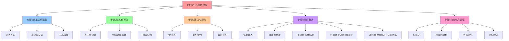

# 5 步拆分与组合流程

## 📑 目录

- [5 步拆分与组合流程](#5-步拆分与组合流程)
  - [📑 目录](#-目录)
  - [1 概述](#1-概述)
    - [1.1 核心思想](#11-核心思想)
    - [1.2 5 步流程概览](#12-5-步流程概览)
  - [2 步骤 1：需求关切抽取](#2-步骤-1需求关切抽取)
    - [2.1 目标](#21-目标)
    - [2.2 关键活动](#22-关键活动)
      - [2.2.1 业务关切](#221-业务关切)
      - [2.2.2 非业务关切](#222-非业务关切)
    - [2.3 工具与模板](#23-工具与模板)
    - [2.4 形式化定义](#24-形式化定义)
  - [3 步骤 2：结构化拆分](#3-步骤-2结构化拆分)
    - [3.1 目标](#31-目标)
    - [3.2 拆分原则](#32-拆分原则)
      - [3.2.1 关注点分离（Separation of Concerns）](#321-关注点分离separation-of-concerns)
      - [3.2.2 领域驱动设计（DDD）](#322-领域驱动设计ddd)
    - [3.3 工具与模板](#33-工具与模板)
    - [3.4 形式化定义](#34-形式化定义)
  - [4 步骤 3：接口与契约](#4-步骤-3接口与契约)
    - [4.1 目标](#41-目标)
    - [4.2 契约类型](#42-契约类型)
      - [4.2.1 API 契约](#421-api-契约)
      - [4.2.2 事件契约](#422-事件契约)
      - [4.2.3 数据契约](#423-数据契约)
    - [4.3 工具与模板](#43-工具与模板)
    - [4.4 形式化定义](#44-形式化定义)
  - [5 步骤 4：组合模式](#5-步骤-4组合模式)
    - [5.1 目标](#51-目标)
    - [5.2 组合模式类型](#52-组合模式类型)
      - [5.2.1 依赖注入 / Composition Root](#521-依赖注入--composition-root)
      - [5.2.2 适配器 / 桥接](#522-适配器--桥接)
      - [5.2.3 Facade / Gateway](#523-facade--gateway)
      - [5.2.4 Pipeline / Orchestrator](#524-pipeline--orchestrator)
      - [5.2.5 Service Mesh / API Gateway](#525-service-mesh--api-gateway)
    - [5.3 工具与模板](#53-工具与模板)
    - [5.4 形式化定义](#54-形式化定义)
  - [6 步骤 5：自动化与验证](#6-步骤-5自动化与验证)
    - [6.1 目标](#61-目标)
    - [6.2 自动化活动](#62-自动化活动)
      - [6.2.1 CI/CD](#621-cicd)
      - [6.2.2 部署自动化](#622-部署自动化)
      - [6.2.3 可观测性](#623-可观测性)
      - [6.2.4 测试与验证](#624-测试与验证)
    - [6.3 工具与模板](#63-工具与模板)
    - [6.4 形式化定义](#64-形式化定义)
  - [7 实践建议](#7-实践建议)
    - [7.1 每完成一次拆分/组合](#71-每完成一次拆分组合)
    - [7.2 采用 C4 模型](#72-采用-c4-模型)
    - [7.3 用 ArchiMate 或 UML](#73-用-archimate-或-uml)
  - [8 典型案例](#8-典型案例)
    - [8.1 电商平台](#81-电商平台)
    - [8.2 金融系统](#82-金融系统)
  - [9 总结](#9-总结)
  - [10 认知增强：思维导图、知识矩阵与专家观点](#10-认知增强思维导图知识矩阵与专家观点)
    - [10.1 5步拆分与组合流程完整思维导图](#101-5步拆分与组合流程完整思维导图)
    - [10.2 知识多维关系矩阵](#102-知识多维关系矩阵)
      - [5步流程多维关系矩阵](#5步流程多维关系矩阵)
      - [组合模式多维关系矩阵](#组合模式多维关系矩阵)
    - [10.3 形象化解释论证](#103-形象化解释论证)
      - [5步流程的形象化类比](#5步流程的形象化类比)
        - [1. 5步流程 = 建房子流程](#1-5步流程--建房子流程)
        - [2. 结构化拆分 = 乐高积木](#2-结构化拆分--乐高积木)
        - [3. 接口契约 = 合同协议](#3-接口契约--合同协议)
        - [4. 组合模式 = 交响乐团](#4-组合模式--交响乐团)
        - [5. 自动化验证 = 质量检测线](#5-自动化验证--质量检测线)
    - [10.4 专家观点与论证](#104-专家观点与论证)
      - [计算信息软件科学家的观点](#计算信息软件科学家的观点)
        - [1. David Parnas（信息隐藏原则）](#1-david-parnas信息隐藏原则)
        - [2. Christopher Alexander（模式语言）](#2-christopher-alexander模式语言)
        - [3. Fred Brooks（《人月神话》作者）](#3-fred-brooks人月神话作者)
      - [计算信息软件教育家的观点](#计算信息软件教育家的观点)
        - [1. Robert C. Martin（《代码整洁之道》作者）](#1-robert-c-martin代码整洁之道作者)
        - [2. Martin Fowler（重构之父）](#2-martin-fowler重构之父)
      - [计算信息软件认知学家的观点](#计算信息软件认知学家的观点)
        - [1. Donald Norman（《设计心理学》作者）](#1-donald-norman设计心理学作者)
        - [2. Herbert A. Simon（认知科学家）](#2-herbert-a-simon认知科学家)
    - [10.5 认知学习路径矩阵](#105-认知学习路径矩阵)
    - [10.6 专家推荐阅读路径](#106-专家推荐阅读路径)

---

## 1 概述

本文档详细阐述**架构拆解与组合的 5 步流程**，这是从软件架构视角理解虚拟化、容器
化、沙盒化的核心方法论。

### 1.1 核心思想

> **把"软件架构"拆成"子结构"（decomposition）后再组合回"整体"（composition）**

整个流程包含 5 个步骤，每步都提供**可复用的工具/模板/模式**，以便在任何项目中快
速上手。

### 1.2 5 步流程概览

| 步骤                 | 目标                             | 关键活动                                                                                                                                                                                                       | 工具 / 模板                                                               |
| -------------------- | -------------------------------- | -------------------------------------------------------------------------------------------------------------------------------------------------------------------------------------------------------------- | ------------------------------------------------------------------------- |
| **1. 需求‑关切抽取** | 找到所有业务 & 非业务关切        | 访谈、用户故事、服务契约、技术约束、性能指标、合规需求                                                                                                                                                         | 问题卡、业务地图、技术债务清单                                            |
| **2. 结构化拆分**    | 把系统拆成可维护、可替换的"模块" | 按 **关注点分离**（Presentation, Application, Domain, Integration, Data, Infra, Security, Observability, Deployment）拆分；按 **Bounded Context** 或 **微服务** 进一步拆分                                     | C4/ArchiMate 模型、DDD 边界图、服务矩阵                                   |
| **3. 接口与契约**    | 明确定义子结构的 **输入/输出**   | API 文档、gRPC/Protobuf、事件 schema、数据模型、配置/凭据契约                                                                                                                                                  | OpenAPI, GraphQL SDL, Avro/Protobuf, Terraform modules                    |
| **4. 组合模式**      | 让拆分出的组件互联、互操作       | ① **依赖注入 / Composition Root** <br>② **适配器 / 桥接**（跨技术边界）<br>③ **Facade / Gateway**（聚合多服务）<br>④ **Pipeline / Orchestrator**（业务流程）<br>⑤ **Service Mesh / API Gateway**（通信、流控） | Spring DI / Guice, OSGi / CDI, Netflix Eureka, Envoy, Istio, Apache Camel |
| **5. 自动化 & 验证** | 确保组合后可运行、可监控、可测试 | CI/CD（Jenkins, GitHub Actions）, K8s + Helm, Prometheus/Tempo, OpenTelemetry, Chaos Monkey, ADR 生成                                                                                                          | GitHub repo + GitHub Actions, ArgoCD, Kustomize, Argo Rollouts            |

## 2 步骤 1：需求关切抽取

### 2.1 目标

找到所有业务与非业务关切，为后续拆分提供依据。

### 2.2 关键活动

#### 2.2.1 业务关切

- **用户故事**：从用户视角描述功能需求
- **业务流程**：识别核心业务流程和关键路径
- **服务契约**：定义服务接口和交互协议

#### 2.2.2 非业务关切

- **技术约束**：性能、延迟、吞吐量要求
- **合规需求**：安全、审计、合规性要求
- **运维需求**：可观测性、可扩展性、灾难恢复

### 2.3 工具与模板

- **问题卡**：记录关键问题和约束
- **业务地图**：可视化业务流程和依赖关系
- **技术债务清单**：记录现有技术债务和限制

### 2.4 形式化定义

```text
需求集 R = {r₁, r₂, ..., rₙ}
其中 rᵢ = ⟨type, priority, constraint⟩
type ∈ {business, technical, compliance, operations}
```

## 3 步骤 2：结构化拆分

### 3.1 目标

把系统拆成可维护、可替换的"模块"。

### 3.2 拆分原则

#### 3.2.1 关注点分离（Separation of Concerns）

按以下 9 个关注点拆分：

1. **表现层（Presentation）**：交互、展示、前端
2. **应用层（Application）**：业务流程、协调
3. **领域层（Domain）**：业务核心
4. **集成层（Integration）**：与外部系统交互
5. **数据层（Data）**：数据存储、事务
6. **基础设施层（Infrastructure）**：主机、网络、存储
7. **安全层（Security）**：访问控制、身份鉴权
8. **可观测层（Observability）**：监控、日志、追踪
9. **运营层（Operations）**：部署、滚动升级、灾备

#### 3.2.2 领域驱动设计（DDD）

按 **Bounded Context** 进一步拆分：

- **Order Service**（订单服务）
- **Payment Service**（支付服务）
- **Inventory Service**（库存服务）
- **Catalog Service**（目录服务）
- **User Service**（用户服务）

### 3.3 工具与模板

- **C4/ArchiMate 模型**：层次化架构可视化
- **DDD 边界图**：领域边界和上下文映射
- **服务矩阵**：服务依赖关系矩阵

### 3.4 形式化定义

```text
系统 S = {C₁, C₂, ..., Cₙ}
其中 Cᵢ = ⟨name, layer, responsibilities, interfaces⟩
layer ∈ {presentation, application, domain, integration, data, infra, security, observability, operations}
```

## 4 步骤 3：接口与契约

### 4.1 目标

明确定义子结构的 **输入/输出**。

### 4.2 契约类型

#### 4.2.1 API 契约

- **REST API**：OpenAPI 3.0 规范
- **gRPC**：Protobuf 定义
- **GraphQL**：SDL Schema

#### 4.2.2 事件契约

- **事件 Schema**：Avro、JSON Schema
- **消息格式**：Kafka、RabbitMQ

#### 4.2.3 数据契约

- **数据模型**：ER 图、JSON Schema
- **配置契约**：Terraform modules、Helm charts

### 4.3 工具与模板

- **OpenAPI**：REST API 规范
- **GraphQL SDL**：GraphQL Schema
- **Avro/Protobuf**：事件和数据序列化
- **Terraform modules**：基础设施配置

### 4.4 形式化定义

```text
接口 I = ⟨name, type, input, output, contract⟩
其中 type ∈ {API, Event, Data, Config}
contract 定义了接口的语义和行为约束
```

## 5 步骤 4：组合模式

### 5.1 目标

让拆分出的组件互联、互操作。

### 5.2 组合模式类型

#### 5.2.1 依赖注入 / Composition Root

- **Spring DI**：依赖注入框架
- **Guice**：Google 依赖注入
- **CDI**：Java EE 上下文和依赖注入

#### 5.2.2 适配器 / 桥接

- **gRPC ↔ REST**：跨协议转换
- **Docker ↔ K8s**：容器运行时适配

#### 5.2.3 Facade / Gateway

- **API Gateway**：Kong、Istio Gateway
- **Service Gateway**：Netflix Zuul、Spring Cloud Gateway

#### 5.2.4 Pipeline / Orchestrator

- **Temporal**：工作流引擎
- **Argo Workflows**：Kubernetes 工作流
- **Camunda**：业务流程管理

#### 5.2.5 Service Mesh / API Gateway

- **Istio**：服务网格
- **Linkerd**：轻量级服务网格
- **Envoy**：云原生代理

### 5.3 工具与模板

- **Spring DI / Guice**：依赖注入
- **OSGi / CDI**：模块化框架
- **Netflix Eureka**：服务发现
- **Envoy**：云原生代理
- **Istio**：服务网格
- **Apache Camel**：企业集成模式

### 5.4 形式化定义

```text
组合模式 P = ⟨type, components, relations⟩
其中 type ∈ {DI, Adapter, Facade, Pipeline, Mesh}
relations 定义了组件间的连接关系
```

## 6 步骤 5：自动化与验证

### 6.1 目标

确保组合后可运行、可监控、可测试。

### 6.2 自动化活动

#### 6.2.1 CI/CD

- **GitHub Actions**：自动化构建、测试、部署
- **Jenkins**：持续集成服务器
- **ArgoCD**：GitOps 持续交付

#### 6.2.2 部署自动化

- **Kubernetes + Helm**：容器编排和包管理
- **Kustomize**：配置管理
- **Argo Rollouts**：渐进式交付

#### 6.2.3 可观测性

- **Prometheus**：指标收集
- **Tempo / Jaeger**：分布式追踪
- **OpenTelemetry**：统一遥测

#### 6.2.4 测试与验证

- **Chaos Monkey**：混沌工程
- **ADR 生成**：架构决策记录

### 6.3 工具与模板

- **GitHub Actions**：CI/CD 自动化
- **ArgoCD**：GitOps
- **Kustomize**：配置管理
- **Argo Rollouts**：渐进式交付

### 6.4 形式化定义

```text
自动化流程 A = ⟨trigger, stages, validation⟩
其中 stages = {build, test, deploy, monitor}
validation 确保每个阶段的质量标准
```

## 7 实践建议

### 7.1 每完成一次拆分/组合

都在 **ADR** 里写一条记录：`<Component> 采用 <Pattern> 以满足 <Constraint>`。

### 7.2 采用 C4 模型

- **上下文图**：系统与外部环境的关系
- **容器图**：应用容器和部署单元
- **组件图**：组件内部结构
- **代码图**：类和函数级别

### 7.3 用 ArchiMate 或 UML

记录 **业务能力**、**技术能力**、**安全/合规** 等非功能需求。

## 8 典型案例

### 8.1 电商平台

| 步骤          | 结果                                                                                                                               | 说明         |
| ------------- | ---------------------------------------------------------------------------------------------------------------------------------- | ------------ |
| 1. 需求抽取   | 订单、支付、库存、营销、用户                                                                                                       | 业务功能列表 |
| 2. 结构化拆分 | **Order Service** (微服务)<br>**Payment Service**<br>**Inventory Service**<br>**Catalog Service**<br>**User Service**              | DDD 边界     |
| 3. 接口契约   | OpenAPI / gRPC                                                                                                                     | 统一文档     |
| 4. 组合       | <br>• API Gateway (Kong) 聚合 REST <br>• Service Mesh (Istio) 进行熔断、流量镜像 <br>• Kafka 作为事件总线 (OrderCreated → Payment) |              |
| 5. 自动化     | CI/CD (GitHub Actions) <br>Helm chart 部署 <br>Prometheus/Tempo 监控 <br>Chaos Monkey 可靠性                                       |              |

### 8.2 金融系统

| 步骤          | 结果                                                                               | 说明   |
| ------------- | ---------------------------------------------------------------------------------- | ------ |
| 1. 需求抽取   | 交易、清算、风险、合规                                                             | 业务线 |
| 2. 结构化拆分 | 交易微服务 + 风险校验微服务 + 合规审计微服务                                       |        |
| 3. 接口契约   | gRPC + Protobuf（强类型）                                                          |        |
| 4. 组合       | ① Service Mesh + Sidecar <br>② 事件总线 + 事务 Saga <br>③ 统一认证（OAuth2 + JWT） |        |
| 5. 自动化     | Terraform + Pulumi <br>ArgoCD <br>OPA + Gatekeeper <br>Grafana Loki                |        |

## 9 总结

通过 **5 步拆分与组合流程**，我们可以：

1. **拆分**：按关切、领域、层次把系统拆成清晰的"组件"
2. **合成**：用 **组合模式**把组件拼接
3. **验证**：通过 **ADR、C4 模型、CI/CD、监控** 证明组合后仍满足功能与非功能需求
4. **迭代**：随业务变更、技术演进，持续拆分并重新组合，保持架构的弹性与可维护性

---

---

## 10 认知增强：思维导图、知识矩阵与专家观点

### 10.1 5步拆分与组合流程完整思维导图



### 10.2 知识多维关系矩阵

#### 5步流程多维关系矩阵

| 流程维度 | 步骤1需求抽取 | 步骤2结构化拆分 | 步骤3接口契约 | 步骤4组合模式 | 步骤5自动化验证 | 流程完整性 | 认知价值 |
|---------|-------------|---------------|-------------|-------------|--------------|----------|---------|
| **核心活动** | 访谈、用户故事 | 关注点分离、DDD | API文档、gRPC | 依赖注入、适配器 | CI/CD、监控 | 完整流程 | 流程理解 |
| **关键工具** | 问题卡、业务地图 | C4/ArchiMate、DDD边界图 | OpenAPI、Protobuf | Spring DI、Istio | GitHub Actions、ArgoCD | 工具链 | 工具理解 |
| **输出产物** | 需求清单 | 模块结构 | 接口定义 | 组合架构 | 自动化流程 | 完整产物 | 产物理解 |
| **验证方法** | 需求评审 | 架构评审 | 接口测试 | 集成测试 | 持续监控 | 多层验证 | 验证理解 |
| **迭代频率** | 需求变更时 | 架构演进时 | 接口变更时 | 组合调整时 | 持续迭代 | 持续迭代 | 迭代理解 |
| **学习难度** | ⭐⭐ | ⭐⭐⭐ | ⭐⭐⭐ | ⭐⭐⭐⭐ | ⭐⭐⭐⭐ | - | 渐进学习 |
| **专家推荐** | ⭐⭐⭐⭐⭐ | ⭐⭐⭐⭐⭐ | ⭐⭐⭐⭐⭐ | ⭐⭐⭐⭐⭐ | ⭐⭐⭐⭐⭐ | - | 实践深度 |

#### 组合模式多维关系矩阵

| 模式维度 | 依赖注入 | 适配器桥接 | Facade Gateway | Pipeline Orchestrator | Service Mesh | 模式选择 | 认知价值 |
|---------|---------|-----------|---------------|---------------------|-------------|---------|---------|
| **适用场景** | 组件组合 | 跨技术边界 | 聚合多服务 | 业务流程 | 通信流控 | 场景匹配 | 场景理解 |
| **复杂度** | 低 | 中 | 中 | 高 | 高 | 复杂度递增 | 复杂度理解 |
| **可维护性** | 高 | 中 | 中 | 中 | 高 | 可维护性变化 | 维护理解 |
| **性能影响** | 低 | 低 | 中 | 中 | 中 | 性能影响 | 性能理解 |
| **学习难度** | ⭐⭐ | ⭐⭐⭐ | ⭐⭐⭐ | ⭐⭐⭐⭐ | ⭐⭐⭐⭐ | - | 渐进学习 |
| **专家推荐** | ⭐⭐⭐⭐⭐ | ⭐⭐⭐⭐ | ⭐⭐⭐⭐ | ⭐⭐⭐⭐⭐ | ⭐⭐⭐⭐⭐ | - | 模式深度 |

### 10.3 形象化解释论证

#### 5步流程的形象化类比

##### 1. 5步流程 = 建房子流程

> **类比**：5步流程就像建房子流程，步骤1需求抽取像确定房屋需求（几室几厅），步骤2结构化拆分像设计房屋结构（框架、墙体），步骤3接口契约像确定门窗位置（接口定义），步骤4组合模式像装修（组合模式），步骤5自动化验证像验收（自动化测试），每一步都依赖前一步，最终建成完整房屋。

**认知价值**：

- **流程理解**：通过建房子流程类比，理解5步流程的顺序和依赖关系
- **步骤理解**：通过建房子步骤类比，理解每个步骤的作用和产出
- **完整性理解**：通过建房子完整性类比，理解5步流程的完整性

##### 2. 结构化拆分 = 乐高积木

> **类比**：结构化拆分就像乐高积木，把大系统拆成小积木块（模块），每个积木块可以独立设计（关注点分离），积木块之间有接口（接口契约），可以组合成不同形状（组合模式），就像乐高积木可以组合成不同模型一样。

**认知价值**：

- **拆分理解**：通过乐高积木类比，理解结构化拆分的概念
- **模块理解**：通过积木块类比，理解模块的独立性和可组合性
- **组合理解**：通过积木组合类比，理解组合模式的作用

##### 3. 接口契约 = 合同协议

> **类比**：接口契约就像合同协议，定义了双方的权利和义务（输入输出），有明确的格式（API格式），可以验证（接口测试），违反契约要承担责任（错误处理），就像合同协议约束双方行为一样。

**认知价值**：

- **契约理解**：通过合同协议类比，理解接口契约的含义
- **格式理解**：通过合同格式类比，理解接口格式的重要性
- **验证理解**：通过合同验证类比，理解接口测试的重要性

##### 4. 组合模式 = 交响乐团

> **类比**：组合模式就像交响乐团，每个乐器（组件）有独立功能，指挥（组合模式）协调各乐器，不同乐器组合成不同乐章（不同组合模式），就像交响乐团演奏不同乐曲一样。

**认知价值**：

- **组合理解**：通过交响乐团类比，理解组合模式的作用
- **协调理解**：通过指挥类比，理解组合模式的协调作用
- **多样性理解**：通过不同乐章类比，理解组合模式的多样性

##### 5. 自动化验证 = 质量检测线

> **类比**：自动化验证就像质量检测线，自动检测产品质量（自动化测试），持续监控（持续监控），发现问题及时反馈（CI/CD），就像质量检测线保证产品质量一样。

**认知价值**：

- **自动化理解**：通过质量检测线类比，理解自动化验证的作用
- **持续理解**：通过持续检测类比，理解持续监控的重要性
- **质量理解**：通过质量保证类比，理解自动化验证的质量保证作用

### 10.4 专家观点与论证

#### 计算信息软件科学家的观点

##### 1. David Parnas（信息隐藏原则）

> **观点**："The criteria to be used in decomposing systems into modules are based on the principle of information hiding."（将系统分解为模块的标准基于信息隐藏原则）

**与5步流程的关联**：

- **拆分理解**：步骤2结构化拆分体现了信息隐藏原则，通过关注点分离实现信息隐藏
- **模块理解**：通过信息隐藏原则理解模块的独立性和可维护性
- **设计理解**：通过信息隐藏原则指导架构设计，实现模块化设计

##### 2. Christopher Alexander（模式语言）

> **观点**："Each pattern describes a problem which occurs over and over again in our environment, and then describes the core of the solution to that problem, in such a way that you can use this solution a million times over, without ever doing it the same way twice."（每个模式描述一个在我们的环境中反复出现的问题，然后描述该问题解决方案的核心，这样你可以使用这个解决方案一百万次，而永远不会以相同的方式做两次）

**与5步流程的关联**：

- **模式理解**：步骤4组合模式体现了模式语言的思想，通过模式解决反复出现的问题
- **复用理解**：通过模式语言理解组合模式的可复用性
- **创新理解**：通过模式语言理解组合模式的创新性（每次使用都不同）

##### 3. Fred Brooks（《人月神话》作者）

> **观点**："How does a project get to be a year late? One day at a time."（项目如何延迟一年？一天一天地延迟）

**与5步流程的关联**：

- **迭代理解**：步骤5自动化验证体现了持续迭代的重要性，避免"一天一天地延迟"
- **监控理解**：通过持续监控及时发现和解决问题，避免项目延迟
- **实践理解**：通过自动化验证指导实践，确保项目按时完成

#### 计算信息软件教育家的观点

##### 1. Robert C. Martin（《代码整洁之道》作者）

> **观点**："Clean code is not written by following a set of rules. You don't become a software craftsman by learning a list of heuristics. Professionalism and craftsmanship come from values that drive disciplines."（整洁代码不是通过遵循一套规则编写的。你不会通过学习一系列启发式方法成为软件工匠。专业性和工艺来自驱动纪律的价值观）

**与5步流程的关联**：

- **价值观理解**：5步流程体现了架构设计的价值观（拆分、组合、验证）
- **纪律理解**：通过5步流程建立架构设计的纪律（需求抽取、结构化拆分、接口契约、组合模式、自动化验证）
- **工艺理解**：通过5步流程理解软件架构的工艺性

##### 2. Martin Fowler（重构之父）

> **观点**："Refactoring is a controlled technique for improving the design of an existing code base."（重构是一种改进现有代码库设计的受控技术）

**与5步流程的关联**：

- **改进理解**：5步流程支持架构改进（步骤2结构化拆分、步骤4组合模式）
- **受控理解**：通过5步流程实现受控的架构改进（步骤5自动化验证）
- **设计理解**：通过5步流程改进架构设计

#### 计算信息软件认知学家的观点

##### 1. Donald Norman（《设计心理学》作者）

> **观点**："The real problem with the interface is that it is an interface. Interfaces get in the way. I don't want to focus my energies on an interface. I want to focus on the job."（界面的真正问题是它是界面。界面会妨碍。我不想把精力集中在界面上。我想专注于工作）

**与5步流程的关联**：

- **接口理解**：步骤3接口契约体现了接口的重要性，但也要避免过度关注接口
- **工作理解**：通过5步流程专注于架构工作（拆分、组合、验证），而不是过度关注接口细节
- **平衡理解**：通过5步流程理解接口与工作的平衡

##### 2. Herbert A. Simon（认知科学家）

> **观点**："A wealth of information creates a poverty of attention."（信息丰富导致注意力贫乏）

**与5步流程的关联**：

- **注意力理解**：5步流程通过结构化方法（步骤2结构化拆分）管理注意力，避免信息过载
- **结构化理解**：通过结构化拆分减少认知负荷，提高注意力效率
- **管理理解**：通过5步流程管理信息，避免注意力贫乏

### 10.5 认知学习路径矩阵

| 学习阶段 | 推荐内容 | 推荐步骤 | 学习重点 | 学习时间 | 前置要求 | 后续进阶 |
|---------|---------|---------|---------|---------|---------|---------|
| **新手阶段** | 概述、步骤1-2 | 步骤1、步骤2 | 需求抽取、结构化拆分 | 1-2周 | 无 | 进阶阶段 |
| **进阶阶段** | 步骤3-4 | 步骤3、步骤4 | 接口契约、组合模式 | 4-8周 | 新手阶段 | 专家阶段 |
| **专家阶段** | 步骤5、典型案例 | 步骤5、案例 | 自动化验证、实践应用 | 16+周 | 进阶阶段 | - |

### 10.6 专家推荐阅读路径

**路径1：流程理解路径**：

1. **第一步**：阅读概述（第1节），理解5步流程概览
2. **第二步**：按顺序阅读步骤1-5（第2-6节），理解完整流程
3. **第三步**：阅读典型案例（第8节），理解实践应用
4. **第四步**：阅读总结（第9节），回顾关键要点

**路径2：实践应用路径**：

1. **第一步**：阅读概述（第1节），了解5步流程
2. **第二步**：阅读工具模板（各步骤的工具模板），学习工具使用
3. **第三步**：阅读典型案例（第8节），学习实践方法
4. **第四步**：阅读实践建议（第7节），学习最佳实践

**路径3：理论深入路径**：

1. **第一步**：阅读形式化定义（各步骤的形式化定义），理解理论基础
2. **第二步**：阅读专家观点（第10.4节），理解理论观点
3. **第三步**：阅读典型案例（第8节），理解理论应用
4. **第四步**：阅读总结（第9节），回顾理论要点

---

**更新时间**：2025-11-15 **版本**：v1.1 **参考**：`architecture_view.md` 第2节
