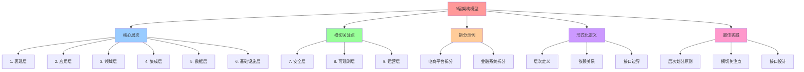

# 分层拆解：9 层架构模型

## 📑 目录

- [分层拆解：9 层架构模型](#分层拆解9-层架构模型)
  - [📑 目录](#-目录)
  - [1 概述](#1-概述)
    - [1.1 核心思想](#11-核心思想)
  - [2 9 层架构模型](#2-9-层架构模型)
    - [2.1 层次结构](#21-层次结构)
    - [2.2 层次依赖关系](#22-层次依赖关系)
  - [3 层次详细说明](#3-层次详细说明)
    - [3.1 表现层（Presentation Layer）](#31-表现层presentation-layer)
    - [3.2 应用层（Application Layer）](#32-应用层application-layer)
    - [3.3 领域层（Domain Layer）](#33-领域层domain-layer)
    - [3.4 集成层（Integration Layer）](#34-集成层integration-layer)
    - [3.5 数据层（Data Layer）](#35-数据层data-layer)
    - [3.6 基础设施层（Infrastructure Layer）](#36-基础设施层infrastructure-layer)
    - [3.7 安全层（Security Layer）](#37-安全层security-layer)
    - [3.8 可观测层（Observability Layer）](#38-可观测层observability-layer)
    - [3.9 运营层（Operations Layer）](#39-运营层operations-layer)
  - [4 拆分示例](#4-拆分示例)
    - [4.1 电商平台拆分](#41-电商平台拆分)
    - [4.2 金融系统拆分](#42-金融系统拆分)
  - [5 形式化定义](#5-形式化定义)
    - [5.1 层次定义](#51-层次定义)
    - [5.2 依赖关系](#52-依赖关系)
    - [5.3 接口边界](#53-接口边界)
  - [6 最佳实践](#6-最佳实践)
    - [6.1 层次划分原则](#61-层次划分原则)
    - [6.2 横切关注点](#62-横切关注点)
    - [6.3 接口设计](#63-接口设计)
  - [7 总结](#7-总结)

---

## 1 概述

本文档详细阐述**9 层架构模型**的分层拆解方法，这是从软件架构视角理解系统结构的基
础。

### 1.1 核心思想

> **按关注点分离（Separation of Concerns）将系统拆解为 9 个层次，每层都有清晰的
> 职责和接口边界**

## 2 9 层架构模型

### 2.1 层次结构

| 层/关注点         | 责任                 | 典型组件                                | 组合方式                                          |
| ----------------- | -------------------- | --------------------------------------- | ------------------------------------------------- |
| **1. 表现层**     | 交互、展示、前端     | SPA、移动 App、WebAPI                   | **MVC / MVVM**；**React/Angular/Vue**             |
| **2. 应用层**     | 业务流程、协调       | 业务服务、业务网关、工作流              | **CQRS**、**Saga**、**Temporal**                  |
| **3. 领域层**     | 业务核心             | 领域模型、聚合根、领域服务              | **DDD**、**Onion Architecture**                   |
| **4. 集成层**     | 与外部系统交互       | 适配器、消息总线、API 网关              | **Adapter/Bridge**、**API Gateway**               |
| **5. 数据层**     | 数据存储、事务       | RDBMS、NoSQL、搜索                      | **Event Sourcing**、**CQRS**                      |
| **6. 基础设施层** | 主机、网络、存储     | VM、K8s、ECS、S3                        | **Infrastructure as Code**（Terraform/Ansible）   |
| **7. 安全层**     | 访问控制、身份鉴权   | OAuth2、OpenID Connect、Kubernetes RBAC | **Policy‑based Access Control**（OPA/Gatekeeper） |
| **8. 可观测层**   | 监控、日志、追踪     | Prometheus、Grafana、Jaeger、ELK        | **OpenTelemetry**                                 |
| **9. 运营层**     | 部署、滚动升级、灾备 | CI/CD、Helm、ArgoCD、Kubernetes Rollout | **Blue/Green**、**Canary**、**Chaos Engineering** |

### 2.2 层次依赖关系

```text
1. 表现层
   └─ 依赖 → 2. 应用层
             └─ 依赖 → 3. 领域层
                       └─ 依赖 → 4. 集成层
                                 └─ 依赖 → 5. 数据层
                                           └─ 依赖 → 6. 基础设施层
                                                     └─ 横切关注点：
                                                       - 7. 安全层
                                                       - 8. 可观测层
                                                       - 9. 运营层
```

## 3 层次详细说明

### 3.1 表现层（Presentation Layer）

**职责**：用户交互、展示、前端

**典型组件**：

- **SPA**：单页应用（React、Angular、Vue）
- **移动 App**：iOS、Android 原生应用
- **WebAPI**：RESTful API、GraphQL API

**组合方式**：

- **MVC / MVVM**：模型-视图-控制器/视图模型
- **React/Angular/Vue**：现代前端框架

**接口边界**：

- 输入：用户交互事件
- 输出：HTTP 请求、WebSocket 消息

### 3.2 应用层（Application Layer）

**职责**：业务流程、协调

**典型组件**：

- **业务服务**：订单服务、支付服务
- **业务网关**：API Gateway、BFF（Backend for Frontend）
- **工作流**：Temporal、Argo Workflows

**组合方式**：

- **CQRS**：命令查询责任分离
- **Saga**：分布式事务模式
- **Temporal**：工作流引擎

**接口边界**：

- 输入：业务请求
- 输出：业务响应、领域事件

### 3.3 领域层（Domain Layer）

**职责**：业务核心

**典型组件**：

- **领域模型**：实体、值对象
- **聚合根**：聚合的根实体
- **领域服务**：领域逻辑服务

**组合方式**：

- **DDD**：领域驱动设计
- **Onion Architecture**：洋葱架构

**接口边界**：

- 输入：领域命令
- 输出：领域事件、领域状态

### 3.4 集成层（Integration Layer）

**职责**：与外部系统交互

**典型组件**：

- **适配器**：外部系统适配器
- **消息总线**：Kafka、RabbitMQ
- **API 网关**：Kong、Istio Gateway

**组合方式**：

- **Adapter/Bridge**：适配器/桥接模式
- **API Gateway**：API 网关模式

**接口边界**：

- 输入：外部系统请求
- 输出：内部系统请求、外部系统响应

### 3.5 数据层（Data Layer）

**职责**：数据存储、事务

**典型组件**：

- **RDBMS**：PostgreSQL、MySQL
- **NoSQL**：MongoDB、Redis
- **搜索**：Elasticsearch、OpenSearch

**组合方式**：

- **Event Sourcing**：事件溯源
- **CQRS**：命令查询责任分离

**接口边界**：

- 输入：数据操作命令
- 输出：数据查询结果、事件流

### 3.6 基础设施层（Infrastructure Layer）

**职责**：主机、网络、存储

**典型组件**：

- **VM**：虚拟机（KVM、Xen）
- **K8s**：Kubernetes 容器编排
- **ECS**：AWS ECS、Azure Container Instances
- **S3**：对象存储

**组合方式**：

- **Infrastructure as Code**：基础设施即代码（Terraform、Ansible）

**接口边界**：

- 输入：基础设施配置
- 输出：计算、网络、存储资源

### 3.7 安全层（Security Layer）

**职责**：访问控制、身份鉴权

**典型组件**：

- **OAuth2**：OAuth 2.0 授权框架
- **OpenID Connect**：身份认证协议
- **Kubernetes RBAC**：基于角色的访问控制
- **OPA/Gatekeeper**：策略即代码

**组合方式**：

- **Policy‑based Access Control**：基于策略的访问控制

**接口边界**：

- 输入：访问请求、身份凭证
- 输出：访问决策、审计日志

### 3.8 可观测层（Observability Layer）

**职责**：监控、日志、追踪

**典型组件**：

- **Prometheus**：指标收集
- **Grafana**：可视化面板
- **Jaeger**：分布式追踪
- **ELK**：日志聚合（Elasticsearch、Logstash、Kibana）

**组合方式**：

- **OpenTelemetry**：统一遥测标准

**接口边界**：

- 输入：指标、日志、追踪数据
- 输出：监控面板、告警、分析报告

### 3.9 运营层（Operations Layer）

**职责**：部署、滚动升级、灾备

**典型组件**：

- **CI/CD**：GitHub Actions、Jenkins
- **Helm**：Kubernetes 包管理
- **ArgoCD**：GitOps 持续交付
- **Kubernetes Rollout**：渐进式交付

**组合方式**：

- **Blue/Green**：蓝绿部署
- **Canary**：金丝雀部署
- **Chaos Engineering**：混沌工程

**接口边界**：

- 输入：部署配置、升级策略
- 输出：部署状态、升级进度

## 4 拆分示例

### 4.1 电商平台拆分

```text
+-- Presentation (SPA)
|   +-- Component A
|   +-- Component B
+-- API Gateway (Envoy)
|   +-- Routing rules
|   +-- Rate‑limit, TLS termination
+-- Business Service (Spring Boot)
|   +-- Domain service X
|   +-- Domain service Y
+-- Data Service (Postgres)
+-- Integration Adapter (Kafka Connector)
+-- Infra (K8s cluster, Helm chart)
+-- Observability (Prometheus, Tempo)
```

### 4.2 金融系统拆分

```text
+-- Presentation (Web App)
+-- Application (交易服务)
|   +-- 交易微服务
|   +-- 风险校验微服务
|   +-- 合规审计微服务
+-- Domain (业务模型)
+-- Integration (外部系统)
|   +-- 清算系统
|   +-- 监管系统
+-- Data (PostgreSQL + Redis)
+-- Infrastructure (K8s + Terraform)
+-- Security (OPA + Gatekeeper)
+-- Observability (Prometheus + Grafana)
+-- Operations (ArgoCD + Argo Rollouts)
```

## 5 形式化定义

### 5.1 层次定义

```text
层次 L = ⟨name, layer, responsibilities, components, interfaces⟩
其中：
- name: 层次名称
- layer ∈ {1..9}
- responsibilities: 职责集合
- components: 组件集合
- interfaces: 接口集合
```

### 5.2 依赖关系

```text
依赖关系 D = {⟨Lᵢ, Lⱼ⟩ | Lᵢ 依赖 Lⱼ}
其中：
- 依赖方向：Lᵢ → Lⱼ（i < j）
- 不允许循环依赖
```

### 5.3 接口边界

```text
接口边界 I = ⟨input, output, contract⟩
其中：
- input: 输入接口集合
- output: 输出接口集合
- contract: 接口契约
```

## 6 最佳实践

### 6.1 层次划分原则

1. **单一职责**：每层只负责一个关注点
2. **依赖方向**：只能依赖下层，不能依赖上层
3. **接口清晰**：每层都有明确的输入输出接口
4. **可替换性**：每层实现可以替换

### 6.2 横切关注点

**安全层、可观测层、运营层**是横切关注点，可以横跨多个层次：

- **安全层**：在表现层、应用层、数据层都起作用
- **可观测层**：在每层都收集指标、日志、追踪
- **运营层**：管理所有层的部署和运维

### 6.3 接口设计

1. **契约优先**：先定义接口契约，再实现
2. **版本化**：接口支持版本化演进
3. **向后兼容**：新版本保持向后兼容
4. **文档完善**：接口文档清晰完整

## 7 总结

通过**9 层架构模型**的分层拆解，我们可以：

1. **清晰划分职责**：每层都有明确的职责边界
2. **控制依赖方向**：依赖只能向下，避免循环依赖
3. **定义接口边界**：每层都有清晰的输入输出接口
4. **支持替换实现**：每层实现可以独立替换
5. **横切关注点**：安全、可观测、运营横跨所有层次

---

---

## 8 认知增强：思维导图、知识矩阵与专家观点

### 8.1 9层架构模型完整思维导图



### 8.2 知识多维关系矩阵

#### 9层架构模型多维关系矩阵

| 层次维度 | 表现层 | 应用层 | 领域层 | 集成层 | 数据层 | 基础设施层 | 横切关注点 | 认知价值 |
|---------|-------|-------|-------|-------|-------|-----------|-----------|---------|
| **职责** | 交互、展示、前端 | 业务流程、协调 | 业务核心 | 与外部系统交互 | 数据存储、事务 | 主机、网络、存储 | 访问控制、监控、部署 | 职责理解 |
| **典型组件** | SPA、移动App、WebAPI | 业务服务、业务网关、工作流 | 领域模型、聚合根、领域服务 | 适配器、消息总线、API网关 | RDBMS、NoSQL、搜索 | VM、K8s、ECS、S3 | OAuth2、Prometheus、CI/CD | 组件理解 |
| **组合方式** | MVC/MVVM、React/Angular/Vue | CQRS、Saga、Temporal | DDD、Onion Architecture | Adapter/Bridge、API Gateway | Event Sourcing、CQRS | Infrastructure as Code | Policy-based、OpenTelemetry、Blue/Green | 组合理解 |
| **依赖方向** | 依赖应用层 | 依赖领域层 | 依赖集成层 | 依赖数据层 | 依赖基础设施层 | 无依赖 | 横跨所有层次 | 依赖理解 |
| **接口边界** | 用户交互事件 → HTTP请求 | 业务请求 → 业务响应 | 领域命令 → 领域事件 | 外部系统请求 → 内部系统请求 | 数据操作命令 → 数据查询结果 | 基础设施配置 → 计算资源 | 访问请求 → 访问决策 | 接口理解 |
| **学习难度** | ⭐⭐ | ⭐⭐⭐ | ⭐⭐⭐⭐ | ⭐⭐⭐ | ⭐⭐⭐ | ⭐⭐⭐⭐ | ⭐⭐⭐⭐ | 渐进学习 |
| **专家推荐** | ⭐⭐⭐⭐⭐ | ⭐⭐⭐⭐⭐ | ⭐⭐⭐⭐⭐ | ⭐⭐⭐⭐⭐ | ⭐⭐⭐⭐⭐ | ⭐⭐⭐⭐⭐ | ⭐⭐⭐⭐⭐ | 技术深度 |

#### 层次依赖关系多维关系矩阵

| 依赖维度 | 垂直依赖 | 横切依赖 | 依赖规则 | 依赖验证 | 依赖优化 | 依赖协同 | 认知价值 |
|---------|---------|---------|---------|---------|---------|---------|---------|
| **依赖方向** | 只能向下依赖 | 横切关注点横跨所有层次 | 不允许循环依赖 | 依赖方向验证 | 依赖优化策略 | 依赖协同机制 | 方向理解 |
| **依赖类型** | 直接依赖 | 间接依赖 | 接口依赖 | 实现依赖 | 配置依赖 | 运行时依赖 | 类型理解 |
| **依赖强度** | 强依赖 | 弱依赖 | 可选依赖 | 必需依赖 | 条件依赖 | 动态依赖 | 强度理解 |
| **依赖管理** | 依赖注入 | 依赖倒置 | 依赖隔离 | 依赖版本化 | 依赖测试 | 依赖文档化 | 管理理解 |
| **学习难度** | ⭐⭐⭐ | ⭐⭐⭐⭐ | ⭐⭐⭐⭐ | ⭐⭐⭐⭐ | ⭐⭐⭐⭐⭐ | ⭐⭐⭐⭐ | 渐进学习 |
| **专家推荐** | ⭐⭐⭐⭐⭐ | ⭐⭐⭐⭐⭐ | ⭐⭐⭐⭐⭐ | ⭐⭐⭐⭐⭐ | ⭐⭐⭐⭐⭐ | ⭐⭐⭐⭐⭐ | 技术深度 |

### 8.3 形象化解释论证

#### 9层架构模型的形象化类比

##### 1. 9层架构模型 = 从单一建筑到分层建筑系统

> **类比**：9层架构模型就像从单一建筑到分层建筑系统，表现层像建筑外观（用户交互），应用层像建筑功能（业务流程），领域层像建筑核心（业务核心），就像分层建筑系统将复杂系统分解为层次，通过层次实现系统架构一样。

**认知价值**：

- **架构理解**：通过分层建筑系统类比，理解9层架构模型的含义
- **层次理解**：通过建筑层次类比，理解层次划分的重要性
- **职责理解**：通过建筑功能类比，理解每层职责的价值

##### 2. 层次依赖关系 = 从单一支撑到分层支撑系统

> **类比**：层次依赖关系就像从单一支撑到分层支撑系统，垂直依赖像建筑支撑（只能向下依赖），横切依赖像建筑横梁（横跨所有层次），就像分层支撑系统将复杂依赖分解为层次，通过层次实现依赖管理一样。

**认知价值**：

- **依赖理解**：通过分层支撑系统类比，理解层次依赖关系的含义
- **方向理解**：通过建筑支撑方向类比，理解依赖方向的重要性
- **横切理解**：通过建筑横梁类比，理解横切关注点的价值

##### 3. 接口边界 = 从单一通道到分层通道系统

> **类比**：接口边界就像从单一通道到分层通道系统，输入接口像建筑入口（用户交互事件、业务请求），输出接口像建筑出口（HTTP请求、业务响应），接口契约像建筑规范（接口定义、版本化），就像分层通道系统将复杂接口分解为层次，通过层次实现接口管理一样。

**认知价值**：

- **接口理解**：通过分层通道系统类比，理解接口边界的含义
- **输入理解**：通过建筑入口类比，理解输入接口的重要性
- **输出理解**：通过建筑出口类比，理解输出接口的价值
- **契约理解**：通过建筑规范类比，理解接口契约的作用

##### 4. 横切关注点 = 从单一功能到横切功能系统

> **类比**：横切关注点就像从单一功能到横切功能系统，安全层像建筑安全系统（访问控制、身份鉴权），可观测层像建筑监控系统（监控、日志、追踪），运营层像建筑运维系统（部署、滚动升级、灾备），就像横切功能系统将复杂功能分解为横切，通过横切实现功能管理一样。

**认知价值**：

- **横切理解**：通过横切功能系统类比，理解横切关注点的含义
- **安全理解**：通过建筑安全系统类比，理解安全层的重要性
- **可观测理解**：通过建筑监控系统类比，理解可观测层的价值
- **运营理解**：通过建筑运维系统类比，理解运营层的作用

##### 5. 分层拆解最佳实践 = 从单一规则到分层规则系统

> **类比**：分层拆解最佳实践就像从单一规则到分层规则系统，层次划分原则像建筑规范（单一职责、依赖方向），横切关注点像建筑横梁（安全、可观测、运营），接口设计像建筑接口（契约优先、版本化），就像分层规则系统将复杂规则分解为层次，通过层次实现规则管理一样。

**认知价值**：

- **实践理解**：通过分层规则系统类比，理解分层拆解最佳实践的含义
- **原则理解**：通过建筑规范类比，理解层次划分原则的重要性
- **横切理解**：通过建筑横梁类比，理解横切关注点的价值
- **接口理解**：通过建筑接口类比，理解接口设计的作用

### 8.4 专家观点与论证

#### 计算信息软件科学家的观点

##### 1. Grady Booch（UML创始人）

> **观点**："Architecture represents the significant design decisions that shape a system, where significant is measured by cost of change."（架构代表塑造系统的重大设计决策，其中"重大"由变更成本来衡量）

**与9层架构模型的关联**：

- **决策理解**：9层架构模型体现了架构决策的重要性（层次划分、依赖方向、接口边界）
- **成本理解**：通过9层架构模型理解架构变更成本（层次替换、依赖调整、接口演进）
- **设计理解**：通过9层架构模型指导设计，选择"变更成本低"的架构

##### 2. Robert C. Martin（《架构整洁之道》作者）

> **观点**："The architecture of a system is defined by the boundaries drawn between components and the dependencies that cross those boundaries."（系统的架构由组件之间绘制的边界和跨越这些边界的依赖关系定义）

**与9层架构模型的关联**：

- **边界理解**：9层架构模型通过层次边界（接口边界、职责边界）定义架构
- **依赖理解**：通过9层架构模型理解依赖关系（垂直依赖、横切依赖）
- **组件理解**：通过9层架构模型理解组件划分（典型组件、组合方式）

##### 3. Martin Fowler（重构之父）

> **观点**："Architecture is about the important stuff. Whatever that is."（架构是关于重要的事情。无论那是什么）

**与9层架构模型的关联**：

- **重要性理解**：9层架构模型通过层次划分（核心层次、横切关注点）识别重要内容
- **关注点理解**：通过9层架构模型理解关注点分离（职责分离、接口分离）
- **实践理解**：通过9层架构模型指导实践，关注"重要的事情"

#### 计算信息软件教育家的观点

##### 1. Eric Evans（《领域驱动设计》作者）

> **观点**："The domain model is the heart of software. The domain model is the business logic."（领域模型是软件的核心。领域模型就是业务逻辑）

**与9层架构模型的关联**：

- **领域理解**：9层架构模型通过领域层（领域模型、聚合根、领域服务）体现领域驱动设计
- **核心理解**：通过9层架构模型理解领域层作为业务核心的重要性
- **设计理解**：通过9层架构模型指导设计，将领域层作为架构核心

##### 2. Alistair Cockburn（敏捷开发专家）

> **观点**："Architecture is the decisions that you wish you could get right early in a project."（架构是你在项目早期希望做对的决策）

**与9层架构模型的关联**：

- **决策理解**：9层架构模型通过层次划分、依赖方向、接口边界提供早期决策框架
- **早期理解**：通过9层架构模型理解早期架构决策的重要性（层次划分原则、接口设计）
- **实践理解**：通过9层架构模型指导实践，在项目早期"做对决策"

#### 计算信息软件认知学家的观点

##### 1. Donald Norman（《设计心理学》作者）

> **观点**："The real problem with the interface is that it is an interface. Interfaces get in the way. I don't want to focus my energies on an interface. I want to focus on the job."（界面的真正问题是它是界面。界面会妨碍。我不想把精力集中在界面上。我想专注于工作）

**与9层架构模型的关联**：

- **接口理解**：9层架构模型通过接口边界（输入接口、输出接口、接口契约）定义接口，但也要避免过度关注接口
- **工作理解**：通过9层架构模型专注于架构工作（层次划分、依赖管理），而不是过度关注接口细节
- **平衡理解**：通过9层架构模型理解接口与工作的平衡

##### 2. Herbert A. Simon（认知科学家）

> **观点**："A wealth of information creates a poverty of attention."（信息丰富导致注意力贫乏）

**与9层架构模型的关联**：

- **注意力理解**：9层架构模型通过层次划分、横切关注点管理注意力，避免信息过载
- **结构化理解**：通过9层架构模型结构化信息（9个层次、依赖关系、接口边界），减少认知负荷
- **管理理解**：通过9层架构模型管理信息，避免注意力贫乏

### 8.5 认知学习路径矩阵

| 学习阶段 | 推荐内容 | 推荐技术栈 | 学习重点 | 学习时间 | 前置要求 | 后续进阶 |
|---------|---------|-----------|---------|---------|---------|---------|
| **新手阶段** | 概述、9层架构模型、层次详细说明 | 9层架构模型概念理解 | 层次理解、职责理解、基本概念理解 | 2-4周 | 无 | 进阶阶段 |
| **进阶阶段** | 拆分示例、形式化定义、最佳实践 | 完整技术栈 | 示例理解、形式化理解、实践理解 | 8-16周 | 新手阶段 | 专家阶段 |
| **专家阶段** | 层次依赖关系、接口边界、横切关注点 | 完整技术栈 | 依赖理解、接口理解、横切理解 | 32+周 | 进阶阶段 | - |

### 8.6 专家推荐阅读路径

**路径1：层次理解路径**：

1. **第一步**：阅读概述（第1节），理解9层架构模型概览
2. **第二步**：阅读9层架构模型（第2节），理解层次结构、层次依赖关系
3. **第三步**：阅读层次详细说明（第3节），理解每层职责、典型组件、组合方式
4. **第四步**：阅读总结（第7节），回顾关键要点

**路径2：拆分理解路径**：

1. **第一步**：阅读概述（第1节），了解9层架构模型
2. **第二步**：阅读拆分示例（第4节），学习电商平台拆分、金融系统拆分
3. **第三步**：阅读最佳实践（第6节），学习层次划分原则、横切关注点、接口设计
4. **第四步**：阅读总结（第7节），学习最佳实践

**路径3：形式化理解路径**：

1. **第一步**：阅读概述（第1节），了解9层架构模型
2. **第二步**：阅读形式化定义（第5节），理解层次定义、依赖关系、接口边界
3. **第三步**：阅读最佳实践（第6节），理解层次划分原则、横切关注点、接口设计
4. **第四步**：阅读总结（第7节），学习最佳实践

---

**更新时间**：2025-11-15 **版本**：v1.1 **参考**：`architecture_view.md` 第42-73行，分层拆解部分

**更新内容（v1.1）**：

- ✅ 添加认知增强章节（思维导图、知识矩阵、形象化解释、专家观点）
- ✅ 添加认知学习路径矩阵
- ✅ 添加专家推荐阅读路径（3条路径）
