# 组合模式：让拆分出的组件互联、互操作

## 📑 目录

- [组合模式：让拆分出的组件互联、互操作](#组合模式让拆分出的组件互联互操作)
  - [📑 目录](#-目录)
  - [1 概述](#1-概述)
    - [1.1 核心思想](#11-核心思想)
  - [2 组合模式类型](#2-组合模式类型)
    - [2.1 组合模式概览](#21-组合模式概览)
  - [3 Composition Root（组合根）](#3-composition-root组合根)
    - [3.1 定义](#31-定义)
    - [3.2 典型实现](#32-典型实现)
      - [3.2.1 Spring DI](#321-spring-di)
      - [3.2.2 Guice](#322-guice)
    - [3.3 形式化定义](#33-形式化定义)
  - [4 Adapter / Bridge（适配器/桥接）](#4-adapter--bridge适配器桥接)
    - [4.1 定义](#41-定义)
    - [4.2 典型场景](#42-典型场景)
      - [4.2.1 gRPC ↔ REST](#421-grpc--rest)
      - [4.2.2 ODBC ↔ JDBC](#422-odbc--jdbc)
    - [4.3 形式化定义](#43-形式化定义)
  - [5 Facade / Gateway（门面/网关）](#5-facade--gateway门面网关)
    - [5.1 定义](#51-定义)
    - [5.2 典型场景](#52-典型场景)
      - [5.2.1 API Gateway](#521-api-gateway)
      - [5.2.2 BFF（Backend for Frontend）](#522-bffbackend-for-frontend)
    - [5.3 形式化定义](#53-形式化定义)
  - [6 Composite（组合）](#6-composite组合)
    - [6.1 定义](#61-定义)
    - [6.2 典型场景](#62-典型场景)
      - [6.2.1 目录树](#621-目录树)
      - [6.2.2 权限树](#622-权限树)
    - [6.3 形式化定义](#63-形式化定义)
  - [7 Pipeline / Orchestrator（流水线/编排）](#7-pipeline--orchestrator流水线编排)
    - [7.1 定义](#71-定义)
    - [7.2 典型场景](#72-典型场景)
      - [7.2.1 长事务](#721-长事务)
      - [7.2.2 订单处理](#722-订单处理)
    - [7.3 形式化定义](#73-形式化定义)
  - [8 Service Mesh（服务网格）](#8-service-mesh服务网格)
    - [8.1 定义](#81-定义)
    - [8.2 典型场景](#82-典型场景)
      - [8.2.1 微服务通信](#821-微服务通信)
      - [8.2.2 流量镜像](#822-流量镜像)
    - [8.3 形式化定义](#83-形式化定义)
  - [9 Event Bus（事件总线）](#9-event-bus事件总线)
    - [9.1 定义](#91-定义)
    - [9.2 典型场景](#92-典型场景)
      - [9.2.1 订单已完成 → 发送邮件](#921-订单已完成--发送邮件)
    - [9.3 形式化定义](#93-形式化定义)
  - [10 CQRS（命令查询责任分离）](#10-cqrs命令查询责任分离)
    - [10.1 定义](#101-定义)
    - [10.2 典型场景](#102-典型场景)
      - [10.2.1 大量查询读写分离](#1021-大量查询读写分离)
    - [10.3 形式化定义](#103-形式化定义)
  - [11 组合策略：从微服务到无服务器](#11-组合策略从微服务到无服务器)
  - [12 总结](#12-总结)

---

## 1 概述

本文档详细阐述**组合模式**，这是让拆分出的组件能够互联、互操作的关键方法。

### 1.1 核心思想

> **使用成熟的组合模式（Adapter, Facade, Composite, Pipeline, Orchestration,
> Service Mesh 等）把子结构"拼接"成最终的应用**

## 2 组合模式类型

### 2.1 组合模式概览

| 组合模式                                            | 作用           | 典型技术/工具                                    | 典型案例                       |
| --------------------------------------------------- | -------------- | ------------------------------------------------ | ------------------------------ |
| **Composition Root**                                | 全局依赖注入   | Spring DI, Guice, Dagger, CDI                    | 业务层注入领域服务             |
| **Adapter / Bridge**                                | 跨技术边界     | gRPC + REST, ODBC ↔ JDBC                         | 通过 gRPC 转为 REST 供前端使用 |
| **Facade / Gateway**                                | 聚合多服务     | Netflix Zuul, Kong, Ocelot, Spring Cloud Gateway | 单一入口聚合内部 API           |
| **Composite**                                       | 递归聚合       | Composite pattern, Tree‑structured UI            | 目录树、权限树                 |
| **Pipeline / Orchestrator**                         | 业务流程       | Camunda, Temporal, Argo Workflows                | 长事务、订单处理               |
| **Service Mesh**                                    | 细粒度流量控制 | Istio, Linkerd, Consul                           | 侧车代理、熔断、流量镜像       |
| **Event Bus**                                       | 解耦、异步     | Kafka, NATS, RabbitMQ                            | 订单已完成 → 发送邮件          |
| **Command Query Responsibility Segregation (CQRS)** | 读写分离       | Axon, Lagom                                      | 大量查询读写分离               |
| **Domain Event**                                    | 领域事件       | Axon, EventStore                                 | 订单创建 → 业务服务触发        |
| **Feature Flags**                                   | 代码切换       | LaunchDarkly, Unleash                            | 实验性功能逐步推送             |
| **Infrastructure as Code**                          | 自动化部署     | Terraform, Helm, Pulumi                          | 同步基础设施与代码             |
| **Observability as a Service**                      | 统一监控       | OpenTelemetry Collector, Grafana Loki            | 日志/指标/追踪一体化           |

## 3 Composition Root（组合根）

### 3.1 定义

**Composition Root** 是全局依赖注入的入口点，负责组装所有组件。

### 3.2 典型实现

#### 3.2.1 Spring DI

```java
@Configuration
public class AppConfig {
    @Bean
    public OrderService orderService(OrderRepository repository) {
        return new OrderService(repository);
    }

    @Bean
    public OrderRepository orderRepository(DataSource dataSource) {
        return new JdbcOrderRepository(dataSource);
    }
}
```

#### 3.2.2 Guice

```java
public class AppModule extends AbstractModule {
    @Override
    protected void configure() {
        bind(OrderService.class).to(OrderServiceImpl.class);
        bind(OrderRepository.class).to(JdbcOrderRepository.class);
    }
}
```

### 3.3 形式化定义

```text
CompositionRoot = ⟨components, dependencies, bindings⟩
其中：
- components: 组件集合
- dependencies: 依赖关系
- bindings: 绑定配置
```

## 4 Adapter / Bridge（适配器/桥接）

### 4.1 定义

**Adapter / Bridge** 用于跨技术边界，让不同技术栈的组件能够协作。

### 4.2 典型场景

#### 4.2.1 gRPC ↔ REST

**场景**：前端使用 REST，后端使用 gRPC

**解决方案**：

- **gRPC-Gateway**：将 gRPC 服务暴露为 REST API
- **Envoy**：在 Service Mesh 中自动转换

#### 4.2.2 ODBC ↔ JDBC

**场景**：跨数据库访问

**解决方案**：

- **ODBC-JDBC Bridge**：桥接 ODBC 和 JDBC

### 4.3 形式化定义

```text
Adapter = ⟨source, target, transform⟩
其中：
- source: 源接口
- target: 目标接口
- transform: 转换函数
```

## 5 Facade / Gateway（门面/网关）

### 5.1 定义

**Facade / Gateway** 用于聚合多服务，提供单一入口。

### 5.2 典型场景

#### 5.2.1 API Gateway

**场景**：聚合多个微服务 API

**解决方案**：

- **Kong**：API Gateway
- **Istio Gateway**：服务网格网关
- **Spring Cloud Gateway**：Spring 生态网关

#### 5.2.2 BFF（Backend for Frontend）

**场景**：为不同前端提供定制化 API

**解决方案**：

- **GraphQL**：统一查询接口
- **BFF Service**：前端专用后端服务

### 5.3 形式化定义

```text
Facade = ⟨services, aggregation, interface⟩
其中：
- services: 被聚合的服务集合
- aggregation: 聚合逻辑
- interface: 对外接口
```

## 6 Composite（组合）

### 6.1 定义

**Composite** 用于递归聚合，组织成树状结构。

### 6.2 典型场景

#### 6.2.1 目录树

**场景**：文件系统目录结构

**解决方案**：

- **Composite Pattern**：组合模式
- **Tree Structure**：树形结构

#### 6.2.2 权限树

**场景**：组织权限结构

**解决方案**：

- **RBAC**：基于角色的访问控制
- **权限树**：层次化权限结构

### 6.3 形式化定义

```text
Composite = ⟨components, tree, operations⟩
其中：
- components: 组件集合
- tree: 树形结构
- operations: 操作集合
```

## 7 Pipeline / Orchestrator（流水线/编排）

### 7.1 定义

**Pipeline / Orchestrator** 用于业务流程编排。

### 7.2 典型场景

#### 7.2.1 长事务

**场景**：跨多个服务的长时间事务

**解决方案**：

- **Saga**：分布式事务模式
- **Temporal**：工作流引擎

#### 7.2.2 订单处理

**场景**：订单创建、支付、发货流程

**解决方案**：

- **Argo Workflows**：Kubernetes 工作流
- **Camunda**：业务流程管理

### 7.3 形式化定义

```text
Pipeline = ⟨stages, flow, orchestration⟩
其中：
- stages: 阶段集合
- flow: 流程定义
- orchestration: 编排逻辑
```

## 8 Service Mesh（服务网格）

### 8.1 定义

**Service Mesh** 用于细粒度流量控制，提供侧车代理。

### 8.2 典型场景

#### 8.2.1 微服务通信

**场景**：微服务间通信、熔断、限流

**解决方案**：

- **Istio**：服务网格
- **Linkerd**：轻量级服务网格
- **Consul**：HashiCorp 服务网格

#### 8.2.2 流量镜像

**场景**：将生产流量镜像到测试环境

**解决方案**：

- **Envoy**：云原生代理
- **Istio VirtualService**：虚拟服务配置

### 8.3 形式化定义

```text
ServiceMesh = ⟨sidecars, controlPlane, policies⟩
其中：
- sidecars: 侧车代理集合
- controlPlane: 控制平面
- policies: 策略配置
```

## 9 Event Bus（事件总线）

### 9.1 定义

**Event Bus** 用于解耦、异步通信。

### 9.2 典型场景

#### 9.2.1 订单已完成 → 发送邮件

**场景**：订单完成后异步发送邮件

**解决方案**：

- **Kafka**：分布式消息队列
- **RabbitMQ**：消息队列
- **NATS**：轻量级消息系统

### 9.3 形式化定义

```text
EventBus = ⟨topics, producers, consumers, routing⟩
其中：
- topics: 主题集合
- producers: 生产者集合
- consumers: 消费者集合
- routing: 路由规则
```

## 10 CQRS（命令查询责任分离）

### 10.1 定义

**CQRS** 用于读写分离，提高系统性能。

### 10.2 典型场景

#### 10.2.1 大量查询读写分离

**场景**：读多写少的系统

**解决方案**：

- **Axon**：CQRS 框架
- **Lagom**：响应式微服务框架

### 10.3 形式化定义

```text
CQRS = ⟨command, query, readModel, writeModel⟩
其中：
- command: 命令模型
- query: 查询模型
- readModel: 读模型
- writeModel: 写模型
```

## 11 组合策略：从微服务到无服务器

| 目标                     | 组合层级        | 典型技术                               | 关键要点                     |
| ------------------------ | --------------- | -------------------------------------- | ---------------------------- |
| **微服务**               | 业务层 + 数据层 | Docker, K8s, Service Mesh              | 每个服务独立部署、独立扩容   |
| **Serverless**           | 业务层          | AWS Lambda, Azure Functions, OpenFaaS  | 按事件自动弹性扩容           |
| **Backend‑for‑Frontend** | API 聚合        | GraphQL, Apollo, Hasura                | 前端只调用单一接口           |
| **Polyglot Persistence** | 数据层          | PostgreSQL, MongoDB, ElasticSearch     | 每种数据模型选最合适存储     |
| **Event‑Sourcing**       | 业务层          | Kafka, EventStore                      | 所有状态由事件重放得到       |
| **Multi‑tenant**         | 应用层          | Istio + namespace, tenant‑aware config | 每租户拥有独立命名空间、限额 |
| **Edge Computing**       | 交付层          | Cloudflare Workers, AWS Greengrass     | 在网络边缘处理请求           |
| **Hybrid Cloud**         | 基础设施层      | Terraform + Crossplane                 | 同一套 IaC 管理公有与私有云  |

## 12 总结

通过**组合模式**，我们可以：

1. **互联组件**：让拆分出的组件能够相互通信
2. **互操作**：让不同技术栈的组件能够协作
3. **解耦**：通过事件总线、服务网格等解耦组件
4. **聚合**：通过 Facade、Gateway 聚合多个服务
5. **编排**：通过 Pipeline、Orchestrator 编排业务流程

---

## 13 认知增强：思维导图、知识矩阵与专家观点

### 13.1 组合模式完整思维导图

```mermaid
graph TB
    A[组合模式] --> B[组合模式类型]
    A --> C[Composition Root]
    A --> D[Adapter/Bridge]
    A --> E[Facade/Gateway]
    A --> F[Composite]
    A --> G[Pipeline/Orchestrator]
    A --> H[Service Mesh]
    A --> I[Event Bus]
    A --> J[CQRS]
    A --> K[组合策略]

    B --> B1[11种组合模式]
    C --> C1[Spring DI]
    C --> C2[Guice]
    D --> D1[gRPC ↔ REST]
    D --> D2[ODBC ↔ JDBC]
    E --> E1[API Gateway]
    E --> E2[BFF]
    F --> F1[目录树]
    F --> F2[权限树]
    G --> G1[长事务]
    G --> G2[订单处理]
    H --> H1[微服务通信]
    H --> H2[流量镜像]
    I --> I1[订单已完成 → 发送邮件]
    J --> J1[大量查询读写分离]
    K --> K1[从微服务到无服务器]

    style A fill:#ff9999
    style B fill:#99ccff
    style C fill:#99ff99
    style D fill:#ffcc99
    style E fill:#cc99ff
    style F fill:#ff99cc
    style G fill:#99ffcc
    style H fill:#ffccff
    style I fill:#ccff99
    style J fill:#ffcc99
    style K fill:#cc99ff
```



### 13.2 知识多维关系矩阵

#### 组合模式多维关系矩阵

| 组合模式维度 | Composition Root | Adapter/Bridge | Facade/Gateway | Composite | Pipeline/Orchestrator | Service Mesh | Event Bus | CQRS | 认知价值 |
|------------|-----------------|---------------|---------------|-----------|---------------------|-------------|----------|------|---------|
| **作用** | 全局依赖注入 | 跨技术边界 | 聚合多服务 | 递归聚合 | 业务流程 | 细粒度流量控制 | 解耦、异步 | 读写分离 | 作用理解 |
| **典型技术** | Spring DI, Guice | gRPC + REST | Netflix Zuul, Kong | Composite pattern | Camunda, Temporal | Istio, Linkerd | Kafka, NATS | Axon, Lagom | 技术理解 |
| **典型案例** | 业务层注入领域服务 | gRPC转为REST | 单一入口聚合内部API | 目录树、权限树 | 长事务、订单处理 | 侧车代理、熔断 | 订单已完成→发送邮件 | 大量查询读写分离 | 案例理解 |
| **适用场景** | 依赖管理 | 技术栈集成 | 服务聚合 | 树形结构 | 业务流程编排 | 微服务通信 | 事件驱动 | 读写分离 | 场景理解 |
| **学习难度** | ⭐⭐⭐ | ⭐⭐⭐ | ⭐⭐⭐ | ⭐⭐ | ⭐⭐⭐⭐ | ⭐⭐⭐⭐ | ⭐⭐⭐ | ⭐⭐⭐⭐ | 渐进学习 |
| **专家推荐** | ⭐⭐⭐⭐⭐ | ⭐⭐⭐⭐⭐ | ⭐⭐⭐⭐⭐ | ⭐⭐⭐⭐⭐ | ⭐⭐⭐⭐⭐ | ⭐⭐⭐⭐⭐ | ⭐⭐⭐⭐⭐ | ⭐⭐⭐⭐⭐ | 技术深度 |

#### 组合策略多维关系矩阵

| 策略维度 | 微服务 | Serverless | BFF | Polyglot Persistence | Event-Sourcing | Multi-tenant | Edge Computing | Hybrid Cloud | 认知价值 |
|---------|-------|-----------|-----|---------------------|----------------|-------------|----------------|-------------|---------|
| **应用层** | 业务层 | 业务层 | API聚合 | 数据层 | 业务层 | 应用层 | 交付层 | 基础设施层 | 层次理解 |
| **典型技术** | Kubernetes | AWS Lambda | GraphQL | PostgreSQL, MongoDB | Kafka, EventStore | Istio + namespace | Cloudflare Workers | Terraform + Crossplane | 技术理解 |
| **核心价值** | 服务拆分 | 按事件自动弹性扩容 | 前端只调用单一接口 | 每种数据模型选最合适存储 | 所有状态由事件重放得到 | 每租户拥有独立命名空间 | 在网络边缘处理请求 | 同一套IaC管理公有与私有云 | 价值理解 |
| **学习难度** | ⭐⭐⭐⭐ | ⭐⭐⭐⭐ | ⭐⭐⭐ | ⭐⭐⭐⭐ | ⭐⭐⭐⭐⭐ | ⭐⭐⭐⭐ | ⭐⭐⭐⭐ | ⭐⭐⭐⭐ | 渐进学习 |
| **专家推荐** | ⭐⭐⭐⭐⭐ | ⭐⭐⭐⭐⭐ | ⭐⭐⭐⭐⭐ | ⭐⭐⭐⭐⭐ | ⭐⭐⭐⭐⭐ | ⭐⭐⭐⭐⭐ | ⭐⭐⭐⭐⭐ | ⭐⭐⭐⭐⭐ | 技术深度 |

### 13.3 形象化解释论证

#### 组合模式的形象化类比

##### 1. 组合模式 = 从单一积木到组合积木系统

> **类比**：组合模式就像从单一积木到组合积木系统，Composition Root像积木底座（全局依赖注入），Adapter/Bridge像积木连接器（跨技术边界），Facade/Gateway像积木外壳（聚合多服务），就像组合积木系统将复杂系统分解为积木，通过积木实现系统组合一样。

**认知价值**：

- **组合理解**：通过组合积木系统类比，理解组合模式的含义
- **模式理解**：通过积木类型类比，理解不同组合模式的重要性
- **系统理解**：通过积木组合类比，理解系统组合的价值

##### 2. Composition Root = 从单一入口到全局入口系统

> **类比**：Composition Root就像从单一入口到全局入口系统，Spring DI像入口管理器（依赖注入），Guice像入口配置器（依赖配置），就像全局入口系统将复杂依赖分解为入口，通过入口实现依赖管理一样。

**认知价值**：

- **入口理解**：通过全局入口系统类比，理解Composition Root的含义
- **依赖理解**：通过入口管理器类比，理解依赖注入的重要性
- **配置理解**：通过入口配置器类比，理解依赖配置的价值

##### 3. Adapter/Bridge = 从单一语言到多语言翻译系统

> **类比**：Adapter/Bridge就像从单一语言到多语言翻译系统，gRPC ↔ REST像语言翻译器（跨技术边界），ODBC ↔ JDBC像数据库翻译器（跨数据库边界），就像多语言翻译系统将复杂技术分解为翻译，通过翻译实现技术集成一样。

**认知价值**：

- **翻译理解**：通过多语言翻译系统类比，理解Adapter/Bridge的含义
- **技术理解**：通过语言翻译器类比，理解跨技术边界的重要性
- **集成理解**：通过数据库翻译器类比，理解技术集成的价值

##### 4. Facade/Gateway = 从单一门面到统一门面系统

> **类比**：Facade/Gateway就像从单一门面到统一门面系统，API Gateway像统一入口（聚合多服务），BFF像前端专用入口（Backend for Frontend），就像统一门面系统将复杂服务分解为门面，通过门面实现服务聚合一样。

**认知价值**：

- **门面理解**：通过统一门面系统类比，理解Facade/Gateway的含义
- **聚合理解**：通过统一入口类比，理解服务聚合的重要性
- **专用理解**：通过前端专用入口类比，理解BFF的价值

##### 5. 组合策略 = 从单一策略到多策略组合系统

> **类比**：组合策略就像从单一策略到多策略组合系统，微服务像服务拆分策略（服务拆分），Serverless像事件驱动策略（按事件自动弹性扩容），就像多策略组合系统将复杂策略分解为策略，通过策略实现系统组合一样。

**认知价值**：

- **策略理解**：通过多策略组合系统类比，理解组合策略的含义
- **拆分理解**：通过服务拆分策略类比，理解微服务的重要性
- **驱动理解**：通过事件驱动策略类比，理解Serverless的价值

### 13.4 专家观点与论证

#### 计算信息软件科学家的观点

##### 1. Erich Gamma（《设计模式》作者）

> **观点**："Design patterns are reusable solutions to commonly occurring problems in software design."（设计模式是软件设计中常见问题的可重用解决方案）

**与组合模式的关联**：

- **模式理解**：组合模式体现了设计模式的重要性（Adapter、Facade、Composite等）
- **重用理解**：通过组合模式理解模式重用的价值（11种组合模式）
- **问题理解**：通过组合模式理解常见问题（组件互联、互操作）

##### 2. Martin Fowler（重构之父）

> **观点**："Any fool can write code that a computer can understand. Good programmers write code that humans can understand."（任何傻瓜都能编写计算机能理解的代码。好的程序员编写人类能理解的代码）

**与组合模式的关联**：

- **可理解性理解**：组合模式通过清晰的模式定义（Composition Root、Adapter/Bridge等）提高可理解性
- **人类理解**：通过组合模式理解架构的人类可理解性（清晰的模式、明确的职责）
- **选择理解**：通过组合模式选择"人类能理解"的架构

##### 3. Robert C. Martin（《架构整洁之道》作者）

> **观点**："The architecture of a system is defined by the boundaries drawn between components and the dependencies that cross those boundaries."（系统的架构由组件之间绘制的边界和跨越这些边界的依赖关系定义）

**与组合模式的关联**：

- **边界理解**：组合模式通过模式边界（Adapter边界、Facade边界等）定义架构
- **依赖理解**：通过组合模式理解依赖关系（Composition Root、依赖注入）
- **组件理解**：通过组合模式理解组件组合（11种组合模式）

#### 计算信息软件教育家的观点

##### 1. Alistair Cockburn（敏捷开发专家）

> **观点**："Architecture is the decisions that you wish you could get right early in a project."（架构是你在项目早期希望做对的决策）

**与组合模式的关联**：

- **决策理解**：组合模式通过11种组合模式提供早期决策框架
- **早期理解**：通过组合模式理解早期架构决策的重要性（模式选择、组合策略）
- **实践理解**：通过组合模式指导实践，在项目早期"做对决策"

##### 2. Eric Evans（《领域驱动设计》作者）

> **观点**："The domain model is the heart of software. The domain model is the business logic."（领域模型是软件的核心。领域模型就是业务逻辑）

**与组合模式的关联**：

- **领域理解**：组合模式通过组合策略（微服务、Serverless等）体现领域驱动设计
- **核心理解**：通过组合模式理解领域层作为业务核心的重要性
- **设计理解**：通过组合模式指导设计，将领域层作为架构核心

#### 计算信息软件认知学家的观点

##### 1. Donald Norman（《设计心理学》作者）

> **观点**："The real problem with the interface is that it is an interface. Interfaces get in the way. I don't want to focus my energies on an interface. I want to focus on the job."（界面的真正问题是它是界面。界面会妨碍。我不想把精力集中在界面上。我想专注于工作）

**与组合模式的关联**：

- **接口理解**：组合模式通过接口边界（Adapter接口、Facade接口等）定义接口，但也要避免过度关注接口
- **工作理解**：通过组合模式专注于架构工作（模式选择、组合策略），而不是过度关注接口细节
- **平衡理解**：通过组合模式理解接口与工作的平衡

##### 2. Herbert A. Simon（认知科学家）

> **观点**："A wealth of information creates a poverty of attention."（信息丰富导致注意力贫乏）

**与组合模式的关联**：

- **注意力理解**：组合模式通过11种组合模式管理注意力，避免信息过载
- **结构化理解**：通过组合模式结构化信息（模式类型、组合策略），减少认知负荷
- **管理理解**：通过组合模式管理信息，避免注意力贫乏

### 13.5 认知学习路径矩阵

| 学习阶段 | 推荐内容 | 推荐技术栈 | 学习重点 | 学习时间 | 前置要求 | 后续进阶 |
|---------|---------|-----------|---------|---------|---------|---------|
| **新手阶段** | 概述、组合模式类型、Composition Root | 组合模式概念理解 | 模式理解、基本概念理解 | 2-4周 | 无 | 进阶阶段 |
| **进阶阶段** | Adapter/Bridge、Facade/Gateway、Composite、Pipeline/Orchestrator | 完整技术栈 | 模式理解、实现理解、场景理解 | 8-16周 | 新手阶段 | 专家阶段 |
| **专家阶段** | Service Mesh、Event Bus、CQRS、组合策略 | 完整技术栈 | 高级模式理解、策略理解、组合理解 | 32+周 | 进阶阶段 | - |

### 13.6 专家推荐阅读路径

**路径1：模式理解路径**：

1. **第一步**：阅读概述（第1节），理解组合模式概览
2. **第二步**：阅读组合模式类型（第2节），理解11种组合模式
3. **第三步**：阅读Composition Root（第3节）、Adapter/Bridge（第4节）、Facade/Gateway（第5节），理解基础组合模式
4. **第四步**：阅读总结（第12节），回顾关键要点

**路径2：实现理解路径**：

1. **第一步**：阅读概述（第1节），了解组合模式
2. **第二步**：阅读Composite（第6节）、Pipeline/Orchestrator（第7节）、Service Mesh（第8节），学习高级组合模式
3. **第三步**：阅读Event Bus（第9节）、CQRS（第10节），学习事件驱动和读写分离模式
4. **第四步**：阅读组合策略（第11节），学习从微服务到无服务器的组合策略

**路径3：策略理解路径**：

1. **第一步**：阅读概述（第1节），了解组合模式
2. **第二步**：阅读组合策略（第11节），理解从微服务到无服务器的组合策略
3. **第三步**：阅读总结（第12节），学习最佳实践
4. **第四步**：回顾所有组合模式，理解模式选择和组合策略

---

**更新时间**：2025-11-15 **版本**：v1.1 **参考**：`architecture_view.md` 第76-114行，组合模式部分

**更新内容（v1.1）**：

- ✅ 添加认知增强章节（思维导图、知识矩阵、形象化解释、专家观点）
- ✅ 添加认知学习路径矩阵
- ✅ 添加专家推荐阅读路径（3条路径）
