# 接口与契约：明确定义子结构的输入/输出

## 📑 目录

- [接口与契约：明确定义子结构的输入/输出](#接口与契约明确定义子结构的输入输出)
  - [📑 目录](#-目录)
  - [1 概述](#1-概述)
    - [1.1 核心思想](#11-核心思想)
  - [2 接口与契约类型](#2-接口与契约类型)
    - [2.1 接口类型概览](#21-接口类型概览)
  - [3 API 契约](#3-api-契约)
    - [3.1 OpenAPI 3.0](#31-openapi-30)
    - [3.2 gRPC Protobuf](#32-grpc-protobuf)
    - [3.3 GraphQL SDL](#33-graphql-sdl)
  - [4 事件契约](#4-事件契约)
    - [4.1 Avro Schema](#41-avro-schema)
    - [4.2 JSON Schema](#42-json-schema)
  - [5 数据契约](#5-数据契约)
    - [5.1 ER 图](#51-er-图)
    - [5.2 JSON Schema](#52-json-schema)
  - [6 配置契约](#6-配置契约)
    - [6.1 Terraform Modules](#61-terraform-modules)
    - [6.2 Helm Charts](#62-helm-charts)
  - [7 凭据契约](#7-凭据契约)
    - [7.1 OAuth2](#71-oauth2)
    - [7.2 SPIFFE](#72-spiffe)
  - [8 接口版本化](#8-接口版本化)
    - [8.1 语义化版本](#81-语义化版本)
    - [8.2 API 版本策略](#82-api-版本策略)
  - [9 接口测试](#9-接口测试)
    - [9.1 契约测试](#91-契约测试)
    - [9.2 接口测试示例](#92-接口测试示例)
  - [10 形式化定义](#10-形式化定义)
    - [10.1 接口定义](#101-接口定义)
    - [10.2 契约定义](#102-契约定义)
    - [10.3 版本定义](#103-版本定义)
  - [11 最佳实践](#11-最佳实践)
    - [11.1 契约优先](#111-契约优先)
    - [11.2 版本管理](#112-版本管理)
    - [11.3 测试验证](#113-测试验证)
  - [12 总结](#12-总结)

---

## 1 概述

本文档详细阐述**接口与契约**的定义方法，这是确保拆分出的组件能够正确协作的关键。

### 1.1 核心思想

> **明确定义子结构的 **输入/输出**，确保组件间的接口契约清晰、可验证、可演进**

## 2 接口与契约类型

### 2.1 接口类型概览

| 接口类型     | 定义方式                   | 典型工具                                 | 适用场景           |
| ------------ | -------------------------- | ---------------------------------------- | ------------------ |
| **API 契约** | OpenAPI 3.0、gRPC Protobuf | OpenAPI, GraphQL SDL, Avro/Protobuf      | REST API、gRPC API |
| **事件契约** | Avro、JSON Schema          | Kafka Schema Registry, Avro, JSON Schema | 事件驱动架构       |
| **数据契约** | ER 图、JSON Schema         | ERD, JSON Schema, Protocol Buffers       | 数据模型定义       |
| **配置契约** | Terraform modules、Helm    | Terraform, Helm, Kustomize               | 基础设施配置       |
| **凭据契约** | OAuth2、OpenID Connect     | OAuth2, OpenID Connect, SPIFFE           | 身份认证和授权     |

## 3 API 契约

### 3.1 OpenAPI 3.0

**定义方式**：使用 OpenAPI 3.0 规范定义 REST API

**示例**：

```yaml
openapi: 3.0.0
info:
  title: Order Service API
  version: 1.0.0
paths:
  /orders:
    post:
      summary: Create an order
      requestBody:
        required: true
        content:
          application/json:
            schema:
              $ref: "#/components/schemas/Order"
      responses:
        "201":
          description: Order created
          content:
            application/json:
              schema:
                $ref: "#/components/schemas/Order"
components:
  schemas:
    Order:
      type: object
      properties:
        id:
          type: string
        customerId:
          type: string
        items:
          type: array
          items:
            $ref: "#/components/schemas/OrderItem"
```

### 3.2 gRPC Protobuf

**定义方式**：使用 Protocol Buffers 定义 gRPC 服务

**示例**：

```protobuf
syntax = "proto3";

package order.v1;

service OrderService {
  rpc CreateOrder(CreateOrderRequest) returns (CreateOrderResponse);
  rpc GetOrder(GetOrderRequest) returns (GetOrderResponse);
}

message CreateOrderRequest {
  string customer_id = 1;
  repeated OrderItem items = 2;
}

message CreateOrderResponse {
  string order_id = 1;
  OrderStatus status = 2;
}

message OrderItem {
  string product_id = 1;
  int32 quantity = 2;
  double price = 3;
}

enum OrderStatus {
  ORDER_STATUS_UNSPECIFIED = 0;
  ORDER_STATUS_PENDING = 1;
  ORDER_STATUS_CONFIRMED = 2;
  ORDER_STATUS_SHIPPED = 3;
}
```

### 3.3 GraphQL SDL

**定义方式**：使用 GraphQL Schema Definition Language

**示例**：

```graphql
type Query {
  order(id: ID!): Order
  orders(customerId: ID!): [Order!]!
}

type Mutation {
  createOrder(input: CreateOrderInput!): Order!
}

type Order {
  id: ID!
  customerId: ID!
  items: [OrderItem!]!
  status: OrderStatus!
  createdAt: DateTime!
}

type OrderItem {
  productId: ID!
  quantity: Int!
  price: Float!
}

input CreateOrderInput {
  customerId: ID!
  items: [OrderItemInput!]!
}

input OrderItemInput {
  productId: ID!
  quantity: Int!
  price: Float!
}

enum OrderStatus {
  PENDING
  CONFIRMED
  SHIPPED
}
```

## 4 事件契约

### 4.1 Avro Schema

**定义方式**：使用 Apache Avro 定义事件 Schema

**示例**：

```json
{
  "type": "record",
  "name": "OrderCreated",
  "namespace": "com.example.events",
  "fields": [
    {
      "name": "orderId",
      "type": "string"
    },
    {
      "name": "customerId",
      "type": "string"
    },
    {
      "name": "items",
      "type": {
        "type": "array",
        "items": {
          "type": "record",
          "name": "OrderItem",
          "fields": [
            {
              "name": "productId",
              "type": "string"
            },
            {
              "name": "quantity",
              "type": "int"
            },
            {
              "name": "price",
              "type": "double"
            }
          ]
        }
      }
    },
    {
      "name": "timestamp",
      "type": "long",
      "logicalType": "timestamp-millis"
    }
  ]
}
```

### 4.2 JSON Schema

**定义方式**：使用 JSON Schema 定义事件格式

**示例**：

```json
{
  "$schema": "http://json-schema.org/draft-07/schema#",
  "type": "object",
  "title": "OrderCreated",
  "properties": {
    "orderId": {
      "type": "string"
    },
    "customerId": {
      "type": "string"
    },
    "items": {
      "type": "array",
      "items": {
        "type": "object",
        "properties": {
          "productId": {
            "type": "string"
          },
          "quantity": {
            "type": "integer"
          },
          "price": {
            "type": "number"
          }
        },
        "required": ["productId", "quantity", "price"]
      }
    },
    "timestamp": {
      "type": "integer",
      "format": "int64"
    }
  },
  "required": ["orderId", "customerId", "items", "timestamp"]
}
```

## 5 数据契约

### 5.1 ER 图

**定义方式**：使用实体关系图定义数据模型

**示例**：

```text
Order
├── id (PK)
├── customerId (FK)
├── status
├── createdAt
└── items (1:N)
    └── OrderItem
        ├── id (PK)
        ├── orderId (FK)
        ├── productId
        ├── quantity
        └── price
```

### 5.2 JSON Schema

**定义方式**：使用 JSON Schema 定义数据模型

**示例**：

```json
{
  "$schema": "http://json-schema.org/draft-07/schema#",
  "type": "object",
  "title": "Order",
  "properties": {
    "id": {
      "type": "string"
    },
    "customerId": {
      "type": "string"
    },
    "status": {
      "type": "string",
      "enum": ["PENDING", "CONFIRMED", "SHIPPED"]
    },
    "items": {
      "type": "array",
      "items": {
        "$ref": "#/definitions/OrderItem"
      }
    }
  },
  "definitions": {
    "OrderItem": {
      "type": "object",
      "properties": {
        "productId": {
          "type": "string"
        },
        "quantity": {
          "type": "integer"
        },
        "price": {
          "type": "number"
        }
      }
    }
  }
}
```

## 6 配置契约

### 6.1 Terraform Modules

**定义方式**：使用 Terraform 模块定义基础设施配置

**示例**：

```hcl
module "kubernetes_cluster" {
  source = "./modules/kubernetes"

  cluster_name = "my-cluster"
  node_count   = 3
  node_size    = "standard-2"

  tags = {
    Environment = "production"
    Project     = "my-project"
  }
}

output "cluster_endpoint" {
  value = module.kubernetes_cluster.endpoint
}
```

### 6.2 Helm Charts

**定义方式**：使用 Helm Chart 定义 Kubernetes 应用配置

**示例**：

```yaml
# values.yaml
replicaCount: 3

image:
  repository: my-app
  tag: "1.0.0"
  pullPolicy: IfNotPresent

service:
  type: ClusterIP
  port: 80

ingress:
  enabled: true
  hosts:
    - host: my-app.example.com
      paths:
        - path: /
          pathType: Prefix

resources:
  limits:
    cpu: 500m
    memory: 512Mi
  requests:
    cpu: 250m
    memory: 256Mi
```

## 7 凭据契约

### 7.1 OAuth2

**定义方式**：使用 OAuth2 协议定义身份认证和授权

**示例**：

```yaml
oauth2:
  client_id: "my-client-id"
  client_secret: "my-client-secret"
  authorization_url: "https://auth.example.com/oauth/authorize"
  token_url: "https://auth.example.com/oauth/token"
  scopes:
    - "read:orders"
    - "write:orders"
  redirect_uri: "https://my-app.example.com/callback"
```

### 7.2 SPIFFE

**定义方式**：使用 SPIFFE 定义服务身份

**示例**：

```yaml
spiffe:
  trust_domain: "example.com"
  spiffe_id: "spiffe://example.com/ns/default/sa/order-service"
  workload_selector:
    app: order-service
    namespace: default
```

## 8 接口版本化

### 8.1 语义化版本

**定义方式**：使用语义化版本控制接口版本

**规则**：

- **主版本号**：不兼容的 API 修改
- **次版本号**：向下兼容的功能性新增
- **修订号**：向下兼容的问题修正

**示例**：

- `v1.0.0`：初始版本
- `v1.1.0`：新增功能，向下兼容
- `v2.0.0`：不兼容的 API 修改

### 8.2 API 版本策略

**策略类型**：

- **URL 版本化**：`/api/v1/orders`、`/api/v2/orders`
- **Header 版本化**：`Accept: application/vnd.api+json;version=1`
- **Query 版本化**：`/api/orders?version=1`

## 9 接口测试

### 9.1 契约测试

**工具**：

- **Pact**：消费者驱动契约测试
- **Spring Cloud Contract**：契约测试框架
- **OpenAPI Validator**：OpenAPI 规范验证

### 9.2 接口测试示例

**Pact 示例**：

```javascript
const { Pact } = require("@pact-foundation/pact");

const provider = new Pact({
  consumer: "OrderService",
  provider: "PaymentService",
  port: 1234,
  log: "./logs/pact.log",
  dir: "./pacts",
  logLevel: "INFO"
});

describe("Payment Service", () => {
  before(() => provider.setup());
  after(() => provider.finalize());

  it("should process payment", () => {
    return provider.addInteraction({
      state: "order exists",
      uponReceiving: "a request to process payment",
      withRequest: {
        method: "POST",
        path: "/payments",
        body: {
          orderId: "123",
          amount: 100.0
        }
      },
      willRespondWith: {
        status: 200,
        body: {
          paymentId: "456",
          status: "success"
        }
      }
    });
  });
});
```

## 10 形式化定义

### 10.1 接口定义

```text
接口 I = ⟨name, type, input, output, contract⟩
其中：
- name: 接口名称
- type ∈ {API, Event, Data, Config, Credential}
- input: 输入参数集合
- output: 输出结果集合
- contract: 接口契约（Schema、验证规则）
```

### 10.2 契约定义

```text
契约 C = ⟨schema, validation, version⟩
其中：
- schema: 数据模式定义
- validation: 验证规则
- version: 版本信息
```

### 10.3 版本定义

```text
版本 V = ⟨major, minor, patch, compatibility⟩
其中：
- major: 主版本号
- minor: 次版本号
- patch: 修订号
- compatibility: 兼容性规则
```

## 11 最佳实践

### 11.1 契约优先

1. **先定义接口契约**，再实现具体逻辑
2. **使用标准格式**（OpenAPI、Protobuf、Avro）
3. **文档完善**，包含示例和错误处理

### 11.2 版本管理

1. **语义化版本**：使用语义化版本控制
2. **向后兼容**：新版本保持向后兼容
3. **废弃策略**：制定明确的废弃策略

### 11.3 测试验证

1. **契约测试**：使用 Pact、Spring Cloud Contract
2. **接口测试**：验证接口功能和性能
3. **集成测试**：验证组件间协作

## 12 总结

通过**接口与契约**，我们可以：

1. **明确定义**：清晰定义组件的输入输出
2. **可验证性**：通过 Schema 验证接口正确性
3. **可演进性**：通过版本化支持接口演进
4. **可测试性**：通过契约测试确保接口一致性
5. **可文档化**：通过标准格式自动生成文档

---

## 13 认知增强：思维导图、知识矩阵与专家观点

### 13.1 接口与契约完整思维导图

```mermaid
graph TB
    A[接口与契约] --> B[接口与契约类型]
    A --> C[API契约]
    A --> D[事件契约]
    A --> E[数据契约]
    A --> F[配置契约]
    A --> G[凭据契约]
    A --> H[接口版本化]
    A --> I[接口测试]
    A --> J[形式化定义]
    A --> K[最佳实践]

    B --> B1[API契约]
    B --> B2[事件契约]
    B --> B3[数据契约]
    B --> B4[配置契约]
    B --> B5[凭据契约]

    C --> C1[OpenAPI 3.0]
    C --> C2[gRPC Protobuf]
    C --> C3[GraphQL SDL]

    D --> D1[Avro Schema]
    D --> D2[JSON Schema]

    E --> E1[ER图]
    E --> E2[JSON Schema]

    F --> F1[Terraform Modules]
    F --> F2[Helm Charts]

    G --> G1[OAuth2]
    G --> G2[SPIFFE]

    H --> H1[语义化版本]
    H --> H2[API版本策略]

    I --> I1[契约测试]
    I --> I2[接口测试示例]

    J --> J1[接口定义]
    J --> J2[契约定义]
    J --> J3[版本定义]

    K --> K1[契约优先]
    K --> K2[版本管理]
    K --> K3[测试验证]

    style A fill:#ff9999
    style B fill:#99ccff
    style C fill:#99ff99
    style D fill:#ffcc99
    style E fill:#cc99ff
    style F fill:#ff99cc
    style G fill:#99ffcc
    style H fill:#ffccff
    style I fill:#ccff99
    style J fill:#ffcc99
    style K fill:#cc99ff
```



### 13.2 知识多维关系矩阵

#### 接口与契约类型多维关系矩阵

| 契约类型维度 | API契约 | 事件契约 | 数据契约 | 配置契约 | 凭据契约 | 契约协同 | 认知价值 |
|------------|--------|---------|---------|---------|---------|---------|---------|
| **定义方式** | OpenAPI 3.0、gRPC Protobuf | Avro、JSON Schema | ER图、JSON Schema | Terraform modules、Helm | OAuth2、OpenID Connect | 方式对比 | 方式理解 |
| **典型工具** | OpenAPI, GraphQL SDL, Avro/Protobuf | Kafka Schema Registry, Avro, JSON Schema | ERD, JSON Schema, Protocol Buffers | Terraform, Helm, Kustomize | OAuth2, OpenID Connect, SPIFFE | 工具对比 | 工具理解 |
| **适用场景** | REST API、gRPC API | 事件驱动架构 | 数据模型定义 | 基础设施配置 | 身份认证和授权 | 场景对比 | 场景理解 |
| **版本化支持** | 是 | 是 | 是 | 是 | 是 | 支持对比 | 支持理解 |
| **测试支持** | 是（契约测试） | 是（Schema验证） | 是（数据验证） | 是（配置验证） | 是（认证测试） | 测试对比 | 测试理解 |
| **文档化支持** | 是（自动生成） | 是（Schema文档） | 是（ER图文档） | 是（配置文档） | 是（认证文档） | 文档对比 | 文档理解 |
| **学习难度** | ⭐⭐⭐ | ⭐⭐⭐ | ⭐⭐⭐ | ⭐⭐⭐⭐ | ⭐⭐⭐⭐ | ⭐⭐⭐⭐ | 渐进学习 |
| **专家推荐** | ⭐⭐⭐⭐⭐ | ⭐⭐⭐⭐⭐ | ⭐⭐⭐⭐⭐ | ⭐⭐⭐⭐⭐ | ⭐⭐⭐⭐⭐ | ⭐⭐⭐⭐⭐ | 技术深度 |

#### API契约多维关系矩阵

| API契约维度 | OpenAPI 3.0 | gRPC Protobuf | GraphQL SDL | API契约协同 | 认知价值 |
|-----------|------------|--------------|------------|-----------|---------|
| **定义方式** | YAML/JSON | Protocol Buffers | GraphQL Schema Definition Language | 方式对比 | 方式理解 |
| **典型工具** | Swagger, OpenAPI Generator | gRPC, Protocol Buffers | GraphQL, Apollo | 工具对比 | 工具理解 |
| **适用场景** | REST API | 高性能RPC | 灵活查询 | 场景对比 | 场景理解 |
| **性能** | 中等 | 高 | 中等 | 性能对比 | 性能理解 |
| **类型安全** | 是 | 是 | 是 | 安全对比 | 安全理解 |
| **版本化支持** | 是 | 是 | 是 | 支持对比 | 支持理解 |
| **学习难度** | ⭐⭐⭐ | ⭐⭐⭐⭐ | ⭐⭐⭐ | ⭐⭐⭐ | 渐进学习 |
| **专家推荐** | ⭐⭐⭐⭐⭐ | ⭐⭐⭐⭐⭐ | ⭐⭐⭐⭐⭐ | ⭐⭐⭐⭐⭐ | 技术深度 |

### 13.3 形象化解释论证

#### 接口与契约的形象化类比

##### 1. 接口与契约 = 从单一接口到多接口系统

> **类比**：接口与契约就像从单一接口到多接口系统，API契约像API接口（REST API、gRPC API），事件契约像事件接口（事件驱动架构），数据契约像数据接口（数据模型定义），就像多接口系统将复杂接口分解为接口，通过接口实现接口管理一样。

**认知价值**：

- **接口理解**：通过多接口系统类比，理解接口与契约的含义
- **API理解**：通过API接口类比，理解API契约的重要性
- **事件理解**：通过事件接口类比，理解事件契约的价值

##### 2. 接口版本化 = 从单一版本到版本管理系统

> **类比**：接口版本化就像从单一版本到版本管理系统，语义化版本像版本号（Major.Minor.Patch），API版本策略像版本策略（URL版本、Header版本），就像版本管理系统将复杂版本分解为版本，通过版本实现版本管理一样。

**认知价值**：

- **版本理解**：通过版本管理系统类比，理解接口版本化的含义
- **语义理解**：通过版本号类比，理解语义化版本的重要性
- **策略理解**：通过版本策略类比，理解API版本策略的价值

##### 3. 接口测试 = 从单一测试到契约测试系统

> **类比**：接口测试就像从单一测试到契约测试系统，契约测试像契约验证（验证接口正确性），接口测试示例像测试示例（确保接口一致性），就像契约测试系统将复杂测试分解为测试，通过测试实现测试管理一样。

**认知价值**：

- **测试理解**：通过契约测试系统类比，理解接口测试的含义
- **契约理解**：通过契约验证类比，理解契约测试的重要性
- **示例理解**：通过测试示例类比，理解接口测试示例的价值

##### 4. 最佳实践 = 从单一实践到多实践系统

> **类比**：最佳实践就像从单一实践到多实践系统，契约优先像契约实践（先定义契约，再实现），版本管理像版本实践（支持接口演进），测试验证像测试实践（确保接口一致性），就像多实践系统将复杂实践分解为实践，通过实践实现实践管理一样。

**认知价值**：

- **实践理解**：通过多实践系统类比，理解最佳实践的含义
- **契约理解**：通过契约实践类比，理解契约优先的重要性
- **版本理解**：通过版本实践类比，理解版本管理的价值
- **测试理解**：通过测试实践类比，理解测试验证的作用

##### 5. 形式化定义 = 从自然语言到形式化语言系统

> **类比**：形式化定义就像从自然语言到形式化语言系统，接口定义像形式化接口（接口的形式化定义），契约定义像形式化契约（契约的形式化定义），版本定义像形式化版本（版本的形式化定义），就像形式化语言系统将复杂定义分解为定义，通过定义实现定义管理一样。

**认知价值**：

- **定义理解**：通过形式化语言系统类比，理解形式化定义的含义
- **接口理解**：通过形式化接口类比，理解接口定义的重要性
- **契约理解**：通过形式化契约类比，理解契约定义的价值
- **版本理解**：通过形式化版本类比，理解版本定义的作用

### 13.4 专家观点与论证

#### 计算信息软件科学家的观点

##### 1. Roy Fielding（REST架构风格提出者）

> **观点**："The REST architectural style is designed for network-based applications, specifically hypermedia systems."（REST架构风格是为基于网络的应用设计的，特别是超媒体系统）

**与接口与契约的关联**：

- **架构理解**：接口与契约通过API契约（OpenAPI 3.0、gRPC Protobuf）体现REST架构风格
- **网络理解**：通过接口与契约理解网络应用（REST API、gRPC API）
- **设计理解**：通过接口与契约指导设计，应用REST架构风格

##### 2. Martin Fowler（重构之父）

> **观点**："Any fool can write code that a computer can understand. Good programmers write code that humans can understand."（任何傻瓜都能编写计算机能理解的代码。好的程序员编写人类能理解的代码）

**与接口与契约的关联**：

- **可理解性理解**：接口与契约通过清晰的契约定义（OpenAPI、Protobuf、GraphQL SDL）提高可理解性
- **人类理解**：通过接口与契约理解架构的人类可理解性（清晰的契约、明确的接口）
- **选择理解**：通过接口与契约选择"人类能理解"的架构

##### 3. Robert C. Martin（《架构整洁之道》作者）

> **观点**："The architecture of a system is defined by the boundaries drawn between components and the dependencies that cross those boundaries."（系统的架构由组件之间绘制的边界和跨越这些边界的依赖关系定义）

**与接口与契约的关联**：

- **边界理解**：接口与契约通过接口边界（API契约、事件契约、数据契约）定义架构
- **依赖理解**：通过接口与契约理解依赖关系（接口版本化、接口测试）
- **组件理解**：通过接口与契约理解组件划分（API契约、事件契约、数据契约、配置契约、凭据契约）

#### 计算信息软件教育家的观点

##### 1. Alistair Cockburn（敏捷开发专家）

> **观点**："Architecture is the decisions that you wish you could get right early in a project."（架构是你在项目早期希望做对的决策）

**与接口与契约的关联**：

- **决策理解**：接口与契约通过契约优先（先定义契约，再实现）提供早期决策框架
- **早期理解**：通过接口与契约理解早期架构决策的重要性（契约定义、版本管理）
- **实践理解**：通过接口与契约指导实践，在项目早期"做对决策"

##### 2. Grady Booch（UML创始人）

> **观点**："Architecture represents the significant design decisions that shape a system, where significant is measured by cost of change."（架构代表塑造系统的重大设计决策，其中"重大"由变更成本来衡量）

**与接口与契约的关联**：

- **决策理解**：接口与契约体现了架构决策的重要性（契约定义、版本管理、接口测试）
- **成本理解**：通过接口与契约理解架构变更成本（接口版本化、契约演进）
- **设计理解**：通过接口与契约指导设计，选择"变更成本低"的架构

#### 计算信息软件认知学家的观点

##### 1. Donald Norman（《设计心理学》作者）

> **观点**："The real problem with the interface is that it is an interface. Interfaces get in the way. I don't want to focus my energies on an interface. I want to focus on the job."（界面的真正问题是它是界面。界面会妨碍。我不想把精力集中在界面上。我想专注于工作）

**与接口与契约的关联**：

- **接口理解**：接口与契约通过接口定义（API契约、事件契约、数据契约）定义接口，但也要避免过度关注接口
- **工作理解**：通过接口与契约专注于架构工作（契约定义、版本管理、接口测试），而不是过度关注接口细节
- **平衡理解**：通过接口与契约理解接口与工作的平衡

##### 2. Herbert A. Simon（认知科学家）

> **观点**："A wealth of information creates a poverty of attention."（信息丰富导致注意力贫乏）

**与接口与契约的关联**：

- **注意力理解**：接口与契约通过契约类型、版本管理管理注意力，避免信息过载
- **结构化理解**：通过接口与契约结构化信息（API契约、事件契约、数据契约、配置契约、凭据契约），减少认知负荷
- **管理理解**：通过接口与契约管理信息，避免注意力贫乏

### 13.5 认知学习路径矩阵

| 学习阶段 | 推荐内容 | 推荐技术栈 | 学习重点 | 学习时间 | 前置要求 | 后续进阶 |
|---------|---------|-----------|---------|---------|---------|---------|
| **新手阶段** | 概述、接口与契约类型、API契约 | 接口与契约概念理解 | 类型理解、契约理解、基本概念理解 | 2-4周 | 无 | 进阶阶段 |
| **进阶阶段** | 事件契约、数据契约、配置契约、凭据契约 | 完整技术栈 | 契约理解、版本理解、测试理解 | 8-16周 | 新手阶段 | 专家阶段 |
| **专家阶段** | 接口版本化、接口测试、形式化定义、最佳实践 | 完整技术栈 | 版本理解、测试理解、形式化理解、实践理解 | 32+周 | 进阶阶段 | - |

### 13.6 专家推荐阅读路径

**路径1：类型理解路径**：

1. **第一步**：阅读概述（第1节），理解接口与契约概览
2. **第二步**：阅读接口与契约类型（第2节），理解API契约、事件契约、数据契约、配置契约、凭据契约
3. **第三步**：阅读API契约（第3节），理解OpenAPI 3.0、gRPC Protobuf、GraphQL SDL
4. **第四步**：阅读总结（第12节），回顾关键要点

**路径2：契约理解路径**：

1. **第一步**：阅读概述（第1节），了解接口与契约
2. **第二步**：阅读事件契约（第4节）、数据契约（第5节）、配置契约（第6节）、凭据契约（第7节），学习各种契约类型
3. **第三步**：阅读接口版本化（第8节），学习语义化版本、API版本策略
4. **第四步**：阅读接口测试（第9节），学习契约测试、接口测试示例

**路径3：形式化理解路径**：

1. **第一步**：阅读概述（第1节），了解接口与契约
2. **第二步**：阅读形式化定义（第10节），理解接口定义、契约定义、版本定义
3. **第三步**：阅读最佳实践（第11节），理解契约优先、版本管理、测试验证
4. **第四步**：阅读总结（第12节），学习最佳实践

---

**更新时间**：2025-11-15 **版本**：v1.1 **参考**：`architecture_view.md` 第28行，接口与契约部分

**更新内容（v1.1）**：

- ✅ 添加认知增强章节（思维导图、知识矩阵、形象化解释、专家观点）
- ✅ 添加认知学习路径矩阵
- ✅ 添加专家推荐阅读路径（3条路径）
