# 组合与拆解的"思维模型"

## 📑 目录

- [组合与拆解的"思维模型"](#组合与拆解的思维模型)
  - [📑 目录](#-目录)
  - [1 概述](#1-概述)
    - [1.1 核心思想](#11-核心思想)
    - [1.2 6 个思维模型概览](#12-6-个思维模型概览)
  - [2 思维模型 1：层次化](#2-思维模型-1层次化)
    - [2.1 核心概念](#21-核心概念)
    - [2.2 层次结构](#22-层次结构)
    - [2.3 分层原则](#23-分层原则)
    - [2.4 分层模型](#24-分层模型)
      - [2.4.1 层级（Layered）模型](#241-层级layered模型)
      - [2.4.2 洋葱（Onion）模型](#242-洋葱onion模型)
    - [2.5 实践建议](#25-实践建议)
    - [2.6 形式化定义](#26-形式化定义)
  - [3 思维模型 2：领域边界](#3-思维模型-2领域边界)
    - [3.1 核心概念](#31-核心概念)
    - [3.2 领域划分](#32-领域划分)
    - [3.3 边界定义](#33-边界定义)
      - [3.3.1 Bounded Context](#331-bounded-context)
      - [3.3.2 上下文映射](#332-上下文映射)
    - [3.4 领域交互](#34-领域交互)
    - [3.5 实践建议](#35-实践建议)
    - [3.6 形式化定义](#36-形式化定义)
  - [4 思维模型 3：接口契约](#4-思维模型-3接口契约)
    - [4.1 核心概念](#41-核心概念)
    - [4.2 接口定义](#42-接口定义)
      - [4.2.1 API 契约](#421-api-契约)
      - [4.2.2 事件契约](#422-事件契约)
      - [4.2.3 数据契约](#423-数据契约)
    - [4.3 契约原则](#43-契约原则)
    - [4.4 接口版本化](#44-接口版本化)
    - [4.5 实践建议](#45-实践建议)
    - [4.6 形式化定义](#46-形式化定义)
  - [5 思维模型 4：组合模式](#5-思维模型-4组合模式)
    - [5.1 核心概念](#51-核心概念)
    - [5.2 组合模式类型](#52-组合模式类型)
    - [5.3 组合模式应用](#53-组合模式应用)
      - [5.3.1 Adapter 模式](#531-adapter-模式)
      - [5.3.2 Facade 模式](#532-facade-模式)
      - [5.3.3 Pipeline 模式](#533-pipeline-模式)
    - [5.4 实践建议](#54-实践建议)
    - [5.5 形式化定义](#55-形式化定义)
  - [6 思维模型 5：技术栈](#6-思维模型-5技术栈)
    - [6.1 核心概念](#61-核心概念)
    - [6.2 技术栈分层](#62-技术栈分层)
    - [6.3 技术栈组合](#63-技术栈组合)
      - [6.3.1 容器化 → 编排](#631-容器化--编排)
      - [6.3.2 无服务器 → 事件驱动](#632-无服务器--事件驱动)
      - [6.3.3 观察 → 安全 → 交付](#633-观察--安全--交付)
    - [6.4 技术选型原则](#64-技术选型原则)
    - [6.5 实践建议](#65-实践建议)
    - [6.6 形式化定义](#66-形式化定义)
  - [7 思维模型 6：可持续](#7-思维模型-6可持续)
    - [7.1 核心概念](#71-核心概念)
    - [7.2 可持续维度](#72-可持续维度)
    - [7.3 可持续实践](#73-可持续实践)
      - [7.3.1 ADR 记录决策](#731-adr-记录决策)
      - [7.3.2 C4/ArchiMate 进行结构描述](#732-c4archimate-进行结构描述)
      - [7.3.3 测试策略](#733-测试策略)
      - [7.3.4 监控策略](#734-监控策略)
    - [7.4 实践建议](#74-实践建议)
    - [7.5 形式化定义](#75-形式化定义)
  - [8 思维模型的应用](#8-思维模型的应用)
    - [8.1 综合应用](#81-综合应用)
    - [8.2 应用顺序](#82-应用顺序)
  - [9 思维模型之间的关系](#9-思维模型之间的关系)
    - [9.1 关系图](#91-关系图)
    - [9.2 相互影响](#92-相互影响)
  - [10 实际项目中的应用](#10-实际项目中的应用)
    - [10.1 电商平台案例](#101-电商平台案例)
      - [10.1.1 层次化](#1011-层次化)
      - [10.1.2 领域边界](#1012-领域边界)
      - [10.1.3 接口契约](#1013-接口契约)
      - [10.1.4 组合模式](#1014-组合模式)
      - [10.1.5 技术栈](#1015-技术栈)
      - [10.1.6 可持续](#1016-可持续)
    - [10.2 金融系统案例](#102-金融系统案例)
      - [10.2.1 层次化](#1021-层次化)
      - [10.2.2 领域边界](#1022-领域边界)
      - [10.2.3 接口契约](#1023-接口契约)
      - [10.2.4 组合模式](#1024-组合模式)
      - [10.2.5 技术栈](#1025-技术栈)
      - [10.2.6 可持续](#1026-可持续)
  - [11 总结](#11-总结)
    - [11.1 核心要点](#111-核心要点)
    - [11.2 实践建议](#112-实践建议)
    - [11.3 下一步](#113-下一步)

---

## 1 概述

本文档系统阐述**组合与拆解的"思维模型"**，这是架构设计的核心思维框架。通过这 6
个思维模型，架构师可以从不同维度理解和设计系统架构。

### 1.1 核心思想

> **架构设计不仅仅是技术的堆叠，更是一种思维方式的体现。通过层次化、领域边界、接
> 口契约、组合模式、技术栈和可持续这 6 个思维模型，我们可以系统化地理解和设计架
> 构。**

### 1.2 6 个思维模型概览

| 思维模型        | 核心概念                  | 关键问题                       |
| --------------- | ------------------------- | ------------------------------ |
| **1. 层次化**   | 外层 → 中层 → 内层        | 如何分层？依赖关系如何？       |
| **2. 领域边界** | Bounded Context、微服务   | 如何划分领域？边界在哪里？     |
| **3. 接口契约** | API、事件、数据模型       | 如何定义接口？如何保证兼容性？ |
| **4. 组合模式** | Adapter、Facade、Pipeline | 如何组合组件？使用什么模式？   |
| **5. 技术栈**   | 容器化、无服务器、观察    | 选择什么技术？如何组合？       |
| **6. 可持续**   | ADR、C4、测试、监控       | 如何保证可持续演进？           |

---

## 2 思维模型 1：层次化

### 2.1 核心概念

**层次化**是将系统按照依赖关系划分为多个层次，确保依赖自顶向下流动。

### 2.2 层次结构

```text
┌─────────────────────────────────┐
│  外层（表现层）                  │
│  - SPA、移动 App、WebAPI        │
└─────────────────────────────────┘
           ↓ 依赖
┌─────────────────────────────────┐
│  中层（业务层）                  │
│  - 业务服务、业务网关、工作流   │
└─────────────────────────────────┘
           ↓ 依赖
┌─────────────────────────────────┐
│  内层（数据层）                  │
│  - RDBMS、NoSQL、搜索           │
└─────────────────────────────────┘
```

### 2.3 分层原则

1. **依赖方向**：外层依赖中层，中层依赖内层
2. **接口定义**：每层通过接口与相邻层交互
3. **职责清晰**：每层只负责自己的职责

### 2.4 分层模型

#### 2.4.1 层级（Layered）模型

```text
┌─────────────────┐
│  Presentation   │  表现层
├─────────────────┤
│  Application    │  应用层
├─────────────────┤
│  Domain         │  领域层
├─────────────────┤
│  Infrastructure │  基础设施层
└─────────────────┘
```

#### 2.4.2 洋葱（Onion）模型

```text
        ┌──────────┐
        │  Domain  │  领域核心
        ├──────────┤
        │  App     │  应用服务
        ├──────────┤
        │  Infra   │  基础设施
        └──────────┘
```

### 2.5 实践建议

- **采用层级（Layered）** 或 **洋葱（Onion）** 模型确保依赖自顶向下流动
- 每层只依赖下层，不依赖上层
- 通过接口定义层间交互

### 2.6 形式化定义

**定义**：层次化是一个映射 L : Σ → {L₁, L₂, ..., Lₙ}

其中：

- L₁ 是最外层（表现层）
- Lₙ 是最内层（数据层）
- ∀i < j, Lᵢ 可以依赖 Lⱼ，但 Lⱼ 不能依赖 Lᵢ

---

## 3 思维模型 2：领域边界

### 3.1 核心概念

**领域边界**是用 **DDD（领域驱动设计）** 的 **Bounded Context** 把系统拆成 **独
立域**，每个域对应一个微服务或模块。

### 3.2 领域划分

| 领域       | 职责     | 边界              |
| ---------- | -------- | ----------------- |
| **订单域** | 订单管理 | Order Service     |
| **支付域** | 支付处理 | Payment Service   |
| **库存域** | 库存管理 | Inventory Service |
| **目录域** | 商品目录 | Catalog Service   |
| **用户域** | 用户管理 | User Service      |

### 3.3 边界定义

#### 3.3.1 Bounded Context

每个 **Bounded Context** 包含：

- **独立的领域模型**
- **独立的业务规则**
- **独立的数据库**

#### 3.3.2 上下文映射

```text
┌─────────────┐      ┌─────────────┐
│ Order       │◄────►│ Payment     │
│ Context     │ 事件 │ Context     │
└─────────────┘      └─────────────┘
       │                    │
       ▼                    ▼
┌─────────────┐      ┌─────────────┐
│ Inventory   │      │ Catalog     │
│ Context     │      │ Context     │
└─────────────┘      └─────────────┘
```

### 3.4 领域交互

- **同步交互**：通过 REST API、gRPC
- **异步交互**：通过事件（Event Bus、Kafka）
- **共享内核**：通过共享库或 SDK

### 3.5 实践建议

- 用 **DDD** 的 **Bounded Context** 把系统拆成 **独立域**
- 每个域对应一个 **微服务** 或 **模块**
- 通过 **事件** 与其他域交互，避免直接依赖

### 3.6 形式化定义

**定义**：领域边界是一个划分 D : Σ → {D₁, D₂, ..., Dₙ}

其中：

- 每个 Dᵢ 是一个 Bounded Context
- Dᵢ ∩ Dⱼ = ∅（边界不重叠）
- Dᵢ 通过事件或 API 与 Dⱼ 交互

---

## 4 思维模型 3：接口契约

### 4.1 核心概念

**接口契约**是把**"行为"**与**"数据"**分离，用标准化的方式描述接口。

### 4.2 接口定义

#### 4.2.1 API 契约

- **OpenAPI**：REST API 的标准化描述
- **gRPC / Protobuf**：强类型的 RPC 接口
- **GraphQL SDL**：灵活的查询接口

#### 4.2.2 事件契约

- **Avro Schema**：事件数据的结构定义
- **Event Schema**：事件的元数据定义

#### 4.2.3 数据契约

- **数据库 Schema**：数据表结构定义
- **数据模型**：领域模型的结构定义

### 4.3 契约原则

1. **行为与数据分离**：接口定义行为，数据模型定义数据
2. **版本化**：通过接口版本化实现向后兼容
3. **可验证**：通过 Schema 验证保证数据一致性

### 4.4 接口版本化

```text
/api/v1/users     →  v1 版本
/api/v2/users     →  v2 版本（向后兼容）
```

### 4.5 实践建议

- 把**"行为"**与**"数据"**分离
- 用 **OpenAPI / GraphQL / Protobuf** 描述契约
- 通过 **接口版本化** 实现向后兼容
- **契约优先**：先定义接口契约，再实现具体逻辑

### 4.6 形式化定义

**定义**：接口契约是一个三元组 C = ⟨I, D, V⟩

其中：

- I 是接口定义（API、事件、数据模型）
- D 是数据模型（Schema）
- V 是版本号（v1, v2, ...）

---

## 5 思维模型 4：组合模式

### 5.1 核心概念

**组合模式**是通过成熟的设计模式将拆分后的组件组合成完整系统。

### 5.2 组合模式类型

| 组合模式         | 作用                         | 典型场景           |
| ---------------- | ---------------------------- | ------------------ |
| **Adapter**      | 让旧系统与新模块无缝衔接     | 传统系统迁移到容器 |
| **Facade**       | 为外部暴露一个聚合接口       | API Gateway        |
| **Composite**    | 把子组件组织成树状结构       | 目录树、权限树     |
| **Pipeline**     | 把任务串成流水线             | 数据处理流水线     |
| **Orchestrator** | 用工作流或 Saga 管理业务流程 | 长事务、订单处理   |
| **Service Mesh** | 控制服务间通信与治理         | 微服务间通信       |
| **API Gateway**  | 统一入口、统一鉴权           | 聚合内部 API       |

### 5.3 组合模式应用

#### 5.3.1 Adapter 模式

```text
旧系统 ──[Adapter]──> 新系统
```

**示例**：通过 gRPC 转为 REST 供前端使用

#### 5.3.2 Facade 模式

```text
外部调用 ──[Facade]──> 内部服务1
                     内部服务2
                     内部服务3
```

**示例**：Netflix Zuul、Kong、Spring Cloud Gateway

#### 5.3.3 Pipeline 模式

```text
输入 ──[Step1]──[Step2]──[Step3]──> 输出
```

**示例**：Camunda、Temporal、Argo Workflows

### 5.4 实践建议

- **Adapter**：让旧系统与新模块无缝衔接
- **Facade**：为外部暴露一个聚合接口
- **Composite**：把子组件组织成树状结构
- **Pipeline**：把任务串成流水线
- **Orchestrator**：用工作流或 Saga 管理业务流程
- **Service Mesh / API Gateway**：控制服务间通信与治理

### 5.5 形式化定义

**定义**：组合模式是一个函数 P : {M₁, M₂, ..., Mₙ} → Σ'

其中：

- Mᵢ 是子模块
- P 是组合模式（Adapter、Facade、Pipeline 等）
- Σ' 是组合后的系统

---

## 6 思维模型 5：技术栈

### 6.1 核心概念

**技术栈**是选择合适的技术组合，实现架构的各个层次和功能。

### 6.2 技术栈分层

| 层次       | 技术栈   | 典型技术                           |
| ---------- | -------- | ---------------------------------- |
| **运行时** | 容器化   | Docker、Pod、K8s、Helm             |
| **计算**   | 无服务器 | Lambda、Knative、OpenFaaS          |
| **通信**   | 事件驱动 | Kafka、NATS、RabbitMQ              |
| **观察**   | 可观测性 | Prometheus、OpenTelemetry、Grafana |
| **安全**   | 安全策略 | OPA、Vault、JWT                    |
| **交付**   | CI/CD    | GitHub Actions、ArgoCD、Terraform  |

### 6.3 技术栈组合

#### 6.3.1 容器化 → 编排

```text
Docker ──> K8s ──> Helm
```

- **容器化**：Docker、Pod
- **编排**：K8s、Helm

#### 6.3.2 无服务器 → 事件驱动

```text
Lambda/Knative ──> Kafka/NATS
```

- **无服务器**：Lambda、Knative
- **事件驱动**：Kafka、NATS

#### 6.3.3 观察 → 安全 → 交付

```text
OpenTelemetry ──> OPA ──> ArgoCD
```

- **观察**：Prometheus、OpenTelemetry、Grafana
- **安全**：OPA、Vault、JWT
- **可持续交付**：CI/CD、ArgoCD、Terraform

### 6.4 技术选型原则

1. **成熟度**：选择成熟、稳定的技术
2. **社区支持**：选择有活跃社区的技术
3. **兼容性**：确保技术栈之间的兼容性
4. **可扩展性**：选择可以水平扩展的技术

### 6.5 实践建议

- **容器化**（Docker、Pod） → **编排**（K8s、Helm）
- **无服务器**（Lambda、Knative） → 事件驱动（Kafka、NATS）
- **观察**（Prometheus、OpenTelemetry、Grafana）
- **安全**（OPA、Vault、JWT）
- **可持续交付**（CI/CD、ArgoCD、Terraform）

### 6.6 形式化定义

**定义**：技术栈是一个集合 T = {t₁, t₂, ..., tₙ}

其中：

- tᵢ 是一个技术组件
- T 满足兼容性约束：∀tᵢ, tⱼ ∈ T, Compatible(tᵢ, tⱼ)

---

## 7 思维模型 6：可持续

### 7.1 核心概念

**可持续**是保证架构可以持续演进、可维护、可验证。

### 7.2 可持续维度

| 维度         | 内容                     | 工具/方法                      |
| ------------ | ------------------------ | ------------------------------ |
| **决策记录** | ADR                      | adr-tools、adr-log             |
| **结构描述** | C4/ArchiMate             | Structurizr、Archi             |
| **测试**     | 单元、集成、契约、端到端 | JUnit、TestContainers、Pact    |
| **监控**     | 指标、日志、追踪、异常   | Prometheus、Tempo、Jaeger      |
| **运维**     | 弹性伸缩、故障恢复、灾备 | K8s HPA、Istio Circuit Breaker |

### 7.3 可持续实践

#### 7.3.1 ADR 记录决策

**ADR 格式**：

```markdown
# ADR-001: [标题]

## 7.3.1.1 状态

[提案/已接受/已拒绝/已废弃]

## 7.3.1.2 上下文

[背景信息]

## 7.3.1.3 决策

[决策内容]

## 7.3.1.4 后果

[正面/负面影响]
```

#### 7.3.2 C4/ArchiMate 进行结构描述

- **C4 模型**：上下文图、容器图、组件图、代码图
- **ArchiMate**：业务能力、技术能力、安全/合规

#### 7.3.3 测试策略

- **单元测试**：测试单个组件
- **集成测试**：测试组件间交互
- **契约测试**：测试接口契约
- **端到端测试**：测试完整流程

#### 7.3.4 监控策略

- **指标**：Prometheus、Grafana
- **日志**：Loki、ELK
- **追踪**：Tempo、Jaeger
- **异常**：Sentry、Rollbar

### 7.4 实践建议

- **ADR** 记录决策：每完成一次拆分/组合，都在 ADR 里写一条记录
- **C4/ArchiMate** 进行结构描述：用 C4 模型记录层次与接口
- **测试**：单元、集成、契约、端到端
- **监控**：指标、日志、追踪、异常
- **运维**：弹性伸缩、故障恢复、灾备

### 7.5 形式化定义

**定义**：可持续是一个函数 S : Σ → ⟨ADR, C4, Test, Monitor, Ops⟩

其中：

- ADR 是架构决策记录
- C4 是架构结构描述
- Test 是测试策略
- Monitor 是监控策略
- Ops 是运维策略

---

## 8 思维模型的应用

### 8.1 综合应用

在实际项目中，6 个思维模型需要综合应用：

```text
层次化（分层）
    ↓
领域边界（拆分）
    ↓
接口契约（定义）
    ↓
组合模式（组合）
    ↓
技术栈（实现）
    ↓
可持续（演进）
```

### 8.2 应用顺序

1. **首先**：用层次化思维确定系统分层
2. **然后**：用领域边界思维拆分领域
3. **接着**：用接口契约思维定义接口
4. **然后**：用组合模式思维组合组件
5. **最后**：用技术栈思维选择技术，用可持续思维保证演进

---

## 9 思维模型之间的关系

### 9.1 关系图

```text
层次化 ──┐
         ├──> 接口契约 ──> 组合模式 ──> 技术栈 ──> 可持续
领域边界 ──┘
```

### 9.2 相互影响

- **层次化** 影响 **接口契约** 的定义位置
- **领域边界** 影响 **组合模式** 的选择
- **接口契约** 影响 **技术栈** 的选择
- **组合模式** 影响 **技术栈** 的实现方式
- **技术栈** 影响 **可持续** 的实现方式

---

## 10 实际项目中的应用

### 10.1 电商平台案例

#### 10.1.1 层次化

```text
表现层（SPA、移动 App）
    ↓
应用层（业务服务）
    ↓
数据层（RDBMS、NoSQL）
```

#### 10.1.2 领域边界

- Order Service（订单域）
- Payment Service（支付域）
- Inventory Service（库存域）
- Catalog Service（目录域）
- User Service（用户域）

#### 10.1.3 接口契约

- OpenAPI / gRPC
- Event Schema（Kafka）

#### 10.1.4 组合模式

- API Gateway（Kong）
- Service Mesh（Istio）
- Event Bus（Kafka）

#### 10.1.5 技术栈

- Docker、K8s、Helm
- Prometheus、Tempo
- ArgoCD

#### 10.1.6 可持续

- ADR 记录决策
- C4 模型记录架构
- 完整的测试和监控

### 10.2 金融系统案例

#### 10.2.1 层次化

```text
表现层（Web API）
    ↓
应用层（交易服务、风险服务、合规服务）
    ↓
数据层（PostgreSQL、Redis）
```

#### 10.2.2 领域边界

- Trading Service（交易域）
- Risk Service（风险域）
- Compliance Service（合规域）

#### 10.2.3 接口契约

- gRPC + Protobuf（强类型）

#### 10.2.4 组合模式

- Service Mesh + Sidecar
- Event Bus + Saga
- 统一认证（OAuth2 + JWT）

#### 10.2.5 技术栈

- Terraform + Pulumi
- ArgoCD
- OPA + Gatekeeper
- Grafana Loki

#### 10.2.6 可持续

- 完整的 ADR
- C4 模型
- 合规性审计追踪

---

## 11 总结

### 11.1 核心要点

1. **层次化**：确保依赖自顶向下流动
2. **领域边界**：用 Bounded Context 拆分独立域
3. **接口契约**：行为与数据分离，版本化接口
4. **组合模式**：用成熟模式组合组件
5. **技术栈**：选择合适的技术组合
6. **可持续**：通过 ADR、C4、测试、监控保证演进

### 11.2 实践建议

- **综合应用**：6 个思维模型需要综合应用，不是孤立使用
- **迭代演进**：从层次化开始，逐步应用其他思维模型
- **持续改进**：通过可持续思维不断改进架构

### 11.3 下一步

- 在实际项目中应用这 6 个思维模型
- 通过 ADR 记录决策过程
- 通过 C4 模型记录架构演进

---

## 12 认知增强：思维导图、知识矩阵与专家观点

### 12.1 组合与拆解思维模型完整思维导图

```mermaid
graph TB
    A[组合与拆解思维模型] --> B[6个思维模型]
    A --> C[思维模型应用]
    A --> D[思维模型关系]
    A --> E[实际项目应用]

    B --> B1[1. 层次化]
    B --> B2[2. 领域边界]
    B --> B3[3. 接口契约]
    B --> B4[4. 组合模式]
    B --> B5[5. 技术栈]
    B --> B6[6. 可持续]

    B1 --> B1A[层次结构]
    B1 --> B1B[分层原则]
    B1 --> B1C[分层模型]

    B2 --> B2A[领域划分]
    B2 --> B2B[边界定义]
    B2 --> B2C[领域交互]

    B3 --> B3A[接口定义]
    B3 --> B3B[契约原则]
    B3 --> B3C[接口版本化]

    B4 --> B4A[组合模式类型]
    B4 --> B4B[组合模式应用]
    B4 --> B4C[组合模式实践]

    B5 --> B5A[技术栈分层]
    B5 --> B5B[技术栈组合]
    B5 --> B5C[技术选型原则]

    B6 --> B6A[可持续维度]
    B6 --> B6B[可持续实践]
    B6 --> B6C[可持续演进]

    C --> C1[综合应用]
    C --> C2[应用顺序]

    D --> D1[关系图]
    D --> D2[相互影响]

    E --> E1[电商平台案例]
    E --> E2[金融系统案例]

    style A fill:#ff9999
    style B fill:#99ccff
    style B1 fill:#99ff99
    style B2 fill:#ffcc99
    style B3 fill:#cc99ff
    style B4 fill:#ff99cc
    style B5 fill:#99ffcc
    style B6 fill:#ffccff
    style C fill:#ccff99
    style D fill:#ffcc99
    style E fill:#cc99ff
```



### 12.2 知识多维关系矩阵

#### 6个思维模型多维关系矩阵

| 模型维度 | 层次化 | 领域边界 | 接口契约 | 组合模式 | 技术栈 | 可持续 | 模型协同 | 认知价值 |
|---------|-------|---------|---------|---------|--------|--------|---------|---------|
| **核心概念** | 外层→中层→内层 | Bounded Context、微服务 | API、事件、数据模型 | Adapter、Facade、Pipeline | 容器化、无服务器、观察 | ADR、C4、测试、监控 | 概念对比 | 概念理解 |
| **关键问题** | 如何分层？依赖关系如何？ | 如何划分领域？边界在哪里？ | 如何定义接口？如何保证兼容性？ | 如何组合组件？使用什么模式？ | 选择什么技术？如何组合？ | 如何保证可持续演进？ | 问题对比 | 问题理解 |
| **适用阶段** | 架构设计初期 | 领域建模阶段 | 接口设计阶段 | 组件组合阶段 | 技术选型阶段 | 架构演进阶段 | 阶段对比 | 阶段理解 |
| **工具支持** | C4、ArchiMate | DDD、Bounded Context | OpenAPI、Protobuf | 设计模式、组合模式 | 技术栈矩阵 | ADR、C4、测试策略 | 工具对比 | 工具理解 |
| **学习难度** | ⭐⭐⭐ | ⭐⭐⭐⭐ | ⭐⭐⭐ | ⭐⭐⭐⭐ | ⭐⭐⭐⭐ | ⭐⭐⭐⭐ | ⭐⭐⭐⭐ | 渐进学习 |
| **专家推荐** | ⭐⭐⭐⭐⭐ | ⭐⭐⭐⭐⭐ | ⭐⭐⭐⭐⭐ | ⭐⭐⭐⭐⭐ | ⭐⭐⭐⭐⭐ | ⭐⭐⭐⭐⭐ | ⭐⭐⭐⭐⭐ | 技术深度 |

#### 思维模型应用顺序多维关系矩阵

| 应用顺序维度 | 第1步 | 第2步 | 第3步 | 第4步 | 第5步 | 第6步 | 顺序协同 | 认知价值 |
|-----------|------|------|------|------|------|------|---------|---------|
| **思维模型** | 层次化 | 领域边界 | 接口契约 | 组合模式 | 技术栈 | 可持续 | 模型对比 | 模型理解 |
| **应用目标** | 建立层次结构 | 划分领域边界 | 定义接口契约 | 选择组合模式 | 选择技术栈 | 保证可持续 | 目标对比 | 目标理解 |
| **输出产物** | 层次架构图 | 领域边界图 | 接口契约文档 | 组合模式图 | 技术栈矩阵 | ADR、C4文档 | 产物对比 | 产物理解 |
| **学习难度** | ⭐⭐⭐ | ⭐⭐⭐⭐ | ⭐⭐⭐ | ⭐⭐⭐⭐ | ⭐⭐⭐⭐ | ⭐⭐⭐⭐ | ⭐⭐⭐⭐ | 渐进学习 |
| **专家推荐** | ⭐⭐⭐⭐⭐ | ⭐⭐⭐⭐⭐ | ⭐⭐⭐⭐⭐ | ⭐⭐⭐⭐⭐ | ⭐⭐⭐⭐⭐ | ⭐⭐⭐⭐⭐ | ⭐⭐⭐⭐⭐ | 技术深度 |

### 12.3 形象化解释论证

#### 组合与拆解思维模型的形象化类比

##### 1. 6个思维模型 = 从单一视角到多视角系统

> **类比**：6个思维模型就像从单一视角到多视角系统，层次化像结构视角（如何分层？依赖关系如何？），领域边界像领域视角（如何划分领域？边界在哪里？），接口契约像接口视角（如何定义接口？如何保证兼容性？），就像多视角系统将复杂视角分解为视角，通过视角实现视角管理一样。

**认知价值**：

- **视角理解**：通过多视角系统类比，理解6个思维模型的含义
- **层次理解**：通过结构视角类比，理解层次化的重要性
- **领域理解**：通过领域视角类比，理解领域边界的价值

##### 2. 思维模型应用顺序 = 从单一顺序到顺序系统

> **类比**：思维模型应用顺序就像从单一顺序到顺序系统，第1步层次化像基础步骤（建立层次结构），第2步领域边界像领域步骤（划分领域边界），第3步接口契约像接口步骤（定义接口契约），就像顺序系统将复杂顺序分解为顺序，通过顺序实现顺序管理一样。

**认知价值**：

- **顺序理解**：通过顺序系统类比，理解思维模型应用顺序的含义
- **基础理解**：通过基础步骤类比，理解层次化的重要性
- **领域理解**：通过领域步骤类比，理解领域边界的价值
- **接口理解**：通过接口步骤类比，理解接口契约的作用

##### 3. 思维模型关系 = 从单一关系到关系系统

> **类比**：思维模型关系就像从单一关系到关系系统，关系图像关系视图（展示思维模型之间的关系），相互影响像影响视图（展示思维模型之间的相互影响），就像关系系统将复杂关系分解为关系，通过关系实现关系管理一样。

**认知价值**：

- **关系理解**：通过关系系统类比，理解思维模型关系的含义
- **视图理解**：通过关系视图类比，理解关系图的重要性
- **影响理解**：通过影响视图类比，理解相互影响的价值

##### 4. 实际项目应用 = 从单一应用到应用系统

> **类比**：实际项目应用就像从单一应用到应用系统，电商平台案例像电商应用（电商平台的思维模型应用），金融系统案例像金融应用（金融系统的思维模型应用），就像应用系统将复杂应用分解为应用，通过应用实现应用管理一样。

**认知价值**：

- **应用理解**：通过应用系统类比，理解实际项目应用的含义
- **电商理解**：通过电商应用类比，理解电商平台案例的重要性
- **金融理解**：通过金融应用类比，理解金融系统案例的价值

##### 5. 可持续思维模型 = 从单一可持续到可持续系统

> **类比**：可持续思维模型就像从单一可持续到可持续系统，ADR记录决策像决策可持续（记录架构决策），C4/ArchiMate进行结构描述像结构可持续（描述架构结构），测试策略像测试可持续（保证架构质量），就像可持续系统将复杂可持续分解为可持续，通过可持续实现可持续管理一样。

**认知价值**：

- **可持续理解**：通过可持续系统类比，理解可持续思维模型的含义
- **决策理解**：通过决策可持续类比，理解ADR记录决策的重要性
- **结构理解**：通过结构可持续类比，理解C4/ArchiMate进行结构描述的价值
- **测试理解**：通过测试可持续类比，理解测试策略的作用

### 12.4 专家观点与论证

#### 计算信息软件科学家的观点

##### 1. Christopher Alexander（模式语言创始人）

> **观点**："Each pattern describes a problem which occurs over and over again in our environment, and then describes the core of the solution to that problem, in such a way that you can use this solution a million times over, without ever doing it the same way twice."（每个模式描述一个在我们的环境中反复出现的问题，然后描述该问题解决方案的核心，这样你可以使用这个解决方案一百万次，而永远不会以相同的方式做两次）

**与组合与拆解思维模型的关联**：

- **模式理解**：组合与拆解思维模型通过6个思维模型（层次化、领域边界、接口契约、组合模式、技术栈、可持续）体现模式语言
- **问题理解**：通过组合与拆解思维模型理解架构设计中的反复出现的问题（如何分层？如何划分领域？如何定义接口？）
- **解决方案理解**：通过组合与拆解思维模型理解解决方案的核心（层次化、领域边界、接口契约）

##### 2. David Parnas（信息隐藏原则提出者）

> **观点**："The responsibility of a module is to hide information from other modules."（模块的职责是向其他模块隐藏信息）

**与组合与拆解思维模型的关联**：

- **模块理解**：组合与拆解思维模型通过层次化、领域边界体现信息隐藏原则
- **职责理解**：通过组合与拆解思维模型理解模块的职责（层次化、领域边界、接口契约）
- **隐藏理解**：通过组合与拆解思维模型理解信息隐藏的重要性

##### 3. Fred Brooks（《人月神话》作者）

> **观点**："The hardest single part of building a software system is deciding precisely what to build."（构建软件系统最困难的部分是精确决定要构建什么）

**与组合与拆解思维模型的关联**：

- **决策理解**：组合与拆解思维模型通过6个思维模型提供决策框架（层次化、领域边界、接口契约、组合模式、技术栈、可持续）
- **精确理解**：通过组合与拆解思维模型理解精确决策的重要性（层次化、领域边界、接口契约）
- **构建理解**：通过组合与拆解思维模型指导构建，精确决定要构建什么

#### 计算信息软件教育家的观点

##### 1. Robert C. Martin（《架构整洁之道》作者）

> **观点**："The architecture of a system is defined by the boundaries drawn between components and the dependencies that cross those boundaries."（系统的架构由组件之间绘制的边界和跨越这些边界的依赖关系定义）

**与组合与拆解思维模型的关联**：

- **边界理解**：组合与拆解思维模型通过层次化、领域边界、接口契约定义边界
- **依赖理解**：通过组合与拆解思维模型理解依赖关系（层次化、组合模式）
- **组件理解**：通过组合与拆解思维模型理解组件划分（层次化、领域边界、组合模式）

##### 2. Martin Fowler（重构之父）

> **观点**："Any fool can write code that a computer can understand. Good programmers write code that humans can understand."（任何傻瓜都能编写计算机能理解的代码。好的程序员编写人类能理解的代码）

**与组合与拆解思维模型的关联**：

- **可理解性理解**：组合与拆解思维模型通过6个思维模型（层次化、领域边界、接口契约、组合模式、技术栈、可持续）提高可理解性
- **人类理解**：通过组合与拆解思维模型理解架构的人类可理解性（清晰的思维模型、明确的应用顺序）
- **选择理解**：通过组合与拆解思维模型选择"人类能理解"的架构

#### 计算信息软件认知学家的观点

##### 1. Donald Norman（《设计心理学》作者）

> **观点**："The real problem with the interface is that it is an interface. Interfaces get in the way. I don't want to focus my energies on an interface. I want to focus on the job."（界面的真正问题是它是界面。界面会妨碍。我不想把精力集中在界面上。我想专注于工作）

**与组合与拆解思维模型的关联**：

- **接口理解**：组合与拆解思维模型通过接口契约定义接口，但也要避免过度关注接口
- **工作理解**：通过组合与拆解思维模型专注于架构工作（层次化、领域边界、组合模式），而不是过度关注接口细节
- **平衡理解**：通过组合与拆解思维模型理解接口与工作的平衡

##### 2. Herbert A. Simon（认知科学家）

> **观点**："A wealth of information creates a poverty of attention."（信息丰富导致注意力贫乏）

**与组合与拆解思维模型的关联**：

- **注意力理解**：组合与拆解思维模型通过6个思维模型、应用顺序管理注意力，避免信息过载
- **结构化理解**：通过组合与拆解思维模型结构化信息（层次化、领域边界、接口契约、组合模式、技术栈、可持续），减少认知负荷
- **管理理解**：通过组合与拆解思维模型管理信息，避免注意力贫乏

### 12.5 认知学习路径矩阵

| 学习阶段 | 推荐内容 | 推荐技术栈 | 学习重点 | 学习时间 | 前置要求 | 后续进阶 |
|---------|---------|-----------|---------|---------|---------|---------|
| **新手阶段** | 概述、6个思维模型概览、思维模型1-2 | 思维模型概念理解 | 模型理解、概览理解、基本概念理解 | 2-4周 | 无 | 进阶阶段 |
| **进阶阶段** | 思维模型3-4、思维模型应用、思维模型关系 | 完整技术栈 | 模型理解、应用理解、关系理解 | 8-16周 | 新手阶段 | 专家阶段 |
| **专家阶段** | 思维模型5-6、实际项目应用 | 完整技术栈 | 模型理解、应用理解 | 32+周 | 进阶阶段 | - |

### 12.6 专家推荐阅读路径

**路径1：模型理解路径**：

1. **第一步**：阅读概述（第1节），理解组合与拆解思维模型概览
2. **第二步**：阅读6个思维模型概览（第1.2节），理解层次化、领域边界、接口契约、组合模式、技术栈、可持续
3. **第三步**：阅读思维模型1-2（第2-3节），理解层次化、领域边界
4. **第四步**：阅读总结（第11节），回顾关键要点

**路径2：应用理解路径**：

1. **第一步**：阅读概述（第1节），了解组合与拆解思维模型
2. **第二步**：阅读思维模型应用（第8节），学习综合应用、应用顺序
3. **第三步**：阅读思维模型关系（第9节），理解关系图、相互影响
4. **第四步**：阅读实际项目应用（第10节），学习电商平台案例、金融系统案例

**路径3：深度理解路径**：

1. **第一步**：阅读概述（第1节），了解组合与拆解思维模型
2. **第二步**：阅读所有6个思维模型（第2-7节），深入理解每个思维模型
3. **第三步**：阅读思维模型应用（第8节）和思维模型关系（第9节），理解应用和关系
4. **第四步**：阅读实际项目应用（第10节），学习实际应用案例

---

**更新时间**：2025-11-15 **版本**：v1.1 **参考**：`architecture_view.md` 组合与拆解思维模型部分

**更新内容（v1.1）**：

- ✅ 添加认知增强章节（思维导图、知识矩阵、形象化解释、专家观点）
- ✅ 添加认知学习路径矩阵
- ✅ 添加专家推荐阅读路径（3条路径）

---

**参考资源**：

- [架构拆解与组合：5 步流程](./01-5-step-process.md)
- [分层拆解：9 层架构模型](./02-layered-decomposition.md)
- [组合模式](../08-composition-patterns/)
- [接口与契约](./04-interfaces-contracts.md)
