# 虚拟化抽象：VM 资源池抽象

## 📑 目录

- [虚拟化抽象：VM 资源池抽象](#虚拟化抽象vm-资源池抽象)
  - [📑 目录](#-目录)
  - [1 概述](#1-概述)
    - [1.1 核心思想](#11-核心思想)
  - [2 虚拟化层的作用](#2-虚拟化层的作用)
    - [2.1 "切掉"的细节](#21-切掉的细节)
    - [2.2 "剩余"的决策点](#22-剩余的决策点)
  - [3 虚拟化技术](#3-虚拟化技术)
    - [3.1 Hypervisor 类型](#31-hypervisor-类型)
    - [3.2 虚拟化技术对比](#32-虚拟化技术对比)
  - [4 虚拟化抽象层次](#4-虚拟化抽象层次)
    - [4.1 硬件抽象层](#41-硬件抽象层)
    - [4.2 资源池抽象](#42-资源池抽象)
  - [5 虚拟化状态空间压缩](#5-虚拟化状态空间压缩)
    - [5.1 状态空间定义](#51-状态空间定义)
    - [5.2 压缩比](#52-压缩比)
    - [5.3 实证](#53-实证)
  - [6 虚拟化抽象的形式化](#6-虚拟化抽象的形式化)
    - [6.1 映射定义](#61-映射定义)
    - [6.2 虚拟机定义](#62-虚拟机定义)
    - [6.3 资源池定义](#63-资源池定义)
  - [7 虚拟化特性](#7-虚拟化特性)
    - [7.1 隔离性](#71-隔离性)
    - [7.2 可移植性](#72-可移植性)
    - [7.3 可扩展性](#73-可扩展性)
  - [8 虚拟化应用场景](#8-虚拟化应用场景)
    - [8.1 云主机](#81-云主机)
    - [8.2 大型数据库](#82-大型数据库)
    - [8.3 高性能计算](#83-高性能计算)
  - [9 虚拟化与容器化的关系](#9-虚拟化与容器化的关系)
    - [9.1 虚拟化 ⊃ 容器化](#91-虚拟化--容器化)
    - [9.2 组合使用](#92-组合使用)
  - [10 总结](#10-总结)

---

## 1 概述

本文档详细阐述**虚拟化抽象**，这是从硬件抽象为 **VM 资源池**的第一层抽象。

### 1.1 核心思想

> **虚拟化把硬件抽象为 **VM 资源池**，剔除物理细节，让架构师只需关注 VM 的 CPU、
> 内存、存储容量等资源分配**

## 2 虚拟化层的作用

### 2.1 "切掉"的细节

| 被抽象的细节      | 虚拟化后的抽象                     |
| ----------------- | ---------------------------------- |
| **物理 CPU 调度** | vCPU（虚拟 CPU 核心）              |
| **内存页表管理**  | vMEM（虚拟内存）                   |
| **硬件加速**      | 虚拟硬件设备（虚拟 NIC、虚拟磁盘） |
| **物理网络拓扑**  | 虚拟网络（vSwitch、vNIC）          |
| **物理存储设备**  | 虚拟存储（虚拟磁盘、虚拟卷）       |

### 2.2 "剩余"的决策点

| 决策点               | 说明                      |
| -------------------- | ------------------------- |
| **VM 的 CPU 容量**   | 需要多少 vCPU 核心        |
| **VM 的内存容量**    | 需要多少内存（GB）        |
| **VM 的存储容量**    | 需要多少存储空间（GB/TB） |
| **是否开启硬件加密** | TPM、SGX 等硬件加密功能   |
| **租用/回收策略**    | VM 生命周期管理策略       |

## 3 虚拟化技术

### 3.1 Hypervisor 类型

| Hypervisor 类型 | 典型技术                       | 特点                             |
| --------------- | ------------------------------ | -------------------------------- |
| **Type 1**      | KVM、Xen、Hyper-V、bhyve       | 直接运行在硬件上，性能高         |
| **Type 2**      | VirtualBox、VMware Workstation | 运行在操作系统上，便于开发和测试 |

### 3.2 虚拟化技术对比

| 技术        | 厂商        | 特点                         |
| ----------- | ----------- | ---------------------------- |
| **KVM**     | Linux 内核  | 开源、性能高、支持硬件虚拟化 |
| **Xen**     | Xen Project | 开源、安全、支持半虚拟化     |
| **Hyper-V** | Microsoft   | Windows 生态集成             |
| **VMware**  | VMware      | 企业级、功能丰富             |
| **bhyve**   | FreeBSD     | BSD 系统虚拟化               |

## 4 虚拟化抽象层次

### 4.1 硬件抽象层

```text
物理硬件
├── CPU（物理核心）
├── 内存（物理内存）
├── 存储（物理磁盘）
└── 网络（物理网卡）
    ↓ 虚拟化抽象
虚拟硬件
├── vCPU（虚拟 CPU 核心）
├── vMEM（虚拟内存）
├── vDisk（虚拟磁盘）
└── vNIC（虚拟网卡）
```

### 4.2 资源池抽象

```text
物理资源池
├── CPU 资源池（物理核心池）
├── 内存资源池（物理内存池）
├── 存储资源池（物理存储池）
└── 网络资源池（物理网络池）
    ↓ 虚拟化抽象
虚拟资源池
├── VM 资源池（虚拟机集合）
├── 资源分配策略（CPU、内存、存储）
└── 资源调度算法（负载均衡、迁移）
```

## 5 虚拟化状态空间压缩

### 5.1 状态空间定义

**物理硬件状态空间**：

```text
|Σ₀| ≈ 2^(CPU 寄存器 × 内存字节) ≈ 2^10^10
```

**虚拟化后状态空间**：

```text
|Σ₁| = |VMM| + Σ|VMᵢ| ≈ 2^(20+30) ≪ 2^(50+60) = |Σ₀|
```

### 5.2 压缩比

**状态空间压缩比**：

```text
ρ = |Σ₀| / |Σ₁| ≈ 2^10^10 / 2^50 ≈ 10^300
```

### 5.3 实证

- **vMotion 直播迁移**：Δt < 1 s，物理硬件无感知
- **架构图解耦**：架构图首次**与机房坐标解耦**

## 6 虚拟化抽象的形式化

### 6.1 映射定义

**映射**：Ψ₁ : Σ₀ → Σ₁ = 〈VMM, VM〉

- 将 Von-Neumann 三要素**整体复制**为 vCPU、vMEM、vIO
- 保持**指令级语义不变**（A1 成立）
- 新增**VMCS 硬件根**保证封闭性（A2 成立）

### 6.2 虚拟机定义

```text
VM = ⟨vCPU, vMEM, vIO, vNetwork, config⟩
其中：
- vCPU: 虚拟 CPU 核心集合
- vMEM: 虚拟内存
- vIO: 虚拟 I/O 设备
- vNetwork: 虚拟网络设备
- config: VM 配置（镜像、快照、迁移策略）
```

### 6.3 资源池定义

```text
ResourcePool = ⟨VMs, allocation, scheduling⟩
其中：
- VMs: 虚拟机集合
- allocation: 资源分配策略
- scheduling: 资源调度算法
```

## 7 虚拟化特性

### 7.1 隔离性

**完全硬件级隔离**：

- CPU 隔离：每个 VM 拥有独立的 vCPU
- 内存隔离：每个 VM 拥有独立的内存空间
- I/O 隔离：每个 VM 拥有独立的虚拟设备

### 7.2 可移植性

**跨硬件迁移**：

- **vMotion**：VMware 在线迁移
- **Live Migration**：KVM 在线迁移
- **快照**：VM 状态快照和恢复

### 7.3 可扩展性

**资源动态分配**：

- **CPU 热插拔**：动态添加/移除 vCPU
- **内存热插拔**：动态添加/移除内存
- **存储扩展**：动态扩展虚拟磁盘

## 8 虚拟化应用场景

### 8.1 云主机

**场景**：提供云主机服务

**特点**：

- 完全硬件隔离
- 支持多租户
- 资源动态分配

### 8.2 大型数据库

**场景**：运行大型数据库（Oracle、SQL Server）

**特点**：

- 硬件级隔离
- 支持硬件加速
- 资源保证

### 8.3 高性能计算

**场景**：HPC 工作负载

**特点**：

- 支持 GPU 直通
- 低延迟网络
- 高性能存储

## 9 虚拟化与容器化的关系

### 9.1 虚拟化 ⊃ 容器化

**包含关系**：

```text
虚拟化 ⊃ 容器化

VM 提供完整 OS，容器在其上共享内核
```

### 9.2 组合使用

**场景**：VM + Container

- **隔离级别**：硬件级 + OS 级
- **适用场景**：需要硬件隔离的容器化应用
- **典型技术**：Kata Containers（VM 级别的容器）

## 10 总结

通过**虚拟化抽象**，我们可以：

1. **抽象硬件**：将物理硬件抽象为虚拟资源池
2. **压缩状态空间**：状态空间从 2^10^10 压缩到 2^50
3. **解耦架构**：架构图与物理拓扑解耦
4. **支持迁移**：支持在线迁移和快照恢复
5. **资源池化**：实现资源动态分配和调度

---

---

## 11 认知增强：思维导图、知识矩阵与专家观点

### 11.1 虚拟化抽象完整思维导图

```mermaid
graph TB
    A[虚拟化抽象] --> B[虚拟化层的作用]
    A --> C[虚拟化技术]
    A --> D[虚拟化抽象层次]
    A --> E[虚拟化状态空间压缩]
    A --> F[虚拟化抽象的形式化]
    A --> G[虚拟化特性]
    A --> H[虚拟化应用场景]
    A --> I[虚拟化与容器化的关系]

    B --> B1[切掉的细节]
    B --> B2[剩余的决策点]

    C --> C1[Hypervisor类型]
    C --> C2[虚拟化技术对比]

    D --> D1[硬件抽象层]
    D --> D2[资源池抽象]

    E --> E1[状态空间定义]
    E --> E2[压缩比]
    E --> E3[实证]

    F --> F1[映射定义]
    F --> F2[虚拟机定义]
    F --> F3[资源池定义]

    G --> G1[隔离性]
    G --> G2[可移植性]
    G --> G3[可扩展性]

    H --> H1[云主机]
    H --> H2[大型数据库]
    H --> H3[高性能计算]

    I --> I1[虚拟化⊃容器化]
    I --> I2[组合使用]

    style A fill:#ff9999
    style B fill:#99ccff
    style C fill:#99ff99
    style D fill:#ffcc99
    style E fill:#cc99ff
    style F fill:#ff99cc
    style G fill:#99ffcc
    style H fill:#ffccff
    style I fill:#ccff99
```



### 11.2 知识多维关系矩阵

#### 虚拟化抽象多维关系矩阵

| 抽象维度 | 物理硬件 | 虚拟化抽象 | 抽象协同 | 认知价值 |
|---------|---------|-----------|---------|---------|
| **CPU抽象** | 物理CPU核心 | vCPU（虚拟CPU核心） | CPU对比 | CPU理解 |
| **内存抽象** | 物理内存 | vMEM（虚拟内存） | 内存对比 | 内存理解 |
| **存储抽象** | 物理磁盘 | vDisk（虚拟磁盘） | 存储对比 | 存储理解 |
| **网络抽象** | 物理网卡 | vNIC（虚拟网卡） | 网络对比 | 网络理解 |
| **状态空间** | |Σ₀| ≈ 2^10^10 | |Σ₁| ≈ 2^50 | 压缩对比 | 压缩理解 |
| **隔离级别** | 硬件级 | 硬件级隔离 | 隔离对比 | 隔离理解 |
| **学习难度** | ⭐⭐⭐ | ⭐⭐⭐⭐ | ⭐⭐⭐⭐ | 渐进学习 |
| **专家推荐** | ⭐⭐⭐⭐⭐ | ⭐⭐⭐⭐⭐ | ⭐⭐⭐⭐⭐ | 技术深度 |

#### Hypervisor类型多维关系矩阵

| Hypervisor维度 | Type 1 | Type 2 | 类型协同 | 认知价值 |
|---------------|--------|--------|---------|---------|
| **典型技术** | KVM、Xen、Hyper-V、bhyve | VirtualBox、VMware Workstation | 技术对比 | 技术理解 |
| **运行位置** | 直接运行在硬件上 | 运行在操作系统上 | 位置对比 | 位置理解 |
| **性能** | 性能高 | 性能中等 | 性能对比 | 性能理解 |
| **适用场景** | 生产环境 | 开发和测试 | 场景对比 | 场景理解 |
| **学习难度** | ⭐⭐⭐⭐ | ⭐⭐⭐ | ⭐⭐⭐⭐ | 渐进学习 |
| **专家推荐** | ⭐⭐⭐⭐⭐ | ⭐⭐⭐⭐ | ⭐⭐⭐⭐⭐ | 技术深度 |

### 11.3 形象化解释论证

#### 虚拟化抽象的形象化类比

##### 1. 虚拟化抽象 = 从物理土地到虚拟土地

> **类比**：虚拟化抽象就像从物理土地到虚拟土地，物理硬件像物理土地（物理CPU、内存、存储），虚拟化抽象像虚拟土地（vCPU、vMEM、vDisk），就像虚拟土地将复杂物理土地分解为虚拟，通过虚拟实现资源池化一样。

**认知价值**：

- **抽象理解**：通过虚拟土地类比，理解虚拟化抽象的含义
- **资源理解**：通过土地资源类比，理解资源池化的重要性
- **池化理解**：通过土地池化类比，理解资源池抽象的价值

##### 2. VM资源池 = 酒店房间池

> **类比**：VM资源池就像酒店房间池，物理资源池像酒店物理房间（物理CPU、内存、存储），VM资源池像酒店虚拟房间（vCPU、vMEM、vDisk），就像酒店房间池将复杂资源分解为房间，通过房间实现资源动态分配一样。

**认知价值**：

- **池化理解**：通过酒店房间池类比，理解VM资源池的含义
- **分配理解**：通过房间分配类比，理解资源动态分配的重要性
- **调度理解**：通过房间调度类比，理解资源调度算法的价值

##### 3. 状态空间压缩 = 从图书馆到索引系统

> **类比**：状态空间压缩就像从图书馆到索引系统，物理硬件状态空间像图书馆所有书籍（|Σ₀| ≈ 2^10^10），虚拟化后状态空间像索引系统（|Σ₁| ≈ 2^50），就像索引系统将复杂图书馆分解为索引，通过索引实现状态空间压缩一样。

**认知价值**：

- **压缩理解**：通过索引系统类比，理解状态空间压缩的含义
- **空间理解**：通过图书馆空间类比，理解状态空间的重要性
- **效率理解**：通过索引效率类比，理解状态空间压缩的价值

##### 4. 虚拟化特性 = 从实体店到网店

> **类比**：虚拟化特性就像从实体店到网店，隔离性像实体店隔离（完全硬件级隔离），可移植性像网店可移植（跨硬件迁移），可扩展性像网店可扩展（资源动态分配），就像网店将复杂实体店分解为特性，通过特性实现虚拟化一样。

**认知价值**：

- **特性理解**：通过网店特性类比，理解虚拟化特性的含义
- **隔离理解**：通过实体店隔离类比，理解隔离性的重要性
- **移植理解**：通过网店移植类比，理解可移植性的价值
- **扩展理解**：通过网店扩展类比，理解可扩展性的作用

##### 5. 虚拟化与容器化的关系 = 从大楼到房间

> **类比**：虚拟化与容器化的关系就像从大楼到房间，虚拟化像大楼（VM提供完整OS），容器化像房间（容器在其上共享内核），就像房间将复杂大楼分解为房间，通过房间实现容器化一样。

**认知价值**：

- **关系理解**：通过大楼和房间类比，理解虚拟化与容器化关系的含义
- **包含理解**：通过大楼包含房间类比，理解虚拟化⊃容器化的重要性
- **组合理解**：通过大楼和房间组合类比，理解组合使用的价值

### 11.4 专家观点与论证

#### 计算信息软件科学家的观点

##### 1. Gerald J. Popek（虚拟化理论奠基人）

> **观点**："Virtualization is the process of creating a virtual version of something, including virtual computer hardware platforms, storage devices, and computer network resources."（虚拟化是创建虚拟版本的过程，包括虚拟计算机硬件平台、存储设备和计算机网络资源）

**与虚拟化抽象的关联**：

- **抽象理解**：虚拟化抽象体现了虚拟化的重要性（将硬件抽象为VM资源池）
- **版本理解**：通过虚拟化抽象理解虚拟版本（vCPU、vMEM、vDisk）
- **资源理解**：通过虚拟化抽象理解虚拟资源（资源池抽象）

##### 2. Alan Kay（面向对象编程之父）

> **观点**："The best way to predict the future is to invent it."（预测未来的最好方法是创造它）

**与虚拟化抽象的关联**：

- **创新理解**：虚拟化抽象体现了创新的重要性（从硬件抽象为VM资源池）
- **未来理解**：通过虚拟化抽象理解未来的架构（资源池化、动态分配）
- **系统理解**：通过虚拟化抽象理解架构系统的创新性（状态空间压缩、架构图解耦）

##### 3. David Parnas（软件工程专家）

> **观点**："The structure of a system is more important than its components."（系统的结构比其组件更重要）

**与虚拟化抽象的关联**：

- **结构理解**：虚拟化抽象体现了结构的重要性（资源池抽象、资源调度算法）
- **组件理解**：通过虚拟化抽象理解组件（vCPU、vMEM、vDisk）
- **系统理解**：通过虚拟化抽象理解系统结构（虚拟化抽象层次）

#### 计算信息软件教育家的观点

##### 1. Robert C. Martin（《代码整洁之道》作者）

> **观点**："The only way to go fast is to go well."（快速前进的唯一方法是做好）

**与虚拟化抽象的关联**：

- **质量理解**：虚拟化抽象体现了架构质量（隔离性、可移植性、可扩展性）
- **速度理解**：通过虚拟化抽象理解速度与质量的权衡（物理硬件vs虚拟化抽象）
- **实践理解**：通过虚拟化抽象指导实践，选择"做好"的架构

##### 2. Martin Fowler（重构之父）

> **观点**："Any fool can write code that a computer can understand. Good programmers write code that humans can understand."（任何傻瓜都能编写计算机能理解的代码。好的程序员编写人类能理解的代码）

**与虚拟化抽象的关联**：

- **可理解性理解**：虚拟化抽象通过资源池抽象、资源调度算法提高可理解性
- **人类理解**：通过虚拟化抽象理解架构的人类可理解性（清晰的资源池、明确的调度算法）
- **选择理解**：通过虚拟化抽象选择"人类能理解"的架构

#### 计算信息软件认知学家的观点

##### 1. Donald Norman（《设计心理学》作者）

> **观点**："The real problem with the interface is that it is an interface. Interfaces get in the way. I don't want to focus my energies on an interface. I want to focus on the job."（界面的真正问题是它是界面。界面会妨碍。我不想把精力集中在界面上。我想专注于工作）

**与虚拟化抽象的关联**：

- **接口理解**：虚拟化抽象体现了接口的重要性（vCPU、vMEM、vDisk接口），但也要避免过度关注接口
- **工作理解**：通过虚拟化抽象专注于架构工作（资源池化、动态分配），而不是过度关注接口细节
- **平衡理解**：通过虚拟化抽象理解接口与工作的平衡

##### 2. Herbert A. Simon（认知科学家）

> **观点**："A wealth of information creates a poverty of attention."（信息丰富导致注意力贫乏）

**与虚拟化抽象的关联**：

- **注意力理解**：虚拟化抽象通过资源池抽象、资源调度算法管理注意力，避免信息过载
- **结构化理解**：通过虚拟化抽象结构化信息（硬件抽象层、资源池抽象），减少认知负荷
- **管理理解**：通过虚拟化抽象管理信息，避免注意力贫乏

### 11.5 认知学习路径矩阵

| 学习阶段 | 推荐内容 | 推荐技术栈 | 学习重点 | 学习时间 | 前置要求 | 后续进阶 |
|---------|---------|-----------|---------|---------|---------|---------|
| **新手阶段** | 概述、虚拟化层的作用 | 虚拟化抽象概念理解 | 抽象理解、基本概念理解 | 2-4周 | 无 | 进阶阶段 |
| **进阶阶段** | 虚拟化技术、虚拟化抽象层次、虚拟化状态空间压缩 | KVM、Xen、Hyper-V | 技术理解、层次理解、压缩理解 | 8-16周 | 新手阶段 | 专家阶段 |
| **专家阶段** | 虚拟化抽象的形式化、虚拟化特性、虚拟化应用场景 | 完整技术栈 | 形式化理解、特性理解、场景理解 | 32+周 | 进阶阶段 | - |

### 11.6 专家推荐阅读路径

**路径1：抽象理解路径**：

1. **第一步**：阅读概述（第1节），理解虚拟化抽象概览
2. **第二步**：阅读虚拟化层的作用（第2节），理解"切掉"的细节、"剩余"的决策点
3. **第三步**：阅读虚拟化抽象层次（第4节），理解硬件抽象层、资源池抽象
4. **第四步**：阅读总结（第10节），回顾关键要点

**路径2：技术理解路径**：

1. **第一步**：阅读概述（第1节），了解虚拟化抽象
2. **第二步**：阅读虚拟化技术（第3节），学习Hypervisor类型、虚拟化技术对比
3. **第三步**：阅读虚拟化状态空间压缩（第5节），学习状态空间定义、压缩比、实证
4. **第四步**：阅读虚拟化特性（第7节），学习隔离性、可移植性、可扩展性

**路径3：形式化理解路径**：

1. **第一步**：阅读概述（第1节），了解虚拟化抽象
2. **第二步**：阅读虚拟化抽象的形式化（第6节），理解映射定义、虚拟机定义、资源池定义
3. **第三步**：阅读虚拟化应用场景（第8节），理解云主机、大型数据库、高性能计算
4. **第四步**：阅读虚拟化与容器化的关系（第9节），学习虚拟化⊃容器化、组合使用

---

**更新时间**：2025-11-15 **版本**：v1.1 **参考**：`architecture_view.md` 第247-284行，虚拟化部分

**更新内容（v1.1）**：

- ✅ 添加认知增强章节（思维导图、知识矩阵、形象化解释、专家观点）
- ✅ 添加认知学习路径矩阵
- ✅ 添加专家推荐阅读路径（3条路径）

**相关文档**：

- [`02-containerization-abstraction.md`](02-containerization-abstraction.md) -
  容器化抽象
- [`03-sandboxing-abstraction.md`](03-sandboxing-abstraction.md) - 沙盒化抽象
- [`06-webassembly-abstraction.md`](06-webassembly-abstraction.md) ⭐ 新增
  （2025-11-07） - WebAssembly 抽象
- [`04-progressive-abstraction.md`](04-progressive-abstraction.md) - 递进抽象论
  证
- [`05-comparison-matrix.md`](05-comparison-matrix.md) - 矩阵对比
