# 容器化抽象：轻量容器抽象

## 📑 目录

- [容器化抽象：轻量容器抽象](#容器化抽象轻量容器抽象)
  - [📑 目录](#-目录)
  - [1 概述](#1-概述)
    - [1.1 核心思想](#11-核心思想)
  - [2 容器化层的作用](#2-容器化层的作用)
    - [2.1 "切掉"的细节](#21-切掉的细节)
    - [2.2 "剩余"的决策点](#22-剩余的决策点)
  - [3 容器化技术](#3-容器化技术)
    - [3.1 容器运行时](#31-容器运行时)
    - [3.2 容器编排](#32-容器编排)
  - [4 容器化抽象层次](#4-容器化抽象层次)
    - [4.1 从 VM 到容器](#41-从-vm-到容器)
    - [4.2 镜像层抽象](#42-镜像层抽象)
  - [5 容器化状态空间压缩](#5-容器化状态空间压缩)
    - [5.1 状态空间定义](#51-状态空间定义)
    - [5.2 压缩比](#52-压缩比)
    - [5.3 关键引理 L1](#53-关键引理-l1)
    - [5.4 实证](#54-实证)
  - [6 容器化抽象的形式化](#6-容器化抽象的形式化)
    - [6.1 映射定义](#61-映射定义)
    - [6.2 容器定义](#62-容器定义)
    - [6.3 镜像定义](#63-镜像定义)
  - [7 容器化特性](#7-容器化特性)
    - [7.1 轻量级](#71-轻量级)
    - [7.2 可移植性](#72-可移植性)
    - [7.3 隔离性](#73-隔离性)
  - [8 容器化应用场景](#8-容器化应用场景)
    - [8.1 微服务](#81-微服务)
    - [8.2 CI/CD](#82-cicd)
    - [8.3 边缘计算](#83-边缘计算)
  - [9 容器化与沙盒化的关系](#9-容器化与沙盒化的关系)
    - [9.1 容器化 ⊃ 沙盒化](#91-容器化--沙盒化)
    - [9.2 组合使用](#92-组合使用)
  - [10 架构收益](#10-架构收益)
    - [10.1 计算单元降维](#101-计算单元降维)
    - [10.2 架构图演进](#102-架构图演进)
  - [11 总结](#11-总结)

---

## 1 概述

本文档详细阐述**容器化抽象**，这是从 **VM** 进一步抽象为 **轻量容器**的第二层抽
象。

### 1.1 核心思想

> **容器化把 **VM** 进一步抽象为 **轻量容器**，剔除 OS 细节，让架构师只需关注镜
> 像层、运行时环境、进程生命周期**

## 2 容器化层的作用

### 2.1 "切掉"的细节

| 被抽象的细节     | 容器化后的抽象               |
| ---------------- | ---------------------------- |
| **OS 进程管理**  | 容器进程（namespace 隔离）   |
| **init 系统**    | 容器入口点（ENTRYPOINT/CMD） |
| **服务守护进程** | 容器内进程（单进程或进程组） |
| **系统服务配置** | 容器镜像层（Dockerfile）     |
| **OS 更新维护**  | 镜像更新（重新构建镜像）     |

### 2.2 "剩余"的决策点

| 决策点           | 说明                                 |
| ---------------- | ------------------------------------ |
| **镜像层**       | 需要哪些镜像层（基础镜像、应用层）   |
| **运行时环境**   | 需要什么运行时（runc、Kata、gVisor） |
| **进程生命周期** | 容器启动、停止、重启策略             |
| **资源限制**     | CPU、内存、I/O 限制                  |
| **网络配置**     | 容器网络模式、端口映射               |

## 3 容器化技术

### 3.1 容器运行时

| 容器运行时          | 特点                    |
| ------------------- | ----------------------- |
| **runc**            | OCI 标准运行时，轻量级  |
| **containerd**      | CNCF 项目，生产级运行时 |
| **CRI-O**           | Kubernetes 原生运行时   |
| **Kata Containers** | VM 级别的容器，增强安全 |
| **gVisor**          | 用户态内核，最小权限    |
| **Firecracker**     | MicroVM，轻量级沙盒     |

### 3.2 容器编排

| 编排系统         | 特点                     |
| ---------------- | ------------------------ |
| **Kubernetes**   | 生产级容器编排           |
| **Docker Swarm** | Docker 原生编排          |
| **Nomad**        | HashiCorp 多工作负载编排 |
| **K3s**          | 轻量级 Kubernetes        |

## 4 容器化抽象层次

### 4.1 从 VM 到容器

```text
VM（虚拟机）
├── 完整 OS（内核 + 用户空间）
├── 系统服务
├── 应用进程
└── 虚拟硬件
    ↓ 容器化抽象
容器（Container）
├── 共享宿主机内核
├── 隔离的用户空间（namespace）
├── 资源限制（cgroup）
└── 镜像层（只读层 + 可写层）
```

### 4.2 镜像层抽象

```text
镜像层（Image Layers）
├── 基础层（Base Layer）
│   └── OS 基础镜像（Alpine、Ubuntu、Distroless）
├── 中间层（Intermediate Layers）
│   ├── 依赖安装层
│   ├── 应用代码层
│   └── 配置层
└── 可写层（Writable Layer）
    └── 容器运行时修改
```

## 5 容器化状态空间压缩

### 5.1 状态空间定义

**VM 状态空间**：

```text
|Σ₁| ≈ 2^(20+30) = 2^50
```

**容器化后状态空间**：

```text
|Σ₂| ≈ 2^(10+20) = 2^30
```

### 5.2 压缩比

**状态空间压缩比**：

```text
ρ = |Σ₁| / |Σ₂| ≈ 2^50 / 2^30 ≈ 10^6
```

### 5.3 关键引理 L1

> 若宿主机内核 ≥ 4.19，则 cgroup v2 提供**统一 IO+内存+PID 控制器**，容器间干扰
> 上限可建模为**线性时不变系统**，即 ∀uᵢ, uⱼ ∈ U, ∃ 传递函数 Hᵢⱼ(s) 使得
> Latencyᵢ(s) = Hᵢⱼ(s)·Loadⱼ(s)

### 5.4 实证

- **Alibaba 2022 双 11 压测**：**90% 延迟变化可用 2-阶模型预测**（误差 < 5%）
- **镜像大小**：从 VM 镜像 1~10 GB 压缩到容器镜像 10~100 MB
- **启动时间**：从 VM 启动 10~60 s 压缩到容器启动 50~300 ms

## 6 容器化抽象的形式化

### 6.1 映射定义

**映射**：Ψ₂ : Σ₁ → Σ₂ = 〈宿主机内核, Container, Namespace, cgroup〉

- **共享宿主内核**，镜像仅包 rootfs + meta → 镜像 10~100 MB
- 启动时间 ≈ 进程 fork + pivot_root ≈ 50~300 ms
- 资源边界细化到**毫秒级 CPU 份额、字节级内存页**

### 6.2 容器定义

```text
Container = ⟨image, namespace, cgroup, runtime⟩
其中：
- image: 容器镜像（OCI Image）
- namespace: 命名空间（pid, mnt, net, ipc, uts, user）
- cgroup: 资源限制（CPU、内存、I/O）
- runtime: 容器运行时（runc、containerd）
```

### 6.3 镜像定义

```text
Image = ⟨layers, config, manifest⟩
其中：
- layers: 镜像层集合（只读层）
- config: 镜像配置（入口点、环境变量、工作目录）
- manifest: 镜像清单（元数据、校验和）
```

## 7 容器化特性

### 7.1 轻量级

**资源开销**：

- **内存开销**：共享内核，内存开销低（10-50 MB）
- **启动时间**：快速启动（< 1 s）
- **镜像大小**：镜像小（10-100 MB）

### 7.2 可移植性

**跨平台运行**：

- **镜像可跨平台**：同一镜像可在不同 OS 运行
- **OCI 标准**：遵循 OCI 镜像标准
- **容器编排**：支持 Kubernetes、Docker Swarm

### 7.3 隔离性

**OS 进程级隔离**：

- **namespace**：进程、网络、文件系统隔离
- **cgroup**：资源限制和优先级控制
- **rootfs**：文件系统隔离

## 8 容器化应用场景

### 8.1 微服务

**场景**：微服务架构

**特点**：

- 轻量级部署
- 快速启动
- 资源利用率高

### 8.2 CI/CD

**场景**：持续集成/持续交付

**特点**：

- 环境一致性
- 快速构建
- 易于测试

### 8.3 边缘计算

**场景**：边缘设备部署

**特点**：

- 轻量级
- 低资源消耗
- 快速启动

## 9 容器化与沙盒化的关系

### 9.1 容器化 ⊃ 沙盒化

**包含关系**：

```text
容器化 ⊃ 沙盒化

容器提供进程隔离，沙盒在此基础上加细粒度安全
```

### 9.2 组合使用

**场景**：Container + Sandbox

- **隔离级别**：OS 级 + 进程级
- **适用场景**：需要最小权限的容器化应用
- **典型技术**：gVisor、Firecracker（容器内沙盒）

## 10 架构收益

### 10.1 计算单元降维

**从"机"降维成"进程+命名空间"**：

- VM：完整的"机"抽象
- Container：进程级抽象

### 10.2 架构图演进

**可画出带版本号的方框**：

- 镜像版本化：`image@sha256:...`
- 配置版本化：Git commit SHA
- 部署版本化：Helm chart version

## 11 总结

通过**容器化抽象**，我们可以：

1. **抽象 OS**：将完整 OS 抽象为轻量容器
2. **压缩状态空间**：状态空间从 2^50 压缩到 2^30
3. **提升性能**：启动时间从 10-60 s 压缩到 50-300 ms
4. **降低开销**：镜像大小从 1-10 GB 压缩到 10-100 MB
5. **提高可移植性**：镜像可跨平台运行

---

---

## 12 认知增强：思维导图、知识矩阵与专家观点

### 12.1 容器化抽象完整思维导图

```mermaid
graph TB
    A[容器化抽象] --> B[容器化层的作用]
    A --> C[容器化技术]
    A --> D[容器化抽象层次]
    A --> E[容器化状态空间压缩]
    A --> F[容器化抽象的形式化]
    A --> G[容器化特性]
    A --> H[容器化应用场景]
    A --> I[容器化与沙盒化的关系]
    A --> J[架构收益]

    B --> B1[切掉的细节]
    B --> B2[剩余的决策点]

    C --> C1[容器运行时]
    C --> C2[容器编排]

    D --> D1[从VM到容器]
    D --> D2[镜像层抽象]

    E --> E1[状态空间定义]
    E --> E2[压缩比]
    E --> E3[关键引理L1]
    E --> E4[实证]

    F --> F1[映射定义]
    F --> F2[容器定义]
    F --> F3[镜像定义]

    G --> G1[轻量级]
    G --> G2[可移植性]
    G --> G3[隔离性]

    H --> H1[微服务]
    H --> H2[CI/CD]
    H --> H3[边缘计算]

    I --> I1[容器化⊃沙盒化]
    I --> I2[组合使用]

    J --> J1[计算单元降维]
    J --> J2[架构图演进]

    style A fill:#ff9999
    style B fill:#99ccff
    style C fill:#99ff99
    style D fill:#ffcc99
    style E fill:#cc99ff
    style F fill:#ff99cc
    style G fill:#99ffcc
    style H fill:#ffccff
    style I fill:#cc99ff
    style J fill:#ffcccc
```



### 12.2 知识多维关系矩阵

#### 容器化抽象多维关系矩阵

| 抽象维度 | VM | 容器化抽象 | 抽象协同 | 认知价值 |
|---------|-----|-----------|---------|---------|
| **OS抽象** | 完整OS（内核+用户空间） | 共享宿主机内核+隔离的用户空间 | OS对比 | OS理解 |
| **进程抽象** | 系统服务+应用进程 | 容器进程（namespace隔离） | 进程对比 | 进程理解 |
| **资源抽象** | 虚拟硬件 | 资源限制（cgroup） | 资源对比 | 资源理解 |
| **镜像抽象** | VM镜像（1-10 GB） | 容器镜像（10-100 MB） | 镜像对比 | 镜像理解 |
| **状态空间** | |Σ₁| ≈ 2^50 | |Σ₂| ≈ 2^30 | 压缩对比 | 压缩理解 |
| **启动时间** | 10-60 s | 50-300 ms | 时间对比 | 时间理解 |
| **学习难度** | ⭐⭐⭐ | ⭐⭐⭐⭐ | ⭐⭐⭐⭐ | 渐进学习 |
| **专家推荐** | ⭐⭐⭐⭐⭐ | ⭐⭐⭐⭐⭐ | ⭐⭐⭐⭐⭐ | 技术深度 |

#### 容器运行时多维关系矩阵

| 运行时维度 | runc | containerd | CRI-O | Kata Containers | gVisor | Firecracker | 运行时协同 | 认知价值 |
|---------|------|-----------|-------|----------------|--------|------------|---------|---------|
| **标准** | OCI标准 | CNCF项目 | Kubernetes原生 | VM级别 | 用户态内核 | MicroVM | 标准对比 | 标准理解 |
| **特点** | 轻量级 | 生产级 | 原生 | 增强安全 | 最小权限 | 轻量级沙盒 | 特点对比 | 特点理解 |
| **适用场景** | 开发测试 | 生产环境 | Kubernetes环境 | 高安全需求 | 最小权限需求 | 轻量级沙盒需求 | 场景对比 | 场景理解 |
| **学习难度** | ⭐⭐⭐ | ⭐⭐⭐⭐ | ⭐⭐⭐⭐ | ⭐⭐⭐⭐⭐ | ⭐⭐⭐⭐⭐ | ⭐⭐⭐⭐ | ⭐⭐⭐⭐ | 渐进学习 |
| **专家推荐** | ⭐⭐⭐⭐ | ⭐⭐⭐⭐⭐ | ⭐⭐⭐⭐⭐ | ⭐⭐⭐⭐⭐ | ⭐⭐⭐⭐⭐ | ⭐⭐⭐⭐⭐ | ⭐⭐⭐⭐⭐ | 技术深度 |

### 12.3 形象化解释论证

#### 容器化抽象的形象化类比

##### 1. 容器化抽象 = 从整栋楼到单间公寓

> **类比**：容器化抽象就像从整栋楼到单间公寓，VM像整栋楼（完整OS、系统服务、应用进程），容器化抽象像单间公寓（共享宿主机内核、隔离的用户空间），就像单间公寓将复杂整栋楼分解为单间，通过单间实现轻量级抽象一样。

**认知价值**：

- **抽象理解**：通过单间公寓类比，理解容器化抽象的含义
- **轻量理解**：通过单间公寓轻量类比，理解轻量级的重要性
- **共享理解**：通过单间公寓共享类比，理解共享宿主机内核的价值

##### 2. 镜像层抽象 = 从完整书籍到章节索引

> **类比**：镜像层抽象就像从完整书籍到章节索引，VM镜像像完整书籍（1-10 GB），容器镜像像章节索引（10-100 MB），就像章节索引将复杂书籍分解为索引，通过索引实现镜像层抽象一样。

**认知价值**：

- **层理解**：通过章节索引类比，理解镜像层抽象的含义
- **大小理解**：通过索引大小类比，理解镜像大小压缩的重要性
- **复用理解**：通过索引复用类比，理解镜像层复用的价值

##### 3. 状态空间压缩 = 从大型图书馆到小型阅览室

> **类比**：状态空间压缩就像从大型图书馆到小型阅览室，VM状态空间像大型图书馆（|Σ₁| ≈ 2^50），容器化后状态空间像小型阅览室（|Σ₂| ≈ 2^30），就像小型阅览室将复杂图书馆分解为阅览室，通过阅览室实现状态空间压缩一样。

**认知价值**：

- **压缩理解**：通过阅览室压缩类比，理解状态空间压缩的含义
- **空间理解**：通过阅览室空间类比，理解状态空间的重要性
- **效率理解**：通过阅览室效率类比，理解状态空间压缩的价值

##### 4. 容器化特性 = 从大型超市到便利店

> **类比**：容器化特性就像从大型超市到便利店，轻量级像便利店轻量（内存开销低、启动时间快、镜像小），可移植性像便利店可移植（镜像可跨平台、OCI标准），隔离性像便利店隔离（namespace、cgroup、rootfs），就像便利店将复杂超市分解为特性，通过特性实现容器化一样。

**认知价值**：

- **特性理解**：通过便利店特性类比，理解容器化特性的含义
- **轻量理解**：通过便利店轻量类比，理解轻量级的重要性
- **移植理解**：通过便利店移植类比，理解可移植性的价值
- **隔离理解**：通过便利店隔离类比，理解隔离性的作用

##### 5. 容器化与沙盒化的关系 = 从公寓到安全屋

> **类比**：容器化与沙盒化的关系就像从公寓到安全屋，容器化像公寓（进程隔离），沙盒化像安全屋（细粒度安全），就像安全屋将复杂公寓分解为安全，通过安全实现沙盒化一样。

**认知价值**：

- **关系理解**：通过公寓和安全屋类比，理解容器化与沙盒化关系的含义
- **包含理解**：通过公寓包含安全屋类比，理解容器化⊃沙盒化的重要性
- **组合理解**：通过公寓和安全屋组合类比，理解组合使用的价值

### 12.4 专家观点与论证

#### 计算信息软件科学家的观点

##### 1. Solomon Hykes（Docker创始人）

> **观点**："Docker is a platform for developers and sysadmins to develop, deploy, and run applications with containers."（Docker是一个平台，让开发者和系统管理员使用容器开发、部署和运行应用程序）

**与容器化抽象的关联**：

- **平台理解**：容器化抽象体现了平台的重要性（容器运行时、容器编排）
- **开发理解**：通过容器化抽象理解开发平台（镜像层、运行时环境）
- **部署理解**：通过容器化抽象理解部署平台（容器编排、资源限制）

##### 2. Brendan Burns（Kubernetes联合创始人）

> **观点**："Containers are the new unit of deployment."（容器是新的部署单元）

**与容器化抽象的关联**：

- **单元理解**：容器化抽象体现了部署单元的重要性（从VM到容器）
- **部署理解**：通过容器化抽象理解部署单元（轻量容器、快速启动）
- **系统理解**：通过容器化抽象理解系统部署（容器编排、资源调度）

##### 3. David Parnas（软件工程专家）

> **观点**："The structure of a system is more important than its components."（系统的结构比其组件更重要）

**与容器化抽象的关联**：

- **结构理解**：容器化抽象体现了结构的重要性（镜像层抽象、容器抽象）
- **组件理解**：通过容器化抽象理解组件（容器运行时、容器编排）
- **系统理解**：通过容器化抽象理解系统结构（容器化抽象层次）

#### 计算信息软件教育家的观点

##### 1. Robert C. Martin（《代码整洁之道》作者）

> **观点**："The only way to go fast is to go well."（快速前进的唯一方法是做好）

**与容器化抽象的关联**：

- **质量理解**：容器化抽象体现了架构质量（轻量级、可移植性、隔离性）
- **速度理解**：通过容器化抽象理解速度与质量的权衡（VM vs容器化抽象）
- **实践理解**：通过容器化抽象指导实践，选择"做好"的架构

##### 2. Martin Fowler（重构之父）

> **观点**："Any fool can write code that a computer can understand. Good programmers write code that humans can understand."（任何傻瓜都能编写计算机能理解的代码。好的程序员编写人类能理解的代码）

**与容器化抽象的关联**：

- **可理解性理解**：容器化抽象通过镜像层抽象、容器抽象提高可理解性
- **人类理解**：通过容器化抽象理解架构的人类可理解性（清晰的镜像层、明确的容器定义）
- **选择理解**：通过容器化抽象选择"人类能理解"的架构

#### 计算信息软件认知学家的观点

##### 1. Donald Norman（《设计心理学》作者）

> **观点**："The real problem with the interface is that it is an interface. Interfaces get in the way. I don't want to focus my energies on an interface. I want to focus on the job."（界面的真正问题是它是界面。界面会妨碍。我不想把精力集中在界面上。我想专注于工作）

**与容器化抽象的关联**：

- **接口理解**：容器化抽象体现了接口的重要性（容器运行时接口、容器编排接口），但也要避免过度关注接口
- **工作理解**：通过容器化抽象专注于架构工作（轻量级、可移植性），而不是过度关注接口细节
- **平衡理解**：通过容器化抽象理解接口与工作的平衡

##### 2. Herbert A. Simon（认知科学家）

> **观点**："A wealth of information creates a poverty of attention."（信息丰富导致注意力贫乏）

**与容器化抽象的关联**：

- **注意力理解**：容器化抽象通过镜像层抽象、容器抽象管理注意力，避免信息过载
- **结构化理解**：通过容器化抽象结构化信息（从VM到容器、镜像层抽象），减少认知负荷
- **管理理解**：通过容器化抽象管理信息，避免注意力贫乏

### 12.5 认知学习路径矩阵

| 学习阶段 | 推荐内容 | 推荐技术栈 | 学习重点 | 学习时间 | 前置要求 | 后续进阶 |
|---------|---------|-----------|---------|---------|---------|---------|
| **新手阶段** | 概述、容器化层的作用 | 容器化抽象概念理解 | 抽象理解、基本概念理解 | 2-4周 | 无 | 进阶阶段 |
| **进阶阶段** | 容器化技术、容器化抽象层次、容器化状态空间压缩 | Docker、Kubernetes | 技术理解、层次理解、压缩理解 | 8-16周 | 新手阶段 | 专家阶段 |
| **专家阶段** | 容器化抽象的形式化、容器化特性、容器化应用场景 | 完整技术栈 | 形式化理解、特性理解、场景理解 | 32+周 | 进阶阶段 | - |

### 12.6 专家推荐阅读路径

**路径1：抽象理解路径**：

1. **第一步**：阅读概述（第1节），理解容器化抽象概览
2. **第二步**：阅读容器化层的作用（第2节），理解"切掉"的细节、"剩余"的决策点
3. **第三步**：阅读容器化抽象层次（第4节），理解从VM到容器、镜像层抽象
4. **第四步**：阅读总结（第11节），回顾关键要点

**路径2：技术理解路径**：

1. **第一步**：阅读概述（第1节），了解容器化抽象
2. **第二步**：阅读容器化技术（第3节），学习容器运行时、容器编排
3. **第三步**：阅读容器化状态空间压缩（第5节），学习状态空间定义、压缩比、关键引理L1、实证
4. **第四步**：阅读容器化特性（第7节），学习轻量级、可移植性、隔离性

**路径3：形式化理解路径**：

1. **第一步**：阅读概述（第1节），了解容器化抽象
2. **第二步**：阅读容器化抽象的形式化（第6节），理解映射定义、容器定义、镜像定义
3. **第三步**：阅读容器化应用场景（第8节），理解微服务、CI/CD、边缘计算
4. **第四步**：阅读架构收益（第10节），学习计算单元降维、架构图演进

---

**更新时间**：2025-11-15 **版本**：v1.1 **参考**：`architecture_view.md` 第1813-1834行，容器化部分

**更新内容（v1.1）**：

- ✅ 添加认知增强章节（思维导图、知识矩阵、形象化解释、专家观点）
- ✅ 添加认知学习路径矩阵
- ✅ 添加专家推荐阅读路径（3条路径）

**相关文档**：

- [`01-virtualization-abstraction.md`](01-virtualization-abstraction.md) - 虚拟
  化抽象
- [`03-sandboxing-abstraction.md`](03-sandboxing-abstraction.md) - 沙盒化抽象
- [`06-webassembly-abstraction.md`](06-webassembly-abstraction.md) ⭐ 新增
  （2025-11-07） - WebAssembly 抽象
- [`04-progressive-abstraction.md`](04-progressive-abstraction.md) - 递进抽象论
  证
- [`05-comparison-matrix.md`](05-comparison-matrix.md) - 矩阵对比
