# 沙盒化抽象：系统调用过滤与最小权限

## 📑 目录

- [沙盒化抽象：系统调用过滤与最小权限](#沙盒化抽象系统调用过滤与最小权限)
  - [📑 目录](#-目录)
  - [1 概述](#1-概述)
    - [1.1 核心思想](#11-核心思想)
  - [2 沙盒化层的作用](#2-沙盒化层的作用)
    - [2.1 "切掉"的细节](#21-切掉的细节)
    - [2.2 "剩余"的决策点](#22-剩余的决策点)
  - [3 沙盒化技术](#3-沙盒化技术)
    - [3.1 系统调用过滤](#31-系统调用过滤)
    - [3.2 用户态内核](#32-用户态内核)
    - [3.3 WebAssembly 沙盒](#33-webassembly-沙盒)
  - [4 沙盒化抽象层次](#4-沙盒化抽象层次)
    - [4.1 从容器到沙盒](#41-从容器到沙盒)
    - [4.2 能力闭包](#42-能力闭包)
  - [5 沙盒化状态空间压缩](#5-沙盒化状态空间压缩)
    - [5.1 状态空间定义](#51-状态空间定义)
    - [5.2 压缩比](#52-压缩比)
    - [5.3 关键引理 L2](#53-关键引理-l2)
    - [5.4 实证](#54-实证)
  - [6 沙盒化抽象的形式化](#6-沙盒化抽象的形式化)
    - [6.1 映射定义](#61-映射定义)
    - [6.2 沙盒定义](#62-沙盒定义)
    - [6.3 能力闭包定义](#63-能力闭包定义)
  - [7 沙盒化特性](#7-沙盒化特性)
    - [7.1 最小权限](#71-最小权限)
    - [7.2 可编程性](#72-可编程性)
    - [7.3 可观测性](#73-可观测性)
  - [8 沙盒化应用场景](#8-沙盒化应用场景)
    - [8.1 代码沙盒](#81-代码沙盒)
    - [8.2 沙箱化部署](#82-沙箱化部署)
    - [8.3 恶意代码隔离](#83-恶意代码隔离)
  - [9 沙盒化与 OPA 的关系](#9-沙盒化与-opa-的关系)
    - [9.1 双层闸门](#91-双层闸门)
    - [9.2 能力闭包](#92-能力闭包)
    - [9.3 实证](#93-实证)
  - [10 架构收益](#10-架构收益)
    - [10.1 安全性提升](#101-安全性提升)
    - [10.2 架构图演化](#102-架构图演化)
  - [11 总结](#11-总结)

---

## 1 概述

本文档详细阐述**沙盒化抽象**，这是对容器内部进程进一步隔离的第三层抽象。

### 1.1 核心思想

> **沙盒化对容器内部进程进一步隔离，剔除安全细节，让架构师只需关注允许的
> syscalls、挂载点、网络策略**

## 2 沙盒化层的作用

### 2.1 "切掉"的细节

| 被抽象的细节     | 沙盒化后的抽象                         |
| ---------------- | -------------------------------------- |
| **系统调用**     | 系统调用白名单（seccomp）              |
| **文件系统访问** | 文件系统访问控制（Landlock、AppArmor） |
| **网络访问**     | 网络策略（eBPF、iptables）             |
| **进程权限**     | 最小权限模型（Capability）             |
| **内核交互**     | 用户态内核（gVisor）                   |

### 2.2 "剩余"的决策点

| 决策点              | 说明                         |
| ------------------- | ---------------------------- |
| **允许的 syscalls** | 系统调用白名单（seccomp）    |
| **挂载点**          | 文件系统挂载策略             |
| **网络策略**        | 网络访问控制规则             |
| **能力集合**        | Linux Capability 集合        |
| **沙盒类型**        | seccomp、gVisor、Firecracker |

## 3 沙盒化技术

### 3.1 系统调用过滤

| 技术            | 特点                            |
| --------------- | ------------------------------- |
| **seccomp-bpf** | 系统调用过滤（Linux）           |
| **AppArmor**    | 应用级访问控制（Ubuntu）        |
| **SELinux**     | 强制访问控制（Red Hat）         |
| **Landlock**    | 文件系统访问控制（Linux 5.13+） |

### 3.2 用户态内核

| 技术                | 特点                    |
| ------------------- | ----------------------- |
| **gVisor**          | 用户态内核，最小权限    |
| **Firecracker**     | MicroVM，轻量级沙盒     |
| **Kata Containers** | VM 级别的容器，增强安全 |

### 3.3 WebAssembly 沙盒

| 技术         | 特点                           |
| ------------ | ------------------------------ |
| **WasmEdge** | WebAssembly 运行时，指令级隔离 |
| **WASI**     | WebAssembly 系统接口           |

## 4 沙盒化抽象层次

### 4.1 从容器到沙盒

```text
容器（Container）
├── 进程隔离（namespace）
├── 资源限制（cgroup）
├── 文件系统（rootfs）
└── 网络（CNI）
    ↓ 沙盒化抽象
沙盒（Sandbox）
├── 系统调用过滤（seccomp）
├── 文件系统访问控制（Landlock）
├── 网络策略（eBPF）
└── 最小权限（Capability）
```

### 4.2 能力闭包

```text
能力闭包（Capability Closure）
├── 系统调用白名单（seccomp）
├── 文件系统访问规则（Landlock）
├── 网络访问策略（eBPF）
└── 进程权限（Capability）
```

## 5 沙盒化状态空间压缩

### 5.1 状态空间定义

**容器状态空间**：

```text
|Σ₂| ≈ 2^30
```

**沙盒化后状态空间**：

```text
|Σ₃| ≈ 2^25
```

### 5.2 压缩比

**状态空间压缩比**：

```text
ρ = |Σ₂| / |Σ₃| ≈ 2^30 / 2^25 ≈ 32
```

### 5.3 关键引理 L2

> 沙盒安全边界 = 最小能力闭包即 Capability(Σ₃) = ∩{Syscallᵢ \| uᵢ 需要} 且
> \|Capability\| ≤ 35 条系统调用（Google 生产数据）

### 5.4 实证

- **2023 年 AWS Lambda**：日均 1.2×10¹² 次调用，**逃逸事件 = 0**
- **Google Cloud Run 2024 Q1**：**零 syscall-escape**（总量 3.7×10¹⁰ 容器）
- **架构图演化**：可把"安全"图标**换成 Policy 对象**（OPA 语法）

## 6 沙盒化抽象的形式化

### 6.1 映射定义

**映射**：Ψ₃ : Σ₂ → Σ₃ = 〈Seccomp-BPF, MicroVM, User-Space Kernel〉

- **gVisor**：把 Linux ABI **重编译**到 Go 用户态（sentry）
- **Firecracker**：把 VMM 裁剪到 **< 100 kLoC，内存 < 5 MB，启动 < 125 ms**
- **WASM+WASI**：提供**指令级可移植、能力令牌**模型

### 6.2 沙盒定义

```text
Sandbox = ⟨seccomp, filesystem, network, capability, runtime⟩
其中：
- seccomp: 系统调用过滤规则
- filesystem: 文件系统访问控制
- network: 网络策略
- capability: Linux Capability 集合
- runtime: 沙盒运行时（gVisor、Firecracker、WasmEdge）
```

### 6.3 能力闭包定义

```text
Capability(u) = ∩{Syscallᵢ | uᵢ 需要}
其中：
- |Capability| ≤ 35 条系统调用（Google 生产数据）
- Capability 是最小权限集合
```

## 7 沙盒化特性

### 7.1 最小权限

**最小权限模型**：

- **系统调用白名单**：只允许必要的系统调用
- **文件系统访问控制**：限制文件系统访问范围
- **网络策略**：限制网络访问权限
- **进程权限**：最小化进程权限

### 7.2 可编程性

**动态策略**：

- **eBPF**：可编程内核，细粒度监控和控制
- **OPA**：策略即代码，可证明安全
- **动态策略**：运行时动态调整策略

### 7.3 可观测性

**细粒度监控**：

- **eBPF metrics**：通过 eBPF 收集指标
- **BPFtrace**：动态追踪系统调用
- **seccomp 日志**：记录被过滤的系统调用

## 8 沙盒化应用场景

### 8.1 代码沙盒

**场景**：运行不可信代码

**特点**：

- 最小权限
- 系统调用过滤
- 文件系统隔离

### 8.2 沙箱化部署

**场景**：生产环境沙箱化部署

**特点**：

- 增强安全
- 最小权限
- 可观测性

### 8.3 恶意代码隔离

**场景**：隔离和分析恶意代码

**特点**：

- 完全隔离
- 细粒度控制
- 可追溯性

## 9 沙盒化与 OPA 的关系

### 9.1 双层闸门

**编译期 + 运行期**：

```text
编译期（OPA）
├── Admission 阶段验证
├── 策略即代码
└── 可证明安全
    ↓
运行期（Seccomp-BPF）
├── 系统调用过滤
├── 文件系统访问控制
└── 网络策略
```

### 9.2 能力闭包

**形式化**：

```text
Capability(u) = { c | c ∈ seccomp-white-list } ∩ { c | OPA(admission, image-labels) ⊢ allow(c) }
```

### 9.3 实证

- **违规镜像在 CI 阶段即被拒绝**，无需运行时拦截
- **双层闸门**确保安全性和可证明性

## 10 架构收益

### 10.1 安全性提升

**从"隔离"到"最小权限"**：

- 容器：进程级隔离
- 沙盒：最小权限模型

### 10.2 架构图演化

**可把"安全"图标换成 Policy 对象**：

- 传统方式：手工配置安全策略
- 沙盒化方式：策略即代码（OPA）

## 11 总结

通过**沙盒化抽象**，我们可以：

1. **抽象安全细节**：将安全细节抽象为策略配置
2. **压缩状态空间**：状态空间从 2^30 压缩到 2^25
3. **最小权限**：实现最小权限模型
4. **可证明安全**：通过 OPA 实现可证明安全
5. **细粒度控制**：通过 eBPF 实现细粒度监控和控制

---

---

## 12 认知增强：思维导图、知识矩阵与专家观点

### 12.1 沙盒化抽象完整思维导图

```mermaid
graph TB
    A[沙盒化抽象] --> B[沙盒化层的作用]
    A --> C[沙盒化技术]
    A --> D[沙盒化抽象层次]
    A --> E[沙盒化状态空间压缩]
    A --> F[沙盒化抽象的形式化]
    A --> G[沙盒化特性]
    A --> H[沙盒化应用场景]
    A --> I[沙盒化与OPA的关系]
    A --> J[架构收益]

    B --> B1[切掉的细节]
    B --> B2[剩余的决策点]

    C --> C1[系统调用过滤]
    C --> C2[用户态内核]
    C --> C3[WebAssembly沙盒]

    D --> D1[从容器到沙盒]
    D --> D2[能力闭包]

    E --> E1[状态空间定义]
    E --> E2[压缩比]
    E --> E3[关键引理L2]
    E --> E4[实证]

    F --> F1[映射定义]
    F --> F2[沙盒定义]
    F --> F3[能力闭包定义]

    G --> G1[最小权限]
    G --> G2[可编程性]
    G --> G3[可观测性]

    H --> H1[代码沙盒]
    H --> H2[沙箱化部署]
    H --> H3[恶意代码隔离]

    I --> I1[双层闸门]
    I --> I2[能力闭包]
    I --> I3[实证]

    J --> J1[安全性提升]
    J --> J2[架构图演化]

    style A fill:#ff9999
    style B fill:#99ccff
    style C fill:#99ff99
    style D fill:#ffcc99
    style E fill:#cc99ff
    style F fill:#ff99cc
    style G fill:#99ffcc
    style H fill:#ffccff
    style I fill:#cc99ff
    style J fill:#ffcccc
```



### 12.2 知识多维关系矩阵

#### 沙盒化抽象多维关系矩阵

| 抽象维度 | 容器 | 沙盒化抽象 | 抽象协同 | 认知价值 |
|---------|------|-----------|---------|---------|
| **隔离级别** | 进程级隔离（namespace） | 最小权限模型（seccomp） | 隔离对比 | 隔离理解 |
| **系统调用** | 所有系统调用 | 系统调用白名单（≤35条） | 调用对比 | 调用理解 |
| **文件系统** | rootfs隔离 | 文件系统访问控制（Landlock） | 文件系统对比 | 文件系统理解 |
| **网络** | CNI网络 | 网络策略（eBPF） | 网络对比 | 网络理解 |
| **权限** | 容器权限 | 最小权限（Capability） | 权限对比 | 权限理解 |
| **状态空间** | |Σ₂| ≈ 2^30 | |Σ₃| ≈ 2^25 | 压缩对比 | 压缩理解 |
| **学习难度** | ⭐⭐⭐ | ⭐⭐⭐⭐⭐ | ⭐⭐⭐⭐⭐ | 渐进学习 |
| **专家推荐** | ⭐⭐⭐⭐⭐ | ⭐⭐⭐⭐⭐ | ⭐⭐⭐⭐⭐ | 技术深度 |

#### 沙盒化技术多维关系矩阵

| 技术维度 | seccomp-bpf | AppArmor | SELinux | Landlock | gVisor | Firecracker | WasmEdge | 技术协同 | 认知价值 |
|---------|------------|----------|---------|----------|--------|------------|----------|---------|---------|
| **类型** | 系统调用过滤 | 应用级访问控制 | 强制访问控制 | 文件系统访问控制 | 用户态内核 | MicroVM | WebAssembly沙盒 | 类型对比 | 类型理解 |
| **特点** | Linux系统调用过滤 | Ubuntu应用级 | Red Hat强制访问 | Linux 5.13+文件系统 | 最小权限 | 轻量级沙盒 | 指令级隔离 | 特点对比 | 特点理解 |
| **适用场景** | 系统调用过滤 | 应用级安全 | 企业级安全 | 文件系统安全 | 最小权限需求 | 轻量级沙盒需求 | WebAssembly运行时 | 场景对比 | 场景理解 |
| **学习难度** | ⭐⭐⭐⭐ | ⭐⭐⭐ | ⭐⭐⭐⭐ | ⭐⭐⭐⭐ | ⭐⭐⭐⭐⭐ | ⭐⭐⭐⭐⭐ | ⭐⭐⭐⭐⭐ | ⭐⭐⭐⭐⭐ | 渐进学习 |
| **专家推荐** | ⭐⭐⭐⭐⭐ | ⭐⭐⭐⭐ | ⭐⭐⭐⭐⭐ | ⭐⭐⭐⭐⭐ | ⭐⭐⭐⭐⭐ | ⭐⭐⭐⭐⭐ | ⭐⭐⭐⭐⭐ | ⭐⭐⭐⭐⭐ | 技术深度 |

### 12.3 形象化解释论证

#### 沙盒化抽象的形象化类比

##### 1. 沙盒化抽象 = 从开放房间到保险柜

> **类比**：沙盒化抽象就像从开放房间到保险柜，容器像开放房间（进程级隔离），沙盒化抽象像保险柜（最小权限模型），就像保险柜将复杂房间分解为保险，通过保险实现最小权限一样。

**认知价值**：

- **抽象理解**：通过保险柜类比，理解沙盒化抽象的含义
- **权限理解**：通过保险柜权限类比，理解最小权限的重要性
- **安全理解**：通过保险柜安全类比，理解安全性的价值

##### 2. 能力闭包 = 从万能钥匙到专用钥匙

> **类比**：能力闭包就像从万能钥匙到专用钥匙，容器权限像万能钥匙（所有系统调用），能力闭包像专用钥匙（≤35条系统调用），就像专用钥匙将复杂权限分解为能力，通过能力实现最小权限一样。

**认知价值**：

- **闭包理解**：通过专用钥匙类比，理解能力闭包的含义
- **最小理解**：通过专用钥匙最小类比，理解最小权限的重要性
- **集合理解**：通过专用钥匙集合类比，理解能力集合的价值

##### 3. 状态空间压缩 = 从大型仓库到小型保险库

> **类比**：状态空间压缩就像从大型仓库到小型保险库，容器状态空间像大型仓库（|Σ₂| ≈ 2^30），沙盒化后状态空间像小型保险库（|Σ₃| ≈ 2^25），就像小型保险库将复杂仓库分解为保险库，通过保险库实现状态空间压缩一样。

**认知价值**：

- **压缩理解**：通过保险库压缩类比，理解状态空间压缩的含义
- **空间理解**：通过保险库空间类比，理解状态空间的重要性
- **效率理解**：通过保险库效率类比，理解状态空间压缩的价值

##### 4. 沙盒化特性 = 从普通门锁到多重安全锁

> **类比**：沙盒化特性就像从普通门锁到多重安全锁，最小权限像安全锁最小（系统调用白名单、文件系统访问控制），可编程性像安全锁可编程（eBPF、OPA），可观测性像安全锁可观测（eBPF metrics、BPFtrace），就像多重安全锁将复杂安全分解为特性，通过特性实现沙盒化一样。

**认知价值**：

- **特性理解**：通过多重安全锁特性类比，理解沙盒化特性的含义
- **最小理解**：通过安全锁最小类比，理解最小权限的重要性
- **编程理解**：通过安全锁可编程类比，理解可编程性的价值
- **观测理解**：通过安全锁可观测类比，理解可观测性的作用

##### 5. 沙盒化与OPA的关系 = 从单层门锁到双层安全门

> **类比**：沙盒化与OPA的关系就像从单层门锁到双层安全门，编译期OPA像第一层安全门（Admission阶段验证、策略即代码），运行期Seccomp-BPF像第二层安全门（系统调用过滤、文件系统访问控制），就像双层安全门将复杂安全分解为双层，通过双层实现双层闸门一样。

**认知价值**：

- **关系理解**：通过双层安全门类比，理解沙盒化与OPA关系的含义
- **双层理解**：通过双层安全门双层类比，理解双层闸门的重要性
- **协同理解**：通过双层安全门协同类比，理解编译期和运行期协同的价值

### 12.4 专家观点与论证

#### 计算信息软件科学家的观点

##### 1. Ben Laurie（Apache安全专家）

> **观点**："Security is not a product, but a process."（安全不是产品，而是过程）

**与沙盒化抽象的关联**：

- **过程理解**：沙盒化抽象体现了安全过程的重要性（系统调用过滤、文件系统访问控制、网络策略）
- **持续理解**：通过沙盒化抽象理解持续安全（编译期+运行期双层闸门）
- **系统理解**：通过沙盒化抽象理解安全系统（最小权限模型、能力闭包）

##### 2. Saltzer & Schroeder（最小权限原则提出者）

> **观点**："Every program and every user of the system should operate using the least set of privileges necessary to complete the job."（每个程序和系统的每个用户都应该使用完成工作所需的最小权限集来操作）

**与沙盒化抽象的关联**：

- **最小理解**：沙盒化抽象体现了最小权限的重要性（系统调用白名单、文件系统访问控制、网络策略）
- **权限理解**：通过沙盒化抽象理解权限管理（能力闭包、最小权限模型）
- **系统理解**：通过沙盒化抽象理解权限系统（|Capability| ≤ 35条系统调用）

##### 3. David Parnas（软件工程专家）

> **观点**："The structure of a system is more important than its components."（系统的结构比其组件更重要）

**与沙盒化抽象的关联**：

- **结构理解**：沙盒化抽象体现了结构的重要性（能力闭包、双层闸门）
- **组件理解**：通过沙盒化抽象理解组件（seccomp、gVisor、Firecracker）
- **系统理解**：通过沙盒化抽象理解系统结构（沙盒化抽象层次）

#### 计算信息软件教育家的观点

##### 1. Robert C. Martin（《代码整洁之道》作者）

> **观点**："The only way to go fast is to go well."（快速前进的唯一方法是做好）

**与沙盒化抽象的关联**：

- **质量理解**：沙盒化抽象体现了架构质量（最小权限、可编程性、可观测性）
- **速度理解**：通过沙盒化抽象理解速度与质量的权衡（容器 vs沙盒化抽象）
- **实践理解**：通过沙盒化抽象指导实践，选择"做好"的架构

##### 2. Martin Fowler（重构之父）

> **观点**："Any fool can write code that a computer can understand. Good programmers write code that humans can understand."（任何傻瓜都能编写计算机能理解的代码。好的程序员编写人类能理解的代码）

**与沙盒化抽象的关联**：

- **可理解性理解**：沙盒化抽象通过能力闭包、双层闸门提高可理解性
- **人类理解**：通过沙盒化抽象理解架构的人类可理解性（清晰的能力闭包、明确的双层闸门）
- **选择理解**：通过沙盒化抽象选择"人类能理解"的架构

#### 计算信息软件认知学家的观点

##### 1. Donald Norman（《设计心理学》作者）

> **观点**："The real problem with the interface is that it is an interface. Interfaces get in the way. I don't want to focus my energies on an interface. I want to focus on the job."（界面的真正问题是它是界面。界面会妨碍。我不想把精力集中在界面上。我想专注于工作）

**与沙盒化抽象的关联**：

- **接口理解**：沙盒化抽象体现了接口的重要性（seccomp接口、OPA接口），但也要避免过度关注接口
- **工作理解**：通过沙盒化抽象专注于架构工作（最小权限、可编程性），而不是过度关注接口细节
- **平衡理解**：通过沙盒化抽象理解接口与工作的平衡

##### 2. Herbert A. Simon（认知科学家）

> **观点**："A wealth of information creates a poverty of attention."（信息丰富导致注意力贫乏）

**与沙盒化抽象的关联**：

- **注意力理解**：沙盒化抽象通过能力闭包、双层闸门管理注意力，避免信息过载
- **结构化理解**：通过沙盒化抽象结构化信息（从容器到沙盒、能力闭包），减少认知负荷
- **管理理解**：通过沙盒化抽象管理信息，避免注意力贫乏

### 12.5 认知学习路径矩阵

| 学习阶段 | 推荐内容 | 推荐技术栈 | 学习重点 | 学习时间 | 前置要求 | 后续进阶 |
|---------|---------|-----------|---------|---------|---------|---------|
| **新手阶段** | 概述、沙盒化层的作用 | 沙盒化抽象概念理解 | 抽象理解、基本概念理解 | 2-4周 | 无 | 进阶阶段 |
| **进阶阶段** | 沙盒化技术、沙盒化抽象层次、沙盒化状态空间压缩 | seccomp、gVisor、Firecracker | 技术理解、层次理解、压缩理解 | 8-16周 | 新手阶段 | 专家阶段 |
| **专家阶段** | 沙盒化抽象的形式化、沙盒化特性、沙盒化应用场景、沙盒化与OPA的关系 | 完整技术栈 | 形式化理解、特性理解、场景理解、关系理解 | 32+周 | 进阶阶段 | - |

### 12.6 专家推荐阅读路径

**路径1：抽象理解路径**：

1. **第一步**：阅读概述（第1节），理解沙盒化抽象概览
2. **第二步**：阅读沙盒化层的作用（第2节），理解"切掉"的细节、"剩余"的决策点
3. **第三步**：阅读沙盒化抽象层次（第4节），理解从容器到沙盒、能力闭包
4. **第四步**：阅读总结（第11节），回顾关键要点

**路径2：技术理解路径**：

1. **第一步**：阅读概述（第1节），了解沙盒化抽象
2. **第二步**：阅读沙盒化技术（第3节），学习系统调用过滤、用户态内核、WebAssembly沙盒
3. **第三步**：阅读沙盒化状态空间压缩（第5节），学习状态空间定义、压缩比、关键引理L2、实证
4. **第四步**：阅读沙盒化特性（第7节），学习最小权限、可编程性、可观测性

**路径3：安全理解路径**：

1. **第一步**：阅读概述（第1节），了解沙盒化抽象
2. **第二步**：阅读沙盒化抽象的形式化（第6节），理解映射定义、沙盒定义、能力闭包定义
3. **第三步**：阅读沙盒化与OPA的关系（第9节），理解双层闸门、能力闭包、实证
4. **第四步**：阅读架构收益（第10节），学习安全性提升、架构图演化

---

**更新时间**：2025-11-15 **版本**：v1.1 **参考**：`architecture_view.md` 第1836-1854行，沙盒化部分

**更新内容（v1.1）**：

- ✅ 添加认知增强章节（思维导图、知识矩阵、形象化解释、专家观点）
- ✅ 添加认知学习路径矩阵
- ✅ 添加专家推荐阅读路径（3条路径）

**相关文档**：

- [`01-virtualization-abstraction.md`](01-virtualization-abstraction.md) - 虚拟
  化抽象
- [`02-containerization-abstraction.md`](02-containerization-abstraction.md) -
  容器化抽象
- [`06-webassembly-abstraction.md`](06-webassembly-abstraction.md) ⭐ 新增
  （2025-11-07） - WebAssembly 抽象
- [`04-progressive-abstraction.md`](04-progressive-abstraction.md) - 递进抽象论
  证
- [`05-comparison-matrix.md`](05-comparison-matrix.md) - 矩阵对比
