# 矩阵对比：虚拟化、容器化、沙盒化

## 📑 目录

- [矩阵对比：虚拟化、容器化、沙盒化](#矩阵对比虚拟化容器化沙盒化)
  - [📑 目录](#-目录)
  - [1 概述](#1-概述)
    - [1.1 核心矩阵](#11-核心矩阵)
  - [2 隔离级别对比](#2-隔离级别对比)
    - [2.1 隔离层次](#21-隔离层次)
    - [2.2 隔离范围](#22-隔离范围)
  - [3 资源开销对比](#3-资源开销对比)
    - [3.1 内存开销](#31-内存开销)
    - [3.2 CPU 开销](#32-cpu-开销)
    - [3.3 存储开销](#33-存储开销)
  - [4 启动时间对比](#4-启动时间对比)
    - [4.1 启动时间](#41-启动时间)
    - [4.2 启动流程](#42-启动流程)
  - [5 安全模型对比](#5-安全模型对比)
    - [5.1 安全特性](#51-安全特性)
    - [5.2 安全模型](#52-安全模型)
  - [6 网络模型对比](#6-网络模型对比)
    - [6.1 网络抽象](#61-网络抽象)
    - [6.2 网络模型](#62-网络模型)
  - [7 可观测性对比](#7-可观测性对比)
    - [7.1 监控方式](#71-监控方式)
    - [7.2 可观测性](#72-可观测性)
  - [8 适用场景对比](#8-适用场景对比)
    - [8.1 应用场景](#81-应用场景)
    - [8.2 场景选择](#82-场景选择)
  - [9 技术选型决策树](#9-技术选型决策树)
    - [9.1 隔离需求决策](#91-隔离需求决策)
    - [9.2 性能需求决策](#92-性能需求决策)
    - [9.3 安全需求决策](#93-安全需求决策)
  - [10 组合使用场景](#10-组合使用场景)
    - [10.1 VM + Container](#101-vm--container)
    - [10.2 Container + Sandbox](#102-container--sandbox)
    - [10.3 VM + Container + Sandbox](#103-vm--container--sandbox)
    - [10.4 Container + Wasm ⭐ 新增](#104-container--wasm--新增)
  - [11 属性权衡矩阵](#11-属性权衡矩阵)
    - [11.1 隔离 vs 性能](#111-隔离-vs-性能)
    - [11.2 安全 vs 灵活性](#112-安全-vs-灵活性)
  - [12 总结](#12-总结)
  - [13 认知增强：思维导图、知识矩阵与专家观点](#13-认知增强思维导图知识矩阵与专家观点)
    - [13.1 矩阵对比完整思维导图](#131-矩阵对比完整思维导图)
    - [13.2 知识多维关系矩阵](#132-知识多维关系矩阵)
      - [技术选型多维关系矩阵](#技术选型多维关系矩阵)
      - [属性权衡多维关系矩阵](#属性权衡多维关系矩阵)
    - [13.3 形象化解释论证](#133-形象化解释论证)
      - [矩阵对比的形象化类比](#矩阵对比的形象化类比)
        - [1. 技术选型 = 交通工具选择](#1-技术选型--交通工具选择)
        - [2. 隔离级别 = 房屋安全等级](#2-隔离级别--房屋安全等级)
        - [3. 资源开销 = 生活成本](#3-资源开销--生活成本)
        - [4. 启动时间 = 交通工具启动速度](#4-启动时间--交通工具启动速度)
        - [5. 组合使用 = 多式联运](#5-组合使用--多式联运)
    - [13.4 专家观点与论证](#134-专家观点与论证)
      - [计算信息软件科学家的观点](#计算信息软件科学家的观点)
        - [1. Grace Hopper（编译器之母）](#1-grace-hopper编译器之母)
        - [2. Tony Hoare（快速排序算法发明者）](#2-tony-hoare快速排序算法发明者)
        - [3. Barbara Liskov（Liskov替换原则）](#3-barbara-liskovliskov替换原则)
      - [计算信息软件教育家的观点](#计算信息软件教育家的观点)
        - [1. Robert C. Martin（《代码整洁之道》作者）](#1-robert-c-martin代码整洁之道作者)
        - [2. Martin Fowler（重构之父）](#2-martin-fowler重构之父)
      - [计算信息软件认知学家的观点](#计算信息软件认知学家的观点)
        - [1. George A. Miller（认知心理学之父）](#1-george-a-miller认知心理学之父)
        - [2. Daniel Kahneman（行为经济学之父）](#2-daniel-kahneman行为经济学之父)
    - [13.5 认知学习路径矩阵](#135-认知学习路径矩阵)
    - [13.6 专家推荐阅读路径](#136-专家推荐阅读路径)

---

## 1 概述

本文档提供**虚拟化、容器化、沙盒化**的**完整矩阵对比**，帮助快速进行技术选型和安
全/性能权衡。

### 1.1 核心矩阵

| 属性            | 虚拟化                              | 容器化                         | 沙盒化                             |
| --------------- | ----------------------------------- | ------------------------------ | ---------------------------------- |
| **隔离级别**    | 完全硬件级（CPU、内存）             | OS 进程级（namespace, cgroup） | 进程级+系统调用过滤                |
| **资源开销**    | 高（每 VM 占用 ~ 2–3× RAM）         | 低（共享内核）                 | 低（与容器同级）                   |
| **启动时间**    | 10–30 s                             | < 1 s                          | < 1 s                              |
| **可移植性**    | 高（可迁移到不同硬件）              | 高（镜像可跨平台）             | 高（镜像+过滤规则可携带）          |
| **安全模型**    | 隔离、快照                          | 隔离、文件系统                 | 最小权限、动态可编程               |
| **网络模型**    | 虚拟 NIC, NAT, vSwitch              | Docker 网络, CNI               | 与容器共享，细粒度过滤             |
| **监控/可观测** | 需要自定义监控 (cAdvisor, collectd) | 通过 cAdvisor、Prometheus      | 通过 eBPF、BPFtrace                |
| **适用场景**    | 大型批处理、数据库, 云主机          | 微服务、CI/CD, 轻量化          | 代码沙盒、沙箱化部署、恶意代码隔离 |

## 2 隔离级别对比

### 2.1 隔离层次

| 技术               | 隔离层次                       | 隔离粒度        |
| ------------------ | ------------------------------ | --------------- |
| **虚拟化**         | 硬件级（CPU、内存、I/O）       | 完全隔离        |
| **容器化**         | OS 进程级（namespace、cgroup） | 进程级隔离      |
| **沙盒化**         | 系统调用级（seccomp、eBPF）    | 系统调用级隔离  |
| **WebAssembly** ⭐ | 指令集级（Wasm 字节码）        | 内存安全隔离 ⭐ |

### 2.2 隔离范围

```text
隔离范围
├── 虚拟化
│   ├── CPU 隔离（vCPU）
│   ├── 内存隔离（vMEM）
│   ├── I/O 隔离（vIO）
│   └── 网络隔离（vNIC）
├── 容器化
│   ├── 进程隔离（PID namespace）
│   ├── 文件系统隔离（Mount namespace）
│   ├── 网络隔离（Network namespace）
│   └── 资源限制（cgroup）
└── 沙盒化
    ├── 系统调用过滤（seccomp）
    ├── 文件系统访问控制（Landlock）
    ├── 网络策略（eBPF）
    └── 进程权限（Capability）
```

## 3 资源开销对比

### 3.1 内存开销

| 技术               | 内存开销                    | 说明               |
| ------------------ | --------------------------- | ------------------ |
| **虚拟化**         | 高（每 VM 占用 ~ 2–3× RAM） | 完整 OS 内存占用   |
| **容器化**         | 低（共享内核）              | 仅应用内存占用     |
| **沙盒化**         | 低（与容器同级）            | 额外开销最小       |
| **WebAssembly** ⭐ | 极低（KB 级）               | 线性内存，KB 级 ⭐ |

### 3.2 CPU 开销

| 技术               | CPU 开销         | 说明                  |
| ------------------ | ---------------- | --------------------- |
| **虚拟化**         | 高（虚拟化开销） | Hypervisor 开销       |
| **容器化**         | 低（共享内核）   | 直接使用物理 CPU      |
| **沙盒化**         | 低（用户态开销） | 用户态内核开销        |
| **WebAssembly** ⭐ | 低（JIT 编译）   | JIT 编译，性能优化 ⭐ |

### 3.3 存储开销

| 技术               | 存储开销              | 说明                     |
| ------------------ | --------------------- | ------------------------ |
| **虚拟化**         | 高（VM 镜像 1–10 GB） | 完整 OS 镜像             |
| **容器化**         | 中（镜像 10–100 MB）  | 应用镜像                 |
| **沙盒化**         | 低（策略配置）        | 仅策略配置               |
| **WebAssembly** ⭐ | 极低（< 2 MB）        | 二进制模块，无 rootfs ⭐ |

## 4 启动时间对比

### 4.1 启动时间

| 技术               | 启动时间  | 说明              |
| ------------------ | --------- | ----------------- |
| **虚拟化**         | 10–30 s   | OS 启动时间       |
| **容器化**         | < 1 s     | 进程启动时间      |
| **沙盒化**         | < 1 s     | 进程启动时间      |
| **WebAssembly** ⭐ | < 1 ms ⭐ | 直接加载二进制 ⭐ |

### 4.2 启动流程

```text
启动流程
├── 虚拟化
│   ├── Hypervisor 初始化
│   ├── OS 启动
│   └── 应用启动
├── 容器化
│   ├── 镜像拉取
│   ├── 容器创建
│   └── 应用启动
└── 沙盒化
    ├── 沙盒初始化
    ├── 策略加载
    └── 应用启动
└── WebAssembly ⭐
    ├── Wasm 模块加载
    ├── 运行时初始化
    └── 模块执行（< 1 ms）⭐
```

## 5 安全模型对比

### 5.1 安全特性

| 技术               | 安全特性             | 说明                  |
| ------------------ | -------------------- | --------------------- |
| **虚拟化**         | 隔离、快照           | 硬件级隔离            |
| **容器化**         | 隔离、文件系统       | OS 级隔离             |
| **沙盒化**         | 最小权限、动态可编程 | 系统调用级隔离        |
| **WebAssembly** ⭐ | 内存安全、能力闭包   | 类型安全、内存隔离 ⭐ |

### 5.2 安全模型

```text
安全模型
├── 虚拟化
│   ├── 硬件隔离
│   ├── 快照恢复
│   └── 迁移隔离
├── 容器化
│   ├── namespace 隔离
│   ├── cgroup 资源限制
│   └── rootfs 文件系统隔离
└── 沙盒化
    ├── seccomp 系统调用过滤
    ├── Landlock 文件系统访问控制
    ├── eBPF 网络策略
    └── Capability 最小权限
└── WebAssembly ⭐
    ├── 线性内存模型（内存隔离）
    ├── 类型系统（类型安全）
    ├── 边界检查（缓冲区溢出防护）
    └── WASI 能力模型（能力闭包）
```

## 6 网络模型对比

### 6.1 网络抽象

| 技术               | 网络抽象               | 说明              |
| ------------------ | ---------------------- | ----------------- |
| **虚拟化**         | 虚拟 NIC, NAT, vSwitch | 虚拟网络设备      |
| **容器化**         | Docker 网络, CNI       | 容器网络接口      |
| **沙盒化**         | 与容器共享，细粒度过滤 | eBPF 网络策略     |
| **WebAssembly** ⭐ | WASI 网络接口          | 标准化网络接口 ⭐ |

### 6.2 网络模型

```text
网络模型
├── 虚拟化
│   ├── vNIC（虚拟网卡）
│   ├── vSwitch（虚拟交换机）
│   └── NAT（网络地址转换）
├── 容器化
│   ├── CNI（容器网络接口）
│   ├── Overlay 网络
│   └── Service 网络
└── 沙盒化
    ├── eBPF 网络策略
    ├── 网络访问控制
    └── 流量监控
└── WebAssembly ⭐
    ├── WASI 网络接口
    ├── 网络能力模型
    └── 网络策略执行
```

## 7 可观测性对比

### 7.1 监控方式

| 技术               | 监控方式                  | 说明               |
| ------------------ | ------------------------- | ------------------ |
| **虚拟化**         | 需要自定义监控            | cAdvisor, collectd |
| **容器化**         | 通过 cAdvisor、Prometheus | 容器指标           |
| **沙盒化**         | 通过 eBPF、BPFtrace       | 系统调用追踪       |
| **WebAssembly** ⭐ | 运行时指标                | Wasm 运行时指标 ⭐ |

### 7.2 可观测性

```text
可观测性
├── 虚拟化
│   ├── VM 指标
│   ├── 资源使用
│   └── 性能监控
├── 容器化
│   ├── 容器指标
│   ├── 应用指标
│   └── 资源使用
└── 沙盒化
    ├── 系统调用追踪
    ├── 网络流量监控
    └── 安全事件日志
└── WebAssembly ⭐
    ├── Wasm 运行时指标
    ├── 内存使用监控
    └── 执行时间追踪
```

## 8 适用场景对比

### 8.1 应用场景

| 技术               | 适用场景                           | 说明                |
| ------------------ | ---------------------------------- | ------------------- |
| **虚拟化**         | 大型批处理、数据库, 云主机         | 需要硬件隔离        |
| **容器化**         | 微服务、CI/CD, 轻量化              | 快速部署            |
| **沙盒化**         | 代码沙盒、沙箱化部署、恶意代码隔离 | 最小权限            |
| **WebAssembly** ⭐ | 边缘计算、Serverless、AI 推理      | 极速启动、轻量级 ⭐ |

### 8.2 场景选择

```text
场景选择
├── 需要硬件隔离？
│   └── 是 → 虚拟化（VM）
└── 否 → 需要快速启动？
    ├── 是 → 需要毫秒级启动？
    │   ├── 是 → WebAssembly（Wasm）⭐
    │   └── 否 → 需要最小权限？
    │       ├── 是 → 沙盒化（Sandbox）
    │       └── 否 → 容器化（Container）
    └── 否 → 容器化（Container）
```

## 9 技术选型决策树

### 9.1 隔离需求决策

```text
需要硬件级隔离？
├─ 是 → 虚拟化（VM）
    └─ 否 → 需要进程级隔离？
    ├─ 是 → 需要指令集级隔离？
    │   ├─ 是 → WebAssembly（Wasm）⭐
    │   └─ 否 → 需要系统调用过滤？
    │       ├─ 是 → 沙盒化（Sandbox）
    │       └─ 否 → 容器化（Container）
    └─ 否 → 容器化（Container）
```

### 9.2 性能需求决策

```text
需要快速启动？
├─ 是 → 需要毫秒级启动？
│   ├─ 是 → WebAssembly（Wasm）⭐
│   └─ 否 → 容器化（Container）或 沙盒化（Sandbox）
└─ 否 → 需要硬件隔离？
    ├─ 是 → 虚拟化（VM）
    └─ 否 → 容器化（Container）
```

### 9.3 安全需求决策

```text
需要最小权限？
├─ 是 → 需要内存安全？
│   ├─ 是 → WebAssembly（Wasm）⭐
│   └─ 否 → 沙盒化（Sandbox）
└─ 否 → 需要硬件隔离？
    ├─ 是 → 虚拟化（VM）
    └─ 否 → 容器化（Container）
```

## 10 组合使用场景

### 10.1 VM + Container

**场景**：在 VM 上运行容器

- **隔离级别**：硬件级 + OS 级
- **适用场景**：需要硬件隔离的容器化应用
- **典型技术**：Kata Containers（VM 级别的容器）

### 10.2 Container + Sandbox

**场景**：在容器内运行沙盒

- **隔离级别**：OS 级 + 进程级
- **适用场景**：需要最小权限的容器化应用
- **典型技术**：gVisor、Firecracker（容器内沙盒）

### 10.3 VM + Container + Sandbox

**场景**：在 VM 上运行容器，容器内运行沙盒

- **隔离级别**：硬件级 + OS 级 + 进程级
- **适用场景**：需要多层隔离的高安全应用
- **典型技术**：Kata + gVisor（多层隔离）

### 10.4 Container + Wasm ⭐ 新增

**场景**：在容器中运行 Wasm 运行时，或 Kubernetes 双运行时

- **隔离级别**：OS 级 + 指令集级
- **适用场景**：需要极速启动的边缘计算、Serverless 场景
- **典型技术**：Kubernetes 1.30 双运行时、WasmEdge + K3s

## 11 属性权衡矩阵

### 11.1 隔离 vs 性能

| 技术           | 隔离级别 | 性能开销 | 适用场景                |
| -------------- | -------- | -------- | ----------------------- |
| 虚拟化         | 高       | 高       | 需要硬件隔离的应用      |
| 容器化         | 中       | 低       | 微服务、CI/CD           |
| 沙盒化         | 高       | 低       | 需要最小权限的应用      |
| WebAssembly ⭐ | 高       | 极低     | 边缘计算、Serverless ⭐ |

### 11.2 安全 vs 灵活性

| 技术           | 安全级别 | 灵活性 | 适用场景                |
| -------------- | -------- | ------ | ----------------------- |
| 虚拟化         | 高       | 中     | 需要硬件隔离的应用      |
| 容器化         | 中       | 高     | 微服务、CI/CD           |
| 沙盒化         | 高       | 中     | 需要最小权限的应用      |
| WebAssembly ⭐ | 高       | 中     | 边缘计算、Serverless ⭐ |

## 12 总结

通过**矩阵对比**，我们可以：

1. **快速定位技术选型**：根据隔离需求、性能需求、安全需求选择合适的技术
2. **理解属性权衡**：隔离 vs 性能、安全 vs 灵活性
3. **组合使用场景**：VM + Container、Container + Sandbox、Container + Wasm 等组
   合场景
4. **形式化定义属性**：隔离级别、资源开销、启动时间、安全模型等

---

---

## 13 认知增强：思维导图、知识矩阵与专家观点

### 13.1 矩阵对比完整思维导图

```mermaid
graph TB
    A[矩阵对比] --> B[隔离级别]
    A --> C[资源开销]
    A --> D[性能指标]
    A --> E[安全模型]
    A --> F[网络模型]
    A --> G[可观测性]
    A --> H[适用场景]
    A --> I[技术选型]

    B --> B1[虚拟化硬件级]
    B --> B2[容器化进程级]
    B --> B3[沙盒化系统调用级]
    B --> B4[WebAssembly指令集级]

    C --> C1[内存开销]
    C --> C2[CPU开销]
    C --> C3[存储开销]

    D --> D1[启动时间]
    D --> D2[性能开销]
    D --> D3[可移植性]

    E --> E1[隔离机制]
    E --> E2[安全特性]
    E --> E3[最小权限]

    F --> F1[虚拟NIC]
    F --> F2[Docker网络]
    F --> F3[CNI]
    F --> F4[eBPF网络策略]

    G --> G1[监控方式]
    G --> G2[可观测性工具]
    G --> G3[追踪能力]

    H --> H1[大型批处理]
    H --> H2[微服务CI/CD]
    H --> H3[代码沙盒]
    H --> H4[边缘计算Serverless]

    I --> I1[隔离需求决策]
    I --> I2[性能需求决策]
    I --> I3[安全需求决策]
    I --> I4[组合使用场景]

    style A fill:#ff9999
    style B fill:#99ccff
    style C fill:#99ff99
    style D fill:#ffcc99
    style E fill:#cc99ff
    style F fill:#ff99cc
    style G fill:#99ffcc
    style H fill:#ffccff
    style I fill:#ccff99
```



### 13.2 知识多维关系矩阵

#### 技术选型多维关系矩阵

| 选型维度 | 虚拟化 | 容器化 | 沙盒化 | WebAssembly | 技术演进 | 认知价值 |
|---------|--------|--------|--------|------------|---------|---------|
| **隔离级别** | 硬件级（完全隔离） | 进程级（namespace） | 系统调用级（seccomp） | 指令集级（内存安全） | 隔离粒度细化 | 隔离理解 |
| **资源开销** | 高（2-3×RAM） | 低（共享内核） | 低（用户态） | 极低（KB级） | 资源效率提升 | 效率理解 |
| **启动时间** | 10-30s | <1s | <1s | <1ms | 启动速度提升 | 速度理解 |
| **安全模型** | 隔离、快照 | 隔离、文件系统 | 最小权限、动态可编程 | 内存安全、类型安全 | 安全模型演进 | 安全理解 |
| **适用场景** | 大型批处理、数据库 | 微服务、CI/CD | 代码沙盒、恶意代码隔离 | 边缘计算、Serverless | 场景扩展 | 场景理解 |
| **学习难度** | ⭐⭐⭐ | ⭐⭐ | ⭐⭐⭐ | ⭐⭐⭐ | - | 渐进学习 |
| **专家推荐** | ⭐⭐⭐⭐ | ⭐⭐⭐⭐⭐ | ⭐⭐⭐⭐ | ⭐⭐⭐⭐⭐ | - | 技术深度 |

#### 属性权衡多维关系矩阵

| 权衡维度 | 隔离vs性能 | 安全vs灵活性 | 资源vs速度 | 适用场景 | 技术选型 | 认知价值 |
|---------|-----------|------------|-----------|---------|---------|---------|
| **虚拟化** | 高隔离、高性能开销 | 高安全、中灵活性 | 高资源、慢启动 | 大型批处理、数据库 | 硬件隔离需求 | 权衡理解 |
| **容器化** | 中隔离、低性能开销 | 中安全、高灵活性 | 低资源、快启动 | 微服务、CI/CD | 轻量化需求 | 权衡理解 |
| **沙盒化** | 高隔离、低性能开销 | 高安全、中灵活性 | 低资源、快启动 | 代码沙盒、恶意代码隔离 | 最小权限需求 | 权衡理解 |
| **WebAssembly** | 高隔离、极低性能开销 | 高安全、中灵活性 | 极低资源、极快启动 | 边缘计算、Serverless | 极致性能需求 | 权衡理解 |
| **技术演进** | 隔离粒度细化、性能开销降低 | 安全模型演进、灵活性提升 | 资源效率提升、启动速度提升 | 场景扩展 | 技术选型优化 | 演进理解 |

### 13.3 形象化解释论证

#### 矩阵对比的形象化类比

##### 1. 技术选型 = 交通工具选择

> **类比**：技术选型就像选择交通工具，虚拟化像飞机（高隔离、高资源、慢启动），容器化像汽车（中隔离、低资源、快启动），沙盒化像自行车（高隔离、低资源、快启动），WebAssembly像滑板（高隔离、极低资源、极快启动），根据距离（场景）和需求选择合适工具。

**认知价值**：

- **选择理解**：通过交通工具类比，理解技术选型的决策过程
- **权衡理解**：通过不同交通工具的特性类比，理解属性权衡（隔离vs性能、安全vs灵活性）
- **场景理解**：通过距离类比，理解适用场景（大型批处理、微服务、边缘计算）

##### 2. 隔离级别 = 房屋安全等级

> **类比**：隔离级别就像房屋安全等级，虚拟化像独立别墅（完全隔离），容器化像公寓（进程级隔离），沙盒化像带门禁的公寓（系统调用级隔离），WebAssembly像带指纹锁的公寓（指令集级隔离），安全等级越高，隔离越好，但灵活性可能降低。

**认知价值**：

- **隔离理解**：通过房屋安全等级类比，理解不同隔离级别的含义
- **安全理解**：通过安全等级类比，理解安全模型的演进
- **灵活性理解**：通过房屋类型类比，理解安全与灵活性的权衡

##### 3. 资源开销 = 生活成本

> **类比**：资源开销就像生活成本，虚拟化像大城市生活（高成本、高资源），容器化像小城市生活（低成本、低资源），沙盒化像小镇生活（低成本、低资源），WebAssembly像乡村生活（极低成本、极低资源），成本越低，资源效率越高。

**认知价值**：

- **成本理解**：通过生活成本类比，理解资源开销的含义
- **效率理解**：通过成本对比类比，理解资源效率的提升（从高到极低）
- **选择理解**：通过生活成本选择类比，理解技术选型的资源考虑

##### 4. 启动时间 = 交通工具启动速度

> **类比**：启动时间就像交通工具启动速度，虚拟化像飞机起飞（10-30秒），容器化像汽车启动（<1秒），沙盒化像自行车启动（<1秒），WebAssembly像滑板启动（<1毫秒），启动越快，响应越快。

**认知价值**：

- **速度理解**：通过交通工具启动速度类比，理解启动时间的含义
- **响应理解**：通过启动速度类比，理解响应速度的提升（从秒级到毫秒级）
- **场景理解**：通过交通工具选择类比，理解不同场景对启动时间的要求

##### 5. 组合使用 = 多式联运

> **类比**：组合使用就像多式联运，VM+Container像飞机+汽车（硬件隔离+轻量化），Container+Sandbox像汽车+自行车（进程隔离+最小权限），Container+Wasm像汽车+滑板（进程隔离+极致性能），组合使用可以发挥各自优势。

**认知价值**：

- **组合理解**：通过多式联运类比，理解组合使用的意义
- **优势理解**：通过交通工具组合类比，理解组合使用的优势（发挥各自优势）
- **场景理解**：通过多式联运场景类比，理解组合使用的适用场景

### 13.4 专家观点与论证

#### 计算信息软件科学家的观点

##### 1. Grace Hopper（编译器之母）

> **观点**："The most dangerous phrase in the language is, 'We've always done it this way.'"（语言中最危险的短语是"我们一直这样做"）

**与矩阵对比的关联**：

- **创新理解**：矩阵对比展示了技术演进（虚拟化→容器化→沙盒化→WebAssembly），体现了"不总是这样做"的创新精神
- **演进理解**：通过矩阵对比理解技术演进，避免"一直这样做"的思维定式
- **选择理解**：通过矩阵对比选择合适技术，而不是"一直使用虚拟化"

##### 2. Tony Hoare（快速排序算法发明者）

> **观点**："There are two ways of constructing a software design: One way is to make it so simple that there are obviously no deficiencies, and the other way is to make it so complicated that there are no obvious deficiencies."（构建软件设计有两种方法：一种方法是使其简单到显然没有缺陷，另一种方法是使其复杂到没有明显的缺陷）

**与矩阵对比的关联**：

- **简单理解**：矩阵对比帮助选择简单技术（容器化、WebAssembly），避免过度复杂（虚拟化）
- **权衡理解**：通过矩阵对比理解简单与复杂的权衡（隔离vs性能、安全vs灵活性）
- **设计理解**：通过矩阵对比指导架构设计，选择简单而有效的技术

##### 3. Barbara Liskov（Liskov替换原则）

> **观点**："What is wanted is something like the following substitution property: If for each object o1 of type S there is an object o2 of type T such that for all programs P defined in terms of T, the behavior of P is unchanged when o1 is substituted for o2 then S is a subtype of T."（需要的是类似以下替换属性：如果对于类型S的每个对象o1，存在类型T的对象o2，使得对于所有用T定义的程序P，当o1替换o2时，P的行为不变，则S是T的子类型）

**与矩阵对比的关联**：

- **替换理解**：矩阵对比展示了技术替换（虚拟化→容器化→沙盒化→WebAssembly），体现了替换原则
- **行为理解**：通过矩阵对比理解技术替换时行为保持不变（可计算性、资源封闭、网络异步）
- **子类型理解**：通过矩阵对比理解技术演进中的子类型关系（容器化是虚拟化的子类型）

#### 计算信息软件教育家的观点

##### 1. Robert C. Martin（《代码整洁之道》作者）

> **观点**："The only way to go fast is to go well."（快速前进的唯一方法是做好）

**与矩阵对比的关联**：

- **质量理解**：矩阵对比帮助选择高质量技术（WebAssembly），而不是仅仅追求速度
- **权衡理解**：通过矩阵对比理解速度与质量的权衡（启动时间vs安全、性能vs灵活性）
- **实践理解**：通过矩阵对比指导实践，选择"做好"的技术

##### 2. Martin Fowler（重构之父）

> **观点**："Any fool can write code that a computer can understand. Good programmers write code that humans can understand."（任何傻瓜都能编写计算机能理解的代码。好的程序员编写人类能理解的代码）

**与矩阵对比的关联**：

- **可理解性理解**：矩阵对比帮助选择可理解的技术（容器化、WebAssembly），而不是复杂技术（虚拟化）
- **人类理解**：通过矩阵对比理解技术的人类可理解性（隔离级别、资源开销、启动时间）
- **选择理解**：通过矩阵对比选择"人类能理解"的技术

#### 计算信息软件认知学家的观点

##### 1. George A. Miller（认知心理学之父）

> **观点**："The magical number seven, plus or minus two: some limits on our capacity for processing information."（神奇的数字七，加减二：我们处理信息能力的一些限制）

**与矩阵对比的关联**：

- **认知负荷理解**：矩阵对比通过结构化表格降低认知负荷，避免信息过载
- **记忆理解**：通过矩阵对比帮助记忆技术特性（7±2个维度：隔离、资源、性能、安全、网络、可观测、场景）
- **处理理解**：通过矩阵对比理解信息处理能力限制，选择合适的技术

##### 2. Daniel Kahneman（行为经济学之父）

> **观点**："Thinking, Fast and Slow"（思考，快与慢）

**与矩阵对比的关联**：

- **快速思考理解**：矩阵对比支持快速思考（快速技术选型），通过表格快速对比
- **慢速思考理解**：矩阵对比支持慢速思考（深入理解技术特性），通过详细对比深入理解
- **决策理解**：通过矩阵对比理解快速决策（技术选型）和慢速决策（架构设计）的区别

### 13.5 认知学习路径矩阵

| 学习阶段 | 推荐内容 | 推荐矩阵 | 学习重点 | 学习时间 | 前置要求 | 后续进阶 |
|---------|---------|---------|---------|---------|---------|---------|
| **新手阶段** | 核心矩阵、隔离级别对比 | 核心矩阵 | 技术特性理解、基本对比 | 1-2周 | 无 | 进阶阶段 |
| **进阶阶段** | 资源开销、性能指标、安全模型 | 资源开销矩阵、安全模型矩阵 | 属性权衡理解、技术选型 | 4-8周 | 新手阶段 | 专家阶段 |
| **专家阶段** | 技术选型决策树、组合使用场景 | 技术选型决策树、组合场景矩阵 | 决策树理解、组合使用 | 16+周 | 进阶阶段 | - |

### 13.6 专家推荐阅读路径

**路径1：技术选型理解路径**：

1. **第一步**：阅读核心矩阵（第1节），理解基本技术特性
2. **第二步**：阅读隔离级别对比（第2节），理解隔离机制
3. **第三步**：阅读技术选型决策树（第9节），学习技术选型方法
4. **第四步**：阅读组合使用场景（第10节），理解组合使用

**路径2：属性权衡理解路径**：

1. **第一步**：阅读资源开销对比（第3节），理解资源权衡
2. **第二步**：阅读性能指标对比（第4节），理解性能权衡
3. **第三步**：阅读属性权衡矩阵（第11节），理解隔离vs性能、安全vs灵活性
4. **第四步**：阅读适用场景对比（第8节），理解场景选择

**路径3：实践应用路径**：

1. **第一步**：阅读核心矩阵（第1节），了解技术特性
2. **第二步**：阅读技术选型决策树（第9节），学习选型方法
3. **第三步**：阅读组合使用场景（第10节），学习组合使用
4. **第四步**：阅读总结（第12节），回顾关键要点

---

**更新时间**：2025-11-15 **版本**：v1.2 **参考**：`architecture_view.md` 第766-792行，矩阵对比部分

**更新内容（v1.2）**：

- ✅ 添加认知增强章节（思维导图、知识矩阵、形象化解释、专家观点）
- ✅ 添加认知学习路径矩阵
- ✅ 添加专家推荐阅读路径（3条路径）

**更新内容（v1.1）**：

- ✅ 添加 WebAssembly 作为第四层抽象到对比矩阵
- ✅ 更新所有对比表格，包含 WebAssembly 列
- ✅ 更新技术选型决策树，添加 WebAssembly 选择路径
- ✅ 添加 Container + Wasm 组合使用场景
