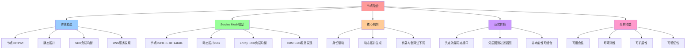

# 节点聚合：从"物理地址"到"身份-驱动拓扑"

## 📑 目录

- [节点聚合：从"物理地址"到"身份-驱动拓扑"](#节点聚合从物理地址到身份-驱动拓扑)
  - [📑 目录](#-目录)
  - [1 概述](#1-概述)
  - [2 传统模型 vs Service Mesh 模型](#2-传统模型-vs-service-mesh-模型)
    - [2.1 传统 TCP/HTTP 模型](#21-传统-tcphttp-模型)
    - [2.2 Service Mesh 模型](#22-service-mesh-模型)
  - [3 节点聚合的核心机制](#3-节点聚合的核心机制)
    - [3.1 身份驱动（Identity-Driven）](#31-身份驱动identity-driven)
    - [3.2 动态拓扑生成](#32-动态拓扑生成)
    - [3.3 负载均衡算法下沉](#33-负载均衡算法下沉)
  - [4 架构设计范式的转换](#4-架构设计范式的转换)
    - [4.1 "先定接口，再定部署" → "先定流量，再定接口"](#41-先定接口再定部署--先定流量再定接口)
    - [4.2 "分层图" → "过滤器图"](#42-分层图--过滤器图)
    - [4.3 非功能性从"后期治理"变为"设计期可组合元素"](#43-非功能性从后期治理变为设计期可组合元素)
  - [5 典型示例](#5-典型示例)
    - [5.1 VirtualService 配置](#51-virtualservice-配置)
    - [5.2 节点聚合效果](#52-节点聚合效果)
  - [6 形式化定义](#6-形式化定义)
    - [6.1 节点定义](#61-节点定义)
    - [6.2 拓扑定义](#62-拓扑定义)
    - [6.3 路由函数](#63-路由函数)
  - [7 架构收益](#7-架构收益)
    - [7.1 可组合性](#71-可组合性)
    - [7.2 可观测性](#72-可观测性)
    - [7.3 可扩展性](#73-可扩展性)
    - [7.4 可验证性](#74-可验证性)
  - [8 总结](#8-总结)
  - [9 认知增强：思维导图、知识矩阵与专家观点](#9-认知增强思维导图知识矩阵与专家观点)
    - [9.1 节点聚合完整思维导图](#91-节点聚合完整思维导图)
    - [9.2 知识多维关系矩阵](#92-知识多维关系矩阵)
      - [传统模型vs Service Mesh模型多维关系矩阵](#传统模型vs-service-mesh模型多维关系矩阵)
      - [节点聚合核心机制多维关系矩阵](#节点聚合核心机制多维关系矩阵)
    - [9.3 形象化解释论证](#93-形象化解释论证)
      - [节点聚合的形象化类比](#节点聚合的形象化类比)
        - [1. 节点聚合 = 电话簿升级](#1-节点聚合--电话簿升级)
        - [2. 身份驱动 = 身份证系统](#2-身份驱动--身份证系统)
        - [3. 动态拓扑生成 = 交通导航系统](#3-动态拓扑生成--交通导航系统)
        - [4. 负载均衡算法下沉 = 交通信号灯系统](#4-负载均衡算法下沉--交通信号灯系统)
        - [5. 范式转换 = 从实体店到电商平台](#5-范式转换--从实体店到电商平台)
    - [9.4 专家观点与论证](#94-专家观点与论证)
      - [计算信息软件科学家的观点](#计算信息软件科学家的观点)
        - [1. Leslie Lamport（分布式系统理论家）](#1-leslie-lamport分布式系统理论家)
        - [2. Barbara Liskov（Liskov替换原则）](#2-barbara-liskovliskov替换原则)
        - [3. Fred Brooks（《人月神话》作者）](#3-fred-brooks人月神话作者)
      - [计算信息软件教育家的观点](#计算信息软件教育家的观点)
        - [1. Robert C. Martin（《代码整洁之道》作者）](#1-robert-c-martin代码整洁之道作者)
        - [2. Martin Fowler（重构之父）](#2-martin-fowler重构之父)
      - [计算信息软件认知学家的观点](#计算信息软件认知学家的观点)
        - [1. Donald Norman（《设计心理学》作者）](#1-donald-norman设计心理学作者)
        - [2. Herbert A. Simon（认知科学家）](#2-herbert-a-simon认知科学家)
    - [9.5 认知学习路径矩阵](#95-认知学习路径矩阵)
    - [9.6 专家推荐阅读路径](#96-专家推荐阅读路径)

---

## 1 概述

Service Mesh 并不是简单的"流量代理堆"，它把**"网络节点"**从静态的 IP:Port 升级
为**"可编排、可观测、可策略编程的虚拟化网络实体"**，进而让**"组合网络服务"**第一
次成为架构设计的一等公民。

本文档阐述 Service Mesh 如何通过**节点聚合**实现从"物理地址"到"身份-驱动拓扑"的
范式转换。

## 2 传统模型 vs Service Mesh 模型

### 2.1 传统 TCP/HTTP 模型

| 特征         | 描述                            |
| ------------ | ------------------------------- |
| **节点定义** | 节点 = 物理 Pod IP              |
| **拓扑生成** | 拓扑由 kube-proxy/IPVS 静态生成 |
| **负载均衡** | 算法耦合在语言 SDK              |
| **服务发现** | 服务发现 = DNS/A 记录           |

### 2.2 Service Mesh 模型

| 特征         | 描述                                                                                     |
| ------------ | ---------------------------------------------------------------------------------------- |
| **节点定义** | 节点 = 附有 **identity**（mTLS SPIFFE ID）的 **sidecar 代理**                            |
| **拓扑生成** | 拓扑由 **控制面 xDS 动态下发**，可实时聚合、裁剪、影子复制                               |
| **负载均衡** | 算法下沉为 **Envoy 可插拔 filter**，与业务零耦合                                         |
| **服务发现** | 服务发现 = **Envoy CDS + EDS**，支持 **subset load balancing**（按版本、标签、权重聚合） |

## 3 节点聚合的核心机制

### 3.1 身份驱动（Identity-Driven）

**传统方式**：

```text
节点 = IP:Port
例如：192.168.1.100:8080
```

**Service Mesh 方式**：

```text
节点 = SPIFFE ID + Labels
例如：spiffe://trust/domain/ns/default/sa/web
      labels: {app=web, version=v1.2.3, canary=true}
```

### 3.2 动态拓扑生成

**传统方式**：

- 拓扑由 kube-proxy/IPVS **静态生成**
- 变更需要重启服务或重新配置

**Service Mesh 方式**：

- 拓扑由 **控制面 xDS 动态下发**
- 可实时聚合、裁剪、影子复制
- 支持**subset load balancing**（按版本、标签、权重聚合）

### 3.3 负载均衡算法下沉

**传统方式**：

- 负载均衡算法**耦合在语言 SDK**
- 每个服务需要实现自己的负载均衡逻辑

**Service Mesh 方式**：

- 算法下沉为 **Envoy 可插拔 filter**
- 与业务零耦合
- 支持多种算法：轮询、加权轮询、最少连接、一致性哈希等

## 4 架构设计范式的转换

### 4.1 "先定接口，再定部署" → "先定流量，再定接口"

**传统方式**：

1. 先定义 Java interface/proto file
2. 再部署服务
3. 最后配置网络

**Service Mesh 方式**：

1. **流量特征**（延迟、重试、超时、安全）先于 **Java interface/proto file** 被固
   定下来
2. 接口演进 = **VirtualService 版本化**，不再需要 **v1/v2 两套代码仓库**

### 4.2 "分层图" → "过滤器图"

**传统架构图**：

```text
Edge LB → API Gateway → Biz Service → Cache → DB
```

**Service Mesh 架构图**：

```text
Request → [JWT|RBAC|RateLimit|Circuit|Retry|Transform] → upstream
```

整条链路由 **CRD 描述**，可 **版本化、差异比对、自动化测试**。

### 4.3 非功能性从"后期治理"变为"设计期可组合元素"

**传统方式**：

- 安全、可观测、弹性在**后期治理**阶段添加
- 需要修改代码或配置

**Service Mesh 方式**：

- **安全**：mTLS 自动轮转，**架构图里把"锁"图标换成 Policy 对象**
- **可观测**：trace/metric 由 sidecar **自动注入 header**，架构师无需在时序图里
  画 Zipkin 箭头
- **弹性**：超时、重试、 Hedging、**SlowStart** 都是 **Envoy 参数**，可被 **SLO
  驱动地自动调优**

## 5 典型示例

### 5.1 VirtualService 配置

```yaml
apiVersion: networking.istio.io/v1beta1
kind: VirtualService
metadata:
  name: checkout
spec:
  http:
    - match:
        - headers:
            x-canary:
              exact: "1"
      route:
        - destination:
            host: checkout
            subset: v2
          weight: 100
    - route:
        - destination:
            host: checkout
            subset: v1
          weight: 90
        - destination:
            host: checkout
            subset: v2
          weight: 10
```

这段 YAML 同时完成 **"流量组合"** 与 **"版本组合"**；在架构设计阶段就可 **被验证
（flagger 自动金丝雀）、被测试（k6+prometheus）、被回溯（git-ops）**。

### 5.2 节点聚合效果

**架构师在图纸里只需画 **"Service A"**，Mesh 在运行期把它展开成 **"满足
label=version=v2, weight=20%, canary=true" 的节点子集**； ⇒**聚合逻辑成为声明式
配置\*\*，不再写死在代码或 Helm 模板里。

## 6 形式化定义

### 6.1 节点定义

```text
节点 N = ⟨identity, labels, endpoints⟩
其中：
- identity = SPIFFE ID
- labels = {key: value, ...}
- endpoints = {IP:Port, ...}
```

### 6.2 拓扑定义

```text
拓扑 T = (V, E)
其中：
- V = {N₁, N₂, ..., Nₙ} 节点集合
- E = {e₁, e₂, ..., eₘ} 边集合
- eᵢ = ⟨source, destination, weight, policy⟩
```

### 6.3 路由函数

```text
路由函数 R: N → V
其中 R(N) 返回满足 N.labels 的所有节点子集
```

## 7 架构收益

### 7.1 可组合性

- **聚合逻辑成为声明式配置**，不再写死在代码或 Helm 模板里
- 支持**动态聚合、裁剪、影子复制**

### 7.2 可观测性

- **trace/metric 自动注入**，无需修改代码
- 支持**统一监控面板**

### 7.3 可扩展性

- **算法下沉为可插拔 filter**，与业务零耦合
- 支持**多种负载均衡算法**

### 7.4 可验证性

- **CRD 可版本化、差异比对、自动化测试**
- 支持**GitOps 持续验证**

## 8 总结

Service Mesh 通过**节点聚合**实现了：

1. **从"物理地址"到"身份-驱动拓扑"**的范式转换
2. **动态拓扑生成**，支持实时聚合、裁剪、影子复制
3. **负载均衡算法下沉**，与业务零耦合
4. **架构设计范式重塑**，从"分层图"到"过滤器图"
5. **非功能性从"后期治理"变为"设计期可组合元素"**

---

---

## 9 认知增强：思维导图、知识矩阵与专家观点

### 9.1 节点聚合完整思维导图



### 9.2 知识多维关系矩阵

#### 传统模型vs Service Mesh模型多维关系矩阵

| 对比维度 | 传统TCP/HTTP模型 | Service Mesh模型 | 范式转换 | 技术演进 | 认知价值 |
|---------|----------------|-----------------|---------|---------|---------|
| **节点定义** | IP:Port（物理地址） | SPIFFE ID+Labels（身份驱动） | 从物理到逻辑 | 身份抽象 | 节点理解 |
| **拓扑生成** | kube-proxy/IPVS静态生成 | xDS动态下发 | 从静态到动态 | 动态拓扑 | 拓扑理解 |
| **负载均衡** | 算法耦合在语言SDK | Envoy可插拔filter | 从耦合到解耦 | 算法下沉 | 负载均衡理解 |
| **服务发现** | DNS/A记录 | CDS+EDS+subset | 从DNS到xDS | 服务发现演进 | 发现理解 |
| **架构范式** | 先定接口再定部署 | 先定流量再定接口 | 从接口驱动到流量驱动 | 范式转换 | 架构理解 |
| **非功能性** | 后期治理 | 设计期可组合元素 | 从后期到设计期 | 可组合性 | 治理理解 |
| **学习难度** | ⭐⭐ | ⭐⭐⭐⭐ | - | - | 渐进学习 |
| **专家推荐** | ⭐⭐⭐ | ⭐⭐⭐⭐⭐ | - | - | 技术深度 |

#### 节点聚合核心机制多维关系矩阵

| 机制维度 | 身份驱动 | 动态拓扑生成 | 负载均衡算法下沉 | 机制组合 | 认知价值 |
|---------|---------|------------|---------------|---------|---------|
| **核心概念** | SPIFFE ID+Labels | xDS动态下发 | Envoy Filter | 机制协同 | 概念理解 |
| **技术实现** | mTLS+SPIFFE | CDS+EDS | Envoy Filter Chain | Istio/Linkerd | 实现理解 |
| **架构收益** | 身份抽象 | 动态拓扑 | 算法解耦 | 可组合性 | 收益理解 |
| **适用场景** | 微服务架构 | 动态服务发现 | 多租户负载均衡 | Service Mesh | 场景理解 |
| **学习难度** | ⭐⭐⭐ | ⭐⭐⭐⭐ | ⭐⭐⭐ | ⭐⭐⭐⭐ | 渐进学习 |
| **专家推荐** | ⭐⭐⭐⭐⭐ | ⭐⭐⭐⭐⭐ | ⭐⭐⭐⭐⭐ | ⭐⭐⭐⭐⭐ | 技术深度 |

### 9.3 形象化解释论证

#### 节点聚合的形象化类比

##### 1. 节点聚合 = 电话簿升级

> **类比**：节点聚合就像电话簿升级，传统模型像纸质电话簿（IP:Port=电话号码，静态不变），Service Mesh模型像智能电话簿（SPIFFE ID=身份，动态更新，支持标签筛选），可以按标签（版本、环境）动态聚合节点，就像电话簿可以按地区、行业筛选联系人一样。

**认知价值**：

- **节点理解**：通过电话簿类比，理解节点从物理地址到身份驱动的转换
- **动态理解**：通过智能电话簿类比，理解动态拓扑生成的意义
- **聚合理解**：通过标签筛选类比，理解节点聚合的机制

##### 2. 身份驱动 = 身份证系统

> **类比**：身份驱动就像身份证系统，传统模型像用IP地址识别（像用门牌号找人），Service Mesh模型像用SPIFFE ID识别（像用身份证号找人），身份信息包含标签（版本、环境），就像身份证包含姓名、地址、照片等信息一样。

**认知价值**：

- **身份理解**：通过身份证系统类比，理解身份驱动的含义
- **标签理解**：通过身份证信息类比，理解标签的作用（版本、环境）
- **识别理解**：通过身份证识别类比，理解身份驱动的识别机制

##### 3. 动态拓扑生成 = 交通导航系统

> **类比**：动态拓扑生成就像交通导航系统，传统模型像静态地图（拓扑由kube-proxy静态生成），Service Mesh模型像实时导航（拓扑由xDS动态下发），可以实时聚合、裁剪、影子复制，就像导航系统可以实时更新路况、规划路线一样。

**认知价值**：

- **动态理解**：通过交通导航系统类比，理解动态拓扑生成的意义
- **实时理解**：通过实时导航类比，理解实时聚合、裁剪、影子复制
- **更新理解**：通过路况更新类比，理解拓扑动态更新的机制

##### 4. 负载均衡算法下沉 = 交通信号灯系统

> **类比**：负载均衡算法下沉就像交通信号灯系统，传统模型像每个路口自己控制（算法耦合在语言SDK），Service Mesh模型像统一交通信号灯系统（算法下沉为Envoy Filter），与业务零耦合，就像交通信号灯系统统一管理所有路口一样。

**认知价值**：

- **下沉理解**：通过交通信号灯系统类比，理解负载均衡算法下沉的意义
- **解耦理解**：通过统一管理类比，理解算法与业务解耦的好处
- **统一理解**：通过统一系统类比，理解算法下沉的统一管理优势

##### 5. 范式转换 = 从实体店到电商平台

> **类比**：范式转换就像从实体店到电商平台，传统模型像实体店（先定接口再定部署，像先建店再卖货），Service Mesh模型像电商平台（先定流量再定接口，像先有流量再定商品），非功能性从后期治理变为设计期可组合元素，就像电商平台从后期营销变为设计期可组合的营销工具一样。

**认知价值**：

- **范式理解**：通过实体店到电商平台类比，理解范式转换的含义
- **流量理解**：通过电商平台流量类比，理解"先定流量再定接口"的意义
- **组合理解**：通过营销工具类比，理解非功能性可组合的意义

### 9.4 专家观点与论证

#### 计算信息软件科学家的观点

##### 1. Leslie Lamport（分布式系统理论家）

> **观点**："A distributed system is one in which the failure of a computer you didn't even know existed can render your own computer unusable."（分布式系统是指一个你不知道存在的计算机的故障可能导致你自己的计算机无法使用的系统）

**与节点聚合的关联**：

- **分布式理解**：节点聚合体现了分布式系统的特性（节点身份驱动、动态拓扑生成）
- **故障理解**：通过节点聚合理解分布式系统的故障处理（动态拓扑生成支持故障恢复）
- **系统理解**：通过节点聚合理解分布式系统的复杂性（身份驱动、动态拓扑）

##### 2. Barbara Liskov（Liskov替换原则）

> **观点**："What is wanted is something like the following substitution property: If for each object o1 of type S there is an object o2 of type T such that for all programs P defined in terms of T, the behavior of P is unchanged when o1 is substituted for o2 then S is a subtype of T."（需要的是类似以下替换属性：如果对于类型S的每个对象o1，存在类型T的对象o2，使得对于所有用T定义的程序P，当o1替换o2时，P的行为不变，则S是T的子类型）

**与节点聚合的关联**：

- **替换理解**：节点聚合体现了替换原则（传统模型节点可以替换为Service Mesh模型节点）
- **行为理解**：通过节点聚合理解节点替换时行为保持不变（可计算性、资源封闭、网络异步）
- **子类型理解**：通过节点聚合理解节点类型的子类型关系（Service Mesh节点是传统节点的子类型）

##### 3. Fred Brooks（《人月神话》作者）

> **观点**："The hardest single part of building a software system is deciding precisely what to build."（构建软件系统最困难的部分是精确决定构建什么）

**与节点聚合的关联**：

- **决策理解**：节点聚合帮助决策（先定流量再定接口，而不是先定接口再定部署）
- **设计理解**：通过节点聚合理解架构设计决策（范式转换、非功能性可组合）
- **构建理解**：通过节点聚合理解软件系统构建的决策过程

#### 计算信息软件教育家的观点

##### 1. Robert C. Martin（《代码整洁之道》作者）

> **观点**："The only way to go fast is to go well."（快速前进的唯一方法是做好）

**与节点聚合的关联**：

- **质量理解**：节点聚合体现了架构质量（可组合性、可观测性、可扩展性、可验证性）
- **速度理解**：通过节点聚合理解速度与质量的权衡（动态拓扑生成vs静态拓扑）
- **实践理解**：通过节点聚合指导实践，选择"做好"的架构

##### 2. Martin Fowler（重构之父）

> **观点**："Any fool can write code that a computer can understand. Good programmers write code that humans can understand."（任何傻瓜都能编写计算机能理解的代码。好的程序员编写人类能理解的代码）

**与节点聚合的关联**：

- **可理解性理解**：节点聚合通过身份驱动、动态拓扑生成提高可理解性
- **人类理解**：通过节点聚合理解架构的人类可理解性（SPIFFE ID、xDS、Envoy Filter）
- **选择理解**：通过节点聚合选择"人类能理解"的架构

#### 计算信息软件认知学家的观点

##### 1. Donald Norman（《设计心理学》作者）

> **观点**："The real problem with the interface is that it is an interface. Interfaces get in the way. I don't want to focus my energies on an interface. I want to focus on the job."（界面的真正问题是它是界面。界面会妨碍。我不想把精力集中在界面上。我想专注于工作）

**与节点聚合的关联**：

- **接口理解**：节点聚合体现了接口的重要性（先定流量再定接口），但也要避免过度关注接口
- **工作理解**：通过节点聚合专注于架构工作（节点聚合、动态拓扑），而不是过度关注接口细节
- **平衡理解**：通过节点聚合理解接口与工作的平衡

##### 2. Herbert A. Simon（认知科学家）

> **观点**："A wealth of information creates a poverty of attention."（信息丰富导致注意力贫乏）

**与节点聚合的关联**：

- **注意力理解**：节点聚合通过身份驱动、动态拓扑生成管理注意力，避免信息过载
- **结构化理解**：通过节点聚合结构化信息（SPIFFE ID、Labels），减少认知负荷
- **管理理解**：通过节点聚合管理信息，避免注意力贫乏

### 9.5 认知学习路径矩阵

| 学习阶段 | 推荐内容 | 推荐机制 | 学习重点 | 学习时间 | 前置要求 | 后续进阶 |
|---------|---------|---------|---------|---------|---------|---------|
| **新手阶段** | 概述、传统模型vs Service Mesh模型 | 身份驱动 | 节点定义理解、范式转换理解 | 1-2周 | 无 | 进阶阶段 |
| **进阶阶段** | 核心机制、范式转换 | 动态拓扑生成、负载均衡算法下沉 | 机制理解、范式转换理解 | 4-8周 | 新手阶段 | 专家阶段 |
| **专家阶段** | 形式化定义、架构收益 | 完整机制组合 | 形式化理解、收益理解 | 16+周 | 进阶阶段 | - |

### 9.6 专家推荐阅读路径

**路径1：节点聚合理解路径**：

1. **第一步**：阅读概述（第1节），理解节点聚合概览
2. **第二步**：阅读传统模型vs Service Mesh模型（第2节），理解范式转换
3. **第三步**：阅读核心机制（第3节），理解身份驱动、动态拓扑生成、负载均衡算法下沉
4. **第四步**：阅读总结（第8节），回顾关键要点

**路径2：范式转换理解路径**：

1. **第一步**：阅读传统模型vs Service Mesh模型（第2节），理解传统模型
2. **第二步**：阅读架构设计范式转换（第4节），理解范式转换
3. **第三步**：阅读典型示例（第5节），理解实践应用
4. **第四步**：阅读架构收益（第7节），理解范式转换的收益

**路径3：实践应用路径**：

1. **第一步**：阅读概述（第1节），了解节点聚合
2. **第二步**：阅读典型示例（第5节），学习实践方法
3. **第三步**：阅读形式化定义（第6节），理解理论基础
4. **第四步**：阅读架构收益（第7节），学习最佳实践

---

**更新时间**：2025-11-15 **版本**：v1.1 **参考**：`architecture_view.md` 第888-1013行，节点聚合部分

**更新内容（v1.1）**：

- ✅ 添加认知增强章节（思维导图、知识矩阵、形象化解释、专家观点）
- ✅ 添加认知学习路径矩阵
- ✅ 添加专家推荐阅读路径（3条路径）
