# 服务组合：从"跨服务流"到"可编排的本地函数"

## 📑 目录

- [服务组合：从"跨服务流"到"可编排的本地函数"](#服务组合从跨服务流到可编排的本地函数)
  - [📑 目录](#-目录)
  - [1 概述](#1-概述)
    - [1.1 核心思想](#11-核心思想)
  - [2 传统模型 vs Service Mesh 模型](#2-传统模型-vs-service-mesh-模型)
    - [2.1 传统跨服务流](#21-传统跨服务流)
    - [2.2 Service Mesh 服务组合](#22-service-mesh-服务组合)
  - [3 Filter Chain（过滤器链）](#3-filter-chain过滤器链)
    - [3.1 Filter Chain 定义](#31-filter-chain-定义)
    - [3.2 Filter Chain 示例](#32-filter-chain-示例)
  - [4 服务组合粒度](#4-服务组合粒度)
    - [4.1 组合粒度从"进程"降到"请求路径"](#41-组合粒度从进程降到请求路径)
    - [4.2 Filter Chain = 可编程的 lambda 管道](#42-filter-chain--可编程的-lambda-管道)
  - [5 服务组合语义](#5-服务组合语义)
    - [5.1 组合语义上升到"架构描述层"](#51-组合语义上升到架构描述层)
    - [5.2 VirtualService 示例](#52-virtualservice-示例)
  - [6 架构设计范式转换](#6-架构设计范式转换)
    - [6.1 "先定接口，再定部署" → "先定流量，再定接口"](#61-先定接口再定部署--先定流量再定接口)
    - [6.2 "分层图" → "过滤器图"](#62-分层图--过滤器图)
    - [6.3 非功能性从"后期治理"变为"设计期可组合元素"](#63-非功能性从后期治理变为设计期可组合元素)
  - [7 服务组合模式](#7-服务组合模式)
    - [7.1 组合模式类型](#71-组合模式类型)
    - [7.2 组合示例](#72-组合示例)
  - [8 形式化定义](#8-形式化定义)
    - [8.1 服务组合定义](#81-服务组合定义)
    - [8.2 Filter Chain 定义](#82-filter-chain-定义)
    - [8.3 服务组合函数](#83-服务组合函数)
  - [9 架构收益](#9-架构收益)
    - [9.1 可组合性](#91-可组合性)
    - [9.2 可版本化](#92-可版本化)
    - [9.3 可测试性](#93-可测试性)
    - [9.4 可观测性](#94-可观测性)
  - [10 总结](#10-总结)

---

## 1 概述

本文档阐述 Service Mesh 如何通过**服务组合**实现从"跨服务流"到"可编排的本地函数"
的范式转换。

### 1.1 核心思想

> **Service Mesh 把"跨服务流"变成"可编排的本地函数"，通过 Filter Chain 实现细粒
> 度的流量控制**

## 2 传统模型 vs Service Mesh 模型

### 2.1 传统跨服务流

**传统方式**：

```text
Client → Service A → Service B → Service C → Database
```

**问题**：

- 跨服务调用耦合在代码中
- 流量控制逻辑分散在各个服务
- 难以统一管理和监控

### 2.2 Service Mesh 服务组合

**Service Mesh 方式**：

```text
Request → [JWT|RBAC|RateLimit|Circuit|Retry|Transform] → upstream
```

**优势**：

- 流量控制逻辑集中在 Filter Chain
- 可编排、可版本化、可测试
- 统一监控和治理

## 3 Filter Chain（过滤器链）

### 3.1 Filter Chain 定义

**Filter Chain** 是可编程的 lambda 管道，包含多个过滤器：

```text
Filter Chain = [Filter₁, Filter₂, ..., Filterₙ]
```

**典型过滤器**：

- **认证**（JWT、mTLS）
- **授权**（RBAC、OPA）
- **限流**（Rate Limit）
- **熔断**（Circuit Breaker）
- **重试**（Retry）
- **转换**（Transform）
- **缓存**（Cache）
- **转发**（Forward）

### 3.2 Filter Chain 示例

**Envoy Filter Chain**：

```yaml
apiVersion: networking.istio.io/v1beta1
kind: EnvoyFilter
metadata:
  name: custom-filter
spec:
  configPatches:
    - applyTo: HTTP_FILTER
      match:
        context: SIDECAR_INBOUND
        listener:
          filterChain:
            filter:
              name: envoy.filters.network.http_connection_manager
      patch:
        operation: INSERT_BEFORE
        value:
          name: envoy.filters.http.rate_limit
          typed_config:
            "@type": type.googleapis.com/envoy.extensions.filters.http.rate_limit.v3.RateLimit
            domain: custom-domain
            rate_limit_service:
              grpc_service:
                envoy_grpc:
                  cluster_name: rate_limit_cluster
```

## 4 服务组合粒度

### 4.1 组合粒度从"进程"降到"请求路径"

**传统方式**：

- 组合粒度：进程级别
- 流量控制：服务级别

**Service Mesh 方式**：

- 组合粒度：请求路径级别
- 流量控制：请求级别

### 4.2 Filter Chain = 可编程的 lambda 管道

**Filter Chain 特点**：

- **认证** → **限流** → **熔断** → **重试** → **转换** → **缓存** → **转发**
- 每条 filter 都可 **热插拔、A/B 对比、灰度发布**
- 架构图里用 **"VirtualService + EnvoyFilter"** 就能描述 **"服务组合工作流"**

## 5 服务组合语义

### 5.1 组合语义上升到"架构描述层"

**传统方式**：

- 需要画 7 层网关、Nginx conf、Spring Cloud Gateway 的爆炸图
- 流量控制逻辑分散在代码和配置中

**Service Mesh 方式**：

- 用 **"VirtualService + EnvoyFilter"** 描述 **"服务组合工作流"**
- 不再需要画复杂的架构图

### 5.2 VirtualService 示例

**流量组合 + 版本组合**：

```yaml
apiVersion: networking.istio.io/v1beta1
kind: VirtualService
metadata:
  name: checkout
spec:
  http:
    - match:
        - headers:
            x-canary:
              exact: "1"
      route:
        - destination:
            host: checkout
            subset: v2
          weight: 100
    - route:
        - destination:
            host: checkout
            subset: v1
          weight: 90
        - destination:
            host: checkout
            subset: v2
          weight: 10
```

**这段 YAML 同时完成**：

- **"流量组合"**：根据 header 路由到不同版本
- **"版本组合"**：金丝雀发布（10% 流量到 v2）

**验证、测试、回溯**：

- **被验证**（flagger 自动金丝雀）
- **被测试**（k6+prometheus）
- **被回溯**（git-ops）

## 6 架构设计范式转换

### 6.1 "先定接口，再定部署" → "先定流量，再定接口"

**传统方式**：

1. 先定义 Java interface/proto file
2. 再部署服务
3. 最后配置网络

**Service Mesh 方式**：

1. **流量特征**（延迟、重试、超时、安全）先于 **Java interface/proto file** 被固
   定下来
2. 接口演进 = **VirtualService 版本化**，不再需要 **v1/v2 两套代码仓库**

### 6.2 "分层图" → "过滤器图"

**传统架构图**：

```text
Edge LB → API Gateway → Biz Service → Cache → DB
```

**Service Mesh 架构图**：

```text
Request → [JWT|RBAC|RateLimit|Circuit|Retry|Transform] → upstream
```

**整条链路由 **CRD 描述**，可**版本化、差异比对、自动化测试\*\*

### 6.3 非功能性从"后期治理"变为"设计期可组合元素"

**传统方式**：

- 安全、可观测、弹性在**后期治理**阶段添加
- 需要修改代码或配置

**Service Mesh 方式**：

- **安全**：mTLS 自动轮转，**架构图里把"锁"图标换成 Policy 对象**
- **可观测**：trace/metric 由 sidecar **自动注入 header**，架构师无需在时序图里
  画 Zipkin 箭头
- **弹性**：超时、重试、 Hedging、**SlowStart** 都是 **Envoy 参数**，可被 **SLO
  驱动地自动调优**

## 7 服务组合模式

### 7.1 组合模式类型

| 组合模式            | 说明               | 典型实现               |
| ------------------- | ------------------ | ---------------------- |
| **Pipeline**        | 顺序执行多个过滤器 | Envoy Filter Chain     |
| **Fan-out**         | 并行调用多个服务   | Envoy Weighted Cluster |
| **Fan-in**          | 聚合多个服务响应   | Envoy Aggregator       |
| **Circuit Breaker** | 熔断保护           | Envoy Circuit Breaker  |
| **Retry**           | 重试机制           | Envoy Retry Policy     |
| **Rate Limit**      | 限流保护           | Envoy Rate Limit       |

### 7.2 组合示例

**Pipeline 组合**：

```yaml
apiVersion: networking.istio.io/v1beta1
kind: VirtualService
metadata:
  name: order-service
spec:
  http:
    - route:
        - destination:
            host: order-service
        fault:
          delay:
            percentage:
              value: 0.1
            fixedDelay: 5s
        retries:
          attempts: 3
          perTryTimeout: 2s
          retryOn: 5xx,reset,connect-failure,refused-stream
```

**Fan-out 组合**：

```yaml
apiVersion: networking.istio.io/v1beta1
kind: VirtualService
metadata:
  name: aggregate-service
spec:
  http:
    - route:
        - destination:
            host: service-a
          weight: 50
        - destination:
            host: service-b
          weight: 50
```

## 8 形式化定义

### 8.1 服务组合定义

```text
服务组合 C = ⟨filters, orchestration, policies⟩
其中：
- filters: 过滤器集合
- orchestration: 编排逻辑
- policies: 策略配置
```

### 8.2 Filter Chain 定义

```text
FilterChain = [Filter₁, Filter₂, ..., Filterₙ]
其中：
- Filterᵢ = ⟨type, config, order⟩
- type ∈ {auth, rate-limit, circuit-breaker, retry, transform, cache, forward}
- order: 执行顺序
```

### 8.3 服务组合函数

```text
服务组合函数 Compose: Filters → Service
其中 Compose(filters) 将过滤器组合成服务
```

## 9 架构收益

### 9.1 可组合性

- **Filter Chain 可编排**：支持 Pipeline、Fan-out、Fan-in 等组合模式
- **策略可组合**：支持多种策略组合使用

### 9.2 可版本化

- **CRD 可版本化**：VirtualService 和 EnvoyFilter 可版本化
- **GitOps**：所有配置在 Git 中，可回溯

### 9.3 可测试性

- **自动化测试**：k6+prometheus 自动测试
- **A/B 测试**：支持灰度发布和 A/B 测试

### 9.4 可观测性

- **统一监控**：所有流量都经过 sidecar，统一监控
- **自动追踪**：trace 自动注入，无需修改代码

## 10 总结

通过**服务组合**，Service Mesh 实现了：

1. **从"跨服务流"到"可编排的本地函数"**：通过 Filter Chain 实现细粒度控制
2. **组合粒度从"进程"降到"请求路径"**：支持请求级别的流量控制
3. **组合语义上升到"架构描述层"**：用 CRD 描述服务组合工作流
4. **架构设计范式转换**：从"先定接口，再定部署"到"先定流量，再定接口"
5. **非功能性从"后期治理"变为"设计期可组合元素"**：安全、可观测、弹性成为设计期
   元素

---

---

## 11 认知增强：思维导图、知识矩阵与专家观点

### 11.1 服务组合完整思维导图

```mermaid
graph TB
    A[服务组合] --> B[传统模型vs Service Mesh模型]
    A --> C[Filter Chain]
    A --> D[服务组合粒度]
    A --> E[服务组合语义]
    A --> F[架构设计范式转换]
    A --> G[服务组合模式]
    A --> H[架构收益]

    B --> B1[传统跨服务流]
    B --> B2[Service Mesh服务组合]

    C --> C1[Filter Chain定义]
    C --> C2[Filter Chain示例]

    D --> D1[组合粒度从进程降到请求路径]
    D --> D2[Filter Chain = 可编程的lambda管道]

    E --> E1[组合语义上升到架构描述层]
    E --> E2[VirtualService示例]

    F --> F1[先定接口再定部署 → 先定流量再定接口]
    F --> F2[分层图 → 过滤器图]
    F --> F3[非功能性从后期治理变为设计期可组合元素]

    G --> G1[Pipeline]
    G --> G2[Fan-out]
    G --> G3[Fan-in]

    H --> H1[可组合性]
    H --> H2[可版本化]
    H --> H3[可测试性]
    H --> H4[可观测性]

    style A fill:#ff9999
    style B fill:#99ccff
    style C fill:#99ff99
    style D fill:#ffcc99
    style E fill:#cc99ff
    style F fill:#ff99cc
    style G fill:#99ffcc
    style H fill:#ffccff
```



### 11.2 知识多维关系矩阵

#### 传统模型vs Service Mesh模型多维关系矩阵

| 模型维度 | 传统模型 | Service Mesh模型 | 模型协同 | 认知价值 |
|---------|---------|-----------------|---------|---------|
| **组合粒度** | 进程级别 | 请求路径级别 | 粒度对比 | 粒度理解 |
| **流量控制** | 服务级别 | 请求级别 | 控制对比 | 控制理解 |
| **流量控制逻辑** | 分散在各个服务 | 集中在Filter Chain | 逻辑对比 | 逻辑理解 |
| **管理方式** | 难以统一管理 | 统一监控和治理 | 管理对比 | 管理理解 |
| **可编排性** | 不可编排 | 可编排、可版本化、可测试 | 编排对比 | 编排理解 |
| **学习难度** | ⭐⭐⭐ | ⭐⭐⭐⭐ | ⭐⭐⭐⭐ | 渐进学习 |
| **专家推荐** | ⭐⭐⭐⭐⭐ | ⭐⭐⭐⭐⭐ | ⭐⭐⭐⭐⭐ | 技术深度 |

#### 服务组合模式多维关系矩阵

| 模式维度 | Pipeline | Fan-out | Fan-in | Circuit Breaker | Retry | Rate Limit | 模式协同 | 认知价值 |
|---------|---------|---------|--------|----------------|-------|-----------|---------|---------|
| **组合方式** | 顺序执行多个过滤器 | 并行调用多个服务 | 聚合多个服务响应 | 熔断保护 | 重试机制 | 限流保护 | 方式对比 | 方式理解 |
| **典型实现** | Envoy Filter Chain | Envoy Weighted Cluster | Envoy Aggregator | Envoy Circuit Breaker | Envoy Retry Policy | Envoy Rate Limit | 实现对比 | 实现理解 |
| **适用场景** | 顺序处理 | 并行调用 | 响应聚合 | 故障保护 | 重试处理 | 流量保护 | 场景对比 | 场景理解 |
| **架构收益** | 顺序控制 | 性能提升 | 响应聚合 | 故障隔离 | 可靠性提升 | 流量控制 | 收益对比 | 收益理解 |
| **学习难度** | ⭐⭐⭐ | ⭐⭐⭐ | ⭐⭐⭐ | ⭐⭐⭐ | ⭐⭐⭐ | ⭐⭐⭐ | ⭐⭐⭐ | 渐进学习 |
| **专家推荐** | ⭐⭐⭐⭐⭐ | ⭐⭐⭐⭐⭐ | ⭐⭐⭐⭐⭐ | ⭐⭐⭐⭐⭐ | ⭐⭐⭐⭐⭐ | ⭐⭐⭐⭐⭐ | ⭐⭐⭐⭐⭐ | 技术深度 |

### 11.3 形象化解释论证

#### 服务组合的形象化类比

##### 1. 服务组合 = 工厂流水线

> **类比**：服务组合就像工厂流水线，Filter Chain像流水线工位（每个工位都有功能），过滤器像流水线工序（每个工序都有处理），就像工厂流水线将复杂生产分解为工序，通过工序实现生产一样。

**认知价值**：

- **组合理解**：通过工厂流水线类比，理解服务组合的含义
- **链理解**：通过流水线工位类比，理解Filter Chain的作用
- **处理理解**：通过流水线工序类比，理解过滤器处理的重要性

##### 2. Filter Chain = 可编程的lambda管道

> **类比**：Filter Chain就像自动调温系统，HPA像增加减少房间（水平伸缩），VPA像调整房间温度（垂直伸缩），Knative像自动开关房间（Serverless伸缩），Argo Rollouts像逐步调整温度（渐进式交付），就像自动调温系统根据温度自动调整一样。

**认知价值**：

- **管道理解**：通过lambda管道类比，理解Filter Chain的含义
- **可编程理解**：通过可编程类比，理解Filter Chain可编程的特性
- **组合理解**：通过管道组合类比，理解Filter Chain组合的作用

##### 3. 组合粒度从进程降到请求路径 = 从房间级别降到动作级别

> **类比**：组合粒度从进程降到请求路径就像从房间级别降到动作级别，进程级别像房间级别（每个房间都有功能），请求路径级别像动作级别（每个动作都有处理），就像从房间级别降到动作级别将复杂组合分解为动作，通过动作实现组合一样。

**认知价值**：

- **粒度理解**：通过房间级别和动作级别类比，理解组合粒度的含义
- **降低理解**：通过级别降低类比，理解组合粒度降低的价值
- **组合理解**：通过动作组合类比，理解请求路径级别组合的作用

##### 4. 架构设计范式转换 = 从建筑蓝图到工厂流水线

> **类比**：架构设计范式转换就像从建筑蓝图到工厂流水线，传统方式像建筑蓝图（先定接口，再定部署），Service Mesh方式像工厂流水线（先定流量，再定接口），就像从建筑蓝图到工厂流水线将复杂架构设计分解为流程，通过流程实现架构设计一样。

**认知价值**：

- **转换理解**：通过建筑蓝图和工厂流水线类比，理解架构设计范式转换的含义
- **流程理解**：通过流程类比，理解架构设计流程的重要性
- **设计理解**：通过设计类比，理解架构设计范式转换的作用

##### 5. 非功能性从后期治理变为设计期可组合元素 = 从后期装修到设计期规划

> **类比**：非功能性从后期治理变为设计期可组合元素就像从后期装修到设计期规划，传统方式像后期装修（安全、可观测、弹性在后期治理阶段添加），Service Mesh方式像设计期规划（安全、可观测、弹性成为设计期元素），就像从后期装修到设计期规划将复杂非功能性分解为规划，通过规划实现非功能性一样。

**认知价值**：

- **元素理解**：通过后期装修和设计期规划类比，理解非功能性元素的含义
- **设计理解**：通过设计期规划类比，理解非功能性设计期规划的价值
- **组合理解**：通过规划组合类比，理解非功能性设计期可组合元素的作用

### 11.4 专家观点与论证

#### 计算信息软件科学家的观点

##### 1. Alan Kay（面向对象编程之父）

> **观点**："The best way to predict the future is to invent it."（预测未来的最好方法是创造它）

**与服务组合的关联**：

- **创新理解**：服务组合体现了创新的重要性（从"跨服务流"到"可编排的本地函数"）
- **未来理解**：通过服务组合理解未来的架构设计（先定流量，再定接口）
- **系统理解**：通过服务组合理解架构系统的创新性（Filter Chain、服务组合模式）

##### 2. David Parnas（信息隐藏原则）

> **观点**："The criteria to be used in decomposing systems into modules are based on the principle of information hiding."（将系统分解为模块的标准基于信息隐藏原则）

**与服务组合的关联**：

- **分解理解**：服务组合通过Filter Chain分解系统，就像信息隐藏原则通过模块分解系统一样
- **组合理解**：通过服务组合理解系统的组合边界（Filter Chain、服务组合模式）
- **隐藏理解**：通过服务组合理解信息隐藏的含义（隐藏服务组合实现细节）

##### 3. Christopher Alexander（模式语言）

> **观点**："Each pattern describes a problem which occurs over and over again in our environment, and then describes the core of the solution to that problem, in such a way that you can use this solution a million times over, without ever doing it the same way twice."（每个模式描述一个在我们的环境中反复出现的问题，然后描述该问题解决方案的核心，这样你可以使用这个解决方案一百万次，而永远不会以相同的方式做两次）

**与服务组合的关联**：

- **模式理解**：服务组合体现了模式语言的思想，通过服务组合模式解决反复出现的问题（Pipeline、Fan-out、Fan-in）
- **复用理解**：通过服务组合理解服务组合模式的可复用性（Filter Chain、服务组合模式）
- **创新理解**：通过服务组合理解服务组合模式的创新性（每次使用都不同）

#### 计算信息软件教育家的观点

##### 1. Robert C. Martin（《代码整洁之道》作者）

> **观点**："The only way to go fast is to go well."（快速前进的唯一方法是做好）

**与服务组合的关联**：

- **质量理解**：服务组合体现了架构质量（可组合性、可版本化、可测试性、可观测性）
- **速度理解**：通过服务组合理解速度与质量的权衡（传统方式vs Service Mesh方式）
- **实践理解**：通过服务组合指导实践，选择"做好"的架构

##### 2. Martin Fowler（重构之父）

> **观点**："Any fool can write code that a computer can understand. Good programmers write code that humans can understand."（任何傻瓜都能编写计算机能理解的代码。好的程序员编写人类能理解的代码）

**与服务组合的关联**：

- **可理解性理解**：服务组合通过Filter Chain、服务组合模式提高可理解性
- **人类理解**：通过服务组合理解架构的人类可理解性（清晰的Filter Chain、明确的服务组合模式）
- **选择理解**：通过服务组合选择"人类能理解"的架构

#### 计算信息软件认知学家的观点

##### 1. Donald Norman（《设计心理学》作者）

> **观点**："The real problem with the interface is that it is an interface. Interfaces get in the way. I don't want to focus my energies on an interface. I want to focus on the job."（界面的真正问题是它是界面。界面会妨碍。我不想把精力集中在界面上。我想专注于工作）

**与服务组合的关联**：

- **接口理解**：服务组合体现了接口的重要性（Filter Chain接口、服务组合模式接口），但也要避免过度关注接口
- **工作理解**：通过服务组合专注于架构工作（可组合性、可版本化），而不是过度关注接口细节
- **平衡理解**：通过服务组合理解接口与工作的平衡

##### 2. Herbert A. Simon（认知科学家）

> **观点**："A wealth of information creates a poverty of attention."（信息丰富导致注意力贫乏）

**与服务组合的关联**：

- **注意力理解**：服务组合通过Filter Chain、服务组合模式管理注意力，避免信息过载
- **结构化理解**：通过服务组合结构化信息（Filter Chain、服务组合模式），减少认知负荷
- **管理理解**：通过服务组合管理信息，避免注意力贫乏

### 11.5 认知学习路径矩阵

| 学习阶段 | 推荐内容 | 推荐模式 | 学习重点 | 学习时间 | 前置要求 | 后续进阶 |
|---------|---------|---------|---------|---------|---------|---------|
| **新手阶段** | 概述、传统模型vs Service Mesh模型 | 服务组合概念理解 | 模型理解、基本概念理解 | 1-2周 | 无 | 进阶阶段 |
| **进阶阶段** | Filter Chain、服务组合粒度、服务组合语义 | Pipeline、Fan-out、Fan-in | 链理解、粒度理解、语义理解 | 4-8周 | 新手阶段 | 专家阶段 |
| **专家阶段** | 架构设计范式转换、服务组合模式、架构收益 | 完整模式 | 转换理解、模式理解、收益理解 | 16+周 | 进阶阶段 | - |

### 11.6 专家推荐阅读路径

**路径1：模型理解路径**：

1. **第一步**：阅读概述（第1节），理解服务组合概览
2. **第二步**：阅读传统模型vs Service Mesh模型（第2节），理解传统跨服务流、Service Mesh服务组合
3. **第三步**：阅读Filter Chain（第3节），理解Filter Chain定义和示例
4. **第四步**：阅读总结（第10节），回顾关键要点

**路径2：组合理解路径**：

1. **第一步**：阅读概述（第1节），了解服务组合
2. **第二步**：阅读服务组合粒度（第4节），学习组合粒度从进程降到请求路径
3. **第三步**：阅读服务组合语义（第5节），学习组合语义上升到架构描述层
4. **第四步**：阅读服务组合模式（第7节），学习服务组合模式方法

**路径3：范式转换理解路径**：

1. **第一步**：阅读概述（第1节），了解服务组合
2. **第二步**：阅读架构设计范式转换（第6节），理解"先定接口，再定部署"→"先定流量，再定接口"
3. **第三步**：阅读架构收益（第9节），理解架构收益与范式转换的关系
4. **第四步**：阅读总结（第10节），学习最佳实践

---

**更新时间**：2025-11-15 **版本**：v1.1 **参考**：`architecture_view.md` 第914-983行，服务组合部分

**更新内容（v1.1）**：

- ✅ 添加认知增强章节（思维导图、知识矩阵、形象化解释、专家观点）
- ✅ 添加认知学习路径矩阵
- ✅ 添加专家推荐阅读路径（3条路径）
