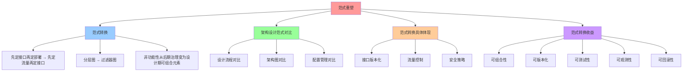

# 范式重塑：架构设计范式的反向重塑

## 📑 目录

- [范式重塑：架构设计范式的反向重塑](#范式重塑架构设计范式的反向重塑)
  - [📑 目录](#-目录)
  - [1 概述](#1-概述)
    - [1.1 核心思想](#11-核心思想)
  - [2 范式转换](#2-范式转换)
    - [2.1 "先定接口，再定部署" → "先定流量，再定接口"](#21-先定接口再定部署--先定流量再定接口)
    - [2.2 "分层图" → "过滤器图"](#22-分层图--过滤器图)
    - [2.3 非功能性从"后期治理"变为"设计期可组合元素"](#23-非功能性从后期治理变为设计期可组合元素)
  - [3 架构设计范式对比](#3-架构设计范式对比)
    - [3.1 设计流程对比](#31-设计流程对比)
    - [3.2 架构图对比](#32-架构图对比)
    - [3.3 配置管理对比](#33-配置管理对比)
  - [4 架构设计范式转换的具体体现](#4-架构设计范式转换的具体体现)
    - [4.1 接口版本化](#41-接口版本化)
    - [4.2 流量控制](#42-流量控制)
    - [4.3 安全策略](#43-安全策略)
  - [5 架构设计范式转换的收益](#5-架构设计范式转换的收益)
    - [5.1 可组合性](#51-可组合性)
    - [5.2 可版本化](#52-可版本化)
    - [5.3 可测试性](#53-可测试性)
    - [5.4 可观测性](#54-可观测性)
    - [5.5 可回滚性](#55-可回滚性)
  - [6 形式化定义](#6-形式化定义)
    - [6.1 范式转换定义](#61-范式转换定义)
    - [6.2 架构图转换](#62-架构图转换)
    - [6.3 设计流程转换](#63-设计流程转换)
  - [7 总结](#7-总结)

---

## 1 概述

本文档阐述 Service Mesh 如何**反向重塑架构设计范式**，从传统的"分层图"到现代的"
过滤器图"。

### 1.1 核心思想

> **Service Mesh 把架构设计范式从"分层图"重塑为"过滤器图"，从"先定接口，再定部署
> "重塑为"先定流量，再定接口"**

## 2 范式转换

### 2.1 "先定接口，再定部署" → "先定流量，再定接口"

**传统方式**：

```text
1. 定义 Java interface/proto file
2. 实现服务逻辑
3. 部署服务
4. 配置网络（负载均衡、路由）
```

**问题**：

- 接口定义和流量控制分离
- 流量控制逻辑分散在代码和配置中
- 难以统一管理和监控

**Service Mesh 方式**：

```text
1. 定义流量特征（延迟、重试、超时、安全）
2. 配置 VirtualService（流量路由）
3. 定义接口（proto file）
4. 实现服务逻辑
5. 部署服务（自动注入 sidecar）
```

**优势**：

- **流量特征先于接口定义**被固定下来
- 接口演进 = **VirtualService 版本化**，不再需要 **v1/v2 两套代码仓库**
- 流量控制逻辑集中在 Service Mesh

### 2.2 "分层图" → "过滤器图"

**传统架构图**：

```text
Edge LB → API Gateway → Biz Service → Cache → DB
```

**问题**：

- 需要画复杂的架构图
- 流量控制逻辑分散在多个组件
- 难以统一管理和监控

**Service Mesh 架构图**：

```text
Request → [JWT|RBAC|RateLimit|Circuit|Retry|Transform] → upstream
```

**优势**：

- **整条链路由 CRD 描述**，可 **版本化、差异比对、自动化测试**
- 流量控制逻辑集中在 Filter Chain
- 统一监控和治理

### 2.3 非功能性从"后期治理"变为"设计期可组合元素"

**传统方式**：

- 安全、可观测、弹性在**后期治理**阶段添加
- 需要修改代码或配置
- 难以统一管理和监控

**Service Mesh 方式**：

- **安全**：mTLS 自动轮转，**架构图里把"锁"图标换成 Policy 对象**
- **可观测**：trace/metric 由 sidecar **自动注入 header**，架构师无需在时序图里
  画 Zipkin 箭头
- **弹性**：超时、重试、 Hedging、**SlowStart** 都是 **Envoy 参数**，可被 **SLO
  驱动地自动调优**

## 3 架构设计范式对比

### 3.1 设计流程对比

| 阶段         | 传统方式                       | Service Mesh 方式                 |
| ------------ | ------------------------------ | --------------------------------- |
| **需求分析** | 定义功能需求                   | 定义功能需求 + 流量特征           |
| **接口设计** | 定义 Java interface/proto file | 定义流量路由（VirtualService）    |
| **服务实现** | 实现服务逻辑                   | 实现服务逻辑                      |
| **部署配置** | 配置网络（负载均衡、路由）     | 自动注入 sidecar（无需手动配置）  |
| **监控运维** | 后期添加监控                   | 自动监控（trace/metric 自动注入） |

### 3.2 架构图对比

**传统架构图**：

```text
┌─────────────┐
│  Edge LB    │
└──────┬──────┘
       │
┌──────▼──────────┐
│  API Gateway    │
└──────┬──────────┘
       │
┌──────▼──────────┐
│  Biz Service    │
└──────┬──────────┘
       │
┌──────▼──────────┐
│     Cache       │
└──────┬──────────┘
       │
┌──────▼──────────┐
│     Database    │
└─────────────────┘
```

**Service Mesh 架构图**：

```text
Request → [JWT|RBAC|RateLimit|Circuit|Retry|Transform] → upstream
```

### 3.3 配置管理对比

**传统方式**：

- 配置文件分散在多个组件（Nginx、HAProxy、Spring Cloud Gateway）
- 难以统一管理和版本化
- 变更需要重启服务

**Service Mesh 方式**：

- 配置集中在 CRD（VirtualService、DestinationRule、EnvoyFilter）
- 统一管理和版本化（GitOps）
- 变更无需重启服务（热更新）

## 4 架构设计范式转换的具体体现

### 4.1 接口版本化

**传统方式**：

- 需要维护 **v1/v2 两套代码仓库**
- 接口变更需要协调多个服务
- 难以回滚

**Service Mesh 方式**：

- 接口演进 = **VirtualService 版本化**
- 无需维护多套代码仓库
- 可通过 GitOps 快速回滚

**示例**：

```yaml
apiVersion: networking.istio.io/v1beta1
kind: VirtualService
metadata:
  name: api-service
spec:
  http:
    - match:
        - headers:
            x-api-version:
              exact: "v2"
      route:
        - destination:
            host: api-service
            subset: v2
    - route:
        - destination:
            host: api-service
            subset: v1
```

### 4.2 流量控制

**传统方式**：

- 流量控制逻辑分散在代码和配置中
- 难以统一管理和监控
- 变更需要重启服务

**Service Mesh 方式**：

- 流量控制逻辑集中在 Filter Chain
- 统一管理和监控
- 变更无需重启服务（热更新）

**示例**：

```yaml
apiVersion: networking.istio.io/v1beta1
kind: VirtualService
metadata:
  name: order-service
spec:
  http:
    - route:
        - destination:
            host: order-service
        retries:
          attempts: 3
          perTryTimeout: 2s
          retryOn: 5xx,reset,connect-failure
        timeout: 10s
```

### 4.3 安全策略

**传统方式**：

- 安全策略分散在多个组件
- 难以统一管理和审计
- 变更需要重启服务

**Service Mesh 方式**：

- 安全策略集中在 CRD（AuthorizationPolicy）
- 统一管理和审计（OPA）
- 变更无需重启服务（热更新）

**示例**：

```yaml
apiVersion: security.istio.io/v1beta1
kind: AuthorizationPolicy
metadata:
  name: order-service-policy
spec:
  selector:
    matchLabels:
      app: order-service
  action: ALLOW
  rules:
    - from:
        - source:
            principals: ["cluster.local/ns/default/sa/frontend"]
      to:
        - operation:
            methods: ["GET", "POST"]
```

## 5 架构设计范式转换的收益

### 5.1 可组合性

- **Filter Chain 可编排**：支持 Pipeline、Fan-out、Fan-in 等组合模式
- **策略可组合**：支持多种策略组合使用

### 5.2 可版本化

- **CRD 可版本化**：VirtualService 和 EnvoyFilter 可版本化
- **GitOps**：所有配置在 Git 中，可回溯

### 5.3 可测试性

- **自动化测试**：k6+prometheus 自动测试
- **A/B 测试**：支持灰度发布和 A/B 测试

### 5.4 可观测性

- **统一监控**：所有流量都经过 sidecar，统一监控
- **自动追踪**：trace 自动注入，无需修改代码

### 5.5 可回滚性

- **快速回滚**：通过 GitOps 快速回滚
- **版本管理**：所有配置版本化管理

## 6 形式化定义

### 6.1 范式转换定义

```text
范式转换 P = ⟨old-paradigm, new-paradigm, mapping⟩
其中：
- old-paradigm: 传统范式
- new-paradigm: Service Mesh 范式
- mapping: 映射关系
```

### 6.2 架构图转换

```text
传统架构图 → Service Mesh 架构图
分层图 → 过滤器图
```

### 6.3 设计流程转换

```text
先定接口，再定部署 → 先定流量，再定接口
后期治理 → 设计期可组合元素
```

## 7 总结

通过**范式重塑**，Service Mesh 实现了：

1. **"先定接口，再定部署" → "先定流量，再定接口"**：流量特征先于接口定义
2. **"分层图" → "过滤器图"**：架构图从复杂的分层图简化为过滤器图
3. **非功能性从"后期治理"变为"设计期可组合元素"**：安全、可观测、弹性成为设计期
   元素
4. **可组合性、可版本化、可测试性、可观测性、可回滚性**：全面提升架构质量

---

---

## 8 认知增强：思维导图、知识矩阵与专家观点

### 8.1 范式重塑完整思维导图



### 8.2 知识多维关系矩阵

#### 架构设计范式对比多维关系矩阵

| 范式维度 | 传统范式 | Service Mesh范式 | 范式协同 | 认知价值 |
|---------|---------|-----------------|---------|---------|
| **设计流程** | 先定接口，再定部署 | 先定流量，再定接口 | 流程对比 | 流程理解 |
| **架构图** | 分层图 | 过滤器图 | 图对比 | 图理解 |
| **配置管理** | 配置文件分散在多个组件 | 配置集中在CRD | 管理对比 | 管理理解 |
| **接口版本化** | 需要维护v1/v2两套代码仓库 | 接口演进=VirtualService版本化 | 版本化对比 | 版本化理解 |
| **流量控制** | 流量控制逻辑分散在代码和配置中 | 流量控制逻辑集中在Filter Chain | 控制对比 | 控制理解 |
| **非功能性** | 安全、可观测、弹性在后期治理阶段添加 | 安全、可观测、弹性成为设计期可组合元素 | 非功能性对比 | 非功能性理解 |
| **学习难度** | ⭐⭐⭐ | ⭐⭐⭐⭐ | ⭐⭐⭐⭐ | 渐进学习 |
| **专家推荐** | ⭐⭐⭐⭐⭐ | ⭐⭐⭐⭐⭐ | ⭐⭐⭐⭐⭐ | 技术深度 |

#### 范式转换收益多维关系矩阵

| 收益维度 | 可组合性 | 可版本化 | 可测试性 | 可观测性 | 可回滚性 | 收益协同 | 认知价值 |
|---------|---------|---------|---------|---------|---------|---------|---------|
| **定义** | Filter Chain可编排 | CRD可版本化 | 自动化测试 | 统一监控 | 快速回滚 | 定义对比 | 定义理解 |
| **典型实现** | Pipeline、Fan-out、Fan-in | VirtualService、EnvoyFilter | k6+prometheus | Prometheus/Tempo | GitOps | 实现对比 | 实现理解 |
| **架构收益** | 灵活组合 | 版本管理 | 质量保证 | 统一监控 | 快速恢复 | 收益对比 | 收益理解 |
| **学习难度** | ⭐⭐⭐ | ⭐⭐⭐ | ⭐⭐⭐ | ⭐⭐⭐ | ⭐⭐⭐ | ⭐⭐⭐ | 渐进学习 |
| **专家推荐** | ⭐⭐⭐⭐⭐ | ⭐⭐⭐⭐⭐ | ⭐⭐⭐⭐⭐ | ⭐⭐⭐⭐⭐ | ⭐⭐⭐⭐⭐ | ⭐⭐⭐⭐⭐ | 技术深度 |

### 8.3 形象化解释论证

#### 范式重塑的形象化类比

##### 1. 范式重塑 = 从传统建筑到现代建筑

> **类比**：范式重塑就像从传统建筑到现代建筑，传统范式像传统建筑（先定接口，再定部署），Service Mesh范式像现代建筑（先定流量，再定接口），就像从传统建筑到现代建筑将复杂架构设计分解为范式，通过范式实现架构设计一样。

**认知价值**：

- **重塑理解**：通过传统建筑和现代建筑类比，理解范式重塑的含义
- **范式理解**：通过建筑范式类比，理解架构设计范式的重要性
- **转换理解**：通过建筑转换类比，理解范式转换的作用

##### 2. "先定接口，再定部署" → "先定流量，再定接口" = 从建筑蓝图到工厂流水线

> **类比**："先定接口，再定部署"→"先定流量，再定接口"就像从建筑蓝图到工厂流水线，传统方式像建筑蓝图（先定接口，再定部署），Service Mesh方式像工厂流水线（先定流量，再定接口），就像从建筑蓝图到工厂流水线将复杂设计流程分解为流程，通过流程实现设计一样。

**认知价值**：

- **转换理解**：通过建筑蓝图和工厂流水线类比，理解设计流程转换的含义
- **流程理解**：通过设计流程类比，理解设计流程转换的重要性
- **设计理解**：通过设计类比，理解设计流程转换的作用

##### 3. "分层图" → "过滤器图" = 从复杂地图到简单路线图

> **类比**："分层图"→"过滤器图"就像从复杂地图到简单路线图，传统架构图像复杂地图（分层图），Service Mesh架构图像简单路线图（过滤器图），就像从复杂地图到简单路线图将复杂架构图分解为图，通过图实现架构表达一样。

**认知价值**：

- **图理解**：通过复杂地图和简单路线图类比，理解架构图转换的含义
- **简化理解**：通过地图简化类比，理解架构图简化的价值
- **表达理解**：通过路线图表达类比，理解架构图表达的作用

##### 4. 非功能性从"后期治理"变为"设计期可组合元素" = 从后期装修到设计期规划

> **类比**：非功能性从"后期治理"变为"设计期可组合元素"就像从后期装修到设计期规划，传统方式像后期装修（安全、可观测、弹性在后期治理阶段添加），Service Mesh方式像设计期规划（安全、可观测、弹性成为设计期可组合元素），就像从后期装修到设计期规划将复杂非功能性分解为规划，通过规划实现非功能性一样。

**认知价值**：

- **元素理解**：通过后期装修和设计期规划类比，理解非功能性元素的含义
- **设计理解**：通过设计期规划类比，理解非功能性设计期规划的价值
- **组合理解**：通过规划组合类比，理解非功能性设计期可组合元素的作用

##### 5. 范式转换收益 = 从传统工厂到现代工厂

> **类比**：范式转换收益就像从传统工厂到现代工厂，可组合性像工厂组合（灵活组合），可版本化像工厂版本（版本管理），可测试性像工厂测试（质量保证），就像从传统工厂到现代工厂将复杂收益分解为收益，通过收益实现范式转换一样。

**认知价值**：

- **收益理解**：通过传统工厂和现代工厂类比，理解范式转换收益的含义
- **提升理解**：通过工厂提升类比，理解范式转换收益的价值
- **转换理解**：通过工厂转换类比，理解范式转换收益的作用

### 8.4 专家观点与论证

#### 计算信息软件科学家的观点

##### 1. Thomas Kuhn（科学哲学家）

> **观点**："A paradigm shift is a fundamental change in the basic concepts and experimental practices of a scientific discipline."（范式转换是科学学科基本概念和实验实践的根本性变化）

**与范式重塑的关联**：

- **转换理解**：范式重塑体现了范式转换的重要性（从"分层图"到"过滤器图"）
- **根本理解**：通过范式重塑理解架构设计范式的根本性变化（从传统范式到Service Mesh范式）
- **系统理解**：通过范式重塑理解架构设计范式的系统性变化（设计流程、架构图、配置管理）

##### 2. Alan Kay（面向对象编程之父）

> **观点**："The best way to predict the future is to invent it."（预测未来的最好方法是创造它）

**与范式重塑的关联**：

- **创新理解**：范式重塑体现了创新的重要性（从传统范式到Service Mesh范式）
- **未来理解**：通过范式重塑理解未来的架构设计（先定流量，再定接口）
- **系统理解**：通过范式重塑理解架构系统的创新性（Filter Chain、服务组合模式）

##### 3. Christopher Alexander（模式语言）

> **观点**："Each pattern describes a problem which occurs over and over again in our environment, and then describes the core of the solution to that problem, in such a way that you can use this solution a million times over, without ever doing it the same way twice."（每个模式描述一个在我们的环境中反复出现的问题，然后描述该问题解决方案的核心，这样你可以使用这个解决方案一百万次，而永远不会以相同的方式做两次）

**与范式重塑的关联**：

- **模式理解**：范式重塑体现了模式语言的思想，通过范式模式解决反复出现的问题（设计流程、架构图、配置管理）
- **复用理解**：通过范式重塑理解范式模式的可复用性（Filter Chain、服务组合模式）
- **创新理解**：通过范式重塑理解范式模式的创新性（每次使用都不同）

#### 计算信息软件教育家的观点

##### 1. Robert C. Martin（《代码整洁之道》作者）

> **观点**："The only way to go fast is to go well."（快速前进的唯一方法是做好）

**与范式重塑的关联**：

- **质量理解**：范式重塑体现了架构质量（可组合性、可版本化、可测试性、可观测性、可回滚性）
- **速度理解**：通过范式重塑理解速度与质量的权衡（传统范式vs Service Mesh范式）
- **实践理解**：通过范式重塑指导实践，选择"做好"的架构

##### 2. Martin Fowler（重构之父）

> **观点**："Any fool can write code that a computer can understand. Good programmers write code that humans can understand."（任何傻瓜都能编写计算机能理解的代码。好的程序员编写人类能理解的代码）

**与范式重塑的关联**：

- **可理解性理解**：范式重塑通过Filter Chain、服务组合模式提高可理解性
- **人类理解**：通过范式重塑理解架构的人类可理解性（清晰的Filter Chain、明确的范式转换）
- **选择理解**：通过范式重塑选择"人类能理解"的架构

#### 计算信息软件认知学家的观点

##### 1. Donald Norman（《设计心理学》作者）

> **观点**："The real problem with the interface is that it is an interface. Interfaces get in the way. I don't want to focus my energies on an interface. I want to focus on the job."（界面的真正问题是它是界面。界面会妨碍。我不想把精力集中在界面上。我想专注于工作）

**与范式重塑的关联**：

- **接口理解**：范式重塑体现了接口的重要性（Filter Chain接口、服务组合模式接口），但也要避免过度关注接口
- **工作理解**：通过范式重塑专注于架构工作（可组合性、可版本化），而不是过度关注接口细节
- **平衡理解**：通过范式重塑理解接口与工作的平衡

##### 2. Herbert A. Simon（认知科学家）

> **观点**："A wealth of information creates a poverty of attention."（信息丰富导致注意力贫乏）

**与范式重塑的关联**：

- **注意力理解**：范式重塑通过Filter Chain、服务组合模式管理注意力，避免信息过载
- **结构化理解**：通过范式重塑结构化信息（设计流程、架构图、配置管理），减少认知负荷
- **管理理解**：通过范式重塑管理信息，避免注意力贫乏

### 8.5 认知学习路径矩阵

| 学习阶段 | 推荐内容 | 推荐范式 | 学习重点 | 学习时间 | 前置要求 | 后续进阶 |
|---------|---------|---------|---------|---------|---------|---------|
| **新手阶段** | 概述、范式转换 | 范式重塑概念理解 | 范式理解、基本概念理解 | 1-2周 | 无 | 进阶阶段 |
| **进阶阶段** | 架构设计范式对比、范式转换具体体现 | 传统范式vs Service Mesh范式 | 对比理解、体现理解 | 4-8周 | 新手阶段 | 专家阶段 |
| **专家阶段** | 范式转换收益、形式化定义 | 完整范式 | 收益理解、形式化理解 | 16+周 | 进阶阶段 | - |

### 8.6 专家推荐阅读路径

**路径1：范式理解路径**：

1. **第一步**：阅读概述（第1节），理解范式重塑概览
2. **第二步**：阅读范式转换（第2节），理解"先定接口，再定部署"→"先定流量，再定接口"、"分层图"→"过滤器图"、非功能性从"后期治理"变为"设计期可组合元素"
3. **第三步**：阅读架构设计范式对比（第3节），理解设计流程对比、架构图对比、配置管理对比
4. **第四步**：阅读总结（第7节），回顾关键要点

**路径2：转换理解路径**：

1. **第一步**：阅读概述（第1节），了解范式重塑
2. **第二步**：阅读范式转换具体体现（第4节），学习接口版本化、流量控制、安全策略
3. **第三步**：阅读范式转换收益（第5节），学习可组合性、可版本化、可测试性、可观测性、可回滚性
4. **第四步**：阅读总结（第7节），学习最佳实践

**路径3：收益理解路径**：

1. **第一步**：阅读概述（第1节），了解范式重塑
2. **第二步**：阅读范式转换收益（第5节），理解可组合性、可版本化、可测试性、可观测性、可回滚性
3. **第三步**：阅读形式化定义（第6节），理解范式转换定义、架构图转换、设计流程转换
4. **第四步**：阅读总结（第7节），学习最佳实践

---

**更新时间**：2025-11-15 **版本**：v1.1 **参考**：`architecture_view.md` 第960-1005行，范式重塑部分

**更新内容（v1.1）**：

- ✅ 添加认知增强章节（思维导图、知识矩阵、形象化解释、专家观点）
- ✅ 添加认知学习路径矩阵
- ✅ 添加专家推荐阅读路径（3条路径）
