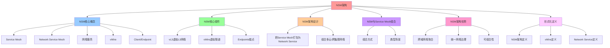

# NSM 架构：Network Service Mesh 网络抽象

## 📑 目录

- [NSM 架构：Network Service Mesh 网络抽象](#nsm-架构network-service-mesh-网络抽象)
  - [📑 目录](#-目录)
  - [1 概述](#1-概述)
    - [1.1 核心思想](#11-核心思想)
  - [2 NSM 核心概念](#2-nsm-核心概念)
    - [2.1 关键概念](#21-关键概念)
    - [2.2 NSM 架构层次](#22-nsm-架构层次)
  - [3 NSM 核心组件](#3-nsm-核心组件)
    - [3.1 vL3（虚拟 L3 网络）](#31-vl3虚拟-l3-网络)
    - [3.2 vWire（虚拟隧道）](#32-vwire虚拟隧道)
    - [3.3 Endpoints（端点）](#33-endpoints端点)
  - [4 NSM 架构设计](#4-nsm-架构设计)
    - [4.1 把 Service Mesh 打包为 Network Service](#41-把-service-mesh-打包为-network-service)
    - [4.2 组合多云/跨集群网络](#42-组合多云跨集群网络)
  - [5 NSM 与 Service Mesh 的组合](#5-nsm-与-service-mesh-的组合)
    - [5.1 组合方式](#51-组合方式)
    - [5.2 典型场景](#52-典型场景)
  - [6 NSM 架构优势](#6-nsm-架构优势)
    - [6.1 跨域网络聚合](#61-跨域网络聚合)
    - [6.2 统一网络治理](#62-统一网络治理)
    - [6.3 可组合性](#63-可组合性)
  - [7 形式化定义](#7-形式化定义)
    - [7.1 NSM 架构定义](#71-nsm-架构定义)
    - [7.2 vWire 定义](#72-vwire-定义)
    - [7.3 Network Service 定义](#73-network-service-定义)
  - [8 总结](#8-总结)

---

## 1 概述

本文档详细阐述**Network Service Mesh (NSM)** 的架构设计，这是将 Service Mesh 作
为 Network Service 的网络抽象层。

### 1.1 核心思想

> **NSM 通过 vL3、vWire、Endpoints 实现跨域网络聚合，将 Service Mesh 作为
> Network Service 统一管理**

## 2 NSM 核心概念

### 2.1 关键概念

| 名称                           | 典型技术                       | 主要职责                                                                           |
| ------------------------------ | ------------------------------ | ---------------------------------------------------------------------------------- |
| **Service Mesh**               | Istio, Linkerd, Consul, Kuma   | 代理、流量治理、服务治理、熔断、监控、MTLS、侧车注入                               |
| **Network Service Mesh (NSM)** | Network‑Service‑Mesh.io        | 把任意工作负载（Pod、VM、物理机）连接到 **"网络服务"**；支持多网格、多云、跨域网络 |
| **网络服务 (Network Service)** | vL3、IPsec、WAF、IPS、DNS、VPN | 连接、加密、监控、策略、DNS 解析                                                   |
| **vWire (Virtual Wire)**       | 逻辑隧道                       | 负责在 **Client** 与 **Endpoint** 之间转发数据；可携带安全/可观测信息              |
| **Client / Endpoint**          | Pod、VM、物理机                | 参与 NSM 连接的终端，或提供网络服务的终端                                          |

### 2.2 NSM 架构层次

```text
+-----------------------------------------------------------+
| 1. 应用层  (业务微服务)                                 |
|   └─ Service Mesh  (Istio/Linkerd sidecars)              |
+-----------------------------------------------------------+
| 2. 服务网格层 (Service Mesh)                            |
|   └─ Service‑Mesh Sidecar + Control Plane                |
+-----------------------------------------------------------+
| 3. 网络服务层 (NSM)                                      |
|   └─ vL3  +  vWire + Network Service Endpoints          |
+-----------------------------------------------------------+
| 4. 基础设施层 (K8s/VM/物理)                              |
|   └─ Pods / VMs / Physical Servers (Clients / Endpoints)|
+-----------------------------------------------------------+
```

## 3 NSM 核心组件

### 3.1 vL3（虚拟 L3 网络）

**vL3** 是 NSM 的虚拟 L3 网络层，提供：

- **网络抽象**：将物理网络抽象为虚拟网络
- **服务发现**：发现和注册网络服务
- **路由管理**：管理虚拟网络路由

### 3.2 vWire（虚拟隧道）

**vWire** 是 NSM 的虚拟隧道，提供：

- **逻辑隧道**：在 Client 与 Endpoint 之间建立逻辑隧道
- **数据转发**：负责数据转发，可携带安全/可观测信息
- **跨域连接**：支持跨集群、跨云、跨硬件连接

### 3.3 Endpoints（端点）

**Endpoints** 是 NSM 的端点，包括：

- **Client**：请求网络服务的客户端（Pod、VM、物理机）
- **Endpoint**：提供网络服务的端点（Pod、VM、物理机）

## 4 NSM 架构设计

### 4.1 把 Service Mesh 打包为 Network Service

**步骤**：

1. **注册 Service Mesh**：把 Istio/Linkerd 的 **vL3** 与 **Endpoint** 抽象为
   **NSM Network Service**
2. **NSM 允许多 Service Mesh 叠加**：在同一 vL3 上注册多个 **Network Service**（
   例如 Istio、Linkerd、Kuma）
3. **通过 vWire 细粒度流量治理**：vWire 负责 **TLS、熔断、限流**；可携带
   `labels` 进行流量路由

**示例**：

```bash
# 注册 Istio 为 NSM 网络服务
nsmctl ns create istio-namespace --namespace=istio-system

# 注册 VM 或物理服务器为 Endpoint
nsmctl endpoint create vm-endpoint --address=10.0.0.5

# 在 Pod 里请求 vWire
nsmctl client create orders-vwire --service=orders --endpoint=vm-endpoint
```

### 4.2 组合多云/跨集群网络

| 目标                   | 方案                                                                            | 关键技术                               |
| ---------------------- | ------------------------------------------------------------------------------- | -------------------------------------- |
| **跨 Kubernetes 集群** | 在每个集群部署 **NSM vL3**；使用 **NSM Federation**                             | `nsm create federated-network-service` |
| **跨物理机与云**       | 在物理机部署 **NSM Endpoint**（e.g., via `nsm-node` daemon）；使用 `vWire` 直连 | `nsmctl node create`                   |
| **跨多云**             | 在每个云环境部署 **NSM**，使用 **VPN** + `vWire` 连接                           | `nsm install --cloud`                  |

**通过 vWire**，流量可在 **Pod → VM → 物理机** 之间透明转发，且每个链路可独立加
密、监控。

## 5 NSM 与 Service Mesh 的组合

### 5.1 组合方式

**组合策略**：

1. **把 Service Mesh 作为 Network Service** 注册到 NSM
2. 在 **Pod** 内通过 `Istio` 侧车注入，`nsmctl client create` 生成 `vWire` 与
   **Endpoint** 连接
3. 通过 **NSM Federation** 把多集群、跨云的 Service Mesh 互联

### 5.2 典型场景

**混合云（公有云 + 本地）**：

```text
业务 Pod → Istio（公有云） → NSM vL3 → 本地 VMs → Physical Server
```

**多租户 SaaS**：

```text
业务 Pod → Istio (租户专属) → NSM (共享 vL3) → 共用 Endpoint
```

**边缘计算**：

```text
设备 → Edge NSM Node → Cloud NSM → Service Mesh
```

## 6 NSM 架构优势

### 6.1 跨域网络聚合

- **跨集群**：支持跨 Kubernetes 集群连接
- **跨云**：支持跨公有云和私有云连接
- **跨硬件**：支持 Pod、VM、物理机统一管理

### 6.2 统一网络治理

- **统一策略**：通过 NSM 统一管理网络策略
- **统一监控**：通过 NSM 统一监控网络流量
- **统一安全**：通过 NSM 统一实施安全策略

### 6.3 可组合性

- **多 Service Mesh 叠加**：支持多个 Service Mesh 同时运行
- **灵活组合**：支持不同的网络服务组合

## 7 形式化定义

### 7.1 NSM 架构定义

```text
NSM = ⟨vL3, vWire, endpoints, clients⟩
其中：
- vL3: 虚拟 L3 网络
- vWire: 虚拟隧道集合
- endpoints: 端点集合
- clients: 客户端集合
```

### 7.2 vWire 定义

```text
vWire = ⟨client, endpoint, tunnel, policies⟩
其中：
- client: 客户端
- endpoint: 端点
- tunnel: 隧道配置
- policies: 策略配置（安全、监控、路由）
```

### 7.3 Network Service 定义

```text
NetworkService = ⟨name, vL3, endpoints, policies⟩
其中：
- name: 服务名称
- vL3: 虚拟 L3 网络
- endpoints: 端点集合
- policies: 策略配置
```

## 8 总结

通过**NSM 架构**，我们可以：

1. **跨域网络聚合**：支持跨集群、跨云、跨硬件统一管理
2. **统一网络治理**：通过 NSM 统一管理网络策略、监控、安全
3. **可组合性**：支持多个 Service Mesh 叠加和灵活组合
4. **透明转发**：通过 vWire 实现 Pod → VM → 物理机透明转发

---

## 9 认知增强：思维导图、知识矩阵与专家观点

### 9.1 NSM架构完整思维导图



### 9.2 知识多维关系矩阵

#### NSM架构多维关系矩阵

| NSM维度 | Service Mesh | NSM | 网络服务 | vWire | Client/Endpoint | 组合协同 | 认知价值 |
|--------|-------------|-----|---------|-------|----------------|---------|---------|
| **职责** | 代理、流量治理、服务治理 | 把任意工作负载连接到网络服务 | 连接、加密、监控、策略 | 在Client与Endpoint之间转发数据 | 参与NSM连接的终端 | 职责对比 | 职责理解 |
| **典型技术** | Istio, Linkerd, Consul | Network-Service-Mesh.io | vL3、IPsec、WAF、IPS | 逻辑隧道 | Pod、VM、物理机 | 技术对比 | 技术理解 |
| **架构层次** | 服务网格层 | 网络服务层 | 网络服务层 | 网络服务层 | 基础设施层 | 层次对比 | 层次理解 |
| **组合方式** | 侧车注入、控制平面 | vL3、vWire、Endpoints | Network Service注册 | vWire创建 | Client/Endpoint创建 | 组合对比 | 组合理解 |
| **适用场景** | 微服务通信 | 跨域网络聚合 | 网络服务管理 | 跨域连接 | 工作负载连接 | 场景对比 | 场景理解 |
| **学习难度** | ⭐⭐⭐⭐ | ⭐⭐⭐⭐⭐ | ⭐⭐⭐⭐ | ⭐⭐⭐⭐ | ⭐⭐⭐ | ⭐⭐⭐⭐ | 渐进学习 |
| **专家推荐** | ⭐⭐⭐⭐⭐ | ⭐⭐⭐⭐⭐ | ⭐⭐⭐⭐⭐ | ⭐⭐⭐⭐⭐ | ⭐⭐⭐⭐⭐ | ⭐⭐⭐⭐⭐ | 技术深度 |

#### NSM架构优势多维关系矩阵

| 优势维度 | 跨域网络聚合 | 统一网络治理 | 可组合性 | 透明转发 | 优势协同 | 认知价值 |
|---------|------------|------------|---------|---------|---------|---------|
| **核心价值** | 支持跨集群、跨云、跨硬件统一管理 | 通过NSM统一管理网络策略、监控、安全 | 支持多个Service Mesh叠加和灵活组合 | 通过vWire实现Pod→VM→物理机透明转发 | 价值对比 | 价值理解 |
| **实现方式** | NSM Federation、vWire | NSM统一策略、监控、安全 | 多Service Mesh注册、Network Service组合 | vWire逻辑隧道、透明转发 | 方式对比 | 方式理解 |
| **适用场景** | 混合云、多租户SaaS、边缘计算 | 统一网络管理、安全策略、监控 | 多Service Mesh环境、灵活组合 | 跨域连接、透明转发 | 场景对比 | 场景理解 |
| **学习难度** | ⭐⭐⭐⭐ | ⭐⭐⭐⭐ | ⭐⭐⭐⭐ | ⭐⭐⭐⭐ | ⭐⭐⭐⭐ | 渐进学习 |
| **专家推荐** | ⭐⭐⭐⭐⭐ | ⭐⭐⭐⭐⭐ | ⭐⭐⭐⭐⭐ | ⭐⭐⭐⭐⭐ | ⭐⭐⭐⭐⭐ | 技术深度 |

### 9.3 形象化解释论证

#### NSM架构的形象化类比

##### 1. NSM架构 = 从单一网络到统一网络系统

> **类比**：NSM架构就像从单一网络到统一网络系统，Service Mesh像单一网络（微服务通信），NSM像统一网络系统（跨域网络聚合），就像统一网络系统将复杂网络分解为系统，通过系统实现网络统一管理一样。

**认知价值**：

- **架构理解**：通过统一网络系统类比，理解NSM架构的含义
- **网络理解**：通过单一网络类比，理解Service Mesh的重要性
- **统一理解**：通过统一网络系统类比，理解NSM的价值

##### 2. vWire = 从单一隧道到虚拟隧道系统

> **类比**：vWire就像从单一隧道到虚拟隧道系统，逻辑隧道像隧道（在Client与Endpoint之间转发数据），安全/可观测信息像隧道标识（可携带安全/可观测信息），就像虚拟隧道系统将复杂隧道分解为系统，通过系统实现隧道管理一样。

**认知价值**：

- **隧道理解**：通过虚拟隧道系统类比，理解vWire的含义
- **转发理解**：通过隧道转发类比，理解数据转发的重要性
- **信息理解**：通过隧道标识类比，理解安全/可观测信息的价值

##### 3. 跨域网络聚合 = 从单一域到多域聚合系统

> **类比**：跨域网络聚合就像从单一域到多域聚合系统，跨集群像集群聚合（支持跨Kubernetes集群连接），跨云像云聚合（支持跨公有云和私有云连接），跨硬件像硬件聚合（支持Pod、VM、物理机统一管理），就像多域聚合系统将复杂域分解为聚合，通过聚合实现域管理一样。

**认知价值**：

- **聚合理解**：通过多域聚合系统类比，理解跨域网络聚合的含义
- **集群理解**：通过集群聚合类比，理解跨集群连接的重要性
- **云理解**：通过云聚合类比，理解跨云连接的价值
- **硬件理解**：通过硬件聚合类比，理解跨硬件连接的作用

##### 4. 统一网络治理 = 从单一治理到统一治理系统

> **类比**：统一网络治理就像从单一治理到统一治理系统，统一策略像策略治理（通过NSM统一管理网络策略），统一监控像监控治理（通过NSM统一监控网络流量），统一安全像安全治理（通过NSM统一实施安全策略），就像统一治理系统将复杂治理分解为统一，通过统一实现治理管理一样。

**认知价值**：

- **治理理解**：通过统一治理系统类比，理解统一网络治理的含义
- **策略理解**：通过策略治理类比，理解统一策略的重要性
- **监控理解**：通过监控治理类比，理解统一监控的价值
- **安全理解**：通过安全治理类比，理解统一安全的作用

##### 5. NSM与Service Mesh组合 = 从单一组合到多层组合系统

> **类比**：NSM与Service Mesh组合就像从单一组合到多层组合系统，Service Mesh作为Network Service像服务注册（把Service Mesh作为Network Service注册到NSM），NSM Federation像联邦连接（通过NSM Federation把多集群、跨云的Service Mesh互联），就像多层组合系统将复杂组合分解为多层，通过多层实现组合管理一样。

**认知价值**：

- **组合理解**：通过多层组合系统类比，理解NSM与Service Mesh组合的含义
- **注册理解**：通过服务注册类比，理解Service Mesh作为Network Service的重要性
- **联邦理解**：通过联邦连接类比，理解NSM Federation的价值

### 9.4 专家观点与论证

#### 计算信息软件科学家的观点

##### 1. William Morgan（Linkerd创始人）

> **观点**："Service Mesh is a dedicated infrastructure layer for making service-to-service communication safe, fast, and reliable."（服务网格是用于使服务间通信安全、快速和可靠的专用基础设施层）

**与NSM架构的关联**：

- **基础设施理解**：NSM架构体现了网络基础设施的重要性（vL3、vWire、Endpoints）
- **通信理解**：通过NSM架构理解服务间通信（跨域网络聚合、统一网络治理）
- **系统理解**：通过NSM架构理解网络系统（NSM与Service Mesh组合）

##### 2. Tim Berners-Lee（万维网发明者）

> **观点**："The Web is more a social creation than a technical one. I designed it for a social effect—to help people work together—and not as a technical toy."（万维网更像是一个社会创造，而不是技术创造。我设计它是为了社会效果——帮助人们协作——而不是作为技术玩具）

**与NSM架构的关联**：

- **协作理解**：NSM架构通过跨域网络聚合、统一网络治理支持协作（跨集群、跨云、跨硬件）
- **社会理解**：通过NSM架构理解网络的社会价值（统一管理、灵活组合）
- **设计理解**：通过NSM架构指导设计，关注"协作"而非"技术玩具"

##### 3. David Parnas（软件工程专家）

> **观点**："The structure of a system is more important than its components."（系统的结构比其组件更重要）

**与NSM架构的关联**：

- **结构理解**：NSM架构体现了结构的重要性（NSM架构层次、NSM与Service Mesh组合）
- **组件理解**：通过NSM架构理解组件（vL3、vWire、Endpoints）
- **系统理解**：通过NSM架构理解系统结构（跨域网络聚合、统一网络治理）

#### 计算信息软件教育家的观点

##### 1. Martin Fowler（重构之父）

> **观点**："Any fool can write code that a computer can understand. Good programmers write code that humans can understand."（任何傻瓜都能编写计算机能理解的代码。好的程序员编写人类能理解的代码）

**与NSM架构的关联**：

- **可理解性理解**：NSM架构通过清晰的架构层次（应用层、服务网格层、网络服务层、基础设施层）提高可理解性
- **人类理解**：通过NSM架构理解架构的人类可理解性（清晰的层次、明确的职责）
- **选择理解**：通过NSM架构选择"人类能理解"的架构

##### 2. Robert C. Martin（《架构整洁之道》作者）

> **观点**："The architecture of a system is defined by the boundaries drawn between components and the dependencies that cross those boundaries."（系统的架构由组件之间绘制的边界和跨越这些边界的依赖关系定义）

**与NSM架构的关联**：

- **边界理解**：NSM架构通过架构层次边界（应用层、服务网格层、网络服务层、基础设施层）定义架构
- **依赖理解**：通过NSM架构理解依赖关系（NSM与Service Mesh组合、vWire连接）
- **组件理解**：通过NSM架构理解组件划分（vL3、vWire、Endpoints）

#### 计算信息软件认知学家的观点

##### 1. Donald Norman（《设计心理学》作者）

> **观点**："The real problem with the interface is that it is an interface. Interfaces get in the way. I don't want to focus my energies on an interface. I want to focus on the job."（界面的真正问题是它是界面。界面会妨碍。我不想把精力集中在界面上。我想专注于工作）

**与NSM架构的关联**：

- **接口理解**：NSM架构通过vWire接口（Client与Endpoint之间的接口）定义接口，但也要避免过度关注接口
- **工作理解**：通过NSM架构专注于架构工作（跨域网络聚合、统一网络治理），而不是过度关注接口细节
- **平衡理解**：通过NSM架构理解接口与工作的平衡

##### 2. Herbert A. Simon（认知科学家）

> **观点**："A wealth of information creates a poverty of attention."（信息丰富导致注意力贫乏）

**与NSM架构的关联**：

- **注意力理解**：NSM架构通过架构层次、统一网络治理管理注意力，避免信息过载
- **结构化理解**：通过NSM架构结构化信息（4个架构层次、NSM核心组件、NSM架构优势），减少认知负荷
- **管理理解**：通过NSM架构管理信息，避免注意力贫乏

### 9.5 认知学习路径矩阵

| 学习阶段 | 推荐内容 | 推荐技术栈 | 学习重点 | 学习时间 | 前置要求 | 后续进阶 |
|---------|---------|-----------|---------|---------|---------|---------|
| **新手阶段** | 概述、NSM核心概念、NSM核心组件 | NSM架构概念理解 | 概念理解、组件理解、基本概念理解 | 2-4周 | 无 | 进阶阶段 |
| **进阶阶段** | NSM架构设计、NSM与Service Mesh组合、NSM架构优势 | 完整技术栈 | 设计理解、组合理解、优势理解 | 8-16周 | 新手阶段 | 专家阶段 |
| **专家阶段** | 形式化定义、跨域网络聚合、统一网络治理 | 完整技术栈 | 形式化理解、聚合理解、治理理解 | 32+周 | 进阶阶段 | - |

### 9.6 专家推荐阅读路径

**路径1：概念理解路径**：

1. **第一步**：阅读概述（第1节），理解NSM架构概览
2. **第二步**：阅读NSM核心概念（第2节），理解关键概念、NSM架构层次
3. **第三步**：阅读NSM核心组件（第3节），理解vL3、vWire、Endpoints
4. **第四步**：阅读总结（第8节），回顾关键要点

**路径2：设计理解路径**：

1. **第一步**：阅读概述（第1节），了解NSM架构
2. **第二步**：阅读NSM架构设计（第4节），学习把Service Mesh打包为Network Service、组合多云/跨集群网络
3. **第三步**：阅读NSM与Service Mesh组合（第5节），学习组合方式、典型场景
4. **第四步**：阅读NSM架构优势（第6节），学习跨域网络聚合、统一网络治理、可组合性

**路径3：形式化理解路径**：

1. **第一步**：阅读概述（第1节），了解NSM架构
2. **第二步**：阅读形式化定义（第7节），理解NSM架构定义、vWire定义、Network Service定义
3. **第三步**：阅读NSM架构优势（第6节），理解跨域网络聚合、统一网络治理、可组合性
4. **第四步**：阅读总结（第8节），学习最佳实践

---

**更新时间**：2025-11-15 **版本**：v1.1 **参考**：`architecture_view.md` 第391-610行，NSM部分

**更新内容（v1.1）**：

- ✅ 添加认知增强章节（思维导图、知识矩阵、形象化解释、专家观点）
- ✅ 添加认知学习路径矩阵
- ✅ 添加专家推荐阅读路径（3条路径）
