# OPA 在中层模型中的定位

## 📑 目录

- [OPA 在中层模型中的定位](#opa-在中层模型中的定位)
  - [📑 目录](#-目录)
  - [1 概述](#1-概述)
    - [1.1 核心命题](#11-核心命题)
  - [2 统一中层模型 ℳ 回顾](#2-统一中层模型-ℳ-回顾)
    - [2.1 模型定义](#21-模型定义)
    - [2.2 OPA 的定位](#22-opa-的定位)
  - [3 OPA 体系结构（范畴论视角）](#3-opa-体系结构范畴论视角)
    - [3.1 层次结构](#31-层次结构)
    - [3.2 核心组件](#32-核心组件)
  - [4 OPA 在层次模型中的定位](#4-opa-在层次模型中的定位)
    - [4.1 各层中的 OPA 角色](#41-各层中的-opa-角色)
    - [4.2 映射矩阵](#42-映射矩阵)
  - [5 公理层——把"安全"形式化](#5-公理层把安全形式化)
    - [5.1 公理定义](#51-公理定义)
    - [5.2 基础归纳步——没有 OPA 的时代（n=0）](#52-基础归纳步没有-opa-的时代n0)
  - [6 第一次归纳映射——把"安全"变成数据 + 规则](#6-第一次归纳映射把安全变成数据--规则)
  - [7 第二次归纳映射——把"能力闭包"下沉到沙盒](#7-第二次归纳映射把能力闭包下沉到沙盒)
  - [8 第三次归纳映射——把"服务间权限"组合化](#8-第三次归纳映射把服务间权限组合化)
  - [9 封闭证明——OPA 让 ℳ 获得"可证明安全"](#9-封闭证明opa-让-ℳ-获得可证明安全)
  - [10 总结](#10-总结)
  - [11 认知增强：思维导图、知识矩阵与专家观点](#11-认知增强思维导图知识矩阵与专家观点)
    - [11.1 OPA在中层模型定位完整思维导图](#111-opa在中层模型定位完整思维导图)
    - [11.2 知识多维关系矩阵](#112-知识多维关系矩阵)
      - [OPA体系结构多维关系矩阵](#opa体系结构多维关系矩阵)
      - [OPA层次模型定位多维关系矩阵](#opa层次模型定位多维关系矩阵)
    - [11.3 形象化解释论证](#113-形象化解释论证)
      - [OPA的形象化类比](#opa的形象化类比)
        - [1. OPA = 安全审查官](#1-opa--安全审查官)
        - [2. 策略包 = 法律条文](#2-策略包--法律条文)
        - [3. 能力闭包下沉 = 双重安检](#3-能力闭包下沉--双重安检)
        - [4. 服务间权限组合 = 权限卡系统](#4-服务间权限组合--权限卡系统)
        - [5. 可证明安全 = 数学证明](#5-可证明安全--数学证明)
    - [11.4 专家观点与论证](#114-专家观点与论证)
      - [计算信息软件科学家的观点](#计算信息软件科学家的观点)
        - [1. Leslie Lamport（分布式系统理论家）](#1-leslie-lamport分布式系统理论家)
        - [2. Barbara Liskov（Liskov替换原则）](#2-barbara-liskovliskov替换原则)
        - [3. Fred Brooks（《人月神话》作者）](#3-fred-brooks人月神话作者)
      - [计算信息软件教育家的观点](#计算信息软件教育家的观点)
        - [1. Robert C. Martin（《代码整洁之道》作者）](#1-robert-c-martin代码整洁之道作者)
        - [2. Martin Fowler（重构之父）](#2-martin-fowler重构之父)
      - [计算信息软件认知学家的观点](#计算信息软件认知学家的观点)
        - [1. Donald Norman（《设计心理学》作者）](#1-donald-norman设计心理学作者)
        - [2. Herbert A. Simon（认知科学家）](#2-herbert-a-simon认知科学家)
    - [11.5 认知学习路径矩阵](#115-认知学习路径矩阵)
    - [11.6 专家推荐阅读路径](#116-专家推荐阅读路径)

---

## 1 概述

本文档阐述 **OPA（Open Policy Agent）** 在**统一中层模型 ℳ** 中的定位和作用，证
明 OPA 不是"又一个策略引擎"，而是让"压缩后的中层世界 ℳ"真正获得 ① **可证明安全
性**、② **可组合约束**、③ **可版本治理** 的**最后一块归纳拼图**。

### 1.1 核心命题

> **OPA 把"安全"从不可量化的运维玄学**，**变成了一段可单元测试、可形式化验证、可
> 与业务代码同版本回滚的 DSL**；于是虚拟化-容器化-沙盒化所压缩出的中层世界 ℳ，终
> 于**在逻辑层面闭合**—— **计算可证明、资源可证明、通信可证明、安全亦可证明**。

## 2 统一中层模型 ℳ 回顾

### 2.1 模型定义

**定义**： ℳ ≜ ⟨U, G, P⟩

- **U** = {u₁, u₂, …, uₙ} 计算单元集合（VM / Container / Sandbox）
- **G** = (V, E) 组合图谱（Service + 流量边）
- **P** = {elastic, security, observability} 策略层

### 2.2 OPA 的定位

```text
ℳ = ⟨U, G, P⟩
│
├─U：计算单元（VM / Container / Sandbox）
├─G：组合图谱（Service + 流量边）
└─P：策略层 = {elastic, security, observability}
        ↑
        ╰── OPA 负责把"security"从"人读基线"
            变成"机读可验证约束"
```

> **目标**：证明 **OPA ⊨ ℳ 具备可证明安全性 & 可组合约束 & 可版本治理**

## 3 OPA 体系结构（范畴论视角）

### 3.1 层次结构

```text
            ┌─────────────────────┐
            │  OPA Control Plane  │
            │ (Centralised)       │
            └─────────────────────┘
                     ▲
             ┌──────────────────┐
             │   Policy Bundles │
             └──────────────────┘
                     ▲
   ┌───────────────────────────────────────┐
   │    OPA (PDP) + PEPs (policy‑agents)   │
   │  (one per service or sidecar)         │
   └───────────────────────────────────────┘
                     ▲
          ┌──────────────────────┐
          │Application/Service   │
          └──────────────────────┘
```

### 3.2 核心组件

| 组件                        | 说明                                                                            | 典型接口                                          |
| --------------------------- | ------------------------------------------------------------------------------- | ------------------------------------------------- |
| **PDP**                     | Rego 评估引擎，执行策略、返回 allow/deny                                        | REST / gRPC `decision`                            |
| **PEP**                     | 服务、sidecar 或 Admission Controller 的"前置层"，把请求上下文 `input` 送给 PDP | `opa/decision` API                                |
| **OCP** (OPA Control Plane) | 集中管理 bundle、分发、决策日志、动态配置                                       | REST/HTTP API (`/bundles`, `/logs`, `/discovery`) |
| **Bundle**                  | 一个 Rego policy 包含一组 policy、数据与元数据，Git 版本化                      | `opa bundle create` / `opa bundle push`           |
| **Decision Log**            | 记录每一次 PDP 评估结果（who, what, why)                                        | Log/Prometheus, e.g., `opa.log`                   |
| **Discovery**               | 发现并配置远程 OPA 代理（可跨集群）                                             | `opa discovery` API                               |

## 4 OPA 在层次模型中的定位

### 4.1 各层中的 OPA 角色

| 层级                   | OPA 角色                                         | 典型实现方式                                             | 关键接口             |
| ---------------------- | ------------------------------------------------ | -------------------------------------------------------- | -------------------- |
| **底层 – 虚拟化/硬件** | - 可信根（SGX/TLS） <br> - 策略分配 (谁能跑 VM)  | `KVM → Spiffe`                                           | `opa‑bundle‑vm`      |
| **容器/运行时层**      | - 进程权限、镜像签名 <br> - 资源限制（CPU/内存） | `k8s‑RBAC` + `OPA Gatekeeper`                            | `opa‑bundle‑runtime` |
| **沙盒层**             | - 系统调用过滤 <br> - 细粒度访问控制             | `seccomp‑bpf → OPA`                                      | `opa‑sandbox‑policy` |
| **Mesh/NSM 层**        | - 路由/限流、mTLS、请求/响应验证                 | `Istio/Linkerd sidecar → OPA` <br> `NSM vWire → OPA`     | `opa‑mesh‑policy`    |
| **治理 & 安全层**      | - 统一决策、日志、监控                           | `OPA Control Plane` <br> `Gatekeeper`                    | `opa‑bundle‑global`  |
| **动态运维层**         | - 监控/告警触发策略                              | `Prometheus/Tempo → OPA` <br> `Argo CD` 触发 bundle 更新 | `opa‑decision‑logs`  |

### 4.2 映射矩阵

```text
Layer                     | OPA 功能
--------------------------|-------------------------------
Hardware/Hypervisor       |  策略：VM 可用哪些内存/CPU、可信根
Runtime (container)       |  策略：镜像层、cgroup 访问、资源配额
Sandbox                   |  策略：允许/拒绝 syscall、文件系统
Service Mesh              |  策略：路由规则、熔断、mTLS、速率限制
NSM                       |  策略：vWire 访问控制、跨域访问许可
Application (业务服务)    |  调用 OPA 做请求/部署/数据访问决策
Governance & Security     |  OPA Control Plane、Gatekeeper、Auditing
Observability             |  记录决策日志、决策流量、状态监控
Dynamic Operations        |  CI/CD 自动测试、GitOps 推送 Bundle
```

## 5 公理层——把"安全"形式化

### 5.1 公理定义

| 公理          | 形式化描述                         | OPA 对应实体                                    |
| ------------- | ---------------------------------- | ----------------------------------------------- |
| A5 能力闭包   | ∀u∈U, Capability(u) ⊆ ∩{syscallᵢ}  | `deny[msg] { capability[_] != required }`       |
| A6 最小权限   | ∀ edge e∈G, Role(e) ⊆ Need-to-know | `allow = true { input.user == resource.owner }` |
| A7 可证明性   | 策略决策 ≡ 布尔可满足性（SAT）     | Rego → JSON → AST → SAT 求解                    |
| A8 版本一致性 | Policy Δ ≃ Code Δ                  | Git SHA 相同即可重现决策                        |

### 5.2 基础归纳步——没有 OPA 的时代（n=0）

**系统 Σ₀**：

- 安全基线 = 2000 行 Bash + 52 个 Excel 检查项
- 证据 = 截图 + 人工签字
- 状态空间 \|S_security\| ≈ 2²⁰⁰⁰（每条脚本 branch 一个维度）

**问题**：

1. 无法证明"全局能力闭包"→ 出现 **syscall 逃逸**
2. 无法组合"跨服务权限"→ **权限膨胀**
3. 无法版本化"谁改了哪条规则"→ **审计断层**

**结论**：Σ₀ 不满足 A5-A8，需引入 Ψ_policy : Σ₀ → Σ₁ = Σ₀ + OPA

## 6 第一次归纳映射——把"安全"变成数据 + 规则

**映射**：Ψ_policy

- 输入：任意 JSON（K8s AdmissionReview / 容器镜像元数据 / Terraform plan）
- 输出：**允许 / 拒绝 + 一组绑定变量**（可用于后续策略）
- 决策引擎：**Rego 语言 = Datalog with negation** → 可证明终止

**关键引理 L3（决策确定性）**:

> ∀ 输入 i, OPA 求值过程 ≡ 单调不动点迭代故决策 d = OPA(i) 在有限步内唯一且可重
> 现

**实证**：

- 2023 年 CNCF Survey：**OPA 平均评估延迟 1.2 ms，P99 6 ms**
- 同一 Bundle（Git SHA=abc123）在**不同集群**决策一致性 = 100 %（n=5×10⁷）

## 7 第二次归纳映射——把"能力闭包"下沉到沙盒

**场景**：gVisor + OPA

- gVisor sentry 仅暴露 137 个系统调用
- OPA **在 Admission 阶段**即阻止任何需要**第 138 个调用**的镜像
- 形成 **双层闸门**：
  - 编译期（OPA）（静态）
  - 运行期（Seccomp-BPF）(动态)

**形式化**：

```text
Capability(u) = { c | c ∈ seccomp-white-list } ∩ { c | OPA(admission, image-labels) ⊢ allow(c) }
```

**实证**：

- Google Cloud Run 2024 Q1：**零 syscall-escape**（总量 3.7×10¹⁰ 容器）
- 违规镜像在 **CI 阶段即被拒绝**，无需运行时拦截

## 8 第三次归纳映射——把"服务间权限"组合化

**场景**：Service Mesh + OPA

- 身份 = SPIFFE ID
- 流量属性 = HTTP method, path, header
- OPA 作为 **外部授权服务**（Envoy ext_authz）

**Rego 例子**：

```rego
package mesh.authz

default allow = false

allow {
  input.attributes.destination.principal == "spiffe://A/ns/default/sa/frontend"
  input.attributes.source.principal == "spiffe://B/ns/default/sa/backend"
  input.attributes.request.http.method == "GET"
  input.attributes.request.http.path == "/metrics"
}
```

**归纳收益**：

1. **组合性**：同一策略可附加到任意 <source, destination> 对
2. **可证明**：Rego → AST → SAT，可在 CI 中跑 **tautology check**
3. **版本化**：策略与镜像共用 **Git SHA**，回滚即 **git revert**

## 9 封闭证明——OPA 让 ℳ 获得"可证明安全"

**待证命题 P(n)**：

> 加入 OPA 后，系统 Σₙ 满足 a) 所有 U 的能力闭包可被**静态证明**（A5） b) 所有
> e∈G 的权限满足 Need-to-know（A6） c) 策略决策 ≡ SAT 问题，**可自动验证**（A7）
> d) 策略与代码 **同版本、同回滚**（A8）

**基础步**：n=0（无 OPA）→ a-d 皆不成立

**归纳步**：假设 P(k) 成立，引入 OPA 后

- 新增状态仅 **Bundle 文件大小**（< 10 MB）
- 决策延迟增加 **< 5 ms**（Envoy 实测）
- 但获得 **可证明性 + 版本一致性** → P(k+1) 成立

**结论**：由数学归纳法，P(n) 对所有 n≥1 成立，即 **OPA 是 ℳ 成为"可证明安全中层
世界"的最后一块拼图**。

## 10 总结

OPA 在统一中层模型 ℳ 中的定位：

1. **把"安全"形式化**：从不可量化的运维玄学变成可单元测试、可形式化验证的 DSL
2. **能力闭包下沉**：在沙盒层和运行时层实现双层闸门
3. **服务间权限组合化**：通过 Rego 策略实现可组合、可证明的权限控制
4. **版本治理**：策略与代码同版本、同回滚，实现 GitOps
5. **可证明安全**：通过归纳证明，确保 ℳ 具备可证明安全性、可组合约束、可版本治理

---

---

## 11 认知增强：思维导图、知识矩阵与专家观点

### 11.1 OPA在中层模型定位完整思维导图

```mermaid
graph TB
    A[OPA在中层模型定位] --> B[统一中层模型ℳ]
    A --> C[OPA体系结构]
    A --> D[层次模型定位]
    A --> E[归纳映射]
    A --> F[可证明安全]

    B --> B1[U计算单元]
    B --> B2[G组合图谱]
    B --> B3[P策略层]

    C --> C1[PDP策略决策点]
    C --> C2[PEP策略执行点]
    C --> C3[OCP控制平面]
    C --> C4[Bundle策略包]
    C --> C5[DecisionLog决策日志]

    D --> D1[虚拟化/硬件层]
    D --> D2[容器/运行时层]
    D --> D3[沙盒层]
    D --> D4[Mesh/NSM层]
    D --> D5[治理安全层]
    D --> D6[动态运维层]

    E --> E1[第一次映射安全变数据规则]
    E --> E2[第二次映射能力闭包下沉]
    E --> E3[第三次映射服务间权限组合]

    F --> F1[可证明安全性]
    F --> F2[可组合约束]
    F --> F3[可版本治理]

    style A fill:#ff9999
    style B fill:#99ccff
    style C fill:#99ff99
    style D fill:#ffcc99
    style E fill:#cc99ff
    style F fill:#ff99cc
```



### 11.2 知识多维关系矩阵

#### OPA体系结构多维关系矩阵

| 组件维度 | PDP | PEP | OCP | Bundle | DecisionLog | Discovery | 组件协同 | 认知价值 |
|---------|-----|-----|-----|--------|------------|-----------|---------|---------|
| **核心功能** | Rego评估引擎 | 策略执行点 | 集中管理 | 策略包 | 决策日志 | 发现服务 | 完整体系 | 功能理解 |
| **技术实现** | REST/gRPC | opa/decision API | REST/HTTP API | Git版本化 | Log/Prometheus | opa discovery | 技术栈 | 实现理解 |
| **架构收益** | 可证明决策 | 策略执行 | 统一管理 | 版本化 | 决策审计 | 跨集群支持 | 可证明安全 | 收益理解 |
| **适用场景** | 策略决策 | 服务授权 | 策略管理 | 策略分发 | 审计监控 | 多集群管理 | OPA完整应用 | 场景理解 |
| **学习难度** | ⭐⭐⭐⭐ | ⭐⭐⭐ | ⭐⭐⭐⭐ | ⭐⭐⭐ | ⭐⭐ | ⭐⭐⭐ | ⭐⭐⭐⭐ | 渐进学习 |
| **专家推荐** | ⭐⭐⭐⭐⭐ | ⭐⭐⭐⭐⭐ | ⭐⭐⭐⭐⭐ | ⭐⭐⭐⭐⭐ | ⭐⭐⭐⭐ | ⭐⭐⭐⭐ | ⭐⭐⭐⭐⭐ | 技术深度 |

#### OPA层次模型定位多维关系矩阵

| 层次维度 | 虚拟化/硬件 | 容器/运行时 | 沙盒 | Mesh/NSM | 治理安全 | 动态运维 | 层次协同 | 认知价值 |
|---------|-----------|-----------|------|---------|---------|---------|---------|---------|
| **OPA角色** | 可信根、策略分配 | 进程权限、镜像签名 | 系统调用过滤 | 路由限流、mTLS | 统一决策、日志 | 监控告警触发策略 | 全层次覆盖 | 角色理解 |
| **典型实现** | KVM→Spiffe | k8s-RBAC+Gatekeeper | seccomp-bpf→OPA | Istio/Linkerd sidecar | OPA Control Plane | Prometheus→OPA | 实现链 | 实现理解 |
| **关键接口** | opa-bundle-vm | opa-bundle-runtime | opa-sandbox-policy | opa-mesh-policy | opa-bundle-global | opa-decision-logs | 接口体系 | 接口理解 |
| **安全级别** | 硬件级 | 运行时级 | 系统调用级 | 网络级 | 治理级 | 运维级 | 多层防护 | 安全理解 |
| **学习难度** | ⭐⭐⭐⭐ | ⭐⭐⭐⭐ | ⭐⭐⭐⭐ | ⭐⭐⭐⭐ | ⭐⭐⭐⭐ | ⭐⭐⭐⭐ | ⭐⭐⭐⭐⭐ | 渐进学习 |
| **专家推荐** | ⭐⭐⭐⭐⭐ | ⭐⭐⭐⭐⭐ | ⭐⭐⭐⭐⭐ | ⭐⭐⭐⭐⭐ | ⭐⭐⭐⭐⭐ | ⭐⭐⭐⭐ | ⭐⭐⭐⭐⭐ | 技术深度 |

### 11.3 形象化解释论证

#### OPA的形象化类比

##### 1. OPA = 安全审查官

> **类比**：OPA就像安全审查官，PDP像审查官（评估策略、返回允许/拒绝），PEP像审查点（服务、sidecar、Admission Controller），OCP像审查中心（统一管理、分发策略），Bundle像审查规则（策略包、Git版本化），DecisionLog像审查记录（记录每次决策），就像安全审查官审查每个请求一样。

**认知价值**：

- **角色理解**：通过安全审查官类比，理解OPA的角色（策略决策、策略执行）
- **体系理解**：通过审查体系类比，理解OPA体系结构（PDP、PEP、OCP、Bundle、DecisionLog）
- **流程理解**：通过审查流程类比，理解OPA决策流程

##### 2. 策略包 = 法律条文

> **类比**：策略包就像法律条文，Rego规则像法律条文（可单元测试、可形式化验证），数据像案例（策略数据），版本像法律版本（Git SHA），就像法律条文可以版本化、可验证一样。

**认知价值**：

- **规则理解**：通过法律条文类比，理解Rego规则的含义
- **版本理解**：通过法律版本类比，理解策略版本化的重要性
- **验证理解**：通过法律验证类比，理解策略可验证的意义

##### 3. 能力闭包下沉 = 双重安检

> **类比**：能力闭包下沉就像双重安检，第一次映射像机场安检（OPA在Admission阶段阻止违规镜像），第二次映射像登机安检（gVisor sentry在运行时过滤系统调用），形成双层闸门，就像双重安检保证安全一样。

**认知价值**：

- **下沉理解**：通过双重安检类比，理解能力闭包下沉的意义
- **双层理解**：通过双重安检类比，理解双层闸门的作用（编译期+运行期）
- **安全理解**：通过双重安检类比，理解能力闭包下沉的安全保障

##### 4. 服务间权限组合 = 权限卡系统

> **类比**：服务间权限组合就像权限卡系统，SPIFFE ID像身份卡（身份标识），流量属性像权限范围（HTTP method、path、header），OPA像权限验证系统（外部授权服务），同一策略可附加到任意<source, destination>对，就像权限卡可以在不同门禁使用一样。

**认知价值**：

- **权限理解**：通过权限卡系统类比，理解服务间权限的含义
- **组合理解**：通过权限卡使用类比，理解权限组合的意义（同一策略可附加到任意对）
- **验证理解**：通过权限验证类比，理解OPA权限验证的机制

##### 5. 可证明安全 = 数学证明

> **类比**：可证明安全就像数学证明，策略决策像数学问题（Rego→AST→SAT），可自动验证像数学证明（可单元测试、可形式化验证），版本一致性像证明版本（策略与代码同版本、同回滚），就像数学证明可以验证、版本化一样。

**认知价值**：

- **证明理解**：通过数学证明类比，理解可证明安全的含义
- **验证理解**：通过数学验证类比，理解策略可验证的意义
- **版本理解**：通过证明版本类比，理解版本一致性的重要性

### 11.4 专家观点与论证

#### 计算信息软件科学家的观点

##### 1. Leslie Lamport（分布式系统理论家）

> **观点**："A distributed system is one in which the failure of a computer you didn't even know existed can render your own computer unusable."（分布式系统是指一个你不知道存在的计算机的故障可能导致你自己的计算机无法使用的系统）

**与OPA的关联**：

- **安全理解**：OPA体现了分布式系统的安全需求（服务间权限、能力闭包）
- **故障理解**：通过OPA理解分布式系统的安全故障处理（策略决策、决策日志）
- **系统理解**：通过OPA理解分布式系统的安全复杂性（可证明安全、可组合约束）

##### 2. Barbara Liskov（Liskov替换原则）

> **观点**："What is wanted is something like the following substitution property: If for each object o1 of type S there is an object o2 of type T such that for all programs P defined in terms of T, the behavior of P is unchanged when o1 is substituted for o2 then S is a subtype of T."（需要的是类似以下替换属性：如果对于类型S的每个对象o1，存在类型T的对象o2，使得对于所有用T定义的程序P，当o1替换o2时，P的行为不变，则S是T的子类型）

**与OPA的关联**：

- **替换理解**：OPA体现了替换原则（策略可替换、版本一致性）
- **行为理解**：通过OPA理解策略替换时行为保持不变（可证明安全、可组合约束）
- **子类型理解**：通过OPA理解策略类型的子类型关系（不同版本策略的替换）

##### 3. Fred Brooks（《人月神话》作者）

> **观点**："The hardest single part of building a software system is deciding precisely what to build."（构建软件系统最困难的部分是精确决定构建什么）

**与OPA的关联**：

- **决策理解**：OPA帮助决策（策略决策、权限决策）
- **设计理解**：通过OPA理解安全设计决策（可证明安全、可组合约束、可版本治理）
- **构建理解**：通过OPA理解软件系统安全构建的决策过程

#### 计算信息软件教育家的观点

##### 1. Robert C. Martin（《代码整洁之道》作者）

> **观点**："The only way to go fast is to go well."（快速前进的唯一方法是做好）

**与OPA的关联**：

- **质量理解**：OPA体现了安全质量（可证明安全、可组合约束、可版本治理）
- **速度理解**：通过OPA理解速度与质量的权衡（策略决策延迟vs安全保证）
- **实践理解**：通过OPA指导实践，选择"做好"的安全方案

##### 2. Martin Fowler（重构之父）

> **观点**："Any fool can write code that a computer can understand. Good programmers write code that humans can understand."（任何傻瓜都能编写计算机能理解的代码。好的程序员编写人类能理解的代码）

**与OPA的关联**：

- **可理解性理解**：OPA通过Rego语言、策略包提高可理解性
- **人类理解**：通过OPA理解安全策略的人类可理解性（Rego规则、策略包、决策日志）
- **选择理解**：通过OPA选择"人类能理解"的安全策略

#### 计算信息软件认知学家的观点

##### 1. Donald Norman（《设计心理学》作者）

> **观点**："The real problem with the interface is that it is an interface. Interfaces get in the way. I don't want to focus my energies on an interface. I want to focus on the job."（界面的真正问题是它是界面。界面会妨碍。我不想把精力集中在界面上。我想专注于工作）

**与OPA的关联**：

- **接口理解**：OPA体现了接口的重要性（PDP、PEP、OCP接口），但也要避免过度关注接口
- **工作理解**：通过OPA专注于安全工作（策略决策、权限控制），而不是过度关注接口细节
- **平衡理解**：通过OPA理解接口与工作的平衡

##### 2. Herbert A. Simon（认知科学家）

> **观点**："A wealth of information creates a poverty of attention."（信息丰富导致注意力贫乏）

**与OPA的关联**：

- **注意力理解**：OPA通过策略包、决策日志管理注意力，避免信息过载
- **结构化理解**：通过OPA结构化安全信息（Rego规则、策略包、决策日志），减少认知负荷
- **管理理解**：通过OPA管理安全信息，避免注意力贫乏

### 11.5 认知学习路径矩阵

| 学习阶段 | 推荐内容 | 推荐映射 | 学习重点 | 学习时间 | 前置要求 | 后续进阶 |
|---------|---------|---------|---------|---------|---------|---------|
| **新手阶段** | 概述、统一中层模型回顾 | 第一次映射 | OPA定位理解、安全形式化理解 | 1-2周 | 无 | 进阶阶段 |
| **进阶阶段** | OPA体系结构、层次模型定位 | 第二次映射 | 体系结构理解、层次定位理解 | 4-8周 | 新手阶段 | 专家阶段 |
| **专家阶段** | 归纳映射、封闭证明 | 第三次映射、封闭证明 | 映射理解、可证明安全理解 | 16+周 | 进阶阶段 | - |

### 11.6 专家推荐阅读路径

**路径1：OPA定位理解路径**：

1. **第一步**：阅读概述（第1节），理解OPA定位概览
2. **第二步**：阅读统一中层模型回顾（第2节），理解ℳ模型
3. **第三步**：阅读OPA体系结构（第3节），理解OPA组件
4. **第四步**：阅读总结（第10节），回顾关键要点

**路径2：归纳映射理解路径**：

1. **第一步**：阅读公理层（第5节），理解安全形式化
2. **第二步**：阅读三次归纳映射（第6-8节），理解映射过程
3. **第三步**：阅读封闭证明（第9节），理解可证明安全
4. **第四步**：阅读总结（第10节），回顾映射要点

**路径3：实践应用路径**：

1. **第一步**：阅读概述（第1节），了解OPA定位
2. **第二步**：阅读OPA体系结构（第3节），学习组件使用
3. **第三步**：阅读层次模型定位（第4节），学习层次应用
4. **第四步**：阅读总结（第10节），学习最佳实践

---

**更新时间**：2025-11-15 **版本**：v1.1 **参考**：`architecture_view.md` 第1939-2082行，OPA部分

**更新内容（v1.1）**：

- ✅ 添加认知增强章节（思维导图、知识矩阵、形象化解释、专家观点）
- ✅ 添加认知学习路径矩阵
- ✅ 添加专家推荐阅读路径（3条路径）
