# 安全形式化：把"安全"变成数据 + 规则

## 📑 目录

- [安全形式化：把"安全"变成数据 + 规则](#安全形式化把安全变成数据--规则)
  - [📑 目录](#-目录)
  - [1 概述](#1-概述)
    - [1.1 核心思想](#11-核心思想)
  - [2 公理层——把"安全"形式化](#2-公理层把安全形式化)
    - [2.1 公理定义](#21-公理定义)
    - [2.2 公理说明](#22-公理说明)
  - [3 基础归纳步——没有 OPA 的时代（n=0）](#3-基础归纳步没有-opa-的时代n0)
    - [3.1 系统 Σ₀](#31-系统-σ)
    - [3.2 问题分析](#32-问题分析)
    - [3.3 结论](#33-结论)
  - [4 第一次归纳映射——把"安全"变成数据 + 规则](#4-第一次归纳映射把安全变成数据--规则)
    - [4.1 映射定义](#41-映射定义)
    - [4.2 关键引理 L3（决策确定性）](#42-关键引理-l3决策确定性)
    - [4.3 实证](#43-实证)
  - [5 Rego 语言基础](#5-rego-语言基础)
    - [5.1 Rego 语法](#51-rego-语法)
    - [5.2 Rego 特性](#52-rego-特性)
  - [6 OPA 决策流程](#6-opa-决策流程)
    - [6.1 决策流程](#61-决策流程)
    - [6.2 决策确定性](#62-决策确定性)
  - [7 策略测试与验证](#7-策略测试与验证)
    - [7.1 单元测试](#71-单元测试)
    - [7.2 形式化验证](#72-形式化验证)
    - [7.3 集成测试](#73-集成测试)
  - [8 策略版本化](#8-策略版本化)
    - [8.1 GitOps 集成](#81-gitops-集成)
    - [8.2 Bundle 管理](#82-bundle-管理)
  - [9 策略决策审计](#9-策略决策审计)
    - [9.1 Decision Log](#91-decision-log)
    - [9.2 审计集成](#92-审计集成)
  - [10 形式化定义](#10-形式化定义)
    - [10.1 OPA 映射定义](#101-opa-映射定义)
    - [10.2 决策确定性](#102-决策确定性)
    - [10.3 版本一致性](#103-版本一致性)
  - [11 总结](#11-总结)

---

## 1 概述

本文档详细阐述如何通过 **OPA** 将"安全"从不可量化的运维玄学变成**可单元测试、可
形式化验证、可与业务代码同版本回滚的 DSL**。

### 1.1 核心思想

> **OPA 把"安全"从不可量化的运维玄学**，**变成了一段可单元测试、可形式化验证、可
> 与业务代码同版本回滚的 DSL**；于是虚拟化-容器化-沙盒化所压缩出的中层世界 ℳ，终
> 于**在逻辑层面闭合**—— **计算可证明、资源可证明、通信可证明、安全亦可证明**。

## 2 公理层——把"安全"形式化

### 2.1 公理定义

| 公理          | 形式化描述                         | OPA 对应实体                                    |
| ------------- | ---------------------------------- | ----------------------------------------------- |
| A5 能力闭包   | ∀u∈U, Capability(u) ⊆ ∩{syscallᵢ}  | `deny[msg] { capability[_] != required }`       |
| A6 最小权限   | ∀ edge e∈G, Role(e) ⊆ Need-to-know | `allow = true { input.user == resource.owner }` |
| A7 可证明性   | 策略决策 ≡ 布尔可满足性（SAT）     | Rego → JSON → AST → SAT 求解                    |
| A8 版本一致性 | Policy Δ ≃ Code Δ                  | Git SHA 相同即可重现决策                        |

### 2.2 公理说明

**A5 能力闭包**：

- 每个计算单元的能力集合是其所需系统调用的交集
- OPA 通过 `deny` 规则确保只有必要的系统调用被允许

**A6 最小权限**：

- 每条边的权限集合满足最小权限原则
- OPA 通过 `allow` 规则确保只有必要的权限被授予

**A7 可证明性**：

- 策略决策等价于布尔可满足性问题
- OPA 通过 Rego → JSON → AST → SAT 求解实现可证明性

**A8 版本一致性**：

- 策略变更与代码变更同步
- OPA 通过 Git SHA 确保策略与代码版本一致

## 3 基础归纳步——没有 OPA 的时代（n=0）

### 3.1 系统 Σ₀

**系统特征**：

- 安全基线 = 2000 行 Bash + 52 个 Excel 检查项
- 证据 = 截图 + 人工签字
- 状态空间 |S_security| ≈ 2²⁰⁰⁰（每条脚本 branch 一个维度）

### 3.2 问题分析

**问题**：

1. 无法证明"全局能力闭包"→ 出现 **syscall 逃逸**
2. 无法组合"跨服务权限"→ **权限膨胀**
3. 无法版本化"谁改了哪条规则"→ **审计断层**

### 3.3 结论

Σ₀ 不满足 A5-A8，需引入 Ψ_policy : Σ₀ → Σ₁ = Σ₀ + OPA

## 4 第一次归纳映射——把"安全"变成数据 + 规则

### 4.1 映射定义

**映射**：Ψ_policy

- **输入**：任意 JSON（K8s AdmissionReview / 容器镜像元数据 / Terraform plan）
- **输出**：**允许 / 拒绝 + 一组绑定变量**（可用于后续策略）
- **决策引擎**：**Rego 语言 = Datalog with negation** → 可证明终止

### 4.2 关键引理 L3（决策确定性）

> ∀ 输入 i, OPA 求值过程 ≡ 单调不动点迭代故决策 d = OPA(i) 在有限步内唯一且可重
> 现

### 4.3 实证

- **2023 年 CNCF Survey**：**OPA 平均评估延迟 1.2 ms，P99 6 ms**
- **同一 Bundle**（Git SHA=abc123）在**不同集群**决策一致性 = 100 %（n=5×10⁷）

## 5 Rego 语言基础

### 5.1 Rego 语法

**Rego** 是 OPA 的策略定义语言，基于 **Datalog with negation**。

**基本语法**：

```rego
package authz

# 默认拒绝
default allow = false

# 允许规则
allow {
  input.user.role == "admin"
  input.operation == "create"
}

# 拒绝规则
deny[msg] {
  input.user.role != "admin"
  msg := "only admin can create"
}
```

### 5.2 Rego 特性

- **声明式**：描述"什么"而不是"如何"
- **可组合**：规则可以组合和重用
- **可证明**：决策过程可形式化验证

## 6 OPA 决策流程

### 6.1 决策流程

```text
输入（JSON）
  ↓
OPA 评估（Rego）
  ↓
决策（allow/deny + 变量绑定）
  ↓
输出（JSON）
```

### 6.2 决策确定性

**决策确定性保证**：

- **单调不动点迭代**：决策过程保证收敛
- **有限步终止**：决策在有限步内完成
- **唯一性**：相同输入产生相同输出
- **可重现性**：决策结果可重现

## 7 策略测试与验证

### 7.1 单元测试

**OPA 测试**：

```rego
package authz

test_admin_can_create {
  allow with input as {
    "user": {"role": "admin"},
    "operation": "create"
  }
}

test_non_admin_cannot_create {
  not allow with input as {
    "user": {"role": "user"},
    "operation": "create"
  }
}
```

### 7.2 形式化验证

**SAT 求解**：

- Rego → JSON → AST → SAT 求解
- 可自动验证策略的正确性

### 7.3 集成测试

**CI/CD 集成**：

```yaml
- name: OPA Test
  run: |
    opa test ./policies
    opa eval --data ./policies --input ./tests/test.json
```

## 8 策略版本化

### 8.1 GitOps 集成

**策略版本化**：

- 策略存储在 Git 仓库中
- 每个策略变更都有 Git commit SHA
- 策略与代码同步版本化

### 8.2 Bundle 管理

**OPA Bundle**：

- 包含策略、数据、元数据
- 支持版本化（Git SHA）
- 支持热更新（无需重启服务）

**示例**：

```bash
# 创建 Bundle
opa bundle create -o authz.bundle authz.rego

# 推送 Bundle
opa bundle push authz.bundle

# 更新 Bundle
opa bundle push authz.bundle --revision abc123
```

## 9 策略决策审计

### 9.1 Decision Log

**Decision Log** 记录每次策略决策：

- **Who**：谁发起的请求
- **What**：请求的内容
- **Why**：决策的原因（规则匹配）

### 9.2 审计集成

**审计工具集成**：

- **Loki**：日志聚合
- **Elasticsearch**：日志搜索
- **Prometheus**：指标收集

## 10 形式化定义

### 10.1 OPA 映射定义

```text
OPA: Input → Decision
其中：
- Input: JSON 输入
- Decision: {allow: bool, deny: string[], variables: map}
```

### 10.2 决策确定性

```text
∀ i ∈ Input, ∃! d ∈ Decision
使得 d = OPA(i) 且 d 在有限步内唯一且可重现
```

### 10.3 版本一致性

```text
Policy Δ ≃ Code Δ
其中：
- Policy Δ: 策略变更（Git SHA）
- Code Δ: 代码变更（Git SHA）
- ≃: 版本一致
```

## 11 总结

通过**安全形式化**，OPA 实现了：

1. **把"安全"变成数据 + 规则**：从不可量化的运维玄学变成可形式化的 DSL
2. **决策确定性**：决策在有限步内唯一且可重现
3. **可证明性**：策略决策等价于 SAT 问题，可自动验证
4. **版本一致性**：策略与代码同步版本化
5. **可审计性**：所有决策可审计和追溯

---

---

## 12 认知增强：思维导图、知识矩阵与专家观点

### 12.1 安全形式化完整思维导图

```mermaid
graph TB
    A[安全形式化] --> B[公理层]
    A --> C[基础归纳步]
    A --> D[第一次归纳映射]
    A --> E[Rego语言基础]
    A --> F[OPA决策流程]
    A --> G[策略测试与验证]
    A --> H[策略版本化]
    A --> I[策略决策审计]
    A --> J[形式化定义]

    B --> B1[A5能力闭包]
    B --> B2[A6最小权限]
    B --> B3[A7可证明性]
    B --> B4[A8版本一致性]

    C --> C1[系统Σ₀]
    C --> C2[问题分析]
    C --> C3[结论]

    D --> D1[映射定义]
    D --> D2[关键引理L3]
    D --> D3[实证]

    E --> E1[Rego语法]
    E --> E2[Rego特性]

    F --> F1[决策流程]
    F --> F2[决策确定性]

    G --> G1[单元测试]
    G --> G2[形式化验证]
    G --> G3[集成测试]

    H --> H1[GitOps集成]
    H --> H2[Bundle管理]

    I --> I1[Decision Log]
    I --> I2[审计集成]

    J --> J1[OPA映射定义]
    J --> J2[决策确定性]
    J --> J3[版本一致性]

    style A fill:#ff9999
    style B fill:#99ccff
    style C fill:#99ff99
    style D fill:#ffcc99
    style E fill:#cc99ff
    style F fill:#ff99cc
    style G fill:#99ffcc
    style H fill:#ffccff
    style I fill:#ccff99
    style J fill:#ffcccc
```



### 12.2 知识多维关系矩阵

#### 安全形式化多维关系矩阵

| 形式化维度 | 传统安全 | OPA安全形式化 | 形式化协同 | 认知价值 |
|---------|---------|-------------|---------|---------|
| **安全定义** | 不可量化的运维玄学 | 可单元测试、可形式化验证的DSL | 定义对比 | 定义理解 |
| **决策方式** | 人工规则+脚本 | Rego语言=Datalog with negation | 决策对比 | 决策理解 |
| **可证明性** | 无法证明 | 策略决策≡布尔可满足性（SAT） | 证明对比 | 证明理解 |
| **版本化** | 无法版本化 | Policy Δ ≃ Code Δ | 版本化对比 | 版本化理解 |
| **审计性** | 截图+人工签字 | Decision Log+审计集成 | 审计对比 | 审计理解 |
| **状态空间** | \|S_security\| ≈ 2²⁰⁰⁰ | 压缩后的状态空间 | 压缩对比 | 压缩理解 |
| **学习难度** | ⭐⭐⭐ | ⭐⭐⭐⭐ | ⭐⭐⭐⭐ | 渐进学习 |
| **专家推荐** | ⭐⭐⭐⭐⭐ | ⭐⭐⭐⭐⭐ | ⭐⭐⭐⭐⭐ | 技术深度 |

#### OPA公理体系多维关系矩阵

| 公理维度 | A5能力闭包 | A6最小权限 | A7可证明性 | A8版本一致性 | 公理协同 | 认知价值 |
|---------|-----------|-----------|-----------|-------------|---------|---------|
| **形式化描述** | ∀u∈U, Capability(u) ⊆ ∩{syscallᵢ} | ∀ edge e∈G, Role(e) ⊆ Need-to-know | 策略决策 ≡ 布尔可满足性（SAT） | Policy Δ ≃ Code Δ | 描述对比 | 描述理解 |
| **OPA对应实体** | deny[msg] { capability[_] != required } | allow = true { input.user == resource.owner } | Rego → JSON → AST → SAT 求解 | Git SHA 相同即可重现决策 | 实体对比 | 实体理解 |
| **核心价值** | 确保只有必要的系统调用被允许 | 确保只有必要的权限被授予 | 决策过程可形式化验证 | 策略与代码版本一致 | 价值对比 | 价值理解 |
| **学习难度** | ⭐⭐⭐ | ⭐⭐⭐ | ⭐⭐⭐⭐ | ⭐⭐⭐ | ⭐⭐⭐⭐ | 渐进学习 |
| **专家推荐** | ⭐⭐⭐⭐⭐ | ⭐⭐⭐⭐⭐ | ⭐⭐⭐⭐⭐ | ⭐⭐⭐⭐⭐ | ⭐⭐⭐⭐⭐ | 技术深度 |

### 12.3 形象化解释论证

#### 安全形式化的形象化类比

##### 1. 安全形式化 = 从手写法律到法典化

> **类比**：安全形式化就像从手写法律到法典化，传统安全像手写法律（不可量化的运维玄学），OPA安全形式化像法典化（可单元测试、可形式化验证的DSL），就像法典化将复杂法律分解为条文，通过条文实现法律形式化一样。

**认知价值**：

- **形式化理解**：通过法典化类比，理解安全形式化的含义
- **法律理解**：通过法律条文类比，理解OPA策略规则的重要性
- **证明理解**：通过法律证明类比，理解可证明性的价值

##### 2. OPA决策流程 = 法庭审判流程

> **类比**：OPA决策流程就像法庭审判流程，输入JSON像起诉书（输入），OPA评估像法庭审理（Rego评估），决策像判决书（allow/deny+变量绑定），输出JSON像判决结果（输出），就像法庭审判流程将复杂决策分解为流程，通过流程实现决策确定性一样。

**认知价值**：

- **流程理解**：通过法庭审判流程类比，理解OPA决策流程的含义
- **确定性理解**：通过法庭判决确定性类比，理解决策确定性的重要性
- **可重现性理解**：通过法庭判决可重现性类比，理解决策可重现性的价值

##### 3. Rego语言 = 法律条文语言

> **类比**：Rego语言就像法律条文语言，声明式像法律条文描述"什么"而不是"如何"，可组合像法律条文可以组合和重用，可证明像法律条文可形式化验证，就像法律条文语言将复杂规则分解为语言，通过语言实现规则形式化一样。

**认知价值**：

- **语言理解**：通过法律条文语言类比，理解Rego语言的含义
- **声明式理解**：通过法律条文声明式类比，理解声明式的重要性
- **可组合性理解**：通过法律条文可组合性类比，理解可组合性的价值

##### 4. 策略版本化 = 法律版本管理

> **类比**：策略版本化就像法律版本管理，GitOps集成像法律版本存储在Git仓库中，Bundle管理像法律版本包含策略、数据、元数据，就像法律版本管理将复杂版本化分解为管理，通过管理实现策略版本化一样。

**认知价值**：

- **版本化理解**：通过法律版本管理类比，理解策略版本化的含义
- **GitOps理解**：通过法律版本存储类比，理解GitOps集成的重要性
- **Bundle理解**：通过法律版本包含类比，理解Bundle管理的价值

##### 5. 策略决策审计 = 法律审计

> **类比**：策略决策审计就像法律审计，Decision Log像法律审计记录（Who、What、Why），审计集成像法律审计工具集成（Loki、Elasticsearch、Prometheus），就像法律审计将复杂审计分解为审计，通过审计实现策略决策审计一样。

**认知价值**：

- **审计理解**：通过法律审计类比，理解策略决策审计的含义
- **记录理解**：通过法律审计记录类比，理解Decision Log的重要性
- **工具理解**：通过法律审计工具类比，理解审计集成的价值

### 12.4 专家观点与论证

#### 计算信息软件科学家的观点

##### 1. Tim Hinrichs（OPA联合创始人）

> **观点**："Policy as code means treating policy like any other code: versioned, tested, and reviewed."（策略即代码意味着将策略像其他代码一样对待：版本化、测试和审查）

**与安全形式化的关联**：

- **代码理解**：安全形式化体现了策略即代码的重要性（可单元测试、可形式化验证、可与业务代码同版本回滚）
- **版本化理解**：通过安全形式化理解策略版本化（Policy Δ ≃ Code Δ）
- **测试理解**：通过安全形式化理解策略测试（单元测试、形式化验证、集成测试）

##### 2. Leslie Lamport（分布式系统专家）

> **观点**："A distributed system is one in which the failure of a computer you didn't even know existed can render your own computer unusable."（分布式系统是指一个你不知道存在的计算机的故障可能导致你自己的计算机无法使用）

**与安全形式化的关联**：

- **系统理解**：安全形式化体现了系统安全的重要性（能力闭包、最小权限、可证明性、版本一致性）
- **故障理解**：通过安全形式化理解系统故障的影响（syscall逃逸、权限膨胀、审计断层）
- **证明理解**：通过安全形式化理解系统可证明性（策略决策≡布尔可满足性）

##### 3. Edsger W. Dijkstra（结构化编程之父）

> **观点**："Program testing can be used to show the presence of bugs, but never to show their absence."（程序测试可以用来显示bug的存在，但永远不能显示它们的缺失）

**与安全形式化的关联**：

- **测试理解**：安全形式化体现了测试的局限性（单元测试、形式化验证、集成测试）
- **证明理解**：通过安全形式化理解形式化验证的重要性（策略决策≡布尔可满足性）
- **验证理解**：通过安全形式化理解可证明性（可形式化验证）

#### 计算信息软件教育家的观点

##### 1. Robert C. Martin（《代码整洁之道》作者）

> **观点**："The only way to go fast is to go well."（快速前进的唯一方法是做好）

**与安全形式化的关联**：

- **质量理解**：安全形式化体现了架构质量（能力闭包、最小权限、可证明性、版本一致性）
- **速度理解**：通过安全形式化理解速度与质量的权衡（传统安全vs OPA安全形式化）
- **实践理解**：通过安全形式化指导实践，选择"做好"的架构

##### 2. Martin Fowler（重构之父）

> **观点**："Any fool can write code that a computer can understand. Good programmers write code that humans can understand."（任何傻瓜都能编写计算机能理解的代码。好的程序员编写人类能理解的代码）

**与安全形式化的关联**：

- **可理解性理解**：安全形式化通过Rego语言、OPA决策流程提高可理解性
- **人类理解**：通过安全形式化理解架构的人类可理解性（清晰的Rego语法、明确的决策流程）
- **选择理解**：通过安全形式化选择"人类能理解"的架构

#### 计算信息软件认知学家的观点

##### 1. Donald Norman（《设计心理学》作者）

> **观点**："The real problem with the interface is that it is an interface. Interfaces get in the way. I don't want to focus my energies on an interface. I want to focus on the job."（界面的真正问题是它是界面。界面会妨碍。我不想把精力集中在界面上。我想专注于工作）

**与安全形式化的关联**：

- **接口理解**：安全形式化体现了接口的重要性（OPA映射定义、决策流程接口），但也要避免过度关注接口
- **工作理解**：通过安全形式化专注于架构工作（能力闭包、最小权限），而不是过度关注接口细节
- **平衡理解**：通过安全形式化理解接口与工作的平衡

##### 2. Herbert A. Simon（认知科学家）

> **观点**："A wealth of information creates a poverty of attention."（信息丰富导致注意力贫乏）

**与安全形式化的关联**：

- **注意力理解**：安全形式化通过公理体系、OPA决策流程管理注意力，避免信息过载
- **结构化理解**：通过安全形式化结构化信息（A5-A8公理、Rego语言），减少认知负荷
- **管理理解**：通过安全形式化管理信息，避免注意力贫乏

### 12.5 认知学习路径矩阵

| 学习阶段 | 推荐内容 | 推荐技术栈 | 学习重点 | 学习时间 | 前置要求 | 后续进阶 |
|---------|---------|-----------|---------|---------|---------|---------|
| **新手阶段** | 概述、公理层 | 安全形式化概念理解 | 形式化理解、基本概念理解 | 2-4周 | 无 | 进阶阶段 |
| **进阶阶段** | 基础归纳步、第一次归纳映射、Rego语言基础 | OPA、Rego | 映射理解、语言理解 | 8-16周 | 新手阶段 | 专家阶段 |
| **专家阶段** | OPA决策流程、策略测试与验证、策略版本化、策略决策审计 | 完整技术栈 | 流程理解、验证理解、版本化理解、审计理解 | 32+周 | 进阶阶段 | - |

### 12.6 专家推荐阅读路径

**路径1：形式化理解路径**：

1. **第一步**：阅读概述（第1节），理解安全形式化概览
2. **第二步**：阅读公理层（第2节），理解A5能力闭包、A6最小权限、A7可证明性、A8版本一致性
3. **第三步**：阅读形式化定义（第10节），理解OPA映射定义、决策确定性、版本一致性
4. **第四步**：阅读总结（第11节），回顾关键要点

**路径2：映射理解路径**：

1. **第一步**：阅读概述（第1节），了解安全形式化
2. **第二步**：阅读基础归纳步（第3节），学习系统Σ₀、问题分析、结论
3. **第三步**：阅读第一次归纳映射（第4节），学习映射定义、关键引理L3、实证
4. **第四步**：阅读OPA决策流程（第6节），学习决策流程、决策确定性

**路径3：实践理解路径**：

1. **第一步**：阅读概述（第1节），了解安全形式化
2. **第二步**：阅读Rego语言基础（第5节），理解Rego语法、Rego特性
3. **第三步**：阅读策略测试与验证（第7节），理解单元测试、形式化验证、集成测试
4. **第四步**：阅读策略版本化（第8节）、策略决策审计（第9节），学习最佳实践

---

**更新时间**：2025-11-15 **版本**：v1.1 **参考**：`architecture_view.md` 第1992-2007行，安全形式化部分

**更新内容（v1.1）**：

- ✅ 添加认知增强章节（思维导图、知识矩阵、形象化解释、专家观点）
- ✅ 添加认知学习路径矩阵
- ✅ 添加专家推荐阅读路径（3条路径）
