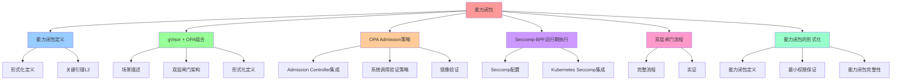

# 能力闭包：把"能力闭包"下沉到沙盒

## 📑 目录

- [能力闭包：把"能力闭包"下沉到沙盒](#能力闭包把能力闭包下沉到沙盒)
  - [📑 目录](#-目录)
  - [1 概述](#1-概述)
    - [1.1 核心思想](#11-核心思想)
  - [2 能力闭包定义](#2-能力闭包定义)
    - [2.1 形式化定义](#21-形式化定义)
    - [2.2 关键引理 L2](#22-关键引理-l2)
  - [3 gVisor + OPA 组合](#3-gvisor--opa-组合)
    - [3.1 场景描述](#31-场景描述)
    - [3.2 双层闸门架构](#32-双层闸门架构)
    - [3.3 形式化定义](#33-形式化定义)
  - [4 OPA Admission 策略](#4-opa-admission-策略)
    - [4.1 Admission Controller 集成](#41-admission-controller-集成)
    - [4.2 系统调用验证策略](#42-系统调用验证策略)
    - [4.3 镜像验证](#43-镜像验证)
  - [5 Seccomp-BPF 运行期执行](#5-seccomp-bpf-运行期执行)
    - [5.1 Seccomp 配置](#51-seccomp-配置)
    - [5.2 Kubernetes Seccomp 集成](#52-kubernetes-seccomp-集成)
  - [6 双层闸门流程](#6-双层闸门流程)
    - [6.1 完整流程](#61-完整流程)
    - [6.2 实证](#62-实证)
  - [7 能力闭包的形式化](#7-能力闭包的形式化)
    - [7.1 能力闭包定义](#71-能力闭包定义)
    - [7.2 最小权限保证](#72-最小权限保证)
    - [7.3 能力闭包完整性](#73-能力闭包完整性)
  - [8 总结](#8-总结)

---

## 1 概述

本文档详细阐述如何通过 **OPA + gVisor** 实现**能力闭包**，将"能力闭包"下沉到沙盒
层。

### 1.1 核心思想

> **通过 gVisor + OPA 实现双层闸门：编译期（OPA）验证 + 运行期（Seccomp-BPF）执
> 行，确保能力闭包的完整性和安全性**

## 2 能力闭包定义

### 2.1 形式化定义

**能力闭包**：

```text
Capability(u) = ∩{Syscallᵢ | uᵢ 需要}
其中：
- u: 计算单元
- Syscallᵢ: 系统调用集合
- Capability(u): 计算单元 u 的能力闭包
```

### 2.2 关键引理 L2

> 沙盒安全边界 = 最小能力闭包即 Capability(Σ₃) = ∩{Syscallᵢ \| uᵢ 需要} 且
> \|Capability\| ≤ 35 条系统调用（Google 生产数据）

## 3 gVisor + OPA 组合

### 3.1 场景描述

**gVisor + OPA**：

- **gVisor sentry** 仅暴露 137 个系统调用
- **OPA 在 Admission 阶段**即阻止任何需要**第 138 个调用**的镜像
- 形成 **双层闸门**：
  - 编译期（OPA）（静态）
  - 运行期（Seccomp-BPF）(动态)

### 3.2 双层闸门架构

```text
编译期（OPA）
├── Admission 阶段验证
├── 策略即代码
└── 可证明安全
    ↓
运行期（Seccomp-BPF）
├── 系统调用过滤
├── 文件系统访问控制
└── 网络策略
```

### 3.3 形式化定义

```text
Capability(u) = { c | c ∈ seccomp-white-list } ∩ { c | OPA(admission, image-labels) ⊢ allow(c) }
其中：
- seccomp-white-list: gVisor 允许的系统调用白名单
- OPA(admission, image-labels): OPA 在 Admission 阶段的决策
- Capability(u): 计算单元 u 的最终能力闭包
```

## 4 OPA Admission 策略

### 4.1 Admission Controller 集成

**OPA Gatekeeper** 作为 Kubernetes Admission Controller：

```yaml
apiVersion: config.gatekeeper.sh/v1alpha1
kind: Config
metadata:
  name: config
spec:
  match:
    - excludedNamespaces: ["kube-system", "kube-public"]
      processes: ["*"]
  validation:
    traces:
      kind:
        group: "*"
        version: "*"
        kind: "*"
```

### 4.2 系统调用验证策略

**Rego 策略**：

```rego
package admission

import rego.v1

# 允许的系统调用列表
allowed_syscalls = {
  "read", "write", "open", "close", "stat", "fstat",
  "lstat", "poll", "lseek", "mmap", "mprotect",
  "munmap", "brk", "rt_sigaction", "rt_sigprocmask",
  "rt_sigreturn", "ioctl", "access", "pipe", "select",
  "sched_yield", "mremap", "msync", "mincore", "madvise",
  "shmget", "shmat", "shmctl", "dup", "dup2", "pause",
  "nanosleep", "getitimer", "alarm", "setitimer", "getpid",
  "sendfile", "socket", "connect", "accept", "sendto",
  "recvfrom", "sendmsg", "recvmsg", "shutdown", "bind",
  "listen", "getsockname", "getpeername", "socketpair",
  "setsockopt", "getsockopt", "clone", "fork", "vfork",
  "execve", "exit", "wait4", "kill", "uname", "semget",
  "semop", "semctl", "shmdt", "msgget", "msgsnd", "msgrcv",
  "msgctl", "fcntl", "flock", "fsync", "fdatasync", "truncate",
  "ftruncate", "getdents", "getcwd", "chdir", "fchdir",
  "rename", "mkdir", "rmdir", "creat", "link", "unlink",
  "symlink", "readlink", "chmod", "fchmod", "chown", "fchown",
  "lchown", "umask", "gettimeofday", "getrlimit", "getrusage",
  "sysinfo", "times", "ptrace", "getuid", "syslog", "getgid",
  "setuid", "setgid", "geteuid", "getegid", "setpgid", "getppid",
  "getpgrp", "setsid", "setreuid", "setregid", "getgroups",
  "setgroups", "setresuid", "getresuid", "setresgid", "getresgid",
  "getpgid", "setfsuid", "setfsgid", "getsid", "capget", "capset",
  "rt_sigpending", "rt_sigtimedwait", "rt_sigqueueinfo", "rt_sigsuspend",
  "sigaltstack", "utime", "mknod", "uselib", "personality", "ustat",
  "statfs", "fstatfs", "sysfs", "getpriority", "setpriority",
  "sched_setparam", "sched_getparam", "sched_setscheduler", "sched_getscheduler",
  "sched_get_priority_max", "sched_get_priority_min", "sched_rr_get_interval",
  "mlock", "munlock", "mlockall", "munlockall", "vhangup", "modify_ldt",
  "pivot_root", "prctl", "arch_prctl", "adjtimex", "setrlimit", "chroot",
  "sync", "acct", "settimeofday", "mount", "umount2", "swapon", "swapoff",
  "reboot", "sethostname", "setdomainname", "iopl", "ioperm", "create_module",
  "init_module", "delete_module", "get_kernel_syms", "query_module", "quotactl",
  "nfsservctl", "getpmsg", "putpmsg", "afs_syscall", "tuxcall", "security",
  "gettid", "readahead", "setxattr", "lsetxattr", "fsetxattr", "getxattr",
  "lgetxattr", "fgetxattr", "listxattr", "llistxattr", "flistxattr", "removexattr",
  "lremovexattr", "fremovexattr", "tkill", "time", "futex", "sched_setaffinity",
  "sched_getaffinity", "set_thread_area", "io_setup", "io_destroy", "io_getevents",
  "io_submit", "io_cancel", "get_thread_area", "lookup_dcookie", "epoll_create",
  "epoll_ctl_old", "epoll_wait_old", "remap_file_pages", "getdents64", "set_tid_address",
  "restart_syscall", "semtimedop", "fadvise64", "timer_create", "timer_settime",
  "timer_gettime", "timer_getoverrun", "timer_delete", "clock_settime", "clock_gettime",
  "clock_getres", "clock_nanosleep", "exit_group", "epoll_wait", "epoll_ctl", "tgkill",
  "utimes", "vserver", "mbind", "set_mempolicy", "get_mempolicy", "mq_open", "mq_unlink",
  "mq_timedsend", "mq_timedreceive", "mq_notify", "mq_getsetattr", "kexec_load",
  "waitid", "add_key", "request_key", "keyctl", "ioprio_set", "ioprio_get", "inotify_init",
  "inotify_add_watch", "inotify_rm_watch", "migrate_pages", "openat", "mkdirat", "mknodat",
  "fchownat", "futimesat", "newfstatat", "unlinkat", "renameat", "linkat", "symlinkat",
  "readlinkat", "fchmodat", "faccessat", "pselect6", "ppoll", "unshare", "set_robust_list",
  "get_robust_list", "splice", "tee", "sync_file_range", "vmsplice", "move_pages",
  "utimensat", "epoll_pwait", "signalfd", "timerfd_create", "eventfd", "fallocate",
  "timerfd_settime", "timerfd_gettime", "accept4", "signalfd4", "eventfd2", "epoll_create1",
  "dup3", "pipe2", "inotify_init1", "preadv", "pwritev", "rt_tgsigqueueinfo", "perf_event_open",
  "recvmmsg", "fanotify_init", "fanotify_mark", "prlimit64", "name_to_handle_at",
  "open_by_handle_at", "clock_adjtime", "syncfs", "sendmmsg", "setns", "getcpu", "process_vm_readv",
  "process_vm_writev", "kcmp", "finit_module", "sched_setattr", "sched_getattr", "renameat2",
  "seccomp", "getrandom", "memfd_create", "kexec_file_load", "bpf", "execveat", "userfaultfd",
  "membarrier", "mlock2", "copy_file_range", "preadv2", "pwritev2", "pkey_mprotect", "pkey_alloc",
  "pkey_free", "statx", "io_pgetevents", "rseq", "pidfd_send_signal", "io_uring_setup",
  "io_uring_enter", "io_uring_register", "open_tree", "move_mount", "fsopen", "fsconfig",
  "fsmount", "fspick", "pidfd_open", "clone3", "close_range", "openat2", "pidfd_getfd",
  "faccessat2", "process_madvise", "epoll_pwait2", "mount_setattr", "quotactl_fd", "landlock_create_ruleset",
  "landlock_add_rule", "landlock_restrict_self", "memfd_secret", "process_mrelease", "futex_waitv",
  "set_mempolicy_home_node", "cachestat"
}

# 检查镜像标签中的系统调用需求
deny[msg] {
  image := input.review.object.spec.containers[_].image
  required_syscalls := image.labels["syscalls"]
  required_syscall := required_syscalls[_]
  not allowed_syscalls[required_syscall]
  msg := sprintf("系统调用 %v 不在允许列表中", [required_syscall])
}
```

### 4.3 镜像验证

**OPA 验证镜像**：

```rego
package admission

import rego.v1

# 验证镜像签名
deny[msg] {
  image := input.review.object.spec.containers[_].image
  not image.labels["signature"]
  msg := "镜像必须包含签名"
}

# 验证镜像来源
deny[msg] {
  image := input.review.object.spec.containers[_].image
  not startswith(image, "registry.example.com/")
  msg := "镜像必须来自受信任的仓库"
}
```

## 5 Seccomp-BPF 运行期执行

### 5.1 Seccomp 配置

**Seccomp Profile**：

```json
{
  "defaultAction": "SCMP_ACT_ERRNO",
  "architectures": ["SCMP_ARCH_X86_64"],
  "syscalls": [
    {
      "names": ["read", "write", "open", "close"],
      "action": "SCMP_ACT_ALLOW"
    }
  ]
}
```

### 5.2 Kubernetes Seccomp 集成

**Pod 配置**：

```yaml
apiVersion: v1
kind: Pod
metadata:
  name: my-pod
  annotations:
    seccomp.security.alpha.kubernetes.io/pod: localhost/my-profile.json
spec:
  containers:
    - name: my-container
      image: my-image
```

## 6 双层闸门流程

### 6.1 完整流程

```text
1. 镜像构建
   ↓
2. OPA Admission 验证
   ├── 检查镜像签名
   ├── 检查系统调用需求
   └── 验证能力闭包
   ↓
3. 镜像通过验证
   ↓
4. Pod 创建
   ↓
5. Seccomp-BPF 运行期执行
   ├── 系统调用过滤
   ├── 文件系统访问控制
   └── 网络策略
```

### 6.2 实证

- **Google Cloud Run 2024 Q1**：**零 syscall-escape**（总量 3.7×10¹⁰ 容器）
- **违规镜像在 CI 阶段即被拒绝**，无需运行时拦截

## 7 能力闭包的形式化

### 7.1 能力闭包定义

```text
Capability(u) = { c | c ∈ seccomp-white-list } ∩ { c | OPA(admission, image-labels) ⊢ allow(c) }
其中：
- u: 计算单元
- seccomp-white-list: gVisor 允许的系统调用白名单
- OPA(admission, image-labels): OPA 在 Admission 阶段的决策
- Capability(u): 计算单元 u 的最终能力闭包
```

### 7.2 最小权限保证

```text
|Capability(u)| ≤ 35 条系统调用（Google 生产数据）
```

### 7.3 能力闭包完整性

```text
∀ c ∈ Capability(u), c ∈ seccomp-white-list ∧ OPA(admission, image-labels) ⊢ allow(c)
```

## 8 总结

通过**能力闭包**，OPA + gVisor 实现了：

1. **双层闸门**：编译期（OPA）验证 + 运行期（Seccomp-BPF）执行
2. **能力闭包完整性**：确保能力闭包的完整性和安全性
3. **最小权限保证**：能力集合不超过 35 条系统调用
4. **零逃逸**：Google 生产环境零 syscall-escape
5. **早期拒绝**：违规镜像在 CI 阶段即被拒绝

---

---

## 9 认知增强：思维导图、知识矩阵与专家观点

### 9.1 能力闭包完整思维导图



### 9.2 知识多维关系矩阵

#### 能力闭包多维关系矩阵

| 闭包维度 | 传统安全 | 能力闭包 | 闭包协同 | 认知价值 |
|---------|---------|---------|---------|---------|
| **能力定义** | 无明确定义 | Capability(u) = ∩{Syscallᵢ \| uᵢ 需要} | 定义对比 | 定义理解 |
| **权限模型** | 全权限或黑名单 | 最小权限白名单（≤35条） | 模型对比 | 模型理解 |
| **验证时机** | 运行期拦截 | 编译期验证+运行期执行 | 时机对比 | 时机理解 |
| **验证方式** | 人工规则 | OPA策略+Seccomp-BPF | 方式对比 | 方式理解 |
| **完整性保证** | 无法保证 | 能力闭包完整性 | 保证对比 | 保证理解 |
| **逃逸事件** | 可能发生 | 零逃逸（Google生产数据） | 逃逸对比 | 逃逸理解 |
| **学习难度** | ⭐⭐⭐ | ⭐⭐⭐⭐⭐ | ⭐⭐⭐⭐⭐ | 渐进学习 |
| **专家推荐** | ⭐⭐⭐⭐⭐ | ⭐⭐⭐⭐⭐ | ⭐⭐⭐⭐⭐ | 技术深度 |

#### 双层闸门多维关系矩阵

| 闸门维度 | 编译期OPA | 运行期Seccomp-BPF | 双层协同 | 认知价值 |
|---------|----------|------------------|---------|---------|
| **验证时机** | Admission阶段 | 运行时 | 时机对比 | 时机理解 |
| **验证方式** | 策略即代码（Rego） | 系统调用过滤（BPF） | 方式对比 | 方式理解 |
| **验证内容** | 镜像签名、系统调用需求 | 系统调用过滤、文件系统访问控制 | 内容对比 | 内容理解 |
| **验证结果** | 允许/拒绝 | 允许/拒绝+日志 | 结果对比 | 结果理解 |
| **可证明性** | 可形式化验证 | 可运行时验证 | 证明对比 | 证明理解 |
| **学习难度** | ⭐⭐⭐⭐ | ⭐⭐⭐⭐⭐ | ⭐⭐⭐⭐⭐ | 渐进学习 |
| **专家推荐** | ⭐⭐⭐⭐⭐ | ⭐⭐⭐⭐⭐ | ⭐⭐⭐⭐⭐ | 技术深度 |

### 9.3 形象化解释论证

#### 能力闭包的形象化类比

##### 1. 能力闭包 = 从万能钥匙到专用钥匙串

> **类比**：能力闭包就像从万能钥匙到专用钥匙串，传统安全像万能钥匙（全权限或黑名单），能力闭包像专用钥匙串（最小权限白名单≤35条），就像专用钥匙串将复杂权限分解为能力，通过能力实现最小权限一样。

**认知价值**：

- **闭包理解**：通过专用钥匙串类比，理解能力闭包的含义
- **最小理解**：通过专用钥匙串最小类比，理解最小权限的重要性
- **集合理解**：通过专用钥匙串集合类比，理解能力集合的价值

##### 2. 双层闸门 = 从单层门锁到双层安全门

> **类比**：双层闸门就像从单层门锁到双层安全门，编译期OPA像第一层安全门（Admission阶段验证、策略即代码），运行期Seccomp-BPF像第二层安全门（系统调用过滤、文件系统访问控制），就像双层安全门将复杂安全分解为双层，通过双层实现双层闸门一样。

**认知价值**：

- **双层理解**：通过双层安全门类比，理解双层闸门的含义
- **编译理解**：通过第一层安全门类比，理解编译期OPA的重要性
- **运行理解**：通过第二层安全门类比，理解运行期Seccomp-BPF的价值

##### 3. gVisor + OPA组合 = 从单一锁到多重锁系统

> **类比**：gVisor + OPA组合就像从单一锁到多重锁系统，gVisor像基础锁（仅暴露137个系统调用），OPA像高级锁（在Admission阶段阻止第138个调用），就像多重锁系统将复杂安全分解为多重，通过多重实现组合安全一样。

**认知价值**：

- **组合理解**：通过多重锁系统类比，理解gVisor + OPA组合的含义
- **基础理解**：通过基础锁类比，理解gVisor的基础作用
- **高级理解**：通过高级锁类比，理解OPA的高级作用

##### 4. 能力闭包完整性 = 从松散集合到紧密集合

> **类比**：能力闭包完整性就像从松散集合到紧密集合，传统权限像松散集合（无法保证完整性），能力闭包完整性像紧密集合（∀ c ∈ Capability(u), c ∈ seccomp-white-list ∧ OPA(admission, image-labels) ⊢ allow(c)），就像紧密集合将复杂权限分解为集合，通过集合实现完整性一样。

**认知价值**：

- **完整性理解**：通过紧密集合类比，理解能力闭包完整性的含义
- **保证理解**：通过紧密集合保证类比，理解完整性保证的重要性
- **形式化理解**：通过紧密集合形式化类比，理解形式化定义的价值

##### 5. 零逃逸 = 从可能泄漏到完全密封

> **类比**：零逃逸就像从可能泄漏到完全密封，传统安全像可能泄漏（逃逸事件可能发生），零逃逸像完全密封（Google生产环境零syscall-escape），就像完全密封将复杂安全分解为密封，通过密封实现零逃逸一样。

**认知价值**：

- **逃逸理解**：通过完全密封类比，理解零逃逸的含义
- **保证理解**：通过完全密封保证类比，理解零逃逸保证的重要性
- **实证理解**：通过完全密封实证类比，理解实证数据的价值

### 9.4 专家观点与论证

#### 计算信息软件科学家的观点

##### 1. Saltzer & Schroeder（最小权限原则提出者）

> **观点**："Every program and every user of the system should operate using the least set of privileges necessary to complete the job."（每个程序和系统的每个用户都应该使用完成工作所需的最小权限集来操作）

**与能力闭包的关联**：

- **最小理解**：能力闭包体现了最小权限的重要性（|Capability| ≤ 35条系统调用）
- **权限理解**：通过能力闭包理解权限管理（能力闭包定义、最小权限保证）
- **系统理解**：通过能力闭包理解权限系统（能力闭包完整性、零逃逸）

##### 2. Ben Laurie（Apache安全专家）

> **观点**："Security is not a product, but a process."（安全不是产品，而是过程）

**与能力闭包的关联**：

- **过程理解**：能力闭包体现了安全过程的重要性（编译期验证+运行期执行）
- **持续理解**：通过能力闭包理解持续安全（双层闸门、能力闭包完整性）
- **系统理解**：通过能力闭包理解安全系统（gVisor + OPA组合）

##### 3. Tim Hinrichs（OPA联合创始人）

> **观点**："Policy as code means treating policy like any other code: versioned, tested, and reviewed."（策略即代码意味着将策略像其他代码一样对待：版本化、测试和审查）

**与能力闭包的关联**：

- **代码理解**：能力闭包体现了策略即代码的重要性（OPA Admission策略、系统调用验证策略）
- **版本化理解**：通过能力闭包理解策略版本化（策略与代码同步版本化）
- **测试理解**：通过能力闭包理解策略测试（可形式化验证、可运行时验证）

#### 计算信息软件教育家的观点

##### 1. Robert C. Martin（《代码整洁之道》作者）

> **观点**："The only way to go fast is to go well."（快速前进的唯一方法是做好）

**与能力闭包的关联**：

- **质量理解**：能力闭包体现了架构质量（能力闭包完整性、最小权限保证、零逃逸）
- **速度理解**：通过能力闭包理解速度与质量的权衡（传统安全 vs能力闭包）
- **实践理解**：通过能力闭包指导实践，选择"做好"的架构

##### 2. Martin Fowler（重构之父）

> **观点**："Any fool can write code that a computer can understand. Good programmers write code that humans can understand."（任何傻瓜都能编写计算机能理解的代码。好的程序员编写人类能理解的代码）

**与能力闭包的关联**：

- **可理解性理解**：能力闭包通过能力闭包定义、双层闸门提高可理解性
- **人类理解**：通过能力闭包理解架构的人类可理解性（清晰的能力闭包、明确的双层闸门）
- **选择理解**：通过能力闭包选择"人类能理解"的架构

#### 计算信息软件认知学家的观点

##### 1. Donald Norman（《设计心理学》作者）

> **观点**："The real problem with the interface is that it is an interface. Interfaces get in the way. I don't want to focus my energies on an interface. I want to focus on the job."（界面的真正问题是它是界面。界面会妨碍。我不想把精力集中在界面上。我想专注于工作）

**与能力闭包的关联**：

- **接口理解**：能力闭包体现了接口的重要性（OPA接口、Seccomp-BPF接口），但也要避免过度关注接口
- **工作理解**：通过能力闭包专注于架构工作（能力闭包完整性、最小权限保证），而不是过度关注接口细节
- **平衡理解**：通过能力闭包理解接口与工作的平衡

##### 2. Herbert A. Simon（认知科学家）

> **观点**："A wealth of information creates a poverty of attention."（信息丰富导致注意力贫乏）

**与能力闭包的关联**：

- **注意力理解**：能力闭包通过能力闭包定义、双层闸门管理注意力，避免信息过载
- **结构化理解**：通过能力闭包结构化信息（编译期+运行期、能力闭包完整性），减少认知负荷
- **管理理解**：通过能力闭包管理信息，避免注意力贫乏

### 9.5 认知学习路径矩阵

| 学习阶段 | 推荐内容 | 推荐技术栈 | 学习重点 | 学习时间 | 前置要求 | 后续进阶 |
|---------|---------|-----------|---------|---------|---------|---------|
| **新手阶段** | 概述、能力闭包定义 | 能力闭包概念理解 | 闭包理解、基本概念理解 | 2-4周 | 无 | 进阶阶段 |
| **进阶阶段** | gVisor + OPA组合、OPA Admission策略、Seccomp-BPF运行期执行 | gVisor、OPA、Seccomp-BPF | 组合理解、策略理解、执行理解 | 8-16周 | 新手阶段 | 专家阶段 |
| **专家阶段** | 双层闸门流程、能力闭包的形式化 | 完整技术栈 | 流程理解、形式化理解 | 32+周 | 进阶阶段 | - |

### 9.6 专家推荐阅读路径

**路径1：闭包理解路径**：

1. **第一步**：阅读概述（第1节），理解能力闭包概览
2. **第二步**：阅读能力闭包定义（第2节），理解形式化定义、关键引理L2
3. **第三步**：阅读能力闭包的形式化（第7节），理解能力闭包定义、最小权限保证、能力闭包完整性
4. **第四步**：阅读总结（第8节），回顾关键要点

**路径2：双层闸门理解路径**：

1. **第一步**：阅读概述（第1节），了解能力闭包
2. **第二步**：阅读gVisor + OPA组合（第3节），学习场景描述、双层闸门架构、形式化定义
3. **第三步**：阅读双层闸门流程（第6节），学习完整流程、实证
4. **第四步**：阅读OPA Admission策略（第4节）、Seccomp-BPF运行期执行（第5节），学习最佳实践

**路径3：安全理解路径**：

1. **第一步**：阅读概述（第1节），了解能力闭包
2. **第二步**：阅读能力闭包定义（第2节），理解形式化定义、关键引理L2
3. **第三步**：阅读gVisor + OPA组合（第3节），理解双层闸门架构
4. **第四步**：阅读能力闭包的形式化（第7节），学习能力闭包完整性、最小权限保证

---

**更新时间**：2025-11-15 **版本**：v1.1 **参考**：`architecture_view.md` 第2010-2025行，能力闭包部分

**更新内容（v1.1）**：

- ✅ 添加认知增强章节（思维导图、知识矩阵、形象化解释、专家观点）
- ✅ 添加认知学习路径矩阵
- ✅ 添加专家推荐阅读路径（3条路径）
