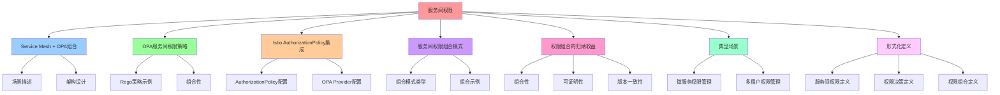

# 服务间权限：把"服务间权限"组合化

## 📑 目录

- [服务间权限：把"服务间权限"组合化](#服务间权限把服务间权限组合化)
  - [📑 目录](#-目录)
  - [1 概述](#1-概述)
    - [1.1 核心思想](#11-核心思想)
  - [2 Service Mesh + OPA 组合](#2-service-mesh--opa-组合)
    - [2.1 场景描述](#21-场景描述)
    - [2.2 架构设计](#22-架构设计)
  - [3 OPA 服务间权限策略](#3-opa-服务间权限策略)
    - [3.1 Rego 策略示例](#31-rego-策略示例)
    - [3.2 组合性](#32-组合性)
  - [4 Istio AuthorizationPolicy 集成](#4-istio-authorizationpolicy-集成)
    - [4.1 AuthorizationPolicy 配置](#41-authorizationpolicy-配置)
    - [4.2 OPA Provider 配置](#42-opa-provider-配置)
  - [5 服务间权限组合模式](#5-服务间权限组合模式)
    - [5.1 组合模式类型](#51-组合模式类型)
    - [5.2 组合示例](#52-组合示例)
  - [6 权限组合的归纳收益](#6-权限组合的归纳收益)
    - [6.1 组合性](#61-组合性)
    - [6.2 可证明性](#62-可证明性)
    - [6.3 版本一致性](#63-版本一致性)
  - [7 典型场景](#7-典型场景)
    - [7.1 微服务权限管理](#71-微服务权限管理)
    - [7.2 多租户权限管理](#72-多租户权限管理)
  - [8 形式化定义](#8-形式化定义)
    - [8.1 服务间权限定义](#81-服务间权限定义)
    - [8.2 权限决策定义](#82-权限决策定义)
    - [8.3 权限组合定义](#83-权限组合定义)
  - [9 总结](#9-总结)

---

## 1 概述

本文档详细阐述如何通过 **Service Mesh + OPA** 实现**服务间权限**的组合化管理。

### 1.1 核心思想

> **通过 Service Mesh + OPA 实现服务间权限的组合化，同一策略可附加到任意
> <source, destination> 对，实现可证明、可版本化的权限控制**

## 2 Service Mesh + OPA 组合

### 2.1 场景描述

**Service Mesh + OPA**：

- **身份** = SPIFFE ID
- **流量属性** = HTTP method, path, header
- **OPA 作为外部授权服务**（Envoy ext_authz）

### 2.2 架构设计

```text
Client Pod
├── Istio Sidecar
└── OPA Agent (PDP)
    └── Decision: allow / deny / rate-limit / routing
```

## 3 OPA 服务间权限策略

### 3.1 Rego 策略示例

**服务间权限策略**：

```rego
package mesh.authz

import rego.v1

default allow = false

# 允许前端访问订单服务
allow {
  input.attributes.destination.principal == "spiffe://A/ns/default/sa/frontend"
  input.attributes.source.principal == "spiffe://B/ns/default/sa/order-service"
  input.attributes.request.http.method == "GET"
  input.attributes.request.http.path == "/orders"
}

# 允许后端访问支付服务
allow {
  input.attributes.destination.principal == "spiffe://A/ns/default/sa/order-service"
  input.attributes.source.principal == "spiffe://B/ns/default/sa/payment-service"
  input.attributes.request.http.method == "POST"
  input.attributes.request.http.path == "/payments"
}

# 允许监控服务访问 metrics 端点
allow {
  input.attributes.request.http.path == "/metrics"
  input.attributes.source.principal == "spiffe://A/ns/default/sa/prometheus"
}
```

### 3.2 组合性

**同一策略可附加到任意 <source, destination> 对**：

```rego
# 通用权限策略
allow {
  source_allowed[input.attributes.source.principal]
  destination_allowed[input.attributes.destination.principal]
  method_allowed[input.attributes.request.http.method]
  path_allowed[input.attributes.request.http.path]
}

# 允许的服务列表
source_allowed = {
  "spiffe://A/ns/default/sa/frontend",
  "spiffe://A/ns/default/sa/order-service",
  "spiffe://A/ns/default/sa/payment-service"
}

destination_allowed = {
  "spiffe://B/ns/default/sa/order-service",
  "spiffe://B/ns/default/sa/payment-service",
  "spiffe://B/ns/default/sa/inventory-service"
}

method_allowed = {
  "GET",
  "POST"
}

path_allowed = {
  "/orders",
  "/payments",
  "/inventory",
  "/metrics"
}
```

## 4 Istio AuthorizationPolicy 集成

### 4.1 AuthorizationPolicy 配置

**Istio AuthorizationPolicy**：

```yaml
apiVersion: security.istio.io/v1beta1
kind: AuthorizationPolicy
metadata:
  name: order-service-policy
  namespace: default
spec:
  selector:
    matchLabels:
      app: order-service
  action: CUSTOM
  provider:
    name: opa
  rules:
    - to:
        - operation:
            methods: ["GET", "POST"]
            paths: ["/orders", "/orders/*"]
```

### 4.2 OPA Provider 配置

**OPA Provider**：

```yaml
apiVersion: security.istio.io/v1beta1
kind: AuthorizationPolicy
metadata:
  name: opa-provider
spec:
  provider:
    name: opa
    config:
      opa:
        endpoint: http://opa:8181/v1/data/mesh/authz/allow
```

## 5 服务间权限组合模式

### 5.1 组合模式类型

| 组合模式     | 说明                        | 典型实现       |
| ------------ | --------------------------- | -------------- |
| **基于身份** | 根据 SPIFFE ID 授权         | OPA + SPIFFE   |
| **基于路径** | 根据 HTTP path 授权         | OPA + Envoy    |
| **基于方法** | 根据 HTTP method 授权       | OPA + Envoy    |
| **基于标签** | 根据 Kubernetes labels 授权 | OPA + K8s      |
| **基于时间** | 根据时间范围授权            | OPA + 时间策略 |
| **基于条件** | 根据复杂条件授权            | OPA + Rego     |

### 5.2 组合示例

**基于身份 + 路径 + 方法**：

```rego
package mesh.authz

import rego.v1

default allow = false

allow {
  # 身份验证
  source.principal == "spiffe://A/ns/default/sa/frontend"
  destination.principal == "spiffe://B/ns/default/sa/order-service"

  # 路径验证
  request.http.path == "/orders"

  # 方法验证
  request.http.method == "GET"
}
```

## 6 权限组合的归纳收益

### 6.1 组合性

**同一策略可附加到任意 <source, destination> 对**：

- 策略可以组合和重用
- 支持复杂的权限规则

### 6.2 可证明性

**Rego → AST → SAT，可在 CI 中跑 tautology check**：

- 策略决策等价于 SAT 问题
- 可自动验证策略的正确性

### 6.3 版本一致性

**策略与镜像共用 Git SHA，回滚即 git revert**：

- 策略与代码同步版本化
- 支持快速回滚

## 7 典型场景

### 7.1 微服务权限管理

**场景**：管理微服务间的访问权限

**策略**：

```rego
package mesh.authz

import rego.v1

default allow = false

# 允许服务访问
allow {
  source_service := input.attributes.source.principal
  destination_service := input.attributes.destination.principal
  allowed_routes[source_service][destination_service]
}

# 允许的路由
allowed_routes = {
  "spiffe://A/ns/default/sa/frontend": {
    "spiffe://B/ns/default/sa/order-service": ["GET", "POST"],
    "spiffe://B/ns/default/sa/payment-service": ["POST"]
  },
  "spiffe://A/ns/default/sa/order-service": {
    "spiffe://B/ns/default/sa/payment-service": ["POST"],
    "spiffe://B/ns/default/sa/inventory-service": ["GET", "POST"]
  }
}
```

### 7.2 多租户权限管理

**场景**：多租户 SaaS 应用的权限管理

**策略**：

```rego
package mesh.authz

import rego.v1

default allow = false

# 允许租户访问自己的资源
allow {
  source_tenant := input.attributes.source.labels["tenant"]
  destination_tenant := input.attributes.destination.labels["tenant"]
  source_tenant == destination_tenant
}
```

## 8 形式化定义

### 8.1 服务间权限定义

```text
服务间权限 P = ⟨source, destination, method, path, policy⟩
其中：
- source: 源服务身份（SPIFFE ID）
- destination: 目标服务身份（SPIFFE ID）
- method: HTTP 方法
- path: HTTP 路径
- policy: 权限策略（OPA Rego）
```

### 8.2 权限决策定义

```text
权限决策 D = OPA(source, destination, method, path)
其中：
- D ∈ {allow, deny}
- OPA: OPA 决策函数
```

### 8.3 权限组合定义

```text
权限组合 C = P₁ ∘ P₂ ∘ ... ∘ Pₙ
其中：
- Pᵢ: 权限策略
- ∘: 组合操作
```

## 9 总结

通过**服务间权限**，OPA + Service Mesh 实现了：

1. **组合性**：同一策略可附加到任意 <source, destination> 对
2. **可证明性**：策略决策等价于 SAT 问题，可自动验证
3. **版本一致性**：策略与代码同步版本化
4. **灵活性**：支持复杂的权限规则和组合模式
5. **可审计性**：所有权限决策可审计和追溯

---

---

## 10 认知增强：思维导图、知识矩阵与专家观点

### 10.1 服务间权限完整思维导图



### 10.2 知识多维关系矩阵

#### 服务间权限多维关系矩阵

| 权限维度 | 传统权限 | 服务间权限 | 权限协同 | 认知价值 |
|---------|---------|-----------|---------|---------|
| **权限定义** | 分散在代码中 | 策略即代码（OPA Rego） | 定义对比 | 定义理解 |
| **权限模型** | 硬编码权限 | 组合化权限（<source, destination>对） | 模型对比 | 模型理解 |
| **权限验证** | 应用层验证 | Service Mesh + OPA验证 | 验证对比 | 验证理解 |
| **权限组合** | 无法组合 | 可组合权限策略 | 组合对比 | 组合理解 |
| **可证明性** | 无法证明 | 策略决策≡SAT问题 | 证明对比 | 证明理解 |
| **版本化** | 无法版本化 | 策略与代码同步版本化 | 版本化对比 | 版本化理解 |
| **学习难度** | ⭐⭐⭐ | ⭐⭐⭐⭐ | ⭐⭐⭐⭐ | 渐进学习 |
| **专家推荐** | ⭐⭐⭐⭐⭐ | ⭐⭐⭐⭐⭐ | ⭐⭐⭐⭐⭐ | 技术深度 |

#### 服务间权限组合模式多维关系矩阵

| 组合模式维度 | 基于身份 | 基于路径 | 基于方法 | 基于标签 | 基于时间 | 基于条件 | 组合协同 | 认知价值 |
|------------|---------|---------|---------|---------|---------|---------|---------|---------|
| **说明** | 根据SPIFFE ID授权 | 根据HTTP path授权 | 根据HTTP method授权 | 根据Kubernetes labels授权 | 根据时间范围授权 | 根据复杂条件授权 | 说明对比 | 说明理解 |
| **典型实现** | OPA + SPIFFE | OPA + Envoy | OPA + Envoy | OPA + K8s | OPA + 时间策略 | OPA + Rego | 实现对比 | 实现理解 |
| **适用场景** | 服务身份验证 | 路径级权限控制 | 方法级权限控制 | 标签级权限控制 | 时间范围权限控制 | 复杂条件权限控制 | 场景对比 | 场景理解 |
| **学习难度** | ⭐⭐⭐⭐ | ⭐⭐⭐ | ⭐⭐⭐ | ⭐⭐⭐ | ⭐⭐⭐⭐ | ⭐⭐⭐⭐⭐ | ⭐⭐⭐⭐ | 渐进学习 |
| **专家推荐** | ⭐⭐⭐⭐⭐ | ⭐⭐⭐⭐⭐ | ⭐⭐⭐⭐⭐ | ⭐⭐⭐⭐⭐ | ⭐⭐⭐⭐⭐ | ⭐⭐⭐⭐⭐ | ⭐⭐⭐⭐⭐ | 技术深度 |

### 10.3 形象化解释论证

#### 服务间权限的形象化类比

##### 1. 服务间权限 = 从门禁卡到智能门禁系统

> **类比**：服务间权限就像从门禁卡到智能门禁系统，传统权限像门禁卡（硬编码权限），服务间权限像智能门禁系统（策略即代码、组合化权限），就像智能门禁系统将复杂权限分解为系统，通过系统实现组合化权限一样。

**认知价值**：

- **权限理解**：通过智能门禁系统类比，理解服务间权限的含义
- **组合理解**：通过智能门禁系统组合类比，理解组合化权限的重要性
- **策略理解**：通过智能门禁系统策略类比，理解策略即代码的价值

##### 2. Service Mesh + OPA组合 = 从单一门卫到智能安保系统

> **类比**：Service Mesh + OPA组合就像从单一门卫到智能安保系统，Service Mesh像门卫（流量控制），OPA像智能安保系统（权限决策），就像智能安保系统将复杂权限分解为系统，通过系统实现权限控制一样。

**认知价值**：

- **组合理解**：通过智能安保系统类比，理解Service Mesh + OPA组合的含义
- **流量理解**：通过门卫流量控制类比，理解Service Mesh的作用
- **决策理解**：通过智能安保系统决策类比，理解OPA的作用

##### 3. 权限组合 = 从单一锁到多重锁系统

> **类比**：权限组合就像从单一锁到多重锁系统，基于身份像身份锁（SPIFFE ID），基于路径像路径锁（HTTP path），基于方法像方法锁（HTTP method），就像多重锁系统将复杂权限分解为多重，通过多重实现权限组合一样。

**认知价值**：

- **组合理解**：通过多重锁系统类比，理解权限组合的含义
- **身份理解**：通过身份锁类比，理解基于身份的权限控制的重要性
- **路径理解**：通过路径锁类比，理解基于路径的权限控制的价值
- **方法理解**：通过方法锁类比，理解基于方法的权限控制的作用

##### 4. 权限组合的归纳收益 = 从手工管理到自动化管理

> **类比**：权限组合的归纳收益就像从手工管理到自动化管理，组合性像自动化组合（同一策略可附加到任意<source, destination>对），可证明性像自动化证明（策略决策≡SAT问题），版本一致性像自动化版本（策略与代码同步版本化），就像自动化管理将复杂收益分解为自动化，通过自动化实现归纳收益一样。

**认知价值**：

- **收益理解**：通过自动化管理类比，理解权限组合的归纳收益的含义
- **组合理解**：通过自动化组合类比，理解组合性的重要性
- **证明理解**：通过自动化证明类比，理解可证明性的价值
- **版本理解**：通过自动化版本类比，理解版本一致性的作用

##### 5. 服务间权限形式化 = 从自然语言到形式化语言

> **类比**：服务间权限形式化就像从自然语言到形式化语言，服务间权限定义像自然语言定义（<source, destination, method, path, policy>），权限决策定义像形式化语言定义（D = OPA(source, destination, method, path)），权限组合定义像形式化组合定义（C = P₁ ∘ P₂ ∘ ... ∘ Pₙ），就像形式化语言将复杂权限分解为形式化，通过形式化实现权限形式化一样。

**认知价值**：

- **形式化理解**：通过形式化语言类比，理解服务间权限形式化的含义
- **定义理解**：通过形式化语言定义类比，理解形式化定义的重要性
- **组合理解**：通过形式化语言组合类比，理解形式化组合的价值

### 10.4 专家观点与论证

#### 计算信息软件科学家的观点

##### 1. Tim Hinrichs（OPA联合创始人）

> **观点**："Policy as code means treating policy like any other code: versioned, tested, and reviewed."（策略即代码意味着将策略像其他代码一样对待：版本化、测试和审查）

**与服务间权限的关联**：

- **代码理解**：服务间权限体现了策略即代码的重要性（OPA Rego策略、组合化权限）
- **版本化理解**：通过服务间权限理解策略版本化（策略与代码同步版本化）
- **测试理解**：通过服务间权限理解策略测试（可形式化验证、可自动验证）

##### 2. William Morgan（Linkerd创始人）

> **观点**："Service Mesh is a dedicated infrastructure layer for making service-to-service communication safe, fast, and reliable."（服务网格是用于使服务间通信安全、快速和可靠的专用基础设施层）

**与服务间权限的关联**：

- **基础设施理解**：服务间权限体现了服务网格基础设施的重要性（Service Mesh + OPA组合）
- **通信理解**：通过服务间权限理解服务间通信（身份、流量属性、权限决策）
- **系统理解**：通过服务间权限理解服务网格系统（Istio AuthorizationPolicy集成）

##### 3. David Parnas（软件工程专家）

> **观点**："The structure of a system is more important than its components."（系统的结构比其组件更重要）

**与服务间权限的关联**：

- **结构理解**：服务间权限体现了结构的重要性（权限组合模式、权限组合的归纳收益）
- **组件理解**：通过服务间权限理解组件（Service Mesh、OPA、Istio）
- **系统理解**：通过服务间权限理解系统结构（服务间权限组合模式）

#### 计算信息软件教育家的观点

##### 1. Robert C. Martin（《代码整洁之道》作者）

> **观点**："The only way to go fast is to go well."（快速前进的唯一方法是做好）

**与服务间权限的关联**：

- **质量理解**：服务间权限体现了架构质量（组合性、可证明性、版本一致性）
- **速度理解**：通过服务间权限理解速度与质量的权衡（传统权限 vs服务间权限）
- **实践理解**：通过服务间权限指导实践，选择"做好"的架构

##### 2. Martin Fowler（重构之父）

> **观点**："Any fool can write code that a computer can understand. Good programmers write code that humans can understand."（任何傻瓜都能编写计算机能理解的代码。好的程序员编写人类能理解的代码）

**与服务间权限的关联**：

- **可理解性理解**：服务间权限通过权限组合模式、权限组合的归纳收益提高可理解性
- **人类理解**：通过服务间权限理解架构的人类可理解性（清晰的权限组合、明确的归纳收益）
- **选择理解**：通过服务间权限选择"人类能理解"的架构

#### 计算信息软件认知学家的观点

##### 1. Donald Norman（《设计心理学》作者）

> **观点**："The real problem with the interface is that it is an interface. Interfaces get in the way. I don't want to focus my energies on an interface. I want to focus on the job."（界面的真正问题是它是界面。界面会妨碍。我不想把精力集中在界面上。我想专注于工作）

**与服务间权限的关联**：

- **接口理解**：服务间权限体现了接口的重要性（OPA接口、Istio接口），但也要避免过度关注接口
- **工作理解**：通过服务间权限专注于架构工作（组合性、可证明性），而不是过度关注接口细节
- **平衡理解**：通过服务间权限理解接口与工作的平衡

##### 2. Herbert A. Simon（认知科学家）

> **观点**："A wealth of information creates a poverty of attention."（信息丰富导致注意力贫乏）

**与服务间权限的关联**：

- **注意力理解**：服务间权限通过权限组合模式、权限组合的归纳收益管理注意力，避免信息过载
- **结构化理解**：通过服务间权限结构化信息（Service Mesh + OPA组合、权限组合模式），减少认知负荷
- **管理理解**：通过服务间权限管理信息，避免注意力贫乏

### 10.5 认知学习路径矩阵

| 学习阶段 | 推荐内容 | 推荐技术栈 | 学习重点 | 学习时间 | 前置要求 | 后续进阶 |
|---------|---------|-----------|---------|---------|---------|---------|
| **新手阶段** | 概述、Service Mesh + OPA组合 | 服务间权限概念理解 | 权限理解、基本概念理解 | 2-4周 | 无 | 进阶阶段 |
| **进阶阶段** | OPA服务间权限策略、Istio AuthorizationPolicy集成、服务间权限组合模式 | Service Mesh、OPA、Istio | 策略理解、集成理解、组合理解 | 8-16周 | 新手阶段 | 专家阶段 |
| **专家阶段** | 权限组合的归纳收益、典型场景、形式化定义 | 完整技术栈 | 收益理解、场景理解、形式化理解 | 32+周 | 进阶阶段 | - |

### 10.6 专家推荐阅读路径

**路径1：权限理解路径**：

1. **第一步**：阅读概述（第1节），理解服务间权限概览
2. **第二步**：阅读Service Mesh + OPA组合（第2节），理解场景描述、架构设计
3. **第三步**：阅读服务间权限组合模式（第5节），理解组合模式类型、组合示例
4. **第四步**：阅读总结（第9节），回顾关键要点

**路径2：策略理解路径**：

1. **第一步**：阅读概述（第1节），了解服务间权限
2. **第二步**：阅读OPA服务间权限策略（第3节），学习Rego策略示例、组合性
3. **第三步**：阅读Istio AuthorizationPolicy集成（第4节），学习AuthorizationPolicy配置、OPA Provider配置
4. **第四步**：阅读权限组合的归纳收益（第6节），学习组合性、可证明性、版本一致性

**路径3：形式化理解路径**：

1. **第一步**：阅读概述（第1节），了解服务间权限
2. **第二步**：阅读形式化定义（第8节），理解服务间权限定义、权限决策定义、权限组合定义
3. **第三步**：阅读典型场景（第7节），理解微服务权限管理、多租户权限管理
4. **第四步**：阅读总结（第9节），学习最佳实践

---

**更新时间**：2025-11-15 **版本**：v1.1 **参考**：`architecture_view.md` 第2028-2056行，服务间权限部分

**更新内容（v1.1）**：

- ✅ 添加认知增强章节（思维导图、知识矩阵、形象化解释、专家观点）
- ✅ 添加认知学习路径矩阵
- ✅ 添加专家推荐阅读路径（3条路径）
