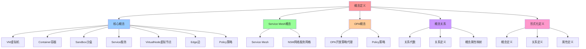

# 概念定义：VM、Container、Sandbox、Service Mesh、OPA

## 📑 目录

- [概念定义：VM、Container、Sandbox、Service Mesh、OPA](#概念定义vmcontainersandboxservice-meshopa)
  - [📑 目录](#-目录)
  - [1 概述](#1-概述)
    - [1.1 核心思想](#11-核心思想)
  - [2 核心概念定义](#2-核心概念定义)
    - [2.1 VM（虚拟机）](#21-vm虚拟机)
    - [2.2 Container（容器）](#22-container容器)
    - [2.3 Sandbox（沙盒）](#23-sandbox沙盒)
    - [2.4 Service（服务）](#24-service服务)
    - [2.5 VirtualNode（虚拟节点）](#25-virtualnode虚拟节点)
    - [2.6 Edge（边）](#26-edge边)
    - [2.7 Policy（策略）](#27-policy策略)
  - [3 Service Mesh 概念](#3-service-mesh-概念)
    - [3.1 Service Mesh](#31-service-mesh)
    - [3.2 NSM（Network Service Mesh）](#32-nsmnetwork-service-mesh)
  - [4 OPA 概念](#4-opa-概念)
    - [4.1 OPA（Open Policy Agent）](#41-opaopen-policy-agent)
    - [4.2 Policy（策略）](#42-policy策略)
  - [5 概念关系代数](#5-概念关系代数)
    - [5.1 关系代数定义](#51-关系代数定义)
    - [5.2 关系定义](#52-关系定义)
  - [6 形式化定义](#6-形式化定义)
    - [6.1 概念定义](#61-概念定义)
    - [6.2 关系定义](#62-关系定义)
    - [6.3 属性定义](#63-属性定义)
  - [7 概念属性映射](#7-概念属性映射)
    - [7.1 属性映射表](#71-属性映射表)
    - [7.2 形式化映射](#72-形式化映射)
  - [8 总结](#8-总结)
  - [9 认知增强：思维导图、知识矩阵与专家观点](#9-认知增强思维导图知识矩阵与专家观点)
    - [9.1 概念定义完整思维导图](#91-概念定义完整思维导图)
    - [9.2 知识多维关系矩阵](#92-知识多维关系矩阵)
      - [核心概念多维关系矩阵](#核心概念多维关系矩阵)
      - [概念关系代数多维关系矩阵](#概念关系代数多维关系矩阵)
    - [9.3 形象化解释论证](#93-形象化解释论证)
      - [概念定义的形象化类比](#概念定义的形象化类比)
        - [1. 概念体系 = 建筑体系](#1-概念体系--建筑体系)
        - [2. 隔离机制 = 安全门禁系统](#2-隔离机制--安全门禁系统)
        - [3. 组合关系 = 乐高积木组合](#3-组合关系--乐高积木组合)
        - [4. 关系代数 = 数学集合论](#4-关系代数--数学集合论)
        - [5. 形式化定义 = 法律条文](#5-形式化定义--法律条文)
    - [9.4 专家观点与论证](#94-专家观点与论证)
      - [计算信息软件科学家的观点](#计算信息软件科学家的观点)
        - [1. David Parnas（信息隐藏原则）](#1-david-parnas信息隐藏原则)
        - [2. Barbara Liskov（Liskov替换原则）](#2-barbara-liskovliskov替换原则)
        - [3. Leslie Lamport（分布式系统理论家）](#3-leslie-lamport分布式系统理论家)
      - [计算信息软件教育家的观点](#计算信息软件教育家的观点)
        - [1. Robert C. Martin（《代码整洁之道》作者）](#1-robert-c-martin代码整洁之道作者)
        - [2. Martin Fowler（重构之父）](#2-martin-fowler重构之父)
      - [计算信息软件认知学家的观点](#计算信息软件认知学家的观点)
        - [1. Donald Norman（《设计心理学》作者）](#1-donald-norman设计心理学作者)
        - [2. Herbert A. Simon（认知科学家）](#2-herbert-a-simon认知科学家)
    - [9.5 认知学习路径矩阵](#95-认知学习路径矩阵)
    - [9.6 专家推荐阅读路径](#96-专家推荐阅读路径)

---

## 1 概述

本文档详细定义**虚拟化、容器化、沙盒化、Service Mesh、OPA**等核心概念，建立概念
属性关系的基础。

### 1.1 核心思想

> **通过形式化定义核心概念，建立概念属性关系的基础，支持后续的矩阵分析和关系图构
> 建**

## 2 核心概念定义

### 2.1 VM（虚拟机）

**定义**：VM = ⟨vCPU, vMEM, vIO, vNetwork, config⟩

**属性**：

- **vCPU**：虚拟 CPU 核心集合
- **vMEM**：虚拟内存
- **vIO**：虚拟 I/O 设备
- **vNetwork**：虚拟网络设备
- **config**：VM 配置（镜像、快照、迁移策略）

**关系**：

- **运行于**：Hypervisor（KVM、Xen、Hyper-V）
- **包含**：Container（VM 可以运行容器）
- **抽象自**：物理硬件

### 2.2 Container（容器）

**定义**：Container = ⟨image, namespace, cgroup, runtime⟩

**属性**：

- **image**：容器镜像（OCI Image）
- **namespace**：命名空间（pid, mnt, net, ipc, uts, user）
- **cgroup**：资源限制（CPU、内存、I/O）
- **runtime**：容器运行时（runc、containerd）

**关系**：

- **由 Runtime 创建**：containerd、CRI-O
- **包含**：Sandbox（容器可以运行沙盒）
- **抽象自**：VM 或物理硬件

### 2.3 Sandbox（沙盒）

**定义**：Sandbox = ⟨seccomp, filesystem, network, capability, runtime⟩

**属性**：

- **seccomp**：系统调用过滤规则
- **filesystem**：文件系统访问控制
- **network**：网络策略
- **capability**：Linux Capability 集合
- **runtime**：沙盒运行时（gVisor、Firecracker、WasmEdge）

**关系**：

- **由 Sandbox Runtime 创建**：gVisor、Firecracker
- **抽象自**：Container

### 2.4 Service（服务）

**定义**：Service = ⟨name, label, port, endpoints⟩

**属性**：

- **name**：服务名称
- **label**：标签集合
- **port**：端口号
- **endpoints**：端点集合（Pod IP:Port）

**关系**：

- **指向**：Pod 集合
- **抽象自**：Pod IP:Port

### 2.5 VirtualNode（虚拟节点）

**定义**：VirtualNode = ⟨identity, labels, endpoints⟩

**属性**：

- **identity**：SPIFFE ID
- **labels**：标签集合
- **endpoints**：端点集合

**关系**：

- **映射到**：U 子集（VM/Container/Sandbox）
- **抽象自**：物理节点

### 2.6 Edge（边）

**定义**：Edge = ⟨source, destination, weight, policy⟩

**属性**：

- **source**：源节点
- **destination**：目标节点
- **weight**：权重（流量分配）
- **policy**：策略配置（安全、限流、熔断）

**关系**：

- **连接**：VirtualNode → VirtualNode
- **抽象自**：物理网络连接

### 2.7 Policy（策略）

**定义**：Policy = ⟨type, rules, version⟩

**属性**：

- **type**：策略类型（elastic, security, observability）
- **rules**：规则集合（Rego 规则）
- **version**：版本信息（Git SHA）

**关系**：

- **附加到**：Edge
- **抽象自**：安全基线、运维规则

## 3 Service Mesh 概念

### 3.1 Service Mesh

**定义**：ServiceMesh = ⟨sidecars, controlPlane, policies⟩

**属性**：

- **sidecars**：侧车代理集合（Envoy）
- **controlPlane**：控制平面（Istio Pilot、Linkerd Control Plane）
- **policies**：策略配置（VirtualService、DestinationRule）

**关系**：

- **包含**：Sidecar、Control Plane
- **抽象自**：网络代理

### 3.2 NSM（Network Service Mesh）

**定义**：NSM = ⟨vL3, vWire, endpoints, clients⟩

**属性**：

- **vL3**：虚拟 L3 网络
- **vWire**：虚拟隧道集合
- **endpoints**：端点集合
- **clients**：客户端集合

**关系**：

- **包含**：vL3、vWire、Endpoints
- **抽象自**：物理网络

## 4 OPA 概念

### 4.1 OPA（Open Policy Agent）

**定义**：OPA = ⟨PDP, PEP, OCP, Bundle, DecisionLog⟩

**属性**：

- **PDP**：策略决策点
- **PEP**：策略执行点集合
- **OCP**：OPA 控制平面
- **Bundle**：策略包集合
- **DecisionLog**：决策日志

**关系**：

- **包含**：PDP、PEP、OCP
- **抽象自**：策略引擎

### 4.2 Policy（策略）

**定义**：Policy = ⟨rego, data, version⟩

**属性**：

- **rego**：Rego 规则
- **data**：数据集合
- **version**：版本信息（Git SHA）

**关系**：

- **包含在**：Bundle
- **抽象自**：安全基线

## 5 概念关系代数

### 5.1 关系代数定义

**关系代数 ℳ** = ⟨U, Svc, Vn, e, p⟩

**满足**：

- U ⊆ (U_vm ∪ U_c ∪ U_s)
- e ⊆ Vn × Vn × ℝ⁺ (weight)
- p : e → Policy DSL

### 5.2 关系定义

| 关系                      | 定义                                              | 典型属性                       | 例子                       |
| ------------------------- | ------------------------------------------------- | ------------------------------ | -------------------------- |
| **虚拟化 ⊃ 容器化**       | VM 提供完整 OS，容器在其上共享内核                | 隔离级别由 VM → OS → Namespace | KVM + Docker               |
| **容器化 ⊃ 沙盒化**       | 容器提供进程隔离，沙盒在此基础上加细粒度安全      | 安全边界由 Namespace → eBPF    | Docker + seccomp           |
| **沙盒化 ↔ 服务网格**     | 沙盒控制进程，服务网格控制流量                    | 统一安全：最小权限 + mTLS      | Istio + seccomp            |
| **服务网格 ↔ NSM**        | 服务网格为侧车，NSM 为网络抽象                    | 统一网络治理：vWire            | Istio + NSM                |
| **NSM ↔ 分布式系统**      | NSM 通过 vWire 把跨域节点聚合，分布式系统提供共识 | 可聚合多域                     | Kubernetes + NSM + Raft    |
| **动态运维 ↔ 以上所有层** | GitOps、监控、弹性伸缩在每层提供自适应机制        | 自动化                         | Argo CD + Prometheus + HPA |

## 6 形式化定义

### 6.1 概念定义

```text
概念 C = ⟨name, type, properties, relations⟩
其中：
- name: 概念名称
- type: 概念类型
- properties: 属性集合
- relations: 关系集合
```

### 6.2 关系定义

```text
关系 R = ⟨source, target, type, properties⟩
其中：
- source: 源概念
- target: 目标概念
- type: 关系类型（⊃, ↔, →）
- properties: 关系属性
```

### 6.3 属性定义

```text
属性 P = ⟨name, type, value, constraints⟩
其中：
- name: 属性名称
- type: 属性类型
- value: 属性值
- constraints: 约束条件
```

## 7 概念属性映射

### 7.1 属性映射表

**属性映射**：

```text
- 可组合：所有层都实现接口化（API, gRPC, BPF program）
- 弹性：每层支持动态扩容/缩容（VM Live‑Migrate, Container HPA, Service‑Mesh Traffic Shaping）
- 安全：从硬件隔离到进程过滤，最终到流量加密
- 可观测：从容器内部的 metrics（cAdvisor）到 Mesh 级别的 tracing（OpenTelemetry）
```

### 7.2 形式化映射

```text
同态 φ: (Ω,∘) → ℝ³
其中：
- ℝ³ = (Latency↑, Security↓, Observability→)
- φ 将每个概念映射到性能/安全/观测三元组
```

## 8 总结

通过**概念定义**，我们建立了：

1. **核心概念**：VM、Container、Sandbox、Service Mesh、OPA 的形式化定义
2. **概念属性**：每个概念都有明确的属性定义
3. **概念关系**：概念之间的关系通过关系代数定义
4. **形式化框架**：建立了完整的形式化框架
5. **属性映射**：建立了属性到三元组的映射

---

## 9 认知增强：思维导图、知识矩阵与专家观点

### 9.1 概念定义完整思维导图



### 9.2 知识多维关系矩阵

#### 核心概念多维关系矩阵

| 概念维度 | VM | Container | Sandbox | Service | VirtualNode | Edge | Policy | 概念体系 | 认知价值 |
|---------|----|-----------|--------|---------|------------|------|--------|---------|---------|
| **抽象层级** | 硬件级 | OS进程级 | 系统调用级 | 服务级 | 网络节点级 | 连接级 | 策略级 | 多层抽象 | 层级理解 |
| **隔离机制** | vCPU/vMEM | Namespace/Cgroup | seccomp/eBPF | 服务边界 | 网络隔离 | 流量隔离 | 策略隔离 | 多层隔离 | 隔离理解 |
| **资源模型** | 完整OS | 共享内核 | 用户态 | 服务实例 | 虚拟节点 | 连接权重 | 策略规则 | 资源模型 | 资源理解 |
| **组合关系** | 包含Container | 包含Sandbox | 被Container包含 | 组合成VirtualNode | 连接成Edge | 附加Policy | 约束Edge | 组合关系 | 组合理解 |
| **学习难度** | ⭐⭐ | ⭐⭐ | ⭐⭐⭐ | ⭐⭐ | ⭐⭐⭐ | ⭐⭐⭐ | ⭐⭐⭐⭐ | - | 渐进学习 |
| **专家推荐** | ⭐⭐⭐⭐ | ⭐⭐⭐⭐⭐ | ⭐⭐⭐⭐ | ⭐⭐⭐⭐⭐ | ⭐⭐⭐⭐ | ⭐⭐⭐⭐ | ⭐⭐⭐⭐⭐ | - | 技术深度 |

#### 概念关系代数多维关系矩阵

| 关系维度 | 虚拟化⊃容器化 | 容器化⊃沙盒化 | 沙盒化↔服务网格 | 服务网格↔NSM | NSM↔分布式系统 | 动态运维↔所有层 | 关系体系 | 认知价值 |
|---------|------------|------------|--------------|------------|-------------|-------------|---------|---------|
| **关系类型** | 包含关系 | 包含关系 | 协作关系 | 协作关系 | 协作关系 | 协作关系 | 关系网络 | 关系理解 |
| **隔离级别** | VM→OS→Namespace | Namespace→eBPF | 统一安全 | 统一网络治理 | 可聚合多域 | 自动化 | 多层隔离 | 隔离理解 |
| **典型实现** | KVM+Docker | Docker+seccomp | Istio+seccomp | Istio+NSM | Kubernetes+NSM+Raft | ArgoCD+Prometheus+HPA | 实现链 | 实现理解 |
| **组合模式** | 嵌套组合 | 嵌套组合 | 协作组合 | 协作组合 | 协作组合 | 横切组合 | 组合模式 | 组合理解 |
| **学习难度** | ⭐⭐⭐ | ⭐⭐⭐ | ⭐⭐⭐⭐ | ⭐⭐⭐⭐ | ⭐⭐⭐⭐⭐ | ⭐⭐⭐⭐ | - | 渐进学习 |
| **专家推荐** | ⭐⭐⭐⭐⭐ | ⭐⭐⭐⭐⭐ | ⭐⭐⭐⭐⭐ | ⭐⭐⭐⭐⭐ | ⭐⭐⭐⭐⭐ | ⭐⭐⭐⭐⭐ | - | 技术深度 |

### 9.3 形象化解释论证

#### 概念定义的形象化类比

##### 1. 概念体系 = 建筑体系

> **类比**：概念体系就像建筑体系，VM像地基（硬件级抽象），Container像楼层（OS进程级抽象），Sandbox像房间（系统调用级抽象），Service像单元（服务级抽象），VirtualNode像门牌（网络节点级抽象），Edge像走廊（连接级抽象），Policy像门禁（策略级抽象），就像建筑体系从地基到门禁的完整结构一样。

**认知价值**：

- **层级理解**：通过建筑体系类比，理解概念的多层抽象（从硬件级到策略级）
- **关系理解**：通过建筑结构类比，理解概念之间的包含和组合关系
- **体系理解**：通过建筑体系类比，理解概念体系的完整性

##### 2. 隔离机制 = 安全门禁系统

> **类比**：隔离机制就像安全门禁系统，VM像大楼门禁（硬件级隔离），Container像楼层门禁（OS进程级隔离），Sandbox像房间门禁（系统调用级隔离），Service像单元门禁（服务边界隔离），VirtualNode像网络门禁（网络隔离），Edge像流量门禁（流量隔离），Policy像权限门禁（策略隔离），就像安全门禁系统从大楼到权限的多层防护一样。

**认知价值**：

- **隔离理解**：通过安全门禁系统类比，理解多层隔离机制的含义
- **安全理解**：通过门禁系统类比，理解安全防护的层次性
- **机制理解**：通过门禁机制类比，理解隔离机制的工作原理

##### 3. 组合关系 = 乐高积木组合

> **类比**：组合关系就像乐高积木组合，VM包含Container像大积木包含小积木（嵌套组合），Container包含Sandbox像小积木包含更小的积木（嵌套组合），Sandbox与服务网格协作像积木与连接件协作（协作组合），服务网格与NSM协作像连接件与框架协作（协作组合），动态运维与所有层协作像积木与工具协作（横切组合），就像乐高积木可以组合成不同结构一样。

**认知价值**：

- **组合理解**：通过乐高积木组合类比，理解概念之间的组合关系
- **嵌套理解**：通过积木嵌套类比，理解包含关系的含义
- **协作理解**：通过积木协作类比，理解协作关系的含义

##### 4. 关系代数 = 数学集合论

> **类比**：关系代数就像数学集合论，概念像集合（VM、Container、Sandbox），关系像集合运算（包含、交集、并集），属性像集合属性（隔离级别、资源模型），就像数学集合论研究集合之间的关系一样。

**认知价值**：

- **代数理解**：通过数学集合论类比，理解关系代数的含义
- **关系理解**：通过集合运算类比，理解概念之间的关系运算
- **形式化理解**：通过数学形式化类比，理解概念定义的形式化方法

##### 5. 形式化定义 = 法律条文

> **类比**：形式化定义就像法律条文，概念定义像法律定义（明确概念的含义），关系定义像法律关系（明确概念之间的关系），属性定义像法律属性（明确概念的属性），就像法律条文通过形式化定义确保准确性和可验证性一样。

**认知价值**：

- **定义理解**：通过法律条文类比，理解形式化定义的重要性
- **准确性理解**：通过法律准确性类比，理解形式化定义的准确性要求
- **验证理解**：通过法律验证类比，理解形式化定义的可验证性

### 9.4 专家观点与论证

#### 计算信息软件科学家的观点

##### 1. David Parnas（信息隐藏原则）

> **观点**："The criteria to be used in decomposing systems into modules are based on the principle of information hiding."（将系统分解为模块的标准基于信息隐藏原则）

**与概念定义的关联**：

- **模块理解**：概念定义体现了信息隐藏原则（VM、Container、Sandbox都是模块）
- **分解理解**：通过概念定义理解系统分解的标准（从VM到Policy的分解）
- **隐藏理解**：通过概念定义理解信息隐藏的含义（每个概念隐藏内部实现细节）

##### 2. Barbara Liskov（Liskov替换原则）

> **观点**："What is wanted is something like the following substitution property: If for each object o1 of type S there is an object o2 of type T such that for all programs P defined in terms of T, the behavior of P is unchanged when o1 is substituted for o2 then S is a subtype of T."（需要的是类似以下替换属性：如果对于类型S的每个对象o1，存在类型T的对象o2，使得对于所有用T定义的程序P，当o1替换o2时，P的行为不变，则S是T的子类型）

**与概念定义的关联**：

- **替换理解**：概念定义体现了替换原则（Container可以替换VM的某些功能）
- **行为理解**：通过概念定义理解概念替换时行为保持不变（可计算性、资源封闭、网络异步）
- **子类型理解**：通过概念定义理解概念类型的子类型关系（Container是VM的子类型）

##### 3. Leslie Lamport（分布式系统理论家）

> **观点**："A distributed system is one in which the failure of a computer you didn't even know existed can render your own computer unusable."（分布式系统是指一个你不知道存在的计算机的故障可能导致你自己的计算机无法使用的系统）

**与概念定义的关联**：

- **分布式理解**：概念定义体现了分布式系统的特性（Service、VirtualNode、Edge都是分布式概念）
- **故障理解**：通过概念定义理解分布式系统的故障处理（Policy可以约束故障传播）
- **系统理解**：通过概念定义理解分布式系统的复杂性（多层抽象、多层隔离）

#### 计算信息软件教育家的观点

##### 1. Robert C. Martin（《代码整洁之道》作者）

> **观点**："The only way to go fast is to go well."（快速前进的唯一方法是做好）

**与概念定义的关联**：

- **质量理解**：概念定义体现了架构质量（清晰的概念定义、明确的关系定义）
- **速度理解**：通过概念定义理解速度与质量的权衡（形式化定义vs快速开发）
- **实践理解**：通过概念定义指导实践，选择"做好"的架构

##### 2. Martin Fowler（重构之父）

> **观点**："Any fool can write code that a computer can understand. Good programmers write code that humans can understand."（任何傻瓜都能编写计算机能理解的代码。好的程序员编写人类能理解的代码）

**与概念定义的关联**：

- **可理解性理解**：概念定义通过形式化定义提高可理解性
- **人类理解**：通过概念定义理解架构的人类可理解性（清晰的概念、明确的关系）
- **选择理解**：通过概念定义选择"人类能理解"的架构

#### 计算信息软件认知学家的观点

##### 1. Donald Norman（《设计心理学》作者）

> **观点**："The real problem with the interface is that it is an interface. Interfaces get in the way. I don't want to focus my energies on an interface. I want to focus on the job."（界面的真正问题是它是界面。界面会妨碍。我不想把精力集中在界面上。我想专注于工作）

**与概念定义的关联**：

- **接口理解**：概念定义体现了接口的重要性（Service、Edge都是接口），但也要避免过度关注接口
- **工作理解**：通过概念定义专注于架构工作（概念定义、关系定义），而不是过度关注接口细节
- **平衡理解**：通过概念定义理解接口与工作的平衡

##### 2. Herbert A. Simon（认知科学家）

> **观点**："A wealth of information creates a poverty of attention."（信息丰富导致注意力贫乏）

**与概念定义的关联**：

- **注意力理解**：概念定义通过结构化定义管理注意力，避免信息过载
- **结构化理解**：通过概念定义结构化信息（核心概念、Service Mesh概念、OPA概念），减少认知负荷
- **管理理解**：通过概念定义管理信息，避免注意力贫乏

### 9.5 认知学习路径矩阵

| 学习阶段 | 推荐内容 | 推荐概念 | 学习重点 | 学习时间 | 前置要求 | 后续进阶 |
|---------|---------|---------|---------|---------|---------|---------|
| **新手阶段** | 概述、核心概念定义 | VM、Container、Sandbox | 概念定义理解、基本概念理解 | 1-2周 | 无 | 进阶阶段 |
| **进阶阶段** | Service Mesh概念、OPA概念 | Service Mesh、OPA、Policy | 高级概念理解、概念关系理解 | 4-8周 | 新手阶段 | 专家阶段 |
| **专家阶段** | 概念关系代数、形式化定义 | 关系代数、形式化映射 | 关系理解、形式化理解 | 16+周 | 进阶阶段 | - |

### 9.6 专家推荐阅读路径

**路径1：概念理解路径**：

1. **第一步**：阅读概述（第1节），理解概念定义概览
2. **第二步**：阅读核心概念定义（第2节），理解VM、Container、Sandbox等核心概念
3. **第三步**：阅读Service Mesh概念和OPA概念（第3-4节），理解高级概念
4. **第四步**：阅读总结（第8节），回顾关键要点

**路径2：关系理解路径**：

1. **第一步**：阅读核心概念定义（第2节），了解基本概念
2. **第二步**：阅读概念关系代数（第5节），理解概念之间的关系
3. **第三步**：阅读形式化定义（第6节），理解形式化方法
4. **第四步**：阅读概念属性映射（第7节），理解属性关系

**路径3：实践应用路径**：

1. **第一步**：阅读概述（第1节），了解概念定义
2. **第二步**：阅读核心概念定义（第2节），学习概念使用
3. **第三步**：阅读概念关系代数（第5节），学习关系应用
4. **第四步**：阅读总结（第8节），学习最佳实践

---

**更新时间**：2025-11-15 **版本**：v1.1 **参考**：`architecture_view.md` 第1153-1169行，概念定义部分

**更新内容（v1.1）**：

- ✅ 添加认知增强章节（思维导图、知识矩阵、形象化解释、专家观点）
- ✅ 添加认知学习路径矩阵
- ✅ 添加专家推荐阅读路径（3条路径）
