# 属性矩阵：虚拟化、容器化、沙盒化对比

## 📑 目录

- [属性矩阵：虚拟化、容器化、沙盒化对比](#属性矩阵虚拟化容器化沙盒化对比)
  - [📑 目录](#-目录)
  - [1 概述](#1-概述)
  - [2 核心属性对比矩阵](#2-核心属性对比矩阵)
  - [3 形式化属性定义](#3-形式化属性定义)
    - [3.1 隔离级别](#31-隔离级别)
    - [3.2 资源开销](#32-资源开销)
    - [3.3 启动时间](#33-启动时间)
    - [3.4 安全模型](#34-安全模型)
  - [4 属性关系图](#4-属性关系图)
    - [4.1 包含关系](#41-包含关系)
    - [4.2 属性映射](#42-属性映射)
  - [5 技术选型决策树](#5-技术选型决策树)
    - [5.1 隔离需求](#51-隔离需求)
    - [5.2 性能需求](#52-性能需求)
    - [5.3 安全需求](#53-安全需求)
  - [6 组合场景](#6-组合场景)
    - [6.1 VM + Container](#61-vm--container)
    - [6.2 Container + Sandbox](#62-container--sandbox)
    - [6.3 VM + Container + Sandbox](#63-vm--container--sandbox)
  - [7 属性权衡矩阵](#7-属性权衡矩阵)
    - [7.1 隔离 vs 性能](#71-隔离-vs-性能)
    - [7.2 安全 vs 灵活性](#72-安全-vs-灵活性)
  - [8 总结](#8-总结)

---

## 1 概述

本文档提供**虚拟化、容器化、沙盒化**的**属性矩阵对比**，帮助快速进行技术选型和安
全/性能权衡。

## 2 核心属性对比矩阵

| 属性            | 虚拟化                              | 容器化                         | 沙盒化                             |
| --------------- | ----------------------------------- | ------------------------------ | ---------------------------------- |
| **隔离级别**    | 完全硬件级（CPU、内存）             | OS 进程级（namespace, cgroup） | 进程级+系统调用过滤                |
| **资源开销**    | 高（每 VM 占用 ~ 2–3× RAM）         | 低（共享内核）                 | 低（与容器同级）                   |
| **启动时间**    | 10–30 s                             | < 1 s                          | < 1 s                              |
| **可移植性**    | 高（可迁移到不同硬件）              | 高（镜像可跨平台）             | 高（镜像+过滤规则可携带）          |
| **安全模型**    | 隔离、快照                          | 隔离、文件系统                 | 最小权限、动态可编程               |
| **网络模型**    | 虚拟 NIC, NAT, vSwitch              | Docker 网络, CNI               | 与容器共享，细粒度过滤             |
| **监控/可观测** | 需要自定义监控 (cAdvisor, collectd) | 通过 cAdvisor、Prometheus      | 通过 eBPF、BPFtrace                |
| **适用场景**    | 大型批处理、数据库, 云主机          | 微服务、CI/CD, 轻量化          | 代码沙盒、沙箱化部署、恶意代码隔离 |

## 3 形式化属性定义

### 3.1 隔离级别

```text
隔离级别 Isolation(u) ∈ {Hardware, OS, Process, Syscall}
其中：
- Hardware: 完全硬件隔离（VM）
- OS: 操作系统级隔离（Container）
- Process: 进程级隔离（Sandbox）
- Syscall: 系统调用级过滤（Sandbox）
```

### 3.2 资源开销

```text
资源开销 Overhead(u) = CPU(u) + Memory(u) + I/O(u)
其中：
- VM: Overhead ≈ 2-3× RAM
- Container: Overhead ≈ 10-50 MB
- Sandbox: Overhead ≈ 5-20 MB
```

### 3.3 启动时间

```text
启动时间 StartTime(u) = f(image_size, isolation_level)
其中：
- VM: StartTime ≈ 10-30 s
- Container: StartTime < 1 s
- Sandbox: StartTime < 1 s
```

### 3.4 安全模型

```text
安全模型 Security(u) = ⟨isolation, capability, policy⟩
其中：
- isolation: 隔离级别
- capability: 能力集合
- policy: 策略规则（OPA）
```

## 4 属性关系图

### 4.1 包含关系

```text
虚拟化 ⊃ 容器化 ⊃ 沙盒化

VM ⊃ Container ⊃ Sandbox
```

### 4.2 属性映射

```text
隔离级别: Hardware → OS → Process → Syscall
资源开销: High → Medium → Low
启动时间: 10-30s → <1s → <1s
安全模型: Isolation → Isolation+Overlay → Min-priv+eBPF
```

## 5 技术选型决策树

### 5.1 隔离需求

```text
需要硬件级隔离？
├─ 是 → 虚拟化（VM）
└─ 否 → 需要进程级隔离？
    ├─ 是 → 需要系统调用过滤？
    │   ├─ 是 → 沙盒化（Sandbox）
    │   └─ 否 → 容器化（Container）
    └─ 否 → 容器化（Container）
```

### 5.2 性能需求

```text
需要快速启动？
├─ 是 → 容器化（Container）或 沙盒化（Sandbox）
└─ 否 → 需要硬件隔离？
    ├─ 是 → 虚拟化（VM）
    └─ 否 → 容器化（Container）
```

### 5.3 安全需求

```text
需要最小权限？
├─ 是 → 沙盒化（Sandbox）
└─ 否 → 需要硬件隔离？
    ├─ 是 → 虚拟化（VM）
    └─ 否 → 容器化（Container）
```

## 6 组合场景

### 6.1 VM + Container

**场景**：在 VM 上运行容器

- **隔离级别**：硬件级 + OS 级
- **适用场景**：需要硬件隔离的容器化应用

### 6.2 Container + Sandbox

**场景**：在容器内运行沙盒

- **隔离级别**：OS 级 + 进程级
- **适用场景**：需要最小权限的容器化应用

### 6.3 VM + Container + Sandbox

**场景**：在 VM 上运行容器，容器内运行沙盒

- **隔离级别**：硬件级 + OS 级 + 进程级
- **适用场景**：需要多层隔离的高安全应用

## 7 属性权衡矩阵

### 7.1 隔离 vs 性能

| 技术   | 隔离级别 | 性能开销 | 适用场景           |
| ------ | -------- | -------- | ------------------ |
| 虚拟化 | 高       | 高       | 需要硬件隔离的应用 |
| 容器化 | 中       | 低       | 微服务、CI/CD      |
| 沙盒化 | 高       | 低       | 需要最小权限的应用 |

### 7.2 安全 vs 灵活性

| 技术   | 安全级别 | 灵活性 | 适用场景           |
| ------ | -------- | ------ | ------------------ |
| 虚拟化 | 高       | 中     | 需要硬件隔离的应用 |
| 容器化 | 中       | 高     | 微服务、CI/CD      |
| 沙盒化 | 高       | 中     | 需要最小权限的应用 |

## 8 总结

通过**属性矩阵对比**，我们可以：

1. **快速定位技术选型**：根据隔离需求、性能需求、安全需求选择合适的技术
2. **理解属性权衡**：隔离 vs 性能、安全 vs 灵活性
3. **组合使用场景**：VM + Container、Container + Sandbox 等组合场景
4. **形式化定义属性**：隔离级别、资源开销、启动时间、安全模型等

---

## 9 认知增强：思维导图、知识矩阵与专家观点

### 9.1 属性矩阵完整思维导图

```mermaid
graph TB
    A[属性矩阵] --> B[核心属性对比矩阵]
    A --> C[形式化属性定义]
    A --> D[属性关系图]
    A --> E[技术选型决策树]
    A --> F[组合场景]
    A --> G[属性权衡矩阵]

    B --> B1[隔离级别]
    B --> B2[资源开销]
    B --> B3[启动时间]
    B --> B4[可移植性]
    B --> B5[安全模型]
    B --> B6[网络模型]
    B --> B7[监控/可观测]
    B --> B8[适用场景]

    C --> C1[隔离级别]
    C --> C2[资源开销]
    C --> C3[启动时间]
    C --> C4[安全模型]

    D --> D1[包含关系]
    D --> D2[属性映射]

    E --> E1[隔离需求]
    E --> E2[性能需求]
    E --> E3[安全需求]

    F --> F1[VM + Container]
    F --> F2[Container + Sandbox]
    F --> F3[VM + Container + Sandbox]

    G --> G1[隔离 vs 性能]
    G --> G2[安全 vs 灵活性]

    style A fill:#ff9999
    style B fill:#99ccff
    style C fill:#99ff99
    style D fill:#ffcc99
    style E fill:#cc99ff
    style F fill:#ff99cc
    style G fill:#99ffcc
```



### 9.2 知识多维关系矩阵

#### 虚拟化容器化沙盒化属性对比多维关系矩阵

| 属性维度 | 虚拟化 | 容器化 | 沙盒化 | 属性协同 | 认知价值 |
|---------|-------|-------|-------|---------|---------|
| **隔离级别** | 完全硬件级（CPU、内存） | OS进程级（namespace, cgroup） | 进程级+系统调用过滤 | 级别对比 | 级别理解 |
| **资源开销** | 高（每VM占用~2-3×RAM） | 低（共享内核） | 低（与容器同级） | 开销对比 | 开销理解 |
| **启动时间** | 10-30s | <1s | <1s | 时间对比 | 时间理解 |
| **可移植性** | 高（可迁移到不同硬件） | 高（镜像可跨平台） | 高（镜像+过滤规则可携带） | 移植对比 | 移植理解 |
| **安全模型** | 隔离、快照 | 隔离、文件系统 | 最小权限、动态可编程 | 安全对比 | 安全理解 |
| **网络模型** | 虚拟NIC, NAT, vSwitch | Docker网络, CNI | 与容器共享，细粒度过滤 | 网络对比 | 网络理解 |
| **监控/可观测** | 需要自定义监控（cAdvisor, collectd） | 通过cAdvisor、Prometheus | 通过eBPF、BPFtrace | 监控对比 | 监控理解 |
| **适用场景** | 大型批处理、数据库、云主机 | 微服务、CI/CD、轻量化 | 代码沙盒、沙箱化部署、恶意代码隔离 | 场景对比 | 场景理解 |
| **学习难度** | ⭐⭐⭐⭐ | ⭐⭐⭐ | ⭐⭐⭐⭐ | ⭐⭐⭐⭐ | 渐进学习 |
| **专家推荐** | ⭐⭐⭐⭐⭐ | ⭐⭐⭐⭐⭐ | ⭐⭐⭐⭐⭐ | ⭐⭐⭐⭐⭐ | 技术深度 |

#### 属性权衡多维关系矩阵

| 权衡维度 | 隔离 vs 性能 | 安全 vs 灵活性 | 权衡协同 | 认知价值 |
|---------|------------|--------------|---------|---------|
| **虚拟化** | 高隔离、高性能开销 | 高安全、中等灵活性 | 权衡对比 | 权衡理解 |
| **容器化** | 中等隔离、低性能开销 | 中等安全、高灵活性 | 权衡对比 | 权衡理解 |
| **沙盒化** | 高隔离、低性能开销 | 高安全、中等灵活性 | 权衡对比 | 权衡理解 |
| **适用场景** | 根据需求选择 | 根据需求选择 | 场景对比 | 场景理解 |
| **学习难度** | ⭐⭐⭐⭐ | ⭐⭐⭐⭐ | ⭐⭐⭐⭐ | 渐进学习 |
| **专家推荐** | ⭐⭐⭐⭐⭐ | ⭐⭐⭐⭐⭐ | ⭐⭐⭐⭐⭐ | 技术深度 |

### 9.3 形象化解释论证

#### 属性矩阵的形象化类比

##### 1. 属性矩阵 = 从单一属性到多属性系统

> **类比**：属性矩阵就像从单一属性到多属性系统，隔离级别像隔离属性（完全硬件级、OS进程级、进程级+系统调用过滤），资源开销像资源属性（高、低、低），启动时间像时间属性（10-30s、<1s、<1s），就像多属性系统将复杂属性分解为属性，通过属性实现属性管理一样。

**认知价值**：

- **属性理解**：通过多属性系统类比，理解属性矩阵的含义
- **隔离理解**：通过隔离属性类比，理解隔离级别的重要性
- **资源理解**：通过资源属性类比，理解资源开销的价值

##### 2. 技术选型决策树 = 从单一决策到决策树系统

> **类比**：技术选型决策树就像从单一决策到决策树系统，隔离需求像隔离决策（需要硬件级隔离？），性能需求像性能决策（需要快速启动？），安全需求像安全决策（需要最小权限？），就像决策树系统将复杂决策分解为决策，通过决策实现决策管理一样。

**认知价值**：

- **决策理解**：通过决策树系统类比，理解技术选型决策树的含义
- **隔离理解**：通过隔离决策类比，理解隔离需求的重要性
- **性能理解**：通过性能决策类比，理解性能需求的价值
- **安全理解**：通过安全决策类比，理解安全需求的作用

##### 3. 组合场景 = 从单一场景到组合场景系统

> **类比**：组合场景就像从单一场景到组合场景系统，VM + Container像组合场景1（在VM上运行容器），Container + Sandbox像组合场景2（在容器内运行沙盒），VM + Container + Sandbox像组合场景3（在VM上运行容器，容器内运行沙盒），就像组合场景系统将复杂场景分解为场景，通过场景实现场景管理一样。

**认知价值**：

- **场景理解**：通过组合场景系统类比，理解组合场景的含义
- **组合理解**：通过组合场景1类比，理解VM + Container的重要性
- **多层理解**：通过组合场景3类比，理解多层隔离的价值

##### 4. 属性权衡矩阵 = 从单一权衡到权衡矩阵系统

> **类比**：属性权衡矩阵就像从单一权衡到权衡矩阵系统，隔离 vs 性能像权衡1（隔离级别与性能开销的权衡），安全 vs 灵活性像权衡2（安全级别与灵活性的权衡），就像权衡矩阵系统将复杂权衡分解为权衡，通过权衡实现权衡管理一样。

**认知价值**：

- **权衡理解**：通过权衡矩阵系统类比，理解属性权衡矩阵的含义
- **隔离理解**：通过权衡1类比，理解隔离 vs 性能的重要性
- **安全理解**：通过权衡2类比，理解安全 vs 灵活性的价值

##### 5. 形式化属性定义 = 从自然语言到形式化语言系统

> **类比**：形式化属性定义就像从自然语言到形式化语言系统，隔离级别像形式化隔离（Isolation(u) ∈ {Hardware, OS, Process, Syscall}），资源开销像形式化资源（Overhead(u) = CPU(u) + Memory(u) + I/O(u)），启动时间像形式化时间（StartTime(u) = f(image_size, isolation_level)），就像形式化语言系统将复杂定义分解为定义，通过定义实现定义管理一样。

**认知价值**：

- **定义理解**：通过形式化语言系统类比，理解形式化属性定义的含义
- **隔离理解**：通过形式化隔离类比，理解隔离级别定义的重要性
- **资源理解**：通过形式化资源类比，理解资源开销定义的价值
- **时间理解**：通过形式化时间类比，理解启动时间定义的作用

### 9.4 专家观点与论证

#### 计算信息软件科学家的观点

##### 1. David Parnas（软件工程专家）

> **观点**："The structure of a system is more important than its components."（系统的结构比其组件更重要）

**与属性矩阵的关联**：

- **结构理解**：属性矩阵体现了结构的重要性（核心属性对比矩阵、属性关系图、属性权衡矩阵）
- **组件理解**：通过属性矩阵理解组件（虚拟化、容器化、沙盒化）
- **系统理解**：通过属性矩阵理解系统结构（隔离级别、资源开销、启动时间、安全模型）

##### 2. Martin Fowler（重构之父）

> **观点**："Any fool can write code that a computer can understand. Good programmers write code that humans can understand."（任何傻瓜都能编写计算机能理解的代码。好的程序员编写人类能理解的代码）

**与属性矩阵的关联**：

- **可理解性理解**：属性矩阵通过清晰的属性对比（核心属性对比矩阵、属性权衡矩阵）提高可理解性
- **人类理解**：通过属性矩阵理解架构的人类可理解性（清晰的属性、明确的权衡）
- **选择理解**：通过属性矩阵选择"人类能理解"的架构

##### 3. Robert C. Martin（《架构整洁之道》作者）

> **观点**："The architecture of a system is defined by the boundaries drawn between components and the dependencies that cross those boundaries."（系统的架构由组件之间绘制的边界和跨越这些边界的依赖关系定义）

**与属性矩阵的关联**：

- **边界理解**：属性矩阵通过属性边界（隔离级别、资源开销、启动时间）定义架构
- **依赖理解**：通过属性矩阵理解依赖关系（属性关系图、属性映射）
- **组件理解**：通过属性矩阵理解组件划分（虚拟化、容器化、沙盒化）

#### 计算信息软件教育家的观点

##### 1. Alistair Cockburn（敏捷开发专家）

> **观点**："Architecture is the decisions that you wish you could get right early in a project."（架构是你在项目早期希望做对的决策）

**与属性矩阵的关联**：

- **决策理解**：属性矩阵通过技术选型决策树（隔离需求、性能需求、安全需求）提供早期决策框架
- **早期理解**：通过属性矩阵理解早期架构决策的重要性（属性对比、技术选型）
- **实践理解**：通过属性矩阵指导实践，在项目早期"做对决策"

##### 2. Grady Booch（UML创始人）

> **观点**："Architecture represents the significant design decisions that shape a system, where significant is measured by cost of change."（架构代表塑造系统的重大设计决策，其中"重大"由变更成本来衡量）

**与属性矩阵的关联**：

- **决策理解**：属性矩阵体现了架构决策的重要性（属性对比、技术选型、属性权衡）
- **成本理解**：通过属性矩阵理解架构变更成本（属性权衡矩阵、组合场景）
- **设计理解**：通过属性矩阵指导设计，选择"变更成本低"的架构

#### 计算信息软件认知学家的观点

##### 1. Donald Norman（《设计心理学》作者）

> **观点**："The real problem with the interface is that it is an interface. Interfaces get in the way. I don't want to focus my energies on an interface. I want to focus on the job."（界面的真正问题是它是界面。界面会妨碍。我不想把精力集中在界面上。我想专注于工作）

**与属性矩阵的关联**：

- **接口理解**：属性矩阵通过属性对比（核心属性对比矩阵、属性权衡矩阵）定义接口，但也要避免过度关注接口
- **工作理解**：通过属性矩阵专注于架构工作（技术选型、属性权衡、组合场景），而不是过度关注接口细节
- **平衡理解**：通过属性矩阵理解接口与工作的平衡

##### 2. Herbert A. Simon（认知科学家）

> **观点**："A wealth of information creates a poverty of attention."（信息丰富导致注意力贫乏）

**与属性矩阵的关联**：

- **注意力理解**：属性矩阵通过属性对比、技术选型决策树管理注意力，避免信息过载
- **结构化理解**：通过属性矩阵结构化信息（核心属性对比矩阵、属性关系图、属性权衡矩阵），减少认知负荷
- **管理理解**：通过属性矩阵管理信息，避免注意力贫乏

### 9.5 认知学习路径矩阵

| 学习阶段 | 推荐内容 | 推荐技术栈 | 学习重点 | 学习时间 | 前置要求 | 后续进阶 |
|---------|---------|-----------|---------|---------|---------|---------|
| **新手阶段** | 概述、核心属性对比矩阵、属性关系图 | 属性矩阵概念理解 | 属性理解、关系理解、基本概念理解 | 2-4周 | 无 | 进阶阶段 |
| **进阶阶段** | 形式化属性定义、技术选型决策树、组合场景 | 完整技术栈 | 形式化理解、决策理解、组合理解 | 8-16周 | 新手阶段 | 专家阶段 |
| **专家阶段** | 属性权衡矩阵、专家观点 | 完整技术栈 | 权衡理解、专家理解 | 32+周 | 进阶阶段 | - |

### 9.6 专家推荐阅读路径

**路径1：属性理解路径**：

1. **第一步**：阅读概述（第1节），理解属性矩阵概览
2. **第二步**：阅读核心属性对比矩阵（第2节），理解虚拟化、容器化、沙盒化的属性对比
3. **第三步**：阅读属性关系图（第4节），理解包含关系、属性映射
4. **第四步**：阅读总结（第8节），回顾关键要点

**路径2：决策理解路径**：

1. **第一步**：阅读概述（第1节），了解属性矩阵
2. **第二步**：阅读技术选型决策树（第5节），学习隔离需求、性能需求、安全需求
3. **第三步**：阅读组合场景（第6节），学习VM + Container、Container + Sandbox、VM + Container + Sandbox
4. **第四步**：阅读属性权衡矩阵（第7节），学习隔离 vs 性能、安全 vs 灵活性

**路径3：形式化理解路径**：

1. **第一步**：阅读概述（第1节），了解属性矩阵
2. **第二步**：阅读形式化属性定义（第3节），理解隔离级别、资源开销、启动时间、安全模型
3. **第三步**：阅读属性权衡矩阵（第7节），理解属性权衡
4. **第四步**：阅读总结（第8节），学习最佳实践

---

**更新时间**：2025-11-15 **版本**：v1.1 **参考**：`architecture_view.md` 第766-792行，矩阵对比部分

**更新内容（v1.1）**：

- ✅ 添加认知增强章节（思维导图、知识矩阵、形象化解释、专家观点）
- ✅ 添加认知学习路径矩阵
- ✅ 添加专家推荐阅读路径（3条路径）
