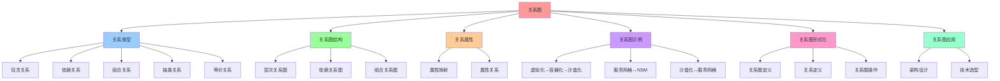

# 关系图：概念之间的关系网络

## 📑 目录

- [关系图：概念之间的关系网络](#关系图概念之间的关系网络)
  - [📑 目录](#-目录)
  - [1 概述](#1-概述)
    - [1.1 核心思想](#11-核心思想)
  - [2 关系类型](#2-关系类型)
    - [2.1 关系类型概览](#21-关系类型概览)
    - [2.2 关系定义](#22-关系定义)
  - [3 关系图结构](#3-关系图结构)
    - [3.1 层次关系图](#31-层次关系图)
    - [3.2 依赖关系图](#32-依赖关系图)
    - [3.3 组合关系图](#33-组合关系图)
  - [4 关系属性](#4-关系属性)
    - [4.1 属性映射](#41-属性映射)
    - [4.2 属性关系](#42-属性关系)
  - [5 关系图示例](#5-关系图示例)
    - [5.1 虚拟化 → 容器化 → 沙盒化](#51-虚拟化--容器化--沙盒化)
    - [5.2 服务网格 ↔ NSM](#52-服务网格--nsm)
    - [5.3 沙盒化 ↔ 服务网格](#53-沙盒化--服务网格)
  - [6 关系图形式化](#6-关系图形式化)
    - [6.1 关系图定义](#61-关系图定义)
    - [6.2 关系定义](#62-关系定义)
    - [6.3 关系图操作](#63-关系图操作)
  - [7 关系图应用](#7-关系图应用)
    - [7.1 架构设计](#71-架构设计)
    - [7.2 技术选型](#72-技术选型)
  - [8 总结](#8-总结)

---

## 1 概述

本文档详细阐述**概念之间的关系**，通过关系图展示概念之间的依赖、包含、组合等关系
。

### 1.1 核心思想

> **通过关系图展示概念之间的复杂关系网络，建立概念属性关系的完整视图**

## 2 关系类型

### 2.1 关系类型概览

| 关系类型     | 符号 | 说明               | 典型例子          |
| ------------ | ---- | ------------------ | ----------------- |
| **包含关系** | ⊃    | 父概念包含子概念   | 虚拟化 ⊃ 容器化   |
| **依赖关系** | →    | 源概念依赖目标概念 | 容器化 → 运行时   |
| **组合关系** | ↔    | 概念之间相互组合   | 服务网格 ↔ NSM    |
| **抽象关系** | ←    | 子概念抽象自父概念 | 容器 ← VM         |
| **等价关系** | ≃    | 概念之间等价       | Policy Δ ≃ Code Δ |

### 2.2 关系定义

| 关系                      | 定义                                              | 典型属性                       | 例子                       |
| ------------------------- | ------------------------------------------------- | ------------------------------ | -------------------------- |
| **虚拟化 ⊃ 容器化**       | VM 提供完整 OS，容器在其上共享内核                | 隔离级别由 VM → OS → Namespace | KVM + Docker               |
| **容器化 ⊃ 沙盒化**       | 容器提供进程隔离，沙盒在此基础上加细粒度安全      | 安全边界由 Namespace → eBPF    | Docker + seccomp           |
| **沙盒化 ↔ 服务网格**     | 沙盒控制进程，服务网格控制流量                    | 统一安全：最小权限 + mTLS      | Istio + seccomp            |
| **服务网格 ↔ NSM**        | 服务网格为侧车，NSM 为网络抽象                    | 统一网络治理：vWire            | Istio + NSM                |
| **NSM ↔ 分布式系统**      | NSM 通过 vWire 把跨域节点聚合，分布式系统提供共识 | 可聚合多域                     | Kubernetes + NSM + Raft    |
| **动态运维 ↔ 以上所有层** | GitOps、监控、弹性伸缩在每层提供自适应机制        | 自动化                         | Argo CD + Prometheus + HPA |

## 3 关系图结构

### 3.1 层次关系图

```text
硬件层
├── 虚拟化层（VM）
│   ├── 容器化层（Container）
│   │   ├── 沙盒化层（Sandbox）
│   │   └── Service Mesh 层
│   │       └── NSM 层
│   └── Service Mesh 层
│       └── NSM 层
└── 业务层
    └── OPA 层（横切关注点）
```

### 3.2 依赖关系图

```text
业务服务
    ↓ 依赖
Service Mesh
    ↓ 依赖
NSM
    ↓ 依赖
Container/Sandbox
    ↓ 依赖
VM/Hypervisor
    ↓ 依赖
硬件
```

### 3.3 组合关系图

```text
Service Mesh ↔ NSM
    ├── 组合方式：vWire
    ├── 组合效果：跨域网络聚合
    └── 组合收益：统一网络治理

沙盒化 ↔ 服务网格
    ├── 组合方式：OPA + seccomp
    ├── 组合效果：双层闸门
    └── 组合收益：可证明安全
```

## 4 关系属性

### 4.1 属性映射

**属性映射**：

```text
- 可组合：所有层都实现接口化（API, gRPC, BPF program）
- 弹性：每层支持动态扩容/缩容（VM Live‑Migrate, Container HPA, Service‑Mesh Traffic Shaping）
- 安全：从硬件隔离到进程过滤，最终到流量加密
- 可观测：从容器内部的 metrics（cAdvisor）到 Mesh 级别的 tracing（OpenTelemetry）
```

### 4.2 属性关系

**属性关系**：

```text
隔离级别: Hardware → OS → Process → Syscall
资源开销: High → Medium → Low
启动时间: 10-30s → <1s → <1s
安全模型: Isolation → Isolation+Overlay → Min-priv+eBPF
```

## 5 关系图示例

### 5.1 虚拟化 → 容器化 → 沙盒化

**包含关系**：

```text
虚拟化 ⊃ 容器化 ⊃ 沙盒化

VM ⊃ Container ⊃ Sandbox
```

**关系属性**：

- **隔离级别**：Hardware → OS → Process → Syscall
- **资源开销**：High → Medium → Low
- **启动时间**：10-30s → <1s → <1s

### 5.2 服务网格 ↔ NSM

**组合关系**：

```text
Service Mesh ↔ NSM
    ├── 组合方式：vWire
    ├── 组合效果：跨域网络聚合
    └── 组合收益：统一网络治理
```

**关系属性**：

- **统一网络治理**：vWire
- **跨域连接**：Pod ↔ VM ↔ 物理机
- **统一安全**：mTLS + Spiffe

### 5.3 沙盒化 ↔ 服务网格

**组合关系**：

```text
沙盒化 ↔ 服务网格
    ├── 组合方式：OPA + seccomp
    ├── 组合效果：双层闸门
    └── 组合收益：可证明安全
```

**关系属性**：

- **统一安全**：最小权限 + mTLS
- **双层闸门**：编译期（OPA）+ 运行期（Seccomp-BPF）
- **可证明性**：策略决策 ≡ SAT 问题

## 6 关系图形式化

### 6.1 关系图定义

```text
关系图 G = (V, E, R)
其中：
- V: 概念集合
- E: 边集合
- R: 关系集合
```

### 6.2 关系定义

```text
关系 R = ⟨source, target, type, properties⟩
其中：
- source: 源概念
- target: 目标概念
- type: 关系类型（⊃, ↔, →）
- properties: 关系属性
```

### 6.3 关系图操作

**关系图操作**：

- **遍历**：从源概念遍历到目标概念
- **查询**：查询概念之间的关系
- **验证**：验证关系的一致性

## 7 关系图应用

### 7.1 架构设计

**关系图在架构设计中的应用**：

- **可视化**：通过关系图可视化架构设计
- **验证**：通过关系图验证架构的一致性
- **演进**：通过关系图追踪架构的演进

### 7.2 技术选型

**关系图在技术选型中的应用**：

- **依赖分析**：分析技术之间的依赖关系
- **组合评估**：评估技术组合的可行性
- **风险识别**：识别技术组合的风险

## 8 总结

通过**关系图**，我们建立了：

1. **关系类型**：包含、依赖、组合、抽象、等价等关系类型
2. **关系图结构**：层次关系、依赖关系、组合关系
3. **关系属性**：每个关系的属性定义
4. **形式化框架**：建立了完整的形式化框架
5. **应用场景**：架构设计、技术选型等应用场景

---

## 9 认知增强：思维导图、知识矩阵与专家观点

### 9.1 关系图完整思维导图



### 9.2 知识多维关系矩阵

#### 关系类型多维关系矩阵

| 关系类型维度 | 包含关系 | 依赖关系 | 组合关系 | 抽象关系 | 等价关系 | 关系协同 | 认知价值 |
|-----------|---------|---------|---------|---------|---------|---------|---------|
| **符号** | ⊃ | → | ↔ | ← | ≃ | 符号对比 | 符号理解 |
| **说明** | 父概念包含子概念 | 源概念依赖目标概念 | 概念之间相互组合 | 子概念抽象自父概念 | 概念之间等价 | 说明对比 | 说明理解 |
| **典型例子** | 虚拟化 ⊃ 容器化 | 容器化 → 运行时 | 服务网格 ↔ NSM | 容器 ← VM | Policy Δ ≃ Code Δ | 例子对比 | 例子理解 |
| **方向性** | 单向 | 单向 | 双向 | 单向 | 双向 | 方向对比 | 方向理解 |
| **传递性** | 是 | 是 | 否 | 是 | 是 | 传递对比 | 传递理解 |
| **学习难度** | ⭐⭐⭐ | ⭐⭐⭐ | ⭐⭐⭐⭐ | ⭐⭐⭐ | ⭐⭐⭐ | ⭐⭐⭐ | 渐进学习 |
| **专家推荐** | ⭐⭐⭐⭐⭐ | ⭐⭐⭐⭐⭐ | ⭐⭐⭐⭐⭐ | ⭐⭐⭐⭐⭐ | ⭐⭐⭐⭐⭐ | ⭐⭐⭐⭐⭐ | 技术深度 |

#### 关系图结构多维关系矩阵

| 结构维度 | 层次关系图 | 依赖关系图 | 组合关系图 | 结构协同 | 认知价值 |
|---------|-----------|-----------|-----------|---------|---------|
| **核心内容** | 层次结构 | 依赖关系 | 组合关系 | 内容对比 | 内容理解 |
| **典型例子** | 硬件层→虚拟化层→容器化层 | 业务服务→Service Mesh→NSM | Service Mesh↔NSM | 例子对比 | 例子理解 |
| **可视化方式** | 树形结构 | 有向图 | 无向图 | 方式对比 | 方式理解 |
| **应用场景** | 架构层次设计 | 依赖分析 | 组合评估 | 场景对比 | 场景理解 |
| **学习难度** | ⭐⭐⭐ | ⭐⭐⭐ | ⭐⭐⭐⭐ | ⭐⭐⭐⭐ | 渐进学习 |
| **专家推荐** | ⭐⭐⭐⭐⭐ | ⭐⭐⭐⭐⭐ | ⭐⭐⭐⭐⭐ | ⭐⭐⭐⭐⭐ | 技术深度 |

### 9.3 形象化解释论证

#### 关系图的形象化类比

##### 1. 关系图 = 从单一关系到关系网络系统

> **类比**：关系图就像从单一关系到关系网络系统，包含关系像父子关系（父概念包含子概念），依赖关系像依赖关系（源概念依赖目标概念），组合关系像组合关系（概念之间相互组合），就像关系网络系统将复杂关系分解为关系，通过关系实现关系管理一样。

**认知价值**：

- **关系理解**：通过关系网络系统类比，理解关系图的含义
- **包含理解**：通过父子关系类比，理解包含关系的重要性
- **依赖理解**：通过依赖关系类比，理解依赖关系的价值

##### 2. 关系图结构 = 从单一结构到多结构系统

> **类比**：关系图结构就像从单一结构到多结构系统，层次关系图像树形结构（层次结构），依赖关系图像有向图（依赖关系），组合关系图像无向图（组合关系），就像多结构系统将复杂结构分解为结构，通过结构实现结构管理一样。

**认知价值**：

- **结构理解**：通过多结构系统类比，理解关系图结构的含义
- **层次理解**：通过树形结构类比，理解层次关系图的重要性
- **依赖理解**：通过有向图类比，理解依赖关系图的价值
- **组合理解**：通过无向图类比，理解组合关系图的作用

##### 3. 关系属性 = 从单一属性到属性系统

> **类比**：关系属性就像从单一属性到属性系统，属性映射像属性映射（可组合、弹性、安全、可观测），属性关系像属性关系（隔离级别、资源开销、启动时间、安全模型），就像属性系统将复杂属性分解为属性，通过属性实现属性管理一样。

**认知价值**：

- **属性理解**：通过属性系统类比，理解关系属性的含义
- **映射理解**：通过属性映射类比，理解属性映射的重要性
- **关系理解**：通过属性关系类比，理解属性关系的价值

##### 4. 关系图示例 = 从单一示例到示例系统

> **类比**：关系图示例就像从单一示例到示例系统，虚拟化→容器化→沙盒化像包含示例（虚拟化 ⊃ 容器化 ⊃ 沙盒化），服务网格↔NSM像组合示例（Service Mesh ↔ NSM），沙盒化↔服务网格像组合示例（沙盒化 ↔ 服务网格），就像示例系统将复杂示例分解为示例，通过示例实现示例管理一样。

**认知价值**：

- **示例理解**：通过示例系统类比，理解关系图示例的含义
- **包含理解**：通过包含示例类比，理解虚拟化→容器化→沙盒化的重要性
- **组合理解**：通过组合示例类比，理解服务网格↔NSM的价值

##### 5. 关系图形式化 = 从自然语言到形式化语言系统

> **类比**：关系图形式化就像从自然语言到形式化语言系统，关系图定义像形式化图（G = (V, E, R)），关系定义像形式化关系（R = ⟨source, target, type, properties⟩），关系图操作像形式化操作（遍历、查询、验证），就像形式化语言系统将复杂定义分解为定义，通过定义实现定义管理一样。

**认知价值**：

- **定义理解**：通过形式化语言系统类比，理解关系图形式化的含义
- **图理解**：通过形式化图类比，理解关系图定义的重要性
- **关系理解**：通过形式化关系类比，理解关系定义的价值
- **操作理解**：通过形式化操作类比，理解关系图操作的作用

### 9.4 专家观点与论证

#### 计算信息软件科学家的观点

##### 1. David Parnas（软件工程专家）

> **观点**："The structure of a system is more important than its components."（系统的结构比其组件更重要）

**与关系图的关联**：

- **结构理解**：关系图体现了结构的重要性（关系图结构、关系类型、关系属性）
- **组件理解**：通过关系图理解组件（概念、关系、属性）
- **系统理解**：通过关系图理解系统结构（层次关系、依赖关系、组合关系）

##### 2. Martin Fowler（重构之父）

> **观点**："Any fool can write code that a computer can understand. Good programmers write code that humans can understand."（任何傻瓜都能编写计算机能理解的代码。好的程序员编写人类能理解的代码）

**与关系图的关联**：

- **可理解性理解**：关系图通过清晰的关系类型（包含、依赖、组合、抽象、等价）提高可理解性
- **人类理解**：通过关系图理解架构的人类可理解性（清晰的关系、明确的结构）
- **选择理解**：通过关系图选择"人类能理解"的架构

##### 3. Robert C. Martin（《架构整洁之道》作者）

> **观点**："The architecture of a system is defined by the boundaries drawn between components and the dependencies that cross those boundaries."（系统的架构由组件之间绘制的边界和跨越这些边界的依赖关系定义）

**与关系图的关联**：

- **边界理解**：关系图通过关系类型（包含、依赖、组合）定义边界
- **依赖理解**：通过关系图理解依赖关系（依赖关系图、关系类型）
- **组件理解**：通过关系图理解组件划分（概念、关系、属性）

#### 计算信息软件教育家的观点

##### 1. Alistair Cockburn（敏捷开发专家）

> **观点**："Architecture is the decisions that you wish you could get right early in a project."（架构是你在项目早期希望做对的决策）

**与关系图的关联**：

- **决策理解**：关系图通过关系图应用（架构设计、技术选型）提供早期决策框架
- **早期理解**：通过关系图理解早期架构决策的重要性（关系类型、关系图结构）
- **实践理解**：通过关系图指导实践，在项目早期"做对决策"

##### 2. Grady Booch（UML创始人）

> **观点**："Architecture represents the significant design decisions that shape a system, where significant is measured by cost of change."（架构代表塑造系统的重大设计决策，其中"重大"由变更成本来衡量）

**与关系图的关联**：

- **决策理解**：关系图体现了架构决策的重要性（关系类型、关系图结构、关系属性）
- **成本理解**：通过关系图理解架构变更成本（关系图操作、关系验证）
- **设计理解**：通过关系图指导设计，选择"变更成本低"的架构

#### 计算信息软件认知学家的观点

##### 1. Donald Norman（《设计心理学》作者）

> **观点**："The real problem with the interface is that it is an interface. Interfaces get in the way. I don't want to focus my energies on an interface. I want to focus on the job."（界面的真正问题是它是界面。界面会妨碍。我不想把精力集中在界面上。我想专注于工作）

**与关系图的关联**：

- **接口理解**：关系图通过关系类型（包含、依赖、组合）定义接口，但也要避免过度关注接口
- **工作理解**：通过关系图专注于架构工作（关系图应用、关系图形式化），而不是过度关注接口细节
- **平衡理解**：通过关系图理解接口与工作的平衡

##### 2. Herbert A. Simon（认知科学家）

> **观点**："A wealth of information creates a poverty of attention."（信息丰富导致注意力贫乏）

**与关系图的关联**：

- **注意力理解**：关系图通过关系类型、关系图结构管理注意力，避免信息过载
- **结构化理解**：通过关系图结构化信息（关系类型、关系图结构、关系属性），减少认知负荷
- **管理理解**：通过关系图管理信息，避免注意力贫乏

### 9.5 认知学习路径矩阵

| 学习阶段 | 推荐内容 | 推荐技术栈 | 学习重点 | 学习时间 | 前置要求 | 后续进阶 |
|---------|---------|-----------|---------|---------|---------|---------|
| **新手阶段** | 概述、关系类型、关系图结构 | 关系图概念理解 | 类型理解、结构理解、基本概念理解 | 2-4周 | 无 | 进阶阶段 |
| **进阶阶段** | 关系属性、关系图示例、关系图形式化 | 完整技术栈 | 属性理解、示例理解、形式化理解 | 8-16周 | 新手阶段 | 专家阶段 |
| **专家阶段** | 关系图应用、专家观点 | 完整技术栈 | 应用理解、专家理解 | 32+周 | 进阶阶段 | - |

### 9.6 专家推荐阅读路径

**路径1：类型理解路径**：

1. **第一步**：阅读概述（第1节），理解关系图概览
2. **第二步**：阅读关系类型（第2节），理解包含关系、依赖关系、组合关系、抽象关系、等价关系
3. **第三步**：阅读关系图结构（第3节），理解层次关系图、依赖关系图、组合关系图
4. **第四步**：阅读总结（第8节），回顾关键要点

**路径2：示例理解路径**：

1. **第一步**：阅读概述（第1节），了解关系图
2. **第二步**：阅读关系图示例（第5节），学习虚拟化→容器化→沙盒化、服务网格↔NSM、沙盒化↔服务网格
3. **第三步**：阅读关系属性（第4节），学习属性映射、属性关系
4. **第四步**：阅读关系图形式化（第6节），理解关系图定义、关系定义、关系图操作

**路径3：应用理解路径**：

1. **第一步**：阅读概述（第1节），了解关系图
2. **第二步**：阅读关系图应用（第7节），学习架构设计、技术选型
3. **第三步**：阅读关系图形式化（第6节），理解关系图定义、关系定义、关系图操作
4. **第四步**：阅读总结（第8节），学习最佳实践

---

**更新时间**：2025-11-15 **版本**：v1.1 **参考**：`architecture_view.md` 第830-849行，关系图部分

**更新内容（v1.1）**：

- ✅ 添加认知增强章节（思维导图、知识矩阵、形象化解释、专家观点）
- ✅ 添加认知学习路径矩阵
- ✅ 添加专家推荐阅读路径（3条路径）
