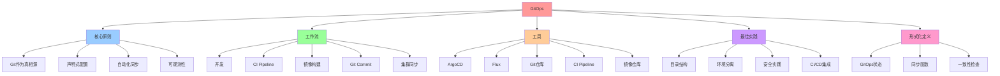

# GitOps：持续交付的声明式范式

## 📑 目录

- [GitOps：持续交付的声明式范式](#gitops持续交付的声明式范式)
  - [📑 目录](#-目录)
  - [1 概述](#1-概述)
    - [1.1 核心原则](#11-核心原则)
  - [2 GitOps 工作流](#2-gitops-工作流)
    - [2.1 基本流程](#21-基本流程)
    - [2.2 关键组件](#22-关键组件)
  - [3 ArgoCD](#3-argocd)
    - [3.1 概述](#31-概述)
    - [3.2 核心概念](#32-核心概念)
      - [3.2.1 Application](#321-application)
      - [3.2.2 ApplicationSet](#322-applicationset)
  - [4 Flux](#4-flux)
    - [4.1 概述](#41-概述)
    - [4.2 核心概念](#42-核心概念)
      - [4.2.1 GitRepository](#421-gitrepository)
      - [4.2.2 Kustomization](#422-kustomization)
  - [5 GitOps 最佳实践](#5-gitops-最佳实践)
    - [5.1 目录结构](#51-目录结构)
    - [5.2 环境分离](#52-环境分离)
    - [5.3 安全实践](#53-安全实践)
  - [6 GitOps 与 CI/CD 集成](#6-gitops-与-cicd-集成)
    - [6.1 传统 CI/CD](#61-传统-cicd)
    - [6.2 GitOps CI/CD](#62-gitops-cicd)
    - [6.3 优势](#63-优势)
  - [7 形式化定义](#7-形式化定义)
    - [7.1 GitOps 状态](#71-gitops-状态)
    - [7.2 同步函数](#72-同步函数)
    - [7.3 一致性检查](#73-一致性检查)
  - [8 总结](#8-总结)
  - [9 认知增强：思维导图、知识矩阵与专家观点](#9-认知增强思维导图知识矩阵与专家观点)
    - [9.1 GitOps完整思维导图](#91-gitops完整思维导图)
    - [9.2 知识多维关系矩阵](#92-知识多维关系矩阵)
      - [GitOps核心原则多维关系矩阵](#gitops核心原则多维关系矩阵)
      - [GitOps工具对比多维关系矩阵](#gitops工具对比多维关系矩阵)
    - [9.3 形象化解释论证](#93-形象化解释论证)
      - [GitOps的形象化类比](#gitops的形象化类比)
        - [1. GitOps = 版本控制系统升级](#1-gitops--版本控制系统升级)
        - [2. 声明式配置 = 建筑设计图](#2-声明式配置--建筑设计图)
        - [3. 自动化同步 = 自动同步系统](#3-自动化同步--自动同步系统)
        - [4. 可观测性 = 审计日志系统](#4-可观测性--审计日志系统)
        - [5. GitOps工作流 = 生产线自动化](#5-gitops工作流--生产线自动化)
    - [9.4 专家观点与论证](#94-专家观点与论证)
      - [计算信息软件科学家的观点](#计算信息软件科学家的观点)
        - [1. Fred Brooks（《人月神话》作者）](#1-fred-brooks人月神话作者)
        - [2. Leslie Lamport（分布式系统理论家）](#2-leslie-lamport分布式系统理论家)
        - [3. Barbara Liskov（Liskov替换原则）](#3-barbara-liskovliskov替换原则)
      - [计算信息软件教育家的观点](#计算信息软件教育家的观点)
        - [1. Robert C. Martin（《代码整洁之道》作者）](#1-robert-c-martin代码整洁之道作者)
        - [2. Martin Fowler（重构之父）](#2-martin-fowler重构之父)
      - [计算信息软件认知学家的观点](#计算信息软件认知学家的观点)
        - [1. Donald Norman（《设计心理学》作者）](#1-donald-norman设计心理学作者)
        - [2. Herbert A. Simon（认知科学家）](#2-herbert-a-simon认知科学家)
    - [9.5 认知学习路径矩阵](#95-认知学习路径矩阵)
    - [9.6 专家推荐阅读路径](#96-专家推荐阅读路径)

---

## 1 概述

**GitOps** 是一种使用 Git 作为**单一可信源（Single Source of Truth）**的持续交付
范式，通过声明式配置实现自动化部署和运维。

### 1.1 核心原则

1. **Git 作为真相源**：所有配置和代码都在 Git 中
2. **声明式配置**：使用 YAML/JSON 描述期望状态
3. **自动化同步**：自动检测 Git 变更并同步到集群
4. **可观测性**：所有变更可追溯、可审计

## 2 GitOps 工作流

### 2.1 基本流程

```text
开发 → Git Push → CI Pipeline → 镜像构建 → Git Commit → ArgoCD/Flux → 集群同步
```

### 2.2 关键组件

| 组件            | 作用               | 典型工具                |
| --------------- | ------------------ | ----------------------- |
| **Git 仓库**    | 存储配置和代码     | GitHub, GitLab          |
| **CI Pipeline** | 构建镜像、运行测试 | GitHub Actions, Jenkins |
| **镜像仓库**    | 存储容器镜像       | Docker Hub, Harbor      |
| **GitOps 工具** | 同步 Git 到集群    | ArgoCD, Flux            |
| **Kubernetes**  | 运行应用           | K8s, K3s                |

## 3 ArgoCD

### 3.1 概述

**ArgoCD** 是 CNCF 的 GitOps 持续交付工具，提供：

- **自动同步**：检测 Git 变更并自动同步
- **可视化界面**：查看应用状态和同步历史
- **多集群支持**：管理多个 Kubernetes 集群
- **回滚能力**：快速回滚到之前的版本

### 3.2 核心概念

#### 3.2.1 Application

```yaml
apiVersion: argoproj.io/v1alpha1
kind: Application
metadata:
  name: my-app
spec:
  project: default
  source:
    repoURL: https://github.com/example/my-app
    targetRevision: main
    path: k8s
  destination:
    server: https://kubernetes.default.svc
    namespace: default
  syncPolicy:
    automated:
      prune: true
      selfHeal: true
```

#### 3.2.2 ApplicationSet

```yaml
apiVersion: argoproj.io/v1alpha1
kind: ApplicationSet
metadata:
  name: my-apps
spec:
  generators:
    - clusters:
        selector:
          matchLabels:
            environment: production
  template:
    metadata:
      name: "{{name}}-my-app"
    spec:
      project: default
      source:
        repoURL: https://github.com/example/my-app
        targetRevision: main
        path: k8s
      destination:
        server: "{{server}}"
        namespace: default
```

## 4 Flux

### 4.1 概述

**Flux** 是 CNCF 的另一个 GitOps 工具，提供：

- **自动同步**：检测 Git 变更并自动同步
- **Helm 支持**：支持 Helm charts
- **Kustomize 支持**：支持 Kustomize
- **多租户支持**：支持多租户场景

### 4.2 核心概念

#### 4.2.1 GitRepository

```yaml
apiVersion: source.toolkit.fluxcd.io/v1beta1
kind: GitRepository
metadata:
  name: my-app
spec:
  interval: 1m
  url: https://github.com/example/my-app
  ref:
    branch: main
```

#### 4.2.2 Kustomization

```yaml
apiVersion: kustomize.toolkit.fluxcd.io/v1beta1
kind: Kustomization
metadata:
  name: my-app
spec:
  interval: 5m
  path: ./k8s
  prune: true
  sourceRef:
    kind: GitRepository
    name: my-app
  validation: client
```

## 5 GitOps 最佳实践

### 5.1 目录结构

```text
my-app/
├── README.md
├── .github/
│   └── workflows/
│       └── ci.yml
├── src/
│   └── ...
├── k8s/
│   ├── base/
│   │   ├── deployment.yaml
│   │   ├── service.yaml
│   │   └── kustomization.yaml
│   └── overlays/
│       ├── dev/
│       │   └── kustomization.yaml
│       └── prod/
│           └── kustomization.yaml
└── helm/
    └── my-app/
        ├── Chart.yaml
        ├── values.yaml
        └── templates/
```

### 5.2 环境分离

- **开发环境**：自动同步 main 分支
- **测试环境**：自动同步 test 分支
- **生产环境**：手动审批或自动同步 tagged 版本

### 5.3 安全实践

- **RBAC**：限制 GitOps 工具的权限
- **Sealed Secrets**：加密敏感信息
- **OPA/Gatekeeper**：策略即代码
- **审计日志**：记录所有变更

## 6 GitOps 与 CI/CD 集成

### 6.1 传统 CI/CD

```text
开发 → CI → 构建镜像 → 推送镜像 → 更新部署 → 部署到集群
```

### 6.2 GitOps CI/CD

```text
开发 → CI → 构建镜像 → 推送镜像 → 更新 Git → GitOps 自动同步到集群
```

### 6.3 优势

- **分离关注点**：CI 负责构建，CD 负责部署
- **可追溯性**：所有变更都在 Git 中
- **可回滚性**：快速回滚到之前的版本
- **多环境一致性**：使用相同的配置和流程

## 7 形式化定义

### 7.1 GitOps 状态

```text
GitOps 状态 S = ⟨repo, branch, path, commit⟩
其中：
- repo: Git 仓库 URL
- branch: Git 分支
- path: 配置路径
- commit: Git commit SHA
```

### 7.2 同步函数

```text
同步函数 Sync: S → K8s
其中 Sync(S) 将 Git 配置同步到 Kubernetes 集群
```

### 7.3 一致性检查

```text
一致性检查 Consistent: S × K8s → {true, false}
其中 Consistent(S, k8s) 检查集群状态是否与 Git 一致
```

## 8 总结

GitOps 通过**Git 作为真相源**和**声明式配置**实现了：

1. **自动化部署**：自动检测 Git 变更并同步到集群
2. **可追溯性**：所有变更都在 Git 中，可追溯、可审计
3. **可回滚性**：快速回滚到之前的版本
4. **多环境一致性**：使用相同的配置和流程
5. **分离关注点**：CI 负责构建，CD 负责部署

---

---

## 9 认知增强：思维导图、知识矩阵与专家观点

### 9.1 GitOps完整思维导图



### 9.2 知识多维关系矩阵

#### GitOps核心原则多维关系矩阵

| 原则维度 | Git作为真相源 | 声明式配置 | 自动化同步 | 可观测性 | 原则协同 | 认知价值 |
|---------|------------|----------|----------|---------|---------|---------|
| **核心概念** | 单一可信源 | YAML/JSON描述期望状态 | 自动检测Git变更 | 变更可追溯可审计 | 完整原则 | 概念理解 |
| **技术实现** | Git仓库 | Kubernetes YAML | ArgoCD/Flux | 审计日志 | 技术栈 | 实现理解 |
| **架构收益** | 版本控制 | 配置管理 | 自动化部署 | 可追溯性 | 完整收益 | 收益理解 |
| **适用场景** | 持续交付 | 基础设施即代码 | 多环境部署 | 合规审计 | GitOps应用 | 场景理解 |
| **学习难度** | ⭐⭐ | ⭐⭐⭐ | ⭐⭐⭐ | ⭐⭐ | ⭐⭐⭐ | 渐进学习 |
| **专家推荐** | ⭐⭐⭐⭐⭐ | ⭐⭐⭐⭐⭐ | ⭐⭐⭐⭐⭐ | ⭐⭐⭐⭐⭐ | ⭐⭐⭐⭐⭐ | 技术深度 |

#### GitOps工具对比多维关系矩阵

| 工具维度 | ArgoCD | Flux | 工具对比 | 技术演进 | 认知价值 |
|---------|--------|------|---------|---------|---------|
| **核心功能** | 自动同步、可视化界面 | 自动同步、Helm/Kustomize支持 | 功能对比 | 工具演进 | 功能理解 |
| **多集群支持** | 支持 | 支持 | 多集群管理 | 多集群演进 | 集群理解 |
| **Helm支持** | 支持 | 原生支持 | Helm对比 | Helm演进 | Helm理解 |
| **Kustomize支持** | 支持 | 原生支持 | Kustomize对比 | Kustomize演进 | Kustomize理解 |
| **可视化界面** | 提供 | 不提供 | UI对比 | UI演进 | UI理解 |
| **学习难度** | ⭐⭐⭐ | ⭐⭐⭐ | - | - | 渐进学习 |
| **专家推荐** | ⭐⭐⭐⭐⭐ | ⭐⭐⭐⭐⭐ | - | - | 技术深度 |

### 9.3 形象化解释论证

#### GitOps的形象化类比

##### 1. GitOps = 版本控制系统升级

> **类比**：GitOps就像版本控制系统升级，传统部署像手动复制文件（手动部署），GitOps像Git版本控制（Git作为真相源、自动化同步），就像版本控制系统从手动复制升级到Git自动化一样。

**认知价值**：

- **版本理解**：通过版本控制系统类比，理解GitOps的版本控制特性
- **自动化理解**：通过Git自动化类比，理解GitOps的自动化同步
- **升级理解**：通过版本控制系统升级类比，理解GitOps相对于传统部署的改进

##### 2. 声明式配置 = 建筑设计图

> **类比**：声明式配置就像建筑设计图，传统配置像施工指令（命令式配置），声明式配置像建筑设计图（YAML/JSON描述期望状态），就像建筑设计图描述最终建筑状态一样。

**认知价值**：

- **配置理解**：通过建筑设计图类比，理解声明式配置的含义
- **期望理解**：通过建筑状态类比，理解期望状态的概念
- **描述理解**：通过设计图描述类比，理解YAML/JSON描述的作用

##### 3. 自动化同步 = 自动同步系统

> **类比**：自动化同步就像自动同步系统，传统部署像手动同步（手动部署），GitOps像自动同步系统（自动检测Git变更并同步），就像自动同步系统自动同步文件一样。

**认知价值**：

- **同步理解**：通过自动同步系统类比，理解自动化同步的含义
- **检测理解**：通过自动检测类比，理解Git变更检测的机制
- **自动化理解**：通过自动同步类比，理解自动化的好处

##### 4. 可观测性 = 审计日志系统

> **类比**：可观测性就像审计日志系统，传统部署像没有日志（无追溯），GitOps像审计日志系统（所有变更可追溯、可审计），就像审计日志系统记录所有操作一样。

**认知价值**：

- **可观测理解**：通过审计日志系统类比，理解可观测性的含义
- **追溯理解**：通过日志追溯类比，理解变更追溯的重要性
- **审计理解**：通过审计日志类比，理解审计的重要性

##### 5. GitOps工作流 = 生产线自动化

> **类比**：GitOps工作流就像生产线自动化，传统CI/CD像手动生产线（手动部署），GitOps像自动化生产线（开发→Git Push→CI Pipeline→镜像构建→Git Commit→ArgoCD/Flux→集群同步），就像自动化生产线自动完成所有步骤一样。

**认知价值**：

- **工作流理解**：通过生产线自动化类比，理解GitOps工作流的含义
- **自动化理解**：通过自动化生产线类比，理解工作流自动化的好处
- **流程理解**：通过生产线流程类比，理解GitOps工作流的完整流程

### 9.4 专家观点与论证

#### 计算信息软件科学家的观点

##### 1. Fred Brooks（《人月神话》作者）

> **观点**："The hardest single part of building a software system is deciding precisely what to build."（构建软件系统最困难的部分是精确决定构建什么）

**与GitOps的关联**：

- **决策理解**：GitOps帮助决策（Git作为真相源、声明式配置描述期望状态）
- **设计理解**：通过GitOps理解软件系统构建的决策过程（声明式配置、自动化同步）
- **构建理解**：通过GitOps理解软件系统构建的自动化过程

##### 2. Leslie Lamport（分布式系统理论家）

> **观点**："A distributed system is one in which the failure of a computer you didn't even know existed can render your own computer unusable."（分布式系统是指一个你不知道存在的计算机的故障可能导致你自己的计算机无法使用的系统）

**与GitOps的关联**：

- **分布式理解**：GitOps体现了分布式系统的特性（多集群支持、自动化同步）
- **故障理解**：通过GitOps理解分布式系统的故障处理（一致性检查、可回滚性）
- **系统理解**：通过GitOps理解分布式系统的复杂性（Git作为真相源、自动化同步）

##### 3. Barbara Liskov（Liskov替换原则）

> **观点**："What is wanted is something like the following substitution property: If for each object o1 of type S there is an object o2 of type T such that for all programs P defined in terms of T, the behavior of P is unchanged when o1 is substituted for o2 then S is a subtype of T."（需要的是类似以下替换属性：如果对于类型S的每个对象o1，存在类型T的对象o2，使得对于所有用T定义的程序P，当o1替换o2时，P的行为不变，则S是T的子类型）

**与GitOps的关联**：

- **替换理解**：GitOps体现了替换原则（ArgoCD和Flux可以替换传统部署工具）
- **行为理解**：通过GitOps理解工具替换时行为保持不变（自动化同步、可追溯性）
- **子类型理解**：通过GitOps理解工具类型的子类型关系（ArgoCD和Flux是GitOps工具的子类型）

#### 计算信息软件教育家的观点

##### 1. Robert C. Martin（《代码整洁之道》作者）

> **观点**："The only way to go fast is to go well."（快速前进的唯一方法是做好）

**与GitOps的关联**：

- **质量理解**：GitOps体现了部署质量（Git作为真相源、声明式配置、可追溯性）
- **速度理解**：通过GitOps理解速度与质量的权衡（自动化同步vs手动部署）
- **实践理解**：通过GitOps指导实践，选择"做好"的部署方案

##### 2. Martin Fowler（重构之父）

> **观点**："Any fool can write code that a computer can understand. Good programmers write code that humans can understand."（任何傻瓜都能编写计算机能理解的代码。好的程序员编写人类能理解的代码）

**与GitOps的关联**：

- **可理解性理解**：GitOps通过声明式配置、Git作为真相源提高可理解性
- **人类理解**：通过GitOps理解部署的人类可理解性（YAML/JSON配置、Git历史）
- **选择理解**：通过GitOps选择"人类能理解"的部署方案

#### 计算信息软件认知学家的观点

##### 1. Donald Norman（《设计心理学》作者）

> **观点**："The real problem with the interface is that it is an interface. Interfaces get in the way. I don't want to focus my energies on an interface. I want to focus on the job."（界面的真正问题是它是界面。界面会妨碍。我不想把精力集中在界面上。我想专注于工作）

**与GitOps的关联**：

- **接口理解**：GitOps体现了接口的重要性（Git接口、Kubernetes接口），但也要避免过度关注接口
- **工作理解**：通过GitOps专注于部署工作（自动化同步、可追溯性），而不是过度关注接口细节
- **平衡理解**：通过GitOps理解接口与工作的平衡

##### 2. Herbert A. Simon（认知科学家）

> **观点**："A wealth of information creates a poverty of attention."（信息丰富导致注意力贫乏）

**与GitOps的关联**：

- **注意力理解**：GitOps通过Git作为真相源、声明式配置管理注意力，避免信息过载
- **结构化理解**：通过GitOps结构化信息（Git仓库、YAML配置），减少认知负荷
- **管理理解**：通过GitOps管理信息，避免注意力贫乏

### 9.5 认知学习路径矩阵

| 学习阶段 | 推荐内容 | 推荐原则 | 学习重点 | 学习时间 | 前置要求 | 后续进阶 |
|---------|---------|---------|---------|---------|---------|---------|
| **新手阶段** | 概述、核心原则 | Git作为真相源、声明式配置 | 原则理解、基本概念理解 | 1-2周 | 无 | 进阶阶段 |
| **进阶阶段** | 工作流、工具 | 自动化同步、ArgoCD/Flux | 工作流理解、工具理解 | 4-8周 | 新手阶段 | 专家阶段 |
| **专家阶段** | 最佳实践、形式化定义 | 完整原则、形式化定义 | 实践理解、形式化理解 | 16+周 | 进阶阶段 | - |

### 9.6 专家推荐阅读路径

**路径1：GitOps理解路径**：

1. **第一步**：阅读概述（第1节），理解GitOps概览
2. **第二步**：阅读核心原则（第1.1节），理解Git作为真相源、声明式配置、自动化同步、可观测性
3. **第三步**：阅读工作流（第2节），理解GitOps工作流
4. **第四步**：阅读总结（第8节），回顾关键要点

**路径2：工具理解路径**：

1. **第一步**：阅读概述（第1节），了解GitOps
2. **第二步**：阅读ArgoCD和Flux（第3-4节），学习工具使用
3. **第三步**：阅读最佳实践（第5节），学习实践方法
4. **第四步**：阅读CI/CD集成（第6节），学习集成方法

**路径3：实践应用路径**：

1. **第一步**：阅读概述（第1节），了解GitOps
2. **第二步**：阅读最佳实践（第5节），学习实践方法
3. **第三步**：阅读形式化定义（第7节），理解理论基础
4. **第四步**：阅读总结（第8节），学习最佳实践

---

**更新时间**：2025-11-15 **版本**：v1.1 **参考**：`architecture_view.md` 第30行，GitOps部分

**更新内容（v1.1）**：

- ✅ 添加认知增强章节（思维导图、知识矩阵、形象化解释、专家观点）
- ✅ 添加认知学习路径矩阵
- ✅ 添加专家推荐阅读路径（3条路径）
