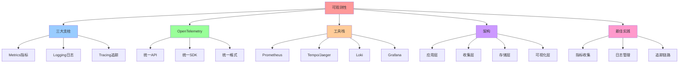

# 可观测性：统一遥测与监控

## 📑 目录

- [可观测性：统一遥测与监控](#可观测性统一遥测与监控)
  - [📑 目录](#-目录)
  - [1 概述](#1-概述)
    - [1.1 核心思想](#11-核心思想)
  - [2 可观测性三大支柱](#2-可观测性三大支柱)
    - [2.1 三大支柱](#21-三大支柱)
    - [2.2 三大支柱关系](#22-三大支柱关系)
  - [3 OpenTelemetry](#3-opentelemetry)
    - [3.1 OpenTelemetry 定义](#31-opentelemetry-定义)
    - [3.2 OpenTelemetry 架构](#32-opentelemetry-架构)
    - [3.3 OpenTelemetry 集成](#33-opentelemetry-集成)
  - [4 Prometheus（指标）](#4-prometheus指标)
    - [4.1 Prometheus 定义](#41-prometheus-定义)
    - [4.2 Prometheus 架构](#42-prometheus-架构)
    - [4.3 Prometheus 配置](#43-prometheus-配置)
  - [5 Tempo/Jaeger（追踪）](#5-tempojaeger追踪)
    - [5.1 Tempo 定义](#51-tempo-定义)
    - [5.2 Tempo 架构](#52-tempo-架构)
    - [5.3 Tempo 配置](#53-tempo-配置)
  - [6 Loki（日志）](#6-loki日志)
    - [6.1 Loki 定义](#61-loki-定义)
    - [6.2 Loki 架构](#62-loki-架构)
    - [6.3 Loki 配置](#63-loki-配置)
  - [7 Grafana（可视化）](#7-grafana可视化)
    - [7.1 Grafana 定义](#71-grafana-定义)
    - [7.2 Grafana 配置](#72-grafana-配置)
  - [8 可观测性架构](#8-可观测性架构)
    - [8.1 完整架构](#81-完整架构)
    - [8.2 数据流](#82-数据流)
  - [9 形式化定义](#9-形式化定义)
    - [9.1 可观测性定义](#91-可观测性定义)
    - [9.2 遥测数据定义](#92-遥测数据定义)
    - [9.3 可视化定义](#93-可视化定义)
  - [10 最佳实践](#10-最佳实践)
    - [10.1 指标收集](#101-指标收集)
    - [10.2 日志管理](#102-日志管理)
    - [10.3 追踪链路](#103-追踪链路)
  - [11 总结](#11-总结)
    - [11.1 相关文档](#111-相关文档)
  - [12 认知增强：思维导图、知识矩阵与专家观点](#12-认知增强思维导图知识矩阵与专家观点)
    - [12.1 可观测性完整思维导图](#121-可观测性完整思维导图)
    - [12.2 知识多维关系矩阵](#122-知识多维关系矩阵)
      - [可观测性三大支柱多维关系矩阵](#可观测性三大支柱多维关系矩阵)
      - [OpenTelemetry工具栈多维关系矩阵](#opentelemetry工具栈多维关系矩阵)
    - [12.3 形象化解释论证](#123-形象化解释论证)
      - [可观测性的形象化类比](#可观测性的形象化类比)
        - [1. 可观测性 = 健康体检系统](#1-可观测性--健康体检系统)
        - [2. 三大支柱 = 三脚架](#2-三大支柱--三脚架)
        - [3. OpenTelemetry = 通用翻译器](#3-opentelemetry--通用翻译器)
        - [4. 数据流 = 自来水系统](#4-数据流--自来水系统)
        - [5. Grafana = 仪表盘](#5-grafana--仪表盘)
    - [12.4 专家观点与论证](#124-专家观点与论证)
      - [计算信息软件科学家的观点](#计算信息软件科学家的观点)
        - [1. Leslie Lamport（分布式系统理论家）](#1-leslie-lamport分布式系统理论家)
        - [2. Fred Brooks（《人月神话》作者）](#2-fred-brooks人月神话作者)
        - [3. Barbara Liskov（Liskov替换原则）](#3-barbara-liskovliskov替换原则)
      - [计算信息软件教育家的观点](#计算信息软件教育家的观点)
        - [1. Robert C. Martin（《代码整洁之道》作者）](#1-robert-c-martin代码整洁之道作者)
        - [2. Martin Fowler（重构之父）](#2-martin-fowler重构之父)
      - [计算信息软件认知学家的观点](#计算信息软件认知学家的观点)
        - [1. Donald Norman（《设计心理学》作者）](#1-donald-norman设计心理学作者)
        - [2. Herbert A. Simon（认知科学家）](#2-herbert-a-simon认知科学家)
    - [12.5 认知学习路径矩阵](#125-认知学习路径矩阵)
    - [12.6 专家推荐阅读路径](#126-专家推荐阅读路径)

---

## 1 概述

本文档详细阐述**可观测性**的实现方法，通过 **OpenTelemetry、Prometheus、Tempo**
等技术实现统一遥测与监控。

### 1.1 核心思想

> **通过 OpenTelemetry 统一遥测标准，实现指标、日志、追踪的一体化收集和分析，支
> 持弹性调优和故障排查**

## 2 可观测性三大支柱

### 2.1 三大支柱

| 支柱        | 定义                           | 典型工具              | 用途     |
| ----------- | ------------------------------ | --------------------- | -------- |
| **Metrics** | 指标：数值型数据，表示系统状态 | Prometheus、Grafana   | 性能监控 |
| **Logging** | 日志：文本型数据，记录事件     | Loki、ELK、Fluentd    | 事件追踪 |
| **Tracing** | 追踪：请求链路追踪             | Tempo、Jaeger、Zipkin | 链路分析 |

### 2.2 三大支柱关系

```text
Metrics（指标）
    ├── 回答：系统状态如何？
    ├── 特点：数值型、聚合型
    └── 用途：性能监控、告警

Logging（日志）
    ├── 回答：发生了什么？
    ├── 特点：文本型、事件型
    └── 用途：事件追踪、审计

Tracing（追踪）
    ├── 回答：为什么慢？
    ├── 特点：链路型、分布式
    └── 用途：链路分析、性能优化
```

## 3 OpenTelemetry

### 3.1 OpenTelemetry 定义

**OpenTelemetry** 是统一遥测标准，提供：

- **统一 API**：统一的指标、日志、追踪 API
- **统一 SDK**：统一的 SDK 实现
- **统一格式**：统一的遥测数据格式

### 3.2 OpenTelemetry 架构

```text
Application
    ├── OpenTelemetry SDK
    │   ├── Metrics SDK
    │   ├── Logging SDK
    │   └── Tracing SDK
    └── OpenTelemetry Collector
        ├── Receivers（接收器）
        ├── Processors（处理器）
        └── Exporters（导出器）
            ├── Prometheus（指标）
            ├── Loki（日志）
            └── Tempo（追踪）
```

### 3.3 OpenTelemetry 集成

**Kubernetes 集成**：

```yaml
apiVersion: v1
kind: Pod
metadata:
  name: my-app
spec:
  containers:
    - name: my-app
      image: my-app:latest
      env:
        - name: OTEL_SERVICE_NAME
          value: my-app
        - name: OTEL_EXPORTER_OTLP_ENDPOINT
          value: http://otel-collector:4317
```

## 4 Prometheus（指标）

### 4.1 Prometheus 定义

**Prometheus** 是指标收集和监控系统，提供：

- **指标收集**：从各个服务收集指标
- **指标存储**：时间序列数据库存储指标
- **查询语言**：PromQL 查询语言
- **告警**：AlertManager 告警系统

### 4.2 Prometheus 架构

```text
Prometheus Server
    ├── 指标收集（Pull/Push）
    ├── 指标存储（TSDB）
    ├── 查询引擎（PromQL）
    └── 告警管理（AlertManager）
```

### 4.3 Prometheus 配置

**Prometheus 配置**：

```yaml
apiVersion: v1
kind: ConfigMap
metadata:
  name: prometheus-config
data:
  prometheus.yml: |
    global:
      scrape_interval: 15s
    scrape_configs:
      - job_name: 'kubernetes-pods'
        kubernetes_sd_configs:
          - role: pod
```

## 5 Tempo/Jaeger（追踪）

### 5.1 Tempo 定义

**Tempo** 是分布式追踪系统，提供：

- **追踪收集**：收集分布式追踪数据
- **追踪存储**：对象存储存储追踪数据
- **追踪查询**：通过 TraceID 查询追踪数据

### 5.2 Tempo 架构

```text
Application
    ├── OpenTelemetry SDK
    └── OpenTelemetry Collector
        └── Tempo
            ├── Distributor（分发器）
            ├── Ingester（摄取器）
            └── Query（查询器）
```

### 5.3 Tempo 配置

**Tempo 配置**：

```yaml
apiVersion: v1
kind: ConfigMap
metadata:
  name: tempo-config
data:
  tempo.yaml: |
    server:
      http_listen_port: 3200
    distributor:
      receivers:
        otlp:
          protocols:
            grpc:
              endpoint: 0.0.0.0:4317
```

## 6 Loki（日志）

### 6.1 Loki 定义

**Loki** 是日志聚合系统，提供：

- **日志收集**：收集日志数据
- **日志存储**：对象存储存储日志数据
- **日志查询**：LogQL 查询语言

### 6.2 Loki 架构

```text
Application
    ├── Fluentd/Fluent Bit
    └── Loki
        ├── Distributor（分发器）
        ├── Ingester（摄取器）
        └── Querier（查询器）
```

### 6.3 Loki 配置

**Loki 配置**：

```yaml
apiVersion: v1
kind: ConfigMap
metadata:
  name: loki-config
data:
  loki.yaml: |
    auth_enabled: false
    server:
      http_listen_port: 3100
    ingester:
      lifecycler:
        address: 127.0.0.1
        ring:
          kvstore:
            store: inmemory
```

## 7 Grafana（可视化）

### 7.1 Grafana 定义

**Grafana** 是可视化面板，提供：

- **指标可视化**：Prometheus 指标可视化
- **日志可视化**：Loki 日志可视化
- **追踪可视化**：Tempo 追踪可视化
- **统一面板**：统一的可观测性面板

### 7.2 Grafana 配置

**Grafana 配置**：

```yaml
apiVersion: v1
kind: ConfigMap
metadata:
  name: grafana-config
data:
  grafana.ini: |
    [server]
    http_port = 3000

    [datasources]
    prometheus.url = http://prometheus:9090
    loki.url = http://loki:3100
    tempo.url = http://tempo:3200
```

## 8 可观测性架构

### 8.1 完整架构

```text
Application Layer
    ├── OpenTelemetry SDK
    └── OpenTelemetry Collector
        ├── Prometheus（指标）
        ├── Loki（日志）
        └── Tempo（追踪）
            └── Grafana（可视化）
```

### 8.2 数据流

**数据流**：

```text
应用 → OpenTelemetry SDK → OpenTelemetry Collector
    ├── Metrics → Prometheus → Grafana
    ├── Logs → Loki → Grafana
    └── Traces → Tempo → Grafana
```

## 9 形式化定义

### 9.1 可观测性定义

```text
可观测性 O = ⟨metrics, logs, traces, visualization⟩
其中：
- metrics: 指标集合
- logs: 日志集合
- traces: 追踪集合
- visualization: 可视化面板
```

### 9.2 遥测数据定义

```text
遥测数据 T = ⟨metrics, logs, traces⟩
其中：
- metrics: 指标数据
- logs: 日志数据
- traces: 追踪数据
```

### 9.3 可视化定义

```text
可视化 V = ⟨panels, dashboards, alerts⟩
其中：
- panels: 面板集合
- dashboards: 仪表板集合
- alerts: 告警集合
```

## 10 最佳实践

### 10.1 指标收集

**指标收集最佳实践**：

- **标准化**：使用 OpenTelemetry 标准
- **自动化**：通过 sidecar 自动注入
- **聚合**：在 Collector 层聚合指标

### 10.2 日志管理

**日志管理最佳实践**：

- **结构化**：使用结构化日志格式
- **采样**：对高频日志进行采样
- **压缩**：对日志进行压缩存储

### 10.3 追踪链路

**追踪链路最佳实践**：

- **分布式追踪**：使用 OpenTelemetry 分布式追踪
- **采样策略**：根据业务需求设置采样策略
- **链路分析**：通过 Grafana 分析链路

## 11 总结

通过**可观测性**，我们实现了：

1. **统一遥测**：通过 OpenTelemetry 统一遥测标准
2. **三大支柱**：Metrics、Logging、Tracing 一体化
3. **可视化**：通过 Grafana 统一可视化
4. **自动化**：通过 sidecar 自动注入遥测
5. **弹性调优**：通过指标支持弹性调优和故障排查

### 11.1 相关文档

**扩展阅读**：

- **[eBPF/OTLP 架构视角](../09-multi-perspectives/07-ebpf-otlp-perspective.md)**
  ⭐ - 横纵耦合的可观测性驱动架构
  - 横纵耦合问题定位模型（OTLP 横向 + eBPF 纵向）
  - 智能系统能力架构（自我感知、自动伸缩、自我治愈）
  - 技术规范与语义模型对齐
- **[可观测性视角](../09-multi-perspectives/06-observability-perspective.md)** -
  传统可观测性视角
- **[32. eBPF/OTLP 扩展技术分析](../../../TECHNICAL/08-architecture-analysis/ebpf-otlp-analysis/ebpf-otlp-analysis.md)**
  ⭐ - eBPF/OTLP 扩展技术分析文档
- **[31. eBPF 技术堆栈](../../../TECHNICAL/31-ebpf-stack/ebpf-stack.md)** - eBPF
  技术堆栈完整技术参考文档
- **[29. 隔离栈](../../../TECHNICAL/29-isolation-stack/isolation-stack.md)** -
  问题定位模型、横纵耦合定位方法

---

---

## 12 认知增强：思维导图、知识矩阵与专家观点

### 12.1 可观测性完整思维导图



### 12.2 知识多维关系矩阵

#### 可观测性三大支柱多维关系矩阵

| 支柱维度 | Metrics | Logging | Tracing | 支柱协同 | 认知价值 |
|---------|---------|---------|---------|---------|---------|
| **数据类型** | 数值型 | 文本型 | 链路型 | 完整数据 | 类型理解 |
| **回答问题** | 系统状态如何？ | 发生了什么？ | 为什么慢？ | 完整问题 | 问题理解 |
| **特点** | 数值型、聚合型 | 文本型、事件型 | 链路型、分布式 | 完整特点 | 特点理解 |
| **典型工具** | Prometheus、Grafana | Loki、ELK、Fluentd | Tempo、Jaeger、Zipkin | 工具栈 | 工具理解 |
| **用途** | 性能监控、告警 | 事件追踪、审计 | 链路分析、性能优化 | 完整用途 | 用途理解 |
| **学习难度** | ⭐⭐⭐ | ⭐⭐ | ⭐⭐⭐⭐ | ⭐⭐⭐ | 渐进学习 |
| **专家推荐** | ⭐⭐⭐⭐⭐ | ⭐⭐⭐⭐⭐ | ⭐⭐⭐⭐⭐ | ⭐⭐⭐⭐⭐ | 技术深度 |

#### OpenTelemetry工具栈多维关系矩阵

| 工具维度 | OpenTelemetry | Prometheus | Tempo/Jaeger | Loki | Grafana | 工具协同 | 认知价值 |
|---------|--------------|-----------|-------------|------|---------|---------|---------|
| **核心功能** | 统一遥测标准 | 指标收集存储 | 追踪收集存储 | 日志收集存储 | 可视化面板 | 完整栈 | 功能理解 |
| **数据流** | SDK→Collector | Collector→Prometheus | Collector→Tempo | Collector→Loki | 所有→Grafana | 数据流 | 流理解 |
| **架构收益** | 统一标准 | 指标监控 | 链路追踪 | 日志聚合 | 统一可视化 | 完整收益 | 收益理解 |
| **适用场景** | 遥测标准 | 性能监控 | 分布式追踪 | 日志分析 | 数据可视化 | 完整应用 | 场景理解 |
| **学习难度** | ⭐⭐⭐⭐ | ⭐⭐⭐ | ⭐⭐⭐⭐ | ⭐⭐⭐ | ⭐⭐ | ⭐⭐⭐⭐ | 渐进学习 |
| **专家推荐** | ⭐⭐⭐⭐⭐ | ⭐⭐⭐⭐⭐ | ⭐⭐⭐⭐⭐ | ⭐⭐⭐⭐⭐ | ⭐⭐⭐⭐⭐ | ⭐⭐⭐⭐⭐ | 技术深度 |

### 12.3 形象化解释论证

#### 可观测性的形象化类比

##### 1. 可观测性 = 健康体检系统

> **类比**：可观测性就像健康体检系统，Metrics像血压、心率（数值型指标），Logging像病历记录（文本型日志），Tracing像体检流程（链路型追踪），Grafana像体检报告（可视化面板），就像健康体检系统全面了解身体健康状况一样。

**认知价值**：

- **全面理解**：通过健康体检系统类比，理解可观测性的全面性（指标、日志、追踪）
- **数据理解**：通过体检数据类比，理解不同类型数据的作用（数值型、文本型、链路型）
- **可视化理解**：通过体检报告类比，理解可视化的作用

##### 2. 三大支柱 = 三脚架

> **类比**：三大支柱就像三脚架，Metrics像第一条腿（系统状态），Logging像第二条腿（事件记录），Tracing像第三条腿（链路追踪），三脚架缺一不可，就像可观测性三大支柱缺一不可一样。

**认知价值**：

- **支柱理解**：通过三脚架类比，理解三大支柱的重要性
- **协同理解**：通过三脚架协同类比，理解三大支柱的协同作用
- **完整性理解**：通过三脚架完整性类比，理解可观测性的完整性

##### 3. OpenTelemetry = 通用翻译器

> **类比**：OpenTelemetry就像通用翻译器，不同语言需要翻译（不同工具需要统一标准），通用翻译器翻译语言（OpenTelemetry统一遥测标准），就像通用翻译器让不同语言的人可以交流一样。

**认知价值**：

- **统一理解**：通过通用翻译器类比，理解OpenTelemetry统一标准的作用
- **标准理解**：通过翻译标准类比，理解统一标准的重要性
- **交流理解**：通过语言交流类比，理解统一标准促进工具交流的作用

##### 4. 数据流 = 自来水系统

> **类比**：数据流就像自来水系统，应用像水源（产生数据），OpenTelemetry Collector像水处理厂（收集处理数据），Prometheus/Tempo/Loki像水库（存储数据），Grafana像水龙头（可视化数据），就像自来水系统从水源到水龙头的完整流程一样。

**认知价值**：

- **流程理解**：通过自来水系统类比，理解数据流的完整流程
- **处理理解**：通过水处理厂类比，理解数据收集处理的作用
- **存储理解**：通过水库类比，理解数据存储的重要性

##### 5. Grafana = 仪表盘

> **类比**：Grafana就像汽车仪表盘，Prometheus像速度表（指标），Loki像里程表（日志），Tempo像导航（追踪），Grafana像仪表盘（统一显示），就像汽车仪表盘统一显示各种信息一样。

**认知价值**：

- **可视化理解**：通过仪表盘类比，理解Grafana可视化的作用
- **统一理解**：通过仪表盘统一显示类比，理解Grafana统一可视化的好处
- **信息理解**：通过仪表盘信息类比，理解可观测性信息的全面性

### 12.4 专家观点与论证

#### 计算信息软件科学家的观点

##### 1. Leslie Lamport（分布式系统理论家）

> **观点**："A distributed system is one in which the failure of a computer you didn't even know existed can render your own computer unusable."（分布式系统是指一个你不知道存在的计算机的故障可能导致你自己的计算机无法使用的系统）

**与可观测性的关联**：

- **分布式理解**：可观测性体现了分布式系统的特性（Metrics、Logging、Tracing都是分布式概念）
- **故障理解**：通过可观测性理解分布式系统的故障处理（指标监控、日志追踪、链路分析）
- **系统理解**：通过可观测性理解分布式系统的复杂性（三大支柱、统一标准）

##### 2. Fred Brooks（《人月神话》作者）

> **观点**："The hardest single part of building a software system is deciding precisely what to build."（构建软件系统最困难的部分是精确决定构建什么）

**与可观测性的关联**：

- **决策理解**：可观测性帮助决策（指标监控、日志追踪、链路分析）
- **设计理解**：通过可观测性理解软件系统构建的决策过程（三大支柱、统一标准）
- **构建理解**：通过可观测性理解软件系统构建的可观测性需求

##### 3. Barbara Liskov（Liskov替换原则）

> **观点**："What is wanted is something like the following substitution property: If for each object o1 of type S there is an object o2 of type T such that for all programs P defined in terms of T, the behavior of P is unchanged when o1 is substituted for o2 then S is a subtype of T."（需要的是类似以下替换属性：如果对于类型S的每个对象o1，存在类型T的对象o2，使得对于所有用T定义的程序P，当o1替换o2时，P的行为不变，则S是T的子类型）

**与可观测性的关联**：

- **替换理解**：可观测性体现了替换原则（OpenTelemetry可以替换不同工具）
- **行为理解**：通过可观测性理解工具替换时行为保持不变（统一标准、统一API）
- **子类型理解**：通过可观测性理解工具类型的子类型关系（OpenTelemetry是遥测工具的子类型）

#### 计算信息软件教育家的观点

##### 1. Robert C. Martin（《代码整洁之道》作者）

> **观点**："The only way to go fast is to go well."（快速前进的唯一方法是做好）

**与可观测性的关联**：

- **质量理解**：可观测性体现了系统质量（指标监控、日志追踪、链路分析）
- **速度理解**：通过可观测性理解速度与质量的权衡（监控开销vs系统质量）
- **实践理解**：通过可观测性指导实践，选择"做好"的监控方案

##### 2. Martin Fowler（重构之父）

> **观点**："Any fool can write code that a computer can understand. Good programmers write code that humans can understand."（任何傻瓜都能编写计算机能理解的代码。好的程序员编写人类能理解的代码）

**与可观测性的关联**：

- **可理解性理解**：可观测性通过指标、日志、追踪提高可理解性
- **人类理解**：通过可观测性理解系统的人类可理解性（可视化面板、统一标准）
- **选择理解**：通过可观测性选择"人类能理解"的监控方案

#### 计算信息软件认知学家的观点

##### 1. Donald Norman（《设计心理学》作者）

> **观点**："The real problem with the interface is that it is an interface. Interfaces get in the way. I don't want to focus my energies on an interface. I want to focus on the job."（界面的真正问题是它是界面。界面会妨碍。我不想把精力集中在界面上。我想专注于工作）

**与可观测性的关联**：

- **接口理解**：可观测性体现了接口的重要性（OpenTelemetry API、Grafana界面），但也要避免过度关注接口
- **工作理解**：通过可观测性专注于系统工作（指标监控、日志追踪），而不是过度关注接口细节
- **平衡理解**：通过可观测性理解接口与工作的平衡

##### 2. Herbert A. Simon（认知科学家）

> **观点**："A wealth of information creates a poverty of attention."（信息丰富导致注意力贫乏）

**与可观测性的关联**：

- **注意力理解**：可观测性通过统一标准、可视化面板管理注意力，避免信息过载
- **结构化理解**：通过可观测性结构化信息（三大支柱、统一标准），减少认知负荷
- **管理理解**：通过可观测性管理信息，避免注意力贫乏

### 12.5 认知学习路径矩阵

| 学习阶段 | 推荐内容 | 推荐支柱 | 学习重点 | 学习时间 | 前置要求 | 后续进阶 |
|---------|---------|---------|---------|---------|---------|---------|
| **新手阶段** | 概述、三大支柱 | Metrics、Logging | 支柱理解、基本概念理解 | 1-2周 | 无 | 进阶阶段 |
| **进阶阶段** | OpenTelemetry、工具栈 | Tracing、OpenTelemetry | 标准理解、工具理解 | 4-8周 | 新手阶段 | 专家阶段 |
| **专家阶段** | 架构、最佳实践 | 完整栈 | 架构理解、实践理解 | 16+周 | 进阶阶段 | - |

### 12.6 专家推荐阅读路径

**路径1：可观测性理解路径**：

1. **第一步**：阅读概述（第1节），理解可观测性概览
2. **第二步**：阅读三大支柱（第2节），理解Metrics、Logging、Tracing
3. **第三步**：阅读OpenTelemetry（第3节），理解统一标准
4. **第四步**：阅读总结（第11节），回顾关键要点

**路径2：工具理解路径**：

1. **第一步**：阅读概述（第1节），了解可观测性
2. **第二步**：阅读工具栈（第4-7节），学习Prometheus、Tempo、Loki、Grafana
3. **第三步**：阅读架构（第8节），学习完整架构
4. **第四步**：阅读最佳实践（第10节），学习实践方法

**路径3：实践应用路径**：

1. **第一步**：阅读概述（第1节），了解可观测性
2. **第二步**：阅读最佳实践（第10节），学习实践方法
3. **第三步**：阅读形式化定义（第9节），理解理论基础
4. **第四步**：阅读总结（第11节），学习最佳实践

---

**更新时间**：2025-11-15 **版本**：v1.2 **参考**：`architecture_view.md` 第1320-1330行，可观测性部分

**更新内容（v1.2）**：

- ✅ 添加认知增强章节（思维导图、知识矩阵、形象化解释、专家观点）
- ✅ 添加认知学习路径矩阵
- ✅ 添加专家推荐阅读路径（3条路径）
