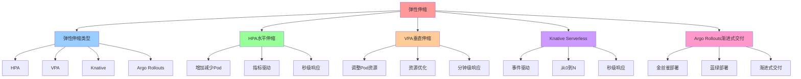

# 弹性伸缩：自动横向扩缩与渐进式交付

## 📑 目录

- [弹性伸缩：自动横向扩缩与渐进式交付](#弹性伸缩自动横向扩缩与渐进式交付)
  - [📑 目录](#-目录)
  - [1 概述](#1-概述)
    - [1.1 核心思想](#11-核心思想)
  - [2 弹性伸缩类型](#2-弹性伸缩类型)
    - [2.1 弹性伸缩类型概览](#21-弹性伸缩类型概览)
    - [2.2 弹性伸缩对比](#22-弹性伸缩对比)
  - [3 HPA（水平自动伸缩）](#3-hpa水平自动伸缩)
    - [3.1 HPA 定义](#31-hpa-定义)
    - [3.2 HPA 配置](#32-hpa-配置)
    - [3.3 HPA 工作原理](#33-hpa-工作原理)
    - [3.4 HPA 指标类型](#34-hpa-指标类型)
  - [4 VPA（垂直自动伸缩）](#4-vpa垂直自动伸缩)
    - [4.1 VPA 定义](#41-vpa-定义)
    - [4.2 VPA 配置](#42-vpa-配置)
    - [4.3 VPA 工作原理](#43-vpa-工作原理)
    - [4.4 VPA 更新模式](#44-vpa-更新模式)
  - [5 Knative（Serverless 自动伸缩）](#5-knativeserverless-自动伸缩)
    - [5.1 Knative 定义](#51-knative-定义)
    - [5.2 Knative 配置](#52-knative-配置)
    - [5.3 Knative 工作原理](#53-knative-工作原理)
    - [5.4 Knative 伸缩策略](#54-knative-伸缩策略)
  - [6 Argo Rollouts（渐进式交付）](#6-argo-rollouts渐进式交付)
    - [6.1 Argo Rollouts 定义](#61-argo-rollouts-定义)
    - [6.2 金丝雀部署配置](#62-金丝雀部署配置)
    - [6.3 蓝绿部署配置](#63-蓝绿部署配置)
    - [6.4 Argo Rollouts 工作原理](#64-argo-rollouts-工作原理)
  - [7 弹性伸缩组合](#7-弹性伸缩组合)
    - [7.1 HPA + VPA](#71-hpa--vpa)
    - [7.2 HPA + Argo Rollouts](#72-hpa--argo-rollouts)
    - [7.3 Knative + Service Mesh](#73-knative--service-mesh)
  - [8 形式化定义](#8-形式化定义)
    - [8.1 弹性伸缩定义](#81-弹性伸缩定义)
    - [8.2 HPA 定义](#82-hpa-定义)
    - [8.3 VPA 定义](#83-vpa-定义)
  - [9 最佳实践](#9-最佳实践)
    - [9.1 HPA 最佳实践](#91-hpa-最佳实践)
    - [9.2 VPA 最佳实践](#92-vpa-最佳实践)
    - [9.3 Argo Rollouts 最佳实践](#93-argo-rollouts-最佳实践)
  - [10 总结](#10-总结)
    - [10.1 相关文档](#101-相关文档)
  - [11 认知增强：思维导图、知识矩阵与专家观点](#11-认知增强思维导图知识矩阵与专家观点)
    - [11.1 弹性伸缩完整思维导图](#111-弹性伸缩完整思维导图)
    - [11.2 知识多维关系矩阵](#112-知识多维关系矩阵)
      - [弹性伸缩类型多维关系矩阵](#弹性伸缩类型多维关系矩阵)
      - [弹性伸缩组合多维关系矩阵](#弹性伸缩组合多维关系矩阵)
    - [11.3 形象化解释论证](#113-形象化解释论证)
      - [弹性伸缩的形象化类比](#弹性伸缩的形象化类比)
        - [1. 弹性伸缩 = 自动调温系统](#1-弹性伸缩--自动调温系统)
        - [2. HPA = 自动排队系统](#2-hpa--自动排队系统)
        - [3. VPA = 自动调优配](#3-vpa--自动调优配)
        - [4. Knative = 自动开关系统](#4-knative--自动开关系统)
        - [5. Argo Rollouts = 渐进式调整](#5-argo-rollouts--渐进式调整)
    - [11.4 专家观点与论证](#114-专家观点与论证)
      - [计算信息软件科学家的观点](#计算信息软件科学家的观点)
        - [1. Fred Brooks（《人月神话》作者）](#1-fred-brooks人月神话作者)
        - [2. Leslie Lamport（分布式系统理论家）](#2-leslie-lamport分布式系统理论家)
        - [3. Barbara Liskov（Liskov替换原则）](#3-barbara-liskovliskov替换原则)
      - [计算信息软件教育家的观点](#计算信息软件教育家的观点)
        - [1. Robert C. Martin（《代码整洁之道》作者）](#1-robert-c-martin代码整洁之道作者)
        - [2. Martin Fowler（重构之父）](#2-martin-fowler重构之父)
      - [计算信息软件认知学家的观点](#计算信息软件认知学家的观点)
        - [1. Donald Norman（《设计心理学》作者）](#1-donald-norman设计心理学作者)
        - [2. Herbert A. Simon（认知科学家）](#2-herbert-a-simon认知科学家)
    - [11.5 认知学习路径矩阵](#115-认知学习路径矩阵)
    - [11.6 专家推荐阅读路径](#116-专家推荐阅读路径)

---

## 1 概述

本文档详细阐述**弹性伸缩**的实现方法，通过 **HPA、VPA、Knative、Argo Rollouts**
等技术实现自动横向扩缩和渐进式交付。

### 1.1 核心思想

> **通过自动弹性伸缩实现资源的动态分配，通过渐进式交付实现安全的部署和回滚**

## 2 弹性伸缩类型

### 2.1 弹性伸缩类型概览

| 类型              | 定义                             | 典型工具           | 适用场景 |
| ----------------- | -------------------------------- | ------------------ | -------- |
| **HPA**           | 水平自动伸缩：增加/减少 Pod 数量 | Kubernetes HPA     | 负载变化 |
| **VPA**           | 垂直自动伸缩：调整 Pod 资源      | Kubernetes VPA     | 资源优化 |
| **Knative**       | Serverless 自动伸缩              | Knative Autoscaler | 事件驱动 |
| **Argo Rollouts** | 渐进式交付：蓝绿/金丝雀部署      | Argo Rollouts      | 安全部署 |

### 2.2 弹性伸缩对比

| 类型              | 伸缩方向 | 伸缩粒度 | 响应时间 | 适用场景 |
| ----------------- | -------- | -------- | -------- | -------- |
| **HPA**           | 水平     | Pod 级别 | 秒级     | 负载变化 |
| **VPA**           | 垂直     | Pod 级别 | 分钟级   | 资源优化 |
| **Knative**       | 水平     | Pod 级别 | 秒级     | 事件驱动 |
| **Argo Rollouts** | 渐进     | 版本级别 | 分钟级   | 安全部署 |

## 3 HPA（水平自动伸缩）

### 3.1 HPA 定义

**HPA** 是水平自动伸缩，通过增加/减少 Pod 数量来应对负载变化。

### 3.2 HPA 配置

**HPA 配置示例**：

```yaml
apiVersion: autoscaling/v2
kind: HorizontalPodAutoscaler
metadata:
  name: order-service-hpa
spec:
  scaleTargetRef:
    apiVersion: apps/v1
    kind: Deployment
    name: order-service
  minReplicas: 3
  maxReplicas: 10
  metrics:
    - type: Resource
      resource:
        name: cpu
        target:
          type: Utilization
          averageUtilization: 70
    - type: Resource
      resource:
        name: memory
        target:
          type: Utilization
          averageUtilization: 80
```

### 3.3 HPA 工作原理

**HPA 工作流程**：

```text
1. 收集指标（Prometheus）
    ↓
2. 计算目标副本数
    ↓
3. 调整 Deployment 副本数
    ↓
4. Pod 自动创建/删除
```

### 3.4 HPA 指标类型

**HPA 指标类型**：

- **Resource**：CPU、内存使用率
- **Pod**：Pod 级别指标
- **Object**：对象级别指标
- **External**：外部指标

## 4 VPA（垂直自动伸缩）

### 4.1 VPA 定义

**VPA** 是垂直自动伸缩，通过调整 Pod 资源（CPU、内存）来优化资源使用。

### 4.2 VPA 配置

**VPA 配置示例**：

```yaml
apiVersion: autoscaling.k8s.io/v1
kind: VerticalPodAutoscaler
metadata:
  name: order-service-vpa
spec:
  targetRef:
    apiVersion: apps/v1
    kind: Deployment
    name: order-service
  updatePolicy:
    updateMode: "Auto"
  resourcePolicy:
    containerPolicies:
      - containerName: order-service
        minAllowed:
          cpu: 100m
          memory: 128Mi
        maxAllowed:
          cpu: 2
          memory: 2Gi
```

### 4.3 VPA 工作原理

**VPA 工作流程**：

```text
1. 收集历史资源使用数据
    ↓
2. 计算推荐资源值
    ↓
3. 调整 Pod 资源请求/限制
    ↓
4. Pod 重启应用新资源
```

### 4.4 VPA 更新模式

**VPA 更新模式**：

- **Auto**：自动更新 Pod 资源
- **Recreate**：重新创建 Pod 应用新资源
- **Off**：仅推荐，不自动更新

## 5 Knative（Serverless 自动伸缩）

### 5.1 Knative 定义

**Knative** 是 Serverless 平台，提供自动伸缩功能。

### 5.2 Knative 配置

**Knative Service 配置**：

```yaml
apiVersion: serving.knative.dev/v1
kind: Service
metadata:
  name: order-service
spec:
  template:
    metadata:
      annotations:
        autoscaling.knative.dev/minScale: "1"
        autoscaling.knative.dev/maxScale: "10"
        autoscaling.knative.dev/target: "70"
    spec:
      containers:
        - image: order-service:latest
          resources:
            requests:
              cpu: 100m
              memory: 128Mi
```

### 5.3 Knative 工作原理

**Knative 工作流程**：

```text
1. 请求到达（事件触发）
    ↓
2. 计算目标副本数（基于请求数）
    ↓
3. 自动扩容（从 0 到目标副本数）
    ↓
4. 请求处理
    ↓
5. 自动缩容（从目标副本数到 0）
```

### 5.4 Knative 伸缩策略

**Knative 伸缩策略**：

- **基于请求数**：根据请求数自动伸缩
- **基于并发数**：根据并发数自动伸缩
- **基于 CPU**：根据 CPU 使用率自动伸缩

## 6 Argo Rollouts（渐进式交付）

### 6.1 Argo Rollouts 定义

**Argo Rollouts** 是渐进式交付工具，支持蓝绿部署、金丝雀部署。

### 6.2 金丝雀部署配置

**金丝雀部署配置**：

```yaml
apiVersion: argoproj.io/v1alpha1
kind: Rollout
metadata:
  name: order-service
spec:
  replicas: 5
  strategy:
    canary:
      steps:
        - setWeight: 10
        - pause: {}
        - setWeight: 20
        - pause: { duration: 10m }
        - setWeight: 40
        - pause: { duration: 10m }
        - setWeight: 60
        - pause: { duration: 10m }
        - setWeight: 80
        - pause: { duration: 10m }
      canaryService: order-service-canary
      stableService: order-service-stable
      trafficRouting:
        istio:
          virtualService:
            name: order-service-vs
            routes:
              - primary
```

### 6.3 蓝绿部署配置

**蓝绿部署配置**：

```yaml
apiVersion: argoproj.io/v1alpha1
kind: Rollout
metadata:
  name: order-service
spec:
  replicas: 5
  strategy:
    blueGreen:
      activeService: order-service-active
      previewService: order-service-preview
      autoPromotionEnabled: false
      scaleDownDelaySeconds: 30
```

### 6.4 Argo Rollouts 工作原理

**Argo Rollouts 工作流程**：

```text
1. 创建新版本 Pod
    ↓
2. 逐步增加流量（金丝雀）
    ↓
3. 监控指标（Prometheus）
    ↓
4. 自动回滚（如果指标异常）
    ↓
5. 完成部署（如果指标正常）
```

## 7 弹性伸缩组合

### 7.1 HPA + VPA

**HPA + VPA 组合**：

```text
HPA: 水平伸缩（增加/减少 Pod）
    +
VPA: 垂直伸缩（调整 Pod 资源）
    =
优化资源使用 + 应对负载变化
```

### 7.2 HPA + Argo Rollouts

**HPA + Argo Rollouts 组合**：

```text
HPA: 自动伸缩（应对负载变化）
    +
Argo Rollouts: 渐进式交付（安全部署）
    =
自动伸缩 + 安全部署
```

### 7.3 Knative + Service Mesh

**Knative + Service Mesh 组合**：

```text
Knative: Serverless 自动伸缩
    +
Service Mesh: 流量治理
    =
Serverless + 流量治理
```

## 8 形式化定义

### 8.1 弹性伸缩定义

```text
弹性伸缩 A = ⟨type, metrics, policy, actions⟩
其中：
- type ∈ {HPA, VPA, Knative, ArgoRollouts}
- metrics: 指标集合
- policy: 伸缩策略
- actions: 伸缩动作集合
```

### 8.2 HPA 定义

```text
HPA = ⟨target, minReplicas, maxReplicas, metrics⟩
其中：
- target: 目标 Deployment/StatefulSet
- minReplicas: 最小副本数
- maxReplicas: 最大副本数
- metrics: 指标集合
```

### 8.3 VPA 定义

```text
VPA = ⟨target, updateMode, resourcePolicy⟩
其中：
- target: 目标 Deployment/StatefulSet
- updateMode: 更新模式（Auto/Recreate/Off）
- resourcePolicy: 资源策略
```

## 9 最佳实践

### 9.1 HPA 最佳实践

**HPA 最佳实践**：

- **合理设置指标**：使用 CPU、内存等核心指标
- **合理设置范围**：minReplicas 和 maxReplicas
- **监控伸缩行为**：监控 HPA 的伸缩行为

### 9.2 VPA 最佳实践

**VPA 最佳实践**：

- **合理设置资源范围**：minAllowed 和 maxAllowed
- **使用 Off 模式学习**：先使用 Off 模式学习资源使用
- **逐步启用 Auto 模式**：学习完成后启用 Auto 模式

### 9.3 Argo Rollouts 最佳实践

**Argo Rollouts 最佳实践**：

- **逐步增加流量**：从 10% 逐步增加到 100%
- **监控关键指标**：监控错误率、延迟等关键指标
- **自动回滚**：配置自动回滚策略

## 10 总结

通过**弹性伸缩**，我们实现了：

1. **自动横向扩缩**：通过 HPA 自动应对负载变化
2. **自动垂直扩缩**：通过 VPA 优化资源使用
3. **Serverless 自动伸缩**：通过 Knative 实现 Serverless 自动伸缩
4. **渐进式交付**：通过 Argo Rollouts 实现安全的部署和回滚
5. **组合使用**：HPA + VPA + Argo Rollouts 组合使用

### 10.1 相关文档

**扩展阅读**：

- **[eBPF/OTLP 架构视角](../09-multi-perspectives/07-ebpf-otlp-perspective.md)**
  ⭐ - 横纵耦合的可观测性驱动架构
  - **自动伸缩：从响应式到预测式的演进**（5.2 章节）
  - 细粒度指标驱动（Socket 队列积压、goroutine 阻塞数、JVM 老年代分配速率、TCP
    重传率）
  - 实时反馈控制回路（eBPF 采集 → OTLP Metrics → HPA 决策）
  - 智能容量规划（基于 eBPF 的记帐机制 + OTLP 成本关联模型）
- **[可观测性文档](../07-dynamic-operations/02-observability.md)** - 统一遥测与
  监控
- **[32. eBPF/OTLP 扩展技术分析](../../../TECHNICAL/32-ebpf-otlp-analysis/ebpf-otlp-analysis.md)**
  ⭐ - eBPF/OTLP 扩展技术分析文档

---

---

## 11 认知增强：思维导图、知识矩阵与专家观点

### 11.1 弹性伸缩完整思维导图



### 11.2 知识多维关系矩阵

#### 弹性伸缩类型多维关系矩阵

| 类型维度 | HPA | VPA | Knative | Argo Rollouts | 类型协同 | 认知价值 |
|---------|-----|-----|---------|--------------|---------|---------|
| **伸缩方向** | 水平 | 垂直 | 水平 | 渐进 | 方向对比 | 方向理解 |
| **伸缩粒度** | Pod级别 | Pod级别 | Pod级别 | 版本级别 | 粒度对比 | 粒度理解 |
| **响应时间** | 秒级 | 分钟级 | 秒级 | 分钟级 | 时间对比 | 时间理解 |
| **适用场景** | 负载变化 | 资源优化 | 事件驱动 | 安全部署 | 场景对比 | 场景理解 |
| **典型工具** | Kubernetes HPA | Kubernetes VPA | Knative Autoscaler | Argo Rollouts | 工具栈 | 工具理解 |
| **学习难度** | ⭐⭐⭐ | ⭐⭐⭐ | ⭐⭐⭐⭐ | ⭐⭐⭐⭐ | ⭐⭐⭐⭐ | 渐进学习 |
| **专家推荐** | ⭐⭐⭐⭐⭐ | ⭐⭐⭐⭐⭐ | ⭐⭐⭐⭐⭐ | ⭐⭐⭐⭐⭐ | ⭐⭐⭐⭐⭐ | 技术深度 |

#### 弹性伸缩组合多维关系矩阵

| 组合维度 | HPA+VPA | HPA+Argo Rollouts | Knative+Service Mesh | 组合协同 | 认知价值 |
|---------|---------|------------------|---------------------|---------|---------|
| **组合目的** | 资源优化+负载应对 | 自动伸缩+安全部署 | Serverless+流量治理 | 完整组合 | 目的理解 |
| **技术实现** | HPA水平+VPA垂直 | HPA伸缩+Rollouts部署 | Knative伸缩+Mesh治理 | 技术栈 | 实现理解 |
| **架构收益** | 资源优化+负载应对 | 自动伸缩+安全部署 | Serverless+流量治理 | 完整收益 | 收益理解 |
| **适用场景** | 资源优化场景 | 安全部署场景 | Serverless场景 | 完整应用 | 场景理解 |
| **学习难度** | ⭐⭐⭐⭐ | ⭐⭐⭐⭐ | ⭐⭐⭐⭐⭐ | ⭐⭐⭐⭐ | 渐进学习 |
| **专家推荐** | ⭐⭐⭐⭐⭐ | ⭐⭐⭐⭐⭐ | ⭐⭐⭐⭐⭐ | ⭐⭐⭐⭐⭐ | 技术深度 |

### 11.3 形象化解释论证

#### 弹性伸缩的形象化类比

##### 1. 弹性伸缩 = 自动调温系统

> **类比**：弹性伸缩就像自动调温系统，HPA像增加减少房间（水平伸缩），VPA像调整房间温度（垂直伸缩），Knative像自动开关房间（Serverless伸缩），Argo Rollouts像逐步调整温度（渐进式交付），就像自动调温系统根据温度自动调整一样。

**认知价值**：

- **自动理解**：通过自动调温系统类比，理解弹性伸缩的自动特性
- **方向理解**：通过房间和温度类比，理解水平和垂直伸缩的区别
- **场景理解**：通过调温场景类比，理解不同伸缩类型的适用场景

##### 2. HPA = 自动排队系统

> **类比**：HPA就像自动排队系统，负载增加像排队人数增加（需要更多窗口），HPA像自动增加窗口（增加Pod），负载减少像排队人数减少（需要更少窗口），HPA像自动减少窗口（减少Pod），就像自动排队系统根据排队人数自动调整窗口数量一样。

**认知价值**：

- **水平理解**：通过排队系统类比，理解HPA水平伸缩的含义
- **自动理解**：通过自动调整窗口类比，理解HPA自动伸缩的机制
- **负载理解**：通过排队人数类比，理解HPA基于负载的伸缩逻辑

##### 3. VPA = 自动调优配

> **类比**：VPA就像自动排队优配，资源使用像窗口效率（需要优化），VPA像自动优化窗口效率（调整Pod资源），资源优化像提高窗口效率（优化资源使用），就像自动排队优配根据窗口效率自动优化一样。

**认知价值**：

- **垂直理解**：通过窗口效率优化类比，理解VPA垂直伸缩的含义
- **优化理解**：通过效率优化类比，理解VPA资源优化的作用
- **资源理解**：通过窗口效率类比，理解VPA资源优化的机制

##### 4. Knative = 自动开关系统

> **类比**：Knative就像自动开关系统，事件触发像有人按门铃（需要服务），Knative像自动开门（从0到N扩容），事件结束像人离开（不需要服务），Knative像自动关门（从N到0缩容），就像自动开关系统根据事件自动开关一样。

**认知价值**：

- **Serverless理解**：通过自动开关系统类比，理解Knative Serverless伸缩的含义
- **事件理解**：通过门铃事件类比，理解Knative事件驱动的机制
- **伸缩理解**：通过开关类比，理解Knative从0到N的伸缩特性

##### 5. Argo Rollouts = 渐进式调整

> **类比**：Argo Rollouts就像渐进式调整，新版本像新温度（需要调整），金丝雀部署像逐步调温（从10%到100%），蓝绿部署像切换温度（从旧温度到新温度），就像渐进式调整根据温度逐步调整一样。

**认知价值**：

- **渐进理解**：通过渐进式调整类比，理解Argo Rollouts渐进式交付的含义
- **安全理解**：通过逐步调温类比，理解Argo Rollouts安全部署的作用
- **部署理解**：通过温度调整类比，理解Argo Rollouts部署机制

### 11.4 专家观点与论证

#### 计算信息软件科学家的观点

##### 1. Fred Brooks（《人月神话》作者）

> **观点**："The hardest single part of building a software system is deciding precisely what to build."（构建软件系统最困难的部分是精确决定构建什么）

**与弹性伸缩的关联**：

- **决策理解**：弹性伸缩帮助决策（自动伸缩、资源优化、安全部署）
- **设计理解**：通过弹性伸缩理解软件系统构建的决策过程（HPA、VPA、Knative、Argo Rollouts）
- **构建理解**：通过弹性伸缩理解软件系统构建的弹性需求

##### 2. Leslie Lamport（分布式系统理论家）

> **观点**："A distributed system is one in which the failure of a computer you didn't even know existed can render your own computer unusable."（分布式系统是指一个你不知道存在的计算机的故障可能导致你自己的计算机无法使用的系统）

**与弹性伸缩的关联**：

- **分布式理解**：弹性伸缩体现了分布式系统的特性（HPA、VPA、Knative都是分布式概念）
- **故障理解**：通过弹性伸缩理解分布式系统的故障处理（自动伸缩、资源优化、安全部署）
- **系统理解**：通过弹性伸缩理解分布式系统的复杂性（多种伸缩类型、组合使用）

##### 3. Barbara Liskov（Liskov替换原则）

> **观点**："What is wanted is something like the following substitution property: If for each object o1 of type S there is an object o2 of type T such that for all programs P defined in terms of T, the behavior of P is unchanged when o1 is substituted for o2 then S is a subtype of T."（需要的是类似以下替换属性：如果对于类型S的每个对象o1，存在类型T的对象o2，使得对于所有用T定义的程序P，当o1替换o2时，P的行为不变，则S是T的子类型）

**与弹性伸缩的关联**：

- **替换理解**：弹性伸缩体现了替换原则（HPA、VPA、Knative可以替换手动伸缩）
- **行为理解**：通过弹性伸缩理解工具替换时行为保持不变（自动伸缩、资源优化）
- **子类型理解**：通过弹性伸缩理解工具类型的子类型关系（HPA、VPA、Knative是弹性伸缩工具的子类型）

#### 计算信息软件教育家的观点

##### 1. Robert C. Martin（《代码整洁之道》作者）

> **观点**："The only way to go fast is to go well."（快速前进的唯一方法是做好）

**与弹性伸缩的关联**：

- **质量理解**：弹性伸缩体现了系统质量（自动伸缩、资源优化、安全部署）
- **速度理解**：通过弹性伸缩理解速度与质量的权衡（自动伸缩vs手动伸缩）
- **实践理解**：通过弹性伸缩指导实践，选择"做好"的伸缩方案

##### 2. Martin Fowler（重构之父）

> **观点**："Any fool can write code that a computer can understand. Good programmers write code that humans can understand."（任何傻瓜都能编写计算机能理解的代码。好的程序员编写人类能理解的代码）

**与弹性伸缩的关联**：

- **可理解性理解**：弹性伸缩通过自动伸缩、资源优化提高可理解性
- **人类理解**：通过弹性伸缩理解系统的人类可理解性（清晰的配置、自动的行为）
- **选择理解**：通过弹性伸缩选择"人类能理解"的伸缩方案

#### 计算信息软件认知学家的观点

##### 1. Donald Norman（《设计心理学》作者）

> **观点**："The real problem with the interface is that it is an interface. Interfaces get in the way. I don't want to focus my energies on an interface. I want to focus on the job."（界面的真正问题是它是界面。界面会妨碍。我不想把精力集中在界面上。我想专注于工作）

**与弹性伸缩的关联**：

- **接口理解**：弹性伸缩体现了接口的重要性（HPA、VPA、Knative配置），但也要避免过度关注接口
- **工作理解**：通过弹性伸缩专注于系统工作（自动伸缩、资源优化），而不是过度关注接口细节
- **平衡理解**：通过弹性伸缩理解接口与工作的平衡

##### 2. Herbert A. Simon（认知科学家）

> **观点**："A wealth of information creates a poverty of attention."（信息丰富导致注意力贫乏）

**与弹性伸缩的关联**：

- **注意力理解**：弹性伸缩通过自动伸缩、资源优化管理注意力，避免信息过载
- **结构化理解**：通过弹性伸缩结构化信息（HPA、VPA、Knative、Argo Rollouts），减少认知负荷
- **管理理解**：通过弹性伸缩管理信息，避免注意力贫乏

### 11.5 认知学习路径矩阵

| 学习阶段 | 推荐内容 | 推荐类型 | 学习重点 | 学习时间 | 前置要求 | 后续进阶 |
|---------|---------|---------|---------|---------|---------|---------|
| **新手阶段** | 概述、弹性伸缩类型 | HPA、VPA | 类型理解、基本概念理解 | 1-2周 | 无 | 进阶阶段 |
| **进阶阶段** | HPA、VPA、Knative | Knative、Argo Rollouts | 工具理解、组合理解 | 4-8周 | 新手阶段 | 专家阶段 |
| **专家阶段** | 弹性伸缩组合、最佳实践 | 完整组合 | 组合理解、实践理解 | 16+周 | 进阶阶段 | - |

### 11.6 专家推荐阅读路径

**路径1：弹性伸缩理解路径**：

1. **第一步**：阅读概述（第1节），理解弹性伸缩概览
2. **第二步**：阅读弹性伸缩类型（第2节），理解HPA、VPA、Knative、Argo Rollouts
3. **第三步**：阅读弹性伸缩组合（第7节），理解组合使用
4. **第四步**：阅读总结（第10节），回顾关键要点

**路径2：工具理解路径**：

1. **第一步**：阅读概述（第1节），了解弹性伸缩
2. **第二步**：阅读HPA、VPA、Knative、Argo Rollouts（第3-6节），学习工具使用
3. **第三步**：阅读最佳实践（第9节），学习实践方法
4. **第四步**：阅读总结（第10节），学习最佳实践

**路径3：实践应用路径**：

1. **第一步**：阅读概述（第1节），了解弹性伸缩
2. **第二步**：阅读最佳实践（第9节），学习实践方法
3. **第三步**：阅读形式化定义（第8节），理解理论基础
4. **第四步**：阅读总结（第10节），学习最佳实践

---

**更新时间**：2025-11-15 **版本**：v1.2 **参考**：`architecture_view.md` 第1320-1330行，弹性伸缩部分

**更新内容（v1.2）**：

- ✅ 添加认知增强章节（思维导图、知识矩阵、形象化解释、专家观点）
- ✅ 添加认知学习路径矩阵
- ✅ 添加专家推荐阅读路径（3条路径）
