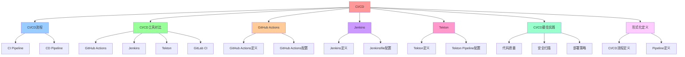

# CI/CD：自动化构建、测试、部署

## 📑 目录

- [CI/CD：自动化构建、测试、部署](#cicd自动化构建测试部署)
  - [📑 目录](#-目录)
  - [1 概述](#1-概述)
    - [1.1 核心思想](#11-核心思想)
  - [2 CI/CD 流程](#2-cicd-流程)
    - [2.1 CI/CD 流程概览](#21-cicd-流程概览)
    - [2.2 CI/CD 工具对比](#22-cicd-工具对比)
  - [3 GitHub Actions](#3-github-actions)
    - [3.1 GitHub Actions 定义](#31-github-actions-定义)
    - [3.2 GitHub Actions 配置](#32-github-actions-配置)
  - [4 Jenkins](#4-jenkins)
    - [4.1 Jenkins 定义](#41-jenkins-定义)
    - [4.2 Jenkinsfile 配置](#42-jenkinsfile-配置)
  - [5 Tekton](#5-tekton)
    - [5.1 Tekton 定义](#51-tekton-定义)
    - [5.2 Tekton Pipeline 配置](#52-tekton-pipeline-配置)
  - [6 CI/CD 最佳实践](#6-cicd-最佳实践)
    - [6.1 代码质量](#61-代码质量)
    - [6.2 安全扫描](#62-安全扫描)
    - [6.3 部署策略](#63-部署策略)
  - [7 形式化定义](#7-形式化定义)
    - [7.1 CI/CD 流程定义](#71-cicd-流程定义)
    - [7.2 Pipeline 定义](#72-pipeline-定义)
  - [8 总结](#8-总结)

---

## 1 概述

本文档详细阐述**CI/CD** 的实现方法，通过 **GitHub Actions、Jenkins、Tekton** 等
技术实现自动化构建、测试、部署。

### 1.1 核心思想

> **通过 CI/CD 实现代码到生产的自动化流程，包括构建、测试、部署等环节，提高交付
> 效率和质量**

## 2 CI/CD 流程

### 2.1 CI/CD 流程概览

```text
开发
  ↓
Git Push
  ↓
CI Pipeline
  ├── 代码检查（Lint）
  ├── 单元测试（Test）
  ├── 构建镜像（Build）
  ├── 安全扫描（Security Scan）
  └── 推送镜像（Push）
  ↓
CD Pipeline
  ├── 部署到测试环境
  ├── 集成测试
  ├── 部署到生产环境
  └── 监控和告警
```

### 2.2 CI/CD 工具对比

| 工具               | 特点                  | 适用场景        |
| ------------------ | --------------------- | --------------- |
| **GitHub Actions** | GitHub 集成，易于使用 | GitHub 项目     |
| **Jenkins**        | 功能丰富，可扩展      | 企业级项目      |
| **Tekton**         | Kubernetes 原生       | Kubernetes 环境 |
| **GitLab CI**      | GitLab 集成           | GitLab 项目     |

## 3 GitHub Actions

### 3.1 GitHub Actions 定义

**GitHub Actions** 是 GitHub 的 CI/CD 平台，提供：

- **自动化工作流**：通过 YAML 定义工作流
- **GitHub 集成**：与 GitHub 深度集成
- **丰富的 Actions**：丰富的预定义 Actions

### 3.2 GitHub Actions 配置

**GitHub Actions 配置示例**：

```yaml
name: CI/CD Pipeline

on:
  push:
    branches: [main]
  pull_request:
    branches: [main]

jobs:
  build:
    runs-on: ubuntu-latest
    steps:
      - uses: actions/checkout@v3

      - name: Set up Docker Buildx
        uses: docker/setup-buildx-action@v2

      - name: Build Docker image
        uses: docker/build-push-action@v4
        with:
          context: .
          push: true
          tags: |
            ghcr.io/${{ github.repository }}:${{ github.sha }}
            ghcr.io/${{ github.repository }}:latest

      - name: Run tests
        run: |
          docker run --rm \
            ghcr.io/${{ github.repository }}:${{ github.sha }} \
            npm test

      - name: Deploy to Kubernetes
        uses: azure/k8s-deploy@v4
        with:
          manifests: |
            k8s/deployment.yaml
            k8s/service.yaml
          images: |
            ghcr.io/${{ github.repository }}:${{ github.sha }}
```

## 4 Jenkins

### 4.1 Jenkins 定义

**Jenkins** 是功能丰富的 CI/CD 平台，提供：

- **Pipeline as Code**：通过 Jenkinsfile 定义 Pipeline
- **丰富的插件**：丰富的插件生态
- **分布式构建**：支持分布式构建

### 4.2 Jenkinsfile 配置

**Jenkinsfile 配置示例**：

```groovy
pipeline {
  agent any

  stages {
    stage('Checkout') {
      steps {
        checkout scm
      }
    }

    stage('Build') {
      steps {
        sh 'docker build -t my-app:${BUILD_NUMBER} .'
      }
    }

    stage('Test') {
      steps {
        sh 'docker run --rm my-app:${BUILD_NUMBER} npm test'
      }
    }

    stage('Deploy') {
      steps {
        sh 'kubectl set image deployment/my-app my-app=my-app:${BUILD_NUMBER}'
      }
    }
  }
}
```

## 5 Tekton

### 5.1 Tekton 定义

**Tekton** 是 Kubernetes 原生的 CI/CD 平台，提供：

- **Kubernetes 原生**：完全基于 Kubernetes CRD
- **云原生**：设计符合云原生理念
- **可扩展**：支持自定义 Tasks 和 Pipelines

### 5.2 Tekton Pipeline 配置

**Tekton Pipeline 配置**：

```yaml
apiVersion: tekton.dev/v1beta1
kind: Pipeline
metadata:
  name: build-and-deploy
spec:
  params:
    - name: image-url
      type: string
    - name: image-tag
      type: string
  tasks:
    - name: build
      taskRef:
        name: buildah
      params:
        - name: IMAGE
          value: $(params.image-url):$(params.image-tag)

    - name: deploy
      runAfter: [build]
      taskRef:
        name: kubectl-apply
      params:
        - name: IMAGE
          value: $(params.image-url):$(params.image-tag)
```

## 6 CI/CD 最佳实践

### 6.1 代码质量

**代码质量保证**：

- **Lint**：代码风格检查
- **单元测试**：自动化单元测试
- **代码覆盖率**：代码覆盖率要求

### 6.2 安全扫描

**安全扫描**：

- **镜像扫描**：Trivy、Clair 扫描镜像漏洞
- **依赖扫描**：扫描依赖漏洞
- **配置扫描**：扫描 Kubernetes 配置安全

### 6.3 部署策略

**部署策略**：

- **蓝绿部署**：零停机部署
- **金丝雀部署**：渐进式部署
- **滚动更新**：逐步更新

## 7 形式化定义

### 7.1 CI/CD 流程定义

```text
CI/CD 流程 F = ⟨stages, steps, conditions, actions⟩
其中：
- stages: 阶段集合
- steps: 步骤集合
- conditions: 条件集合
- actions: 动作集合
```

### 7.2 Pipeline 定义

```text
Pipeline P = ⟨stages, triggers, artifacts⟩
其中：
- stages: 阶段集合
- triggers: 触发条件集合
- artifacts: 产物集合
```

## 8 总结

通过**CI/CD**，我们实现了：

1. **自动化构建**：自动构建 Docker 镜像
2. **自动化测试**：自动运行单元测试和集成测试
3. **自动化部署**：自动部署到 Kubernetes
4. **安全扫描**：自动扫描镜像和配置安全
5. **渐进式交付**：通过蓝绿/金丝雀部署实现安全部署

---

## 9 认知增强：思维导图、知识矩阵与专家观点

### 9.1 CI/CD完整思维导图



### 9.2 知识多维关系矩阵

#### CI/CD工具对比多维关系矩阵

| 工具维度 | GitHub Actions | Jenkins | Tekton | GitLab CI | 工具协同 | 认知价值 |
|---------|---------------|---------|--------|-----------|---------|---------|
| **特点** | GitHub集成，易于使用 | 功能丰富，可扩展 | Kubernetes原生 | GitLab集成 | 特点对比 | 特点理解 |
| **适用场景** | GitHub项目 | 企业级项目 | Kubernetes环境 | GitLab项目 | 场景对比 | 场景理解 |
| **配置方式** | YAML | Jenkinsfile (Groovy) | Kubernetes CRD | YAML | 方式对比 | 方式理解 |
| **集成能力** | GitHub深度集成 | 丰富的插件生态 | Kubernetes原生 | GitLab深度集成 | 能力对比 | 能力理解 |
| **扩展性** | 中等 | 高 | 高 | 中等 | 扩展对比 | 扩展理解 |
| **学习难度** | ⭐⭐⭐ | ⭐⭐⭐⭐ | ⭐⭐⭐⭐ | ⭐⭐⭐ | ⭐⭐⭐ | 渐进学习 |
| **专家推荐** | ⭐⭐⭐⭐⭐ | ⭐⭐⭐⭐⭐ | ⭐⭐⭐⭐⭐ | ⭐⭐⭐⭐⭐ | ⭐⭐⭐⭐⭐ | 技术深度 |

#### CI/CD流程多维关系矩阵

| 流程维度 | CI Pipeline | CD Pipeline | 流程协同 | 认知价值 |
|---------|------------|------------|---------|---------|
| **阶段** | 代码检查、单元测试、构建镜像、安全扫描、推送镜像 | 部署到测试环境、集成测试、部署到生产环境、监控和告警 | 阶段对比 | 阶段理解 |
| **自动化程度** | 高 | 高 | 程度对比 | 程度理解 |
| **质量保证** | 代码质量、安全扫描 | 集成测试、监控告警 | 保证对比 | 保证理解 |
| **部署策略** | 无 | 蓝绿部署、金丝雀部署、滚动更新 | 策略对比 | 策略理解 |
| **学习难度** | ⭐⭐⭐ | ⭐⭐⭐⭐ | ⭐⭐⭐⭐ | 渐进学习 |
| **专家推荐** | ⭐⭐⭐⭐⭐ | ⭐⭐⭐⭐⭐ | ⭐⭐⭐⭐⭐ | 技术深度 |

### 9.3 形象化解释论证

#### CI/CD的形象化类比

##### 1. CI/CD = 从手工流程到自动化流水线系统

> **类比**：CI/CD就像从手工流程到自动化流水线系统，CI Pipeline像自动化流水线（代码检查、单元测试、构建镜像、安全扫描、推送镜像），CD Pipeline像自动化部署线（部署到测试环境、集成测试、部署到生产环境、监控和告警），就像自动化流水线系统将复杂流程分解为流程，通过流程实现流程管理一样。

**认知价值**：

- **流程理解**：通过自动化流水线系统类比，理解CI/CD的含义
- **CI理解**：通过自动化流水线类比，理解CI Pipeline的重要性
- **CD理解**：通过自动化部署线类比，理解CD Pipeline的价值

##### 2. CI/CD工具 = 从单一工具到多工具系统

> **类比**：CI/CD工具就像从单一工具到多工具系统，GitHub Actions像GitHub工具（GitHub集成，易于使用），Jenkins像企业工具（功能丰富，可扩展），Tekton像Kubernetes工具（Kubernetes原生），就像多工具系统将复杂工具分解为工具，通过工具实现工具管理一样。

**认知价值**：

- **工具理解**：通过多工具系统类比，理解CI/CD工具的含义
- **GitHub理解**：通过GitHub工具类比，理解GitHub Actions的重要性
- **Jenkins理解**：通过企业工具类比，理解Jenkins的价值
- **Tekton理解**：通过Kubernetes工具类比，理解Tekton的作用

##### 3. CI/CD最佳实践 = 从单一实践到多实践系统

> **类比**：CI/CD最佳实践就像从单一实践到多实践系统，代码质量像质量实践（Lint、单元测试、代码覆盖率），安全扫描像安全实践（镜像扫描、依赖扫描、配置扫描），部署策略像部署实践（蓝绿部署、金丝雀部署、滚动更新），就像多实践系统将复杂实践分解为实践，通过实践实现实践管理一样。

**认知价值**：

- **实践理解**：通过多实践系统类比，理解CI/CD最佳实践的含义
- **质量理解**：通过质量实践类比，理解代码质量的重要性
- **安全理解**：通过安全实践类比，理解安全扫描的价值
- **部署理解**：通过部署实践类比，理解部署策略的作用

##### 4. 形式化定义 = 从自然语言到形式化语言系统

> **类比**：形式化定义就像从自然语言到形式化语言系统，CI/CD流程定义像形式化流程（F = ⟨stages, steps, conditions, actions⟩），Pipeline定义像形式化Pipeline（P = ⟨stages, triggers, artifacts⟩），就像形式化语言系统将复杂定义分解为定义，通过定义实现定义管理一样。

**认知价值**：

- **定义理解**：通过形式化语言系统类比，理解形式化定义的含义
- **流程理解**：通过形式化流程类比，理解CI/CD流程定义的重要性
- **Pipeline理解**：通过形式化Pipeline类比，理解Pipeline定义的价值

##### 5. CI/CD演进 = 从单一阶段到多阶段系统

> **类比**：CI/CD演进就像从单一阶段到多阶段系统，CI阶段像构建阶段（代码检查、单元测试、构建镜像），CD阶段像部署阶段（部署到测试环境、集成测试、部署到生产环境），就像多阶段系统将复杂演进分解为阶段，通过阶段实现演进管理一样。

**认知价值**：

- **演进理解**：通过多阶段系统类比，理解CI/CD演进的含义
- **CI理解**：通过构建阶段类比，理解CI阶段的重要性
- **CD理解**：通过部署阶段类比，理解CD阶段的价值

### 9.4 专家观点与论证

#### 计算信息软件科学家的观点

##### 1. Jez Humble（《持续交付》作者）

> **观点**："Continuous Delivery is a software development discipline where you build software in such a way that it can be released to production at any time."（持续交付是一种软件开发纪律，在这种纪律中，你以可以随时发布到生产环境的方式构建软件）

**与CI/CD的关联**：

- **交付理解**：CI/CD通过CI Pipeline和CD Pipeline体现持续交付
- **自动化理解**：通过CI/CD理解自动化构建、测试、部署的重要性
- **实践理解**：通过CI/CD指导实践，实现"随时发布到生产环境"

##### 2. Martin Fowler（重构之父）

> **观点**："Any fool can write code that a computer can understand. Good programmers write code that humans can understand."（任何傻瓜都能编写计算机能理解的代码。好的程序员编写人类能理解的代码）

**与CI/CD的关联**：

- **可理解性理解**：CI/CD通过清晰的流程（CI Pipeline、CD Pipeline）提高可理解性
- **人类理解**：通过CI/CD理解架构的人类可理解性（清晰的流程、明确的阶段）
- **选择理解**：通过CI/CD选择"人类能理解"的架构

##### 3. Robert C. Martin（《架构整洁之道》作者）

> **观点**："The architecture of a system is defined by the boundaries drawn between components and the dependencies that cross those boundaries."（系统的架构由组件之间绘制的边界和跨越这些边界的依赖关系定义）

**与CI/CD的关联**：

- **边界理解**：CI/CD通过流程边界（CI Pipeline、CD Pipeline）定义架构
- **依赖理解**：通过CI/CD理解依赖关系（代码检查、单元测试、构建镜像、安全扫描、推送镜像）
- **组件理解**：通过CI/CD理解组件划分（GitHub Actions、Jenkins、Tekton）

#### 计算信息软件教育家的观点

##### 1. Alistair Cockburn（敏捷开发专家）

> **观点**："Architecture is the decisions that you wish you could get right early in a project."（架构是你在项目早期希望做对的决策）

**与CI/CD的关联**：

- **决策理解**：CI/CD通过CI/CD工具选择（GitHub Actions、Jenkins、Tekton）提供早期决策框架
- **早期理解**：通过CI/CD理解早期架构决策的重要性（工具选择、流程设计）
- **实践理解**：通过CI/CD指导实践，在项目早期"做对决策"

##### 2. Grady Booch（UML创始人）

> **观点**："Architecture represents the significant design decisions that shape a system, where significant is measured by cost of change."（架构代表塑造系统的重大设计决策，其中"重大"由变更成本来衡量）

**与CI/CD的关联**：

- **决策理解**：CI/CD体现了架构决策的重要性（CI/CD工具选择、流程设计、最佳实践）
- **成本理解**：通过CI/CD理解架构变更成本（流程调整、工具替换）
- **设计理解**：通过CI/CD指导设计，选择"变更成本低"的架构

#### 计算信息软件认知学家的观点

##### 1. Donald Norman（《设计心理学》作者）

> **观点**："The real problem with the interface is that it is an interface. Interfaces get in the way. I don't want to focus my energies on an interface. I want to focus on the job."（界面的真正问题是它是界面。界面会妨碍。我不想把精力集中在界面上。我想专注于工作）

**与CI/CD的关联**：

- **接口理解**：CI/CD通过工具接口（GitHub Actions、Jenkins、Tekton）定义接口，但也要避免过度关注接口
- **工作理解**：通过CI/CD专注于架构工作（自动化构建、测试、部署），而不是过度关注接口细节
- **平衡理解**：通过CI/CD理解接口与工作的平衡

##### 2. Herbert A. Simon（认知科学家）

> **观点**："A wealth of information creates a poverty of attention."（信息丰富导致注意力贫乏）

**与CI/CD的关联**：

- **注意力理解**：CI/CD通过流程、工具管理注意力，避免信息过载
- **结构化理解**：通过CI/CD结构化信息（CI Pipeline、CD Pipeline、CI/CD工具对比），减少认知负荷
- **管理理解**：通过CI/CD管理信息，避免注意力贫乏

### 9.5 认知学习路径矩阵

| 学习阶段 | 推荐内容 | 推荐技术栈 | 学习重点 | 学习时间 | 前置要求 | 后续进阶 |
|---------|---------|-----------|---------|---------|---------|---------|
| **新手阶段** | 概述、CI/CD流程、CI/CD工具对比 | CI/CD概念理解 | 流程理解、工具理解、基本概念理解 | 2-4周 | 无 | 进阶阶段 |
| **进阶阶段** | GitHub Actions、Jenkins、Tekton | 完整技术栈 | 工具理解、配置理解、实践理解 | 8-16周 | 新手阶段 | 专家阶段 |
| **专家阶段** | CI/CD最佳实践、形式化定义 | 完整技术栈 | 实践理解、形式化理解 | 32+周 | 进阶阶段 | - |

### 9.6 专家推荐阅读路径

**路径1：流程理解路径**：

1. **第一步**：阅读概述（第1节），理解CI/CD概览
2. **第二步**：阅读CI/CD流程（第2节），理解CI Pipeline、CD Pipeline
3. **第三步**：阅读CI/CD工具对比（第2.2节），了解各种工具
4. **第四步**：阅读总结（第8节），回顾关键要点

**路径2：工具理解路径**：

1. **第一步**：阅读概述（第1节），了解CI/CD
2. **第二步**：阅读GitHub Actions（第3节）、Jenkins（第4节）、Tekton（第5节），学习各种工具
3. **第三步**：阅读CI/CD最佳实践（第6节），学习代码质量、安全扫描、部署策略
4. **第四步**：阅读形式化定义（第7节），理解CI/CD流程定义、Pipeline定义

**路径3：实践理解路径**：

1. **第一步**：阅读概述（第1节），了解CI/CD
2. **第二步**：阅读CI/CD最佳实践（第6节），学习代码质量、安全扫描、部署策略
3. **第三步**：阅读形式化定义（第7节），理解CI/CD流程定义、Pipeline定义
4. **第四步**：阅读总结（第8节），学习最佳实践

---

**更新时间**：2025-11-15 **版本**：v1.1 **参考**：`architecture_view.md` 第30行，CI/CD部分

**更新内容（v1.1）**：

- ✅ 添加认知增强章节（思维导图、知识矩阵、形象化解释、专家观点）
- ✅ 添加认知学习路径矩阵
- ✅ 添加专家推荐阅读路径（3条路径）
