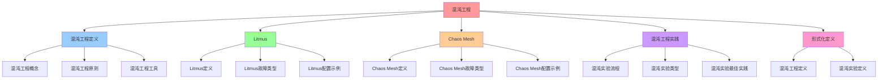

# 混沌工程：可靠性测试与故障注入

## 📑 目录

- [混沌工程：可靠性测试与故障注入](#混沌工程可靠性测试与故障注入)
  - [📑 目录](#-目录)
  - [1 概述](#1-概述)
    - [1.1 核心思想](#11-核心思想)
  - [2 混沌工程定义](#2-混沌工程定义)
    - [2.1 混沌工程概念](#21-混沌工程概念)
    - [2.2 混沌工程原则](#22-混沌工程原则)
    - [2.3 混沌工程工具](#23-混沌工程工具)
  - [3 Litmus](#3-litmus)
    - [3.1 Litmus 定义](#31-litmus-定义)
    - [3.2 Litmus 故障类型](#32-litmus-故障类型)
    - [3.3 Litmus 配置示例](#33-litmus-配置示例)
  - [4 Chaos Mesh](#4-chaos-mesh)
    - [4.1 Chaos Mesh 定义](#41-chaos-mesh-定义)
    - [4.2 Chaos Mesh 故障类型](#42-chaos-mesh-故障类型)
    - [4.3 Chaos Mesh 配置示例](#43-chaos-mesh-配置示例)
  - [5 混沌工程实践](#5-混沌工程实践)
    - [5.1 混沌实验流程](#51-混沌实验流程)
    - [5.2 混沌实验类型](#52-混沌实验类型)
    - [5.3 混沌实验最佳实践](#53-混沌实验最佳实践)
  - [6 形式化定义](#6-形式化定义)
    - [6.1 混沌工程定义](#61-混沌工程定义)
    - [6.2 混沌实验定义](#62-混沌实验定义)
  - [7 总结](#7-总结)
    - [7.1 相关文档](#71-相关文档)

---

## 1 概述

本文档详细阐述**混沌工程**的实现方法，通过 **Chaos Monkey、Litmus** 等技术实现可
靠性测试和故障注入。

### 1.1 核心思想

> **通过混沌工程主动注入故障，验证系统的容错能力和恢复能力，提高系统的可靠性**

## 2 混沌工程定义

### 2.1 混沌工程概念

**混沌工程**是通过主动注入故障来验证系统容错能力的工程实践。

### 2.2 混沌工程原则

**混沌工程原则**：

1. **建立稳定状态假设**：定义系统的正常状态
2. **引入混沌变量**：注入故障和异常
3. **验证假设**：验证系统是否仍能保持稳定
4. **持续改进**：根据结果改进系统

### 2.3 混沌工程工具

| 工具             | 特点                | 适用场景        |
| ---------------- | ------------------- | --------------- |
| **Chaos Monkey** | Netflix 开源工具    | AWS 环境        |
| **Litmus**       | Kubernetes 原生工具 | Kubernetes 环境 |
| **Chaos Mesh**   | PingCAP 开源工具    | Kubernetes 环境 |
| **Gremlin**      | 商业工具            | 多云环境        |

## 3 Litmus

### 3.1 Litmus 定义

**Litmus** 是 Kubernetes 原生的混沌工程工具，提供：

- **Kubernetes 原生**：完全基于 Kubernetes CRD
- **丰富的故障类型**：支持多种故障类型
- **可观测性**：集成 Prometheus 和 Grafana

### 3.2 Litmus 故障类型

**Litmus 故障类型**：

| 故障类型          | 说明     | 典型场景          |
| ----------------- | -------- | ----------------- |
| **Pod Kill**      | 杀死 Pod | 验证 Pod 重启能力 |
| **Pod Delete**    | 删除 Pod | 验证 Pod 恢复能力 |
| **Network Chaos** | 网络故障 | 验证网络容错能力  |
| **CPU Stress**    | CPU 压力 | 验证资源限制能力  |
| **Memory Stress** | 内存压力 | 验证内存限制能力  |

### 3.3 Litmus 配置示例

**Pod Kill 配置**：

```yaml
apiVersion: litmuschaos.io/v1alpha1
kind: ChaosEngine
metadata:
  name: pod-kill-chaos
spec:
  appinfo:
    appns: default
    applabel: app=order-service
    appkind: deployment
  chaosServiceAccount: litmus-admin
  experiments:
    - name: pod-delete
      spec:
        components:
          env:
            - name: TARGET_CONTAINER
              value: order-service
            - name: TOTAL_CHAOS_DURATION
              value: "60"
            - name: CHAOS_INTERVAL
              value: "10"
            - name: FORCE
              value: "false"
```

## 4 Chaos Mesh

### 4.1 Chaos Mesh 定义

**Chaos Mesh** 是 PingCAP 开源的混沌工程工具，提供：

- **Kubernetes 原生**：完全基于 Kubernetes CRD
- **丰富的故障类型**：支持多种故障类型
- **可视化界面**：提供 Web UI

### 4.2 Chaos Mesh 故障类型

**Chaos Mesh 故障类型**：

| 故障类型         | 说明     | 典型场景          |
| ---------------- | -------- | ----------------- |
| **PodChaos**     | Pod 故障 | 验证 Pod 容错能力 |
| **NetworkChaos** | 网络故障 | 验证网络容错能力  |
| **StressChaos**  | 压力测试 | 验证资源限制能力  |
| **TimeChaos**    | 时间故障 | 验证时间依赖能力  |
| **IOChaos**      | I/O 故障 | 验证存储容错能力  |

### 4.3 Chaos Mesh 配置示例

**NetworkChaos 配置**：

```yaml
apiVersion: chaos-mesh.org/v1alpha1
kind: NetworkChaos
metadata:
  name: network-delay
spec:
  action: delay
  mode: one
  selector:
    namespaces:
      - default
    labelSelectors:
      app: order-service
  delay:
    latency: "10ms"
    correlation: "100"
    jitter: "0ms"
  duration: "5m"
```

## 5 混沌工程实践

### 5.1 混沌实验流程

**混沌实验流程**：

```text
1. 建立稳定状态假设
    ↓
2. 设计混沌实验
    ↓
3. 注入故障
    ↓
4. 观察系统行为
    ↓
5. 验证假设
    ↓
6. 改进系统
```

### 5.2 混沌实验类型

**混沌实验类型**：

| 实验类型     | 说明             | 典型场景             |
| ------------ | ---------------- | -------------------- |
| **基础实验** | 单次故障注入     | 验证基本容错能力     |
| **持续实验** | 持续故障注入     | 验证持续容错能力     |
| **组合实验** | 多个故障组合注入 | 验证复杂场景容错能力 |
| **生产实验** | 生产环境故障注入 | 验证生产环境容错能力 |

### 5.3 混沌实验最佳实践

**混沌实验最佳实践**：

- **从小规模开始**：先在小规模环境测试
- **逐步扩大范围**：逐步扩大实验范围
- **监控关键指标**：监控错误率、延迟等关键指标
- **自动回滚**：配置自动回滚策略

## 6 形式化定义

### 6.1 混沌工程定义

```text
混沌工程 C = ⟨hypothesis, experiment, observation, validation⟩
其中：
- hypothesis: 稳定状态假设
- experiment: 混沌实验
- observation: 观察结果
- validation: 验证结果
```

### 6.2 混沌实验定义

```text
混沌实验 E = ⟨fault, duration, scope, metrics⟩
其中：
- fault: 故障类型
- duration: 实验持续时间
- scope: 实验范围
- metrics: 监控指标集合
```

## 7 总结

通过**混沌工程**，我们实现了：

1. **主动故障注入**：主动注入故障验证系统容错能力
2. **可靠性测试**：通过混沌实验测试系统可靠性
3. **故障恢复验证**：验证系统的故障恢复能力
4. **持续改进**：根据实验结果持续改进系统
5. **自动化**：通过工具自动化混沌实验

### 7.1 相关文档

**扩展阅读**：

- **[eBPF/OTLP 架构视角](../09-multi-perspectives/07-ebpf-otlp-perspective.md)**
  ⭐ - 横纵耦合的可观测性驱动架构
  - **自我治愈：从发现到恢复的闭环**（5.3 章节）
  - 故障模式的内核态检测（内存泄漏、死锁、DNS 解析超时、容器逃逸）
  - OTLP 驱动的自愈编排（事件驱动的自愈工作流）
  - 自愈能力分级模型（L1-L4：局部隔离、服务重启、流量调度、架构降级）
- **[可观测性文档](../07-dynamic-operations/02-observability.md)** - 统一遥测与
  监控
- **[32. eBPF/OTLP 扩展技术分析](../../../TECHNICAL/32-ebpf-otlp-analysis/ebpf-otlp-analysis.md)**
  ⭐ - eBPF/OTLP 扩展技术分析文档

---

## 8 认知增强：思维导图、知识矩阵与专家观点

### 8.1 混沌工程完整思维导图



### 8.2 知识多维关系矩阵

#### 混沌工程工具对比多维关系矩阵

| 工具维度 | Chaos Monkey | Litmus | Chaos Mesh | Gremlin | 工具协同 | 认知价值 |
|---------|-------------|--------|-----------|---------|---------|---------|
| **特点** | Netflix开源工具 | Kubernetes原生工具 | PingCAP开源工具 | 商业工具 | 特点对比 | 特点理解 |
| **适用场景** | AWS环境 | Kubernetes环境 | Kubernetes环境 | 多云环境 | 场景对比 | 场景理解 |
| **故障类型** | 基础故障 | 丰富故障类型 | 丰富故障类型 | 丰富故障类型 | 类型对比 | 类型理解 |
| **可观测性** | 基础 | 集成Prometheus和Grafana | 提供Web UI | 提供Web UI | 观测对比 | 观测理解 |
| **学习难度** | ⭐⭐⭐ | ⭐⭐⭐⭐ | ⭐⭐⭐⭐ | ⭐⭐⭐ | ⭐⭐⭐ | 渐进学习 |
| **专家推荐** | ⭐⭐⭐⭐⭐ | ⭐⭐⭐⭐⭐ | ⭐⭐⭐⭐⭐ | ⭐⭐⭐⭐⭐ | ⭐⭐⭐⭐⭐ | 技术深度 |

#### 混沌实验类型多维关系矩阵

| 实验类型维度 | 基础实验 | 持续实验 | 组合实验 | 生产实验 | 类型协同 | 认知价值 |
|-----------|---------|---------|---------|---------|---------|---------|
| **说明** | 单次故障注入 | 持续故障注入 | 多个故障组合注入 | 生产环境故障注入 | 说明对比 | 说明理解 |
| **典型场景** | 验证基本容错能力 | 验证持续容错能力 | 验证复杂场景容错能力 | 验证生产环境容错能力 | 场景对比 | 场景理解 |
| **风险级别** | 低 | 中 | 高 | 极高 | 风险对比 | 风险理解 |
| **适用阶段** | 开发/测试环境 | 测试环境 | 预生产环境 | 生产环境 | 阶段对比 | 阶段理解 |
| **学习难度** | ⭐⭐⭐ | ⭐⭐⭐⭐ | ⭐⭐⭐⭐⭐ | ⭐⭐⭐⭐⭐ | ⭐⭐⭐⭐ | 渐进学习 |
| **专家推荐** | ⭐⭐⭐⭐⭐ | ⭐⭐⭐⭐⭐ | ⭐⭐⭐⭐⭐ | ⭐⭐⭐⭐⭐ | ⭐⭐⭐⭐⭐ | 技术深度 |

### 8.3 形象化解释论证

#### 混沌工程的形象化类比

##### 1. 混沌工程 = 从被动防御到主动测试系统

> **类比**：混沌工程就像从被动防御到主动测试系统，被动防御像被动等待故障（等待故障发生），主动测试像主动注入故障（主动注入故障验证系统容错能力），就像主动测试系统将复杂测试分解为测试，通过测试实现测试管理一样。

**认知价值**：

- **测试理解**：通过主动测试系统类比，理解混沌工程的含义
- **被动理解**：通过被动等待故障类比，理解被动防御的局限性
- **主动理解**：通过主动注入故障类比，理解主动测试的价值

##### 2. 混沌工程原则 = 从单一原则到原则系统

> **类比**：混沌工程原则就像从单一原则到原则系统，建立稳定状态假设像假设原则（定义系统的正常状态），引入混沌变量像变量原则（注入故障和异常），验证假设像验证原则（验证系统是否仍能保持稳定），就像原则系统将复杂原则分解为原则，通过原则实现原则管理一样。

**认知价值**：

- **原则理解**：通过原则系统类比，理解混沌工程原则的含义
- **假设理解**：通过假设原则类比，理解建立稳定状态假设的重要性
- **变量理解**：通过变量原则类比，理解引入混沌变量的价值
- **验证理解**：通过验证原则类比，理解验证假设的作用

##### 3. 混沌实验流程 = 从单一流程到流程系统

> **类比**：混沌实验流程就像从单一流程到流程系统，建立稳定状态假设像假设流程（定义系统的正常状态），设计混沌实验像设计流程（设计混沌实验），注入故障像注入流程（注入故障），就像流程系统将复杂流程分解为流程，通过流程实现流程管理一样。

**认知价值**：

- **流程理解**：通过流程系统类比，理解混沌实验流程的含义
- **假设理解**：通过假设流程类比，理解建立稳定状态假设的重要性
- **设计理解**：通过设计流程类比，理解设计混沌实验的价值
- **注入理解**：通过注入流程类比，理解注入故障的作用

##### 4. 混沌工程工具 = 从单一工具到多工具系统

> **类比**：混沌工程工具就像从单一工具到多工具系统，Chaos Monkey像AWS工具（Netflix开源工具，AWS环境），Litmus像Kubernetes工具（Kubernetes原生工具），Chaos Mesh像Kubernetes工具（PingCAP开源工具），就像多工具系统将复杂工具分解为工具，通过工具实现工具管理一样。

**认知价值**：

- **工具理解**：通过多工具系统类比，理解混沌工程工具的含义
- **AWS理解**：通过AWS工具类比，理解Chaos Monkey的重要性
- **Kubernetes理解**：通过Kubernetes工具类比，理解Litmus和Chaos Mesh的价值

##### 5. 形式化定义 = 从自然语言到形式化语言系统

> **类比**：形式化定义就像从自然语言到形式化语言系统，混沌工程定义像形式化工程（C = ⟨hypothesis, experiment, observation, validation⟩），混沌实验定义像形式化实验（E = ⟨fault, duration, scope, metrics⟩），就像形式化语言系统将复杂定义分解为定义，通过定义实现定义管理一样。

**认知价值**：

- **定义理解**：通过形式化语言系统类比，理解形式化定义的含义
- **工程理解**：通过形式化工程类比，理解混沌工程定义的重要性
- **实验理解**：通过形式化实验类比，理解混沌实验定义的价值

### 8.4 专家观点与论证

#### 计算信息软件科学家的观点

##### 1. Netflix Chaos Engineering Team（混沌工程提出者）

> **观点**："Chaos Engineering is the discipline of experimenting on a distributed system in order to build confidence in the system's capability to withstand turbulent conditions in production."（混沌工程是在分布式系统上进行实验的学科，目的是建立对系统在生产环境中承受动荡条件能力的信心）

**与混沌工程的关联**：

- **工程理解**：混沌工程通过主动注入故障验证系统容错能力体现混沌工程
- **信心理解**：通过混沌工程理解建立系统信心的重要性（验证系统容错能力）
- **实践理解**：通过混沌工程指导实践，建立对系统能力的信心

##### 2. Martin Fowler（重构之父）

> **观点**："Any fool can write code that a computer can understand. Good programmers write code that humans can understand."（任何傻瓜都能编写计算机能理解的代码。好的程序员编写人类能理解的代码）

**与混沌工程的关联**：

- **可理解性理解**：混沌工程通过清晰的流程（混沌实验流程、混沌实验类型）提高可理解性
- **人类理解**：通过混沌工程理解架构的人类可理解性（清晰的流程、明确的类型）
- **选择理解**：通过混沌工程选择"人类能理解"的架构

##### 3. Robert C. Martin（《架构整洁之道》作者）

> **观点**："The architecture of a system is defined by the boundaries drawn between components and the dependencies that cross those boundaries."（系统的架构由组件之间绘制的边界和跨越这些边界的依赖关系定义）

**与混沌工程的关联**：

- **边界理解**：混沌工程通过故障注入验证边界（系统容错能力、故障恢复能力）
- **依赖理解**：通过混沌工程理解依赖关系（系统组件之间的依赖、故障传播）
- **组件理解**：通过混沌工程理解组件划分（故障类型、实验范围）

#### 计算信息软件教育家的观点

##### 1. Alistair Cockburn（敏捷开发专家）

> **观点**："Architecture is the decisions that you wish you could get right early in a project."（架构是你在项目早期希望做对的决策）

**与混沌工程的关联**：

- **决策理解**：混沌工程通过混沌实验（基础实验、持续实验、组合实验）提供早期决策框架
- **早期理解**：通过混沌工程理解早期架构决策的重要性（故障注入、容错能力验证）
- **实践理解**：通过混沌工程指导实践，在项目早期"做对决策"

##### 2. Grady Booch（UML创始人）

> **观点**："Architecture represents the significant design decisions that shape a system, where significant is measured by cost of change."（架构代表塑造系统的重大设计决策，其中"重大"由变更成本来衡量）

**与混沌工程的关联**：

- **决策理解**：混沌工程体现了架构决策的重要性（故障注入策略、容错能力设计）
- **成本理解**：通过混沌工程理解架构变更成本（故障恢复时间、系统可用性）
- **设计理解**：通过混沌工程指导设计，选择"变更成本低"的架构

#### 计算信息软件认知学家的观点

##### 1. Donald Norman（《设计心理学》作者）

> **观点**："The real problem with the interface is that it is an interface. Interfaces get in the way. I don't want to focus my energies on an interface. I want to focus on the job."（界面的真正问题是它是界面。界面会妨碍。我不想把精力集中在界面上。我想专注于工作）

**与混沌工程的关联**：

- **接口理解**：混沌工程通过故障注入接口（Litmus、Chaos Mesh）定义接口，但也要避免过度关注接口
- **工作理解**：通过混沌工程专注于架构工作（故障注入、容错能力验证），而不是过度关注接口细节
- **平衡理解**：通过混沌工程理解接口与工作的平衡

##### 2. Herbert A. Simon（认知科学家）

> **观点**："A wealth of information creates a poverty of attention."（信息丰富导致注意力贫乏）

**与混沌工程的关联**：

- **注意力理解**：混沌工程通过混沌实验流程、混沌实验类型管理注意力，避免信息过载
- **结构化理解**：通过混沌工程结构化信息（混沌工程定义、混沌实验类型、最佳实践），减少认知负荷
- **管理理解**：通过混沌工程管理信息，避免注意力贫乏

### 8.5 认知学习路径矩阵

| 学习阶段 | 推荐内容 | 推荐技术栈 | 学习重点 | 学习时间 | 前置要求 | 后续进阶 |
|---------|---------|-----------|---------|---------|---------|---------|
| **新手阶段** | 概述、混沌工程定义、混沌工程工具 | 混沌工程概念理解 | 定义理解、工具理解、基本概念理解 | 2-4周 | 无 | 进阶阶段 |
| **进阶阶段** | Litmus、Chaos Mesh、混沌工程实践 | 完整技术栈 | 工具理解、实践理解 | 8-16周 | 新手阶段 | 专家阶段 |
| **专家阶段** | 形式化定义、专家观点 | 完整技术栈 | 形式化理解、专家理解 | 32+周 | 进阶阶段 | - |

### 8.6 专家推荐阅读路径

**路径1：定义理解路径**：

1. **第一步**：阅读概述（第1节），理解混沌工程概览
2. **第二步**：阅读混沌工程定义（第2节），理解混沌工程概念、原则、工具
3. **第三步**：阅读形式化定义（第6节），理解混沌工程定义、混沌实验定义
4. **第四步**：阅读总结（第7节），回顾关键要点

**路径2：工具理解路径**：

1. **第一步**：阅读概述（第1节），了解混沌工程
2. **第二步**：阅读Litmus（第3节）、Chaos Mesh（第4节），学习各种工具
3. **第三步**：阅读混沌工程实践（第5节），学习混沌实验流程、混沌实验类型、混沌实验最佳实践
4. **第四步**：阅读总结（第7节），学习最佳实践

**路径3：实践理解路径**：

1. **第一步**：阅读概述（第1节），了解混沌工程
2. **第二步**：阅读混沌工程实践（第5节），学习混沌实验流程、混沌实验类型、混沌实验最佳实践
3. **第三步**：阅读形式化定义（第6节），理解混沌工程定义、混沌实验定义
4. **第四步**：阅读总结（第7节），学习最佳实践

---

**更新时间**：2025-11-15 **版本**：v1.2 **参考**：`architecture_view.md` 第30行，混沌工程部分

**更新内容（v1.2）**：

- ✅ 添加认知增强章节（思维导图、知识矩阵、形象化解释、专家观点）
- ✅ 添加认知学习路径矩阵
- ✅ 添加专家推荐阅读路径（3条路径）
