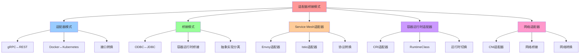

# 适配器/桥接模式：跨技术边界

## 📑 目录

- [适配器/桥接模式：跨技术边界](#适配器桥接模式跨技术边界)
  - [📑 目录](#-目录)
  - [1 概述](#1-概述)
    - [1.1 核心思想](#11-核心思想)
  - [2 适配器模式（Adapter Pattern）](#2-适配器模式adapter-pattern)
    - [2.1 定义](#21-定义)
    - [2.2 典型场景](#22-典型场景)
      - [2.2.1 gRPC ↔ REST](#221-grpc--rest)
      - [2.2.2 Docker ↔ Kubernetes](#222-docker--kubernetes)
    - [2.3 形式化定义](#23-形式化定义)
  - [3 桥接模式（Bridge Pattern）](#3-桥接模式bridge-pattern)
    - [3.1 定义](#31-定义)
    - [3.2 典型场景](#32-典型场景)
      - [3.2.1 ODBC ↔ JDBC](#321-odbc--jdbc)
      - [3.2.2 容器运行时桥接](#322-容器运行时桥接)
    - [3.3 形式化定义](#33-形式化定义)
  - [4 Service Mesh 中的适配器](#4-service-mesh-中的适配器)
    - [4.1 Envoy 适配器](#41-envoy-适配器)
    - [4.2 Istio 适配器](#42-istio-适配器)
    - [4.3 示例配置](#43-示例配置)
  - [5 容器运行时适配器](#5-容器运行时适配器)
    - [5.1 CRI 适配器](#51-cri-适配器)
    - [5.2 RuntimeClass](#52-runtimeclass)
  - [6 网络适配器](#6-网络适配器)
    - [6.1 CNI 适配器](#61-cni-适配器)
    - [6.2 网络桥接](#62-网络桥接)
  - [7 最佳实践](#7-最佳实践)
    - [7.1 适配器设计原则](#71-适配器设计原则)
    - [7.2 桥接设计原则](#72-桥接设计原则)
  - [8 相关文档](#8-相关文档)
    - [8.1 组合模式文档](#81-组合模式文档)
    - [8.2 参考资源](#82-参考资源)
  - [9 总结](#9-总结)
  - [10 认知增强：思维导图、知识矩阵与专家观点](#10-认知增强思维导图知识矩阵与专家观点)
    - [10.1 适配器/桥接模式完整思维导图](#101-适配器桥接模式完整思维导图)
    - [10.2 知识多维关系矩阵](#102-知识多维关系矩阵)
      - [适配器vs桥接模式多维关系矩阵](#适配器vs桥接模式多维关系矩阵)
      - [适配器应用场景多维关系矩阵](#适配器应用场景多维关系矩阵)
    - [10.3 形象化解释论证](#103-形象化解释论证)
      - [适配器/桥接模式的形象化类比](#适配器桥接模式的形象化类比)
        - [1. 适配器模式 = 电源适配器](#1-适配器模式--电源适配器)
        - [2. 桥接模式 = 桥梁](#2-桥接模式--桥梁)
        - [3. gRPC↔REST适配 = 翻译器](#3-grpcrest适配--翻译器)
        - [4. 容器运行时桥接 = 通用接口](#4-容器运行时桥接--通用接口)
        - [5. Service Mesh适配器 = 交通枢纽](#5-service-mesh适配器--交通枢纽)
    - [10.4 专家观点与论证](#104-专家观点与论证)
      - [计算信息软件科学家的观点](#计算信息软件科学家的观点)
        - [1. Christopher Alexander（模式语言）](#1-christopher-alexander模式语言)
        - [2. David Parnas（信息隐藏原则）](#2-david-parnas信息隐藏原则)
        - [3. Barbara Liskov（Liskov替换原则）](#3-barbara-liskovliskov替换原则)
      - [计算信息软件教育家的观点](#计算信息软件教育家的观点)
        - [1. Robert C. Martin（《代码整洁之道》作者）](#1-robert-c-martin代码整洁之道作者)
        - [2. Martin Fowler（重构之父）](#2-martin-fowler重构之父)
      - [计算信息软件认知学家的观点](#计算信息软件认知学家的观点)
        - [1. Donald Norman（《设计心理学》作者）](#1-donald-norman设计心理学作者)
        - [2. Herbert A. Simon（认知科学家）](#2-herbert-a-simon认知科学家)
    - [10.5 认知学习路径矩阵](#105-认知学习路径矩阵)
    - [10.6 专家推荐阅读路径](#106-专家推荐阅读路径)

---

## 1 概述

**适配器/桥接模式**用于让**不同技术栈**的组件能够无缝协作，实现跨技术边界的组合
。

### 1.1 核心思想

> **让旧系统与新模块无缝衔接，或让不同技术栈的组件能够互操作**

## 2 适配器模式（Adapter Pattern）

### 2.1 定义

**适配器模式**将一个类的接口转换成客户希望的另一个接口，使原本由于接口不兼容而不
能一起工作的类可以一起工作。

### 2.2 典型场景

#### 2.2.1 gRPC ↔ REST

**场景**：前端使用 REST，后端使用 gRPC

**解决方案**：

- **gRPC-Gateway**：将 gRPC 服务暴露为 REST API
- **Envoy**：在 Service Mesh 中自动转换

**示例**：

```yaml
# gRPC-Gateway 配置
apiVersion: v1
kind: Service
metadata:
  name: grpc-gateway
spec:
  ports:
    - name: http
      port: 8080
      targetPort: 9090
    - name: grpc
      port: 9090
      targetPort: 9090
```

#### 2.2.2 Docker ↔ Kubernetes

**场景**：从 Docker Compose 迁移到 Kubernetes

**解决方案**：

- **Kompose**：将 Docker Compose 转换为 Kubernetes YAML
- **Docker Desktop**：在本地运行 Kubernetes

**示例**：

```bash
# 使用 Kompose 转换
kompose convert
```

### 2.3 形式化定义

```text
适配器 A = ⟨source, target, transform⟩
其中：
- source: 源接口
- target: 目标接口
- transform: 转换函数
```

## 3 桥接模式（Bridge Pattern）

### 3.1 定义

**桥接模式**将抽象部分与实现部分分离，使它们都可以独立地变化。

### 3.2 典型场景

#### 3.2.1 ODBC ↔ JDBC

**场景**：跨数据库访问

**解决方案**：

- **ODBC**：开放数据库连接标准
- **JDBC**：Java 数据库连接
- **桥接层**：ODBC-JDBC Bridge

#### 3.2.2 容器运行时桥接

**场景**：在不同容器运行时之间切换

**解决方案**：

- **CRI (Container Runtime Interface)**：Kubernetes 容器运行时接口
- **containerd**：实现 CRI 的容器运行时
- **CRI-O**：另一个 CRI 实现

**示例**：

```yaml
# Kubernetes 配置不同的运行时
apiVersion: node.k8s.io/v1
kind: RuntimeClass
metadata:
  name: kata
handler: kata
```

### 3.3 形式化定义

```text
桥接 B = ⟨abstraction, implementation, bridge⟩
其中：
- abstraction: 抽象层
- implementation: 实现层
- bridge: 桥接层
```

## 4 Service Mesh 中的适配器

### 4.1 Envoy 适配器

**Envoy** 作为 Service Mesh 的数据平面，提供多种适配器：

- **HTTP → gRPC**：自动转换
- **gRPC → HTTP**：自动转换
- **WebSocket → HTTP**：协议转换
- **TCP → HTTP**：协议升级

### 4.2 Istio 适配器

**Istio** 提供多种适配器：

- **Prometheus**：指标适配器
- **Jaeger**：追踪适配器
- **Fluentd**：日志适配器

### 4.3 示例配置

```yaml
# Istio Adapter 配置
apiVersion: config.istio.io/v1alpha2
kind: adapter
metadata:
  name: prometheus
spec:
  config:
    metrics:
      - name: requests_total
        type: COUNTER
```

## 5 容器运行时适配器

### 5.1 CRI 适配器

**CRI (Container Runtime Interface)** 是 Kubernetes 的容器运行时接口，提供：

- **containerd**：实现 CRI
- **CRI-O**：另一个 CRI 实现
- **Docker**：通过 containerd 适配

### 5.2 RuntimeClass

**RuntimeClass** 允许在 Pod 级别选择不同的容器运行时：

```yaml
apiVersion: v1
kind: Pod
metadata:
  name: my-pod
spec:
  runtimeClassName: kata
  containers:
    - name: my-container
      image: my-image
```

## 6 网络适配器

### 6.1 CNI 适配器

**CNI (Container Network Interface)** 是 Kubernetes 的网络接口，提供：

- **Calico**：网络策略
- **Flannel**：简单网络
- **Cilium**：eBPF 网络

### 6.2 网络桥接

**网络桥接**用于连接不同的网络：

- **VXLAN**：虚拟扩展局域网
- **Geneve**：通用网络虚拟化封装
- **Bridge**：Linux 桥接

## 7 最佳实践

### 7.1 适配器设计原则

1. **单一职责**：每个适配器只负责一种转换
2. **接口稳定**：适配器接口应该稳定
3. **性能优化**：减少转换开销
4. **错误处理**：优雅处理转换错误

### 7.2 桥接设计原则

1. **抽象与实现分离**：抽象层和实现层应该独立
2. **接口设计**：定义清晰的接口
3. **可扩展性**：支持多种实现
4. **性能考虑**：减少桥接开销

## 8 相关文档

### 8.1 组合模式文档

- **[组合模式文档集](README.md)** - 组合模式文档集说明
- **[Adapter / Bridge 模式](./01-adapter-bridge.md)** - Adapter/Bridge 模式（本
  文件）
- **[Service Aggregation 模式](./05-nsm-pattern.md#service-aggregation)** -
  Service Aggregation 模式（在本目录中）

### 8.2 参考资源

- **[REFERENCES.md](../../REFERENCES.md)** - 参考标准、框架、工具和资源
- **[ACADEMIC-REFERENCES.md](../../ACADEMIC-REFERENCES.md)** - Wikipedia、大学课
  程、学术论文等学术资源

## 9 总结

适配器/桥接模式通过**跨技术边界**实现了：

1. **无缝集成**：让不同技术栈的组件能够协作
2. **协议转换**：gRPC ↔ REST、HTTP ↔ WebSocket
3. **运行时适配**：容器运行时、网络运行时
4. **Service Mesh 适配**：Envoy、Istio 适配器
5. **可扩展性**：支持多种实现和转换

---

---

## 10 认知增强：思维导图、知识矩阵与专家观点

### 10.1 适配器/桥接模式完整思维导图



### 10.2 知识多维关系矩阵

#### 适配器vs桥接模式多维关系矩阵

| 模式维度 | 适配器模式 | 桥接模式 | 模式对比 | 技术演进 | 认知价值 |
|---------|----------|---------|---------|---------|---------|
| **核心概念** | 接口转换 | 抽象实现分离 | 模式对比 | 模式演进 | 概念理解 |
| **典型场景** | gRPC↔REST、Docker↔Kubernetes | ODBC↔JDBC、容器运行时桥接 | 场景对比 | 场景演进 | 场景理解 |
| **技术实现** | 转换函数 | 桥接层 | 实现对比 | 实现演进 | 实现理解 |
| **适用场景** | 接口不兼容 | 抽象实现分离 | 场景匹配 | 场景扩展 | 场景理解 |
| **学习难度** | ⭐⭐⭐ | ⭐⭐⭐ | - | - | 渐进学习 |
| **专家推荐** | ⭐⭐⭐⭐⭐ | ⭐⭐⭐⭐⭐ | - | - | 技术深度 |

#### 适配器应用场景多维关系矩阵

| 场景维度 | gRPC↔REST | Docker↔Kubernetes | Service Mesh适配器 | 容器运行时适配器 | 网络适配器 | 场景协同 | 认知价值 |
|---------|----------|------------------|-----------------|--------------|----------|---------|---------|
| **适配类型** | 协议适配 | 平台适配 | 协议适配 | 运行时适配 | 网络适配 | 完整适配 | 类型理解 |
| **技术实现** | gRPC-Gateway、Envoy | Kompose、Docker Desktop | Envoy、Istio | CRI、RuntimeClass | CNI、网络桥接 | 技术栈 | 实现理解 |
| **架构收益** | 协议统一 | 平台统一 | 协议转换 | 运行时切换 | 网络统一 | 完整收益 | 收益理解 |
| **适用场景** | 微服务架构 | 容器编排 | Service Mesh | 容器运行时 | 网络管理 | 完整应用 | 场景理解 |
| **学习难度** | ⭐⭐⭐ | ⭐⭐⭐ | ⭐⭐⭐⭐ | ⭐⭐⭐ | ⭐⭐⭐ | ⭐⭐⭐⭐ | 渐进学习 |
| **专家推荐** | ⭐⭐⭐⭐⭐ | ⭐⭐⭐⭐⭐ | ⭐⭐⭐⭐⭐ | ⭐⭐⭐⭐⭐ | ⭐⭐⭐⭐⭐ | ⭐⭐⭐⭐⭐ | 技术深度 |

### 10.3 形象化解释论证

#### 适配器/桥接模式的形象化类比

##### 1. 适配器模式 = 电源适配器

> **类比**：适配器模式就像电源适配器，不同设备需要不同电压（不同接口），电源适配器转换电压（接口转换），就像电源适配器让不同设备使用同一电源一样。

**认知价值**：

- **适配理解**：通过电源适配器类比，理解适配器模式的含义
- **转换理解**：通过电压转换类比，理解接口转换的机制
- **统一理解**：通过统一电源类比，理解适配器模式的统一作用

##### 2. 桥接模式 = 桥梁

> **类比**：桥接模式就像桥梁，两岸需要连接（抽象和实现需要连接），桥梁连接两岸（桥接层连接抽象和实现），就像桥梁让两岸可以通行一样。

**认知价值**：

- **桥接理解**：通过桥梁类比，理解桥接模式的含义
- **连接理解**：通过桥梁连接类比，理解抽象和实现的连接
- **分离理解**：通过两岸分离类比，理解抽象和实现的分离

##### 3. gRPC↔REST适配 = 翻译器

> **类比**：gRPC↔REST适配就像翻译器，不同语言需要翻译（不同协议需要转换），翻译器翻译语言（适配器转换协议），就像翻译器让不同语言的人可以交流一样。

**认知价值**：

- **协议理解**：通过翻译器类比，理解协议转换的含义
- **转换理解**：通过语言翻译类比，理解协议转换的机制
- **交流理解**：通过语言交流类比，理解协议转换的交流作用

##### 4. 容器运行时桥接 = 通用接口

> **类比**：容器运行时桥接就像通用接口，不同设备需要不同接口（不同容器运行时需要不同接口），通用接口统一接口（CRI统一容器运行时接口），就像通用接口让不同设备可以连接一样。

**认知价值**：

- **接口理解**：通过通用接口类比，理解容器运行时桥接的含义
- **统一理解**：通过接口统一类比，理解CRI统一接口的作用
- **连接理解**：通过设备连接类比，理解容器运行时桥接的连接作用

##### 5. Service Mesh适配器 = 交通枢纽

> **类比**：Service Mesh适配器就像交通枢纽，不同交通工具需要转换（不同协议需要转换），交通枢纽转换交通工具（适配器转换协议），就像交通枢纽让不同交通工具可以转换一样。

**认知价值**：

- **枢纽理解**：通过交通枢纽类比，理解Service Mesh适配器的含义
- **转换理解**：通过交通工具转换类比，理解协议转换的机制
- **统一理解**：通过交通枢纽统一类比，理解适配器模式的统一作用

### 10.4 专家观点与论证

#### 计算信息软件科学家的观点

##### 1. Christopher Alexander（模式语言）

> **观点**："Each pattern describes a problem which occurs over and over again in our environment, and then describes the core of the solution to that problem, in such a way that you can use this solution a million times over, without ever doing it the same way twice."（每个模式描述一个在我们的环境中反复出现的问题，然后描述该问题解决方案的核心，这样你可以使用这个解决方案一百万次，而永远不会以相同的方式做两次）

**与适配器/桥接模式的关联**：

- **模式理解**：适配器/桥接模式体现了模式语言的思想，通过模式解决反复出现的问题（接口不兼容、抽象实现分离）
- **复用理解**：通过模式语言理解适配器/桥接模式的可复用性（gRPC↔REST、Docker↔Kubernetes）
- **创新理解**：通过模式语言理解适配器/桥接模式的创新性（每次使用都不同）

##### 2. David Parnas（信息隐藏原则）

> **观点**："The criteria to be used in decomposing systems into modules are based on the principle of information hiding."（将系统分解为模块的标准基于信息隐藏原则）

**与适配器/桥接模式的关联**：

- **模块理解**：适配器/桥接模式体现了信息隐藏原则（适配器隐藏接口转换细节、桥接模式隐藏实现细节）
- **分解理解**：通过适配器/桥接模式理解系统分解的标准（接口转换、抽象实现分离）
- **隐藏理解**：通过适配器/桥接模式理解信息隐藏的含义（隐藏转换细节、隐藏实现细节）

##### 3. Barbara Liskov（Liskov替换原则）

> **观点**："What is wanted is something like the following substitution property: If for each object o1 of type S there is an object o2 of type T such that for all programs P defined in terms of T, the behavior of P is unchanged when o1 is substituted for o2 then S is a subtype of T."（需要的是类似以下替换属性：如果对于类型S的每个对象o1，存在类型T的对象o2，使得对于所有用T定义的程序P，当o1替换o2时，P的行为不变，则S是T的子类型）

**与适配器/桥接模式的关联**：

- **替换理解**：适配器/桥接模式体现了替换原则（适配器可以替换不兼容接口、桥接模式可以替换实现）
- **行为理解**：通过适配器/桥接模式理解接口替换时行为保持不变（协议转换、抽象实现分离）
- **子类型理解**：通过适配器/桥接模式理解接口类型的子类型关系（适配器接口是源接口的子类型）

#### 计算信息软件教育家的观点

##### 1. Robert C. Martin（《代码整洁之道》作者）

> **观点**："The only way to go fast is to go well."（快速前进的唯一方法是做好）

**与适配器/桥接模式的关联**：

- **质量理解**：适配器/桥接模式体现了架构质量（接口转换、抽象实现分离）
- **速度理解**：通过适配器/桥接模式理解速度与质量的权衡（适配器转换vs直接集成）
- **实践理解**：通过适配器/桥接模式指导实践，选择"做好"的架构

##### 2. Martin Fowler（重构之父）

> **观点**："Any fool can write code that a computer can understand. Good programmers write code that humans can understand."（任何傻瓜都能编写计算机能理解的代码。好的程序员编写人类能理解的代码）

**与适配器/桥接模式的关联**：

- **可理解性理解**：适配器/桥接模式通过接口转换、抽象实现分离提高可理解性
- **人类理解**：通过适配器/桥接模式理解架构的人类可理解性（清晰的接口、明确的抽象）
- **选择理解**：通过适配器/桥接模式选择"人类能理解"的架构

#### 计算信息软件认知学家的观点

##### 1. Donald Norman（《设计心理学》作者）

> **观点**："The real problem with the interface is that it is an interface. Interfaces get in the way. I don't want to focus my energies on an interface. I want to focus on the job."（界面的真正问题是它是界面。界面会妨碍。我不想把精力集中在界面上。我想专注于工作）

**与适配器/桥接模式的关联**：

- **接口理解**：适配器/桥接模式体现了接口的重要性（接口转换、抽象实现分离），但也要避免过度关注接口
- **工作理解**：通过适配器/桥接模式专注于架构工作（接口转换、抽象实现分离），而不是过度关注接口细节
- **平衡理解**：通过适配器/桥接模式理解接口与工作的平衡

##### 2. Herbert A. Simon（认知科学家）

> **观点**："A wealth of information creates a poverty of attention."（信息丰富导致注意力贫乏）

**与适配器/桥接模式的关联**：

- **注意力理解**：适配器/桥接模式通过接口转换、抽象实现分离管理注意力，避免信息过载
- **结构化理解**：通过适配器/桥接模式结构化信息（适配器模式、桥接模式），减少认知负荷
- **管理理解**：通过适配器/桥接模式管理信息，避免注意力贫乏

### 10.5 认知学习路径矩阵

| 学习阶段 | 推荐内容 | 推荐模式 | 学习重点 | 学习时间 | 前置要求 | 后续进阶 |
|---------|---------|---------|---------|---------|---------|---------|
| **新手阶段** | 概述、适配器模式 | 适配器模式 | 模式理解、基本概念理解 | 1-2周 | 无 | 进阶阶段 |
| **进阶阶段** | 桥接模式、Service Mesh适配器 | 桥接模式、Service Mesh适配器 | 模式理解、应用理解 | 4-8周 | 新手阶段 | 专家阶段 |
| **专家阶段** | 容器运行时适配器、网络适配器、最佳实践 | 完整模式 | 实践理解、最佳实践理解 | 16+周 | 进阶阶段 | - |

### 10.6 专家推荐阅读路径

**路径1：模式理解路径**：

1. **第一步**：阅读概述（第1节），理解适配器/桥接模式概览
2. **第二步**：阅读适配器模式（第2节），理解适配器模式
3. **第三步**：阅读桥接模式（第3节），理解桥接模式
4. **第四步**：阅读总结（第9节），回顾关键要点

**路径2：应用理解路径**：

1. **第一步**：阅读概述（第1节），了解适配器/桥接模式
2. **第二步**：阅读Service Mesh适配器（第4节），学习Service Mesh应用
3. **第三步**：阅读容器运行时适配器和网络适配器（第5-6节），学习运行时和网络应用
4. **第四步**：阅读最佳实践（第7节），学习实践方法

**路径3：实践应用路径**：

1. **第一步**：阅读概述（第1节），了解适配器/桥接模式
2. **第二步**：阅读典型场景（第2.2、3.2节），学习场景应用
3. **第三步**：阅读最佳实践（第7节），学习实践方法
4. **第四步**：阅读总结（第9节），学习最佳实践

---

**更新时间**：2025-11-15 **版本**：v1.1 **参考**：`architecture_view.md` 第78-92行，组合模式部分

**更新内容（v1.1）**：

- ✅ 添加认知增强章节（思维导图、知识矩阵、形象化解释、专家观点）
- ✅ 添加认知学习路径矩阵
- ✅ 添加专家推荐阅读路径（3条路径）
