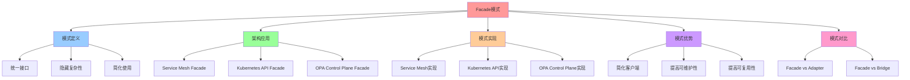

# Facade 模式：统一接口简化复杂系统

## 📑 目录

- [Facade 模式：统一接口简化复杂系统](#facade-模式统一接口简化复杂系统)
  - [📑 目录](#-目录)
  - [1 概述](#1-概述)
    - [1.1 核心思想](#11-核心思想)
  - [2 Facade 模式定义](#2-facade-模式定义)
    - [2.1 Facade 模式概念](#21-facade-模式概念)
    - [2.2 Facade 模式结构](#22-facade-模式结构)
    - [2.3 Facade 模式特点](#23-facade-模式特点)
  - [3 架构中的应用](#3-架构中的应用)
    - [3.1 Service Mesh 作为 Facade](#31-service-mesh-作为-facade)
    - [3.2 Kubernetes API 作为 Facade](#32-kubernetes-api-作为-facade)
    - [3.3 OPA Control Plane 作为 Facade](#33-opa-control-plane-作为-facade)
  - [4 Facade 模式实现](#4-facade-模式实现)
    - [4.1 Service Mesh Facade 实现](#41-service-mesh-facade-实现)
    - [4.2 Kubernetes API Facade 实现](#42-kubernetes-api-facade-实现)
    - [4.3 OPA Control Plane Facade 实现](#43-opa-control-plane-facade-实现)
  - [5 Facade 模式优势](#5-facade-模式优势)
    - [5.1 简化客户端](#51-简化客户端)
    - [5.2 提高可维护性](#52-提高可维护性)
    - [5.3 提高可复用性](#53-提高可复用性)
  - [6 Facade 模式与其他模式](#6-facade-模式与其他模式)
    - [6.1 Facade vs Adapter](#61-facade-vs-adapter)
    - [6.2 Facade vs Bridge](#62-facade-vs-bridge)
  - [7 形式化定义](#7-形式化定义)
    - [7.1 Facade 模式定义](#71-facade-模式定义)
    - [7.2 Facade 操作定义](#72-facade-操作定义)
  - [8 相关文档](#8-相关文档)
    - [8.1 组合模式文档](#81-组合模式文档)
    - [8.2 参考资源](#82-参考资源)
  - [9 总结](#9-总结)
  - [10 认知增强：思维导图、知识矩阵与专家观点](#10-认知增强思维导图知识矩阵与专家观点)
    - [10.1 Facade模式完整思维导图](#101-facade模式完整思维导图)
    - [10.2 知识多维关系矩阵](#102-知识多维关系矩阵)
      - [Facade模式应用场景多维关系矩阵](#facade模式应用场景多维关系矩阵)
      - [Facade模式vs其他模式多维关系矩阵](#facade模式vs其他模式多维关系矩阵)
    - [10.3 形象化解释论证](#103-形象化解释论证)
      - [Facade模式的形象化类比](#facade模式的形象化类比)
        - [1. Facade模式 = 前台接待](#1-facade模式--前台接待)
        - [2. Service Mesh Facade = 交通指挥中心](#2-service-mesh-facade--交通指挥中心)
        - [3. Kubernetes API Facade = 操作系统API](#3-kubernetes-api-facade--操作系统api)
        - [4. OPA Control Plane Facade = 法院系统](#4-opa-control-plane-facade--法院系统)
        - [5. Facade模式优势 = 一站式服务](#5-facade模式优势--一站式服务)
    - [10.4 专家观点与论证](#104-专家观点与论证)
      - [计算信息软件科学家的观点](#计算信息软件科学家的观点)
        - [1. Christopher Alexander（模式语言）](#1-christopher-alexander模式语言)
        - [2. David Parnas（信息隐藏原则）](#2-david-parnas信息隐藏原则)
        - [3. Barbara Liskov（Liskov替换原则）](#3-barbara-liskovliskov替换原则)
      - [计算信息软件教育家的观点](#计算信息软件教育家的观点)
        - [1. Robert C. Martin（《代码整洁之道》作者）](#1-robert-c-martin代码整洁之道作者)
        - [2. Martin Fowler（重构之父）](#2-martin-fowler重构之父)
      - [计算信息软件认知学家的观点](#计算信息软件认知学家的观点)
        - [1. Donald Norman（《设计心理学》作者）](#1-donald-norman设计心理学作者)
        - [2. Herbert A. Simon（认知科学家）](#2-herbert-a-simon认知科学家)
    - [10.5 认知学习路径矩阵](#105-认知学习路径矩阵)
    - [10.6 专家推荐阅读路径](#106-专家推荐阅读路径)

---

## 1 概述

本文档详细阐述**Facade 模式**在架构设计中的应用，通过统一接口简化复杂系统。

### 1.1 核心思想

> **通过 Facade 模式提供统一接口，隐藏底层系统的复杂性，简化客户端的使用**

## 2 Facade 模式定义

### 2.1 Facade 模式概念

**Facade 模式**是一种结构型设计模式，为复杂子系统提供一个统一的接口。

### 2.2 Facade 模式结构

```text
Client
  ↓
Facade
  ├── Subsystem A
  ├── Subsystem B
  └── Subsystem C
```

### 2.3 Facade 模式特点

**Facade 模式特点**：

- **统一接口**：提供统一的接口
- **隐藏复杂性**：隐藏底层系统的复杂性
- **简化使用**：简化客户端的使用

## 3 架构中的应用

### 3.1 Service Mesh 作为 Facade

**Service Mesh 作为 Facade**：

```text
Application
  ↓
Service Mesh (Facade)
  ├── Envoy (Sidecar)
  ├── Istio Control Plane
  ├── Prometheus (Metrics)
  ├── Tempo (Tracing)
  └── OPA (Policy)
```

**Service Mesh Facade 特点**：

- **统一接口**：通过 VirtualService 提供统一接口
- **隐藏复杂性**：隐藏网络、安全、监控的复杂性
- **简化使用**：应用只需关注业务逻辑

### 3.2 Kubernetes API 作为 Facade

**Kubernetes API 作为 Facade**：

```text
Kubectl/Client
  ↓
Kubernetes API (Facade)
  ├── kubelet
  ├── kube-proxy
  ├── kube-scheduler
  └── kube-controller-manager
```

**Kubernetes API Facade 特点**：

- **统一接口**：通过 REST API 提供统一接口
- **隐藏复杂性**：隐藏容器、网络、存储的复杂性
- **简化使用**：客户端只需调用 API

### 3.3 OPA Control Plane 作为 Facade

**OPA Control Plane 作为 Facade**：

```text
Application/Gatekeeper
  ↓
OPA Control Plane (Facade)
  ├── PDP (Policy Decision Point)
  ├── Bundle Manager
  ├── Decision Log
  └── Discovery Service
```

**OPA Control Plane Facade 特点**：

- **统一接口**：通过 REST API 提供统一接口
- **隐藏复杂性**：隐藏策略评估、分发的复杂性
- **简化使用**：客户端只需调用决策 API

## 4 Facade 模式实现

### 4.1 Service Mesh Facade 实现

**Service Mesh Facade 实现**：

```yaml
apiVersion: networking.istio.io/v1beta1
kind: VirtualService
metadata:
  name: order-service-facade
spec:
  hosts:
    - order-service
  http:
    - match:
        - headers:
            version:
              exact: v1
      route:
        - destination:
            host: order-service
            subset: v1
    - route:
        - destination:
            host: order-service
            subset: v2
          weight: 10
        - destination:
            host: order-service
            subset: v1
          weight: 90
```

### 4.2 Kubernetes API Facade 实现

**Kubernetes API Facade 实现**：

```yaml
apiVersion: v1
kind: Service
metadata:
  name: order-service
spec:
  selector:
    app: order-service
  ports:
    - protocol: TCP
      port: 80
      targetPort: 8080
```

### 4.3 OPA Control Plane Facade 实现

**OPA Control Plane Facade 实现**：

```bash
# 决策请求
curl -X POST http://opa:8181/v1/data/mesh/authz/allow \
  -H "Content-Type: application/json" \
  -d '{
    "input": {
      "attributes": {
        "source": {
          "principal": "spiffe://A/ns/default/sa/frontend"
        },
        "destination": {
          "principal": "spiffe://B/ns/default/sa/order-service"
        }
      }
    }
  }'
```

## 5 Facade 模式优势

### 5.1 简化客户端

**Facade 模式优势**：

- **统一接口**：客户端只需调用一个接口
- **隐藏复杂性**：隐藏底层系统的复杂性
- **降低耦合**：客户端与底层系统解耦

### 5.2 提高可维护性

**Facade 模式优势**：

- **集中管理**：集中管理子系统
- **易于扩展**：易于添加新功能
- **易于测试**：易于测试 Facade 接口

### 5.3 提高可复用性

**Facade 模式优势**：

- **接口复用**：Facade 接口可以复用
- **组件复用**：底层组件可以复用
- **模式复用**：Facade 模式可以复用

## 6 Facade 模式与其他模式

### 6.1 Facade vs Adapter

**Facade vs Adapter**：

| 模式        | 目的     | 使用场景   |
| ----------- | -------- | ---------- |
| **Facade**  | 简化接口 | 复杂子系统 |
| **Adapter** | 适配接口 | 接口不兼容 |

### 6.2 Facade vs Bridge

**Facade vs Bridge**：

| 模式       | 目的           | 使用场景   |
| ---------- | -------------- | ---------- |
| **Facade** | 简化接口       | 复杂子系统 |
| **Bridge** | 分离抽象和实现 | 多维度变化 |

## 7 形式化定义

### 7.1 Facade 模式定义

```text
Facade F = ⟨interface, subsystems, operations⟩
其中：
- interface: 统一接口
- subsystems: 子系统集合
- operations: 操作集合
```

### 7.2 Facade 操作定义

```text
Facade 操作 O = ⟨name, inputs, outputs, subsystems⟩
其中：
- name: 操作名称
- inputs: 输入参数集合
- outputs: 输出参数集合
- subsystems: 涉及的子系统集合
```

## 8 相关文档

### 8.1 组合模式文档

- **[组合模式文档集](README.md)** - 组合模式文档集说明
- **[Service Aggregation 模式](./05-nsm-pattern.md#service-aggregation)** -
  Service Aggregation 模式（在本目录中）
- **[Facade / Gateway 模式](./02-facade.md)** - Facade/Gateway 模式（本文件）

### 8.2 参考资源

- **[REFERENCES.md](../../REFERENCES.md)** - 参考标准、框架、工具和资源
- **[ACADEMIC-REFERENCES.md](../../ACADEMIC-REFERENCES.md)** - Wikipedia、大学课
  程、学术论文等学术资源

## 9 总结

通过**Facade 模式**，我们实现了：

1. **统一接口**：提供统一的接口简化客户端使用
2. **隐藏复杂性**：隐藏底层系统的复杂性
3. **降低耦合**：客户端与底层系统解耦
4. **提高可维护性**：集中管理子系统，易于扩展和测试
5. **提高可复用性**：Facade 接口和底层组件可以复用

**相关模式**：Facade 模式与服务聚合模式（Service Aggregation）密切相关，后者是
Facade 模式在微服务架构中的扩展应用。详细内容请参考
[Service Aggregation 模式](./05-nsm-pattern.md#service-aggregation)。

---

---

## 10 认知增强：思维导图、知识矩阵与专家观点

### 10.1 Facade模式完整思维导图



### 10.2 知识多维关系矩阵

#### Facade模式应用场景多维关系矩阵

| 场景维度 | Service Mesh Facade | Kubernetes API Facade | OPA Control Plane Facade | 场景协同 | 认知价值 |
|---------|-------------------|---------------------|------------------------|---------|---------|
| **统一接口** | VirtualService | REST API | REST API | 统一接口 | 接口理解 |
| **隐藏复杂性** | 网络、安全、监控 | 容器、网络、存储 | 策略评估、分发 | 隐藏复杂性 | 复杂性理解 |
| **简化使用** | 业务逻辑 | API调用 | 决策API | 简化使用 | 使用理解 |
| **典型实现** | Istio、Envoy | Kubernetes API Server | OPA Control Plane | 实现栈 | 实现理解 |
| **架构收益** | 服务治理 | 容器编排 | 策略治理 | 完整收益 | 收益理解 |
| **学习难度** | ⭐⭐⭐⭐ | ⭐⭐⭐ | ⭐⭐⭐⭐ | ⭐⭐⭐⭐ | 渐进学习 |
| **专家推荐** | ⭐⭐⭐⭐⭐ | ⭐⭐⭐⭐⭐ | ⭐⭐⭐⭐⭐ | ⭐⭐⭐⭐⭐ | 技术深度 |

#### Facade模式vs其他模式多维关系矩阵

| 模式维度 | Facade | Adapter | Bridge | 模式对比 | 认知价值 |
|---------|--------|---------|--------|---------|---------|
| **目的** | 简化接口 | 适配接口 | 分离抽象实现 | 目的对比 | 目的理解 |
| **使用场景** | 复杂子系统 | 接口不兼容 | 多维度变化 | 场景对比 | 场景理解 |
| **核心特点** | 统一接口、隐藏复杂性 | 接口转换 | 抽象实现分离 | 特点对比 | 特点理解 |
| **典型应用** | Service Mesh、Kubernetes API | gRPC↔REST、Docker↔K8s | ODBC↔JDBC、容器运行时 | 应用对比 | 应用理解 |
| **学习难度** | ⭐⭐⭐ | ⭐⭐⭐ | ⭐⭐⭐ | - | 渐进学习 |
| **专家推荐** | ⭐⭐⭐⭐⭐ | ⭐⭐⭐⭐⭐ | ⭐⭐⭐⭐⭐ | - | 技术深度 |

### 10.3 形象化解释论证

#### Facade模式的形象化类比

##### 1. Facade模式 = 前台接待

> **类比**：Facade模式就像前台接待，客户像客户端（需要服务），前台像Facade（统一接口），后台部门像子系统（复杂系统），就像前台接待统一处理客户请求，隐藏后台部门的复杂性一样。

**认知价值**：

- **接口理解**：通过前台接待类比，理解Facade模式统一接口的作用
- **隐藏理解**：通过前台隐藏后台类比，理解Facade模式隐藏复杂性的作用
- **简化理解**：通过前台简化客户请求类比，理解Facade模式简化使用的作用

##### 2. Service Mesh Facade = 交通指挥中心

> **类比**：Service Mesh Facade就像交通指挥中心，车辆像应用（需要服务），指挥中心像Service Mesh（统一接口），交通系统像网络、安全、监控（复杂系统），就像交通指挥中心统一指挥交通，隐藏交通系统的复杂性一样。

**认知价值**：

- **统一理解**：通过交通指挥中心类比，理解Service Mesh Facade统一接口的作用
- **复杂性理解**：通过交通系统复杂性类比，理解Service Mesh Facade隐藏复杂性的作用
- **治理理解**：通过交通指挥类比，理解Service Mesh Facade的服务治理作用

##### 3. Kubernetes API Facade = 操作系统API

> **类比**：Kubernetes API Facade就像操作系统API，应用程序像客户端（需要服务），操作系统API像Kubernetes API（统一接口），硬件像容器、网络、存储（复杂系统），就像操作系统API统一访问硬件，隐藏硬件的复杂性一样。

**认知价值**：

- **API理解**：通过操作系统API类比，理解Kubernetes API Facade统一接口的作用
- **抽象理解**：通过硬件抽象类比，理解Kubernetes API Facade抽象复杂性的作用
- **编排理解**：通过操作系统编排类比，理解Kubernetes API Facade的容器编排作用

##### 4. OPA Control Plane Facade = 法院系统

> **类比**：OPA Control Plane Facade就像法院系统，当事人像应用（需要决策），法院像OPA Control Plane（统一接口），法律系统像策略评估、分发（复杂系统），就像法院系统统一处理案件，隐藏法律系统的复杂性一样。

**认知价值**：

- **决策理解**：通过法院系统类比，理解OPA Control Plane Facade统一决策的作用
- **策略理解**：通过法律系统类比，理解OPA Control Plane Facade策略治理的作用
- **治理理解**：通过法院治理类比，理解OPA Control Plane Facade的治理作用

##### 5. Facade模式优势 = 一站式服务

> **类比**：Facade模式优势就像一站式服务，客户像客户端（需要服务），一站式服务中心像Facade（统一接口），多个部门像子系统（复杂系统），就像一站式服务中心统一处理客户需求，简化客户使用，提高服务效率一样。

**认知价值**：

- **优势理解**：通过一站式服务类比，理解Facade模式的优势（简化客户端、提高可维护性、提高可复用性）
- **效率理解**：通过服务效率类比，理解Facade模式提高效率的作用
- **体验理解**：通过客户体验类比，理解Facade模式改善用户体验的作用

### 10.4 专家观点与论证

#### 计算信息软件科学家的观点

##### 1. Christopher Alexander（模式语言）

> **观点**："Each pattern describes a problem which occurs over and over again in our environment, and then describes the core of the solution to that problem, in such a way that you can use this solution a million times over, without ever doing it the same way twice."（每个模式描述一个在我们的环境中反复出现的问题，然后描述该问题解决方案的核心，这样你可以使用这个解决方案一百万次，而永远不会以相同的方式做两次）

**与Facade模式的关联**：

- **模式理解**：Facade模式体现了模式语言的思想，通过模式解决反复出现的问题（复杂子系统、接口不统一）
- **复用理解**：通过模式语言理解Facade模式的可复用性（Service Mesh、Kubernetes API、OPA Control Plane）
- **创新理解**：通过模式语言理解Facade模式的创新性（每次使用都不同）

##### 2. David Parnas（信息隐藏原则）

> **观点**："The criteria to be used in decomposing systems into modules are based on the principle of information hiding."（将系统分解为模块的标准基于信息隐藏原则）

**与Facade模式的关联**：

- **模块理解**：Facade模式体现了信息隐藏原则（隐藏子系统复杂性、隐藏实现细节）
- **分解理解**：通过Facade模式理解系统分解的标准（统一接口、隐藏复杂性）
- **隐藏理解**：通过Facade模式理解信息隐藏的含义（隐藏子系统复杂性）

##### 3. Barbara Liskov（Liskov替换原则）

> **观点**："What is wanted is something like the following substitution property: If for each object o1 of type S there is an object o2 of type T such that for all programs P defined in terms of T, the behavior of P is unchanged when o1 is substituted for o2 then S is a subtype of T."（需要的是类似以下替换属性：如果对于类型S的每个对象o1，存在类型T的对象o2，使得对于所有用T定义的程序P，当o1替换o2时，P的行为不变，则S是T的子类型）

**与Facade模式的关联**：

- **替换理解**：Facade模式体现了替换原则（Facade可以替换子系统接口）
- **行为理解**：通过Facade模式理解接口替换时行为保持不变（统一接口、简化使用）
- **子类型理解**：通过Facade模式理解接口类型的子类型关系（Facade接口是子系统接口的子类型）

#### 计算信息软件教育家的观点

##### 1. Robert C. Martin（《代码整洁之道》作者）

> **观点**："The only way to go fast is to go well."（快速前进的唯一方法是做好）

**与Facade模式的关联**：

- **质量理解**：Facade模式体现了架构质量（统一接口、隐藏复杂性、简化使用）
- **速度理解**：通过Facade模式理解速度与质量的权衡（简化接口vs复杂实现）
- **实践理解**：通过Facade模式指导实践，选择"做好"的架构

##### 2. Martin Fowler（重构之父）

> **观点**："Any fool can write code that a computer can understand. Good programmers write code that humans can understand."（任何傻瓜都能编写计算机能理解的代码。好的程序员编写人类能理解的代码）

**与Facade模式的关联**：

- **可理解性理解**：Facade模式通过统一接口、隐藏复杂性提高可理解性
- **人类理解**：通过Facade模式理解架构的人类可理解性（清晰的接口、简化的使用）
- **选择理解**：通过Facade模式选择"人类能理解"的架构

#### 计算信息软件认知学家的观点

##### 1. Donald Norman（《设计心理学》作者）

> **观点**："The real problem with the interface is that it is an interface. Interfaces get in the way. I don't want to focus my energies on an interface. I want to focus on the job."（界面的真正问题是它是界面。界面会妨碍。我不想把精力集中在界面上。我想专注于工作）

**与Facade模式的关联**：

- **接口理解**：Facade模式体现了接口的重要性（统一接口），但也要避免过度关注接口
- **工作理解**：通过Facade模式专注于架构工作（统一接口、隐藏复杂性），而不是过度关注接口细节
- **平衡理解**：通过Facade模式理解接口与工作的平衡

##### 2. Herbert A. Simon（认知科学家）

> **观点**："A wealth of information creates a poverty of attention."（信息丰富导致注意力贫乏）

**与Facade模式的关联**：

- **注意力理解**：Facade模式通过统一接口、隐藏复杂性管理注意力，避免信息过载
- **结构化理解**：通过Facade模式结构化信息（统一接口、子系统），减少认知负荷
- **管理理解**：通过Facade模式管理信息，避免注意力贫乏

### 10.5 认知学习路径矩阵

| 学习阶段 | 推荐内容 | 推荐应用 | 学习重点 | 学习时间 | 前置要求 | 后续进阶 |
|---------|---------|---------|---------|---------|---------|---------|
| **新手阶段** | 概述、模式定义 | Facade模式概念理解 | 模式理解、基本概念理解 | 1-2周 | 无 | 进阶阶段 |
| **进阶阶段** | 架构应用、模式实现 | Service Mesh、Kubernetes API | 应用理解、实现理解 | 4-8周 | 新手阶段 | 专家阶段 |
| **专家阶段** | 模式优势、模式对比 | 完整应用 | 优势理解、对比理解 | 16+周 | 进阶阶段 | - |

### 10.6 专家推荐阅读路径

**路径1：模式理解路径**：

1. **第一步**：阅读概述（第1节），理解Facade模式概览
2. **第二步**：阅读模式定义（第2节），理解统一接口、隐藏复杂性、简化使用
3. **第三步**：阅读架构应用（第3节），理解Facade模式在架构中的应用
4. **第四步**：阅读总结（第9节），回顾关键要点

**路径2：应用理解路径**：

1. **第一步**：阅读概述（第1节），了解Facade模式
2. **第二步**：阅读架构应用（第3节），学习Service Mesh、Kubernetes API、OPA Control Plane应用
3. **第三步**：阅读模式实现（第4节），学习实现方法
4. **第四步**：阅读模式优势（第5节），学习优势应用

**路径3：实践应用路径**：

1. **第一步**：阅读概述（第1节），了解Facade模式
2. **第二步**：阅读模式实现（第4节），学习实践方法
3. **第三步**：阅读模式对比（第6节），理解与其他模式的对比
4. **第四步**：阅读总结（第9节），学习最佳实践

---

**更新时间**：2025-11-15 **版本**：v1.1 **参考**：`architecture_view.md` 第1050-1070行，Facade模式部分

**更新内容（v1.1）**：

- ✅ 添加认知增强章节（思维导图、知识矩阵、形象化解释、专家观点）
- ✅ 添加认知学习路径矩阵
- ✅ 添加专家推荐阅读路径（3条路径）
