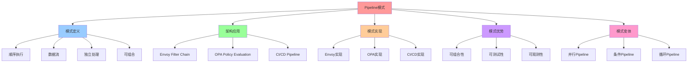

# Pipeline 模式：顺序执行与数据流

## 📑 目录

- [Pipeline 模式：顺序执行与数据流](#pipeline-模式顺序执行与数据流)
  - [📑 目录](#-目录)
  - [1 概述](#1-概述)
    - [1.1 核心思想](#11-核心思想)
  - [2 Pipeline 模式定义](#2-pipeline-模式定义)
    - [2.1 Pipeline 模式概念](#21-pipeline-模式概念)
    - [2.2 Pipeline 模式结构](#22-pipeline-模式结构)
    - [2.3 Pipeline 模式特点](#23-pipeline-模式特点)
  - [3 架构中的应用](#3-架构中的应用)
    - [3.1 Envoy Filter Chain](#31-envoy-filter-chain)
    - [3.2 OPA Policy Evaluation](#32-opa-policy-evaluation)
    - [3.3 CI/CD Pipeline](#33-cicd-pipeline)
  - [4 Pipeline 模式实现](#4-pipeline-模式实现)
    - [4.1 Envoy Filter Chain 实现](#41-envoy-filter-chain-实现)
    - [4.2 OPA Policy Evaluation 实现](#42-opa-policy-evaluation-实现)
    - [4.3 CI/CD Pipeline 实现](#43-cicd-pipeline-实现)
  - [5 Pipeline 模式优势](#5-pipeline-模式优势)
    - [5.1 可组合性](#51-可组合性)
    - [5.2 可测试性](#52-可测试性)
    - [5.3 可观测性](#53-可观测性)
  - [6 Pipeline 模式变体](#6-pipeline-模式变体)
    - [6.1 并行 Pipeline](#61-并行-pipeline)
    - [6.2 条件 Pipeline](#62-条件-pipeline)
    - [6.3 循环 Pipeline](#63-循环-pipeline)
  - [7 形式化定义](#7-形式化定义)
    - [7.1 Pipeline 模式定义](#71-pipeline-模式定义)
    - [7.2 Pipeline 步骤定义](#72-pipeline-步骤定义)
    - [7.3 Pipeline 连接定义](#73-pipeline-连接定义)
  - [8 相关文档](#8-相关文档)
    - [8.1 组合模式文档](#81-组合模式文档)
    - [8.2 参考资源](#82-参考资源)
  - [9 总结](#9-总结)
  - [10 认知增强：思维导图、知识矩阵与专家观点](#10-认知增强思维导图知识矩阵与专家观点)
    - [10.1 Pipeline模式完整思维导图](#101-pipeline模式完整思维导图)
    - [10.2 知识多维关系矩阵](#102-知识多维关系矩阵)
      - [Pipeline模式应用场景多维关系矩阵](#pipeline模式应用场景多维关系矩阵)
      - [Pipeline模式变体多维关系矩阵](#pipeline模式变体多维关系矩阵)
    - [10.3 形象化解释论证](#103-形象化解释论证)
      - [Pipeline模式的形象化类比](#pipeline模式的形象化类比)
        - [1. Pipeline模式 = 流水线生产](#1-pipeline模式--流水线生产)
        - [2. Envoy Filter Chain = 安全检查流程](#2-envoy-filter-chain--安全检查流程)
        - [3. OPA Policy Evaluation = 法律审判流程](#3-opa-policy-evaluation--法律审判流程)
        - [4. CI/CD Pipeline = 产品生产流程](#4-cicd-pipeline--产品生产流程)
        - [5. Pipeline模式优势 = 模块化生产](#5-pipeline模式优势--模块化生产)
    - [10.4 专家观点与论证](#104-专家观点与论证)
      - [计算信息软件科学家的观点](#计算信息软件科学家的观点)
        - [1. Christopher Alexander（模式语言）](#1-christopher-alexander模式语言)
        - [2. David Parnas（信息隐藏原则）](#2-david-parnas信息隐藏原则)
        - [3. Barbara Liskov（Liskov替换原则）](#3-barbara-liskovliskov替换原则)
      - [计算信息软件教育家的观点](#计算信息软件教育家的观点)
        - [1. Robert C. Martin（《代码整洁之道》作者）](#1-robert-c-martin代码整洁之道作者)
        - [2. Martin Fowler（重构之父）](#2-martin-fowler重构之父)
      - [计算信息软件认知学家的观点](#计算信息软件认知学家的观点)
        - [1. Donald Norman（《设计心理学》作者）](#1-donald-norman设计心理学作者)
        - [2. Herbert A. Simon（认知科学家）](#2-herbert-a-simon认知科学家)
    - [10.5 认知学习路径矩阵](#105-认知学习路径矩阵)
    - [10.6 专家推荐阅读路径](#106-专家推荐阅读路径)

---

## 1 概述

本文档详细阐述**Pipeline 模式**在架构设计中的应用，通过顺序执行实现数据流处理。

### 1.1 核心思想

> **通过 Pipeline 模式将复杂处理分解为多个步骤，每个步骤独立处理，通过管道连接，
> 实现数据流的顺序处理**

## 2 Pipeline 模式定义

### 2.1 Pipeline 模式概念

**Pipeline 模式**是一种行为型设计模式，将处理过程分解为多个步骤，通过管道连接。

### 2.2 Pipeline 模式结构

```text
Input
  ↓
Step 1
  ↓
Step 2
  ↓
Step 3
  ↓
...
  ↓
Step N
  ↓
Output
```

### 2.3 Pipeline 模式特点

**Pipeline 模式特点**：

- **顺序执行**：步骤按顺序执行
- **数据流**：数据通过管道传递
- **独立处理**：每个步骤独立处理
- **可组合**：步骤可以组合和重用

## 3 架构中的应用

### 3.1 Envoy Filter Chain

**Envoy Filter Chain 作为 Pipeline**：

```text
Request
  ↓
Envoy Filter Chain
  ├── Authentication Filter
  ├── Rate Limit Filter
  ├── Circuit Breaker Filter
  ├── Retry Filter
  ├── Transform Filter
  ├── Cache Filter
  └── Forward Filter
  ↓
Response
```

**Envoy Filter Chain 特点**：

- **顺序执行**：过滤器按顺序执行
- **数据流**：请求/响应通过过滤器链传递
- **独立处理**：每个过滤器独立处理
- **可组合**：过滤器可以组合和重用

### 3.2 OPA Policy Evaluation

**OPA Policy Evaluation 作为 Pipeline**：

```text
Input
  ↓
OPA Policy Evaluation
  ├── Data Loading
  ├── Rule Evaluation
  ├── Decision Making
  └── Result Output
  ↓
Decision
```

**OPA Policy Evaluation 特点**：

- **顺序执行**：策略评估按顺序执行
- **数据流**：输入数据通过评估流程传递
- **独立处理**：每个步骤独立处理
- **可组合**：规则可以组合和重用

### 3.3 CI/CD Pipeline

**CI/CD Pipeline 作为 Pipeline**：

```text
Code
  ↓
CI/CD Pipeline
  ├── Lint
  ├── Test
  ├── Build
  ├── Security Scan
  ├── Push Image
  └── Deploy
  ↓
Production
```

**CI/CD Pipeline 特点**：

- **顺序执行**：步骤按顺序执行
- **数据流**：代码通过管道传递
- **独立处理**：每个步骤独立处理
- **可组合**：步骤可以组合和重用

## 4 Pipeline 模式实现

### 4.1 Envoy Filter Chain 实现

**Envoy Filter Chain 实现**：

```yaml
apiVersion: networking.istio.io/v1beta1
kind: EnvoyFilter
metadata:
  name: order-service-filter-chain
spec:
  configPatches:
    - applyTo: HTTP_FILTER
      match:
        context: SIDECAR_INBOUND
        listener:
          filterChain:
            filter:
              name: envoy.filters.network.http_connection_manager
      patch:
        operation: INSERT_BEFORE
        value:
          name: envoy.filters.http.rate_limit
          config:
            domain: order-service
            rate_limit_service:
              grpc_service:
                envoy_grpc:
                  cluster_name: rate_limit_service
```

### 4.2 OPA Policy Evaluation 实现

**OPA Policy Evaluation 实现**：

```rego
package authz

import rego.v1

# 数据加载
data := input.attributes

# 规则评估
allow {
  source_allowed[data.source.principal]
  destination_allowed[data.destination.principal]
  method_allowed[data.request.http.method]
  path_allowed[data.request.http.path]
}

# 决策输出
decision := allow
```

### 4.3 CI/CD Pipeline 实现

**CI/CD Pipeline 实现**：

```yaml
name: CI/CD Pipeline

on:
  push:
    branches: [main]

jobs:
  build:
    runs-on: ubuntu-latest
    steps:
      - uses: actions/checkout@v3

      - name: Lint
        run: npm run lint

      - name: Test
        run: npm test

      - name: Build
        run: docker build -t my-app:latest .

      - name: Security Scan
        run: trivy image my-app:latest

      - name: Push Image
        run: docker push my-app:latest

      - name: Deploy
        run: kubectl set image deployment/my-app my-app=my-app:latest
```

## 5 Pipeline 模式优势

### 5.1 可组合性

**Pipeline 模式优势**：

- **步骤独立**：每个步骤独立处理
- **易于组合**：步骤可以组合和重用
- **易于扩展**：易于添加新步骤

### 5.2 可测试性

**Pipeline 模式优势**：

- **单元测试**：每个步骤可以单独测试
- **集成测试**：Pipeline 可以整体测试
- **模拟测试**：可以模拟步骤进行测试

### 5.3 可观测性

**Pipeline 模式优势**：

- **步骤追踪**：可以追踪每个步骤的执行
- **性能监控**：可以监控每个步骤的性能
- **错误定位**：可以快速定位错误步骤

## 6 Pipeline 模式变体

### 6.1 并行 Pipeline

**并行 Pipeline**：

```text
Input
  ↓
  ├── Step 1 (并行)
  ├── Step 2 (并行)
  └── Step 3 (并行)
  ↓
Merge
  ↓
Output
```

### 6.2 条件 Pipeline

**条件 Pipeline**：

```text
Input
  ↓
Condition
  ├── True → Step A
  └── False → Step B
  ↓
Output
```

### 6.3 循环 Pipeline

**循环 Pipeline**：

```text
Input
  ↓
Loop
  ├── Step 1
  ├── Step 2
  └── Condition → Continue/Loop
  ↓
Output
```

## 7 形式化定义

### 7.1 Pipeline 模式定义

```text
Pipeline P = ⟨steps, connections, dataflow⟩
其中：
- steps: 步骤集合
- connections: 连接集合
- dataflow: 数据流定义
```

### 7.2 Pipeline 步骤定义

```text
Pipeline 步骤 S = ⟨name, inputs, outputs, processing⟩
其中：
- name: 步骤名称
- inputs: 输入参数集合
- outputs: 输出参数集合
- processing: 处理逻辑
```

### 7.3 Pipeline 连接定义

```text
Pipeline 连接 C = ⟨source, target, condition⟩
其中：
- source: 源步骤
- target: 目标步骤
- condition: 连接条件
```

## 8 相关文档

### 8.1 组合模式文档

- **[组合模式文档集](README.md)** - 组合模式文档集说明
- **[Pipeline / Orchestration 模式](./03-pipeline.md)** - Pipeline/Orchestration
  模式（本文件）
- **[Service Aggregation 模式](./05-nsm-pattern.md#service-aggregation)** -
  Service Aggregation 模式（在本目录中）

### 8.2 参考资源

- **[REFERENCES.md](../../REFERENCES.md)** - 参考标准、框架、工具和资源
- **[ACADEMIC-REFERENCES.md](../../ACADEMIC-REFERENCES.md)** - Wikipedia、大学课
  程、学术论文等学术资源

## 9 总结

通过**Pipeline 模式**，我们实现了：

1. **顺序执行**：步骤按顺序执行，保证处理顺序
2. **数据流**：数据通过管道传递，保证数据流
3. **独立处理**：每个步骤独立处理，易于测试和扩展
4. **可组合**：步骤可以组合和重用，提高可复用性
5. **可观测**：可以追踪和监控每个步骤的执行

**相关模式**：Pipeline 模式与 Service Aggregation 模式可以结合使用，Pipeline 负
责流程编排，Service Aggregation 负责服务聚合。详细内容请参考
[Service Aggregation 模式](./05-nsm-pattern.md#service-aggregation)。

---

---

## 10 认知增强：思维导图、知识矩阵与专家观点

### 10.1 Pipeline模式完整思维导图



### 10.2 知识多维关系矩阵

#### Pipeline模式应用场景多维关系矩阵

| 场景维度 | Envoy Filter Chain | OPA Policy Evaluation | CI/CD Pipeline | 场景协同 | 认知价值 |
|---------|------------------|---------------------|---------------|---------|---------|
| **Pipeline类型** | 请求处理Pipeline | 策略评估Pipeline | 代码交付Pipeline | 完整Pipeline | 类型理解 |
| **步骤特点** | 过滤器链 | 规则评估链 | 构建部署链 | 步骤链 | 特点理解 |
| **数据流** | 请求/响应流 | 输入/决策流 | 代码/镜像流 | 数据流 | 流理解 |
| **典型实现** | Envoy、Istio | OPA、Rego | GitHub Actions、Jenkins | 实现栈 | 实现理解 |
| **架构收益** | 流量治理 | 策略治理 | 自动化交付 | 完整收益 | 收益理解 |
| **学习难度** | ⭐⭐⭐⭐ | ⭐⭐⭐⭐ | ⭐⭐⭐ | ⭐⭐⭐⭐ | 渐进学习 |
| **专家推荐** | ⭐⭐⭐⭐⭐ | ⭐⭐⭐⭐⭐ | ⭐⭐⭐⭐⭐ | ⭐⭐⭐⭐⭐ | 技术深度 |

#### Pipeline模式变体多维关系矩阵

| 变体维度 | 顺序Pipeline | 并行Pipeline | 条件Pipeline | 循环Pipeline | 变体协同 | 认知价值 |
|---------|------------|------------|------------|------------|---------|---------|
| **执行方式** | 顺序执行 | 并行执行 | 条件执行 | 循环执行 | 执行方式 | 方式理解 |
| **数据流** | 顺序流 | 并行流+合并 | 条件流 | 循环流 | 数据流 | 流理解 |
| **适用场景** | 简单处理 | 独立处理 | 条件处理 | 迭代处理 | 场景对比 | 场景理解 |
| **典型实现** | Envoy Filter Chain | 并行CI/CD | 条件部署 | 循环训练 | 实现对比 | 实现理解 |
| **学习难度** | ⭐⭐⭐ | ⭐⭐⭐⭐ | ⭐⭐⭐ | ⭐⭐⭐⭐ | ⭐⭐⭐⭐ | 渐进学习 |
| **专家推荐** | ⭐⭐⭐⭐⭐ | ⭐⭐⭐⭐⭐ | ⭐⭐⭐⭐⭐ | ⭐⭐⭐⭐⭐ | ⭐⭐⭐⭐⭐ | 技术深度 |

### 10.3 形象化解释论证

#### Pipeline模式的形象化类比

##### 1. Pipeline模式 = 流水线生产

> **类比**：Pipeline模式就像流水线生产，步骤像生产线工位（独立处理），数据流像产品流动（通过管道传递），顺序执行像产品顺序加工（按顺序处理），就像流水线生产将复杂产品分解为多个步骤，按顺序加工一样。

**认知价值**：

- **流程理解**：通过流水线生产类比，理解Pipeline模式的流程特性
- **步骤理解**：通过生产线工位类比，理解Pipeline模式步骤独立处理的特点
- **顺序理解**：通过产品顺序加工类比，理解Pipeline模式顺序执行的含义

##### 2. Envoy Filter Chain = 安全检查流程

> **类比**：Envoy Filter Chain就像安全检查流程，请求像旅客（需要检查），过滤器像检查站（独立检查），顺序执行像检查顺序（按顺序检查），就像安全检查流程将安全检查分解为多个步骤，按顺序检查一样。

**认知价值**：

- **链理解**：通过安全检查流程类比，理解Envoy Filter Chain的含义
- **过滤理解**：通过检查站类比，理解过滤器的作用
- **顺序理解**：通过检查顺序类比，理解过滤器链顺序执行的重要性

##### 3. OPA Policy Evaluation = 法律审判流程

> **类比**：OPA Policy Evaluation就像法律审判流程，输入像案件（需要审判），规则评估像法律条文（独立评估），决策输出像判决（最终结果），就像法律审判流程将审判分解为多个步骤，按顺序评估一样。

**认知价值**：

- **评估理解**：通过法律审判流程类比，理解OPA Policy Evaluation的含义
- **规则理解**：通过法律条文类比，理解规则评估的作用
- **决策理解**：通过判决类比，理解决策输出的重要性

##### 4. CI/CD Pipeline = 产品生产流程

> **类比**：CI/CD Pipeline就像产品生产流程，代码像原材料（需要加工），步骤像生产步骤（独立处理），部署像产品交付（最终交付），就像产品生产流程将生产分解为多个步骤，按顺序生产一样。

**认知价值**：

- **流程理解**：通过产品生产流程类比，理解CI/CD Pipeline的含义
- **步骤理解**：通过生产步骤类比，理解CI/CD步骤的作用
- **交付理解**：通过产品交付类比，理解CI/CD交付的重要性

##### 5. Pipeline模式优势 = 模块化生产

> **类比**：Pipeline模式优势就像模块化生产，可组合性像模块组合（步骤可以组合），可测试性像模块测试（步骤可以测试），可观测性像生产监控（步骤可以监控），就像模块化生产提高生产效率和质量一样。

**认知价值**：

- **优势理解**：通过模块化生产类比，理解Pipeline模式的优势（可组合性、可测试性、可观测性）
- **效率理解**：通过生产效率类比，理解Pipeline模式提高效率的作用
- **质量理解**：通过生产质量类比，理解Pipeline模式提高质量的作用

### 10.4 专家观点与论证

#### 计算信息软件科学家的观点

##### 1. Christopher Alexander（模式语言）

> **观点**："Each pattern describes a problem which occurs over and over again in our environment, and then describes the core of the solution to that problem, in such a way that you can use this solution a million times over, without ever doing it the same way twice."（每个模式描述一个在我们的环境中反复出现的问题，然后描述该问题解决方案的核心，这样你可以使用这个解决方案一百万次，而永远不会以相同的方式做两次）

**与Pipeline模式的关联**：

- **模式理解**：Pipeline模式体现了模式语言的思想，通过模式解决反复出现的问题（复杂处理、顺序执行）
- **复用理解**：通过模式语言理解Pipeline模式的可复用性（Envoy Filter Chain、OPA Policy Evaluation、CI/CD Pipeline）
- **创新理解**：通过模式语言理解Pipeline模式的创新性（每次使用都不同）

##### 2. David Parnas（信息隐藏原则）

> **观点**："The criteria to be used in decomposing systems into modules are based on the principle of information hiding."（将系统分解为模块的标准基于信息隐藏原则）

**与Pipeline模式的关联**：

- **模块理解**：Pipeline模式体现了信息隐藏原则（步骤独立处理、隐藏实现细节）
- **分解理解**：通过Pipeline模式理解系统分解的标准（步骤分解、顺序执行）
- **隐藏理解**：通过Pipeline模式理解信息隐藏的含义（隐藏步骤实现细节）

##### 3. Barbara Liskov（Liskov替换原则）

> **观点**："What is wanted is something like the following substitution property: If for each object o1 of type S there is an object o2 of type T such that for all programs P defined in terms of T, the behavior of P is unchanged when o1 is substituted for o2 then S is a subtype of T."（需要的是类似以下替换属性：如果对于类型S的每个对象o1，存在类型T的对象o2，使得对于所有用T定义的程序P，当o1替换o2时，P的行为不变，则S是T的子类型）

**与Pipeline模式的关联**：

- **替换理解**：Pipeline模式体现了替换原则（步骤可以替换、Pipeline可以替换）
- **行为理解**：通过Pipeline模式理解步骤替换时行为保持不变（顺序执行、数据流）
- **子类型理解**：通过Pipeline模式理解步骤类型的子类型关系（不同Pipeline步骤的替换）

#### 计算信息软件教育家的观点

##### 1. Robert C. Martin（《代码整洁之道》作者）

> **观点**："The only way to go fast is to go well."（快速前进的唯一方法是做好）

**与Pipeline模式的关联**：

- **质量理解**：Pipeline模式体现了架构质量（顺序执行、独立处理、可组合）
- **速度理解**：通过Pipeline模式理解速度与质量的权衡（顺序执行vs并行执行）
- **实践理解**：通过Pipeline模式指导实践，选择"做好"的架构

##### 2. Martin Fowler（重构之父）

> **观点**："Any fool can write code that a computer can understand. Good programmers write code that humans can understand."（任何傻瓜都能编写计算机能理解的代码。好的程序员编写人类能理解的代码）

**与Pipeline模式的关联**：

- **可理解性理解**：Pipeline模式通过顺序执行、独立处理提高可理解性
- **人类理解**：通过Pipeline模式理解架构的人类可理解性（清晰的步骤、明确的数据流）
- **选择理解**：通过Pipeline模式选择"人类能理解"的架构

#### 计算信息软件认知学家的观点

##### 1. Donald Norman（《设计心理学》作者）

> **观点**："The real problem with the interface is that it is an interface. Interfaces get in the way. I don't want to focus my energies on an interface. I want to focus on the job."（界面的真正问题是它是界面。界面会妨碍。我不想把精力集中在界面上。我想专注于工作）

**与Pipeline模式的关联**：

- **接口理解**：Pipeline模式体现了接口的重要性（步骤接口、数据流接口），但也要避免过度关注接口
- **工作理解**：通过Pipeline模式专注于架构工作（顺序执行、独立处理），而不是过度关注接口细节
- **平衡理解**：通过Pipeline模式理解接口与工作的平衡

##### 2. Herbert A. Simon（认知科学家）

> **观点**："A wealth of information creates a poverty of attention."（信息丰富导致注意力贫乏）

**与Pipeline模式的关联**：

- **注意力理解**：Pipeline模式通过步骤分解、顺序执行管理注意力，避免信息过载
- **结构化理解**：通过Pipeline模式结构化信息（步骤、数据流），减少认知负荷
- **管理理解**：通过Pipeline模式管理信息，避免注意力贫乏

### 10.5 认知学习路径矩阵

| 学习阶段 | 推荐内容 | 推荐应用 | 学习重点 | 学习时间 | 前置要求 | 后续进阶 |
|---------|---------|---------|---------|---------|---------|---------|
| **新手阶段** | 概述、模式定义 | Pipeline模式概念理解 | 模式理解、基本概念理解 | 1-2周 | 无 | 进阶阶段 |
| **进阶阶段** | 架构应用、模式实现 | Envoy Filter Chain、OPA Policy Evaluation | 应用理解、实现理解 | 4-8周 | 新手阶段 | 专家阶段 |
| **专家阶段** | 模式优势、模式变体 | 完整应用 | 优势理解、变体理解 | 16+周 | 进阶阶段 | - |

### 10.6 专家推荐阅读路径

**路径1：模式理解路径**：

1. **第一步**：阅读概述（第1节），理解Pipeline模式概览
2. **第二步**：阅读模式定义（第2节），理解顺序执行、数据流、独立处理、可组合
3. **第三步**：阅读架构应用（第3节），理解Pipeline模式在架构中的应用
4. **第四步**：阅读总结（第9节），回顾关键要点

**路径2：应用理解路径**：

1. **第一步**：阅读概述（第1节），了解Pipeline模式
2. **第二步**：阅读架构应用（第3节），学习Envoy Filter Chain、OPA Policy Evaluation、CI/CD Pipeline应用
3. **第三步**：阅读模式实现（第4节），学习实现方法
4. **第四步**：阅读模式优势（第5节），学习优势应用

**路径3：实践应用路径**：

1. **第一步**：阅读概述（第1节），了解Pipeline模式
2. **第二步**：阅读模式实现（第4节），学习实践方法
3. **第三步**：阅读模式变体（第6节），理解变体应用
4. **第四步**：阅读总结（第9节），学习最佳实践

---

**更新时间**：2025-11-15 **版本**：v1.1 **参考**：`architecture_view.md` 第1050-1070行，Pipeline模式部分

**更新内容（v1.1）**：

- ✅ 添加认知增强章节（思维导图、知识矩阵、形象化解释、专家观点）
- ✅ 添加认知学习路径矩阵
- ✅ 添加专家推荐阅读路径（3条路径）
