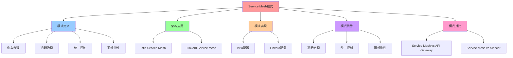

# Service Mesh 模式：侧车与代理

## 📑 目录

- [Service Mesh 模式：侧车与代理](#service-mesh-模式侧车与代理)
  - [📑 目录](#-目录)
  - [1 概述](#1-概述)
    - [1.1 核心思想](#11-核心思想)
  - [2 Service Mesh 模式定义](#2-service-mesh-模式定义)
    - [2.1 Service Mesh 模式概念](#21-service-mesh-模式概念)
    - [2.2 Service Mesh 模式结构](#22-service-mesh-模式结构)
    - [2.3 Service Mesh 模式特点](#23-service-mesh-模式特点)
  - [3 架构中的应用](#3-架构中的应用)
    - [3.1 Istio Service Mesh](#31-istio-service-mesh)
    - [3.2 Linkerd Service Mesh](#32-linkerd-service-mesh)
  - [4 Service Mesh 模式实现](#4-service-mesh-模式实现)
    - [4.1 Istio 配置示例](#41-istio-配置示例)
    - [4.2 Linkerd 配置示例](#42-linkerd-配置示例)
  - [5 Service Mesh 模式优势](#5-service-mesh-模式优势)
    - [5.1 透明治理](#51-透明治理)
    - [5.2 统一控制](#52-统一控制)
    - [5.3 可观测性](#53-可观测性)
  - [6 Service Mesh 模式与其他模式](#6-service-mesh-模式与其他模式)
    - [6.1 Service Mesh vs API Gateway](#61-service-mesh-vs-api-gateway)
    - [6.2 Service Mesh vs Sidecar](#62-service-mesh-vs-sidecar)
  - [7 形式化定义](#7-形式化定义)
    - [7.1 Service Mesh 模式定义](#71-service-mesh-模式定义)
    - [7.2 Sidecar 定义](#72-sidecar-定义)
    - [7.3 Control Plane 定义](#73-control-plane-定义)
  - [8 相关文档](#8-相关文档)
    - [8.1 组合模式文档](#81-组合模式文档)
    - [8.2 参考资源](#82-参考资源)
  - [9 总结](#9-总结)

---

## 1 概述

本文档详细阐述**Service Mesh 模式**在架构设计中的应用，通过侧车和代理实现流量治
理。

### 1.1 核心思想

> **通过 Service Mesh 模式将流量治理从应用中分离出来，通过侧车代理实现统一治理**

## 2 Service Mesh 模式定义

### 2.1 Service Mesh 模式概念

**Service Mesh 模式**是一种架构模式，通过侧车代理实现流量治理。

### 2.2 Service Mesh 模式结构

```text
Application Pod
├── Application Container
└── Sidecar Container (Envoy)
    ├── Control Plane (Istio)
    ├── Traffic Management
    ├── Security (mTLS)
    └── Observability (Metrics/Tracing)
```

### 2.3 Service Mesh 模式特点

**Service Mesh 模式特点**：

- **侧车代理**：每个 Pod 都有侧车代理
- **透明治理**：流量治理对应用透明
- **统一控制**：通过控制平面统一控制
- **可观测性**：自动注入遥测数据

## 3 架构中的应用

### 3.1 Istio Service Mesh

**Istio Service Mesh 架构**：

```text
Application Pod
├── Application Container
└── Istio Sidecar (Envoy)
    ├── Istio Control Plane
    │   ├── Pilot (配置管理)
    │   ├── Citadel (安全)
    │   └── Galley (配置验证)
    ├── Traffic Management
    │   ├── VirtualService
    │   ├── DestinationRule
    │   └── Gateway
    ├── Security
    │   ├── mTLS
    │   └── AuthorizationPolicy
    └── Observability
        ├── Prometheus (Metrics)
        ├── Tempo (Tracing)
        └── Grafana (Visualization)
```

**Istio Service Mesh 特点**：

- **侧车注入**：自动注入 Envoy sidecar
- **配置驱动**：通过 CRD 配置流量治理
- **统一控制**：通过控制平面统一控制
- **可观测性**：自动注入遥测数据

### 3.2 Linkerd Service Mesh

**Linkerd Service Mesh 架构**：

```text
Application Pod
├── Application Container
└── Linkerd Sidecar (Linkerd Proxy)
    ├── Linkerd Control Plane
    │   ├── Destination (服务发现)
    │   ├── Identity (安全)
    │   └── Public API
    ├── Traffic Management
    │   ├── ServiceProfile
    │   └── TrafficSplit
    ├── Security
    │   ├── mTLS
    │   └── Authorization
    └── Observability
        ├── Metrics
        └── Tracing
```

**Linkerd Service Mesh 特点**：

- **轻量级**：Linkerd Proxy 更轻量
- **Rust 实现**：性能更好
- **易于使用**：配置更简单
- **可观测性**：自动注入遥测数据

## 4 Service Mesh 模式实现

### 4.1 Istio 配置示例

**VirtualService 配置**：

```yaml
apiVersion: networking.istio.io/v1beta1
kind: VirtualService
metadata:
  name: order-service
spec:
  hosts:
    - order-service
  http:
    - match:
        - headers:
            version:
              exact: v1
      route:
        - destination:
            host: order-service
            subset: v1
    - route:
        - destination:
            host: order-service
            subset: v2
          weight: 10
        - destination:
            host: order-service
            subset: v1
          weight: 90
```

**DestinationRule 配置**：

```yaml
apiVersion: networking.istio.io/v1beta1
kind: DestinationRule
metadata:
  name: order-service
spec:
  host: order-service
  trafficPolicy:
    loadBalancer:
      simple: LEAST_CONN
    connectionPool:
      tcp:
        maxConnections: 100
      http:
        http1MaxPendingRequests: 10
        http2MaxRequests: 100
        maxRequestsPerConnection: 2
```

**AuthorizationPolicy 配置**：

```yaml
apiVersion: security.istio.io/v1beta1
kind: AuthorizationPolicy
metadata:
  name: order-service-policy
spec:
  selector:
    matchLabels:
      app: order-service
  action: ALLOW
  rules:
    - from:
        - source:
            principals: ["cluster.local/ns/default/sa/frontend"]
      to:
        - operation:
            methods: ["GET", "POST"]
            paths: ["/orders"]
```

### 4.2 Linkerd 配置示例

**ServiceProfile 配置**：

```yaml
apiVersion: linkerd.io/v1alpha2
kind: ServiceProfile
metadata:
  name: order-service
  namespace: default
spec:
  routes:
    - name: GET /orders
      condition:
        method: GET
        pathRegex: /orders
      isRetryable: true
      timeout: 30s
```

**TrafficSplit 配置**：

```yaml
apiVersion: split.smi-spec.io/v1alpha1
kind: TrafficSplit
metadata:
  name: order-service-split
spec:
  service: order-service
  backends:
    - service: order-service-v1
      weight: 90
    - service: order-service-v2
      weight: 10
```

## 5 Service Mesh 模式优势

### 5.1 透明治理

**Service Mesh 模式优势**：

- **应用无感知**：流量治理对应用透明
- **无需修改代码**：应用无需修改代码
- **统一治理**：通过控制平面统一治理

### 5.2 统一控制

**Service Mesh 模式优势**：

- **配置驱动**：通过 CRD 配置流量治理
- **统一控制**：通过控制平面统一控制
- **动态更新**：配置可以动态更新

### 5.3 可观测性

**Service Mesh 模式优势**：

- **自动注入**：自动注入遥测数据
- **统一遥测**：统一的遥测标准
- **可视化**：通过 Grafana 可视化

## 6 Service Mesh 模式与其他模式

### 6.1 Service Mesh vs API Gateway

**Service Mesh vs API Gateway**：

| 模式             | 特点               | 使用场景       |
| ---------------- | ------------------ | -------------- |
| **Service Mesh** | 侧车代理，透明治理 | 微服务内部通信 |
| **API Gateway**  | 入口网关，统一入口 | 外部访问入口   |

### 6.2 Service Mesh vs Sidecar

**Service Mesh vs Sidecar**：

| 模式             | 特点               | 使用场景       |
| ---------------- | ------------------ | -------------- |
| **Service Mesh** | 完整的流量治理平台 | 微服务架构     |
| **Sidecar**      | 单个侧车代理       | 特定场景的代理 |

## 7 形式化定义

### 7.1 Service Mesh 模式定义

```text
Service Mesh M = ⟨sidecars, controlPlane, policies, observability⟩
其中：
- sidecars: 侧车代理集合
- controlPlane: 控制平面
- policies: 策略配置集合
- observability: 可观测性组件集合
```

### 7.2 Sidecar 定义

```text
Sidecar S = ⟨proxy, policies, metrics, tracing⟩
其中：
- proxy: 代理组件
- policies: 策略配置
- metrics: 指标收集
- tracing: 追踪收集
```

### 7.3 Control Plane 定义

```text
Control Plane C = ⟨config, discovery, security, observability⟩
其中：
- config: 配置管理
- discovery: 服务发现
- security: 安全管理
- observability: 可观测性管理
```

## 8 相关文档

### 8.1 组合模式文档

- **[组合模式文档集](README.md)** - 组合模式文档集说明
- **[Service Mesh Patterns](./04-service-mesh-pattern.md)** - Service Mesh 模式
  （本文件）
- **[Service Aggregation 模式](./05-nsm-pattern.md#service-aggregation)** -
  Service Aggregation 模式（在本目录中）
- **[Service Mesh 与 NSM](../03-service-mesh-nsm/)** - Service Mesh 和 NSM 的组
  合模式

### 8.2 参考资源

- **[REFERENCES.md](../../REFERENCES.md)** - 参考标准、框架、工具和资源
- **[ACADEMIC-REFERENCES.md](../../ACADEMIC-REFERENCES.md)** - Wikipedia、大学课
  程、学术论文等学术资源

## 9 总结

通过**Service Mesh 模式**，我们实现了：

1. **侧车代理**：每个 Pod 都有侧车代理，实现透明治理
2. **统一控制**：通过控制平面统一控制流量治理
3. **配置驱动**：通过 CRD 配置流量治理，无需修改代码
4. **可观测性**：自动注入遥测数据，实现统一可观测性
5. **安全性**：通过 mTLS 和 AuthorizationPolicy 实现安全治理

**相关模式**：Service Mesh 模式可以与 Service Aggregation 模式结合使用，Service
Mesh 负责流量治理，Service Aggregation 负责服务聚合。详细内容请参考
[Service Aggregation 模式](./05-nsm-pattern.md#service-aggregation)。

---

---

## 10 认知增强：思维导图、知识矩阵与专家观点

### 10.1 Service Mesh模式完整思维导图



### 10.2 知识多维关系矩阵

#### Service Mesh实现多维关系矩阵

| 实现维度 | Istio | Linkerd | 实现协同 | 认知价值 |
|---------|-------|---------|---------|---------|
| **侧车代理** | Envoy | Linkerd Proxy | 代理对比 | 代理理解 |
| **控制平面** | Pilot/Citadel/Galley | Destination/Identity | 控制平面对比 | 控制理解 |
| **流量管理** | VirtualService/DestinationRule | ServiceProfile/TrafficSplit | 流量管理对比 | 流量理解 |
| **安全治理** | mTLS/AuthorizationPolicy | mTLS/Authorization | 安全对比 | 安全理解 |
| **可观测性** | Prometheus/Tempo/Grafana | Metrics/Tracing | 可观测性对比 | 观测理解 |
| **学习难度** | ⭐⭐⭐⭐ | ⭐⭐⭐ | ⭐⭐⭐⭐ | 渐进学习 |
| **专家推荐** | ⭐⭐⭐⭐⭐ | ⭐⭐⭐⭐⭐ | ⭐⭐⭐⭐⭐ | 技术深度 |

#### Service Mesh模式对比多维关系矩阵

| 对比维度 | Service Mesh | API Gateway | Sidecar | 模式协同 | 认知价值 |
|---------|-------------|------------|---------|---------|---------|
| **定位** | 微服务内部通信 | 外部访问入口 | 特定场景代理 | 定位对比 | 定位理解 |
| **特点** | 侧车代理、透明治理 | 入口网关、统一入口 | 单个侧车代理 | 特点对比 | 特点理解 |
| **使用场景** | 微服务架构 | 外部访问 | 特定场景 | 场景对比 | 场景理解 |
| **架构收益** | 透明治理、统一控制 | 统一入口、API管理 | 特定功能代理 | 收益对比 | 收益理解 |
| **学习难度** | ⭐⭐⭐⭐ | ⭐⭐⭐ | ⭐⭐⭐ | ⭐⭐⭐⭐ | 渐进学习 |
| **专家推荐** | ⭐⭐⭐⭐⭐ | ⭐⭐⭐⭐⭐ | ⭐⭐⭐⭐ | ⭐⭐⭐⭐⭐ | 技术深度 |

### 10.3 形象化解释论证

#### Service Mesh模式的形象化类比

##### 1. Service Mesh = 交通指挥系统

> **类比**：Service Mesh就像交通指挥系统，侧车代理像交通警察（每个路口都有），透明治理像交通规则（对司机透明），统一控制像交通指挥中心（统一指挥），就像交通指挥系统将交通管理从司机中分离出来，通过交通警察实现统一治理一样。

**认知价值**：

- **治理理解**：通过交通指挥系统类比，理解Service Mesh的治理特性
- **透明理解**：通过交通规则透明类比，理解Service Mesh透明治理的含义
- **统一理解**：通过交通指挥中心类比，理解Service Mesh统一控制的作用

##### 2. 侧车代理 = 贴身保镖

> **类比**：侧车代理就像贴身保镖，应用像被保护的人（需要保护），侧车代理像贴身保镖（每个应用都有），流量治理像安全保护（对应用透明），就像贴身保镖将安全保护从被保护人中分离出来，通过贴身保镖实现统一保护一样。

**认知价值**：

- **代理理解**：通过贴身保镖类比，理解侧车代理的含义
- **透明理解**：通过安全保护透明类比，理解侧车代理透明治理的作用
- **统一理解**：通过统一保护类比，理解侧车代理统一控制的重要性

##### 3. 控制平面 = 大脑中枢

> **类比**：控制平面就像大脑中枢，侧车代理像神经末梢（执行指令），控制平面像大脑中枢（统一控制），配置驱动像神经信号（传递指令），就像大脑中枢将控制从神经末梢中分离出来，通过大脑中枢实现统一控制一样。

**认知价值**：

- **控制理解**：通过大脑中枢类比，理解控制平面的含义
- **统一理解**：通过统一控制类比，理解控制平面统一控制的作用
- **配置理解**：通过神经信号类比，理解配置驱动的重要性

##### 4. Service Mesh vs API Gateway = 内部交通 vs 外部入口

> **类比**：Service Mesh vs API Gateway就像内部交通 vs 外部入口，Service Mesh像城市内部交通（微服务内部通信），API Gateway像城市入口（外部访问入口），就像内部交通和外部入口分别负责不同的交通管理一样。

**认知价值**：

- **定位理解**：通过内部交通和外部入口类比，理解Service Mesh和API Gateway的定位区别
- **场景理解**：通过交通场景类比，理解Service Mesh和API Gateway的使用场景
- **协同理解**：通过交通协同类比，理解Service Mesh和API Gateway的协同使用

##### 5. 透明治理 = 自动化系统

> **类比**：透明治理就像自动化系统，应用像操作员（无需关心细节），Service Mesh像自动化系统（自动处理），流量治理像自动化流程（对操作员透明），就像自动化系统将流程从操作员中分离出来，通过自动化系统实现统一处理一样。

**认知价值**：

- **透明理解**：通过自动化系统类比，理解透明治理的含义
- **自动理解**：通过自动化流程类比，理解Service Mesh自动治理的作用
- **统一理解**：通过统一处理类比，理解透明治理的重要性

### 10.4 专家观点与论证

#### 计算信息软件科学家的观点

##### 1. Martin Kleppmann（《数据密集型应用系统设计》作者）

> **观点**："The best way to get accurate information from Wikipedia is to read it early in the morning before anyone else has edited it."（从Wikipedia获取准确信息的最佳方法是在早上其他人编辑之前阅读它）

**与Service Mesh模式的关联**：

- **配置理解**：Service Mesh通过配置驱动实现流量治理，就像Wikipedia通过编辑实现信息更新一样
- **统一理解**：通过Wikipedia统一编辑类比，理解Service Mesh统一控制的重要性
- **透明理解**：通过Wikipedia透明编辑类比，理解Service Mesh透明治理的作用

##### 2. Werner Vogels（Amazon CTO）

> **观点**："Everything fails all the time."（一切都会失败）

**与Service Mesh模式的关联**：

- **弹性理解**：Service Mesh通过超时、重试、熔断实现弹性治理，就像应对"一切都会失败"一样
- **治理理解**：通过失败应对类比，理解Service Mesh弹性治理的重要性
- **实践理解**：通过失败实践类比，理解Service Mesh在实践中的应用

##### 3. Sam Newman（《微服务架构设计模式》作者）

> **观点**："Microservices are a means to an end, not an end in themselves."（微服务是达到目的的手段，而不是目的本身）

**与Service Mesh模式的关联**：

- **手段理解**：Service Mesh是微服务架构的手段，就像微服务是达到目的的手段一样
- **目的理解**：通过手段目的类比，理解Service Mesh在微服务架构中的作用
- **实践理解**：通过手段实践类比，理解Service Mesh在实践中的应用

#### 计算信息软件教育家的观点

##### 1. Robert C. Martin（《代码整洁之道》作者）

> **观点**："The only way to go fast is to go well."（快速前进的唯一方法是做好）

**与Service Mesh模式的关联**：

- **质量理解**：Service Mesh体现了架构质量（透明治理、统一控制、可观测性）
- **速度理解**：通过Service Mesh理解速度与质量的权衡（透明治理vs手动治理）
- **实践理解**：通过Service Mesh指导实践，选择"做好"的架构

##### 2. Martin Fowler（重构之父）

> **观点**："Any fool can write code that a computer can understand. Good programmers write code that humans can understand."（任何傻瓜都能编写计算机能理解的代码。好的程序员编写人类能理解的代码）

**与Service Mesh模式的关联**：

- **可理解性理解**：Service Mesh通过透明治理、统一控制提高可理解性
- **人类理解**：通过Service Mesh理解架构的人类可理解性（清晰的配置、自动的行为）
- **选择理解**：通过Service Mesh选择"人类能理解"的架构

#### 计算信息软件认知学家的观点

##### 1. Donald Norman（《设计心理学》作者）

> **观点**："The real problem with the interface is that it is an interface. Interfaces get in the way. I don't want to focus my energies on an interface. I want to focus on the job."（界面的真正问题是它是界面。界面会妨碍。我不想把精力集中在界面上。我想专注于工作）

**与Service Mesh模式的关联**：

- **接口理解**：Service Mesh体现了接口的重要性（侧车代理接口、控制平面接口），但也要避免过度关注接口
- **工作理解**：通过Service Mesh专注于架构工作（透明治理、统一控制），而不是过度关注接口细节
- **平衡理解**：通过Service Mesh理解接口与工作的平衡

##### 2. Herbert A. Simon（认知科学家）

> **观点**："A wealth of information creates a poverty of attention."（信息丰富导致注意力贫乏）

**与Service Mesh模式的关联**：

- **注意力理解**：Service Mesh通过透明治理、统一控制管理注意力，避免信息过载
- **结构化理解**：通过Service Mesh结构化信息（侧车代理、控制平面），减少认知负荷
- **管理理解**：通过Service Mesh管理信息，避免注意力贫乏

### 10.5 认知学习路径矩阵

| 学习阶段 | 推荐内容 | 推荐实现 | 学习重点 | 学习时间 | 前置要求 | 后续进阶 |
|---------|---------|---------|---------|---------|---------|---------|
| **新手阶段** | 概述、模式定义 | Service Mesh模式概念理解 | 模式理解、基本概念理解 | 1-2周 | 无 | 进阶阶段 |
| **进阶阶段** | 架构应用、模式实现 | Istio、Linkerd | 应用理解、实现理解 | 4-8周 | 新手阶段 | 专家阶段 |
| **专家阶段** | 模式优势、模式对比 | 完整应用 | 优势理解、对比理解 | 16+周 | 进阶阶段 | - |

### 10.6 专家推荐阅读路径

**路径1：模式理解路径**：

1. **第一步**：阅读概述（第1节），理解Service Mesh模式概览
2. **第二步**：阅读模式定义（第2节），理解侧车代理、透明治理、统一控制、可观测性
3. **第三步**：阅读架构应用（第3节），理解Service Mesh模式在架构中的应用
4. **第四步**：阅读总结（第9节），回顾关键要点

**路径2：实现理解路径**：

1. **第一步**：阅读概述（第1节），了解Service Mesh模式
2. **第二步**：阅读架构应用（第3节），学习Istio、Linkerd应用
3. **第三步**：阅读模式实现（第4节），学习实现方法
4. **第四步**：阅读模式优势（第5节），学习优势应用

**路径3：对比理解路径**：

1. **第一步**：阅读概述（第1节），了解Service Mesh模式
2. **第二步**：阅读模式对比（第6节），理解Service Mesh vs API Gateway、Service Mesh vs Sidecar
3. **第三步**：阅读模式优势（第5节），理解优势对比
4. **第四步**：阅读总结（第9节），学习最佳实践

---

**更新时间**：2025-11-15 **版本**：v1.1 **参考**：`architecture_view.md` 第914-983行，Service Mesh模式部分

**更新内容（v1.1）**：

- ✅ 添加认知增强章节（思维导图、知识矩阵、形象化解释、专家观点）
- ✅ 添加认知学习路径矩阵
- ✅ 添加专家推荐阅读路径（3条路径）
