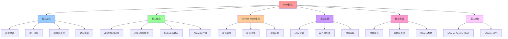

# NSM 模式：跨域网络聚合

## 📑 目录

- [NSM 模式：跨域网络聚合](#nsm-模式跨域网络聚合)
  - [📑 目录](#-目录)
  - [1 概述](#1-概述)
    - [1.1 核心思想](#11-核心思想)
  - [2 NSM 模式定义](#2-nsm-模式定义)
    - [2.1 NSM 模式概念](#21-nsm-模式概念)
    - [2.2 NSM 模式结构](#22-nsm-模式结构)
    - [2.3 NSM 模式特点](#23-nsm-模式特点)
  - [3 NSM 核心概念](#3-nsm-核心概念)
    - [3.1 vL3（虚拟 L3 网络）](#31-vl3虚拟-l3-网络)
    - [3.2 vWire（虚拟隧道）](#32-vwire虚拟隧道)
    - [3.3 Endpoints（端点）](#33-endpoints端点)
    - [3.4 Clients（客户端）](#34-clients客户端)
  - [4 NSM 与 Service Mesh 的组合](#4-nsm-与-service-mesh-的组合)
    - [4.1 组合架构](#41-组合架构)
    - [4.2 组合步骤](#42-组合步骤)
    - [4.3 组合示例](#43-组合示例)
  - [5 NSM 模式实现](#5-nsm-模式实现)
    - [5.1 NSM 安装](#51-nsm-安装)
    - [5.2 NSM 客户端配置](#52-nsm-客户端配置)
    - [5.3 NSM 跨域连接](#53-nsm-跨域连接)
  - [6 NSM 模式优势](#6-nsm-模式优势)
    - [6.1 跨域聚合](#61-跨域聚合)
    - [6.2 细粒度治理](#62-细粒度治理)
    - [6.3 多 Service Mesh 叠加](#63-多-service-mesh-叠加)
  - [7 NSM 模式与其他模式](#7-nsm-模式与其他模式)
    - [7.1 NSM vs Service Mesh](#71-nsm-vs-service-mesh)
    - [7.2 NSM vs VPN](#72-nsm-vs-vpn)
  - [8 形式化定义](#8-形式化定义)
    - [8.1 NSM 模式定义](#81-nsm-模式定义)
    - [8.2 vWire 定义](#82-vwire-定义)
    - [8.3 Endpoint 定义](#83-endpoint-定义)
  - [9 相关文档](#9-相关文档)
    - [9.1 组合模式文档](#91-组合模式文档)
    - [9.2 参考资源](#92-参考资源)
  - [10 总结](#10-总结)

---

## 1 概述

本文档详细阐述**NSM（Network Service Mesh）模式**在架构设计中的应用，通过跨域网
络聚合实现统一网络治理。

### 1.1 核心思想

> **通过 NSM 模式实现跨域网络聚合，将 Service Mesh 作为 Network Service 统一管理
> ，实现 Pod、VM、物理机的统一网络连接**

## 2 NSM 模式定义

### 2.1 NSM 模式概念

**NSM 模式**是一种网络架构模式，通过跨域网络聚合实现统一网络治理。

### 2.2 NSM 模式结构

```text
NSM Network
├── vL3 (虚拟 L3 网络)
├── vWire (虚拟隧道)
├── Endpoints (端点)
└── Clients (客户端)
    ├── Pod (Kubernetes)
    ├── VM (虚拟机)
    └── Physical Machine (物理机)
```

### 2.3 NSM 模式特点

**NSM 模式特点**：

- **跨域聚合**：聚合 Pod、VM、物理机
- **统一网络**：统一的网络抽象
- **细粒度治理**：vWire 支持细粒度流量治理
- **透明连接**：透明的跨域连接

## 3 NSM 核心概念

### 3.1 vL3（虚拟 L3 网络）

**vL3 定义**：

- **虚拟 L3 网络**：虚拟的 L3 网络层
- **服务发现**：通过 vL3 实现服务发现
- **路由**：通过 vL3 实现路由

### 3.2 vWire（虚拟隧道）

**vWire 定义**：

- **虚拟隧道**：虚拟的网络隧道
- **流量治理**：通过 vWire 实现流量治理
- **安全**：通过 vWire 实现加密和认证

### 3.3 Endpoints（端点）

**Endpoints 定义**：

- **服务端点**：服务的网络端点
- **服务注册**：通过 Endpoints 注册服务
- **服务发现**：通过 Endpoints 发现服务

### 3.4 Clients（客户端）

**Clients 定义**：

- **客户端**：使用 NSM 的客户端
- **跨域支持**：支持 Pod、VM、物理机
- **透明连接**：透明的跨域连接

## 4 NSM 与 Service Mesh 的组合

### 4.1 组合架构

**NSM + Service Mesh 组合**：

```text
Service Mesh (Istio/Linkerd)
    ├── vL3 (虚拟 L3 网络)
    └── Endpoints (端点)
        ↓
NSM Network
    ├── vL3 (虚拟 L3 网络)
    ├── vWire (虚拟隧道)
    └── Endpoints (端点)
        ↓
跨域网络
    ├── Pod (Kubernetes)
    ├── VM (虚拟机)
    └── Physical Machine (物理机)
```

### 4.2 组合步骤

**组合步骤**：

1. **注册 Service Mesh**：把 Istio/Linkerd 的 **vL3** 与 **Endpoint** 抽象为
   **NSM Network Service**
2. **NSM 允许多 Service Mesh 叠加**：在同一 vL3 上注册多个 **Network Service**（
   例如 Istio、Linkerd、Kuma）
3. **通过 vWire 细粒度流量治理**：vWire 负责 **TLS、熔断、限流**；可携带
   `labels` 进行流量路由

### 4.3 组合示例

**组合示例**：

```yaml
# NSM Network Service
apiVersion: networkservicemesh.io/v1
kind: NetworkService
metadata:
  name: istio-service
spec:
  vL3: istio-vl3
  endpoints:
    - name: order-service
      address: 10.0.0.1
      port: 8080
  vWire:
    - name: order-service-vwire
      source: pod-order-service
      destination: vm-order-service
      policy:
        tls: true
        rateLimit: 1000
        circuitBreaker: true
```

## 5 NSM 模式实现

### 5.1 NSM 安装

**NSM 安装**：

```bash
# 安装 NSM
kubectl apply -f https://raw.githubusercontent.com/networkservicemesh/deployments-k8s/main/examples/use-cases/nsm-1.yaml

# 安装 NSM Control Plane
kubectl apply -f https://raw.githubusercontent.com/networkservicemesh/deployments-k8s/main/examples/use-cases/nsm-control-plane.yaml
```

### 5.2 NSM 客户端配置

**NSM 客户端配置**：

```yaml
apiVersion: v1
kind: Pod
metadata:
  name: order-service
  annotations:
    networkservicemesh.io/request: |
      {
        "mechanism": "vWire",
        "networkService": "order-service",
        "labels": {
          "app": "order-service",
          "version": "v1"
        }
      }
spec:
  containers:
    - name: order-service
      image: order-service:latest
```

### 5.3 NSM 跨域连接

**跨域连接配置**：

```yaml
# Pod 到 VM
apiVersion: networkservicemesh.io/v1
kind: NetworkServiceEndpoint
metadata:
  name: pod-to-vm
spec:
  networkService: order-service
  vWire:
    source:
      type: Pod
      name: order-service-pod
    destination:
      type: VM
      name: order-service-vm
    policy:
      tls: true
      rateLimit: 1000
      circuitBreaker: true

# VM 到物理机
apiVersion: networkservicemesh.io/v1
kind: NetworkServiceEndpoint
metadata:
  name: vm-to-physical
spec:
  networkService: order-service
  vWire:
    source:
      type: VM
      name: order-service-vm
    destination:
      type: PhysicalMachine
      name: order-service-physical
    policy:
      tls: true
      rateLimit: 1000
      circuitBreaker: true
```

## 6 NSM 模式优势

### 6.1 跨域聚合

**NSM 模式优势**：

- **统一网络**：统一的网络抽象
- **跨域支持**：支持 Pod、VM、物理机
- **透明连接**：透明的跨域连接

### 6.2 细粒度治理

**NSM 模式优势**：

- **vWire 治理**：通过 vWire 实现细粒度流量治理
- **策略支持**：支持 TLS、限流、熔断等策略
- **标签路由**：通过 labels 进行流量路由

### 6.3 多 Service Mesh 叠加

**NSM 模式优势**：

- **多 Mesh 支持**：支持多个 Service Mesh 叠加
- **统一管理**：通过 NSM 统一管理
- **灵活组合**：可以灵活组合不同的 Service Mesh

## 7 NSM 模式与其他模式

### 7.1 NSM vs Service Mesh

**NSM vs Service Mesh**：

| 模式             | 特点           | 使用场景       |
| ---------------- | -------------- | -------------- |
| **NSM**          | 跨域网络聚合   | 跨域网络连接   |
| **Service Mesh** | 微服务流量治理 | 微服务内部通信 |

### 7.2 NSM vs VPN

**NSM vs VPN**：

| 模式    | 特点           | 使用场景     |
| ------- | -------------- | ------------ |
| **NSM** | 细粒度流量治理 | 跨域网络连接 |
| **VPN** | 网络层加密     | 网络层加密   |

## 8 形式化定义

### 8.1 NSM 模式定义

```text
NSM N = ⟨vL3, vWire, endpoints, clients⟩
其中：
- vL3: 虚拟 L3 网络
- vWire: 虚拟隧道集合
- endpoints: 端点集合
- clients: 客户端集合
```

### 8.2 vWire 定义

```text
vWire W = ⟨source, destination, policy, labels⟩
其中：
- source: 源端点
- destination: 目标端点
- policy: 策略配置
- labels: 标签集合
```

### 8.3 Endpoint 定义

```text
Endpoint E = ⟨name, address, port, service⟩
其中：
- name: 端点名称
- address: 端点地址
- port: 端点端口
- service: 所属服务
```

## 9 相关文档

### 9.1 组合模式文档

- **[组合模式文档集](README.md)** - 组合模式文档集说明
- **[NSM 模式](./05-nsm-pattern.md)** - NSM 模式（本文件）
- **[Service Aggregation 模式](./05-nsm-pattern.md#service-aggregation)** -
  Service Aggregation 模式（在本文件中）
- **[Service Mesh 与 NSM](../03-service-mesh-nsm/)** - Service Mesh 和 NSM 的组
  合模式
- **[Network Service Mesh 视角](../10-quick-views/network-service-mesh-view.md)** -
  Network Service Mesh 视角文档

### 9.2 参考资源

- **[REFERENCES.md](../../REFERENCES.md)** - 参考标准、框架、工具和资源
- **[ACADEMIC-REFERENCES.md](../../ACADEMIC-REFERENCES.md)** - Wikipedia、大学课
  程、学术论文等学术资源

## 10 总结

通过**NSM 模式**，我们实现了：

1. **跨域聚合**：聚合 Pod、VM、物理机，实现统一网络连接
2. **统一网络**：统一的网络抽象，简化网络管理
3. **细粒度治理**：通过 vWire 实现细粒度流量治理
4. **多 Mesh 叠加**：支持多个 Service Mesh 叠加，灵活组合
5. **透明连接**：透明的跨域连接，简化网络配置

**相关模式**：NSM 模式与 Service Aggregation 模式可以结合使用，NSM 负责跨域网络
聚合，Service Aggregation 负责服务聚合。详细内容请参考
[Service Aggregation 模式](./05-nsm-pattern.md#service-aggregation)。

---

---

## 11 认知增强：思维导图、知识矩阵与专家观点

### 11.1 NSM模式完整思维导图



### 11.2 知识多维关系矩阵

#### NSM核心概念多维关系矩阵

| 概念维度 | vL3 | vWire | Endpoints | Clients | 概念协同 | 认知价值 |
|---------|-----|-------|-----------|---------|---------|---------|
| **定义** | 虚拟L3网络 | 虚拟隧道 | 服务端点 | 客户端 | 定义对比 | 定义理解 |
| **功能** | 服务发现、路由 | 流量治理、安全 | 服务注册、发现 | 跨域支持、透明连接 | 功能对比 | 功能理解 |
| **典型实现** | NSM vL3 | NSM vWire | NSM Endpoints | Pod/VM/Physical Machine | 实现对比 | 实现理解 |
| **架构收益** | 统一网络抽象 | 细粒度治理 | 服务管理 | 跨域连接 | 收益对比 | 收益理解 |
| **学习难度** | ⭐⭐⭐⭐ | ⭐⭐⭐⭐ | ⭐⭐⭐ | ⭐⭐⭐ | ⭐⭐⭐⭐ | 渐进学习 |
| **专家推荐** | ⭐⭐⭐⭐⭐ | ⭐⭐⭐⭐⭐ | ⭐⭐⭐⭐⭐ | ⭐⭐⭐⭐⭐ | ⭐⭐⭐⭐⭐ | 技术深度 |

#### NSM模式对比多维关系矩阵

| 对比维度 | NSM | Service Mesh | VPN | 模式协同 | 认知价值 |
|---------|-----|-------------|-----|---------|---------|
| **定位** | 跨域网络聚合 | 微服务流量治理 | 网络层加密 | 定位对比 | 定位理解 |
| **特点** | 跨域聚合、统一网络 | 侧车代理、透明治理 | 网络层加密 | 特点对比 | 特点理解 |
| **使用场景** | 跨域网络连接 | 微服务内部通信 | 网络层加密 | 场景对比 | 场景理解 |
| **架构收益** | 统一网络、跨域连接 | 透明治理、统一控制 | 网络安全 | 收益对比 | 收益理解 |
| **学习难度** | ⭐⭐⭐⭐ | ⭐⭐⭐⭐ | ⭐⭐⭐ | ⭐⭐⭐⭐ | 渐进学习 |
| **专家推荐** | ⭐⭐⭐⭐⭐ | ⭐⭐⭐⭐⭐ | ⭐⭐⭐⭐ | ⭐⭐⭐⭐⭐ | 技术深度 |

### 11.3 形象化解释论证

#### NSM模式的形象化类比

##### 1. NSM = 统一交通网络

> **类比**：NSM就像统一交通网络，vL3像交通网络（统一网络抽象），vWire像交通隧道（虚拟隧道），Endpoints像交通站点（服务端点），Clients像交通工具（Pod、VM、物理机），就像统一交通网络将不同交通工具统一管理，通过交通网络实现统一连接一样。

**认知价值**：

- **网络理解**：通过统一交通网络类比，理解NSM的网络特性
- **统一理解**：通过交通网络统一管理类比，理解NSM统一网络的含义
- **连接理解**：通过交通连接类比，理解NSM跨域连接的作用

##### 2. vWire = 专用通道

> **类比**：vWire就像专用通道，流量治理像通道管理（流量治理），安全像通道安全（加密和认证），标签路由像通道标识（通过labels路由），就像专用通道将不同流量统一管理，通过专用通道实现细粒度治理一样。

**认知价值**：

- **隧道理解**：通过专用通道类比，理解vWire的含义
- **治理理解**：通过通道管理类比，理解vWire细粒度治理的作用
- **路由理解**：通过通道标识类比，理解vWire标签路由的重要性

##### 3. NSM + Service Mesh = 双层网络

> **类比**：NSM + Service Mesh就像双层网络，Service Mesh像内层网络（微服务内部通信），NSM像外层网络（跨域网络连接），就像双层网络将不同网络统一管理，通过双层网络实现统一连接一样。

**认知价值**：

- **组合理解**：通过双层网络类比，理解NSM与Service Mesh的组合
- **层次理解**：通过网络层次类比，理解NSM与Service Mesh的层次关系
- **统一理解**：通过统一管理类比，理解NSM与Service Mesh统一管理的重要性

##### 4. NSM vs Service Mesh = 跨域网络 vs 内部网络

> **类比**：NSM vs Service Mesh就像跨域网络 vs 内部网络，NSM像跨域网络（跨域网络连接），Service Mesh像内部网络（微服务内部通信），就像跨域网络和内部网络分别负责不同的网络管理一样。

**认知价值**：

- **定位理解**：通过跨域网络和内部网络类比，理解NSM和Service Mesh的定位区别
- **场景理解**：通过网络场景类比，理解NSM和Service Mesh的使用场景
- **协同理解**：通过网络协同类比，理解NSM和Service Mesh的协同使用

##### 5. 跨域聚合 = 统一管理平台

> **类比**：跨域聚合就像统一管理平台，Pod像平台用户（Kubernetes用户），VM像平台用户（虚拟机用户），物理机像平台用户（物理机用户），就像统一管理平台将不同用户统一管理，通过统一管理平台实现统一连接一样。

**认知价值**：

- **聚合理解**：通过统一管理平台类比，理解跨域聚合的含义
- **统一理解**：通过统一管理类比，理解跨域聚合的价值
- **连接理解**：通过统一连接类比，理解跨域聚合的重要性

### 11.4 专家观点与论证

#### 计算信息软件科学家的观点

##### 1. Leslie Lamport（分布式系统理论家）

> **观点**："A distributed system is one in which the failure of a computer you didn't even know existed can render your own computer unusable."（分布式系统是指一个你不知道存在的计算机的故障可能导致你自己的计算机无法使用的系统）

**与NSM模式的关联**：

- **分布式理解**：NSM模式体现了分布式系统的特性（跨域网络、统一网络抽象）
- **故障理解**：通过NSM模式理解分布式系统的故障处理（跨域连接、透明连接）
- **系统理解**：通过NSM模式理解分布式系统的复杂性（多Mesh叠加、细粒度治理）

##### 2. Van Jacobson（网络架构师）

> **观点**："The network is the computer."（网络就是计算机）

**与NSM模式的关联**：

- **网络理解**：NSM模式体现了网络的重要性（统一网络抽象、跨域网络聚合）
- **计算理解**：通过NSM模式理解网络与计算的关系（网络即计算）
- **系统理解**：通过NSM模式理解网络系统的复杂性（vL3、vWire、Endpoints）

##### 3. Radia Perlman（网络协议设计者）

> **观点**："The network is the computer, and the computer is the network."（网络就是计算机，计算机就是网络）

**与NSM模式的关联**：

- **网络理解**：NSM模式体现了网络与计算的一体化（统一网络抽象、跨域网络聚合）
- **计算理解**：通过NSM模式理解网络与计算的统一（网络即计算）
- **系统理解**：通过NSM模式理解网络系统的统一性（vL3、vWire、Endpoints）

#### 计算信息软件教育家的观点

##### 1. Robert C. Martin（《代码整洁之道》作者）

> **观点**："The only way to go fast is to go well."（快速前进的唯一方法是做好）

**与NSM模式的关联**：

- **质量理解**：NSM模式体现了架构质量（跨域聚合、统一网络、细粒度治理）
- **速度理解**：通过NSM模式理解速度与质量的权衡（跨域连接vs统一网络）
- **实践理解**：通过NSM模式指导实践，选择"做好"的架构

##### 2. Martin Fowler（重构之父）

> **观点**："Any fool can write code that a computer can understand. Good programmers write code that humans can understand."（任何傻瓜都能编写计算机能理解的代码。好的程序员编写人类能理解的代码）

**与NSM模式的关联**：

- **可理解性理解**：NSM模式通过统一网络抽象、跨域聚合提高可理解性
- **人类理解**：通过NSM模式理解架构的人类可理解性（清晰的网络抽象、明确的跨域连接）
- **选择理解**：通过NSM模式选择"人类能理解"的架构

#### 计算信息软件认知学家的观点

##### 1. Donald Norman（《设计心理学》作者）

> **观点**："The real problem with the interface is that it is an interface. Interfaces get in the way. I don't want to focus my energies on an interface. I want to focus on the job."（界面的真正问题是它是界面。界面会妨碍。我不想把精力集中在界面上。我想专注于工作）

**与NSM模式的关联**：

- **接口理解**：NSM模式体现了接口的重要性（vL3接口、vWire接口），但也要避免过度关注接口
- **工作理解**：通过NSM模式专注于架构工作（跨域聚合、统一网络），而不是过度关注接口细节
- **平衡理解**：通过NSM模式理解接口与工作的平衡

##### 2. Herbert A. Simon（认知科学家）

> **观点**："A wealth of information creates a poverty of attention."（信息丰富导致注意力贫乏）

**与NSM模式的关联**：

- **注意力理解**：NSM模式通过统一网络抽象、跨域聚合管理注意力，避免信息过载
- **结构化理解**：通过NSM模式结构化信息（vL3、vWire、Endpoints），减少认知负荷
- **管理理解**：通过NSM模式管理信息，避免注意力贫乏

### 11.5 认知学习路径矩阵

| 学习阶段 | 推荐内容 | 推荐实现 | 学习重点 | 学习时间 | 前置要求 | 后续进阶 |
|---------|---------|---------|---------|---------|---------|---------|
| **新手阶段** | 概述、模式定义 | NSM模式概念理解 | 模式理解、基本概念理解 | 1-2周 | 无 | 进阶阶段 |
| **进阶阶段** | 核心概念、Service Mesh组合 | vL3、vWire、Endpoints | 概念理解、组合理解 | 4-8周 | 新手阶段 | 专家阶段 |
| **专家阶段** | 模式实现、模式优势、模式对比 | 完整应用 | 实现理解、优势理解、对比理解 | 16+周 | 进阶阶段 | - |

### 11.6 专家推荐阅读路径

**路径1：模式理解路径**：

1. **第一步**：阅读概述（第1节），理解NSM模式概览
2. **第二步**：阅读模式定义（第2节），理解跨域聚合、统一网络、细粒度治理、透明连接
3. **第三步**：阅读核心概念（第3节），理解vL3、vWire、Endpoints、Clients
4. **第四步**：阅读总结（第10节），回顾关键要点

**路径2：组合理解路径**：

1. **第一步**：阅读概述（第1节），了解NSM模式
2. **第二步**：阅读Service Mesh组合（第4节），学习NSM与Service Mesh的组合
3. **第三步**：阅读模式实现（第5节），学习实现方法
4. **第四步**：阅读模式优势（第6节），学习优势应用

**路径3：对比理解路径**：

1. **第一步**：阅读概述（第1节），了解NSM模式
2. **第二步**：阅读模式对比（第7节），理解NSM vs Service Mesh、NSM vs VPN
3. **第三步**：阅读模式优势（第6节），理解优势对比
4. **第四步**：阅读总结（第10节），学习最佳实践

---

**更新时间**：2025-11-15 **版本**：v1.1 **参考**：`architecture_view.md` 第391-610行，NSM模式部分

**更新内容（v1.1）**：

- ✅ 添加认知增强章节（思维导图、知识矩阵、形象化解释、专家观点）
- ✅ 添加认知学习路径矩阵
- ✅ 添加专家推荐阅读路径（3条路径）
