# 功能视角：系统功能与能力

## 📑 目录

- [功能视角：系统功能与能力](#功能视角系统功能与能力)
  - [📑 目录](#-目录)
  - [1 概述](#1-概述)
    - [1.1 核心思想](#11-核心思想)
  - [2 功能视角定义](#2-功能视角定义)
    - [2.1 功能视角概念](#21-功能视角概念)
    - [2.2 功能视角特点](#22-功能视角特点)
  - [3 虚拟化功能](#3-虚拟化功能)
    - [3.1 虚拟化核心功能](#31-虚拟化核心功能)
    - [3.2 虚拟化扩展功能](#32-虚拟化扩展功能)
  - [4 容器化功能](#4-容器化功能)
    - [4.1 容器化核心功能](#41-容器化核心功能)
    - [4.2 容器化扩展功能](#42-容器化扩展功能)
  - [5 沙盒化功能](#5-沙盒化功能)
    - [5.1 沙盒化核心功能](#51-沙盒化核心功能)
    - [5.2 沙盒化扩展功能](#52-沙盒化扩展功能)
  - [6 Service Mesh 功能](#6-service-mesh-功能)
    - [6.1 Service Mesh 核心功能](#61-service-mesh-核心功能)
    - [6.2 Service Mesh 扩展功能](#62-service-mesh-扩展功能)
  - [7 OPA 功能](#7-opa-功能)
    - [7.1 OPA 核心功能](#71-opa-核心功能)
    - [7.2 OPA 扩展功能](#72-opa-扩展功能)
  - [8 功能组合](#8-功能组合)
    - [8.1 功能组合方式](#81-功能组合方式)
    - [8.2 功能组合示例](#82-功能组合示例)
  - [9 形式化定义](#9-形式化定义)
    - [9.1 功能定义](#91-功能定义)
    - [9.2 功能组合定义](#92-功能组合定义)
  - [10 总结](#10-总结)

---

## 1 概述

本文档从**功能视角**阐述软件架构，重点关注系统的功能和能力。

### 1.1 核心思想

> **从功能视角理解系统，关注系统提供的功能和能力，以及如何通过虚拟化、容器化、沙
> 盒化等技术实现这些功能**

## 2 功能视角定义

### 2.1 功能视角概念

**功能视角**关注系统提供的功能和能力，包括：

- **核心功能**：系统提供的主要功能
- **扩展功能**：系统提供的扩展功能
- **能力边界**：系统的能力边界
- **功能组合**：功能的组合方式

### 2.2 功能视角特点

**功能视角特点**：

- **功能导向**：以功能为核心
- **能力分析**：关注系统能力
- **功能分解**：将复杂功能分解为简单功能
- **功能组合**：通过组合实现复杂功能

## 3 虚拟化功能

### 3.1 虚拟化核心功能

**虚拟化核心功能**：

| 功能         | 说明                     | 典型实现       |
| ------------ | ------------------------ | -------------- |
| **资源抽象** | 将物理资源抽象为虚拟资源 | Hypervisor     |
| **资源隔离** | 虚拟机之间资源隔离       | VM 隔离        |
| **资源调度** | 虚拟资源的调度和管理     | VMM 调度器     |
| **快照管理** | 虚拟机的快照和恢复       | VM 快照        |
| **迁移管理** | 虚拟机的迁移和复制       | Live Migration |

### 3.2 虚拟化扩展功能

**虚拟化扩展功能**：

- **热迁移**：虚拟机在线迁移
- **资源超分**：虚拟资源超分
- **多租户**：多租户隔离
- **GPU 直通**：GPU 资源直通

## 4 容器化功能

### 4.1 容器化核心功能

**容器化核心功能**：

| 功能         | 说明                 | 典型实现          |
| ------------ | -------------------- | ----------------- |
| **进程隔离** | 容器进程之间的隔离   | Namespace         |
| **资源限制** | 容器资源限制和管理   | Cgroup            |
| **镜像管理** | 容器镜像的构建和管理 | OCI Image         |
| **生命周期** | 容器的生命周期管理   | Container Runtime |
| **编排管理** | 容器的编排和调度     | Kubernetes        |

### 4.2 容器化扩展功能

**容器化扩展功能**：

- **多架构支持**：支持多种 CPU 架构
- **镜像签名**：镜像签名和验证
- **存储管理**：容器存储管理
- **网络管理**：容器网络管理

## 5 沙盒化功能

### 5.1 沙盒化核心功能

**沙盒化核心功能**：

| 功能             | 说明                  | 典型实现           |
| ---------------- | --------------------- | ------------------ |
| **系统调用过滤** | 系统调用的过滤和限制  | Seccomp-BPF        |
| **文件系统隔离** | 文件系统访问控制      | OverlayFS          |
| **网络隔离**     | 网络访问控制          | Network Policy     |
| **能力限制**     | Linux Capability 限制 | Capability         |
| **安全边界**     | 安全边界的定义和执行  | gVisor/Firecracker |

### 5.2 沙盒化扩展功能

**沙盒化扩展功能**：

- **最小权限**：最小权限原则
- **能力闭包**：能力闭包验证
- **安全审计**：安全审计和日志
- **合规性**：合规性检查

## 6 Service Mesh 功能

### 6.1 Service Mesh 核心功能

**Service Mesh 核心功能**：

| 功能         | 说明                 | 典型实现            |
| ------------ | -------------------- | ------------------- |
| **流量管理** | 流量的路由和负载均衡 | VirtualService      |
| **安全治理** | mTLS 和授权策略      | AuthorizationPolicy |
| **可观测性** | 指标、日志、追踪     | Prometheus/Tempo    |
| **弹性治理** | 超时、重试、熔断     | DestinationRule     |
| **策略治理** | 策略的统一管理       | OPA                 |

### 6.2 Service Mesh 扩展功能

**Service Mesh 扩展功能**：

- **多集群治理**：多集群流量治理
- **跨云治理**：跨云流量治理
- **边缘治理**：边缘流量治理
- **AI 推理治理**：AI 推理流量治理

## 7 OPA 功能

### 7.1 OPA 核心功能

**OPA 核心功能**：

| 功能           | 说明                 | 典型实现     |
| -------------- | -------------------- | ------------ |
| **策略决策**   | 策略的评估和决策     | PDP          |
| **策略执行**   | 策略的执行和审计     | PEP          |
| **策略管理**   | 策略的统一管理       | OCP          |
| **策略版本化** | 策略的版本管理       | Bundle       |
| **策略审计**   | 策略决策的审计和日志 | Decision Log |

### 7.2 OPA 扩展功能

**OPA 扩展功能**：

- **策略测试**：策略的单元测试
- **策略验证**：策略的形式化验证
- **策略组合**：策略的组合和重用
- **策略分发**：策略的自动分发

## 8 功能组合

### 8.1 功能组合方式

**功能组合方式**：

- **层次组合**：功能按层次组合
- **并行组合**：功能并行执行
- **顺序组合**：功能按顺序执行
- **条件组合**：根据条件组合功能

### 8.2 功能组合示例

**虚拟化 + 容器化**：

```text
虚拟化功能
  ├── 资源抽象
  ├── 资源隔离
  └── 资源调度
      ↓
容器化功能
  ├── 进程隔离
  ├── 资源限制
  └── 镜像管理
```

**容器化 + 沙盒化**：

```text
容器化功能
  ├── 进程隔离
  ├── 资源限制
  └── 镜像管理
      ↓
沙盒化功能
  ├── 系统调用过滤
  ├── 文件系统隔离
  └── 能力限制
```

## 9 形式化定义

### 9.1 功能定义

```text
功能 F = ⟨name, inputs, outputs, behavior⟩
其中：
- name: 功能名称
- inputs: 输入参数集合
- outputs: 输出参数集合
- behavior: 行为定义
```

### 9.2 功能组合定义

```text
功能组合 C = ⟨functions, composition, result⟩
其中：
- functions: 功能集合
- composition: 组合方式
- result: 组合结果
```

## 10 总结

通过**功能视角**，我们理解了：

1. **核心功能**：每个技术栈提供的核心功能
2. **扩展功能**：每个技术栈提供的扩展功能
3. **功能组合**：功能的组合方式和效果
4. **能力边界**：每个技术栈的能力边界
5. **功能演进**：功能从虚拟化到容器化到沙盒化的演进

---

---

## 11 认知增强：思维导图、知识矩阵与专家观点

### 11.1 功能视角完整思维导图

```mermaid
graph TB
    A[功能视角] --> B[视角定义]
    A --> C[虚拟化功能]
    A --> D[容器化功能]
    A --> E[沙盒化功能]
    A --> F[Service Mesh功能]
    A --> G[OPA功能]
    A --> H[功能组合]

    B --> B1[功能导向]
    B --> B2[能力分析]
    B --> B3[功能分解]
    B --> B4[功能组合]

    C --> C1[资源抽象]
    C --> C2[资源隔离]
    C --> C3[资源调度]

    D --> D1[进程隔离]
    D --> D2[资源限制]
    D --> D3[镜像管理]

    E --> E1[系统调用过滤]
    E --> E2[文件系统隔离]
    E --> E3[能力限制]

    F --> F1[流量管理]
    F --> F2[安全治理]
    F --> F3[可观测性]

    G --> G1[策略决策]
    G --> G2[策略执行]
    G --> G3[策略管理]

    H --> H1[层次组合]
    H --> H2[并行组合]
    H --> H3[顺序组合]

    style A fill:#ff9999
    style B fill:#99ccff
    style C fill:#99ff99
    style D fill:#ffcc99
    style E fill:#cc99ff
    style F fill:#ff99cc
    style G fill:#99ffcc
    style H fill:#ffccff
```



### 11.2 知识多维关系矩阵

#### 技术栈功能多维关系矩阵

| 功能维度 | 虚拟化 | 容器化 | 沙盒化 | Service Mesh | OPA | 功能协同 | 认知价值 |
|---------|--------|--------|--------|-------------|-----|---------|---------|
| **核心功能** | 资源抽象、隔离、调度 | 进程隔离、资源限制、镜像管理 | 系统调用过滤、文件系统隔离 | 流量管理、安全治理 | 策略决策、执行 | 功能对比 | 功能理解 |
| **扩展功能** | 热迁移、资源超分 | 多架构支持、镜像签名 | 最小权限、能力闭包 | 多集群治理、跨云治理 | 策略测试、验证 | 扩展对比 | 扩展理解 |
| **能力边界** | 虚拟机级别 | 容器级别 | 进程级别 | 服务级别 | 策略级别 | 边界对比 | 边界理解 |
| **功能演进** | 第一代 | 第二代 | 第三代 | 第四代 | 第五代 | 演进对比 | 演进理解 |
| **学习难度** | ⭐⭐⭐ | ⭐⭐⭐ | ⭐⭐⭐⭐ | ⭐⭐⭐⭐ | ⭐⭐⭐⭐ | ⭐⭐⭐⭐ | 渐进学习 |
| **专家推荐** | ⭐⭐⭐⭐⭐ | ⭐⭐⭐⭐⭐ | ⭐⭐⭐⭐⭐ | ⭐⭐⭐⭐⭐ | ⭐⭐⭐⭐⭐ | ⭐⭐⭐⭐⭐ | 技术深度 |

#### 功能组合方式多维关系矩阵

| 组合维度 | 层次组合 | 并行组合 | 顺序组合 | 条件组合 | 组合协同 | 认知价值 |
|---------|---------|---------|---------|---------|---------|---------|
| **组合方式** | 按层次组合 | 并行执行 | 按顺序执行 | 根据条件组合 | 方式对比 | 方式理解 |
| **适用场景** | 分层架构 | 独立功能 | 依赖功能 | 条件功能 | 场景对比 | 场景理解 |
| **典型示例** | 虚拟化+容器化 | 多服务并行 | 流水线处理 | 条件路由 | 示例对比 | 示例理解 |
| **架构收益** | 层次清晰 | 性能提升 | 依赖管理 | 灵活组合 | 收益对比 | 收益理解 |
| **学习难度** | ⭐⭐⭐ | ⭐⭐⭐ | ⭐⭐⭐ | ⭐⭐⭐⭐ | ⭐⭐⭐⭐ | 渐进学习 |
| **专家推荐** | ⭐⭐⭐⭐⭐ | ⭐⭐⭐⭐⭐ | ⭐⭐⭐⭐⭐ | ⭐⭐⭐⭐⭐ | ⭐⭐⭐⭐⭐ | 技术深度 |

### 11.3 形象化解释论证

#### 功能视角的形象化类比

##### 1. 功能视角 = 工具箱视角

> **类比**：功能视角就像工具箱视角，技术栈像工具（每个工具都有功能），核心功能像主要工具（核心功能），扩展功能像辅助工具（扩展功能），就像工具箱视角关注工具的功能，而不是工具的结构一样。

**认知价值**：

- **视角理解**：通过工具箱视角类比，理解功能视角的含义
- **功能理解**：通过工具功能类比，理解技术栈功能的重要性
- **组合理解**：通过工具组合类比，理解功能组合的作用

##### 2. 虚拟化功能 = 资源管理器

> **类比**：虚拟化功能就像资源管理器，资源抽象像资源分配（将物理资源抽象为虚拟资源），资源隔离像资源隔离（虚拟机之间资源隔离），资源调度像资源调度（虚拟资源的调度和管理），就像资源管理器将资源管理从应用中分离出来，通过资源管理器实现统一管理一样。

**认知价值**：

- **功能理解**：通过资源管理器类比，理解虚拟化功能的核心（资源抽象、隔离、调度）
- **抽象理解**：通过资源分配类比，理解资源抽象的含义
- **隔离理解**：通过资源隔离类比，理解资源隔离的作用

##### 3. 容器化功能 = 进程管理器

> **类比**：容器化功能就像进程管理器，进程隔离像进程隔离（容器进程之间的隔离），资源限制像资源限制（容器资源限制和管理），镜像管理像镜像管理（容器镜像的构建和管理），就像进程管理器将进程管理从应用中分离出来，通过进程管理器实现统一管理一样。

**认知价值**：

- **功能理解**：通过进程管理器类比，理解容器化功能的核心（进程隔离、资源限制、镜像管理）
- **隔离理解**：通过进程隔离类比，理解进程隔离的含义
- **管理理解**：通过进程管理类比，理解容器化功能的管理作用

##### 4. 功能组合 = 积木组合

> **类比**：功能组合就像积木组合，层次组合像积木层次（按层次组合），并行组合像积木并行（并行执行），顺序组合像积木顺序（按顺序执行），就像积木组合将复杂功能分解为简单功能，通过组合实现复杂功能一样。

**认知价值**：

- **组合理解**：通过积木组合类比，理解功能组合的含义
- **方式理解**：通过积木方式类比，理解功能组合的不同方式（层次、并行、顺序）
- **实现理解**：通过积木实现类比，理解功能组合的实现方法

##### 5. 功能演进 = 技术升级

> **类比**：功能演进就像技术升级，虚拟化像第一代（资源抽象），容器化像第二代（进程隔离），沙盒化像第三代（系统调用过滤），Service Mesh像第四代（流量治理），就像技术升级将功能从简单到复杂，通过演进实现功能提升一样。

**认知价值**：

- **演进理解**：通过技术升级类比，理解功能演进的趋势（从虚拟化到Service Mesh）
- **提升理解**：通过功能提升类比，理解功能演进的价值
- **趋势理解**：通过技术趋势类比，理解功能演进的未来方向

### 11.4 专家观点与论证

#### 计算信息软件科学家的观点

##### 1. David Parnas（信息隐藏原则）

> **观点**："The criteria to be used in decomposing systems into modules are based on the principle of information hiding."（将系统分解为模块的标准基于信息隐藏原则）

**与功能视角的关联**：

- **分解理解**：功能视角通过功能分解理解系统，就像信息隐藏原则通过模块分解理解系统一样
- **功能理解**：通过功能视角理解系统的功能边界（核心功能、扩展功能）
- **组合理解**：通过功能视角理解功能的组合方式（层次组合、并行组合、顺序组合）

##### 2. Barbara Liskov（Liskov替换原则）

> **观点**："What is wanted is something like the following substitution property: If for each object o1 of type S there is an object o2 of type T such that for all programs P defined in terms of T, the behavior of P is unchanged when o1 is substituted for o2 then S is a subtype of T."（需要的是类似以下替换属性：如果对于类型S的每个对象o1，存在类型T的对象o2，使得对于所有用T定义的程序P，当o1替换o2时，P的行为不变，则S是T的子类型）

**与功能视角的关联**：

- **替换理解**：功能视角体现了替换原则（功能可以替换、技术栈可以替换）
- **行为理解**：通过功能视角理解功能替换时行为保持不变（核心功能、扩展功能）
- **子类型理解**：通过功能视角理解功能类型的子类型关系（不同技术栈功能的替换）

##### 3. Christopher Alexander（模式语言）

> **观点**："Each pattern describes a problem which occurs over and over again in our environment, and then describes the core of the solution to that problem, in such a way that you can use this solution a million times over, without ever doing it the same way twice."（每个模式描述一个在我们的环境中反复出现的问题，然后描述该问题解决方案的核心，这样你可以使用这个解决方案一百万次，而永远不会以相同的方式做两次）

**与功能视角的关联**：

- **模式理解**：功能视角体现了模式语言的思想，通过功能模式解决反复出现的问题（资源管理、进程管理、流量治理）
- **复用理解**：通过功能视角理解功能模式的可复用性（核心功能、扩展功能）
- **创新理解**：通过功能视角理解功能模式的创新性（每次使用都不同）

#### 计算信息软件教育家的观点

##### 1. Robert C. Martin（《代码整洁之道》作者）

> **观点**："The only way to go fast is to go well."（快速前进的唯一方法是做好）

**与功能视角的关联**：

- **质量理解**：功能视角体现了架构质量（功能导向、能力分析、功能分解、功能组合）
- **速度理解**：通过功能视角理解速度与质量的权衡（功能分解vs功能组合）
- **实践理解**：通过功能视角指导实践，选择"做好"的架构

##### 2. Martin Fowler（重构之父）

> **观点**："Any fool can write code that a computer can understand. Good programmers write code that humans can understand."（任何傻瓜都能编写计算机能理解的代码。好的程序员编写人类能理解的代码）

**与功能视角的关联**：

- **可理解性理解**：功能视角通过功能导向、能力分析提高可理解性
- **人类理解**：通过功能视角理解架构的人类可理解性（清晰的功能、明确的能力）
- **选择理解**：通过功能视角选择"人类能理解"的架构

#### 计算信息软件认知学家的观点

##### 1. Donald Norman（《设计心理学》作者）

> **观点**："The real problem with the interface is that it is an interface. Interfaces get in the way. I don't want to focus my energies on an interface. I want to focus on the job."（界面的真正问题是它是界面。界面会妨碍。我不想把精力集中在界面上。我想专注于工作）

**与功能视角的关联**：

- **接口理解**：功能视角体现了功能的重要性（核心功能、扩展功能），但也要避免过度关注功能细节
- **工作理解**：通过功能视角专注于架构工作（功能导向、能力分析），而不是过度关注功能细节
- **平衡理解**：通过功能视角理解功能与工作的平衡

##### 2. Herbert A. Simon（认知科学家）

> **观点**："A wealth of information creates a poverty of attention."（信息丰富导致注意力贫乏）

**与功能视角的关联**：

- **注意力理解**：功能视角通过功能导向、能力分析管理注意力，避免信息过载
- **结构化理解**：通过功能视角结构化信息（核心功能、扩展功能），减少认知负荷
- **管理理解**：通过功能视角管理信息，避免注意力贫乏

### 11.5 认知学习路径矩阵

| 学习阶段 | 推荐内容 | 推荐技术栈 | 学习重点 | 学习时间 | 前置要求 | 后续进阶 |
|---------|---------|-----------|---------|---------|---------|---------|
| **新手阶段** | 概述、视角定义 | 功能视角概念理解 | 视角理解、基本概念理解 | 1-2周 | 无 | 进阶阶段 |
| **进阶阶段** | 虚拟化、容器化、沙盒化功能 | 虚拟化、容器化、沙盒化 | 功能理解、技术栈理解 | 4-8周 | 新手阶段 | 专家阶段 |
| **专家阶段** | Service Mesh、OPA功能、功能组合 | 完整技术栈 | 功能组合理解、演进理解 | 16+周 | 进阶阶段 | - |

### 11.6 专家推荐阅读路径

**路径1：视角理解路径**：

1. **第一步**：阅读概述（第1节），理解功能视角概览
2. **第二步**：阅读视角定义（第2节），理解功能导向、能力分析、功能分解、功能组合
3. **第三步**：阅读功能组合（第8节），理解功能组合方式
4. **第四步**：阅读总结（第10节），回顾关键要点

**路径2：技术栈理解路径**：

1. **第一步**：阅读概述（第1节），了解功能视角
2. **第二步**：阅读虚拟化、容器化、沙盒化功能（第3-5节），学习技术栈功能
3. **第三步**：阅读Service Mesh、OPA功能（第6-7节），学习高级功能
4. **第四步**：阅读功能组合（第8节），学习功能组合方法

**路径3：演进理解路径**：

1. **第一步**：阅读概述（第1节），了解功能视角
2. **第二步**：阅读虚拟化、容器化、沙盒化功能（第3-5节），理解功能演进
3. **第三步**：阅读Service Mesh、OPA功能（第6-7节），理解功能演进趋势
4. **第四步**：阅读总结（第10节），学习功能演进最佳实践

---

**更新时间**：2025-11-15 **版本**：v1.1 **参考**：`architecture_view.md` 功能视角部分

**更新内容（v1.1）**：

- ✅ 添加认知增强章节（思维导图、知识矩阵、形象化解释、专家观点）
- ✅ 添加认知学习路径矩阵
- ✅ 添加专家推荐阅读路径（3条路径）
