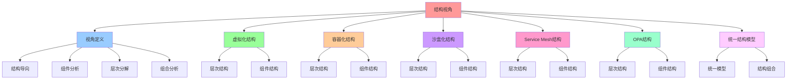

# 结构视角：系统结构与组件

## 📑 目录

- [结构视角：系统结构与组件](#结构视角系统结构与组件)
  - [📑 目录](#-目录)
  - [1 概述](#1-概述)
    - [1.1 核心思想](#11-核心思想)
  - [2 结构视角定义](#2-结构视角定义)
    - [2.1 结构视角概念](#21-结构视角概念)
    - [2.2 结构视角特点](#22-结构视角特点)
  - [3 虚拟化结构](#3-虚拟化结构)
    - [3.1 虚拟化层次结构](#31-虚拟化层次结构)
    - [3.2 虚拟化组件结构](#32-虚拟化组件结构)
  - [4 容器化结构](#4-容器化结构)
    - [4.1 容器化层次结构](#41-容器化层次结构)
    - [4.2 容器化组件结构](#42-容器化组件结构)
  - [5 沙盒化结构](#5-沙盒化结构)
    - [5.1 沙盒化层次结构](#51-沙盒化层次结构)
    - [5.2 沙盒化组件结构](#52-沙盒化组件结构)
  - [6 Service Mesh 结构](#6-service-mesh-结构)
    - [6.1 Service Mesh 层次结构](#61-service-mesh-层次结构)
    - [6.2 Service Mesh 组件结构](#62-service-mesh-组件结构)
  - [7 OPA 结构](#7-opa-结构)
    - [7.1 OPA 层次结构](#71-opa-层次结构)
    - [7.2 OPA 组件结构](#72-opa-组件结构)
  - [8 统一结构模型](#8-统一结构模型)
    - [8.1 统一结构模型](#81-统一结构模型)
    - [8.2 结构组合方式](#82-结构组合方式)
  - [9 形式化定义](#9-形式化定义)
    - [9.1 结构定义](#91-结构定义)
    - [9.2 层次定义](#92-层次定义)
  - [10 总结](#10-总结)
  - [11 认知增强：思维导图、知识矩阵与专家观点](#11-认知增强思维导图知识矩阵与专家观点)
    - [11.1 结构视角完整思维导图](#111-结构视角完整思维导图)
    - [11.2 知识多维关系矩阵](#112-知识多维关系矩阵)
      - [技术栈结构多维关系矩阵](#技术栈结构多维关系矩阵)
      - [结构组合方式多维关系矩阵](#结构组合方式多维关系矩阵)
    - [11.3 形象化解释论证](#113-形象化解释论证)
      - [结构视角的形象化类比](#结构视角的形象化类比)
        - [1. 结构视角 = 建筑蓝图视角](#1-结构视角--建筑蓝图视角)
        - [2. 层次结构 = 洋葱结构](#2-层次结构--洋葱结构)
        - [3. 组件结构 = 乐高积木结构](#3-组件结构--乐高积木结构)
        - [4. 统一结构模型 = 统一建筑标准](#4-统一结构模型--统一建筑标准)
        - [5. 结构演进 = 建筑技术演进](#5-结构演进--建筑技术演进)
    - [11.4 专家观点与论证](#114-专家观点与论证)
      - [计算信息软件科学家的观点](#计算信息软件科学家的观点)
        - [1. David Parnas（信息隐藏原则）](#1-david-parnas信息隐藏原则)
        - [2. Christopher Alexander（模式语言）](#2-christopher-alexander模式语言)
        - [3. Barbara Liskov（Liskov替换原则）](#3-barbara-liskovliskov替换原则)
      - [计算信息软件教育家的观点](#计算信息软件教育家的观点)
        - [1. Robert C. Martin（《代码整洁之道》作者）](#1-robert-c-martin代码整洁之道作者)
        - [2. Martin Fowler（重构之父）](#2-martin-fowler重构之父)
      - [计算信息软件认知学家的观点](#计算信息软件认知学家的观点)
        - [1. Donald Norman（《设计心理学》作者）](#1-donald-norman设计心理学作者)
        - [2. Herbert A. Simon（认知科学家）](#2-herbert-a-simon认知科学家)
    - [11.5 认知学习路径矩阵](#115-认知学习路径矩阵)
    - [11.6 专家推荐阅读路径](#116-专家推荐阅读路径)

---

## 1 概述

本文档从**结构视角**阐述软件架构，重点关注系统的结构和组件。

### 1.1 核心思想

> **从结构视角理解系统，关注系统的组件结构、层次结构、组合结构，以及如何通过虚拟
> 化、容器化、沙盒化等技术构建系统结构**

## 2 结构视角定义

### 2.1 结构视角概念

**结构视角**关注系统的结构和组件，包括：

- **组件结构**：系统的组件构成
- **层次结构**：系统的层次划分
- **组合结构**：组件的组合方式
- **接口结构**：组件之间的接口

### 2.2 结构视角特点

**结构视角特点**：

- **结构导向**：以结构为核心
- **组件分析**：关注系统组件
- **层次分解**：将复杂系统分解为层次
- **组合分析**：分析组件的组合方式

## 3 虚拟化结构

### 3.1 虚拟化层次结构

**虚拟化层次结构**：

```text
硬件层
  ↓
Hypervisor 层
  ├── VMM（虚拟机监控器）
  ├── VM 管理器
  └── 资源调度器
  ↓
虚拟机层
  ├── Guest OS
  ├── 应用
  └── 数据
```

### 3.2 虚拟化组件结构

**虚拟化组件结构**：

| 组件           | 说明         | 典型实现          |
| -------------- | ------------ | ----------------- |
| **Hypervisor** | 虚拟机监控器 | KVM、Xen、Hyper-V |
| **VMM**        | 虚拟机管理器 | libvirt           |
| **VM**         | 虚拟机实例   | VM Instance       |
| **Guest OS**   | 客户操作系统 | Linux、Windows    |

## 4 容器化结构

### 4.1 容器化层次结构

**容器化层次结构**：

```text
宿主机层
  ├── Host OS
  ├── 容器运行时
  └── 容器编排
  ↓
容器层
  ├── Container
  ├── 应用
  └── 数据
```

### 4.2 容器化组件结构

**容器化组件结构**：

| 组件                  | 说明       | 典型实现           |
| --------------------- | ---------- | ------------------ |
| **Container Runtime** | 容器运行时 | containerd、CRI-O  |
| **Container**         | 容器实例   | Container Instance |
| **Image**             | 容器镜像   | OCI Image          |
| **Orchestrator**      | 容器编排器 | Kubernetes         |

## 5 沙盒化结构

### 5.1 沙盒化层次结构

**沙盒化层次结构**：

```text
宿主机层
  ├── Host OS
  ├── 沙盒运行时
  └── 安全策略
  ↓
沙盒层
  ├── Sandbox
  ├── 应用
  └── 数据
```

### 5.2 沙盒化组件结构

**沙盒化组件结构**：

| 组件                | 说明         | 典型实现            |
| ------------------- | ------------ | ------------------- |
| **Sandbox Runtime** | 沙盒运行时   | gVisor、Firecracker |
| **Sandbox**         | 沙盒实例     | Sandbox Instance    |
| **Seccomp**         | 系统调用过滤 | Seccomp-BPF         |
| **Policy**          | 安全策略     | OPA                 |

## 6 Service Mesh 结构

### 6.1 Service Mesh 层次结构

**Service Mesh 层次结构**：

```text
应用层
  ├── Application
  └── Sidecar
  ↓
控制平面层
  ├── Control Plane
  ├── 配置管理
  └── 服务发现
  ↓
数据平面层
  ├── Sidecar Proxy
  ├── 流量管理
  └── 安全治理
```

### 6.2 Service Mesh 组件结构

**Service Mesh 组件结构**：

| 组件                | 说明     | 典型实现            |
| ------------------- | -------- | ------------------- |
| **Sidecar**         | 侧车代理 | Envoy               |
| **Control Plane**   | 控制平面 | Istio Control Plane |
| **VirtualService**  | 虚拟服务 | VirtualService      |
| **DestinationRule** | 目标规则 | DestinationRule     |

## 7 OPA 结构

### 7.1 OPA 层次结构

**OPA 层次结构**：

```text
应用层
  ├── Application
  └── PEP（策略执行点）
  ↓
控制平面层
  ├── OCP（OPA 控制平面）
  ├── Bundle 管理
  └── 决策日志
  ↓
决策层
  ├── PDP（策略决策点）
  ├── 策略评估
  └── 决策输出
```

### 7.2 OPA 组件结构

**OPA 组件结构**：

| 组件       | 说明         | 典型实现          |
| ---------- | ------------ | ----------------- |
| **PDP**    | 策略决策点   | OPA Server        |
| **PEP**    | 策略执行点   | Gatekeeper、Envoy |
| **OCP**    | OPA 控制平面 | OPA Control Plane |
| **Bundle** | 策略包       | OPA Bundle        |

## 8 统一结构模型

### 8.1 统一结构模型

**统一结构模型 ℳ**：

```text
硬件层
  ↓
虚拟化层
  ↓
容器化层
  ↓
沙盒化层
  ↓
Service Mesh 层
  ↓
OPA 层（横切关注点）
  ↓
业务层
```

### 8.2 结构组合方式

**结构组合方式**：

- **层次组合**：按层次组合
- **并行组合**：并行组合
- **交叉组合**：交叉组合
- **嵌套组合**：嵌套组合

## 9 形式化定义

### 9.1 结构定义

```text
结构 S = ⟨components, layers, interfaces, relations⟩
其中：
- components: 组件集合
- layers: 层次集合
- interfaces: 接口集合
- relations: 关系集合
```

### 9.2 层次定义

```text
层次 L = ⟨level, components, interfaces⟩
其中：
- level: 层次级别
- components: 组件集合
- interfaces: 接口集合
```

## 10 总结

通过**结构视角**，我们理解了：

1. **层次结构**：从硬件到业务的多层结构
2. **组件结构**：每个技术栈的组件构成
3. **组合结构**：组件的组合方式和效果
4. **接口结构**：组件之间的接口定义
5. **统一结构**：统一的中层结构模型

---

---

## 11 认知增强：思维导图、知识矩阵与专家观点

### 11.1 结构视角完整思维导图



### 11.2 知识多维关系矩阵

#### 技术栈结构多维关系矩阵

| 结构维度 | 虚拟化 | 容器化 | 沙盒化 | Service Mesh | OPA | 结构协同 | 认知价值 |
|---------|--------|--------|--------|-------------|-----|---------|---------|
| **层次结构** | 硬件层→Hypervisor层→VM层 | 宿主机层→容器层 | 宿主机层→沙盒层 | 应用层→控制平面层→数据平面层 | 应用层→控制平面层→决策层 | 层次对比 | 层次理解 |
| **组件结构** | Hypervisor、VMM、VM | Container Runtime、Container、Image | Sandbox Runtime、Sandbox、Policy | Sidecar、Control Plane、VirtualService | PDP、PEP、OCP、Bundle | 组件对比 | 组件理解 |
| **接口结构** | Hypervisor接口、VM接口 | Container接口、Image接口 | Sandbox接口、Policy接口 | Sidecar接口、Control Plane接口 | PDP接口、PEP接口 | 接口对比 | 接口理解 |
| **组合结构** | 层次组合、嵌套组合 | 层次组合、并行组合 | 层次组合、交叉组合 | 层次组合、并行组合 | 层次组合、交叉组合 | 组合对比 | 组合理解 |
| **结构演进** | 第一代 | 第二代 | 第三代 | 第四代 | 第五代 | 演进对比 | 演进理解 |
| **学习难度** | ⭐⭐⭐ | ⭐⭐⭐ | ⭐⭐⭐⭐ | ⭐⭐⭐⭐ | ⭐⭐⭐⭐ | ⭐⭐⭐⭐ | 渐进学习 |
| **专家推荐** | ⭐⭐⭐⭐⭐ | ⭐⭐⭐⭐⭐ | ⭐⭐⭐⭐⭐ | ⭐⭐⭐⭐⭐ | ⭐⭐⭐⭐⭐ | ⭐⭐⭐⭐⭐ | 技术深度 |

#### 结构组合方式多维关系矩阵

| 组合维度 | 层次组合 | 并行组合 | 交叉组合 | 嵌套组合 | 组合协同 | 认知价值 |
|---------|---------|---------|---------|---------|---------|---------|
| **组合方式** | 按层次组合 | 并行组合 | 交叉组合 | 嵌套组合 | 方式对比 | 方式理解 |
| **适用场景** | 分层架构 | 独立组件 | 横切关注点 | 复杂系统 | 场景对比 | 场景理解 |
| **典型示例** | 虚拟化+容器化 | 多服务并行 | OPA横切 | 容器内沙盒 | 示例对比 | 示例理解 |
| **架构收益** | 层次清晰 | 性能提升 | 关注点分离 | 灵活组合 | 收益对比 | 收益理解 |
| **学习难度** | ⭐⭐⭐ | ⭐⭐⭐ | ⭐⭐⭐⭐ | ⭐⭐⭐⭐ | ⭐⭐⭐⭐ | 渐进学习 |
| **专家推荐** | ⭐⭐⭐⭐⭐ | ⭐⭐⭐⭐⭐ | ⭐⭐⭐⭐⭐ | ⭐⭐⭐⭐⭐ | ⭐⭐⭐⭐⭐ | 技术深度 |

### 11.3 形象化解释论证

#### 结构视角的形象化类比

##### 1. 结构视角 = 建筑蓝图视角

> **类比**：结构视角就像建筑蓝图视角，组件像建筑构件（每个构件都有结构），层次结构像建筑楼层（按层次划分），组合结构像建筑组合（通过组合实现复杂建筑），就像建筑蓝图视角关注建筑的结构，而不是建筑的功能一样。

**认知价值**：

- **视角理解**：通过建筑蓝图视角类比，理解结构视角的含义
- **结构理解**：通过建筑结构类比，理解系统结构的重要性
- **组合理解**：通过建筑组合类比，理解结构组合的作用

##### 2. 层次结构 = 洋葱结构

> **类比**：层次结构就像洋葱结构，硬件层像洋葱外层（最外层），虚拟化层像洋葱第二层（第二层），容器化层像洋葱第三层（第三层），就像洋葱结构将复杂系统分解为层次，通过层次实现系统组织一样。

**认知价值**：

- **层次理解**：通过洋葱结构类比，理解层次结构的含义
- **分解理解**：通过洋葱分解类比，理解层次分解的作用
- **组织理解**：通过洋葱组织类比，理解层次组织的价值

##### 3. 组件结构 = 乐高积木结构

> **类比**：组件结构就像乐高积木结构，组件像乐高积木（每个积木都有结构），接口像积木连接（通过接口连接），组合结构像积木组合（通过组合实现复杂结构），就像乐高积木结构将复杂系统分解为组件，通过组件实现系统构建一样。

**认知价值**：

- **组件理解**：通过乐高积木类比，理解组件结构的含义
- **接口理解**：通过积木连接类比，理解接口结构的重要性
- **组合理解**：通过积木组合类比，理解组件组合的作用

##### 4. 统一结构模型 = 统一建筑标准

> **类比**：统一结构模型就像统一建筑标准，硬件层像地基（基础层），虚拟化层像第一层（第一层），容器化层像第二层（第二层），就像统一建筑标准将不同建筑统一为标准结构，通过标准实现建筑统一一样。

**认知价值**：

- **统一理解**：通过统一建筑标准类比，理解统一结构模型的含义
- **标准理解**：通过建筑标准类比，理解统一结构模型的价值
- **模型理解**：通过标准模型类比，理解统一结构模型的作用

##### 5. 结构演进 = 建筑技术演进

> **类比**：结构演进就像建筑技术演进，虚拟化像第一代建筑技术（基础技术），容器化像第二代建筑技术（改进技术），沙盒化像第三代建筑技术（高级技术），就像建筑技术演进将结构从简单到复杂，通过演进实现结构提升一样。

**认知价值**：

- **演进理解**：通过建筑技术演进类比，理解结构演进的趋势（从虚拟化到沙盒化）
- **提升理解**：通过结构提升类比，理解结构演进的价值
- **趋势理解**：通过技术趋势类比，理解结构演进的未来方向

### 11.4 专家观点与论证

#### 计算信息软件科学家的观点

##### 1. David Parnas（信息隐藏原则）

> **观点**："The criteria to be used in decomposing systems into modules are based on the principle of information hiding."（将系统分解为模块的标准基于信息隐藏原则）

**与结构视角的关联**：

- **分解理解**：结构视角通过层次分解理解系统，就像信息隐藏原则通过模块分解理解系统一样
- **结构理解**：通过结构视角理解系统的结构边界（层次结构、组件结构）
- **组合理解**：通过结构视角理解结构的组合方式（层次组合、并行组合、交叉组合、嵌套组合）

##### 2. Christopher Alexander（模式语言）

> **观点**："Each pattern describes a problem which occurs over and over again in our environment, and then describes the core of the solution to that problem, in such a way that you can use this solution a million times over, without ever doing it the same way twice."（每个模式描述一个在我们的环境中反复出现的问题，然后描述该问题解决方案的核心，这样你可以使用这个解决方案一百万次，而永远不会以相同的方式做两次）

**与结构视角的关联**：

- **模式理解**：结构视角体现了模式语言的思想，通过结构模式解决反复出现的问题（层次结构、组件结构）
- **复用理解**：通过结构视角理解结构模式的可复用性（层次组合、组件组合）
- **创新理解**：通过结构视角理解结构模式的创新性（每次使用都不同）

##### 3. Barbara Liskov（Liskov替换原则）

> **观点**："What is wanted is something like the following substitution property: If for each object o1 of type S there is an object o2 of type T such that for all programs P defined in terms of T, the behavior of P is unchanged when o1 is substituted for o2 then S is a subtype of T."（需要的是类似以下替换属性：如果对于类型S的每个对象o1，存在类型T的对象o2，使得对于所有用T定义的程序P，当o1替换o2时，P的行为不变，则S是T的子类型）

**与结构视角的关联**：

- **替换理解**：结构视角体现了替换原则（组件可以替换、层次可以替换）
- **行为理解**：通过结构视角理解组件替换时行为保持不变（接口结构、组合结构）
- **子类型理解**：通过结构视角理解组件类型的子类型关系（不同技术栈组件的替换）

#### 计算信息软件教育家的观点

##### 1. Robert C. Martin（《代码整洁之道》作者）

> **观点**："The only way to go fast is to go well."（快速前进的唯一方法是做好）

**与结构视角的关联**：

- **质量理解**：结构视角体现了架构质量（结构导向、组件分析、层次分解、组合分析）
- **速度理解**：通过结构视角理解速度与质量的权衡（层次组合vs并行组合）
- **实践理解**：通过结构视角指导实践，选择"做好"的架构

##### 2. Martin Fowler（重构之父）

> **观点**："Any fool can write code that a computer can understand. Good programmers write code that humans can understand."（任何傻瓜都能编写计算机能理解的代码。好的程序员编写人类能理解的代码）

**与结构视角的关联**：

- **可理解性理解**：结构视角通过结构导向、组件分析提高可理解性
- **人类理解**：通过结构视角理解架构的人类可理解性（清晰的层次、明确的组件）
- **选择理解**：通过结构视角选择"人类能理解"的架构

#### 计算信息软件认知学家的观点

##### 1. Donald Norman（《设计心理学》作者）

> **观点**："The real problem with the interface is that it is an interface. Interfaces get in the way. I don't want to focus my energies on an interface. I want to focus on the job."（界面的真正问题是它是界面。界面会妨碍。我不想把精力集中在界面上。我想专注于工作）

**与结构视角的关联**：

- **接口理解**：结构视角体现了接口的重要性（接口结构），但也要避免过度关注接口
- **工作理解**：通过结构视角专注于架构工作（结构导向、组件分析），而不是过度关注接口细节
- **平衡理解**：通过结构视角理解接口与工作的平衡

##### 2. Herbert A. Simon（认知科学家）

> **观点**："A wealth of information creates a poverty of attention."（信息丰富导致注意力贫乏）

**与结构视角的关联**：

- **注意力理解**：结构视角通过层次分解、组件分析管理注意力，避免信息过载
- **结构化理解**：通过结构视角结构化信息（层次结构、组件结构），减少认知负荷
- **管理理解**：通过结构视角管理信息，避免注意力贫乏

### 11.5 认知学习路径矩阵

| 学习阶段 | 推荐内容 | 推荐技术栈 | 学习重点 | 学习时间 | 前置要求 | 后续进阶 |
|---------|---------|-----------|---------|---------|---------|---------|
| **新手阶段** | 概述、视角定义 | 结构视角概念理解 | 视角理解、基本概念理解 | 1-2周 | 无 | 进阶阶段 |
| **进阶阶段** | 虚拟化、容器化、沙盒化结构 | 虚拟化、容器化、沙盒化 | 结构理解、技术栈理解 | 4-8周 | 新手阶段 | 专家阶段 |
| **专家阶段** | Service Mesh、OPA结构、统一结构模型 | 完整技术栈 | 结构组合理解、统一模型理解 | 16+周 | 进阶阶段 | - |

### 11.6 专家推荐阅读路径

**路径1：视角理解路径**：

1. **第一步**：阅读概述（第1节），理解结构视角概览
2. **第二步**：阅读视角定义（第2节），理解结构导向、组件分析、层次分解、组合分析
3. **第三步**：阅读统一结构模型（第8节），理解统一结构模型
4. **第四步**：阅读总结（第10节），回顾关键要点

**路径2：技术栈理解路径**：

1. **第一步**：阅读概述（第1节），了解结构视角
2. **第二步**：阅读虚拟化、容器化、沙盒化结构（第3-5节），学习技术栈结构
3. **第三步**：阅读Service Mesh、OPA结构（第6-7节），学习高级结构
4. **第四步**：阅读统一结构模型（第8节），学习统一结构方法

**路径3：演进理解路径**：

1. **第一步**：阅读概述（第1节），了解结构视角
2. **第二步**：阅读虚拟化、容器化、沙盒化结构（第3-5节），理解结构演进
3. **第三步**：阅读Service Mesh、OPA结构（第6-7节），理解结构演进趋势
4. **第四步**：阅读总结（第10节），学习结构演进最佳实践

---

**更新时间**：2025-11-15 **版本**：v1.1 **参考**：`architecture_view.md` 结构视角部分

**更新内容（v1.1）**：

- ✅ 添加认知增强章节（思维导图、知识矩阵、形象化解释、专家观点）
- ✅ 添加认知学习路径矩阵
- ✅ 添加专家推荐阅读路径（3条路径）
