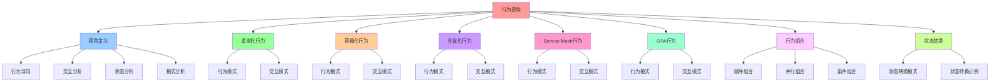

# 行为视角：系统行为与交互

## 📑 目录

- [行为视角：系统行为与交互](#行为视角系统行为与交互)
  - [📑 目录](#-目录)
  - [1 概述](#1-概述)
    - [1.1 核心思想](#11-核心思想)
  - [2 行为视角定义](#2-行为视角定义)
    - [2.1 行为视角概念](#21-行为视角概念)
    - [2.2 行为视角特点](#22-行为视角特点)
  - [3 虚拟化行为](#3-虚拟化行为)
    - [3.1 虚拟化行为模式](#31-虚拟化行为模式)
    - [3.2 虚拟化交互模式](#32-虚拟化交互模式)
  - [4 容器化行为](#4-容器化行为)
    - [4.1 容器化行为模式](#41-容器化行为模式)
    - [4.2 容器化交互模式](#42-容器化交互模式)
  - [5 沙盒化行为](#5-沙盒化行为)
    - [5.1 沙盒化行为模式](#51-沙盒化行为模式)
    - [5.2 沙盒化交互模式](#52-沙盒化交互模式)
  - [6 Service Mesh 行为](#6-service-mesh-行为)
    - [6.1 Service Mesh 行为模式](#61-service-mesh-行为模式)
    - [6.2 Service Mesh 交互模式](#62-service-mesh-交互模式)
  - [7 OPA 行为](#7-opa-行为)
    - [7.1 OPA 行为模式](#71-opa-行为模式)
    - [7.2 OPA 交互模式](#72-opa-交互模式)
  - [8 行为组合](#8-行为组合)
    - [8.1 行为组合方式](#81-行为组合方式)
    - [8.2 行为组合示例](#82-行为组合示例)
  - [9 状态转换](#9-状态转换)
    - [9.1 状态转换模式](#91-状态转换模式)
    - [9.2 状态转换示例](#92-状态转换示例)
  - [10 形式化定义](#10-形式化定义)
    - [10.1 行为定义](#101-行为定义)
    - [10.2 交互定义](#102-交互定义)
  - [11 总结](#11-总结)

---

## 1 概述

本文档从**行为视角**阐述软件架构，重点关注系统的行为和交互。

### 1.1 核心思想

> **从行为视角理解系统，关注系统的行为模式、交互模式、状态转换，以及如何通过虚拟
> 化、容器化、沙盒化等技术实现系统行为**

## 2 行为视角定义

### 2.1 行为视角概念

**行为视角**关注系统的行为和交互，包括：

- **行为模式**：系统的行为模式
- **交互模式**：系统之间的交互模式
- **状态转换**：系统的状态转换
- **行为组合**：行为的组合方式

### 2.2 行为视角特点

**行为视角特点**：

- **行为导向**：以行为为核心
- **交互分析**：关注系统交互
- **状态分析**：关注状态转换
- **模式分析**：分析行为模式

## 3 虚拟化行为

### 3.1 虚拟化行为模式

**虚拟化行为模式**：

| 行为         | 说明                 | 典型场景       |
| ------------ | -------------------- | -------------- |
| **资源分配** | 虚拟资源的分配和释放 | VM 创建/删除   |
| **资源调度** | 虚拟资源的调度和管理 | VM 迁移        |
| **状态转换** | 虚拟机的状态转换     | 启动/停止/暂停 |
| **快照管理** | 虚拟机的快照和恢复   | 快照创建/恢复  |

### 3.2 虚拟化交互模式

**虚拟化交互模式**：

```text
Hypervisor
  ├── 与硬件交互（资源访问）
  ├── 与 VM 交互（资源分配）
  └── 与 VMM 交互（管理接口）
```

## 4 容器化行为

### 4.1 容器化行为模式

**容器化行为模式**：

| 行为         | 说明                 | 典型场景            |
| ------------ | -------------------- | ------------------- |
| **生命周期** | 容器的生命周期管理   | 创建/启动/停止/删除 |
| **资源限制** | 容器资源的限制和管理 | CPU/内存限制        |
| **网络通信** | 容器之间的网络通信   | 服务发现/负载均衡   |
| **存储管理** | 容器存储的管理       | 卷挂载/数据持久化   |

### 4.2 容器化交互模式

**容器化交互模式**：

```text
Container Runtime
  ├── 与 Host OS 交互（系统调用）
  ├── 与 Container 交互（生命周期）
  ├── 与 Image 交互（镜像管理）
  └── 与 Orchestrator 交互（编排）
```

## 5 沙盒化行为

### 5.1 沙盒化行为模式

**沙盒化行为模式**：

| 行为             | 说明                  | 典型场景       |
| ---------------- | --------------------- | -------------- |
| **系统调用过滤** | 系统调用的过滤和限制  | Seccomp-BPF    |
| **文件系统隔离** | 文件系统访问控制      | OverlayFS      |
| **网络隔离**     | 网络访问控制          | Network Policy |
| **能力限制**     | Linux Capability 限制 | Capability     |

### 5.2 沙盒化交互模式

**沙盒化交互模式**：

```text
Sandbox Runtime
  ├── 与 Host OS 交互（系统调用过滤）
  ├── 与 Sandbox 交互（生命周期）
  ├── 与 Policy 交互（策略评估）
  └── 与 OPA 交互（策略决策）
```

## 6 Service Mesh 行为

### 6.1 Service Mesh 行为模式

**Service Mesh 行为模式**：

| 行为         | 说明                 | 典型场景            |
| ------------ | -------------------- | ------------------- |
| **流量路由** | 流量的路由和负载均衡 | VirtualService      |
| **安全治理** | mTLS 和授权策略      | AuthorizationPolicy |
| **可观测性** | 指标、日志、追踪注入 | Prometheus/Tempo    |
| **弹性治理** | 超时、重试、熔断     | DestinationRule     |

### 6.2 Service Mesh 交互模式

**Service Mesh 交互模式**：

```text
Sidecar
  ├── 与 Application 交互（流量拦截）
  ├── 与 Control Plane 交互（配置下发）
  ├── 与 Service 交互（服务发现）
  └── 与 Observability 交互（遥测数据）
```

## 7 OPA 行为

### 7.1 OPA 行为模式

**OPA 行为模式**：

| 行为         | 说明             | 典型场景    |
| ------------ | ---------------- | ----------- |
| **策略评估** | 策略的评估和决策 | PDP 决策    |
| **策略执行** | 策略的执行和审计 | PEP 执行    |
| **策略管理** | 策略的统一管理   | OCP 管理    |
| **策略分发** | 策略的自动分发   | Bundle 分发 |

### 7.2 OPA 交互模式

**OPA 交互模式**：

```text
PDP
  ├── 与 PEP 交互（决策请求）
  ├── 与 OCP 交互（Bundle 更新）
  ├── 与 Policy 交互（策略评估）
  └── 与 DecisionLog 交互（决策日志）
```

## 8 行为组合

### 8.1 行为组合方式

**行为组合方式**：

- **顺序组合**：行为按顺序执行
- **并行组合**：行为并行执行
- **条件组合**：根据条件组合行为
- **循环组合**：行为循环执行

### 8.2 行为组合示例

**虚拟化 + 容器化行为组合**：

```text
VM 创建
  ↓
Container 创建（在 VM 内）
  ↓
应用启动
  ↓
服务注册
```

**容器化 + 沙盒化行为组合**：

```text
Container 创建
  ↓
Sandbox 创建（在 Container 内）
  ↓
系统调用过滤
  ↓
应用启动
```

## 9 状态转换

### 9.1 状态转换模式

**状态转换模式**：

```text
初始状态
  ↓
创建
  ↓
运行状态
  ├── 暂停
  ├── 恢复
  └── 停止
  ↓
终止状态
```

### 9.2 状态转换示例

**VM 状态转换**：

```text
Created
  ↓
Starting
  ↓
Running
  ├── Paused
  ├── Resumed
  └── Stopping
  ↓
Stopped
```

**Container 状态转换**：

```text
Created
  ↓
Starting
  ↓
Running
  ├── Restarting
  └── Stopping
  ↓
Stopped
```

## 10 形式化定义

### 10.1 行为定义

```text
行为 B = ⟨name, inputs, outputs, state, transitions⟩
其中：
- name: 行为名称
- inputs: 输入参数集合
- outputs: 输出参数集合
- state: 状态集合
- transitions: 状态转换集合
```

### 10.2 交互定义

```text
交互 I = ⟨participants, messages, protocols⟩
其中：
- participants: 参与者集合
- messages: 消息集合
- protocols: 协议集合
```

## 11 总结

通过**行为视角**，我们理解了：

1. **行为模式**：每个技术栈的行为模式
2. **交互模式**：系统之间的交互模式
3. **状态转换**：系统的状态转换机制
4. **行为组合**：行为的组合方式和效果
5. **行为演进**：行为从虚拟化到容器化到沙盒化的演进

---

---

## 12 认知增强：思维导图、知识矩阵与专家观点

### 12.1 行为视角完整思维导图



### 12.2 知识多维关系矩阵

#### 技术栈行为多维关系矩阵

| 行为维度 | 虚拟化 | 容器化 | 沙盒化 | Service Mesh | OPA | 行为协同 | 认知价值 |
|---------|--------|--------|--------|-------------|-----|---------|---------|
| **行为模式** | 资源分配、调度、状态转换 | 生命周期、资源限制、网络通信 | 系统调用过滤、文件系统隔离 | 流量路由、安全治理、可观测性 | 策略评估、执行、管理 | 模式对比 | 模式理解 |
| **交互模式** | Hypervisor与硬件/VM/VMM交互 | Container Runtime与Host OS/Container/Image交互 | Sandbox Runtime与Host OS/Sandbox/Policy交互 | Sidecar与Application/Control Plane/Service交互 | PDP与PEP/OCP/Policy交互 | 交互对比 | 交互理解 |
| **状态转换** | Created→Starting→Running→Stopped | Created→Starting→Running→Stopped | Created→Starting→Running→Stopped | Request→Processing→Response | Input→Evaluation→Decision | 转换对比 | 转换理解 |
| **行为组合** | 顺序组合、并行组合 | 顺序组合、并行组合 | 顺序组合、条件组合 | 顺序组合、并行组合 | 顺序组合、条件组合 | 组合对比 | 组合理解 |
| **行为演进** | 第一代 | 第二代 | 第三代 | 第四代 | 第五代 | 演进对比 | 演进理解 |
| **学习难度** | ⭐⭐⭐ | ⭐⭐⭐ | ⭐⭐⭐⭐ | ⭐⭐⭐⭐ | ⭐⭐⭐⭐ | ⭐⭐⭐⭐ | 渐进学习 |
| **专家推荐** | ⭐⭐⭐⭐⭐ | ⭐⭐⭐⭐⭐ | ⭐⭐⭐⭐⭐ | ⭐⭐⭐⭐⭐ | ⭐⭐⭐⭐⭐ | ⭐⭐⭐⭐⭐ | 技术深度 |

#### 行为组合方式多维关系矩阵

| 组合维度 | 顺序组合 | 并行组合 | 条件组合 | 循环组合 | 组合协同 | 认知价值 |
|---------|---------|---------|---------|---------|---------|---------|
| **组合方式** | 按顺序执行 | 并行执行 | 根据条件组合 | 循环执行 | 方式对比 | 方式理解 |
| **适用场景** | 依赖行为 | 独立行为 | 条件行为 | 迭代行为 | 场景对比 | 场景理解 |
| **典型示例** | VM创建→Container创建→应用启动 | 多服务并行启动 | 条件路由 | 循环训练 | 示例对比 | 示例理解 |
| **架构收益** | 依赖管理 | 性能提升 | 灵活组合 | 迭代优化 | 收益对比 | 收益理解 |
| **学习难度** | ⭐⭐⭐ | ⭐⭐⭐ | ⭐⭐⭐⭐ | ⭐⭐⭐⭐ | ⭐⭐⭐⭐ | 渐进学习 |
| **专家推荐** | ⭐⭐⭐⭐⭐ | ⭐⭐⭐⭐⭐ | ⭐⭐⭐⭐⭐ | ⭐⭐⭐⭐⭐ | ⭐⭐⭐⭐⭐ | 技术深度 |

### 12.3 形象化解释论证

#### 行为视角的形象化类比

##### 1. 行为视角 = 剧本视角

> **类比**：行为视角就像剧本视角，行为模式像剧本情节（每个情节都有行为），交互模式像角色互动（角色之间的互动），状态转换像场景转换（场景之间的转换），就像剧本视角关注剧本的行为，而不是剧本的结构一样。

**认知价值**：

- **视角理解**：通过剧本视角类比，理解行为视角的含义
- **行为理解**：通过剧本情节类比，理解行为模式的重要性
- **交互理解**：通过角色互动类比，理解交互模式的作用

##### 2. 行为模式 = 舞蹈动作

> **类比**：行为模式就像舞蹈动作，资源分配像舞蹈动作（每个动作都有行为），资源调度像舞蹈编排（动作的编排），状态转换像舞蹈转换（动作之间的转换），就像舞蹈动作将复杂行为分解为动作，通过动作实现行为表达一样。

**认知价值**：

- **模式理解**：通过舞蹈动作类比，理解行为模式的含义
- **编排理解**：通过舞蹈编排类比，理解行为编排的作用
- **转换理解**：通过舞蹈转换类比，理解状态转换的重要性

##### 3. 交互模式 = 对话模式

> **类比**：交互模式就像对话模式，参与者像对话双方（每个参与者都有角色），消息像对话内容（消息传递），协议像对话规则（对话的规则），就像对话模式将复杂交互分解为对话，通过对话实现交互表达一样。

**认知价值**：

- **交互理解**：通过对话模式类比，理解交互模式的含义
- **消息理解**：通过对话内容类比，理解消息传递的重要性
- **协议理解**：通过对话规则类比，理解协议的作用

##### 4. 状态转换 = 生命阶段转换

> **类比**：状态转换就像生命阶段转换，初始状态像出生（初始状态），运行状态像成长（运行状态），终止状态像死亡（终止状态），就像生命阶段转换将复杂状态分解为阶段，通过阶段实现状态表达一样。

**认知价值**：

- **转换理解**：通过生命阶段转换类比，理解状态转换的含义
- **阶段理解**：通过生命阶段类比，理解状态阶段的重要性
- **表达理解**：通过状态表达类比，理解状态转换的作用

##### 5. 行为组合 = 音乐组合

> **类比**：行为组合就像音乐组合，顺序组合像音乐顺序（按顺序演奏），并行组合像音乐并行（并行演奏），条件组合像音乐条件（根据条件演奏），就像音乐组合将复杂行为分解为音乐，通过音乐实现行为表达一样。

**认知价值**：

- **组合理解**：通过音乐组合类比，理解行为组合的含义
- **方式理解**：通过音乐方式类比，理解行为组合的不同方式（顺序、并行、条件）
- **表达理解**：通过音乐表达类比，理解行为组合的作用

### 12.4 专家观点与论证

#### 计算信息软件科学家的观点

##### 1. Leslie Lamport（分布式系统理论家）

> **观点**："A distributed system is one in which the failure of a computer you didn't even know existed can render your own computer unusable."（分布式系统是指一个你不知道存在的计算机的故障可能导致你自己的计算机无法使用的系统）

**与行为视角的关联**：

- **分布式理解**：行为视角体现了分布式系统的特性（交互模式、状态转换）
- **故障理解**：通过行为视角理解分布式系统的故障处理（行为模式、状态转换）
- **系统理解**：通过行为视角理解分布式系统的复杂性（行为组合、交互模式）

##### 2. Tony Hoare（CSP理论）

> **观点**："There are two ways of constructing a software design: One way is to make it so simple that there are obviously no deficiencies, and the other way is to make it so complicated that there are no obvious deficiencies."（构建软件设计有两种方法：一种方法是使其如此简单，以至于显然没有缺陷，另一种方法是使其如此复杂，以至于没有明显的缺陷）

**与行为视角的关联**：

- **简单理解**：行为视角通过行为模式、交互模式简化系统理解
- **复杂理解**：通过行为视角理解系统的复杂性（行为组合、状态转换）
- **设计理解**：通过行为视角指导设计，选择"简单"的架构

##### 3. Robin Milner（π演算）

> **观点**："The essence of computation is interaction."（计算的本质是交互）

**与行为视角的关联**：

- **交互理解**：行为视角体现了交互的重要性（交互模式、行为组合）
- **计算理解**：通过行为视角理解计算的本质（交互、行为）
- **系统理解**：通过行为视角理解系统的交互特性

#### 计算信息软件教育家的观点

##### 1. Robert C. Martin（《代码整洁之道》作者）

> **观点**："The only way to go fast is to go well."（快速前进的唯一方法是做好）

**与行为视角的关联**：

- **质量理解**：行为视角体现了架构质量（行为导向、交互分析、状态分析、模式分析）
- **速度理解**：通过行为视角理解速度与质量的权衡（顺序组合vs并行组合）
- **实践理解**：通过行为视角指导实践，选择"做好"的架构

##### 2. Martin Fowler（重构之父）

> **观点**："Any fool can write code that a computer can understand. Good programmers write code that humans can understand."（任何傻瓜都能编写计算机能理解的代码。好的程序员编写人类能理解的代码）

**与行为视角的关联**：

- **可理解性理解**：行为视角通过行为导向、交互分析提高可理解性
- **人类理解**：通过行为视角理解架构的人类可理解性（清晰的行为、明确的交互）
- **选择理解**：通过行为视角选择"人类能理解"的架构

#### 计算信息软件认知学家的观点

##### 1. Donald Norman（《设计心理学》作者）

> **观点**："The real problem with the interface is that it is an interface. Interfaces get in the way. I don't want to focus my energies on an interface. I want to focus on the job."（界面的真正问题是它是界面。界面会妨碍。我不想把精力集中在界面上。我想专注于工作）

**与行为视角的关联**：

- **接口理解**：行为视角体现了交互的重要性（交互模式），但也要避免过度关注接口
- **工作理解**：通过行为视角专注于架构工作（行为导向、交互分析），而不是过度关注接口细节
- **平衡理解**：通过行为视角理解交互与工作的平衡

##### 2. Herbert A. Simon（认知科学家）

> **观点**："A wealth of information creates a poverty of attention."（信息丰富导致注意力贫乏）

**与行为视角的关联**：

- **注意力理解**：行为视角通过行为模式、交互模式管理注意力，避免信息过载
- **结构化理解**：通过行为视角结构化信息（行为模式、交互模式），减少认知负荷
- **管理理解**：通过行为视角管理信息，避免注意力贫乏

### 12.5 认知学习路径矩阵

| 学习阶段 | 推荐内容 | 推荐技术栈 | 学习重点 | 学习时间 | 前置要求 | 后续进阶 |
|---------|---------|-----------|---------|---------|---------|---------|
| **新手阶段** | 概述、视角定义 | 行为视角概念理解 | 视角理解、基本概念理解 | 1-2周 | 无 | 进阶阶段 |
| **进阶阶段** | 虚拟化、容器化、沙盒化行为 | 虚拟化、容器化、沙盒化 | 行为理解、技术栈理解 | 4-8周 | 新手阶段 | 专家阶段 |
| **专家阶段** | Service Mesh、OPA行为、行为组合、状态转换 | 完整技术栈 | 行为组合理解、状态转换理解 | 16+周 | 进阶阶段 | - |

### 12.6 专家推荐阅读路径

**路径1：视角理解路径**：

1. **第一步**：阅读概述（第1节），理解行为视角概览
2. **第二步**：阅读视角定义（第2节），理解行为导向、交互分析、状态分析、模式分析
3. **第三步**：阅读行为组合（第8节），理解行为组合方式
4. **第四步**：阅读总结（第11节），回顾关键要点

**路径2：技术栈理解路径**：

1. **第一步**：阅读概述（第1节），了解行为视角
2. **第二步**：阅读虚拟化、容器化、沙盒化行为（第3-5节），学习技术栈行为
3. **第三步**：阅读Service Mesh、OPA行为（第6-7节），学习高级行为
4. **第四步**：阅读行为组合（第8节），学习行为组合方法

**路径3：状态转换理解路径**：

1. **第一步**：阅读概述（第1节），了解行为视角
2. **第二步**：阅读状态转换（第9节），理解状态转换模式
3. **第三步**：阅读行为组合（第8节），理解行为组合与状态转换的关系
4. **第四步**：阅读总结（第11节），学习状态转换最佳实践

---

**更新时间**：2025-11-15 **版本**：v1.1 **参考**：`architecture_view.md` 行为视角部分

**更新内容（v1.1）**：

- ✅ 添加认知增强章节（思维导图、知识矩阵、形象化解释、专家观点）
- ✅ 添加认知学习路径矩阵
- ✅ 添加专家推荐阅读路径（3条路径）
