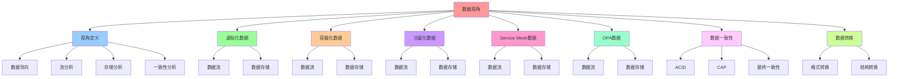

# 数据视角：数据流与存储

## 📑 目录

- [数据视角：数据流与存储](#数据视角数据流与存储)
  - [📑 目录](#-目录)
  - [1 概述](#1-概述)
    - [1.1 核心思想](#11-核心思想)
  - [2 数据视角定义](#2-数据视角定义)
    - [2.1 数据视角概念](#21-数据视角概念)
    - [2.2 数据视角特点](#22-数据视角特点)
  - [3 虚拟化数据](#3-虚拟化数据)
    - [3.1 虚拟化数据流](#31-虚拟化数据流)
    - [3.2 虚拟化数据存储](#32-虚拟化数据存储)
  - [4 容器化数据](#4-容器化数据)
    - [4.1 容器化数据流](#41-容器化数据流)
    - [4.2 容器化数据存储](#42-容器化数据存储)
  - [5 沙盒化数据](#5-沙盒化数据)
    - [5.1 沙盒化数据流](#51-沙盒化数据流)
    - [5.2 沙盒化数据存储](#52-沙盒化数据存储)
  - [6 Service Mesh 数据](#6-service-mesh-数据)
    - [6.1 Service Mesh 数据流](#61-service-mesh-数据流)
    - [6.2 Service Mesh 数据存储](#62-service-mesh-数据存储)
  - [7 OPA 数据](#7-opa-数据)
    - [7.1 OPA 数据流](#71-opa-数据流)
    - [7.2 OPA 数据存储](#72-opa-数据存储)
  - [8 数据一致性](#8-数据一致性)
    - [8.1 数据一致性保证](#81-数据一致性保证)
    - [8.2 数据一致性示例](#82-数据一致性示例)
  - [9 数据转换](#9-数据转换)
    - [9.1 数据转换模式](#91-数据转换模式)
    - [9.2 数据转换示例](#92-数据转换示例)
  - [10 形式化定义](#10-形式化定义)
    - [10.1 数据流定义](#101-数据流定义)
    - [10.2 数据存储定义](#102-数据存储定义)
  - [11 总结](#11-总结)

---

## 1 概述

本文档从**数据视角**阐述软件架构，重点关注数据流和存储。

### 1.1 核心思想

> **从数据视角理解系统，关注数据的流动、存储、转换，以及如何通过虚拟化、容器化、
> 沙盒化等技术管理数据**

## 2 数据视角定义

### 2.1 数据视角概念

**数据视角**关注数据流和存储，包括：

- **数据流**：数据在系统中的流动
- **数据存储**：数据的存储方式
- **数据转换**：数据的转换过程
- **数据一致性**：数据的一致性保证

### 2.2 数据视角特点

**数据视角特点**：

- **数据导向**：以数据为核心
- **流分析**：关注数据流
- **存储分析**：关注数据存储
- **一致性分析**：关注数据一致性

## 3 虚拟化数据

### 3.1 虚拟化数据流

**虚拟化数据流**：

```text
物理存储
  ↓
虚拟磁盘（虚拟化）
  ├── VM 磁盘镜像
  ├── 快照数据
  └── 迁移数据
  ↓
Guest OS
  ├── 文件系统
  └── 应用数据
```

### 3.2 虚拟化数据存储

**虚拟化数据存储**：

| 存储类型     | 说明        | 典型实现       |
| ------------ | ----------- | -------------- |
| **虚拟磁盘** | VM 虚拟磁盘 | qcow2、vmdk    |
| **快照存储** | VM 快照数据 | Snapshot       |
| **迁移数据** | VM 迁移数据 | Migration Data |

## 4 容器化数据

### 4.1 容器化数据流

**容器化数据流**：

```text
镜像仓库
  ↓
容器镜像（容器化）
  ├── 镜像层
  ├── 配置层
  └── 数据层
  ↓
容器运行时
  ├── 容器层（可写）
  └── 数据卷（持久化）
```

### 4.2 容器化数据存储

**容器化数据存储**：

| 存储类型     | 说明         | 典型实现         |
| ------------ | ------------ | ---------------- |
| **镜像存储** | 容器镜像存储 | OCI Image        |
| **容器层**   | 容器可写层   | OverlayFS        |
| **数据卷**   | 持久化数据卷 | Volume           |
| **配置数据** | 配置数据存储 | ConfigMap/Secret |

## 5 沙盒化数据

### 5.1 沙盒化数据流

**沙盒化数据流**：

```text
镜像仓库
  ↓
沙盒镜像（沙盒化）
  ├── 应用镜像
  ├── 沙盒配置
  └── 策略数据
  ↓
沙盒运行时
  ├── 沙盒层（隔离）
  └── 数据卷（持久化）
```

### 5.2 沙盒化数据存储

**沙盒化数据存储**：

| 存储类型     | 说明         | 典型实现      |
| ------------ | ------------ | ------------- |
| **沙盒镜像** | 沙盒镜像存储 | Sandbox Image |
| **策略数据** | 策略数据存储 | OPA Bundle    |
| **审计数据** | 审计数据存储 | Decision Log  |

## 6 Service Mesh 数据

### 6.1 Service Mesh 数据流

**Service Mesh 数据流**：

```text
应用数据
  ↓
Sidecar（流量拦截）
  ├── 请求数据
  ├── 响应数据
  └── 遥测数据
  ↓
控制平面
  ├── 配置数据
  ├── 服务发现数据
  └── 遥测数据
  ↓
Observability
  ├── Metrics
  ├── Logs
  └── Traces
```

### 6.2 Service Mesh 数据存储

**Service Mesh 数据存储**：

| 存储类型         | 说明         | 典型实现           |
| ---------------- | ------------ | ------------------ |
| **配置数据**     | 流量治理配置 | VirtualService/CRD |
| **遥测数据**     | 遥测数据存储 | Prometheus/Tempo   |
| **服务发现数据** | 服务发现数据 | Service Registry   |

## 7 OPA 数据

### 7.1 OPA 数据流

**OPA 数据流**：

```text
策略数据（Bundle）
  ↓
OPA 控制平面（分发）
  ├── 策略数据
  ├── 数据数据
  └── 元数据
  ↓
PDP（策略评估）
  ├── 输入数据
  ├── 策略规则
  └── 决策数据
  ↓
PEP（策略执行）
  ├── 决策数据
  └── 审计数据
  ↓
Decision Log（决策日志）
```

### 7.2 OPA 数据存储

**OPA 数据存储**：

| 存储类型     | 说明         | 典型实现     |
| ------------ | ------------ | ------------ |
| **Bundle**   | 策略包存储   | OPA Bundle   |
| **决策日志** | 决策日志存储 | Decision Log |
| **策略数据** | 策略数据存储 | Policy Data  |

## 8 数据一致性

### 8.1 数据一致性保证

**数据一致性保证**：

- **ACID**：事务的一致性保证
- **CAP**：分布式系统的一致性权衡
- **最终一致性**：最终一致性保证
- **强一致性**：强一致性保证

### 8.2 数据一致性示例

**镜像一致性**：

```text
镜像构建
  ↓
镜像签名
  ↓
镜像验证
  ↓
镜像一致性保证
```

**配置一致性**：

```text
配置定义（Git）
  ↓
配置同步（GitOps）
  ↓
配置应用（Kubernetes）
  ↓
配置一致性保证
```

## 9 数据转换

### 9.1 数据转换模式

**数据转换模式**：

- **格式转换**：数据格式转换
- **结构转换**：数据结构转换
- **编码转换**：数据编码转换
- **压缩转换**：数据压缩转换

### 9.2 数据转换示例

**镜像格式转换**：

```text
Docker Image
  ↓
OCI Image（格式转换）
  ↓
Container Runtime
```

**配置格式转换**：

```text
YAML Config
  ↓
Kubernetes CRD（格式转换）
  ↓
API Server
```

## 10 形式化定义

### 10.1 数据流定义

```text
数据流 D = ⟨source, sink, transformations, storage⟩
其中：
- source: 数据源
- sink: 数据汇
- transformations: 转换集合
- storage: 存储集合
```

### 10.2 数据存储定义

```text
数据存储 S = ⟨type, location, format, consistency⟩
其中：
- type: 存储类型
- location: 存储位置
- format: 存储格式
- consistency: 一致性保证
```

## 11 总结

通过**数据视角**，我们理解了：

1. **数据流**：数据在系统中的流动路径
2. **数据存储**：数据的存储方式和类型
3. **数据转换**：数据的转换过程和机制
4. **数据一致性**：数据的一致性保证机制
5. **数据管理**：数据的生命周期管理

---

---

## 12 认知增强：思维导图、知识矩阵与专家观点

### 12.1 数据视角完整思维导图



### 12.2 知识多维关系矩阵

#### 技术栈数据多维关系矩阵

| 数据维度 | 虚拟化 | 容器化 | 沙盒化 | Service Mesh | OPA | 数据协同 | 认知价值 |
|---------|--------|--------|--------|-------------|-----|---------|---------|
| **数据流** | 物理存储→虚拟磁盘→Guest OS | 镜像仓库→容器镜像→容器运行时 | 镜像仓库→沙盒镜像→沙盒运行时 | 应用数据→Sidecar→控制平面→Observability | 策略数据→OPA控制平面→PDP→PEP→Decision Log | 流对比 | 流理解 |
| **数据存储** | 虚拟磁盘、快照存储、迁移数据 | 镜像存储、容器层、数据卷、配置数据 | 沙盒镜像、策略数据、审计数据 | 配置数据、遥测数据、服务发现数据 | Bundle、决策日志、策略数据 | 存储对比 | 存储理解 |
| **数据转换** | 格式转换、结构转换 | 格式转换、结构转换 | 格式转换、结构转换 | 格式转换、结构转换 | 格式转换、结构转换 | 转换对比 | 转换理解 |
| **数据一致性** | ACID、CAP | ACID、CAP、最终一致性 | ACID、CAP、最终一致性 | ACID、CAP、最终一致性 | ACID、CAP、最终一致性 | 一致性对比 | 一致性理解 |
| **数据演进** | 第一代 | 第二代 | 第三代 | 第四代 | 第五代 | 演进对比 | 演进理解 |
| **学习难度** | ⭐⭐⭐ | ⭐⭐⭐ | ⭐⭐⭐⭐ | ⭐⭐⭐⭐ | ⭐⭐⭐⭐ | ⭐⭐⭐⭐ | 渐进学习 |
| **专家推荐** | ⭐⭐⭐⭐⭐ | ⭐⭐⭐⭐⭐ | ⭐⭐⭐⭐⭐ | ⭐⭐⭐⭐⭐ | ⭐⭐⭐⭐⭐ | ⭐⭐⭐⭐⭐ | 技术深度 |

#### 数据一致性保证多维关系矩阵

| 一致性维度 | ACID | CAP | 最终一致性 | 强一致性 | 一致性协同 | 认知价值 |
|---------|------|-----|----------|---------|---------|---------|
| **定义** | 事务一致性 | 分布式系统一致性权衡 | 最终一致性保证 | 强一致性保证 | 定义对比 | 定义理解 |
| **适用场景** | 事务场景 | 分布式系统 | 分布式系统 | 强一致性场景 | 场景对比 | 场景理解 |
| **典型实现** | 数据库事务 | 分布式数据库 | 分布式系统 | 强一致性数据库 | 实现对比 | 实现理解 |
| **架构收益** | 事务一致性 | 一致性权衡 | 最终一致性 | 强一致性 | 收益对比 | 收益理解 |
| **学习难度** | ⭐⭐⭐ | ⭐⭐⭐⭐ | ⭐⭐⭐⭐ | ⭐⭐⭐⭐ | ⭐⭐⭐⭐ | 渐进学习 |
| **专家推荐** | ⭐⭐⭐⭐⭐ | ⭐⭐⭐⭐⭐ | ⭐⭐⭐⭐⭐ | ⭐⭐⭐⭐⭐ | ⭐⭐⭐⭐⭐ | 技术深度 |

### 12.3 形象化解释论证

#### 数据视角的形象化类比

##### 1. 数据视角 = 物流视角

> **类比**：数据视角就像物流视角，数据流像物流流动（数据在系统中的流动），数据存储像物流仓储（数据的存储方式），数据转换像物流转换（数据的转换过程），就像物流视角关注物流的流动，而不是物流的结构一样。

**认知价值**：

- **视角理解**：通过物流视角类比，理解数据视角的含义
- **流理解**：通过物流流动类比，理解数据流的重要性
- **存储理解**：通过物流仓储类比，理解数据存储的作用

##### 2. 数据流 = 河流流动

> **类比**：数据流就像河流流动，数据源像河流源头（数据源），数据汇像河流汇入（数据汇），数据转换像河流转换（数据的转换过程），就像河流流动将复杂数据流分解为流动，通过流动实现数据表达一样。

**认知价值**：

- **流理解**：通过河流流动类比，理解数据流的含义
- **源理解**：通过河流源头类比，理解数据源的重要性
- **转换理解**：通过河流转换类比，理解数据转换的作用

##### 3. 数据存储 = 图书馆存储

> **类比**：数据存储就像图书馆存储，存储类型像图书分类（数据的存储类型），存储位置像图书位置（数据的存储位置），存储格式像图书格式（数据的存储格式），就像图书馆存储将复杂数据存储分解为存储，通过存储实现数据管理一样。

**认知价值**：

- **存储理解**：通过图书馆存储类比，理解数据存储的含义
- **类型理解**：通过图书分类类比，理解存储类型的重要性
- **格式理解**：通过图书格式类比，理解存储格式的作用

##### 4. 数据一致性 = 合同一致性

> **类比**：数据一致性就像合同一致性，ACID像合同条款（事务的一致性保证），CAP像合同权衡（分布式系统的一致性权衡），最终一致性像合同最终确认（最终一致性保证），就像合同一致性将复杂数据一致性分解为一致性，通过一致性实现数据保证一样。

**认知价值**：

- **一致性理解**：通过合同一致性类比，理解数据一致性的含义
- **保证理解**：通过合同条款类比，理解数据一致性保证的重要性
- **权衡理解**：通过合同权衡类比，理解数据一致性权衡的作用

##### 5. 数据转换 = 翻译转换

> **类比**：数据转换就像翻译转换，格式转换像语言转换（数据格式转换），结构转换像结构转换（数据结构转换），编码转换像编码转换（数据编码转换），就像翻译转换将复杂数据转换分解为转换，通过转换实现数据表达一样。

**认知价值**：

- **转换理解**：通过翻译转换类比，理解数据转换的含义
- **格式理解**：通过语言转换类比，理解格式转换的重要性
- **结构理解**：通过结构转换类比，理解结构转换的作用

### 12.4 专家观点与论证

#### 计算信息软件科学家的观点

##### 1. Jim Gray（数据库系统专家）

> **观点**："Data is the new oil."（数据是新的石油）

**与数据视角的关联**：

- **数据理解**：数据视角体现了数据的重要性（数据流、数据存储、数据转换）
- **价值理解**：通过数据视角理解数据的价值（数据即价值）
- **系统理解**：通过数据视角理解数据系统的复杂性（数据流、数据存储、数据一致性）

##### 2. Eric Brewer（CAP定理）

> **观点**："Consistency, Availability, Partition tolerance: pick two."（一致性、可用性、分区容错：选择两个）

**与数据视角的关联**：

- **一致性理解**：数据视角体现了CAP定理的思想（数据一致性、数据可用性、数据分区容错）
- **权衡理解**：通过数据视角理解数据一致性的权衡（ACID、CAP、最终一致性）
- **系统理解**：通过数据视角理解分布式系统的数据一致性

##### 3. Pat Helland（数据系统专家）

> **观点**："Data is the new oil, but data quality is the new gold."（数据是新的石油，但数据质量是新的黄金）

**与数据视角的关联**：

- **质量理解**：数据视角体现了数据质量的重要性（数据一致性、数据转换）
- **价值理解**：通过数据视角理解数据质量的价值（数据质量即价值）
- **系统理解**：通过数据视角理解数据质量系统的复杂性（数据一致性、数据转换）

#### 计算信息软件教育家的观点

##### 1. Robert C. Martin（《代码整洁之道》作者）

> **观点**："The only way to go fast is to go well."（快速前进的唯一方法是做好）

**与数据视角的关联**：

- **质量理解**：数据视角体现了架构质量（数据导向、流分析、存储分析、一致性分析）
- **速度理解**：通过数据视角理解速度与质量的权衡（数据流vs数据存储）
- **实践理解**：通过数据视角指导实践，选择"做好"的架构

##### 2. Martin Fowler（重构之父）

> **观点**："Any fool can write code that a computer can understand. Good programmers write code that humans can understand."（任何傻瓜都能编写计算机能理解的代码。好的程序员编写人类能理解的代码）

**与数据视角的关联**：

- **可理解性理解**：数据视角通过数据导向、流分析提高可理解性
- **人类理解**：通过数据视角理解架构的人类可理解性（清晰的数据流、明确的数据存储）
- **选择理解**：通过数据视角选择"人类能理解"的架构

#### 计算信息软件认知学家的观点

##### 1. Donald Norman（《设计心理学》作者）

> **观点**："The real problem with the interface is that it is an interface. Interfaces get in the way. I don't want to focus my energies on an interface. I want to focus on the job."（界面的真正问题是它是界面。界面会妨碍。我不想把精力集中在界面上。我想专注于工作）

**与数据视角的关联**：

- **接口理解**：数据视角体现了数据接口的重要性（数据流接口、数据存储接口），但也要避免过度关注接口
- **工作理解**：通过数据视角专注于架构工作（数据导向、流分析），而不是过度关注接口细节
- **平衡理解**：通过数据视角理解接口与工作的平衡

##### 2. Herbert A. Simon（认知科学家）

> **观点**："A wealth of information creates a poverty of attention."（信息丰富导致注意力贫乏）

**与数据视角的关联**：

- **注意力理解**：数据视角通过数据导向、流分析管理注意力，避免信息过载
- **结构化理解**：通过数据视角结构化信息（数据流、数据存储），减少认知负荷
- **管理理解**：通过数据视角管理信息，避免注意力贫乏

### 12.5 认知学习路径矩阵

| 学习阶段 | 推荐内容 | 推荐技术栈 | 学习重点 | 学习时间 | 前置要求 | 后续进阶 |
|---------|---------|-----------|---------|---------|---------|---------|
| **新手阶段** | 概述、视角定义 | 数据视角概念理解 | 视角理解、基本概念理解 | 1-2周 | 无 | 进阶阶段 |
| **进阶阶段** | 虚拟化、容器化、沙盒化数据 | 虚拟化、容器化、沙盒化 | 数据理解、技术栈理解 | 4-8周 | 新手阶段 | 专家阶段 |
| **专家阶段** | Service Mesh、OPA数据、数据一致性、数据转换 | 完整技术栈 | 数据一致性理解、数据转换理解 | 16+周 | 进阶阶段 | - |

### 12.6 专家推荐阅读路径

**路径1：视角理解路径**：

1. **第一步**：阅读概述（第1节），理解数据视角概览
2. **第二步**：阅读视角定义（第2节），理解数据导向、流分析、存储分析、一致性分析
3. **第三步**：阅读数据一致性（第8节），理解数据一致性保证
4. **第四步**：阅读总结（第11节），回顾关键要点

**路径2：技术栈理解路径**：

1. **第一步**：阅读概述（第1节），了解数据视角
2. **第二步**：阅读虚拟化、容器化、沙盒化数据（第3-5节），学习技术栈数据
3. **第三步**：阅读Service Mesh、OPA数据（第6-7节），学习高级数据
4. **第四步**：阅读数据一致性（第8节），学习数据一致性方法

**路径3：数据转换理解路径**：

1. **第一步**：阅读概述（第1节），了解数据视角
2. **第二步**：阅读数据转换（第9节），理解数据转换模式
3. **第三步**：阅读数据一致性（第8节），理解数据转换与数据一致性的关系
4. **第四步**：阅读总结（第11节），学习数据转换最佳实践

---

**更新时间**：2025-11-15 **版本**：v1.1 **参考**：`architecture_view.md` 数据视角部分

**更新内容（v1.1）**：

- ✅ 添加认知增强章节（思维导图、知识矩阵、形象化解释、专家观点）
- ✅ 添加认知学习路径矩阵
- ✅ 添加专家推荐阅读路径（3条路径）
