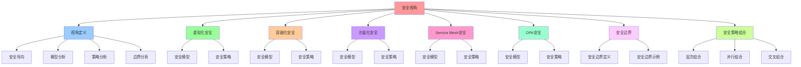

# 安全视角：安全模型与策略

## 📑 目录

- [安全视角：安全模型与策略](#安全视角安全模型与策略)
  - [📑 目录](#-目录)
  - [1 概述](#1-概述)
    - [1.1 核心思想](#11-核心思想)
  - [2 安全视角定义](#2-安全视角定义)
    - [2.1 安全视角概念](#21-安全视角概念)
    - [2.2 安全视角特点](#22-安全视角特点)
  - [3 虚拟化安全](#3-虚拟化安全)
    - [3.1 虚拟化安全模型](#31-虚拟化安全模型)
    - [3.2 虚拟化安全策略](#32-虚拟化安全策略)
  - [4 容器化安全](#4-容器化安全)
    - [4.1 容器化安全模型](#41-容器化安全模型)
    - [4.2 容器化安全策略](#42-容器化安全策略)
  - [5 沙盒化安全](#5-沙盒化安全)
    - [5.1 沙盒化安全模型](#51-沙盒化安全模型)
    - [5.2 沙盒化安全策略](#52-沙盒化安全策略)
  - [6 Service Mesh 安全](#6-service-mesh-安全)
    - [6.1 Service Mesh 安全模型](#61-service-mesh-安全模型)
    - [6.2 Service Mesh 安全策略](#62-service-mesh-安全策略)
  - [7 OPA 安全](#7-opa-安全)
    - [7.1 OPA 安全模型](#71-opa-安全模型)
    - [7.2 OPA 安全策略](#72-opa-安全策略)
  - [8 安全边界](#8-安全边界)
    - [8.1 安全边界定义](#81-安全边界定义)
    - [8.2 安全边界示例](#82-安全边界示例)
  - [9 安全策略组合](#9-安全策略组合)
    - [9.1 安全策略组合方式](#91-安全策略组合方式)
    - [9.2 安全策略组合示例](#92-安全策略组合示例)
  - [10 形式化定义](#10-形式化定义)
    - [10.1 安全模型定义](#101-安全模型定义)
    - [10.2 安全策略定义](#102-安全策略定义)
  - [11 总结](#11-总结)

---

## 1 概述

本文档从**安全视角**阐述软件架构，重点关注安全模型和策略。

### 1.1 核心思想

> **从安全视角理解系统，关注安全模型、安全策略、安全边界，以及如何通过虚拟化、容
> 器化、沙盒化等技术实现安全**

## 2 安全视角定义

### 2.1 安全视角概念

**安全视角**关注安全模型和策略，包括：

- **安全模型**：系统的安全模型
- **安全策略**：系统的安全策略
- **安全边界**：系统的安全边界
- **安全审计**：安全审计和日志

### 2.2 安全视角特点

**安全视角特点**：

- **安全导向**：以安全为核心
- **模型分析**：关注安全模型
- **策略分析**：关注安全策略
- **边界分析**：关注安全边界

## 3 虚拟化安全

### 3.1 虚拟化安全模型

**虚拟化安全模型**：

| 安全机制     | 说明                 | 典型实现     |
| ------------ | -------------------- | ------------ |
| **硬件隔离** | 虚拟机之间的硬件隔离 | VM 隔离      |
| **内存隔离** | 虚拟机之间的内存隔离 | 内存隔离     |
| **网络隔离** | 虚拟机之间的网络隔离 | 虚拟网络隔离 |
| **可信根**   | 可信根（TEE）        | SGX、TPM     |

### 3.2 虚拟化安全策略

**虚拟化安全策略**：

- **最小权限**：VM 最小权限原则
- **资源限制**：VM 资源限制
- **访问控制**：VM 访问控制
- **审计日志**：VM 操作审计

## 4 容器化安全

### 4.1 容器化安全模型

**容器化安全模型**：

| 安全机制     | 说明               | 典型实现       |
| ------------ | ------------------ | -------------- |
| **进程隔离** | 容器进程之间的隔离 | Namespace      |
| **资源限制** | 容器资源限制       | Cgroup         |
| **镜像签名** | 容器镜像签名和验证 | Image Signing  |
| **网络策略** | 容器网络策略       | Network Policy |

### 4.2 容器化安全策略

**容器化安全策略**：

- **最小权限**：容器最小权限原则
- **只读根文件系统**：只读根文件系统
- **非 root 用户**：非 root 用户运行
- **镜像扫描**：镜像漏洞扫描

## 5 沙盒化安全

### 5.1 沙盒化安全模型

**沙盒化安全模型**：

| 安全机制         | 说明                  | 典型实现     |
| ---------------- | --------------------- | ------------ |
| **系统调用过滤** | 系统调用的过滤和限制  | Seccomp-BPF  |
| **文件系统隔离** | 文件系统访问控制      | OverlayFS    |
| **能力限制**     | Linux Capability 限制 | Capability   |
| **最小能力闭包** | 最小能力闭包验证      | OPA + gVisor |

### 5.2 沙盒化安全策略

**沙盒化安全策略**：

- **最小权限**：沙盒最小权限原则
- **能力闭包**：能力闭包验证
- **系统调用白名单**：系统调用白名单
- **安全审计**：安全审计和日志

## 6 Service Mesh 安全

### 6.1 Service Mesh 安全模型

**Service Mesh 安全模型**：

| 安全机制     | 说明               | 典型实现            |
| ------------ | ------------------ | ------------------- |
| **mTLS**     | 双向 TLS 加密      | Istio mTLS          |
| **身份认证** | SPIFFE 身份认证    | SPIFFE/SPIRE        |
| **授权策略** | 基于身份的授权策略 | AuthorizationPolicy |
| **流量加密** | 流量加密和完整性   | TLS                 |

### 6.2 Service Mesh 安全策略

**Service Mesh 安全策略**：

- **零信任网络**：零信任网络模型
- **身份驱动**：基于身份的网络拓扑
- **策略即代码**：策略即代码管理
- **安全审计**：安全审计和日志

## 7 OPA 安全

### 7.1 OPA 安全模型

**OPA 安全模型**：

| 安全机制       | 说明             | 典型实现     |
| -------------- | ---------------- | ------------ |
| **策略决策**   | 策略的评估和决策 | PDP          |
| **策略执行**   | 策略的执行和审计 | PEP          |
| **策略版本化** | 策略的版本管理   | Bundle       |
| **决策审计**   | 决策的审计和日志 | Decision Log |

### 7.2 OPA 安全策略

**OPA 安全策略**：

- **最小权限**：最小权限原则
- **策略即代码**：策略即代码管理
- **策略测试**：策略的单元测试
- **策略验证**：策略的形式化验证

## 8 安全边界

### 8.1 安全边界定义

**安全边界定义**：

```text
硬件层
  ├── 可信根（TEE）
  └── 硬件隔离
  ↓
虚拟化层
  ├── VM 隔离
  └── 虚拟网络隔离
  ↓
容器化层
  ├── Namespace 隔离
  └── Cgroup 限制
  ↓
沙盒化层
  ├── Seccomp-BPF 过滤
  └── Capability 限制
  ↓
Service Mesh 层
  ├── mTLS 加密
  └── 授权策略
  ↓
OPA 层
  ├── 策略决策
  └── 决策审计
```

### 8.2 安全边界示例

**双层闸门**：

```text
编译期（OPA）
  ├── Admission 验证
  └── 策略评估
  ↓
运行期（Seccomp-BPF）
  ├── 系统调用过滤
  └── 能力限制
```

## 9 安全策略组合

### 9.1 安全策略组合方式

**安全策略组合方式**：

- **层次组合**：按层次组合安全策略
- **并行组合**：并行组合安全策略
- **交叉组合**：交叉组合安全策略
- **嵌套组合**：嵌套组合安全策略

### 9.2 安全策略组合示例

**虚拟化 + 容器化安全组合**：

```text
VM 隔离
  ├── 硬件隔离
  └── 内存隔离
      ↓
Container 隔离
  ├── Namespace 隔离
  └── Cgroup 限制
```

**容器化 + 沙盒化安全组合**：

```text
Container 隔离
  ├── Namespace 隔离
  └── Cgroup 限制
      ↓
Sandbox 隔离
  ├── Seccomp-BPF 过滤
  └── Capability 限制
```

## 10 形式化定义

### 10.1 安全模型定义

```text
安全模型 M = ⟨mechanisms, policies, boundaries, audit⟩
其中：
- mechanisms: 安全机制集合
- policies: 安全策略集合
- boundaries: 安全边界集合
- audit: 审计机制集合
```

### 10.2 安全策略定义

```text
安全策略 P = ⟨name, type, rules, enforcement⟩
其中：
- name: 策略名称
- type: 策略类型
- rules: 规则集合
- enforcement: 执行机制
```

## 11 总结

通过**安全视角**，我们理解了：

1. **安全模型**：每个技术栈的安全模型
2. **安全策略**：系统的安全策略和规则
3. **安全边界**：系统的安全边界定义
4. **安全组合**：安全策略的组合方式
5. **安全演进**：安全从虚拟化到容器化到沙盒化的演进

---

---

## 12 认知增强：思维导图、知识矩阵与专家观点

### 12.1 安全视角完整思维导图



### 12.2 知识多维关系矩阵

#### 技术栈安全多维关系矩阵

| 安全维度 | 虚拟化 | 容器化 | 沙盒化 | Service Mesh | OPA | 安全协同 | 认知价值 |
|---------|--------|--------|--------|-------------|-----|---------|---------|
| **安全模型** | 硬件隔离、内存隔离、网络隔离 | 进程隔离、资源限制、镜像签名 | 系统调用过滤、文件系统隔离、能力限制 | mTLS、身份认证、授权策略、流量加密 | 策略决策、策略执行、策略版本化、决策审计 | 模型对比 | 模型理解 |
| **安全策略** | 最小权限、资源限制、访问控制、审计日志 | 最小权限、只读根文件系统、非root用户、镜像扫描 | 最小权限、能力闭包、系统调用白名单、安全审计 | 零信任网络、身份驱动、策略即代码、安全审计 | 最小权限、策略即代码、策略测试、策略验证 | 策略对比 | 策略理解 |
| **安全边界** | 硬件层→虚拟化层 | 虚拟化层→容器化层 | 容器化层→沙盒化层 | 沙盒化层→Service Mesh层 | Service Mesh层→OPA层 | 边界对比 | 边界理解 |
| **安全演进** | 第一代 | 第二代 | 第三代 | 第四代 | 第五代 | 演进对比 | 演进理解 |
| **学习难度** | ⭐⭐⭐ | ⭐⭐⭐ | ⭐⭐⭐⭐ | ⭐⭐⭐⭐ | ⭐⭐⭐⭐ | ⭐⭐⭐⭐ | 渐进学习 |
| **专家推荐** | ⭐⭐⭐⭐⭐ | ⭐⭐⭐⭐⭐ | ⭐⭐⭐⭐⭐ | ⭐⭐⭐⭐⭐ | ⭐⭐⭐⭐⭐ | ⭐⭐⭐⭐⭐ | 技术深度 |

#### 安全策略组合方式多维关系矩阵

| 组合维度 | 层次组合 | 并行组合 | 交叉组合 | 嵌套组合 | 组合协同 | 认知价值 |
|---------|---------|---------|---------|---------|---------|---------|
| **组合方式** | 按层次组合安全策略 | 并行组合安全策略 | 交叉组合安全策略 | 嵌套组合安全策略 | 方式对比 | 方式理解 |
| **适用场景** | 分层架构 | 独立安全策略 | 横切安全关注点 | 复杂安全系统 | 场景对比 | 场景理解 |
| **典型示例** | 虚拟化+容器化安全 | 多安全策略并行 | OPA横切 | 容器内沙盒安全 | 示例对比 | 示例理解 |
| **架构收益** | 层次清晰 | 性能提升 | 关注点分离 | 灵活组合 | 收益对比 | 收益理解 |
| **学习难度** | ⭐⭐⭐ | ⭐⭐⭐ | ⭐⭐⭐⭐ | ⭐⭐⭐⭐ | ⭐⭐⭐⭐ | 渐进学习 |
| **专家推荐** | ⭐⭐⭐⭐⭐ | ⭐⭐⭐⭐⭐ | ⭐⭐⭐⭐⭐ | ⭐⭐⭐⭐⭐ | ⭐⭐⭐⭐⭐ | 技术深度 |

### 12.3 形象化解释论证

#### 安全视角的形象化类比

##### 1. 安全视角 = 安保视角

> **类比**：安全视角就像安保视角，安全模型像安保系统（系统的安全模型），安全策略像安保规则（系统的安全策略），安全边界像安保边界（系统的安全边界），就像安保视角关注安保的系统，而不是安保的功能一样。

**认知价值**：

- **视角理解**：通过安保视角类比，理解安全视角的含义
- **模型理解**：通过安保系统类比，理解安全模型的重要性
- **策略理解**：通过安保规则类比，理解安全策略的作用

##### 2. 安全边界 = 多层防护墙

> **类比**：安全边界就像多层防护墙，硬件层像第一层防护墙（硬件隔离），虚拟化层像第二层防护墙（VM隔离），容器化层像第三层防护墙（Namespace隔离），就像多层防护墙将复杂安全边界分解为层次，通过层次实现安全保护一样。

**认知价值**：

- **边界理解**：通过多层防护墙类比，理解安全边界的含义
- **层次理解**：通过防护墙层次类比，理解安全边界层次的重要性
- **保护理解**：通过防护墙保护类比，理解安全边界保护的作用

##### 3. 安全策略 = 安全规则手册

> **类比**：安全策略就像安全规则手册，最小权限像安全规则（最小权限原则），访问控制像安全规则（访问控制规则），审计日志像安全规则（审计日志规则），就像安全规则手册将复杂安全策略分解为规则，通过规则实现安全管理一样。

**认知价值**：

- **策略理解**：通过安全规则手册类比，理解安全策略的含义
- **规则理解**：通过安全规则类比，理解安全策略规则的重要性
- **管理理解**：通过规则管理类比，理解安全策略管理的作用

##### 4. 安全组合 = 多层防护系统

> **类比**：安全组合就像多层防护系统，层次组合像防护层次（按层次组合），并行组合像防护并行（并行组合），交叉组合像防护交叉（交叉组合），就像多层防护系统将复杂安全组合分解为组合，通过组合实现安全保护一样。

**认知价值**：

- **组合理解**：通过多层防护系统类比，理解安全组合的含义
- **方式理解**：通过防护方式类比，理解安全组合的不同方式（层次、并行、交叉）
- **保护理解**：通过防护保护类比，理解安全组合的作用

##### 5. 安全演进 = 安全技术升级

> **类比**：安全演进就像安全技术升级，虚拟化像第一代安全技术（硬件隔离），容器化像第二代安全技术（进程隔离），沙盒化像第三代安全技术（系统调用过滤），就像安全技术升级将安全从简单到复杂，通过演进实现安全提升一样。

**认知价值**：

- **演进理解**：通过安全技术升级类比，理解安全演进的趋势（从虚拟化到沙盒化）
- **提升理解**：通过安全提升类比，理解安全演进的价值
- **趋势理解**：通过技术趋势类比，理解安全演进的未来方向

### 12.4 专家观点与论证

#### 计算信息软件科学家的观点

##### 1. Bruce Schneier（密码学和安全专家）

> **观点**："Security is a process, not a product."（安全是一个过程，而不是一个产品）

**与安全视角的关联**：

- **过程理解**：安全视角体现了安全过程的重要性（安全模型、安全策略、安全边界）
- **产品理解**：通过安全视角理解安全产品的局限性（安全不是产品，而是过程）
- **系统理解**：通过安全视角理解安全系统的过程性（安全模型、安全策略、安全边界）

##### 2. Ross Anderson（安全工程专家）

> **观点**："Security is not a product but a process."（安全不是产品，而是过程）

**与安全视角的关联**：

- **过程理解**：安全视角体现了安全过程的重要性（安全模型、安全策略、安全边界）
- **产品理解**：通过安全视角理解安全产品的局限性（安全不是产品，而是过程）
- **系统理解**：通过安全视角理解安全系统的过程性（安全模型、安全策略、安全边界）

##### 3. Saltzer & Schroeder（安全设计原则）

> **观点**："Security should be designed in, not bolted on."（安全应该被设计进去，而不是被附加上去）

**与安全视角的关联**：

- **设计理解**：安全视角体现了安全设计的重要性（安全模型、安全策略、安全边界）
- **附加理解**：通过安全视角理解安全附加的局限性（安全应该被设计进去）
- **系统理解**：通过安全视角理解安全系统的设计性（安全模型、安全策略、安全边界）

#### 计算信息软件教育家的观点

##### 1. Robert C. Martin（《代码整洁之道》作者）

> **观点**："The only way to go fast is to go well."（快速前进的唯一方法是做好）

**与安全视角的关联**：

- **质量理解**：安全视角体现了架构质量（安全导向、模型分析、策略分析、边界分析）
- **速度理解**：通过安全视角理解速度与质量的权衡（安全设计vs安全附加）
- **实践理解**：通过安全视角指导实践，选择"做好"的架构

##### 2. Martin Fowler（重构之父）

> **观点**："Any fool can write code that a computer can understand. Good programmers write code that humans can understand."（任何傻瓜都能编写计算机能理解的代码。好的程序员编写人类能理解的代码）

**与安全视角的关联**：

- **可理解性理解**：安全视角通过安全导向、模型分析提高可理解性
- **人类理解**：通过安全视角理解架构的人类可理解性（清晰的安全模型、明确的安全策略）
- **选择理解**：通过安全视角选择"人类能理解"的架构

#### 计算信息软件认知学家的观点

##### 1. Donald Norman（《设计心理学》作者）

> **观点**："The real problem with the interface is that it is an interface. Interfaces get in the way. I don't want to focus my energies on an interface. I want to focus on the job."（界面的真正问题是它是界面。界面会妨碍。我不想把精力集中在界面上。我想专注于工作）

**与安全视角的关联**：

- **接口理解**：安全视角体现了安全接口的重要性（安全模型接口、安全策略接口），但也要避免过度关注接口
- **工作理解**：通过安全视角专注于架构工作（安全导向、模型分析），而不是过度关注接口细节
- **平衡理解**：通过安全视角理解接口与工作的平衡

##### 2. Herbert A. Simon（认知科学家）

> **观点**："A wealth of information creates a poverty of attention."（信息丰富导致注意力贫乏）

**与安全视角的关联**：

- **注意力理解**：安全视角通过安全导向、模型分析管理注意力，避免信息过载
- **结构化理解**：通过安全视角结构化信息（安全模型、安全策略），减少认知负荷
- **管理理解**：通过安全视角管理信息，避免注意力贫乏

### 12.5 认知学习路径矩阵

| 学习阶段 | 推荐内容 | 推荐技术栈 | 学习重点 | 学习时间 | 前置要求 | 后续进阶 |
|---------|---------|-----------|---------|---------|---------|---------|
| **新手阶段** | 概述、视角定义 | 安全视角概念理解 | 视角理解、基本概念理解 | 1-2周 | 无 | 进阶阶段 |
| **进阶阶段** | 虚拟化、容器化、沙盒化安全 | 虚拟化、容器化、沙盒化 | 安全理解、技术栈理解 | 4-8周 | 新手阶段 | 专家阶段 |
| **专家阶段** | Service Mesh、OPA安全、安全边界、安全策略组合 | 完整技术栈 | 安全边界理解、安全策略组合理解 | 16+周 | 进阶阶段 | - |

### 12.6 专家推荐阅读路径

**路径1：视角理解路径**：

1. **第一步**：阅读概述（第1节），理解安全视角概览
2. **第二步**：阅读视角定义（第2节），理解安全导向、模型分析、策略分析、边界分析
3. **第三步**：阅读安全边界（第8节），理解安全边界定义
4. **第四步**：阅读总结（第11节），回顾关键要点

**路径2：技术栈理解路径**：

1. **第一步**：阅读概述（第1节），了解安全视角
2. **第二步**：阅读虚拟化、容器化、沙盒化安全（第3-5节），学习技术栈安全
3. **第三步**：阅读Service Mesh、OPA安全（第6-7节），学习高级安全
4. **第四步**：阅读安全策略组合（第9节），学习安全策略组合方法

**路径3：安全边界理解路径**：

1. **第一步**：阅读概述（第1节），了解安全视角
2. **第二步**：阅读安全边界（第8节），理解安全边界定义
3. **第三步**：阅读安全策略组合（第9节），理解安全边界与安全策略组合的关系
4. **第四步**：阅读总结（第11节），学习安全边界最佳实践

---

**更新时间**：2025-11-15 **版本**：v1.1 **参考**：`architecture_view.md` 安全视角部分

**更新内容（v1.1）**：

- ✅ 添加认知增强章节（思维导图、知识矩阵、形象化解释、专家观点）
- ✅ 添加认知学习路径矩阵
- ✅ 添加专家推荐阅读路径（3条路径）
